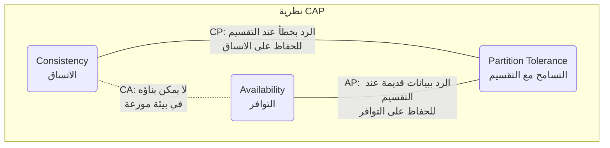
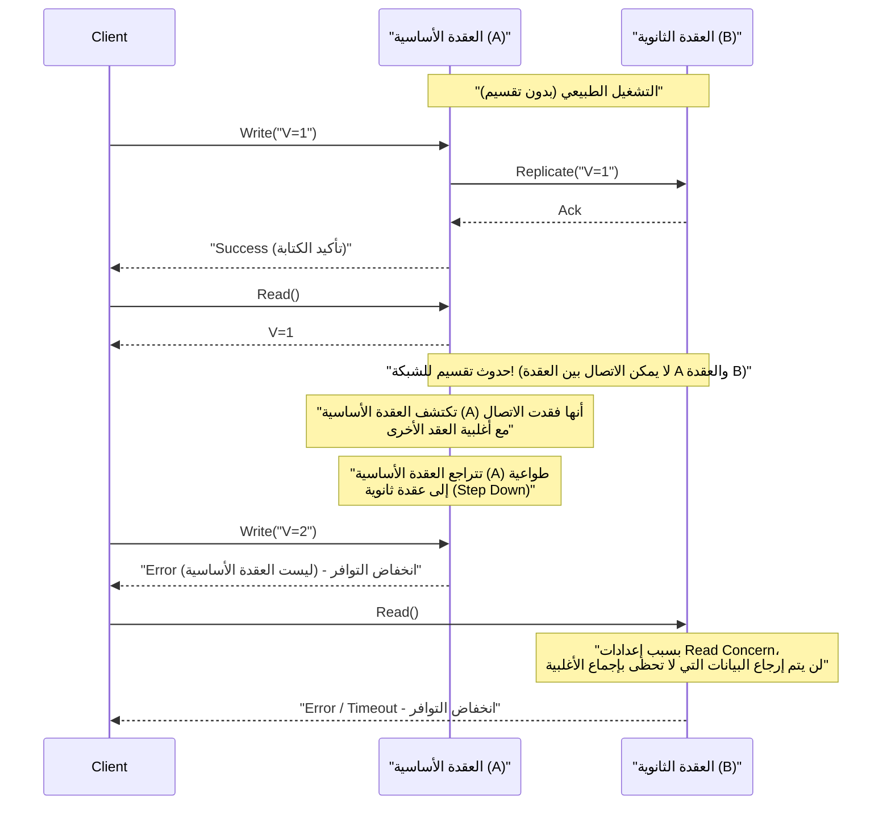
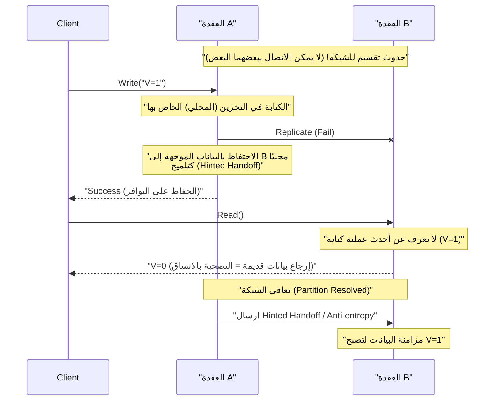

# نظرية CAP والأنظمة الموزعة (المفاضلة بين الاتساق، التوافر، التسامح مع التقسيم)

في خدمات الويب الحديثة وتطبيقات الشركات، أصبحت **الأنظمة الموزعة** (Distributed Systems) عنصرًا لا غنى عنه. من أجل التعامل مع الكم الهائل من حركة المرور والبيانات التي لا يمكن لخادم واحد معالجتها، أو لمنع توقف الخدمة بسبب تعطل الخادم، يتم ربط عقد متعددة (خوادم) للعمل كنظام واحد.

ومع ذلك، هناك قانون مطلق لا مفر منه عند تصميم الأنظمة الموزعة. وهو **نظرية CAP** (CAP Theorem). في هذا المقال، سنشرح بشكل شامل وتفصيلي نظرية CAP، التي تشكل أساس تصميم الأنظمة الموزعة، بدءًا من تعريفها إلى خلفيتها الرياضية والمنطقية، نهج كل منتج من منتجات قواعد البيانات، وحتى التسوية في العالم الحقيقي، وهي **نظرية PACELC**.

## 1. تاريخ وخلفية نظرية CAP

تم اقتراح نظرية CAP في مؤتمر ACM PODC (مبادئ الحوسبة الموزعة) الذي عُقد في عام 2000 من قبل إريك بروور (Eric Brewer)، عالم الكمبيوتر في جامعة كاليفورنيا ببيركلي. نُشرت في البداية كـ "تخمين (Conjecture)" بناءً على قواعد التجربة، ولكن في عام 2002 أثبتها رياضيًا كل من سيث جيلبرت (Seth Gilbert) ونانسي لينش (Nancy Lynch) من معهد ماساتشوستس للتكنولوجيا (MIT)، وتم ترسيخها رسميًا كـ "نظرية (Theorem)".

تكمن الخلفية التي جعلت بروور يقترح هذه النظرية في الانتشار الهائل للإنترنت منذ أواخر التسعينيات. في ذلك الوقت، كان المهندسون المعماريون يحاولون الحفاظ على خصائص **[ACID](https://kenji.blog/ar/p/rdbms-transaction-acid-isolation-level-lock/)** (الذرية، الاتساق، العزل، المتانة) التي تمتلكها قواعد البيانات العلائقية ([RDBMS](https://kenji.blog/ar/p/rdbms-transaction-acid-isolation-level-lock/)) التقليدية التي تعمل على عقدة واحدة، كما هي حتى في البيئة الموزعة. ومع ذلك، أصبح من الواضح أنه من المستحيل تقريبًا توسيع نطاق النظام مع الحفاظ على خصائص ACID بالكامل في بيئة تتوزع فيها العقد جغرافيًا وتحدث فيها تأخيرات وأعطال في الشبكة بشكل روتيني.

أثبتت نظرية CAP من الناحية النظرية حقيقة أنه "لا يمكن جعل كل شيء مثاليًا" في نظام موزع، وأصبحت مبدأً توجيهيًا مهمًا يفرض على مصممي الأنظمة **مفاضلة (Trade-off)** (التضحية بشيء من أجل الحصول على شيء آخر).

## 2. التعريفات الصارمة لعناصر CAP الثلاثة

تنص نظرية CAP على أن "النظام الموزع يمكنه تلبية اثنتين على الأكثر من الضمانات الثلاثة التالية في نفس الوقت".

*   **C (Consistency: الاتساق)**
*   **A (Availability: التوافر)**
*   **P (Partition Tolerance: التسامح مع التقسيم)**

أولاً، دعونا نراجع التعريفات الصارمة لهذه الخصائص الثلاث في سياق الأنظمة الموزعة.

### 2.1. C: Consistency (الاتساق)

يعني **الاتساق** في نظرية CAP خاصية تنص على أنه "يمكن لجميع العملاء دائمًا قراءة نفس البيانات الأحدث، أو تلقي خطأ". أكاديميًا، هذا مفهوم قريب من القابلية للترتيب الخطي (Linearizability).

في الأنظمة الموزعة، يتم نسخ البيانات (Replication) إلى عدة عقد لتحسين التوافر والأداء. في نظام يضمن الاتساق، فور اكتمال كتابة تحديث للبيانات في عقدة ما، إذا حاول أي عميل آخر قراءة البيانات من أي عقدة، فيجب إرجاع أحدث نتيجة تحديث، أو (إذا لم تكن المزامنة قد تمت أو لا يمكن إرجاع البيانات الأحدث لأسباب أخرى) يتم إرجاع خطأ.

بمعنى آخر، يتطلب النظام بأكمله أن يتصرف كما لو كان "عقدة واحدة تحتفظ بالبيانات الأحدث فقط". لا يُسمح للعميل أبدًا بقراءة **بيانات قديمة (Stale Data)**.

### 2.2. A: Availability (التوافر)

يعني **التوافر** في نظرية CAP خاصية تنص على أن "جميع العقد العاملة التي لم تفشل، سترجع دائمًا استجابة طبيعية (استجابة بدون خطأ) خلال فترة زمنية معقولة".

في نظام يضمن التوافر، حتى في حالة تعطل جزء من النظام (عقدة معينة أو خط شبكة)، طالما يمكن للعميل الوصول إلى عقدة سليمة باقية، سيعيد النظام دائمًا البيانات (حتى لو لم يكن هناك ضمان بأنها الأحدث). لا يُسمح للنظام بالرد بخطأ قائلاً "لا يمكن الاستجابة بسبب عدم اتساق داخلي" أو جعل العميل ينتظر انتهاء المهلة إلى ما لا نهاية كرد على طلب صالح من العميل. من الضروري دائمًا إرجاع "بعض الإجابات".

### 2.3. P: Partition Tolerance (التسامح مع التقسيم)

يعني **التسامح مع التقسيم** في نظرية CAP خاصية تنص على أنه "حتى في حالة انقطاع اتصال الشبكة بين العقد وانقسام النظام إلى مجموعات شبكة متعددة (أقسام) لا يمكنها التواصل، سيستمر النظام ككل في العمل (داخل كل شبكة مقسمة)".

في بيئات الشبكة الحقيقية، لا مفر من أن يتأخر الاتصال بين العقد أو يُفقد تمامًا بسبب فقدان الحزم، أو تعطل أجهزة التوجيه، أو الانقطاع المادي للكابلات، أو الأحمال الزائدة المؤقتة. نظرًا لأنه نظام موزع، يجب افتراض أن انقسام الشبكة هو **ظاهرة يمكن أن تحدث يوميًا وليس استثناءً**. لذلك، النظام الموزع الذي يتخلى عن P (التسامح مع التقسيم) ويفترض أن "الشبكة لن تنقطع أبدًا" لا يمكن أن يوجد في الواقع.

## 3. لماذا لا يمكن تلبية الثلاثة في نفس الوقت؟ (الإثبات والمنطق)

تؤكد نظرية CAP أنه من المستحيل منطقيًا تلبية كل من C و A و P في نفس الوقت. سنشرح جوهر الإثبات الذي قدمه جيلبرت ولينش باستخدام نموذج منطقي سهل الفهم.

تخيل نظامًا موزعًا بسيطًا يعتمد على نموذج شبكة غير متزامن كما يلي.
*   يتكون النظام من عقدتي بيانات: **العقدة 1 (Node 1)** و **العقدة 2 (Node 2)**.
*   كحالة أولية، قيمة متغير معين هي `V = 0`. تحتفظ كلتا العقدتين بهذه القيمة بشكل متزامن.

الآن، افترض حدوث **تقسيم للشبكة (Partition)** هنا. تم قطع مسار الاتصال بين العقدة 1 والعقدة 2 تمامًا، وأصبحا غير قادرين على إرسال واستقبال الرسائل من بعضهما البعض (هذا الموقف يختبر التسامح مع التقسيم P).

أثناء حدوث تقسيم الشبكة هذا، يرسل عميل طلب تحديث للقيمة `V = 1` إلى **العقدة 1**. تتلقى العقدة 1 الطلب وتقوم بتحديث البيانات `V` التي تمتلكها إلى `1`. ومع ذلك، لأن الشبكة مقطوعة، لا تستطيع العقدة 1 إرسال رسالة النسخ "تم تحديث V إلى 1" إلى العقدة 2.

مباشرة بعد ذلك، يرسل عميل آخر طلب قراءة `Read(V)` إلى **العقدة 2**.

في هذا الوقت، ما هو الإجراء الذي يجب أن يتخذه النظام (العقدة 2)؟ يجب على مصمم النظام اختيار أحد الخيارين التاليين.

### الخيار 1: نظام CP (إعطاء الأولوية للاتساق، والتضحية بالتوافر)

لا تملك العقدة 2 أي وسيلة لمعرفة ما إذا كانت البيانات التي تحتفظ بها `V = 0` هي الأحدث في النظام ككل (حتى لو حاولت الاستعلام من العقدة 1، فلا يمكنها الاتصال). إذا أرجعت `0` ببساطة هنا، فسترجع قيمة أقدم من أحدث قيمة `V = 1` التي كتبها عميل آخر للتو، وسيتم تدمير **الاتساق (C)** الخاص بالنظام.

من أجل الحفاظ على الاتساق بشكل صارم، يجب على العقدة 2 أن تقرر "لا يمكن الاستجابة لعدم وجود تأكيد على أن البيانات التي أملكها هي الأحدث"، والحل الوحيد هو إرجاع **خطأ** للعميل، أو **حظر (انتهاء المهلة)** الاستجابة حتى يتم استرداد الشبكة.
في اللحظة التي يتم فيها إرجاع خطأ، يكون النظام قد فشل في إرجاع استجابة طبيعية، وبالتالي يُفقد **التوافر (A)**.

### الخيار 2: نظام AP (إعطاء الأولوية للتوافر، والتضحية بالاتساق)

يجب على العقدة 2 عدم إرجاع خطأ للعميل، ويجب عليها دائمًا إرجاع استجابة طبيعية ما (للحفاظ على التوافر A). البيانات الوحيدة التي يمكن للعقدة 2 إرجاعها حاليًا هي القيمة القديمة التي تحتفظ بها `V = 0`.

إذا أرجعت العقدة 2 `0`، سيتلقى العميل استجابة طبيعية، ويتم الحفاظ على **التوافر (A)**. ومع ذلك، نظرًا لأنها تُرجع قيمة قديمة تتعارض مع أحدث قيمة `V = 1` التي تمت كتابتها بالفعل في العقدة 1، يتم فقدان **الاتساق (C)** الخاص بالنظام.

---

بهذه الطريقة، في ظل وجود القيد المادي المتمثل في تقسيم الشبكة (P)، يتضح أنه كضرورة منطقية يجب على النظام أن **يضحي إما بالاتساق (C) أو التوافر (A)**. هذا هو جوهر نظرية CAP.



غالبًا ما يُستخدم مصطلح "نظام CA (نظام يجمع بين الاتساق والتوافر وليس لديه تسامح مع التقسيم)"، ولكن هذا يشير إلى [RDBMS](https://kenji.blog/ar/p/rdbms-transaction-acid-isolation-level-lock/) القديمة التي تعمل على عقدة واحدة. نظرًا لعدم وجود تعاون بين العقد عبر الشبكة، فإن مفهوم تقسيم الشبكة لا ينشأ في المقام الأول. لذلك، **في نظام موزع حقيقي، لا يوجد خيار CA، وهو عمليًا خيار بين CP أو AP**.

## 4. أمثلة واقعية وسلوكيات مفصلة لأنظمة CP و AP

تختلف بنية منتجات قواعد البيانات وسلوكها عند حدوث تقسيم للشبكة اختلافًا كليًا اعتمادًا على خصائص نظرية CAP التي يعطيها النظام الأولوية. هنا، سنتعمق في المنتجات التمثيلية لأنظمة CP و AP وسلوكها المحدد باستخدام الرسوم البيانية المتسلسلة.

### 4.1. نظام CP (Consistency and Partition Tolerance)

نظام CP هو بنية **تعطي الأولوية المطلقة للاتساق** عند حدوث تقسيم للشبكة، ولتجنب خطر عدم اتساق البيانات (مثل ظاهرة الدماغ المنقسم Split-Brain)، فإنه يوقف (يضحي) بشكل جزئي أو كلي بـ **توافر** النظام.

**متاجر البيانات التمثيلية:**
*   HBase
*   [MongoDB](https://kenji.blog/ar/p/nosql-database-selection-kvs-document-graph-wide-column/)
*   [Redis](https://kenji.blog/ar/p/nosql-database-selection-kvs-document-graph-wide-column/) Cluster (حسب الإعدادات)
*   Etcd, Zookeeper (بدقة، هي أنظمة تستخدم خوارزمية إجماع موزعة)
*   Google Cloud Spanner (سيتم مناقشته لاحقًا، لكنه جوهريًا CP)

يتم اختياره لحالات الاستخدام حيث لا يُسمح باتخاذ قرارات خاطئة بناءً على قراءة بيانات قديمة (مما يؤدي مباشرة إلى خسارة مالية أو خطأ منطقي فادح)، مثل إدارة رصيد الحسابات المصرفية، وإدارة مخزون مواقع التجارة الإلكترونية، وأنظمة الدفع.

**سلوك نظام CP عند حدوث تقسيم للشبكة (مثال على Replica Set في MongoDB):**

تبني MongoDB مجموعة نسخ متماثلة تتكون من **عقدة أساسية واحدة (Primary)** و **عدة عقد ثانوية (Secondary)**. افتراضيًا، تتم جميع عمليات الكتابة والقراءة على العقدة الأساسية للحفاظ على الاتساق.



لنفترض حدوث انقسام في الشبكة، وأن عنقودًا مكونًا من 5 عقد انقسم إلى مجموعتين: مجموعة من "عقدتين (بما في ذلك العقدة الأساسية الحالية)" ومجموعة من "3 عقد". في هذا الوقت، فقدت المجموعة المكونة من عقدتين التي توجد بها العقدة الأساسية الحالية الأغلبية (Majority).
في نظام CP مثل [MongoDB](https://kenji.blog/ar/p/nosql-database-selection-kvs-document-graph-wide-column/)، لمنع عدم اتساق البيانات، تقوم العقدة الأساسية المتروكة في مجموعة الأقلية بالتراجع تلقائيًا (Step Down) إلى عقدة ثانوية. ثم تعمل خوارزمية انتخاب القائد الجديد (مثل Raft) داخل مجموعة الأغلبية المكونة من 3 عقد، ويتم اختيار عقدة أساسية جديدة.
خلال الثواني إلى العشرات من الثواني التي يتم فيها انتخاب القائد، أو بالنسبة لمجموعة الأقلية حيث لم يتم حل الانقسام، ستؤدي عمليات الكتابة إلى النظام (والقراءة اعتمادًا على الإعدادات) إلى حدوث خطأ، مما يؤدي إلى **انخفاض التوافر**. ومع ذلك، هذا يمنع الموقف الذي توجد فيه عقدتان أساسيتان في نفس الوقت وتقبلان عمليات كتابة منفصلة، مما يضمن **الحفاظ على الاتساق بقوة**.

### 4.2. نظام AP (Availability and Partition Tolerance)

نظام AP هو بنية **تعطي الأولوية القصوى للتوافر** حتى في حالة حدوث تقسيم للشبكة، وتستمر في توفير الوصول (القراءة والكتابة) إلى النظام في جميع الأوقات. ونتيجة لذلك، تحدث مؤقتًا حالة عدم مزامنة البيانات بين العقد (قراءة بيانات قديمة، أو تعارض التحديثات)، مما يعني **التضحية بالاتساق**.

**متاجر البيانات التمثيلية:**
*   Apache [Cassandra](https://kenji.blog/ar/p/nosql-database-selection-kvs-document-graph-wide-column/)
*   Amazon DynamoDB
*   Riak
*   Couchbase

يتم اختياره لحالات الاستخدام التي يكون فيها "عرض الشاشة بسرعة (عدم توقف النظام)" أمرًا بالغ الأهمية للأعمال، حتى لو لم تكن البيانات هي الأحدث، مثل عرض الخط الزمني للشبكات الاجتماعية، وجمع سجلات سلوك المستخدم، ومراجعات منتجات مواقع التسوق أو ميزات التوصية.

**سلوك نظام AP عند حدوث تقسيم للشبكة (مثال Cassandra):**

تتبنى Cassandra بنية **بدون قائد (Leaderless)** ليس لها قائد (سيد) محدد. جميع العقد المرتبة على شكل حلقة تقبل طلبات القراءة والكتابة على قدم المساواة.



لنفترض حدوث تقسيم في الشبكة وأصبحت العقدة A والعقدة B غير قادرتين على الاتصال. إذا قام عميل بالكتابة إلى العقدة A في هذه الحالة، ستقوم العقدة A (اعتمادًا على إعداد مستوى الاتساق) بكتابة البيانات على قرصها المحلي فقط، وإرجاع "الكتابة ناجحة" فورًا للعميل (توافر عالٍ). تفشل عملية النسخ المتماثل إلى العقدة B، لكن العقدة A تتذكر هذه الحقيقة مؤقتًا (Hinted Handoff).

مباشرة بعد ذلك، إذا قام عميل آخر بقراءة البيانات من العقدة B، فإن العقدة B، نظرًا لعدم تلقيها التحديث الأحدث الذي تم في العقدة A بعد، ستقوم بإرجاع البيانات القديمة التي تمتلكها بشكل طبيعي. هذه هي **الحالة التي تم فيها التضحية بالاتساق**.

ومع ذلك، عندما تتعافى الشبكة، ترسل العقدة A بيانات التحديث المحفوظة إلى العقدة B، ويتم مزامنة البيانات في الخلفية. يُطلق على هذا اسم **الاتساق النهائي (Eventual Consistency)**.

## 5. نظرة أعمق على الاتساق النهائي (Eventual Consistency)

حتى عندما نقول "يتم التضحية بالاتساق" في نظام AP، فهذا لا يعني ترك البيانات غير متسقة إلى الأبد. الاتساق النهائي هو ضمان بأنه "إذا لم تكن هناك تحديثات جديدة للنظام لفترة معينة من الزمن، فستتطابق **في النهاية (Eventually)** قيم جميع النسخ المتماثلة، وتتقارب في حالة من الاتساق".

في الأنظمة الموزعة التي تفترض الاتساق النهائي (الأنظمة التي تمتلك خصائص **BASE**: Basically Available, Soft state, Eventual consistency)، يحتاج المطورون إلى تصميم تطبيقاتهم مع الأخذ في الاعتبار "احتمال قراءة بيانات قديمة" و "حدوث تعارض (Conflict) في البيانات إذا تم إجراء تحديثات منفصلة في وقت واحد على عقد متعددة".

### 5.1. استراتيجيات حل تعارض البيانات (Conflict)

عند حدوث تحديثات لنفس المفتاح في وقت واحد على عقد مختلفة بسبب تقسيم الشبكة أو تأخير الشبكة، يجب على النظام أو التطبيق أن يقرر أي تحديث هو الصحيح، أو كيف يجب دمجهما.

1.  **LWW (Last Write Wins: أولوية آخر كتابة):**
    يُضاف طابع زمني من قبل العميل أو العقدة لكل طلب تحديث. في حالة حدوث تعارض، فإنه ببساطة **يعتبر التحديث ذو الطابع الزمني الأحدث هو الصحيح، ويتم تجاهل (استبدال) التحديث الأقدم**. غالبًا ما يتم استخدامه كإعداد افتراضي في [Cassandra](https://kenji.blog/ar/p/nosql-database-selection-kvs-document-graph-wide-column/) وغيرها.
    *المزايا*: يمكن للنظام حل التعارضات تلقائيًا، والتنفيذ بسيط.
    *العيوب*: هناك خطر الكتابة فوق البيانات غير المقصودة بسبب اختلاف الساعات (Clock Skew) بين العملاء، ويجب قبول الفقدان الكامل لأحد التحديثين.

2.  **الساعات الموجهة (Vector Clocks):**
    تحتفظ كل عقدة بسجل التحديث (معلومات الإصدار) بتنسيق قائمة، وتتتبع السببية (Causality) للتحديثات بدقة. عند اكتشاف تعارض لا يمكن للنظام حله تلقائيًا (تحديثات تمت في نفس الوقت تمامًا دون علاقة سببية)، لا يقوم النظام بالكتابة فوق البيانات من تلقاء نفسه، بل **يحفظ الإصدارات المتعارضة المتعددة (Siblings) كما هي**. وعندما يقوم العميل بقراءة البيانات في المرة التالية، يتم إرجاع جميع هذه الإصدارات المتعددة، و**يُترك حل التعارض (الدمج) لمنطق التطبيق (أو المستخدم البشري)**. إنها تقنية قوية تم اعتمادها في Amazon Dynamo وغيرها.
    *المزايا*: يمكن أن تمنع فقدان البيانات.
    *العيوب*: يصبح تنفيذ جانب التطبيق معقدًا.

3.  **CRDT (Conflict-free Replicated Data Type):**
    من خلال إعطاء هيكل البيانات نفسه خصائص رياضية (التبادلية، التجميعية، التحايد)، فهو **نوع بيانات خاص مصمم ليتقارب أخيرًا إلى نفس الحالة دائمًا** حتى مع وجود تأخير في الشبكة أو تغير في ترتيب الرسائل.
    على سبيل المثال، يتم استخدامه في العدادات الموزعة، والمجموعات المخصصة للإضافة فقط (Grow-only Set)، وخوارزميات التحرير التعاوني للنصوص. وهو مدعوم بواسطة Riak ووحدات [Redis](https://kenji.blog/ar/p/nosql-database-selection-kvs-document-graph-wide-column/) Enterprise وغيرها.

### 5.2. مثال على التحكم في جانب التطبيق (حل التعارض مثل الساعات الموجهة)

نعرض كودًا زائفًا (على طراز Python) للكشف عن تعارضات البيانات وحلها بشكل مناسب على جانب التطبيق في نظام AP. يستخدم هذا المثال إضافة عناصر إلى عربة التسوق.

```python
import time

def update_shopping_cart(user_id, new_item, database):
    """
    دالة لإضافة عنصر إلى عربة التسوق.
    تفترض قاعدة بيانات ذات اتساق نهائي، وتقوم بتطبيق القفل المتفائل وحل التعارضات.
    """
    max_retries = 3
    
    for attempt in range(max_retries):
        try:
            # 1. جلب بيانات العربة الحالية والإصدار (Vector Clock، إلخ) من قاعدة البيانات
            result = database.read(user_id)
            cart_data_list = result.data  # قائمة قد تحتوي على إصدارات متعددة متعارضة (Siblings)
            version_context = result.context # معلومات الإصدار المطلوبة عند التحديث
            
            # 2. منطق الحل في حالة إرجاع إصدارات متعارضة متعددة (عند حدوث Conflict)
            resolved_cart = resolve_conflict(cart_data_list)
            
            # 3. إضافة العنصر الجديد إلى بيانات العربة التي تم حلها
            if new_item not in resolved_cart:
                resolved_cart.append(new_item)
            
            # 4. الكتابة في قاعدة البيانات مع إرفاق سياق الإصدار (القفل المتفائل - Optimistic Locking)
            # على جانب قاعدة البيانات، سيتم التحقق مما إذا كان السياق المقدم يتطابق مع أحدث سياق في قاعدة البيانات
            success = database.write(user_id, resolved_cart, version_context)
            
            if success:
                print("تم تحديث العربة بنجاح.")
                return True
            else:
                # فشل الكتابة بسبب عدم تطابق الإصدار (قام عميل آخر بالتحديث أولاً)
                print(f"فشلت الكتابة بسبب تعارض الإصدار. جاري إعادة المحاولة... (المحاولة {attempt + 1})")
                continue # إعادة المحاولة من إعادة القراءة في الحلقة التالية
                
        except NetworkException:
            # إعادة المحاولة عند حدوث خطأ في الشبكة
            print(f"خطأ في الشبكة. جاري إعادة المحاولة... (المحاولة {attempt + 1})")
            time.sleep(1 * (attempt + 1)) # التراجع الأسي (Exponential Backoff)
            
    raise Exception("فشل في تحديث العربة على الرغم من المحاولات المتعددة.")

def resolve_conflict(conflicting_carts):
    """
    منطق حل التعارض.
    في هذا المثال، نقوم بدمج (اتحاد) محتويات جميع العربات لمنع فقدان العناصر.
    بناءً على متطلبات العمل، يمكن تغيير هذا المنطق إلى "إعطاء الأولوية لأحدث طابع زمني" وما إلى ذلك.
    """
    merged_cart = set()
    for cart in conflicting_carts:
        for item in cart:
            merged_cart.add(item)
    return list(merged_cart)
```
وبهذه الطريقة، كتعويض للحصول على التوافر العالي من خلال اختيار نظام AP، يتحمل المطورون مسؤولية التنفيذ المناسب لـ "معالجة إعادة المحاولة" و "القفل المتفائل (Optimistic Locking)" و "حل التعارض (Merge) بناءً على منطق العمل" داخل كود التطبيق.

## 6. من CAP إلى PACELC: المفاضلة في الأوقات العادية

تحدد نظرية CAP نوعًا من الحالة القصوى لـ "كيف سيتصرف النظام في أوقات **الأزمات** حيث يحدث تقسيم للشبكة". ومع ذلك، في العمليات الفعلية للأنظمة، لا يحدث الانقسام الكامل للشبكة (على الرغم من أنه خطر يجب توقعه) طوال الوقت.

لذلك، في عام 2010، اقترح دانييل أبادي (Daniel Abadi) من جامعة ييل (في ذلك الوقت) **نظرية PACELC**. هذا نموذج أكثر عملية يوسع نظرية CAP لدمج "ليس فقط وقت تقسيم الشبكة، ولكن أيضًا **المفاضلة في الأوقات العادية (عندما تعمل الشبكة بشكل طبيعي)**".

**PACELC** هو اختصار لما يلي:

*   عند حدوث **P**artition (تقسيم الشبكة)،
*   اختر بين **A**vailability (التوافر) أو **C**onsistency (الاتساق) (هذا نفس نظرية CAP).
*   **E**lse (في الأوقات العادية الأخرى، عندما تكون الشبكة طبيعية)،
*   اختر بين **L**atency (الكمون / سرعة الاستجابة) أو **C**onsistency (الاتساق).

في الأوقات العادية، إذا حاولت الحفاظ على **الاتساق (C)** للبيانات بشكل صارم، فإنه بناءً على طلب الكتابة إلى عقدة، ستحتاج إلى انتظار اكتمال النسخ المتماثل (المزامنة) إلى عقد متعددة أخرى قبل إرجاع استجابة الاكتمال للعميل. يصبح "وقت انتظار ذهاب وإياب اتصال الشبكة" عبئًا إضافيًا، ونتيجة لذلك يتدهور (يبطئ) **الكمون (L)** الخاص بالنظام.

على العكس من ذلك، إذا حاولت تقليل (تسريع) **الكمون (L)** للنظام إلى الحد الأقصى، فسيكون التصميم هو إرجاع استجابة الاكتمال في اللحظة التي يتم فيها استلام طلب الكتابة من العميل في العقدة المحلية، ويتم إجراء النسخ المتماثل للعقد الأخرى بشكل غير متزامن في الخلفية. في هذه الحالة، تكون الاستجابة سريعة جدًا، ولكن خلال الملي ثانية إلى الثواني التي يستغرقها اكتمال النسخ المتماثل، تحدث حالة لا تتطابق فيها البيانات بين العقد، ويتأثر **الاتساق (C)** سلبًا.

إذا قمنا بتصنيف قواعد البيانات الموزعة الحديثة باستخدام نظرية PACELC، فسنحصل على الأنماط الأربعة التالية.

1.  **PC/EC (أولوية الاتساق عند التقسيم، وأولوية الاتساق في الأوقات العادية أيضًا):**
    أمثلة: VoltDB, CockroachDB. يضمن الاتساق القوي ([ACID](https://kenji.blog/ar/p/rdbms-transaction-acid-isolation-level-lock/)) في أي حالة. ومقابل ذلك، حتى في الأوقات العادية، يكون الاتصال المتزامن بين العقد إلزاميًا، لذلك فهو عرضة للتأثر بالكمون، وينخفض الأداء في البيئات ذات تأخير الشبكة الكبير (مثل مناطق متعددة).
2.  **PC/EL (أولوية الاتساق عند التقسيم، وأولوية الكمون في الأوقات العادية):**
    أمثلة: [MongoDB](https://kenji.blog/ar/p/nosql-database-selection-kvs-document-graph-wide-column/) (الإعداد الافتراضي)، النسخ غير المتزامن في MySQL. يمنع تلف البيانات (Split-brain) حتى لو تطلب الأمر إيقاف النظام في المواقف غير الطبيعية مثل التقسيم، ولكنه يركز على الأداء (سرعة القراءة والكتابة) في الأوقات العادية، ويسمح بقراءة البيانات القديمة مؤقتًا بسبب تأخير النسخ المتماثل.
3.  **PA/EL (أولوية التوافر عند التقسيم، وأولوية الكمون في الأوقات العادية أيضًا):**
    أمثلة: [Cassandra](https://kenji.blog/ar/p/nosql-database-selection-kvs-document-graph-wide-column/), Amazon DynamoDB, Riak. لا يوقف النظام في أي وقت، ويهدف إلى الحصول على أسرع سرعة استجابة. إنها بنية متخصصة في التوسع العالي والتوافر العالي وتقبل الاتساق النهائي بشكل كامل.
4.  **PA/EC (أولوية التوافر عند التقسيم، وأولوية الاتساق في الأوقات العادية):**
    نظرًا لأنه سيكون تصميمًا غير متسق يترك النظام قيد التشغيل حتى مع بيانات غير متسقة أثناء الطوارئ، ولكنه يضحي عمدًا بالكمون لضمان الاتساق فقط في الأوقات العادية، فلا تكاد توجد أي قواعد بيانات عملية تتبنى هذا النهج.

## 7. ضبط الاتساق في قواعد البيانات الحديثة (Tunable Consistency)

من الشرح حتى الآن، قد يكون لديك انطباع بأن "CP أو AP ثابت لكل منتج قاعدة بيانات"، ولكن العديد من قواعد بيانات [NoSQL](https://kenji.blog/ar/p/nosql-database-selection-kvs-document-graph-wide-column/) الحديثة والمتقدمة (Cassandra, DynamoDB, Cosmos DB, إلخ) توفر ميزة حيث يمكن للمطورين **تكوين (ضبط) "مستوى الاتساق" بمرونة على مستوى الاستعلام أو مستوى الجلسة**، أي **Tunable Consistency**.

### 7.1. التحكم باستخدام النصاب (Quorum)

بأخذ Cassandra وما شابهها كمثال، يتم التحكم في اتساق البيانات من خلال توازن المتغيرات التالية.

*   **N:** إجمالي عدد عقد النسخ المتماثلة التي يتم نسخ البيانات إليها (Replication Factor)
*   **W:** عدد العقد التي يجب انتظار استجابة التأكيد (Ack) منها لاكتمال الكتابة بشكل متزامن أثناء عملية الكتابة (Write Consistency Level)
*   **R:** عدد العقد التي يتم الاستعلام منها وأخذ الأغلبية عند القراءة (Read Consistency Level)

هنا، إذا قمت بضبطها لتلبية المعادلة التالية، فإن مجموعة العقد المستهدفة للقراءة (R) ستتضمن دائمًا على الأقل عقدة واحدة (W) تحتوي على أحدث بيانات الكتابة، مما يمكن من ضمان **الاتساق القوي (Strong Consistency)**.

`W + R > N`

**أمثلة متنوعة على الإعدادات:**

*   **التركيز على الاتساق القوي (Quorum Read/Write):** `W = Quorum`, `R = Quorum`
    (مثال: إذا كان التكوين مكونًا من 3 عقد، فإن N=3, W=2, R=2. يتم انتظار استجابة غالبية العقد لكل من القراءة والكتابة. يتم ضمان البيانات الأحدث دائمًا، ولكن الكمون يكون متوسطًا.)
*   **التركيز على كمون الكتابة (شبيه بـ AP، اتساق نهائي):** `W = 1`, `R = All`
    (تعتبر عملية الكتابة مكتملة في اللحظة التي يمكن فيها الكتابة إلى عقدة واحدة، وبالتالي تكون الكتابة سريعة جدًا. ومع ذلك، عند القراءة، من الضروري الاستعلام من جميع الأجهزة للعثور على أحدث طابع زمني، وبالتالي تكون القراءة بطيئة.)
*   **التركيز على كمون القراءة (شبيه بـ AP، اتساق نهائي):** `W = All`, `R = 1`
    (تكون الكتابة بطيئة لأنه يجب انتظار اكتمال الكتابة على جميع الأجهزة. ومع ذلك، نظرًا لضمان أن تكون البيانات الأحدث دائمًا بغض النظر عن العقدة التي تتم القراءة منها، تتطلب القراءة الاستعلام من عقدة واحدة فقط، وتصبح سريعة جدًا.)
*   **التركيز الأقصى على التوافر والكمون (PA/EL):** `W = 1`, `R = 1`
    (تكتمل القراءة والكتابة باستخدام عقدة واحدة قريبة فقط. هو الأسرع والأقل عرضة للتعطل، ولكن احتمال قراءة بيانات قديمة يكون هو الأعلى.)

بهذه الطريقة، لا يقوم المطورون بتثبيت بنية النظام ككل، بل يقومون بضبط قيم W و R ديناميكيًا وفقًا لمتطلبات العمل. يمكنهم **تحريك شريط تمرير المفاضلة بين CAP/PACELC بأنفسهم** داخل نفس مجموعة قواعد البيانات، اعتمادًا على طبيعة البيانات التي يتم التعامل معها، مثل "يجب أن يكون لبيانات فواتير المستخدم اتساق قوي (W=Quorum, R=Quorum)" و "يمكن أن تُفقد سجلات الوصول إلى موقع الويب قليلاً، لذلك يتم التركيز على سرعة الكتابة (W=1)".

### 7.2. هل كسر Google Cloud Spanner نظرية CAP؟

في السنوات الأخيرة، يقال أحيانًا أن "Google Cloud Spanner هي قاعدة بيانات توفر توافرًا عاليًا مع ضمان اتساق قوي (External Consistency) على نطاق عالمي، وقد تغلبت على نظرية CAP".

ومع ذلك، كما ذكر إريك بروور نفسه، مطور Spanner، في بحثه، **فإن Spanner لا يكسر نظرية CAP. ويُصنف بدقة كنظام "CP".**

الشيء الثوري في Spanner هو أنه يجمع بين نظام تحديد المواقع العالمي (GPS) والساعات الذرية باستخدام بنية تحتية مدعومة بالأجهزة تسمى **TrueTime API** للحفاظ على "عدم اليقين في الساعة (Clock Uncertainty)" للنظام الموزع بأكمله بشكل صارم ضمن نطاق بضعة أجزاء من الألف من الثانية. وهذا يسمح بتحديد ترتيب المعاملات بدقة حتى عبر العقد الموزعة عالميًا.

نظرًا لأن Spanner يعمل على شبكة Google الخاصة والمكررة بشدة والقوية للغاية، فإنه ببساطة يقلل من احتمالية حدوث "موقف في العالم الحقيقي حيث يحدث تقسيم للشبكة (P) ويجب التضحية بالتوافر (A)" لتكون قريبة من الصفر (تحقيق توافر أعلى من خمس تسعات). إذا حدث انقطاع مادي واسع النطاق للشبكة على مستوى العالم، فقد تم تصميم Spanner لإيقاف التوافر (بمعنى إرجاع أخطاء) للحفاظ على الاتساق.

## 8. أفضل الممارسات في تصميم الأنظمة الموزعة والملخص

نظرية CAP ونظرية PACELC هما قوانين تفرض حقيقة مادية ومنطقية قاسية بأنه "لا توجد رصاصة فضية سحرية مثالية في كل شيء" عند تصميم واختيار الأنظمة الموزعة.

*   تقسيم الشبكة (P) أمر لا مفر منه في الشبكات الحقيقية.
*   عند حدوث التقسيم، يجب عليك اختيار إما حماية الاتساق (C) وإيقاف النظام، أو حماية التوافر (A) وقبول عدم اتساق البيانات.
*   كما توضح نظرية PACELC، حتى في الأوقات العادية، هناك مفاضلة حيث إن محاولة زيادة الاتساق (C) تؤدي إلى التضحية بالكمون (L)، ومحاولة تقليل الكمون تؤدي إلى التضحية بالاتساق.

لا ينبغي للمهندسين المعماريين ومهندسي البرمجيات اختيار قاعدة بيانات لمجرد "أنها شائعة" أو "نتائج الاختبارات المعيارية الخاصة بها عالية". الأهم هو التدقيق العميق في **"في النظام الذي نبنيه، عند حدوث فشل، هل السيناريو الأسوأ هو أن تصبح البيانات غير متسقة، أم أن تتوقف الخدمة تمامًا ولا يتمكن المستخدمون من فعل أي شيء؟"**.

إذا كانت معاملة مالية، فبلا شك يجب عليك اختيار نظام CP (أو [RDBMS](https://kenji.blog/ar/p/rdbms-transaction-acid-isolation-level-lock/)) وضمان الاتساق القوي. من ناحية أخرى، إذا كانت خدمة شبكات اجتماعية عالمية، فيجب عليك اختيار نظام AP والسعي للحصول على توافر عالٍ على مدار 24 ساعة طوال أيام الأسبوع وكمون منخفض حتى لو قبلت الاتساق النهائي.

وفي كثير من الحالات، لا يمكن الاعتماد فقط على البنية التحتية أو ميزات منتج قاعدة البيانات. مع افتراض أن قاعدة البيانات تعمل كنظام AP، فإن **"قوة التصميم الآمن ضد الفشل (Fail-safe)"** التي تغطي عيوب البنية التحتية وعدم اتساق البيانات بشكل جيد من خلال أنماط التنفيذ على جانب التطبيق (معالجة إعادة المحاولة، وضمان التكرار الآمن (Idempotency)، والمعاملات التعويضية (مثل نمط Saga)، ومنطق حل التعارض) هي المفتاح الأكبر لبناء نظام موزع حديث وقوي.
