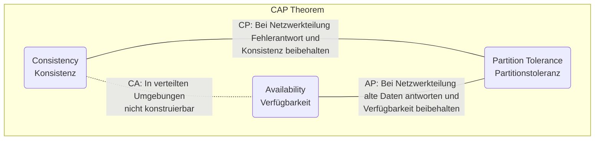
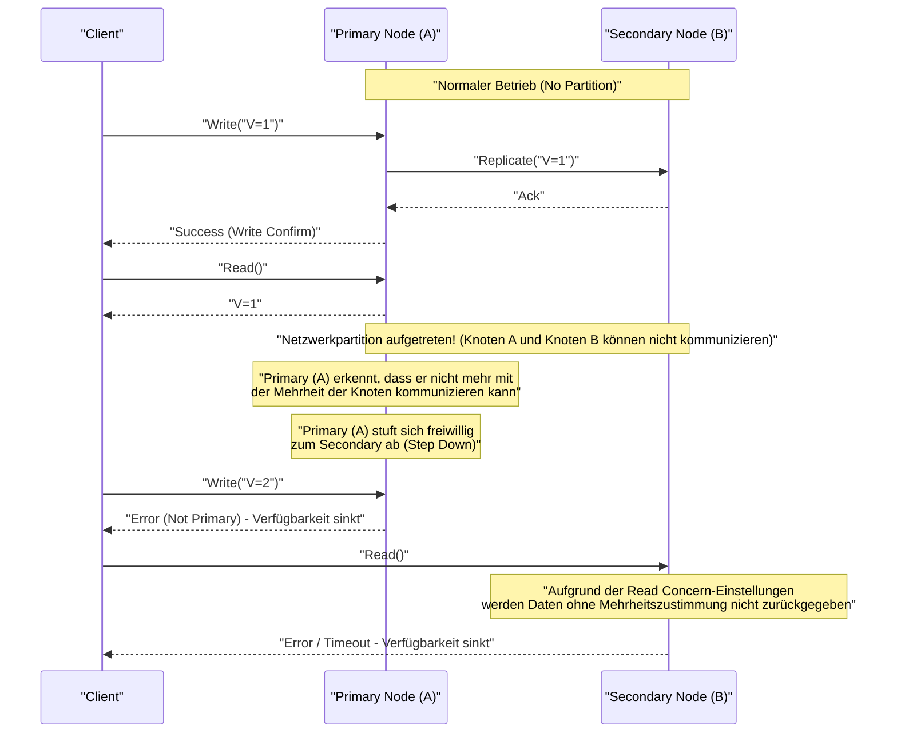
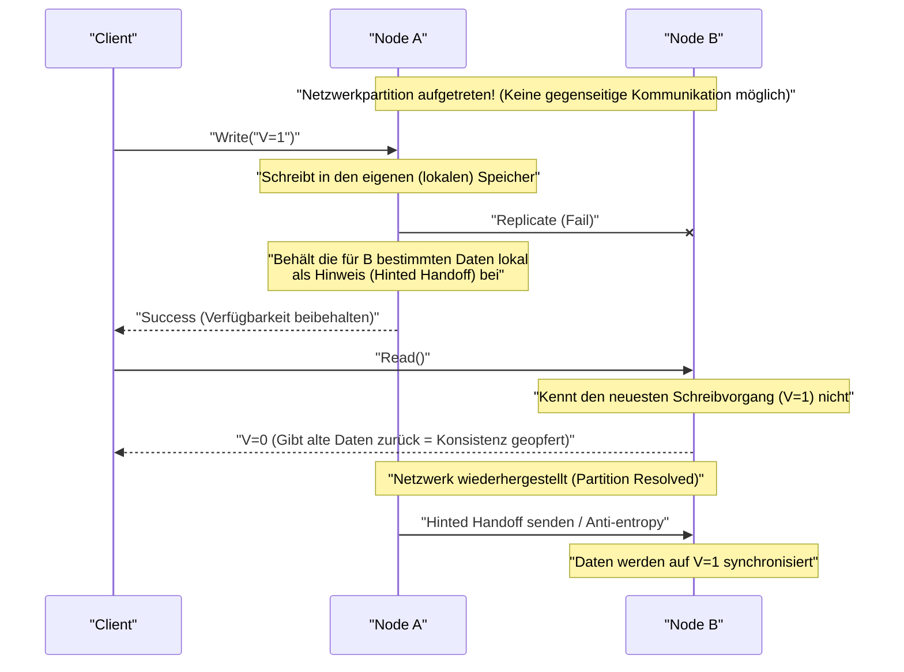

# CAP-Theorem und verteilte Systeme (Der Trade-off zwischen Konsistenz, Verfügbarkeit und Partitionstoleranz)

In modernen Webservices und Enterprise-Anwendungen sind **verteilte Systeme** (Distributed Systems) zu einem unverzichtbaren Element geworden. Um den enormen Datenverkehr und die riesigen Datenmengen zu bewältigen, die ein einzelner Server nicht verarbeiten kann, oder um Dienstausfälle aufgrund von Serverausfällen zu verhindern, werden mehrere Knoten (Server) miteinander verbunden und als ein einziges System betrieben.

Es gibt jedoch ein absolutes Gesetz, das beim Entwurf verteilter Systeme unvermeidlich ist. Dies ist das **CAP-Theorem** (CAP Theorem). In diesem Artikel werden wir das CAP-Theorem, das die Grundlage des Entwurfs verteilter Systeme bildet, sehr detailliert und umfassend erläutern: von seiner Definition über den mathematischen und logischen Hintergrund bis hin zu den Ansätzen der verschiedenen Datenbankprodukte und dem **PACELC-Theorem**, das den realen Kompromiss darstellt.

## 1. Geschichte und Hintergrund des CAP-Theorems

Das CAP-Theorem wurde im Jahr 2000 auf der ACM PODC (Principles of Distributed Computing) Konferenz von Eric Brewer, einem Informatiker an der University of California, Berkeley, vorgeschlagen. Ursprünglich wurde es als „Vermutung“ (Conjecture) basierend auf Erfahrungswerten vorgestellt, aber 2002 wurde es von Seth Gilbert und Nancy Lynch am Massachusetts Institute of Technology (MIT) mathematisch bewiesen und offiziell als „Theorem“ etabliert.

Der Hintergrund für Brewers Vorschlag dieses Theorems war die explosionsartige Verbreitung des Internets seit den späten 1990er Jahren. Damals versuchten Architekten, die **[ACID](https://kenji.blog/de/p/rdbms-transaction-acid-isolation-level-lock/)-Eigenschaften** (Atomicity, Consistency, Isolation, Durability), die herkömmliche relationale Datenbanken ([RDBMS](https://kenji.blog/de/p/rdbms-transaction-acid-isolation-level-lock/)) auf einem einzelnen Knoten aufweisen, auch in verteilten Umgebungen beizubehalten. Es stellte sich jedoch heraus, dass es in einer Umgebung, in der Knoten geografisch verteilt sind und Netzwerkverzögerungen sowie -ausfälle auf der Tagesordnung stehen, nahezu unmöglich ist, das System zu skalieren und gleichzeitig die ACID-Eigenschaften vollständig beizubehalten.

Das CAP-Theorem untermauerte theoretisch die Realität, dass in verteilten Systemen „nicht alles perfekt gemacht werden kann“, und wurde zu einem wichtigen Leitfaden, der Systemdesigner zwingt, **Trade-offs** (etwas opfern, um etwas anderes zu erhalten) einzugehen.

## 2. Strikte Definition der drei Elemente von CAP

Das CAP-Theorem besagt: „Ein verteiltes System kann von den folgenden drei Garantien höchstens zwei gleichzeitig erfüllen.“

*   **C (Consistency: Konsistenz)**
*   **A (Availability: Verfügbarkeit)**
*   **P (Partition Tolerance: Partitionstoleranz)**

Lassen Sie uns zunächst die strengen Definitionen dieser drei Eigenschaften im Kontext verteilter Systeme betrachten.

### 2.1. C: Consistency (Konsistenz)

**Konsistenz** im CAP-Theorem bezieht sich auf die Eigenschaft, dass „alle Clients immer dieselben aktuellen Daten lesen können oder eine Fehlermeldung erhalten“. Akademisch gesehen ist dies ein Konzept, das der **Linearisierbarkeit** (Linearizability) nahekommt.

In verteilten Systemen werden Daten über mehrere Knoten repliziert, um die Verfügbarkeit und Leistung zu verbessern. In einem System, das Konsistenz garantiert, wird, sobald eine Aktualisierung von Daten auf einem Knoten abgeschlossen ist und ein beliebiger anderer Client versucht, Daten von einem beliebigen Knoten zu lesen, immer das neueste Aktualisierungsergebnis zurückgegeben (oder es wird ein Fehler zurückgegeben, wenn die neuesten Daten z. B. aufgrund nicht rechtzeitiger Synchronisierung nicht bereitgestellt werden können).

Das bedeutet, dass sich das gesamte System so verhalten muss, als ob es „ein einzelner Knoten wäre, der nur die einzigen aktuellen Daten enthält“. Es ist unter keinen Umständen akzeptabel, dass ein Client **veraltete Daten (Stale Data)** liest.

### 2.2. A: Availability (Verfügbarkeit)

**Verfügbarkeit** im CAP-Theorem ist die Eigenschaft, dass „alle funktionierenden Knoten, bei denen kein Fehler aufgetreten ist, immer innerhalb einer angemessenen Zeit eine normale (nicht-fehlerhafte) Antwort zurückgeben“.

In einem System, das Verfügbarkeit garantiert, gibt das System immer Daten zurück (auch wenn keine Garantie besteht, dass sie aktuell sind), solange der Client auf einen gesunden, überlebenden Knoten zugreifen kann, selbst wenn in einem Teil des Systems (einem bestimmten Knoten oder einer Netzwerkleitung) ein Fehler aufgetreten ist. Bei berechtigten Anfragen von Clients ist es nicht zulässig, dass das System einen Fehler mit der Begründung „kann aufgrund interner Inkonsistenz nicht antworten“ zurückgibt oder endlos auf einen Timeout warten lässt. Es wird immer „irgendeine Antwort“ erwartet.

### 2.3. P: Partition Tolerance (Partitionstoleranz)

**Partitionstoleranz** im CAP-Theorem bezeichnet die Eigenschaft, dass „selbst wenn die Netzwerkkommunikation zwischen Knoten unterbrochen wird und das System in mehrere Netzwerkgruppen (Partitionen) aufgeteilt ist, die nicht miteinander kommunizieren können, das System als Ganzes (innerhalb jedes isolierten Netzwerks) weiterhin funktioniert“.

In realen Netzwerkumgebungen ist es unvermeidlich, dass die Kommunikation zwischen Knoten durch Paketverlust, Routerausfälle, physische Kabelbrüche oder vorübergehende Überlastung verzögert wird oder ganz ausfällt. Da es sich um ein verteiltes System handelt, müssen Netzwerkpartitionen als **alltägliches Phänomen und nicht als Ausnahme** vorausgesetzt werden. Ein verteiltes System, das P (Partitionstoleranz) aufgibt und davon ausgeht, dass „das Netzwerk niemals ausfällt“, kann daher in der Realität nicht existieren.

## 3. Warum können nicht alle drei gleichzeitig erfüllt werden? (Beweis und Logik)

Das CAP-Theorem behauptet, dass es logisch unmöglich ist, C, A und P gleichzeitig zu erfüllen. Wir erklären die Essenz des Beweises von Gilbert und Lynch mit einem leicht verständlichen logischen Modell.

Stellen Sie sich ein einfaches verteiltes System vor, das auf dem folgenden asynchronen Netzwerkmodell basiert:
*   Das System besteht aus zwei Datenknoten: **Node 1** und **Node 2**.
*   Als Ausgangszustand hat eine bestimmte Variable den Wert `V = 0`. Beide Knoten halten diesen Wert synchron.

Nehmen wir nun an, dass eine **Netzwerkpartition (Partition)** aufgetreten ist. Der Kommunikationsweg zwischen Node 1 und Node 2 ist vollständig unterbrochen und sie können keine Nachrichten mehr austauschen (dies ist die Situation, um die Partitionstoleranz P zu testen).

Während diese Netzwerkpartition andauert, sendet ein Client eine Aktualisierungsanfrage `V = 1` an **Node 1**. Node 1 empfängt die Anfrage und aktualisiert seine eigenen Daten `V` auf `1`. Da das Netzwerk jedoch getrennt ist, kann Node 1 keine Replikationsnachricht „V wurde auf 1 aktualisiert“ an Node 2 senden.

Unmittelbar danach sendet ein anderer Client eine Leseanfrage `Read(V)` an **Node 2**.

Wie sollte das System (Node 2) in diesem Moment reagieren? Der Systemdesigner muss sich für eine der beiden folgenden Optionen entscheiden.

### Option 1: CP-System (Priorisiert Konsistenz und opfert Verfügbarkeit)

Node 2 hat keine Möglichkeit zu wissen, ob die Daten `V = 0`, die er hält, die neuesten im gesamten System sind (da er Node 1 nicht erreichen kann, um nachzufragen). Wenn er hier einfach `0` zurückgeben würde, würde er einen Wert zurückgeben, der älter ist als der neueste Wert `V = 1`, der kurz zuvor von einem anderen Client geschrieben wurde, wodurch die **Konsistenz (C)** des Systems zerstört würde.

Um die Konsistenz strikt einzuhalten, hat Node 2 keine andere Wahl, als zu entscheiden: „Da es keine Gewissheit gibt, dass die eigenen Daten aktuell sind, kann nicht geantwortet werden“, und entweder **einen Fehler an den Client zurückzugeben** oder die Antwort zu **blockieren (Timeout)**, bis das Netzwerk wiederhergestellt ist.
Sobald ein Fehler zurückgegeben wird, konnte das System keine normale Antwort liefern, wodurch die **Verfügbarkeit (A)** verloren geht.

### Option 2: AP-System (Priorisiert Verfügbarkeit und opfert Konsistenz)

Node 2 darf keinen Fehler an den Client zurückgeben und muss immer eine normale Antwort liefern (um die Verfügbarkeit A aufrechtzuerhalten). Die einzigen Daten, die Node 2 derzeit zurückgeben kann, ist der alte Wert `V = 0`, den er selbst gespeichert hat.

Wenn Node 2 `0` zurückgibt, erhält der Client eine normale Antwort und die **Verfügbarkeit (A)** bleibt erhalten. Da jedoch ein alter Wert zurückgegeben wird, der im Widerspruch zu dem neuesten Wert `V = 1` steht, der bereits auf Node 1 geschrieben wurde, geht die **Konsistenz (C)** des Systems verloren.

---

Wie man sieht, unter der physikalischen Einschränkung einer Netzwerkpartition (P) muss das System logischerweise **entweder Konsistenz (C) oder Verfügbarkeit (A) opfern**. Dies ist der Kern des CAP-Theorems.



Oft wird der Begriff „CA-System (ein System, das sowohl Konsistenz als auch Verfügbarkeit vereint, aber keine Partitionstoleranz besitzt)“ verwendet, aber dies bezieht sich auf herkömmliche [RDBMS](https://kenji.blog/de/p/rdbms-transaction-acid-isolation-level-lock/) usw., die auf einem einzigen Knoten ausgeführt werden. Da keine Zusammenarbeit zwischen Knoten über ein Netzwerk besteht, entsteht das Konzept einer Netzwerkpartition gar nicht erst. Daher **gibt es in echten verteilten Systemen keine CA-Option, sondern es läuft praktisch auf eine Wahl zwischen CP und AP hinaus**.

## 4. Beispiele und detailliertes Verhalten von CP- und AP-Systemen

Je nachdem, welche Eigenschaft des CAP-Theorems ein System priorisiert, unterscheiden sich die Architektur des Datenbankprodukts und sein Verhalten bei einer Netzwerkpartition völlig. Hier betrachten wir repräsentative Produkte von CP- und AP-Systemen sowie deren spezifisches Verhalten anhand von Sequenzdiagrammen.

### 4.1. CP-System (Consistency and Partition Tolerance)

Ein CP-System priorisiert bei einer Netzwerkpartition **absolut die Konsistenz** und ist eine Architektur, die die **Verfügbarkeit des Systems teilweise oder vollständig aussetzt (opfert)**, um das Risiko von Dateninkonsistenzen (wie das Split-Brain-Phänomen) zu vermeiden.

**Typische Datenspeicher:**
*   HBase
*   [MongoDB](https://kenji.blog/de/p/nosql-database-selection-kvs-document-graph-wide-column/)
*   [Redis](https://kenji.blog/de/p/nosql-database-selection-kvs-document-graph-wide-column/) Cluster (je nach Konfiguration)
*   Etcd, Zookeeper (streng genommen Systeme mit verteilten Konsensalgorithmen)
*   Google Cloud Spanner (wie später erläutert, im Wesentlichen CP)

Sie werden in Anwendungsfällen gewählt, in denen es nicht tolerierbar ist, veraltete Daten zu lesen und falsche Entscheidungen zu treffen (was direkt zu finanziellen Verlusten oder schwerwiegenden logischen Fehlern führt), wie z. B. bei der Kontostandsverwaltung von Banken, der Bestandsverwaltung auf E-Commerce-Websites und in Zahlungssystemen.

**Verhalten eines CP-Systems bei Netzwerkteilung (Beispiel Replica Set bei MongoDB):**

MongoDB erstellt ein Replica Set, bestehend aus einem **primären Knoten (Primary)** und mehreren **sekundären Knoten (Secondary)**. Standardmäßig erfolgen alle Schreib- und Lesevorgänge auf dem primären Knoten, um die Konsistenz zu wahren.



Angenommen, es tritt eine Netzwerkpartition auf und ein Cluster mit 5 Knoten wird in eine Gruppe mit „2 Knoten (einschließlich des aktuellen Primary)“ und eine Gruppe mit „3 Knoten“ geteilt. In diesem Fall hat die Gruppe von 2 Knoten, in der sich der aktuelle Primary befindet, die Mehrheit (Majority) verloren.
Als CP-System stuft [MongoDB](https://kenji.blog/de/p/nosql-database-selection-kvs-document-graph-wide-column/) automatisch den Primary-Knoten, der in der Minderheitsgruppe isoliert ist, zu einem Secondary-Knoten ab (Step Down), um Dateninkonsistenzen zu verhindern. Anschließend wird innerhalb der Mehrheitsgruppe von 3 Knoten ein neuer Algorithmus zur Anführerwahl (wie Raft) ausgeführt und ein neuer Primary gewählt.
Während der Sekunden bis Dutzende von Sekunden, in denen diese Anführerwahl stattfindet, oder für die Minderheitsgruppe, deren Partition nicht behoben ist, schlagen Schreibvorgänge (je nach Konfiguration auch Lesevorgänge) auf das System fehl, wodurch die **Verfügbarkeit sinkt**. Dies verhindert jedoch die Situation, dass zwei Primaries gleichzeitig existieren und separate Schreibvorgänge akzeptieren, wodurch die **Konsistenz stark aufrechterhalten wird**.

### 4.2. AP-System (Availability and Partition Tolerance)

Ein AP-System ist eine Architektur, die selbst bei einer Netzwerkpartition **die Verfügbarkeit an die erste Stelle setzt** und weiterhin jederzeit den Zugriff auf das System (Lesen und Schreiben) ermöglicht. Als Ausgleich kommt es vorübergehend zu Zuständen, in denen Daten nicht zwischen Knoten synchronisiert sind (Lesen veralteter Daten oder Update-Konflikte), was bedeutet, dass die **Konsistenz geopfert wird**.

**Typische Datenspeicher:**
*   Apache [Cassandra](https://kenji.blog/de/p/nosql-database-selection-kvs-document-graph-wide-column/)
*   Amazon DynamoDB
*   Riak
*   Couchbase

Sie werden in Anwendungsfällen gewählt, in denen es geschäftlich äußerst wichtig ist, dass „der Bildschirm schnell angezeigt wird (das System nicht stoppt), auch wenn es nicht die neuesten Daten sind“, wie z. B. bei der Anzeige von Timelines in sozialen Netzwerken, der Erfassung von Benutzerverhaltensprotokollen oder bei Produktbewertungs- und Empfehlungsfunktionen auf Shopping-Websites.

**Verhalten eines AP-Systems bei Netzwerkteilung (Beispiel Cassandra):**

Cassandra verwendet eine **Masterless (Leaderless) Architektur**, bei der es keinen spezifischen Leader (Master) gibt. Alle Knoten, die in einem Ring angeordnet sind, nehmen Lese- und Schreibanforderungen gleichermaßen entgegen.



Angenommen, es tritt eine Netzwerktrennung auf und Node A und Node B können nicht mehr miteinander kommunizieren. Wenn ein Client in diesem Zustand an Node A schreibt, Node A die Daten (abhängig von den Konsistenzeinstellungen) nur auf seine lokale Festplatte schreibt und meldet dem Client sofort „Schreiben erfolgreich“ zurück (hohe Verfügbarkeit). Die Replikation auf Node B schlägt fehl, aber Node A merkt sich dies vorübergehend (Hinted Handoff).

Wenn unmittelbar danach ein anderer Client Daten von Node B liest, gibt Node B problemlos seine alten Daten zurück, da er die letzte auf Node A durchgeführte Aktualisierung noch nicht erhalten hat. Dies ist der **Zustand, in dem die Konsistenz geopfert wird**.

Sobald das Netzwerk jedoch wiederhergestellt ist, sendet Node A die gespeicherten Aktualisierungsdaten an Node B, und die Daten werden im Hintergrund synchronisiert. Dies wird als **Eventual Consistency (schlussendliche Konsistenz)** bezeichnet.

## 5. Tieferes Eintauchen in Eventual Consistency (Schlussendliche Konsistenz)

Wenn wir sagen, dass in AP-Systemen „die Konsistenz geopfert wird“, bedeutet das nicht, dass die Daten für immer asynchron bleiben. Eventual Consistency ist die Garantie, dass „wenn über einen bestimmten Zeitraum keine neuen Aktualisierungen am System vorgenommen werden, **letztendlich (Eventually)** alle Replikate denselben Wert annehmen und in einen Zustand konvergieren, in dem die Konsistenz gewahrt ist“.

Bei verteilten Systemen, die Eventual Consistency voraussetzen (Systeme mit **BASE-Eigenschaften**: Basically Available, Soft state, Eventual consistency), müssen Entwickler eine Anwendungsarchitektur entwerfen, die berücksichtigt, dass „es möglich ist, veraltete Daten zu lesen“ und dass „Datenkonflikte (Conflicts) auftreten, wenn auf mehreren Knoten gleichzeitig unterschiedliche Aktualisierungen vorgenommen werden“.

### 5.1. Strategien zur Lösung von Datenkonflikten (Conflict)

Wenn während einer Netzwerktrennung oder aufgrund von Netzwerkverzögerungen gleichzeitig Aktualisierungen für denselben Schlüssel auf verschiedenen Knoten auftreten, muss das System oder die Anwendung entscheiden, welche Aktualisierung als korrekt angesehen wird oder wie sie zusammengeführt (gemergt) werden.

1.  **LWW (Last Write Wins: Der letzte Schreibvorgang gewinnt):**
    Jeder Aktualisierungsanfrage wird entweder vom Client oder vom Knoten ein Zeitstempel zugewiesen. Im Falle eines Konflikts wird einfach **die Aktualisierung mit dem neuesten Zeitstempel als korrekt angesehen und die ältere Aktualisierung verworfen (überschrieben)**. Wird oft als Standard bei [Cassandra](https://kenji.blog/de/p/nosql-database-selection-kvs-document-graph-wide-column/) und anderen verwendet.
    *Vorteil*: Konflikte können auf Systemebene automatisch gelöst werden, die Implementierung ist einfach.
    *Nachteil*: Es besteht das Risiko, dass Daten unbeabsichtigt überschrieben werden aufgrund von Uhrenabweichungen (Clock Skew) zwischen Clients, und es muss akzeptiert werden, dass eine der Aktualisierungen vollständig verloren geht.

2.  **Vector Clocks:**
    Der Aktualisierungsverlauf (Versionsinformationen) auf jedem Knoten wird als Liste gepflegt, und die Kausalität (Causality) der Aktualisierungen wird streng nachverfolgt. Wenn ein Konflikt erkannt wird, den das System nicht automatisch lösen kann (Aktualisierungen, die exakt gleichzeitig und ohne Kausalzusammenhang vorgenommen wurden), überschreibt das System die Daten nicht eigenmächtig, sondern **speichert die mehreren konkurrierenden Versionen (Siblings) so wie sie sind**. Wenn ein Client das nächste Mal die Daten liest, werden all diese verschiedenen Versionen zurückgegeben und **die Anwendungslogik (oder der menschliche Benutzer) übernimmt die Konfliktauflösung (Merge)**. Eine mächtige Methode, die bei Amazon Dynamo und anderen eingesetzt wird.
    *Vorteil*: Kann Datenverlust verhindern.
    *Nachteil*: Die Implementierung auf der Anwendungsseite wird komplex.

3.  **CRDT (Conflict-free Replicated Data Type):**
    Durch die Verleihung mathematischer Eigenschaften (Kommutativität, Assoziativität, Idempotenz) an die Datenstruktur selbst handelt es sich um **spezielle Datentypen, die so konzipiert sind, dass sie unabhängig von Netzwerkverzögerungen oder einer vertauschten Nachrichtenreihenfolge letztendlich immer im selben Zustand konvergieren**.
    Sie werden beispielsweise für verteilte Zähler, Nur-Hinzufügen-Mengen (Grow-only Set) oder Algorithmen zur kollaborativen Textbearbeitung verwendet. Sie werden von Riak oder [Redis](https://kenji.blog/de/p/nosql-database-selection-kvs-document-graph-wide-column/) Enterprise-Modulen unterstützt.

### 5.2. Beispiel für die Kontrolle auf Anwendungsseite (Konfliktauflösung wie bei Vector Clocks)

Wir zeigen einen Pseudocode (im Python-Stil), um in einem AP-System Datenkonflikte auf der Anwendungsseite zu erkennen und angemessen aufzulösen. Als Beispiel dient das Hinzufügen von Artikeln zu einem Warenkorb.

```python
import time

def update_shopping_cart(user_id, new_item, database):
    """
    Funktion zum Hinzufügen von Artikeln zum Warenkorb.
    Geht von einer DB mit Eventual Consistency aus und führt optimistisches Sperren sowie Konfliktauflösung durch.
    """
    max_retries = 3
    
    for attempt in range(max_retries):
        try:
            # 1. Aktuelle Warenkorbdaten und Version (Vector Clock etc.) aus der Datenbank abrufen
            result = database.read(user_id)
            cart_data_list = result.data  # Liste, in der mehrere konkurrierende Versionen (Siblings) zurückgegeben werden können
            version_context = result.context # Versionsinformationen, die bei der Aktualisierung erforderlich sind
            
            # 2. Lösungslogik für den Fall, dass mehrere konkurrierende Versionen zurückgegeben werden (bei einem Konflikt)
            resolved_cart = resolve_conflict(cart_data_list)
            
            # 3. Den neuen Artikel zu den aufgelösten Warenkorbdaten hinzufügen
            if new_item not in resolved_cart:
                resolved_cart.append(new_item)
            
            # 4. In die Datenbank mit dem Versionskontext schreiben (Optimistic Locking)
            # Auf DB-Seite wird überprüft, ob der bereitgestellte Kontext mit dem neuesten Kontext auf DB-Seite übereinstimmt
            success = database.write(user_id, resolved_cart, version_context)
            
            if success:
                print("Warenkorb erfolgreich aktualisiert.")
                return True
            else:
                # Schreibfehler wegen Versionsinkongruenz (ein anderer Client hat zuerst aktualisiert)
                print(f"Schreibvorgang aufgrund von Versionskonflikt fehlgeschlagen. Wiederholung... (Versuch {attempt + 1})")
                continue # Im nächsten Durchlauf ab dem erneuten Lesen von vorn beginnen
                
        except NetworkException:
            # Bei Netzwerkfehlern wiederholen
            print(f"Netzwerkfehler. Wiederholung... (Versuch {attempt + 1})")
            time.sleep(1 * (attempt + 1)) # Exponentielles Backoff
            
    raise Exception("Der Warenkorb konnte trotz mehrfacher Wiederholungen nicht aktualisiert werden.")

def resolve_conflict(conflicting_carts):
    """
    Konfliktauflösungslogik.
    In diesem Beispiel werden alle Warenkorbinhalte zusammengeführt (Vereinigungsmenge), um den Verlust von Artikeln zu verhindern.
    Je nach Geschäftsanforderungen in eine Logik ändern wie z. B. 'Den mit dem neuesten Zeitstempel priorisieren'.
    """
    merged_cart = set()
    for cart in conflicting_carts:
        for item in cart:
            merged_cart.add(item)
    return list(merged_cart)
```
Als Preis für die Wahl eines AP-Systems und die Erzielung einer hohen Verfügbarkeit trägt der Entwickler also die Verantwortung, „Wiederholungslogik“, „optimistisches Sperren (Optimistic Locking)“ und „Konfliktauflösung basierend auf Geschäftslogik (Merge)“ angemessen in den Anwendungscode zu implementieren.

## 6. Von CAP zu PACELC: Trade-offs im Normalbetrieb

Das CAP-Theorem definiert eine Art Extremsituation: „Wie sich das System **im Ausnahmefall**, also bei einer Netzwerkteilung, verhält“. Im realen Systembetrieb kommt es jedoch nicht rund um die Uhr zu einer vollständigen Netzwerkunterbrechung (obwohl dies ein Risiko ist, das berücksichtigt werden muss).

Daher schlug Daniel Abadi von der Yale University im Jahr 2010 das **PACELC-Theorem** vor. Dies ist eine Erweiterung des CAP-Theorems zu einem pragmatischeren Modell, das „nicht nur Trade-offs im Falle einer Netzwerkpartition, sondern **Trade-offs im Normalbetrieb (wenn das Netzwerk einwandfrei funktioniert)**“ einbezieht.

**PACELC** ist ein Akronym für Folgendes:

*   Wenn **P**artition auftritt (Netzwerkteilung):
*   Wählen zwischen **A**vailability (Verfügbarkeit) oder **C**onsistency (Konsistenz) (Dies ist gleich wie beim CAP-Theorem).
*   **E**lse (Ansonsten im Normalbetrieb, wenn das Netzwerk intakt ist):
*   Wählen zwischen **L**atency (Latenz/Antwortzeit) oder **C**onsistency (Konsistenz).

Wenn man im Normalbetrieb die **Konsistenz (C)** der Daten strikt beibehalten möchte, muss das System bei einer Schreibanforderung auf einem Knoten auf den Abschluss der Replikation (Synchronisation) auf mehreren anderen Knoten warten, bevor dem Client eine Erfolgsmeldung zurückgegeben wird. Diese „Wartezeit auf den Hin- und Rückweg der Netzwerkkommunikation“ führt zu Overhead, was zur Folge hat, dass sich die **Latenz (L)** des Systems verschlechtert (langsamer wird).

Wenn man umgekehrt versucht, die **Latenz (L)** des Systems extrem niedrig (schnell) zu halten, ist das Design so ausgelegt, dass eine Erfolgsmeldung zurückgegeben wird, sobald die Schreibanforderung des Clients am lokalen Knoten empfangen wurde, und die Replikation auf andere Knoten asynchron im Hintergrund erfolgt. In diesem Fall ist die Antwort extrem schnell, aber für einige Millisekunden bis Sekunden, bis die Replikation abgeschlossen ist, entsteht ein Zustand, in dem die Daten zwischen den Knoten nicht übereinstimmen, wodurch die **Konsistenz (C)** beeinträchtigt wird.

Moderne verteilte Datenbanken lassen sich nach dem PACELC-Theorem in die folgenden vier Muster einteilen:

1.  **PC/EC (Priorisiert Konsistenz bei Partition, priorisiert Konsistenz auch im Normalbetrieb):**
    Beispiele: VoltDB, CockroachDB. Garantiert in jeder Situation starke Konsistenz ([ACID](https://kenji.blog/de/p/rdbms-transaction-acid-isolation-level-lock/)). Im Gegenzug ist eine synchrone Kommunikation zwischen Knoten auch im Normalbetrieb erforderlich, weshalb es anfällig für Latenz ist und die Leistung in Umgebungen mit hohen Netzwerkverzögerungen (z. B. Multi-Region) abnimmt.
2.  **PC/EL (Priorisiert Konsistenz bei Partition, priorisiert Latenz im Normalbetrieb):**
    Beispiele: [MongoDB](https://kenji.blog/de/p/nosql-database-selection-kvs-document-graph-wide-column/) (Standardeinstellungen), asynchrone Replikation von MySQL. Bei Ausnahmesituationen wie einer Partition wird das System angehalten, um Datenbeschädigungen (Split-Brain) zu verhindern; im Normalbetrieb wird jedoch die Leistung (Lese-/Schreibgeschwindigkeit) priorisiert und ein vorübergehendes Lesen alter Daten aufgrund von Replikationsverzögerungen toleriert.
3.  **PA/EL (Priorisiert Verfügbarkeit bei Partition, priorisiert Latenz im Normalbetrieb):**
    Beispiele: [Cassandra](https://kenji.blog/de/p/nosql-database-selection-kvs-document-graph-wide-column/), Amazon DynamoDB, Riak. Das System wird niemals gestoppt und strebt immer die schnellste Antwortzeit an. Es handelt sich um eine Architektur, die speziell auf Scale-out und Hochverfügbarkeit ausgerichtet ist und Eventual Consistency vollständig akzeptiert.
4.  **PA/EC (Priorisiert Verfügbarkeit bei Partition, priorisiert Konsistenz im Normalbetrieb):**
    Ein inkonsistentes Design, bei dem im Ausnahmefall das System am Laufen gehalten wird, selbst wenn Daten inkonsistent werden, aber ausgerechnet im Normalbetrieb die Latenz geopfert wird, um Konsistenz zu gewährleisten. Praktisch keine Datenbank wählt diesen Ansatz.

## 7. Tuning der Konsistenz in modernen Datenbanken (Tunable Consistency)

Aus den bisherigen Erläuterungen könnte man den Eindruck gewinnen, dass „festgelegt ist, ob ein Datenbankprodukt CP oder AP ist“. Jedoch bieten viele der raffinierten modernen [NoSQL](https://kenji.blog/de/p/nosql-database-selection-kvs-document-graph-wide-column/)-Datenbanken (Cassandra, DynamoDB, Cosmos DB usw.) eine Funktion, mit der Entwickler **„die Konsistenzstufe“ flexibel pro Abfrage oder Sitzung konfigurieren (tunen) können**, was als **Tunable Consistency** bezeichnet wird.

### 7.1. Kontrolle mittels Quorum (Beschlussfähigkeit)

Am Beispiel von Cassandra wird die Datenkonsistenz durch die Balance folgender Variablen gesteuert:

*   **N:** Gesamtzahl der Replikatknoten, auf die Daten kopiert werden (Replication Factor)
*   **W:** Anzahl der Knoten, von denen beim Schreiben synchron auf die Schreibbestätigung (Ack) gewartet wird (Write Consistency Level)
*   **R:** Anzahl der Knoten, die beim Lesen abgefragt werden, um eine Mehrheitsentscheidung zu treffen (Read Consistency Level)

Hier kann **starke Konsistenz (Strong Consistency)** garantiert werden, wenn die Konfiguration so gewählt wird, dass die folgende Formel erfüllt ist. In diesem Fall ist sichergestellt, dass sich in der abgefragten Knotengruppe (R) mindestens ein Knoten (W) befindet, der die neuesten geschriebenen Daten besitzt.

`W + R > N`

**Variationen von Konfigurationsbeispielen:**

*   **Priorität auf starke Konsistenz (Quorum Read/Write):** `W = Quorum`, `R = Quorum`
    (Beispiel: Bei einer Konfiguration mit 3 Knoten gilt N=3, W=2, R=2. Sowohl beim Schreiben als auch beim Lesen wird auf die Antwort der Mehrheit der Knoten gewartet. Es werden immer die neuesten Daten garantiert, aber die Latenz ist moderat.)
*   **Priorität auf Schreiblatenz (AP-artig, Eventual Consistency):** `W = 1`, `R = All`
    (Da der Vorgang als abgeschlossen gilt, sobald er auf 1 Knoten geschrieben wurde, ist das Schreiben rasend schnell. Da beim Lesen jedoch alle Maschinen abgefragt werden müssen, um den neuesten Zeitstempel zu finden, ist das Lesen langsam.)
*   **Priorität auf Leselatenz (AP-artig, Eventual Consistency):** `W = All`, `R = 1`
    (Da auf den Abschluss des Schreibvorgangs auf allen Maschinen gewartet wird, ist das Schreiben langsam. Da jedoch garantiert ist, dass die Daten von jedem gelesenen Knoten die neuesten sind, reicht beim Lesen eine Abfrage an eine Maschine, was es rasend schnell macht.)
*   **Ultimative Priorität auf Verfügbarkeit und Latenz (PA/EL):** `W = 1`, `R = 1`
    (Sowohl das Lesen als auch das Schreiben werden nur auf dem nächstgelegenen Knoten abgeschlossen. Es ist am schnellsten und fällt am wenigsten aus, aber die Wahrscheinlichkeit, alte Daten zu lesen, ist am höchsten.)

Auf diese Weise legen Entwickler nicht die Architektur des gesamten Systems fest, sondern passen die Werte von W und R dynamisch an die Geschäftsanforderungen an. Man kann selbst **den Schieberegler für den Trade-off von CAP/PACELC bedienen**, je nach Art der behandelten Daten innerhalb desselben Datenbankclusters (z. B. „Abrechnungsdaten der Benutzer benötigen absolute starke Konsistenz (W=Quorum, R=Quorum)“, „Zugriffsprotokolle der Website priorisieren Schreibgeschwindigkeit, auch wenn einige verloren gehen (W=1)“).

### 7.2. Hat Google Cloud Spanner das CAP-Theorem gebrochen?

In den letzten Jahren wird manchmal behauptet: „Google Cloud Spanner ist eine Datenbank, die eine hohe Verfügbarkeit bei gleichzeitiger Garantie einer starken Konsistenz (External Consistency) im globalen Maßstab bietet und das CAP-Theorem überwunden hat“.

Wie jedoch Eric Brewer, der Entwickler von Spanner, selbst in einer Arbeit feststellt, **bricht Spanner das CAP-Theorem nicht. Es wird streng genommen als „CP-System“ klassifiziert.**

Das Revolutionäre an Spanner ist die Verwendung einer hardwaregestützten Infrastruktur namens **TrueTime API**, die GPS und Atomuhren kombiniert, um die „Ungenauigkeit der Uhren (Clock Uncertainty)“ des gesamten verteilten Systems strikt auf wenige Millisekunden zu begrenzen. Dadurch lässt sich die Reihenfolge von Transaktionen auch zwischen weltweit verteilten Knoten genau bestimmen.

Da Spanner auf Googles extrem robustem und redundantem privaten Netzwerk läuft, ist die Wahrscheinlichkeit, dass in der realen Welt „eine Netzwerkpartition (P) auftritt und die Verfügbarkeit (A) geopfert werden muss“, lediglich nahezu Null (wodurch eine Verfügbarkeit von fünf Neunen oder höher erreicht wird). Im Falle einer massiven physischen Netzwerkunterbrechung auf globaler Ebene ist Spanner so konzipiert, dass die Verfügbarkeit ausgesetzt wird (d. h., ein Fehler zurückgegeben wird), um die Konsistenz zu schützen.

## 8. Best Practices und Zusammenfassung für das Design verteilter Systeme

Das CAP-Theorem und das PACELC-Theorem sind Gesetze, die uns bei der Gestaltung und Auswahl verteilter Systeme der harten physikalischen und logischen Realität stellen, dass „es keine magische Wunderwaffe gibt, die in allem perfekt ist“.

*   Netzwerkpartitionen (P) sind in realen Netzwerken unvermeidlich.
*   Im Falle einer Partition muss man wählen, ob man das System stoppt, um die Konsistenz (C) zu schützen, oder ob man die Verfügbarkeit (A) schützt und Dateninkonsistenzen toleriert.
*   Wie das PACELC-Theorem zeigt, gibt es selbst im Normalbetrieb einen Trade-off: Wenn man versucht, die Konsistenz (C) zu erhöhen, wird die Latenz (L) geopfert, und wenn man versucht, die Latenz zu senken, wird die Konsistenz geopfert.

Architekten und Softwareingenieure dürfen eine Datenbank nicht einfach auswählen, „weil sie im Trend liegt“ oder „weil sie hohe Benchmark-Werte hat“. Am wichtigsten ist es, sich genau zu überlegen: **„Was ist beim System, das wir aufbauen, das schlimmste Szenario im Falle eines Fehlers: dass Daten inkonsistent werden oder dass der Dienst vollständig stoppt und die Benutzer nichts tun können?“**.

Bei Finanztransaktionen sollte zweifellos ein CP-System (oder ein [RDBMS](https://kenji.blog/de/p/rdbms-transaction-acid-isolation-level-lock/)) gewählt und starke Konsistenz gewährleistet werden. Andererseits sollte man bei einem globalen Social-Media-Dienst ein AP-System wählen und 24/7-Hochverfügbarkeit sowie niedrige Latenz anstreben, selbst wenn dies bedeutet, Eventual Consistency in Kauf zu nehmen.

In vielen Fällen kann man sich nicht allein auf die Funktionen der Infrastruktur oder des Datenbankprodukts verlassen. Mit der Voraussetzung, dass sich die Datenbank wie ein AP-System verhält, ist die **„ausfallsichere Designfähigkeit (Fail-safe Design)“** der größte Schlüssel zum Aufbau moderner, robuster verteilter Systeme: Sie gleicht die Schwächen der Infrastruktur und Dateninkonsistenzen gekonnt durch Implementierungsmuster auf Anwendungsseite (Wiederholungslogik, Sicherstellung der Idempotenz, ausgleichende Transaktionen (wie das Saga-Pattern), Logik zur Konfliktauflösung) aus.
