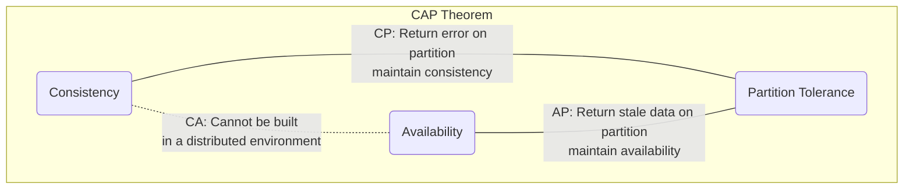
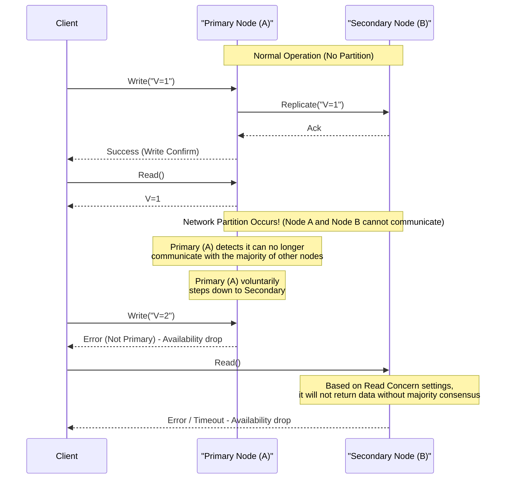
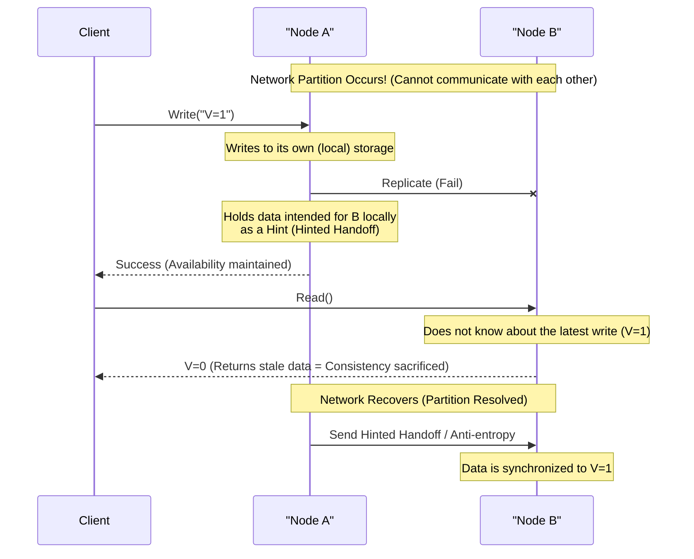

# CAP Theorem and Distributed Systems (Trade-offs of Consistency, Availability, and Partition Tolerance)

In modern web services and enterprise applications, **distributed systems** are an essential component. To handle massive traffic and data that a single server cannot process, or to prevent service outages due to server failures, multiple nodes (servers) are coordinated to operate as a single system.

However, there is an absolute law that cannot be avoided when designing distributed systems. That is the **CAP Theorem**. This article will provide a very detailed and comprehensive explanation of the CAP Theorem, which is the foundation of distributed systems design, covering its definition, mathematical and logical background, the approach of various database products, and the **PACELC Theorem**, which is the practical compromise in the real world.

## 1. History and Background of the CAP Theorem

The CAP Theorem was proposed in 2000 by Eric Brewer, a computer scientist at the University of California, Berkeley, at the ACM PODC (Principles of Distributed Computing) conference. Initially, it was presented as a "Conjecture" based on rules of thumb, but in 2002, Seth Gilbert and Nancy Lynch of the Massachusetts Institute of Technology (MIT) proved it mathematically, officially establishing it as a "Theorem".

The background behind Brewer's proposal of this theorem lies in the explosive spread of the Internet from the late 1990s. At that time, architects attempted to maintain the **[ACID](https://kenji.blog/en/p/rdbms-transaction-acid-isolation-level-lock/) properties** (Atomicity, Consistency, Isolation, Durability) of conventional relational databases ([RDBMS](https://kenji.blog/en/p/rdbms-transaction-acid-isolation-level-lock/)) running on single nodes in distributed environments as well. However, in environments where nodes are geographically distributed and network delays and failures occur on a daily basis, it became clear that it was nearly impossible to scale systems while perfectly maintaining ACID properties.

The CAP Theorem theoretically backed up the reality that "you cannot make everything perfect" in distributed systems, and became an important guideline that forces system designers to make **trade-offs** (sacrificing something to gain something else).

## 2. Strict Definitions of the 3 Elements of CAP

The CAP Theorem claims that "a distributed system can simultaneously guarantee at most two of the following three properties."

*   **C (Consistency)**
*   **A (Availability)**
*   **P (Partition Tolerance)**

First, let's look at the strict definitions of these three properties in the context of distributed systems.

### 2.1. C: Consistency

**Consistency** in the CAP Theorem refers to the property that "every read receives the most recent write or an error." In academic terms, this is close to the concept of **Linearizability**.

In distributed systems, data is replicated across multiple nodes to improve availability and performance. In a system where consistency is guaranteed, immediately after an update write to data on a certain node is completed, if any other client tries to read data from any node, it must either return the most recent update result or an error (if it cannot return the latest data due to reasons such as synchronization not being complete).

In other words, the entire system is required to behave as if it is a "single node holding only the single latest data." It is completely unacceptable for a client to read **stale data**.

### 2.2. A: Availability

**Availability** in the CAP Theorem is the property that "every request receives a (non-error) response, without the guarantee that it contains the most recent write."

In a system where availability is guaranteed, even if a failure occurs in a part of the system (a specific node or network line), as long as the client can access a healthy, surviving node, the system will always return data (even if there is no guarantee that it is the latest). It is unacceptable for the system to return an error saying "cannot respond due to internal inconsistency" or make it wait infinitely for a timeout against a legitimate request from a client. It is always required to return "some answer".

### 2.3. P: Partition Tolerance

**Partition Tolerance** in the CAP Theorem is the property that "the system continues to operate despite an arbitrary number of messages being dropped (or delayed) by the network between nodes."

In real-world network environments, it is inevitable that communication between nodes will be delayed or completely lost due to packet loss, router failures, physical cable disconnections, or temporary overloads. As long as it is a distributed system, network partitions must be assumed as a **phenomenon that can occur on a daily basis, not an exception**. Therefore, a distributed system that abandons P (Partition Tolerance) and assumes that "the network will absolutely never disconnect" cannot exist in reality.

## 3. Why Can't All 3 Be Satisfied Simultaneously? (Proof and Logic)

What the CAP Theorem asserts is that it is logically impossible to satisfy C, A, and P simultaneously. Let's explain the essence of Gilbert and Lynch's proof with an easy-to-understand logical model.

Imagine a simple distributed system based on an asynchronous network model like the following.
*   The system consists of two data nodes: **Node 1** and **Node 2**.
*   In the initial state, the value of a certain variable is `V = 0`. Both nodes synchronously hold this value.

Now, suppose a **network partition** occurs here. The communication path connecting Node 1 and Node 2 is completely disconnected, making them unable to send and receive messages to each other (this is the situation for testing Partition Tolerance P).

During this network partition, a client sends an update request `V = 1` to **Node 1**. Node 1 receives the request and updates its data `V` to `1`. However, because the network is disconnected, Node 1 cannot send a replication message saying "V was updated to 1" to Node 2.

Immediately after that, another client sends a read request `Read(V)` to **Node 2**.

At this time, what action should the system (Node 2) take? The system designer must choose one of the following two options.

### Option 1: CP System (Prioritize Consistency, Sacrifice Availability)

Node 2 has no way of knowing whether the data `V = 0` it holds is the latest in the entire system (because it cannot communicate with Node 1 to inquire). If it easily returns `0` here, it will return an older value than the latest value `V = 1` just written by another client, destroying the **Consistency (C)** of the system.

To strictly maintain consistency, Node 2 has no choice but to judge that "there is no certainty that my data is the latest, so I cannot respond," and either **return an error** to the client or **block (timeout)** the response until the network recovers.
The moment it returns an error, the system is not returning a normal response, so **Availability (A)** is lost.

### Option 2: AP System (Prioritize Availability, Sacrifice Consistency)

Node 2 must not return an error to the client, but must always return some normal response (to protect Availability A). The data that Node 2 can currently return is only the old value `V = 0` that it holds itself.

If Node 2 returns `0`, a normal response is returned to the client, and **Availability (A)** is maintained. However, because it is returning an old value that contradicts the latest value `V = 1` already written to Node 1, the **Consistency (C)** of the system is lost.

---

Thus, under the physical constraint of a network partition (P), we can see that as a logical necessity, the system **must sacrifice either Consistency (C) or Availability (A)**. This is the core of the CAP Theorem.



The term "CA system (a system that balances consistency and availability and does not have partition tolerance)" is often used, but this refers to traditional [RDBMS](https://kenji.blog/en/p/rdbms-transaction-acid-isolation-level-lock/) running on a single node. Because there is no coordination between nodes via a network, the concept of a network partition does not arise in the first place. Therefore, **in a true distributed system, the CA option does not exist, and it is practically a binary choice between CP and AP**.

## 4. Examples and Detailed Behavior of CP and AP Systems

Depending on which property of the CAP Theorem a system prioritizes, the architecture of the database product and its behavior during a network partition are completely different. Here, we will delve into typical products of CP and AP systems and their specific behaviors with sequence diagrams.

### 4.1. CP System (Consistency and Partition Tolerance)

A CP system is an architecture that **absolutely prioritizes consistency** when a network partition occurs, and partially or completely **stops (sacrifices) the availability** of the system to avoid the risk of data inconsistency (such as the split-brain phenomenon).

**Typical Data Stores:**
*   HBase
*   [MongoDB](https://kenji.blog/en/p/nosql-database-selection-kvs-document-graph-wide-column/)
*   [Redis](https://kenji.blog/en/p/nosql-database-selection-kvs-document-graph-wide-column/) Cluster (depending on configuration)
*   Etcd, Zookeeper (strictly speaking, systems using distributed consensus algorithms)
*   Google Cloud Spanner (discussed later, but essentially CP)

They are chosen for use cases where making wrong decisions based on stale data is not allowed (leading directly to financial loss or fatal logical errors), such as bank account balance management, e-commerce inventory management, and payment systems.

**Behavior of a CP System during a Network Partition (Example of MongoDB Replica Set):**

MongoDB builds a replica set consisting of one **Primary Node** and multiple **Secondary Nodes**. By default, all writes and reads go to the primary node to maintain consistency.



Suppose a network partition occurs, and a 5-node cluster is split into a group of "2 nodes (including the current primary)" and a group of "3 nodes". At this time, the group of 2 nodes where the current primary resides has lost the majority.
[MongoDB](https://kenji.blog/en/p/nosql-database-selection-kvs-document-graph-wide-column/), a CP system, automatically steps down the primary node left in the minority group to a secondary node to prevent data inconsistency. Then, a new leader election algorithm (such as Raft) runs within the group of 3 nodes that has the majority, and a new primary is chosen.
During the seconds to tens of seconds while this leader election is taking place, or for the minority group where the partition is not resolved, writes (and depending on settings, reads as well) to the system result in errors, and **availability drops**. However, this prevents a situation where two primaries exist simultaneously and accept separate writes, keeping **consistency strongly maintained**.

### 4.2. AP System (Availability and Partition Tolerance)

An AP system is an architecture that **prioritizes availability** above all else even when a network partition occurs, constantly continuing to provide access (read/write) to the system. The trade-off is that it temporarily creates a state where data is not synchronized between nodes (reading stale data or update conflicts), and **consistency is sacrificed**.

**Typical Data Stores:**
*   Apache [Cassandra](https://kenji.blog/en/p/nosql-database-selection-kvs-document-graph-wide-column/)
*   Amazon DynamoDB
*   Riak
*   Couchbase

They are chosen for use cases where it is extremely important for business that "the screen is displayed quickly (the system does not stop), even if it's not the latest data", such as SNS timeline display, user action log collection, and product reviews and recommendation features on shopping sites.

**Behavior of an AP System during a Network Partition (Example of Cassandra):**

Cassandra adopts a **Leaderless architecture** without a specific leader (master). All nodes arranged in a ring accept read and write requests equally.



Suppose a network partition occurs and Node A and Node B cannot communicate. If a client writes to Node A in this state, Node A (depending on the consistency level setting) writes the data only to its local disk and immediately returns a "write success" to the client (high availability). Replication to Node B fails, but Node A temporarily remembers that fact (Hinted Handoff).

Immediately after this, if another client reads data from Node B, Node B calmly returns the old data it has, because it has not yet received the latest updates made on Node A. This is the **state where consistency is sacrificed**.

However, when the network recovers, Node A sends the remembered update data to Node B, and the data is synchronized in the background. This is called **Eventual Consistency**.

## 5. Deep Dive into Eventual Consistency

Even if we say "consistency is sacrificed" in an AP system, it does not mean that the data is left inconsistent forever. Eventual consistency is the guarantee that, "if no new updates are made to the system for a certain period of time, all replicas will **eventually** converge to the same value, maintaining consistency."

In a distributed system that assumes eventual consistency (a system with **BASE properties**: Basically Available, Soft state, Eventual consistency), developers must design applications considering that "they might read stale data" and that "if separate updates are made simultaneously on multiple nodes, data conflicts will occur."

### 5.1. Data Conflict Resolution Strategies

When identical keys are updated simultaneously on different nodes during a network partition or due to network latency, the system or application must decide which update to treat as the correct one, or how to merge them.

1.  **LWW (Last Write Wins):**
    A timestamp is added to each update request on the client or node side. If a conflict occurs, it simply **treats the update with the newest timestamp as correct and discards (overwrites) the older update**. This is often used as the default in systems like [Cassandra](https://kenji.blog/en/p/nosql-database-selection-kvs-document-graph-wide-column/).
    *Pros*: The system can automatically resolve conflicts, and the implementation is simple.
    *Cons*: There is a risk of unintended data overwrites due to Clock Skew between clients, and you must accept that one of the updates will be completely lost.

2.  **Vector Clocks:**
    It maintains the update history (version information) at each node in a list format, strictly tracking the causal relationship (Causality) of updates. When it detects a conflict that the system cannot automatically resolve (updates made completely simultaneously in a state without a causal relationship), the system does not arbitrarily overwrite the data, but **saves multiple conflicting versions (Siblings) as they are**. Then, the next time the client reads the data, it returns all those multiple versions, and **leaves the conflict resolution (merging) to the application logic (or a human user)**. This is a powerful technique adopted by Amazon Dynamo and others.
    *Pros*: Can prevent data loss.
    *Cons*: The implementation on the application side becomes complex.

3.  **CRDT (Conflict-free Replicated Data Type):**
    By giving the data structure itself mathematical properties (commutativity, associativity, idempotency), it is a **special data type designed to eventually converge to the same state without fail**, even if there are network delays or changes in message order.
    For example, it is utilized in distributed counters, append-only sets (Grow-only Sets), and collaborative text editing algorithms. Supported in Riak and modules for [Redis](https://kenji.blog/en/p/nosql-database-selection-kvs-document-graph-wide-column/) Enterprise, among others.

### 5.2. Example of Application-Side Control (Conflict Resolution like Vector Clocks)

We show pseudocode (Python-style) for detecting data conflicts on the application side and resolving them appropriately in an AP system. This uses adding an item to a shopping cart as an example.

```python
import time

def update_shopping_cart(user_id, new_item, database):
    """
    Function to add an item to a shopping cart.
    Assumes a DB with eventual consistency, and performs optimistic locking and conflict resolution.
    """
    max_retries = 3
    
    for attempt in range(max_retries):
        try:
            # 1. Retrieve current cart data and version (like a vector clock) from the database
            result = database.read(user_id)
            cart_data_list = result.data  # A list that may return multiple conflicting versions (Siblings)
            version_context = result.context # Version information needed when updating
            
            # 2. Resolution logic when multiple conflicting versions are returned (on Conflict)
            resolved_cart = resolve_conflict(cart_data_list)
            
            # 3. Add the new item to the resolved cart data
            if new_item not in resolved_cart:
                resolved_cart.append(new_item)
            
            # 4. Write to the database along with the version context (Optimistic Locking)
            # The DB side validates whether the provided context matches the latest context on the DB side
            success = database.write(user_id, resolved_cart, version_context)
            
            if success:
                print("Cart update was successful.")
                return True
            else:
                # Write failed due to a version mismatch (another client updated it first)
                print(f"Write failed due to version conflict. Retrying... (Attempt {attempt + 1})")
                continue # Start over from reading again in the next loop
                
        except NetworkException:
            # Retry on network error
            print(f"Network error. Retrying... (Attempt {attempt + 1})")
            time.sleep(1 * (attempt + 1)) # Exponential backoff
            
    raise Exception("Failed to update the cart despite multiple retries.")

def resolve_conflict(conflicting_carts):
    """
    Conflict resolution logic.
    In this example, it merges the contents of all carts (takes a union) to prevent item loss.
    Depending on business requirements, change this to logic such as "prioritize the one with the latest timestamp".
    """
    merged_cart = set()
    for cart in conflicting_carts:
        for item in cart:
            merged_cart.add(item)
    return list(merged_cart)
```
In this way, as a trade-off for choosing an AP system to gain high availability, developers bear the responsibility of properly implementing "retry processing," "Optimistic Locking," and "Conflict Resolution (Merge) based on business logic" within the application code.

## 6. From CAP to PACELC: Trade-offs During Normal Operation

The CAP Theorem defines a kind of extreme condition, which is "how the system behaves in the **abnormal situation** where a network partition occurs." However, in the operation of real systems, complete network partitions (while a risk that must be anticipated) do not happen around the clock.

Therefore, the **PACELC Theorem** was proposed by Daniel Abadi of Yale University in 2010. This is a more practical model that extends the CAP Theorem and incorporates not only network partitions but also **"trade-offs during normal operation (when the network is functioning normally)"**.

**PACELC** is an acronym for the following:

*   When a **P**artition occurs (during a network partition),
*   you must choose between **A**vailability or **C**onsistency (this is the same as the CAP Theorem).
*   **E**lse (at other times, when the network is normal),
*   you must choose between **L**atency or **C**onsistency.

During normal times, if you try to strictly maintain data **Consistency (C)**, for write requests to a node, you must wait until replication (synchronization) to multiple other nodes is completed before returning a completion response to the client. This "time spent waiting for the network communication round trip" becomes an overhead, and as a result, the system's **Latency (L)** degrades (becomes slower).

Conversely, if you try to make the system's **Latency (L)** as low (fast) as possible, you will design it so that the moment the local node accepts a write request from a client, it returns a completion response, and replication to other nodes is done asynchronously in the background. In this case, responses are extremely fast, but for the few milliseconds to seconds until replication completes, a state occurs where data does not match across nodes, compromising **Consistency (C)**.

Classifying modern distributed databases according to the PACELC theorem results in the following four patterns.

1.  **PC/EC (Consistency prioritized during partition, Consistency prioritized during normal operation):**
    Examples: VoltDB, CockroachDB. Guarantees strong consistency ([ACID](https://kenji.blog/en/p/rdbms-transaction-acid-isolation-level-lock/)) under any circumstances. In return, synchronous communication between nodes is mandatory even during normal operation, making it susceptible to latency, and performance drops in environments with high network delay (such as multi-region setups).
2.  **PC/EL (Consistency prioritized during partition, Latency prioritized during normal operation):**
    Examples: [MongoDB](https://kenji.blog/en/p/nosql-database-selection-kvs-document-graph-wide-column/) (default settings), MySQL asynchronous replication. In abnormal situations like partitions, it prevents data corruption (split-brain) even if it means stopping the system, but during normal times, it emphasizes performance (read/write speed) and tolerates temporary stale data reads due to replication delay.
3.  **PA/EL (Availability prioritized during partition, Latency prioritized during normal operation):**
    Examples: [Cassandra](https://kenji.blog/en/p/nosql-database-selection-kvs-document-graph-wide-column/), Amazon DynamoDB, Riak. Never stops the system under any circumstances, and aims for the fastest response time. It is an architecture specialized in scale-out and high availability that fully embraces eventual consistency.
4.  **PA/EC (Availability prioritized during partition, Consistency prioritized during normal operation):**
    Since it is an inconsistent design that keeps the system running at the cost of data inconsistency during anomalies, but intentionally sacrifices latency to ensure consistency only during normal times, very few practical databases take this approach.

## 7. Tuning Consistency in Modern Databases (Tunable Consistency)

From the explanations so far, you may have gotten the impression that "whether a database product is CP or AP is fixed," but many highly sophisticated modern [NoSQL](https://kenji.blog/en/p/nosql-database-selection-kvs-document-graph-wide-column/) databases (Cassandra, DynamoDB, Cosmos DB, etc.) offer a feature where **developers can flexibly set (tune) the "consistency level" on a per-query or per-session basis**, that is, **Tunable Consistency**.

### 7.1. Control Using Quorum

Taking Cassandra as an example, data consistency is controlled by the balance of the following variables.

*   **N:** The total number of replica nodes where data is copied (Replication Factor)
*   **W:** The number of nodes to synchronously wait for an Ack (acknowledgment) of write completion during a write (Write Consistency Level)
*   **R:** The number of nodes to query and take a majority vote during a read (Read Consistency Level)

Here, if you configure it to satisfy the following formula, the group of nodes targeted for reading (R) will always contain at least one node with the latest written data (W), allowing you to guarantee **Strong Consistency**.

`W + R > N`

**Variations of Setting Examples:**

*   **Strong Consistency Focus (Quorum Read/Write):** `W = Quorum`, `R = Quorum`
    (Example: For a 3-node setup, N=3, W=2, R=2. Both writes and reads wait for responses from a majority of nodes. Always guarantees the latest data, but latency is moderate.)
*   **Write Latency Focus (AP-like, Eventual Consistency):** `W = 1`, `R = All`
    (Writes are blazing fast because it considers it complete the moment it can write to 1 node. However, reading is slow because it needs to query all nodes to find the latest timestamp.)
*   **Read Latency Focus (AP-like, Eventual Consistency):** `W = All`, `R = 1`
    (Writes are slow because it waits for completion on all nodes. However, because it is guaranteed to always be the latest no matter which node is read, reading only requires querying 1 node, making it blazing fast.)
*   **Ultimate Availability and Latency Focus (PA/EL):** `W = 1`, `R = 1`
    (Completes both writes and reads with just the closest 1 node. It's the fastest and least likely to go down, but the probability of reading stale data is the highest.)

In this way, developers do not fix the architecture of the entire system, but dynamically adjust these W and R values according to business requirements. For instance, "user billing data absolutely requires strong consistency (W=Quorum, R=Quorum)" and "website access logs can be lost a bit, so prioritize write speed (W=1)". Within the same database cluster, you can **operate the slider of the CAP/PACELC trade-off yourself** depending on the nature of the data being handled.

### 7.2. Did Google Cloud Spanner Break the CAP Theorem?

In recent years, it has sometimes been said that "Google Cloud Spanner is a database that guarantees strong global consistency (External Consistency) while possessing high availability, and has overcome the CAP Theorem."

However, as Eric Brewer, the creator of Spanner, states in a paper, **Spanner has not broken the CAP Theorem. Strictly speaking, it is classified as a "CP system".**

What makes Spanner groundbreaking is that it strictly limits the "time discrepancy" (Clock Uncertainty) across the entire distributed system to within a few milliseconds, using a hardware-assisted infrastructure called the **TrueTime API**, which combines GPS and atomic clocks. This allows transaction order to be accurately determined even among globally distributed nodes.

Because Spanner runs on Google's extremely robust and highly redundant private network, the probability of a "network partition (P) occurring requiring the sacrifice of availability (A)" in the real world is brought as close to zero as possible (achieving availability of five nines or higher). If a massive physical network disconnection on a global scale were to happen, Spanner is designed to stop availability (that is, return an error) in order to protect consistency.

## 8. Best Practices and Summary in Distributed Systems Design

The CAP Theorem and the PACELC Theorem are laws that confront us with the harsh physical and logical reality that "there is no perfect silver bullet for everything" when designing and selecting distributed systems.

*   Network partitions (P) are unavoidable in real networks.
*   When a partition occurs, one must choose between protecting consistency (C) and stopping the system, or protecting availability (A) and tolerating data inconsistency.
*   As the PACELC theorem shows, even during normal times, there is a trade-off where trying to improve consistency (C) sacrifices latency (L), and trying to lower latency sacrifices consistency.

Architects and software engineers must not select a database simply because "it is popular" or "it has high benchmark scores." The most important thing is to deeply consider, **"In the system we are building, in the worst-case scenario during a failure, is it worse for the data to become inconsistent, or for the service to completely stop and users to be unable to do anything?"**

If it's a financial transaction, one should undoubtedly choose a CP system (or [RDBMS](https://kenji.blog/en/p/rdbms-transaction-acid-isolation-level-lock/)) to ensure strong consistency. On the other hand, for a global SNS service, one should likely choose an AP system, pursuing 24/365 high availability and low latency even if it means accepting eventual consistency.

And in many cases, you cannot rely entirely on the infrastructure or the functionality of database products. Assuming that the database acts as an AP system, the greatest key to building robust modern distributed systems is **"fail-safe design capability"** through application-side implementation patterns (retry processing, ensuring idempotency, compensating transactions (like the Saga pattern), and conflict resolution logic) that skillfully cover up the flaws of the infrastructure and data inconsistencies.
