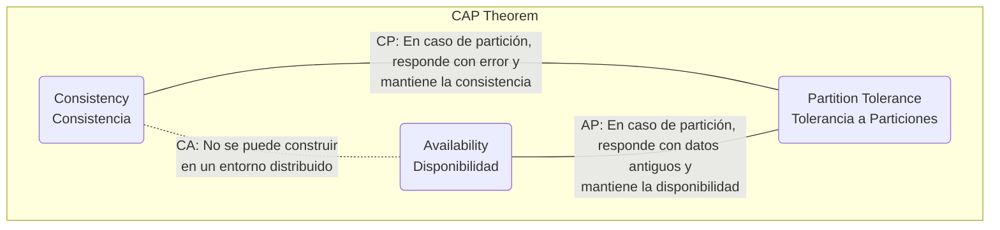
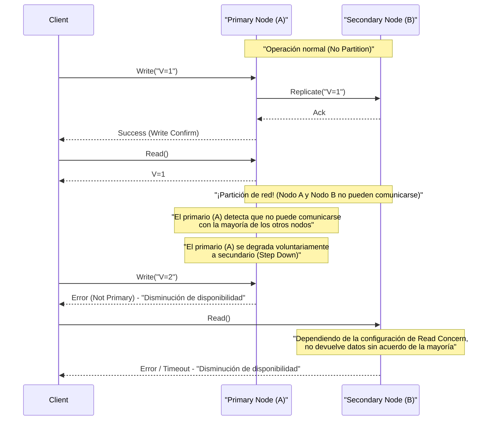
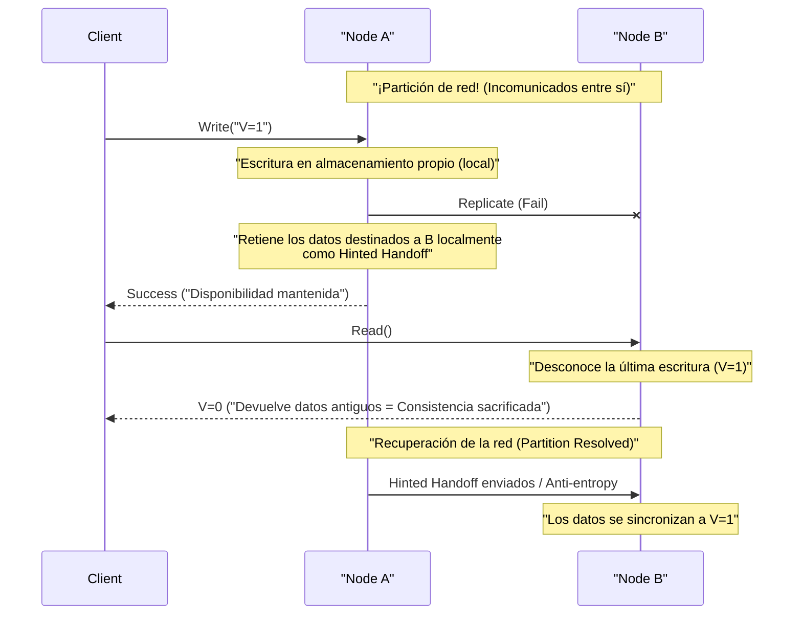

# Teorema CAP y Sistemas Distribuidos (El compromiso entre Consistencia, Disponibilidad y Tolerancia a Particiones)

En los servicios web modernos y aplicaciones empresariales, los **sistemas distribuidos** (Distributed Systems) se han convertido en un elemento indispensable. Para manejar cantidades masivas de tráfico y datos que un solo servidor no puede procesar, o para evitar interrupciones del servicio debido a fallas en el servidor, múltiples nodos (servidores) cooperan para operar como un solo sistema.

Sin embargo, existe una ley absoluta e inevitable al diseñar sistemas distribuidos. Ese es el **Teorema CAP** (CAP Theorem). En este artículo, explicaremos de manera muy detallada y exhaustiva el teorema CAP, que forma la base del diseño de sistemas distribuidos, desde su definición hasta sus antecedentes matemáticos y lógicos, el enfoque de cada producto de base de datos y el compromiso en el mundo real, el **Teorema PACELC**.

## 1. Historia y antecedentes del Teorema CAP

El teorema CAP fue propuesto en la conferencia ACM PODC (Principles of Distributed Computing) en el año 2000 por Eric Brewer, un científico informático de la Universidad de California, Berkeley. Inicialmente presentado como una "Conjetura" (Conjecture) empírica, fue probado matemáticamente en 2002 por Seth Gilbert y Nancy Lynch del Instituto Tecnológico de Massachusetts (MIT), estableciéndose formalmente como un "Teorema" (Theorem).

El trasfondo detrás de la propuesta de Brewer fue la adopción explosiva de Internet desde fines de la década de 1990. En ese momento, los arquitectos intentaban mantener las **propiedades [ACID](https://kenji.blog/es/p/rdbms-transaction-acid-isolation-level-lock/)** (Atomicidad, Consistencia, Aislamiento, Durabilidad) de las bases de datos relacionales tradicionales ([RDBMS](https://kenji.blog/es/p/rdbms-transaction-acid-isolation-level-lock/)) de un solo nodo en entornos distribuidos. Sin embargo, en entornos donde los nodos están distribuidos geográficamente y los retrasos o fallas en la red ocurren de forma rutinaria, se hizo evidente que era casi imposible escalar un sistema manteniendo perfectamente las propiedades ACID.

El teorema CAP apoyó teóricamente la realidad de que "no se puede tener todo perfectamente" en los sistemas distribuidos y se convirtió en una guía importante que obliga a los diseñadores de sistemas a realizar **compromisos** (trade-offs, sacrificar algo para ganar algo).

## 2. Definición estricta de los 3 elementos del CAP

El teorema CAP afirma que "un sistema distribuido puede garantizar simultáneamente un máximo de dos de las siguientes tres propiedades".

*   **C (Consistency: Consistencia)**
*   **A (Availability: Disponibilidad)**
*   **P (Partition Tolerance: Tolerancia a Particiones)**

Primero, verifiquemos las definiciones estrictas de estas tres propiedades en el contexto de los sistemas distribuidos.

### 2.1. C: Consistency (Consistencia)

La **consistencia** en el teorema CAP significa que "todos los clientes siempre ven los mismos datos más recientes, o reciben un error". Académicamente, es un concepto cercano a la **linealizabilidad** (Linearizability).

En un sistema distribuido, los datos se replican en múltiples nodos para mejorar la disponibilidad y el rendimiento. En un sistema que garantiza la consistencia, inmediatamente después de que se completa una escritura de actualización en un nodo, si cualquier otro cliente intenta leer datos de cualquier nodo, siempre se devuelve el resultado de la actualización más reciente o se devuelve un error (si no puede devolver los datos más recientes porque la sincronización no se ha completado).

Es decir, se requiere que todo el sistema se comporte como si fuera "un solo nodo que contiene solo los datos más recientes". Nunca se permite que el cliente lea **datos antiguos (Stale Data)**.

### 2.2. A: Availability (Disponibilidad)

La **disponibilidad** en el teorema CAP es la propiedad donde "todos los nodos en funcionamiento que no han fallado devolverán incondicionalmente una respuesta normal (no de error) dentro de un tiempo razonable".

En un sistema con disponibilidad garantizada, incluso si falla una parte del sistema (nodos específicos o líneas de red), si un cliente puede acceder a un nodo sano sobreviviente, el sistema siempre devolverá datos (aunque no haya garantía de que sean los más recientes). No se permite que el sistema devuelva un error indicando que "no puede responder debido a inconsistencias internas" o hacer que se espere por un tiempo de espera (timeout) infinito en respuesta a una solicitud válida del cliente. Siempre se requiere devolver "alguna respuesta".

### 2.3. P: Partition Tolerance (Tolerancia a Particiones)

La **tolerancia a particiones** en el teorema CAP es la propiedad donde "incluso si se corta la comunicación de red entre nodos y el sistema se divide en múltiples grupos de red (particiones) que no pueden comunicarse, el sistema en su conjunto (dentro de cada red dividida) continúa funcionando".

En los entornos de red del mundo real, la pérdida de paquetes, las fallas del enrutador, los cortes físicos de los cables o la sobrecarga temporal provocan inevitablemente retrasos o la pérdida completa de las comunicaciones entre nodos. Dado que es un sistema distribuido, debemos asumir que las particiones de red son **un fenómeno que puede ocurrir rutinariamente, no una excepción**. Por lo tanto, un sistema distribuido que abandona P (Tolerancia a particiones) y asume que "la red nunca se desconecta" no puede existir en la realidad.

## 3. ¿Por qué no se pueden satisfacer los 3 a la vez? (Prueba y lógica)

Lo que afirma el teorema CAP es que es lógicamente imposible satisfacer C, A y P simultáneamente. Explicaremos la esencia de la prueba por Gilbert y Lynch utilizando un modelo lógico fácil de entender.

Imagina un sistema distribuido simple basado en un modelo de red asíncrona como el siguiente:
*   El sistema consta de 2 nodos de datos: **Node 1** y **Node 2**.
*   El estado inicial es que el valor de una variable es `V = 0`. Ambos nodos mantienen este valor sincronizado.

Ahora, supongamos que se produce una **partición de red (Partition)**. La ruta de comunicación entre Node 1 y Node 2 se corta por completo y no pueden intercambiar mensajes entre sí (esta es una situación para probar la tolerancia a particiones P).

Durante esta partición de la red, un cliente envía una solicitud de actualización `V = 1` al **Node 1**. Node 1 recibe la solicitud y actualiza sus propios datos `V` a `1`. Sin embargo, debido a que la red está desconectada, Node 1 no puede enviar un mensaje de replicación a Node 2 diciendo que "V se ha actualizado a 1".

Inmediatamente después, otro cliente envía una solicitud de lectura `Read(V)` al **Node 2**.

En este momento, ¿qué acción debería tomar el sistema (Node 2)? El diseñador del sistema debe elegir una de las siguientes dos opciones.

### Opción 1: Sistema CP (Prioriza la consistencia y sacrifica la disponibilidad)

Node 2 no tiene forma de saber si los datos que posee `V = 0` son los más recientes en todo el sistema (porque no puede comunicarse con Node 1 para consultarlo). Si devuelve `0` a la ligera aquí, devolverá un valor más antiguo que el último valor `V = 1` escrito por otro cliente justo antes, y la **consistencia (C)** del sistema se destruye.

Para proteger estrictamente la consistencia, Node 2 debe concluir que "no puede responder porque no hay certeza de que sus datos sean los más recientes", y no tiene más remedio que **devolver un error** al cliente o **bloquear (timeout)** la respuesta hasta que la red se recupere.
En el momento en que se devuelve un error, el sistema no puede proporcionar una respuesta normal, por lo que se pierde la **disponibilidad (A)**.

### Opción 2: Sistema AP (Prioriza la disponibilidad y sacrifica la consistencia)

Node 2 no debe devolver un error al cliente y siempre debe proporcionar alguna respuesta normal (para proteger la disponibilidad A). Los únicos datos que Node 2 puede devolver actualmente son el valor antiguo que posee: `V = 0`.

Si Node 2 devuelve `0`, el cliente recibe una respuesta normal y se mantiene la **disponibilidad (A)**. Sin embargo, debido a que devuelve un valor antiguo que contradice el valor más reciente `V = 1` ya escrito en Node 1, se pierde la **consistencia (C)** del sistema.

---

Como puedes ver, bajo las restricciones físicas de una partición de red (P), es una necesidad lógica que el sistema deba **sacrificar la consistencia (C) o la disponibilidad (A)**. Este es el núcleo del Teorema CAP.



A menudo se utiliza el término "sistema CA" (un sistema que equilibra la consistencia y la disponibilidad sin tener tolerancia a particiones), pero esto se refiere a los [RDBMS](https://kenji.blog/es/p/rdbms-transaction-acid-isolation-level-lock/) tradicionales heredados que se ejecutan en un solo nodo. Como no hay cooperación entre los nodos a través de una red, el concepto de partición de red no ocurre en primer lugar. Por lo tanto, **en verdaderos sistemas distribuidos, la opción CA no existe, y en la práctica, es una elección binaria entre CP o AP**.

## 4. Ejemplos de sistemas CP y AP y su comportamiento detallado

Dependiendo de qué característica del Teorema CAP priorice el sistema, la arquitectura del producto de base de datos y su comportamiento en caso de una partición de red serán completamente diferentes. Aquí, profundizaremos en los productos representativos para sistemas CP y AP, y su comportamiento específico utilizando diagramas de secuencia.

### 4.1. Sistema CP (Consistency and Partition Tolerance)

El sistema CP es una arquitectura que **prioriza absolutamente la consistencia** cuando ocurre una partición de red, y para evitar riesgos de inconsistencia de datos (como el fenómeno Split-Brain), la **disponibilidad del sistema se detiene parcial o completamente (se sacrifica)**.

**Almacenes de datos representativos:**
*   HBase
*   [MongoDB](https://kenji.blog/es/p/nosql-database-selection-kvs-document-graph-wide-column/)
*   [Redis](https://kenji.blog/es/p/nosql-database-selection-kvs-document-graph-wide-column/) Cluster (dependiendo de la configuración)
*   Etcd, Zookeeper (estrictamente sistemas que usan algoritmos de consenso distribuido)
*   Google Cloud Spanner (Se explica más adelante, pero esencialmente es CP)

Se eligen para casos de uso en los que no se permite tomar decisiones incorrectas leyendo datos antiguos (que conducen directamente a pérdidas financieras o errores lógicos fatales), como la gestión de saldos de cuentas bancarias, gestión de inventario en sitios de comercio electrónico y sistemas de pago.

**Comportamiento de un sistema CP durante una partición de red (ejemplo de Replica Set en MongoDB):**

MongoDB construye un conjunto de réplicas que consta de un **nodo primario (Primary)** y varios **nodos secundarios (Secondary)**. Por defecto, todas las escrituras y lecturas se realizan en el nodo primario para mantener la consistencia.



Supongamos que ocurre una partición de red y un clúster de 5 nodos se divide en grupos de "2 nodos (incluyendo el primario actual)" y "3 nodos". En este momento, el grupo de 2 nodos donde reside el primario actual ha perdido la mayoría (Majority).
Para prevenir inconsistencias en los datos, [MongoDB](https://kenji.blog/es/p/nosql-database-selection-kvs-document-graph-wide-column/), al ser un sistema CP, automáticamente degrada el nodo primario aislado en la partición minoritaria a nodo secundario (Step Down). Luego, un nuevo algoritmo de elección de líder (como Raft) se ejecuta en el grupo de 3 nodos que tiene la mayoría, y se elige un nuevo primario.
Durante los segundos o decenas de segundos en que se lleva a cabo esta elección de líder, o hacia el grupo minoritario donde la partición no se resuelve, las escrituras al sistema (y dependiendo de la configuración, también las lecturas) resultan en un error, y la **disponibilidad disminuye**. Sin embargo, esto previene la situación donde dos primarios existen simultáneamente aceptando escrituras diferentes, por lo que la **consistencia se mantiene fuertemente**.

### 4.2. Sistema AP (Availability and Partition Tolerance)

El sistema AP es una arquitectura que **prioriza la disponibilidad** incluso cuando ocurre una partición de red, y proporciona acceso (lectura/escritura) al sistema continuamente. El precio de esto es que, temporalmente, los datos pueden no estar sincronizados entre nodos (lecturas de datos antiguos o conflictos de actualización), por lo que se **sacrifica la consistencia**.

**Almacenes de datos representativos:**
*   Apache [Cassandra](https://kenji.blog/es/p/nosql-database-selection-kvs-document-graph-wide-column/)
*   Amazon DynamoDB
*   Riak
*   Couchbase

Se elige para casos de uso donde es extremadamente importante para el negocio que la "pantalla se muestre rápidamente (que el sistema no se detenga), incluso si los datos no son los últimos", como mostrar cronologías de SNS (Redes Sociales), recopilar registros de actividad del usuario, revisar productos o funciones de recomendación en sitios de compras.

**Comportamiento de un sistema AP durante una partición de red (ejemplo de Cassandra):**

Cassandra adopta una **arquitectura sin maestro (Leaderless)** que no tiene un líder específico (maestro). Todos los nodos dispuestos en forma de anillo aceptan solicitudes de lectura y escritura por igual.



Supongamos que ocurre una partición de red y el Node A y el Node B no pueden comunicarse. Si un cliente escribe en el Node A en este estado, el Node A (dependiendo de la configuración del nivel de consistencia) escribirá los datos solo en su disco local y devolverá inmediatamente un "éxito de escritura" al cliente (alta disponibilidad). La replicación al Node B falla, pero el Node A memoriza temporalmente este hecho (Hinted Handoff).

Inmediatamente después de esto, si otro cliente lee datos del Node B, debido a que el Node B aún no ha recibido la actualización más reciente realizada en el Node A, devuelve con calma los datos antiguos que tiene. Esta es una situación donde se **sacrifica la consistencia**.

Sin embargo, cuando la red se recupera, el Node A envía los datos de actualización memorizados al Node B, y los datos se sincronizan en segundo plano. Esto se llama **Consistencia Eventual (Eventual Consistency)**.

## 5. Profundizando en la Consistencia Eventual (Eventual Consistency)

Decir que "se sacrifica la consistencia" en un sistema AP no significa que los datos se dejen separados y diferentes para siempre. La consistencia eventual es la garantía de que "si no se realizan nuevas actualizaciones al sistema por un cierto período, **eventualmente (Eventually)** los valores de todas las réplicas coincidirán y convergerán a un estado consistente".

En los sistemas distribuidos que asumen la consistencia eventual (sistemas con **características BASE**: Basically Available, Soft state, Eventual consistency), los desarrolladores deben diseñar aplicaciones considerando "la posibilidad de leer datos antiguos" o que "si ocurren diferentes actualizaciones simultáneamente en múltiples nodos, ocurrirán conflictos (Conflict) de datos".

### 5.1. Estrategias de resolución de conflictos de datos (Conflict)

Cuando las mismas claves se actualizan en diferentes nodos simultáneamente, ya sea durante una partición de red o debido a la latencia de la red, el sistema o la aplicación debe decidir qué actualización tomar como correcta, o cómo fusionarlas.

1.  **LWW (Last Write Wins: Última escritura gana):**
    Cada solicitud de actualización se sella con una marca de tiempo por el cliente o nodo. En caso de conflicto, simplemente **la actualización con la marca de tiempo más nueva se toma como correcta, y la actualización antigua se descarta (se sobrescribe)**. A menudo se utiliza de forma predeterminada en [Cassandra](https://kenji.blog/es/p/nosql-database-selection-kvs-document-graph-wide-column/) y otros.
    *Ventaja*: El sistema puede resolver automáticamente los conflictos y la implementación es sencilla.
    *Desventaja*: Existe el riesgo de sobrescritura de datos no intencionada debido a desviaciones de los relojes entre clientes (Clock Skew), y se debe aceptar que una actualización puede perderse (perderse) por completo.

2.  **Relojes Vectoriales (Vector Clocks):**
    El historial de actualizaciones (información de la versión) en cada nodo se mantiene en un formato de lista, y la causalidad (Causality) de las actualizaciones se rastrea estrictamente. Si el sistema detecta un conflicto que no puede resolverse automáticamente (actualizaciones realizadas exactamente al mismo tiempo, sin relación causal), el sistema no sobrescribe arbitrariamente los datos y guarda **las múltiples versiones conflictivas (Siblings) tal como están**. Luego, la próxima vez que un cliente lee los datos, devuelve todas esas versiones múltiples y **delega la resolución de conflictos (fusión) a la lógica del lado de la aplicación (o al usuario humano)**. Es una técnica poderosa adoptada en Amazon Dynamo.
    *Ventaja*: Puede evitar la pérdida de datos.
    *Desventaja*: La implementación en el lado de la aplicación se vuelve compleja.

3.  **CRDT (Conflict-free Replicated Data Type):**
    Al dar a la estructura de datos en sí propiedades matemáticas (conmutatividad, asociatividad, idempotencia), es un **tipo de datos especial diseñado de tal manera que, incluso si hay retrasos en la red o el orden de los mensajes se altera, eventualmente y siempre convergerá al mismo estado**.
    Por ejemplo, se usa en contadores distribuidos, conjuntos de solo agregar (Grow-only Set), algoritmos de edición colaborativa de texto, etc. Son compatibles en módulos como Riak o [Redis](https://kenji.blog/es/p/nosql-database-selection-kvs-document-graph-wide-column/) Enterprise.

### 5.2. Ejemplo de control en el lado de la aplicación (Resolución de conflictos tipo Vector Clock)

Aquí se muestra el pseudocódigo (estilo Python) para detectar y resolver adecuadamente conflictos de datos en el lado de la aplicación en un sistema AP. Esto usa como ejemplo el agregar artículos a un carrito de compras.

```python
import time

def update_shopping_cart(user_id, new_item, database):
    """
    Función para agregar un artículo al carrito de compras.
    Asume una BD con consistencia eventual y realiza un bloqueo optimista y resolución de conflictos.
    """
    max_retries = 3
    
    for attempt in range(max_retries):
        try:
            # 1. Obtiene los datos actuales del carrito y la versión (relojes vectoriales, etc.) desde la base de datos
            result = database.read(user_id)
            cart_data_list = result.data  # Lista que puede devolver múltiples versiones conflictivas (Siblings)
            version_context = result.context # Información de versión requerida al actualizar
            
            # 2. Lógica de resolución en caso de que se devuelvan múltiples versiones conflictivas (ocurrencia de Conflict)
            resolved_cart = resolve_conflict(cart_data_list)
            
            # 3. Agrega el nuevo artículo a los datos del carrito resueltos
            if new_item not in resolved_cart:
                resolved_cart.append(new_item)
            
            # 4. Escribe en la base de datos adjuntando el contexto de la versión (Optimistic Locking)
            # En el lado de la BD, se verifica si el context provisto coincide con el último context de la BD
            success = database.write(user_id, resolved_cart, version_context)
            
            if success:
                print("Se ha actualizado el carrito de compras con éxito.")
                return True
            else:
                # Fallo de escritura por falta de coincidencia de versión (otro cliente actualizó primero)
                print(f"Fallo de escritura por conflicto de versión. Reintentando... (Intento {attempt + 1})")
                continue # Reinicia desde la re-lectura en el siguiente ciclo
                
        except NetworkException:
            # Reintento en caso de error de red
            print(f"Error de red. Reintentando... (Intento {attempt + 1})")
            time.sleep(1 * (attempt + 1)) # Retroceso exponencial
            
    raise Exception("Fallo al actualizar el carrito a pesar de múltiples reintentos.")

def resolve_conflict(conflicting_carts):
    """
    Lógica de resolución de conflictos.
    En este ejemplo, se fusionan los contenidos de todos los carritos (se toma la unión) para evitar la pérdida de artículos.
    Dependiendo de los requisitos de negocio, se puede cambiar a una lógica como 'priorizar el que tenga la marca de tiempo más reciente'.
    """
    merged_cart = set()
    for cart in conflicting_carts:
        for item in cart:
            merged_cart.add(item)
    return list(merged_cart)
```
De esta forma, en compensación por obtener alta disponibilidad eligiendo un sistema AP, los desarrolladores asumen la responsabilidad de implementar adecuadamente "procesamiento de reintento", "bloqueo optimista (Optimistic Locking)" y "resolución de conflictos basada en lógica de negocio (Merge)" dentro del código de la aplicación.

## 6. De CAP a PACELC: Compromisos en tiempos normales

El teorema CAP define una especie de situación extrema en cuanto a "cómo se comporta el sistema durante un estado **anormal**, cuando se produce una partición de red". Sin embargo, en el funcionamiento de los sistemas del mundo real, las particiones completas de red (aunque son un riesgo esperado) no ocurren las 24 horas del día.

Por lo tanto, en 2010, Daniel Abadi, de la Universidad de Yale, propuso el **Teorema PACELC**. Esta es una extensión del teorema CAP que incorpora un modelo más práctico que incluye los **compromisos en tiempos normales (cuando la red funciona normalmente)** además de los tiempos de particiones.

**PACELC** son las siglas de lo siguiente:

*   Cuando ocurre una **P**artition (partición de red),
*   Eliges entre **A**vailability (Disponibilidad) o **C**onsistency (Consistencia) (Esta parte es igual al teorema CAP).
*   **E**lse (De lo contrario, en tiempos normales o red normal),
*   Eliges entre **L**atency (Latencia/Velocidad de respuesta) o **C**onsistency (Consistencia).

En tiempos normales, si intentas mantener estrictamente la **consistencia (C)** de los datos, en respuesta a una solicitud de escritura en un nodo, debes esperar a que se complete la replicación (sincronización) en múltiples nodos antes de devolver una respuesta completa al cliente. Este "tiempo de espera para un viaje de ida y vuelta a través de la comunicación de red" se convierte en una sobrecarga, y como resultado la **latencia (L)** del sistema empeora (se vuelve más lento).

Por el contrario, si intentas hacer que la **latencia (L)** del sistema sea lo más baja posible (rápida), diseñarás el sistema de modo que en el momento en que se reciba una solicitud de escritura de un cliente en el nodo local, devolverás un acuse de recibo de inmediato, y la replicación a los otros nodos se realiza de forma asincrónica en segundo plano. En este caso, la respuesta es extremadamente rápida, pero por unos pocos milisegundos a varios segundos hasta que se complete la replicación, el estado de los datos será inconsistente entre los nodos, y se comprometerá la **consistencia (C)**.

Al clasificar las bases de datos distribuidas modernas utilizando el teorema PACELC, se obtienen los 4 siguientes patrones.

1.  **PC/EC (Prioridad de consistencia durante la partición, prioridad de consistencia en tiempos normales):**
    Ejemplo: VoltDB, CockroachDB. Asegura una consistencia fuerte ([ACID](https://kenji.blog/es/p/rdbms-transaction-acid-isolation-level-lock/)) bajo cualquier circunstancia. En compensación, incluso en tiempos normales, se requiere comunicación síncrona entre nodos, por lo que es susceptible a la latencia, y el rendimiento se degrada en entornos con alta latencia de red (como en múltiples regiones).
2.  **PC/EL (Prioridad de consistencia durante la partición, prioridad de latencia en tiempos normales):**
    Ejemplo: [MongoDB](https://kenji.blog/es/p/nosql-database-selection-kvs-document-graph-wide-column/) (configuración por defecto), MySQL con replicación asincrónica. Evita la corrupción de datos (Split-brain) incluso a costa de detener el sistema durante emergencias como particiones, pero en tiempos normales, da prioridad al rendimiento (velocidad de lectura/escritura) y tolera la lectura temporal de datos antiguos debido a la latencia de replicación.
3.  **PA/EL (Prioridad de disponibilidad durante la partición, prioridad de latencia en tiempos normales):**
    Ejemplo: [Cassandra](https://kenji.blog/es/p/nosql-database-selection-kvs-document-graph-wide-column/), Amazon DynamoDB, Riak. Es una arquitectura enfocada en el escalamiento horizontal (Scale-out) y la alta disponibilidad, cuyo objetivo es no detener nunca el sistema y tener las velocidades de respuesta más rápidas. Acepta completamente la consistencia eventual.
4.  **PA/EC (Prioridad de disponibilidad durante la partición, prioridad de consistencia en tiempos normales):**
    Es un diseño inconsistente en sí mismo, donde sacrificas deliberadamente la latencia para garantizar la consistencia en tiempos normales, solo para permitir que los datos se vuelvan inconsistentes durante una emergencia con el fin de mantener el sistema en funcionamiento. Casi ningún enfoque como este se usa para bases de datos prácticas.

## 7. Ajuste de consistencia en bases de datos modernas (Tunable Consistency)

En las explicaciones hasta aquí, es posible que haya tenido la impresión de que "los productos de base de datos están fijos como CP o AP", pero muchas bases de datos [NoSQL](https://kenji.blog/es/p/nosql-database-selection-kvs-document-graph-wide-column/) sofisticadas modernas (Cassandra, DynamoDB, Cosmos DB, etc.) ofrecen una función llamada **Tunable Consistency**, donde **el nivel de consistencia se puede configurar de forma flexible (afinar) por los desarrolladores por consulta (query) o por sesión**.

### 7.1. Control usando Quorum (Cuórum)

Tomando Cassandra como ejemplo, la consistencia de los datos está controlada por el equilibrio de las siguientes variables.

*   **N:** El número total de nodos de réplica donde se duplican los datos (Replication Factor)
*   **W:** El número de nodos en los que se espera síncronamente una confirmación (Ack) de finalización al escribir (Write Consistency Level)
*   **R:** El número de nodos de los cuales se consulta y toma la mayoría al leer datos (Read Consistency Level)

Aquí, si se establecen valores que cumplan con la siguiente fórmula matemática, los nodos objetivo de la lectura (R) ciertamente contendrán al menos un nodo (W) con los últimos datos escritos, garantizando una **Fuerte Consistencia (Strong Consistency)**.

`W + R > N`

**Variaciones de ejemplos de configuración:**

*   **Énfasis en una fuerte consistencia (Quorum Read/Write):** `W = Quorum`, `R = Quorum`
    (Ejemplo: Para un clúster de 3 nodos, N=3, W=2, R=2. Tanto para la escritura como para la lectura, espera la respuesta de la mayoría de los nodos. Se garantiza siempre la última información, pero la latencia es media).
*   **Énfasis en la latencia de escritura (Tipo AP / Consistencia eventual):** `W = 1`, `R = All`
    (La escritura es ultrarrápida porque se considera completa en el momento en que se escribe en 1 nodo. Sin embargo, al leer, la lectura es lenta porque debe consultar todos los nodos para encontrar la marca de tiempo más reciente).
*   **Énfasis en la latencia de lectura (Tipo AP / Consistencia eventual):** `W = All`, `R = 1`
    (La escritura es lenta porque espera la finalización de escritura en todos los nodos. Sin embargo, debido a que se garantiza que cualquier nodo desde donde se lea será el último, al leer basta con consultar un nodo y es ultrarrápida).
*   **Énfasis en máxima disponibilidad y latencia (PA/EL):** `W = 1`, `R = 1`
    (Tanto la lectura como la escritura se completan solo en un nodo, el más cercano. Es el más rápido y menos propenso a fallar, pero la probabilidad de leer datos antiguos es la más alta).

De esta manera, en lugar de fijar la arquitectura de todo el sistema, los desarrolladores pueden ajustar dinámicamente los valores de W y R según los requisitos del negocio. Puedes **operar libremente el control deslizante del equilibrio CAP/PACELC tú mismo** dentro del mismo clúster de la base de datos según la naturaleza de los datos, por ejemplo: "Fuerte consistencia absoluta (W=Quorum, R=Quorum) para datos de facturación del usuario" y "Dar prioridad a la velocidad de escritura (W=1) para los registros de acceso al sitio web porque algo de pérdida de datos está bien".

### 7.2. ¿Superó Google Cloud Spanner el Teorema CAP?

En los últimos años, a veces se dice que "Google Cloud Spanner es una base de datos que garantiza una fuerte consistencia (External Consistency) a escala global mientras tiene una alta disponibilidad, y ha superado el teorema CAP".

Sin embargo, como indicó el mismo creador de Spanner, Eric Brewer, en su artículo, **Spanner no está rompiendo el Teorema CAP. Estrictamente hablando, se clasifica como un sistema "CP".**

Lo revolucionario de Spanner es que, utilizando una infraestructura de hardware combinando GPS y relojes atómicos llamada la **API TrueTime**, limitó estrictamente la "incertidumbre del reloj (Clock Uncertainty)" de todo el sistema distribuido a unos pocos milisegundos. Como resultado, incluso entre nodos distribuidos globalmente, puede determinar el orden de las transacciones con precisión.

Debido a que Spanner opera en la red privada extremadamente robusta y redundante de Google, la probabilidad de que ocurra una situación en el mundo real en la que "se produce una partición de red (P) y la disponibilidad (A) debe ser sacrificada" es tan cercana a cero como es posible (logrando cinco nueves o más de disponibilidad). Si se produjera una desconexión física de la red a gran escala (a nivel global), Spanner está diseñado para dejar de estar disponible (es decir, devolver un error) para proteger la consistencia.

## 8. Mejores prácticas en el diseño de sistemas distribuidos y conclusión

El teorema CAP y el teorema PACELC son leyes que nos enfrentan a realidades físicas y lógicas duras a la hora de diseñar o seleccionar sistemas distribuidos: "no existe una bala de plata mágica que sea perfecta en todo".

*   La partición de red (P) es inevitable en las redes reales.
*   Cuando ocurre una partición, debe elegir entre mantener la consistencia (C) y detener el sistema, o mantener la disponibilidad (A) y tolerar las inconsistencias en los datos.
*   Como muestra el teorema PACELC, incluso en tiempos normales existe un compromiso donde aumentar la consistencia (C) sacrificará la latencia (L), y disminuir la latencia sacrificará la consistencia.

Arquitectos e ingenieros de software no deben seleccionar una base de datos simplemente porque "es popular" o "la puntuación de referencia (benchmark) es alta". Lo más importante es examinar de cerca **"En el sistema que estamos construyendo, ¿cuál es el peor de los casos cuando ocurre una falla: que los datos se vuelvan inconsistentes o que el servicio se detenga por completo y los usuarios no puedan hacer nada?"**.

Si se trata de una transacción financiera, definitivamente debes seleccionar un sistema CP (o [RDBMS](https://kenji.blog/es/p/rdbms-transaction-acid-isolation-level-lock/)) para garantizar una fuerte consistencia. Por otro lado, si se trata de un servicio SNS global, podrías optar por un sistema AP y perseguir una alta disponibilidad y baja latencia las 24 horas del día, los 365 días del año, incluso aceptando la consistencia eventual.

Y en muchos casos, no puede depender únicamente de las características de la infraestructura o de los productos de bases de datos. Asumiendo que la base de datos actuará como un sistema AP, **"la capacidad de diseño a prueba de fallos (fail-safe)"** para cubrir con éxito las deficiencias de la infraestructura y las inconsistencias de datos a través de patrones de implementación en el lado de la aplicación (procesamiento de reintento, garantizar la idempotencia, transacciones compensatorias (Saga Pattern, etc.), lógicas de resolución de conflictos) es la clave principal para construir un sistema distribuido robusto y moderno.
