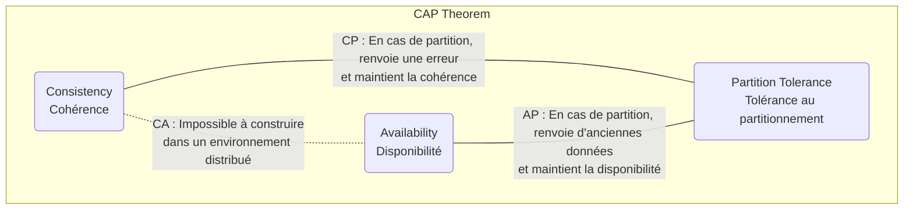
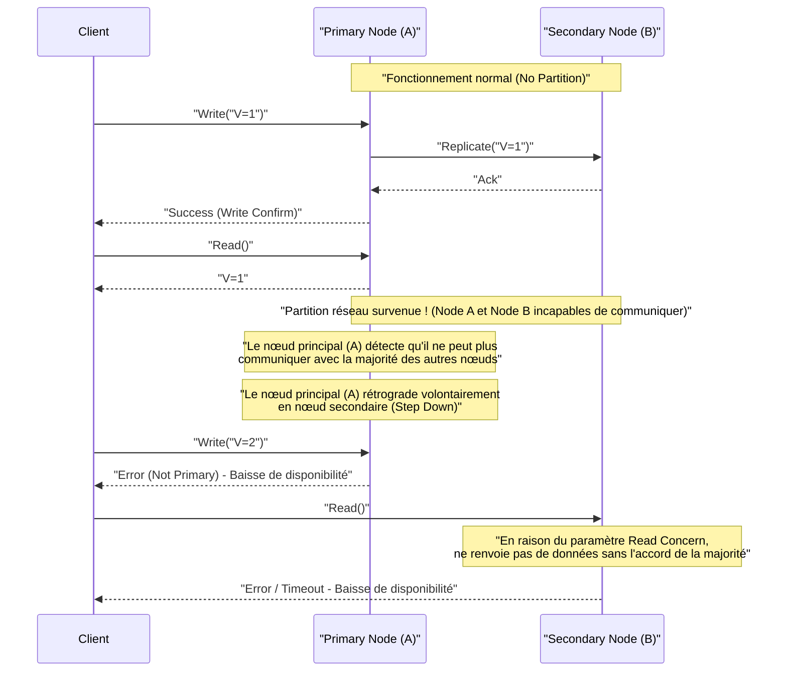
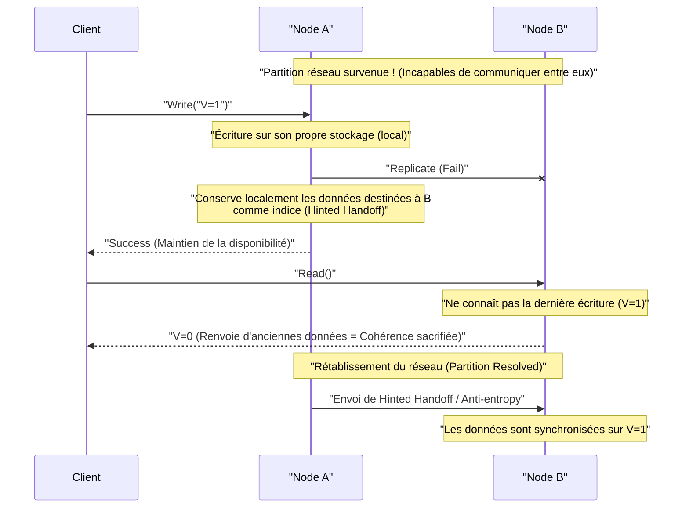

# Théorème CAP et systèmes distribués (compromis entre cohérence, disponibilité et tolérance au partitionnement)

Dans les services Web et les applications d'entreprise modernes, les **systèmes distribués** (Distributed Systems) sont devenus un élément essentiel. Pour gérer un trafic et des données massifs qu'un seul serveur ne peut traiter, ou pour éviter les interruptions de service dues à des pannes de serveur, plusieurs nœuds (serveurs) sont coordonnés pour fonctionner comme un seul système.

Cependant, il existe une loi absolue incontournable lors de la conception de systèmes distribués. Il s'agit du **théorème CAP** (CAP Theorem). Cet article explique de manière très détaillée et exhaustive le théorème CAP, qui est au cœur de la conception des systèmes distribués, depuis sa définition jusqu'à son contexte mathématique et logique, les approches de chaque produit de base de données, et le compromis dans le monde réel, le **théorème PACELC**.

## 1. Histoire et contexte du théorème CAP

Le théorème CAP a été proposé en 2000 lors de la conférence ACM PODC (Principles of Distributed Computing) par Eric Brewer, informaticien à l'Université de Californie à Berkeley. Initialement présenté comme une « conjecture » basée sur l'expérience, il a été mathématiquement prouvé en 2002 par Seth Gilbert et Nancy Lynch du Massachusetts Institute of Technology (MIT), l'établissant formellement comme un « théorème ».

Le contexte dans lequel Brewer a proposé ce théorème est l'adoption explosive d'Internet depuis la fin des années 1990. Les architectes de l'époque tentaient de maintenir les **propriétés [ACID](https://kenji.blog/fr/p/rdbms-transaction-acid-isolation-level-lock/)** (Atomicité, Cohérence, Isolation, Durabilité) des bases de données relationnelles traditionnelles ([RDBMS](https://kenji.blog/fr/p/rdbms-transaction-acid-isolation-level-lock/)) fonctionnant sur un seul nœud, même dans un environnement distribué. Cependant, dans un environnement où les nœuds sont géographiquement dispersés et où les retards et les pannes de réseau se produisent quotidiennement, il est devenu évident qu'il était presque impossible de faire évoluer le système tout en maintenant parfaitement les propriétés ACID.

Le théorème CAP soutient théoriquement la réalité selon laquelle « il est impossible de tout rendre parfait » dans un système distribué, et est devenu une ligne directrice importante qui oblige les concepteurs de systèmes à faire des **compromis** (sacrifier quelque chose pour obtenir autre chose).

## 2. Définition stricte des 3 éléments du CAP

Le théorème CAP affirme que « un système distribué peut garantir simultanément au maximum deux des trois garanties suivantes ».

*   **C (Consistency : Cohérence)**
*   **A (Availability : Disponibilité)**
*   **P (Partition Tolerance : Tolérance au partitionnement)**

Commençons par vérifier les définitions strictes de ces trois propriétés dans le contexte des systèmes distribués.

### 2.1. C : Consistency (Cohérence)

La **cohérence** dans le théorème CAP fait référence à la propriété selon laquelle « tous les clients peuvent toujours lire les mêmes données les plus récentes, ou recevoir une erreur ». Académiquement, c'est un concept proche de la **linéarisabilité** (Linearizability).

Dans un système distribué, les données sont répliquées sur plusieurs nœuds pour améliorer la disponibilité et les performances. Dans un système où la cohérence est garantie, immédiatement après la fin de l'écriture de la mise à jour des données sur un nœud, si un autre client quelconque tente de lire les données à partir d'un nœud quelconque, il recevra toujours le résultat de la dernière mise à jour, ou une erreur sera renvoyée (par exemple, si les dernières données ne peuvent pas être renvoyées en raison d'un retard de synchronisation).

En d'autres termes, le système entier doit se comporter comme s'il s'agissait « d'un seul nœud ne conservant que les données uniques les plus récentes ». Il n'est en aucun cas acceptable qu'un client lise des **données obsolètes (Stale Data)**.

### 2.2. A : Availability (Disponibilité)

La **disponibilité** dans le théorème CAP est la propriété selon laquelle « tous les nœuds opérationnels sans défaillance renvoient toujours une réponse valide (réponse sans erreur) dans un délai raisonnable ».

Dans un système où la disponibilité est garantie, même si une partie du système (nœuds spécifiques ou lignes réseau) est en panne, tant que le client peut accéder à un nœud sain et survivant, le système renverra toujours des données (même s'il n'est pas garanti qu'elles soient les plus récentes). Face à une requête légitime d'un client, il n'est pas acceptable que le système renvoie une erreur au motif qu'il « ne peut pas répondre en raison d'une incohérence interne » ou qu'il fasse attendre indéfiniment un dépassement de délai. Il est toujours tenu de renvoyer « une réponse quelconque ».

### 2.3. P : Partition Tolerance (Tolérance au partitionnement)

La **tolérance au partitionnement** dans le théorème CAP est la propriété selon laquelle « même si la communication réseau entre les nœuds est interrompue et que le système est divisé en plusieurs groupes de réseaux incapables de communiquer (partitions), le système dans son ensemble continue de fonctionner (au sein de chaque réseau divisé) ».

Dans les environnements réseau réels, il est inévitable que la communication entre les nœuds soit retardée ou complètement perdue en raison de pertes de paquets, de pannes de routeurs, de coupures physiques de câbles ou de surcharges temporaires. Étant donné qu'il s'agit d'un système distribué, les partitions réseau doivent être considérées comme **un phénomène quotidien qui peut se produire plutôt que comme une exception**. Par conséquent, un système distribué qui abandonne P (tolérance au partitionnement) et suppose que « le réseau ne sera jamais coupé » ne peut pas exister dans la réalité.

## 3. Pourquoi est-il impossible de satisfaire les 3 en même temps ? (Preuve et logique)

Le théorème CAP affirme qu'il est logiquement impossible de satisfaire simultanément C, A et P. Nous expliquerons l'essence de la preuve de Gilbert et Lynch avec un modèle logique simple.

Imaginez un système distribué simple basé sur un modèle de réseau asynchrone comme suit :
*   Le système est composé de deux nœuds de données : **Node 1** et **Node 2**.
*   Comme état initial, la valeur d'une certaine variable est `V = 0`. Les deux nœuds conservent cette valeur de manière synchronisée.

Maintenant, supposons qu'une **partition réseau (Partition)** se produise. La voie de communication reliant Node 1 et Node 2 est complètement coupée, et ils ne peuvent plus s'envoyer ni recevoir de messages (c'est une situation qui teste la tolérance au partitionnement P).

Pendant cette partition réseau, un client envoie une requête de mise à jour de valeur `V = 1` à **Node 1**. Node 1 reçoit la requête et met à jour sa propre donnée `V` à `1`. Cependant, comme le réseau est coupé, Node 1 ne peut pas envoyer un message de réplication à Node 2 indiquant que « V a été mis à jour à 1 ».

Immédiatement après, un autre client envoie une requête de lecture `Read(V)` à **Node 2**.

À ce moment, quelle action le système (Node 2) devrait-il entreprendre ? Le concepteur du système doit choisir l'une des deux options suivantes.

### Option 1 : Système CP (Priorité à la cohérence, au détriment de la disponibilité)

Node 2 n'a aucun moyen de savoir si la donnée `V = 0` qu'il détient est la plus récente dans l'ensemble du système (car il ne peut pas communiquer avec Node 1 pour s'en enquérir). Si on renvoie simplement `0` ici, on renverrait une valeur plus ancienne que la dernière valeur `V = 1` écrite par un autre client juste avant, ce qui détruit la **cohérence (C)** du système.

Pour maintenir strictement la cohérence, Node 2 n'a d'autre choix que de juger qu'il « n'a aucune certitude que ses propres données sont les plus récentes, et ne peut donc pas répondre », et de **renvoyer une erreur** au client, ou de **bloquer (timeout)** la réponse jusqu'à ce que le réseau se rétablisse.
Au moment où l'erreur est renvoyée, le système n'a pas réussi à fournir une réponse normale, de sorte que la **disponibilité (A)** est perdue.

### Option 2 : Système AP (Priorité à la disponibilité, au détriment de la cohérence)

Node 2 ne doit pas renvoyer d'erreur au client et doit toujours renvoyer une réponse normale quelconque (pour maintenir la disponibilité A). La seule donnée que Node 2 peut renvoyer dans la situation actuelle est l'ancienne valeur `V = 0` qu'il détient.

Si Node 2 renvoie `0`, une réponse normale est renvoyée au client, et la **disponibilité (A)** est maintenue. Cependant, la **cohérence (C)** du système est perdue car il renvoie une ancienne valeur qui est en contradiction avec la dernière valeur `V = 1` déjà écrite dans Node 1.

---

Ainsi, dans une situation où la contrainte physique d'une partition réseau (P) se produit, on peut voir que le système doit logiquement **sacrifier soit la cohérence (C) soit la disponibilité (A)**. C'est le cœur du théorème CAP.



Souvent, le terme « système CA (un système qui concilie cohérence et disponibilité, et qui n'a pas de tolérance au partitionnement) » est utilisé, mais il fait référence aux anciens SGBDR fonctionnant sur un seul nœud. Puisqu'il n'y a pas de coordination entre les nœuds via un réseau, le concept même de partition réseau ne se pose pas. Par conséquent, **dans un véritable système distribué, l'option CA n'existe pas, et il s'agit essentiellement d'un choix binaire entre CP ou AP**.

## 4. Exemples concrets et comportements détaillés des systèmes CP et AP

Selon la propriété du théorème CAP que le système privilégie, l'architecture du produit de base de données et son comportement en cas de partition réseau seront complètement différents. Nous allons approfondir ici des produits représentatifs des systèmes CP et AP, ainsi que leurs comportements spécifiques avec des diagrammes de séquence.

### 4.1. Système CP (Consistency and Partition Tolerance)

Un système CP est une architecture qui **donne la priorité absolue à la cohérence** en cas de partition réseau, et **arrête (sacrifie) partiellement ou totalement la disponibilité** du système pour éviter le risque d'incohérence des données (comme le phénomène de split-brain).

**Magasins de données représentatifs :**
*   HBase
*   [MongoDB](https://kenji.blog/fr/p/nosql-database-selection-kvs-document-graph-wide-column/)
*   [Redis](https://kenji.blog/fr/p/nosql-database-selection-kvs-document-graph-wide-column/) Cluster (selon la configuration)
*   Etcd, Zookeeper (strictement parlant, ce sont des systèmes utilisant des algorithmes de consensus distribués)
*   Google Cloud Spanner (comme nous le verrons plus loin, il s'agit fondamentalement de CP)

Ils sont choisis pour des cas d'utilisation où il n'est pas permis de prendre des décisions erronées en lisant des données obsolètes (ce qui entraîne des pertes financières ou des erreurs logiques fatales), comme la gestion des soldes de comptes bancaires, la gestion des stocks de sites de commerce électronique, les systèmes de paiement, etc.

**Comportement d'un système CP lors d'une partition réseau (exemple de Replica Set MongoDB) :**

MongoDB construit un Replica Set (ensemble de répliques) composé d'un **nœud principal (Primary)** et de plusieurs **nœuds secondaires (Secondary)**. Par défaut, toutes les écritures et lectures sont effectuées sur le nœud principal pour maintenir la cohérence.



Si une partition réseau se produit et que l'on suppose qu'un cluster de 5 nœuds est divisé en groupes de "2 nœuds (y compris le nœud principal actuel)" et "3 nœuds". À ce moment-là, le groupe de 2 nœuds dans lequel se trouve le nœud principal actuel a perdu la majorité (Majority).
Le système CP [MongoDB](https://kenji.blog/fr/p/nosql-database-selection-kvs-document-graph-wide-column/), afin d'éviter l'incohérence des données, rétrograde automatiquement (Step Down) le nœud principal laissé dans le groupe minoritaire en nœud secondaire. Ensuite, un nouvel algorithme d'élection de leader (comme Raft) s'exécute dans le groupe de 3 nœuds possédant la majorité, et un nouveau nœud principal est élu.
Pendant les quelques secondes à quelques dizaines de secondes durant lesquelles cette élection de leader a lieu, ou pour le groupe minoritaire dont la partition n'est pas résolue, les écritures sur le système (et les lectures selon la configuration) entraînent une erreur, et **la disponibilité diminue**. Cependant, cela empêche l'existence simultanée de deux nœuds principaux acceptant des écritures distinctes, et **la cohérence est fortement maintenue**.

### 4.2. Système AP (Availability and Partition Tolerance)

Un système AP est une architecture qui **donne la priorité absolue à la disponibilité** même en cas de partition réseau, et continue toujours de fournir un accès au système (lecture/écriture). En contrepartie, un état où les données ne sont temporairement pas synchronisées entre les nœuds (lecture de données obsolètes ou conflits de mise à jour) se produit, et **la cohérence est sacrifiée**.

**Magasins de données représentatifs :**
*   Apache [Cassandra](https://kenji.blog/fr/p/nosql-database-selection-kvs-document-graph-wide-column/)
*   Amazon DynamoDB
*   Riak
*   Couchbase

Ils sont choisis pour des cas d'utilisation où il est extrêmement important sur le plan commercial que "l'écran s'affiche rapidement de toute façon (que le système ne s'arrête pas), même si les données ne sont pas les plus récentes", comme l'affichage de la chronologie des réseaux sociaux, la collecte des journaux de comportement des utilisateurs, les avis sur les produits et les fonctionnalités de recommandation des sites d'achat.

**Comportement d'un système AP lors d'une partition réseau (exemple de Cassandra) :**

Cassandra adopte une **architecture sans leader (Leaderless)** qui n'a pas de leader (maître) spécifique. Tous les nœuds disposés en anneau acceptent les demandes de lecture et d'écriture sur un pied d'égalité.



Supposons qu'une partition réseau se produit et que Node A et Node B ne puissent plus communiquer. Si un client écrit sur Node A dans cet état, Node A n'écrit les données (selon le niveau de cohérence défini) que sur son disque local et renvoie immédiatement un "succès d'écriture" au client (haute disponibilité). La réplication sur Node B échoue, mais Node A mémorise temporairement ce fait (Hinted Handoff).

Immédiatement après, si un autre client lit des données depuis Node B, Node B renverra calmement les anciennes données qu'il possède, car il n'a pas encore reçu la dernière mise à jour effectuée sur Node A. C'est **l'état où la cohérence est sacrifiée**.

Cependant, lorsque le réseau est rétabli, Node A envoie les données de mise à jour mémorisées à Node B, et les données sont synchronisées en arrière-plan. C'est ce qu'on appelle la **cohérence éventuelle (Eventual Consistency)**.

## 5. Examen approfondi de la cohérence éventuelle (Eventual Consistency)

Dire que "la cohérence est sacrifiée" dans un système AP ne signifie pas que les données sont laissées disjointes pour l'éternité. La cohérence éventuelle est la garantie que "si aucune nouvelle mise à jour n'est apportée au système pendant une certaine période, **finalement (Eventually)** les valeurs de toutes les répliques correspondront, convergeant vers un état où la cohérence est maintenue".

Dans un système distribué qui présuppose une cohérence éventuelle (un système ayant les **propriétés BASE** : Basically Available, Soft state, Eventual consistency), les développeurs doivent concevoir des applications en gardant à l'esprit "qu'il est possible de lire d'anciennes données" et "que des conflits (Conflict) de données se produiront si des mises à jour distinctes sont effectuées simultanément sur plusieurs nœuds".

### 5.1. Stratégies de résolution des conflits (Conflict) de données

Lorsque des mises à jour pour la même clé se produisent simultanément sur différents nœuds pendant une partition réseau ou en raison de retards du réseau, le système ou l'application doit décider quelle mise à jour est considérée comme correcte, ou comment les fusionner.

1.  **LWW (Last Write Wins : Priorité au dernier écrivain) :**
    Un horodatage est attribué par le client ou le nœud à chaque requête de mise à jour. En cas de conflit, **la mise à jour avec l'horodatage le plus récent est simplement considérée comme correcte, et les anciennes mises à jour sont ignorées (écrasées)**. Ceci est souvent utilisé par défaut dans [Cassandra](https://kenji.blog/fr/p/nosql-database-selection-kvs-document-graph-wide-column/), etc.
    *Avantage* : Le système peut résoudre automatiquement les conflits, et l'implémentation est simple.
    *Inconvénient* : Il y a un risque que les données soient involontairement écrasées en raison d'un décalage d'horloge (Clock Skew) entre les clients, et il faut accepter qu'une des mises à jour soit complètement perdue.

2.  **Horloges vectorielles (Vector Clocks) :**
    L'historique des mises à jour (informations de version) sur chaque nœud est conservé sous forme de liste, et la relation de cause à effet (Causality) des mises à jour est strictement suivie. Lorsqu'un conflit qui ne peut pas être résolu automatiquement par le système (mises à jour effectuées exactement au même moment et sans relation de cause à effet) est détecté, le système n'écrase pas arbitrairement les données, mais **enregistre telles quelles plusieurs versions conflictuelles (Siblings)**. Ensuite, lors de la prochaine lecture des données par un client, il renvoie toutes ces multiples versions et **laisse la logique de l'application (ou à un utilisateur humain) le soin de résoudre (fusionner) le conflit**. C'est une technique puissante adoptée par Amazon Dynamo, etc.
    *Avantage* : Permet d'éviter la perte de données.
    *Inconvénient* : L'implémentation côté application devient complexe.

3.  **CRDT (Conflict-free Replicated Data Type) :**
    En dotant la structure de données elle-même de propriétés mathématiques (commutativité, associativité, idempotence), il s'agit d'un **type de données spécial conçu pour toujours converger vers le même état, même en cas de retards du réseau ou de modification de l'ordre des messages**.
    Par exemple, il est utilisé pour les compteurs distribués, les ensembles à ajout uniquement (Grow-only Set), les algorithmes d'édition collaborative de texte, etc. Il est pris en charge par Riak, les modules [Redis](https://kenji.blog/fr/p/nosql-database-selection-kvs-document-graph-wide-column/) Enterprise, etc.

### 5.2. Exemple de contrôle côté application (résolution de conflit avec horloge vectorielle)

Voici un pseudocode (style Python) pour détecter et résoudre de manière appropriée les conflits de données du côté de l'application dans un système AP. Ceci utilise l'ajout d'articles à un panier d'achat comme exemple.

```python
import time

def update_shopping_cart(user_id, new_item, database):
    """
    Fonction pour ajouter un article au panier d'achat.
    Suppose une base de données avec cohérence éventuelle, et effectue un verrouillage optimiste et une résolution de conflits.
    """
    max_retries = 3
    
    for attempt in range(max_retries):
        try:
            # 1. Récupérer les données actuelles du panier et la version (horloge vectorielle, etc.) depuis la base de données
            result = database.read(user_id)
            cart_data_list = result.data  # Liste qui peut renvoyer plusieurs versions conflictuelles (Siblings)
            version_context = result.context # Informations de version requises lors de la mise à jour
            
            # 2. Logique de résolution si plusieurs versions conflictuelles sont renvoyées (lors de l'apparition d'un conflit)
            resolved_cart = resolve_conflict(cart_data_list)
            
            # 3. Ajouter le nouvel article aux données du panier résolues
            if new_item not in resolved_cart:
                resolved_cart.append(new_item)
            
            # 4. Écrire dans la base de données avec le contexte de version (Optimistic Locking)
            # Du côté de la base de données, vérifier si le contexte fourni correspond au dernier contexte côté base de données
            success = database.write(user_id, resolved_cart, version_context)
            
            if success:
                print("La mise à jour du panier a réussi.")
                return True
            else:
                # Échec d'écriture dû à une incompatibilité de version (un autre client l'a mis à jour en premier)
                print(f"Échec de l'écriture en raison d'un conflit de version. Nouvelle tentative... (Tentative {attempt + 1})")
                continue # Recommencer depuis la relecture dans la boucle suivante
                
        except NetworkException:
            # Réessayer en cas d'erreur réseau
            print(f"Erreur réseau. Nouvelle tentative... (Tentative {attempt + 1})")
            time.sleep(1 * (attempt + 1)) # Backoff exponentiel
            
    raise Exception("Échec de la mise à jour du panier malgré plusieurs tentatives.")

def resolve_conflict(conflicting_carts):
    """
    Logique de résolution de conflits.
    Dans cet exemple, fusionner (prendre l'union de) le contenu de tous les paniers pour éviter la perte d'articles.
    Selon les exigences métier, modifier la logique pour 'prioriser celui avec l'horodatage le plus récent', etc.
    """
    merged_cart = set()
    for cart in conflicting_carts:
        for item in cart:
            merged_cart.add(item)
    return list(merged_cart)
```
Ainsi, en échange de l'obtention d'une haute disponibilité en choisissant un système AP, les développeurs sont responsables d'implémenter de manière appropriée la "gestion des nouvelles tentatives", le "verrouillage optimiste (Optimistic Locking)" et la "résolution des conflits (Merge) basée sur la logique métier" dans le code de l'application.

## 6. De CAP à PACELC : Le compromis en temps normal

Le théorème CAP définit en quelque sorte une situation extrême : "Comment le système se comportera **en cas d'anomalie** lorsqu'une partition réseau se produit". Cependant, dans l'exploitation des systèmes réels, la partition réseau complète (bien qu'elle soit un risque à anticiper) ne se produit pas 24h/24 et 7j/7.

C'est pourquoi le **théorème PACELC** a été proposé en 2010 par Daniel Abadi de l'Université de Yale (à l'époque). Il s'agit d'un modèle plus pratique qui étend le théorème CAP et intègre non seulement le cas d'une partition réseau, mais aussi "les **compromis en temps normal (lorsque le réseau fonctionne normalement)**".

**PACELC** est un acronyme de :

*   **P**artition Lors d'un événement (lors d'une partition réseau),
*   Choisir entre **A**vailability (Disponibilité) ou **C**onsistency (Cohérence) (c'est le même que le théorème CAP).
*   **E**lse (Sinon, en temps normal, lorsque le réseau est normal),
*   Choisir entre **L**atency (Latence/Vitesse de réponse) ou **C**onsistency (Cohérence).

En temps normal, si l'on tente de maintenir strictement la **cohérence (C)** des données, il est nécessaire d'attendre l'achèvement de la réplication (synchronisation) vers plusieurs autres nœuds avant de renvoyer une réponse d'achèvement au client pour une demande d'écriture sur un nœud. Ce "temps d'attente pour l'aller-retour de la communication réseau" devient une surcharge, ce qui aggrave (ralentit) la **latence (L)** du système.

Inversement, si l'on essaie de réduire (accélérer) la **latence (L)** du système à la limite, la conception consistera à renvoyer une réponse d'achèvement à l'instant où la demande d'écriture du client est acceptée par le nœud local, et la réplication vers d'autres nœuds s'effectuera de manière asynchrone en arrière-plan. Dans ce cas, la réponse sera extrêmement rapide, mais pendant les quelques millisecondes à quelques secondes jusqu'à la fin de la réplication, il y aura un état où les données ne correspondent pas entre les nœuds, ce qui compromet la **cohérence (C)**.

Si l'on classe les bases de données distribuées modernes selon le théorème PACELC, on obtient les 4 modèles suivants :

1.  **PC/EC (Priorité à la cohérence en cas de partition, priorité à la cohérence même en temps normal) :**
    Exemples : VoltDB, CockroachDB. Garantit une cohérence forte ([ACID](https://kenji.blog/fr/p/rdbms-transaction-acid-isolation-level-lock/)) dans toutes les situations. En contrepartie, la communication de synchronisation entre les nœuds étant requise même en temps normal, elle est vulnérable à la latence, et les performances se dégradent dans les environnements à forte latence réseau (comme les multi-régions).
2.  **PC/EL (Priorité à la cohérence en cas de partition, priorité à la latence en temps normal) :**
    Exemples : [MongoDB](https://kenji.blog/fr/p/nosql-database-selection-kvs-document-graph-wide-column/) (configuration par défaut), réplication asynchrone de MySQL. En cas d'anomalie comme une partition, il empêche la corruption des données (split-brain) même si cela signifie arrêter le système, mais en temps normal, il met l'accent sur les performances (vitesse de lecture et d'écriture) et tolère la lecture temporaire de données obsolètes due au délai de réplication.
3.  **PA/EL (Priorité à la disponibilité en cas de partition, priorité à la latence même en temps normal) :**
    Exemples : [Cassandra](https://kenji.blog/fr/p/nosql-database-selection-kvs-document-graph-wide-column/), Amazon DynamoDB, Riak. Il n'arrête le système à aucun moment et vise la vitesse de réponse la plus rapide. C'est une architecture spécialisée dans l'évolutivité et la haute disponibilité, acceptant pleinement la cohérence éventuelle.
4.  **PA/EC (Priorité à la disponibilité en cas de partition, priorité à la cohérence en temps normal) :**
    Étant donné qu'il s'agit d'une conception incohérente consistant à maintenir le système en fonctionnement même en rendant les données incohérentes en cas d'anomalie, tout en sacrifiant spécifiquement la latence pour garantir la cohérence en temps normal, presque aucune base de données pratique n'adopte cette approche.

## 7. Ajustement de la cohérence dans les bases de données modernes (Tunable Consistency)

Jusqu'à présent, vous avez peut-être eu l'impression que "CP ou AP est fixé pour chaque produit de base de données", mais de nombreuses bases de données [NoSQL](https://kenji.blog/fr/p/nosql-database-selection-kvs-document-graph-wide-column/) modernes et sophistiquées (Cassandra, DynamoDB, Cosmos DB, etc.) offrent une fonctionnalité où **les développeurs peuvent définir (ajuster) de manière flexible le "niveau de cohérence" par requête ou par session**, c'est-à-dire **Tunable Consistency**.

### 7.1. Contrôle à l'aide de Quorum (Quorum)

En prenant Cassandra comme exemple, la cohérence des données est contrôlée par l'équilibre des variables suivantes.

*   **N :** Le nombre total de nœuds de réplication sur lesquels les données sont répliquées (Replication Factor)
*   **W :** Le nombre de nœuds pour lesquels attendre un Ack (accusé de réception) d'achèvement d'écriture de manière synchrone lors de l'écriture (Write Consistency Level)
*   **R :** Le nombre de nœuds à interroger et dont on prend la majorité lors de la lecture (Read Consistency Level)

Ici, si nous le configurons pour satisfaire la formule suivante, le groupe de nœuds cible pour la lecture (R) inclura toujours au moins un nœud (W) contenant les dernières données écrites, ce qui permet de garantir une **cohérence forte (Strong Consistency)**.

`W + R > N`

**Variations des exemples de configuration :**

*   **Accent sur une forte cohérence (Quorum Read/Write) :** `W = Quorum`, `R = Quorum`
    (Exemple : si configuration à 3 nœuds, N=3, W=2, R=2. L'écriture et la lecture attendent toutes deux la réponse d'une majorité de nœuds. Les dernières données sont toujours garanties, mais la latence est moyenne.)
*   **Accent sur la latence d'écriture (Type AP, cohérence éventuelle) :** `W = 1`, `R = All`
    (L'écriture est considérée comme terminée au moment où elle est écrite sur 1 nœud, donc l'écriture est extrêmement rapide. Cependant, lors de la lecture, il faut interroger tous les nœuds pour trouver l'horodatage le plus récent, donc la lecture est lente.)
*   **Accent sur la latence de lecture (Type AP, cohérence éventuelle) :** `W = All`, `R = 1`
    (L'écriture est lente car elle attend que l'écriture soit terminée sur tous les nœuds. Cependant, comme il est garanti qu'elle est toujours la plus récente, quel que soit le nœud depuis lequel elle est lue, la lecture ne nécessite d'interroger qu'un seul nœud, ce qui est extrêmement rapide.)
*   **Accent sur la disponibilité ultime et la latence (PA/EL) :** `W = 1`, `R = 1`
    (L'écriture et la lecture sont effectuées uniquement par le nœud le plus proche. C'est le plus rapide et le moins susceptible de tomber en panne, mais la probabilité de lire des données obsolètes est la plus élevée.)

Ainsi, plutôt que de figer l'architecture globale du système, les développeurs ajustent dynamiquement les valeurs de W et R pour répondre aux besoins de l'entreprise. Vous pouvez **manipuler vous-même le curseur du compromis CAP/PACELC** en fonction de la nature des données traitées au sein du même cluster de base de données, par exemple "Une forte cohérence est absolue pour les données de facturation des utilisateurs (W=Quorum, R=Quorum)" et "L'accent est mis sur la vitesse d'écriture pour les journaux d'accès au site Web car une légère perte est acceptable (W=1)".

### 7.2. Google Cloud Spanner a-t-il contourné le théorème CAP ?

Récemment, on dit parfois que "Google Cloud Spanner est une base de données qui garantit une forte cohérence (External Consistency) à l'échelle mondiale tout en ayant une haute disponibilité, et a surmonté le théorème CAP".

Cependant, comme le déclare le développeur de Spanner Eric Brewer lui-même dans son article, **Spanner n'a pas brisé le théorème CAP. Strictement parlant, il est classé comme un « système CP ».**

L'innovation de Spanner est d'utiliser une infrastructure de support matériel appelée **TrueTime API** qui combine le GPS et les horloges atomiques pour maintenir "l'incertitude de l'horloge (Clock Uncertainty)" de l'ensemble du système distribué strictement en deçà de quelques millisecondes. Cela permet de déterminer avec précision l'ordre des transactions, même entre des nœuds distribués à l'échelle mondiale.

Parce que Spanner s'exécute sur le réseau privé extrêmement robuste et redondant de Google, il réduit simplement la probabilité qu'une situation se produise dans le monde réel où "une partition réseau (P) se produit et la disponibilité (A) doit être sacrifiée" à presque zéro (atteignant une disponibilité de cinq neuf ou plus). Si une coupure physique du réseau à grande échelle se produisait au niveau mondial, Spanner est conçu pour arrêter la disponibilité (c'est-à-dire renvoyer une erreur) afin de préserver la cohérence.

## 8. Meilleures pratiques et conclusion dans la conception de systèmes distribués

Les théorèmes CAP et PACELC sont des lois qui nous confrontent à la dure réalité physique et logique qu'il n'y a "pas de balle d'argent magique parfaite en tout" lors de la conception et de la sélection de systèmes distribués.

*   Les partitions réseau (P) sont inévitables dans les réseaux réels.
*   En cas de partition, vous devez choisir entre préserver la cohérence (C) et arrêter le système, ou préserver la disponibilité (A) et tolérer l'incohérence des données.
*   Comme le montre le théorème PACELC, même en temps normal, il existe un compromis : si vous essayez d'augmenter la cohérence (C), la latence (L) est sacrifiée, et si vous essayez de diminuer la latence, la cohérence est sacrifiée.

Les architectes et les ingénieurs logiciels ne doivent pas choisir une base de données simplement parce qu'elle est "à la mode" ou a un "score de référence élevé". Le plus important est de réfléchir profondément à **« Dans le système que nous construisons, en cas de panne, le pire scénario est-il que les données deviennent incohérentes, ou que le service s'arrête complètement et que les utilisateurs ne puissent rien faire ? »**.

Pour les transactions financières, vous devez sans aucun doute choisir un système CP (ou [RDBMS](https://kenji.blog/fr/p/rdbms-transaction-acid-isolation-level-lock/)) pour garantir une forte cohérence. D'autre part, pour un service de réseau social mondial, vous devez choisir un système AP, acceptant la cohérence éventuelle pour poursuivre une haute disponibilité 24/7 et une faible latence.

Et dans de nombreux cas, vous ne pouvez pas vous fier uniquement aux fonctionnalités de l'infrastructure ou des produits de base de données. C'est votre **« capacité de conception fail-safe »** pour couvrir astucieusement les défauts de l'infrastructure et l'incohérence des données avec des modèles d'implémentation côté application (processus de nouvelle tentative, garantie d'idempotence, transactions de compensation (modèle Saga, etc.), logique de résolution des conflits) tout en supposant que la base de données se comporte comme un système AP, qui est la clé ultime de la construction de systèmes distribués robustes et modernes.
