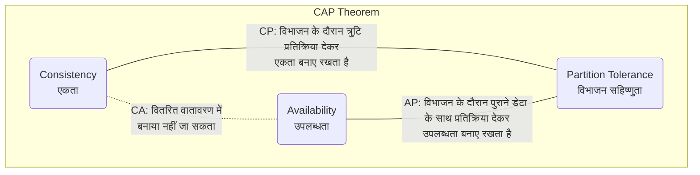
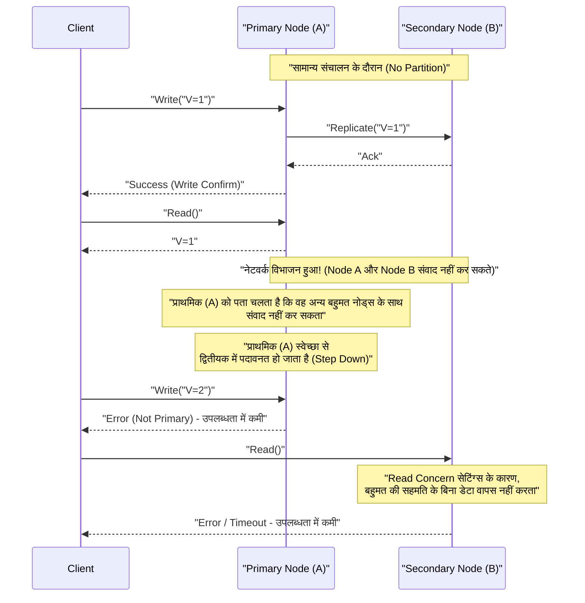
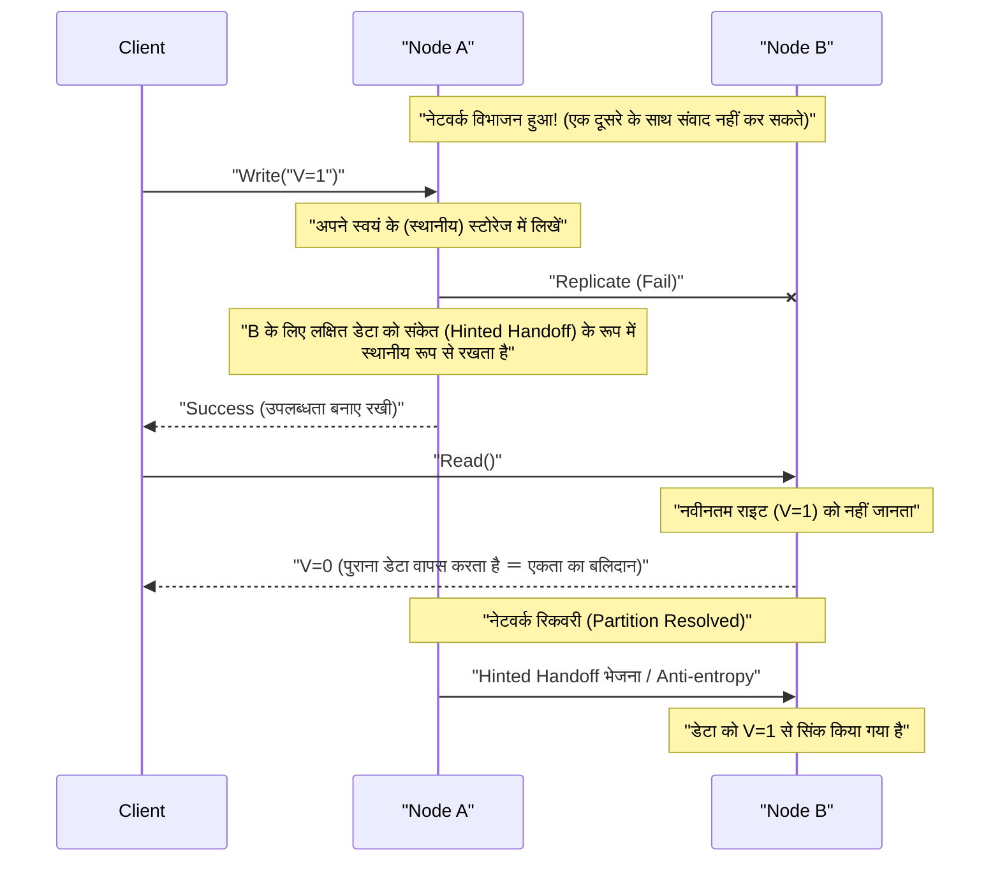

# CAP प्रमेय और वितरित सिस्टम (एकता, उपलब्धता और विभाजन सहिष्णुता का ट्रेडऑफ़)

आधुनिक वेब सेवाओं और एंटरप्राइज़ एप्लिकेशन में, **वितरित सिस्टम** (Distributed Systems) एक अनिवार्य तत्व बन गए हैं। एक एकल सर्वर द्वारा नियंत्रित नहीं किए जा सकने वाले भारी ट्रैफ़िक या डेटा को संभालने के लिए, या सर्वर विफलता के कारण सेवा रुकावट को रोकने के लिए, कई नोड्स (सर्वर) को एक एकल सिस्टम के रूप में संचालित करने के लिए एक साथ जोड़ा जाता है।

हालाँकि, वितरित सिस्टम डिज़ाइन करते समय एक निरपेक्ष नियम है जिसे टाला नहीं जा सकता। वह है **CAP प्रमेय** (CAP Theorem)। इस लेख में, हम वितरित सिस्टम डिज़ाइन के मूल में मौजूद CAP प्रमेय के बारे में विस्तार से और व्यापक रूप से बताएंगे, इसकी परिभाषा से लेकर इसके गणितीय और तार्किक पृष्ठभूमि, प्रत्येक डेटाबेस उत्पाद के दृष्टिकोण और वास्तविक दुनिया के समझौते बिंदु **PACELC प्रमेय** तक।

## 1. CAP प्रमेय का इतिहास और पृष्ठभूमि

CAP प्रमेय को 2000 में आयोजित ACM PODC (Principles of Distributed Computing) सम्मेलन में कैलिफोर्निया विश्वविद्यालय, बर्कले के कंप्यूटर वैज्ञानिक एरिक ब्रूअर (Eric Brewer) द्वारा प्रस्तावित किया गया था। शुरू में इसे अनुभवजन्य नियम के आधार पर "अनुमान (Conjecture)" के रूप में प्रस्तुत किया गया था, लेकिन 2002 में मैसाचुसेट्स इंस्टीट्यूट ऑफ टेक्नोलॉजी (MIT) के सेठ गिल्बर्ट (Seth Gilbert) और नैन्सी लिंच (Nancy Lynch) द्वारा इसे गणितीय रूप से सिद्ध किया गया और आधिकारिक तौर पर "प्रमेय (Theorem)" के रूप में स्थापित किया गया।

इस प्रमेय को प्रस्तावित करने के पीछे की पृष्ठभूमि 1990 के दशक के उत्तरार्ध से इंटरनेट का विस्फोटक प्रसार है। उस समय के आर्किटेक्ट पारंपरिक एकल-नोड रिलेशनल डेटाबेस ([RDBMS](https://kenji.blog/hi/p/rdbms-transaction-acid-isolation-level-lock/)) की **[ACID](https://kenji.blog/hi/p/rdbms-transaction-acid-isolation-level-lock/) विशेषताओं** (परमाणुता, एकता, अलगाव, स्थायित्व) को वितरित वातावरण में भी बनाए रखने का प्रयास कर रहे थे। हालाँकि, यह स्पष्ट हो गया कि नोड्स के भौगोलिक रूप से वितरित होने और नेटवर्क विलंबता और विफलताओं के दैनिक आधार पर होने वाले वातावरण में ACID विशेषताओं को पूरी तरह से बनाए रखते हुए सिस्टम को स्केल करना लगभग असंभव है।

CAP प्रमेय सैद्धांतिक रूप से इस वास्तविकता का समर्थन करता है कि वितरित सिस्टम में "सब कुछ सही नहीं हो सकता है" और सिस्टम डिज़ाइनरों के लिए एक महत्वपूर्ण दिशानिर्देश बन गया है जो **ट्रेडऑफ़** (कुछ पाने के लिए कुछ बलिदान करना) को मजबूर करता है।

## 2. CAP के 3 तत्वों की सख्त परिभाषा

CAP प्रमेय का दावा है कि "एक वितरित सिस्टम एक ही समय में निम्नलिखित 3 गारंटियों में से अधिकतम 2 को ही पूरा कर सकता है।"

*   **C (Consistency: एकता)**
*   **A (Availability: उपलब्धता)**
*   **P (Partition Tolerance: विभाजन सहिष्णुता)**

आइए पहले वितरित सिस्टम के संदर्भ में इन 3 विशेषताओं की सख्त परिभाषाओं की जाँच करें।

### 2.1. C: Consistency (एकता)

CAP प्रमेय में **एकता** का तात्पर्य उस विशेषता से है जहाँ "सभी क्लाइंट हमेशा समान नवीनतम डेटा पढ़ सकते हैं या एक त्रुटि प्राप्त कर सकते हैं।" अकादमिक रूप से यह **रैखिकता** (Linearizability) के करीब एक अवधारणा है।

वितरित सिस्टम में, उपलब्धता और प्रदर्शन को बेहतर बनाने के लिए डेटा को कई नोड्स में दोहराया (Replicated) जाता है। एक सिस्टम में जहां एकता की गारंटी है, यदि कोई भी क्लाइंट डेटा अपडेट के पूरा होने के तुरंत बाद किसी भी नोड से डेटा पढ़ने का प्रयास करता है, तो उसे हमेशा नवीनतम अपडेट परिणाम वापस कर दिया जाएगा, या (यदि सिंक्रनाइज़ेशन समय पर नहीं है जैसे कारणों से नवीनतम डेटा वापस नहीं किया जा सकता है) एक त्रुटि वापस कर दी जाएगी।

दूसरे शब्दों में, पूरे सिस्टम को ऐसे व्यवहार करना चाहिए जैसे कि यह "केवल नवीनतम डेटा रखने वाला एक एकल नोड" हो। क्लाइंट द्वारा **पुराना डेटा (Stale Data)** पढ़ने को कभी भी स्वीकार नहीं किया जा सकता है।

### 2.2. A: Availability (उपलब्धता)

CAP प्रमेय में **उपलब्धता** का तात्पर्य उस विशेषता से है जहाँ "विफलता के बिना सभी ऑपरेटिंग नोड्स उचित समय के भीतर हमेशा एक सामान्य प्रतिक्रिया (गैर-त्रुटि प्रतिक्रिया) देते हैं।"

उपलब्धता की गारंटी वाले सिस्टम में, भले ही सिस्टम के किसी हिस्से (विशिष्ट नोड या नेटवर्क लाइन) में विफलता हो, यदि क्लाइंट एक जीवित स्वस्थ नोड तक पहुंच सकता है, तो सिस्टम हमेशा डेटा (भले ही इसके नवीनतम होने की कोई गारंटी न हो) लौटाता है। क्लाइंट के वैध अनुरोध के लिए, सिस्टम द्वारा "आंतरिक असंगति के कारण प्रतिक्रिया नहीं दे सकता" बताते हुए त्रुटि वापस करना या अनंत टाइमआउट की प्रतीक्षा करना अस्वीकार्य है। हमेशा "कोई उत्तर" वापस करना आवश्यक है।

### 2.3. P: Partition Tolerance (विभाजन सहिष्णुता)

CAP प्रमेय में **विभाजन सहिष्णुता** का तात्पर्य उस विशेषता से है जहाँ "नोड्स के बीच नेटवर्क संचार कट जाने पर और सिस्टम को संचार करने में असमर्थ कई नेटवर्क समूहों (विभाजन) में विभाजित हो जाने पर भी, समग्र सिस्टम (प्रत्येक विभाजित नेटवर्क के भीतर) काम करना जारी रखता है।"

वास्तविक नेटवर्क वातावरण में, पैकेट हानि, राउटर विफलता, केबलों के भौतिक वियोग, या अस्थायी अधिभार के कारण नोड्स के बीच संचार में देरी या पूरी तरह से नुकसान अपरिहार्य है। एक वितरित सिस्टम होने के नाते, नेटवर्क विभाजन को **एक अपवाद के बजाय एक रोज़मर्रा की घटना** के रूप में माना जाना चाहिए। इसलिए, एक वितरित सिस्टम जो P (विभाजन सहिष्णुता) को छोड़ देता है और यह मान लेता है कि "नेटवर्क कभी नहीं कटेगा" वास्तव में मौजूद नहीं हो सकता है।

## 3. सभी 3 एक साथ क्यों नहीं पूरे किए जा सकते? (प्रमाण और तर्क)

CAP प्रमेय का दावा है कि तार्किक रूप से C, A, और P तीनों को एक साथ संतुष्ट करना असंभव है। हम गिल्बर्ट और लिंच के प्रमाण के सार को एक आसानी से समझ में आने वाले तार्किक मॉडल के साथ समझाएंगे।

निम्नलिखित एसिंक्रोनस नेटवर्क मॉडल पर आधारित एक सरल वितरित सिस्टम की कल्पना करें।
*   सिस्टम **Node 1** और **Node 2** नामक 2 डेटा नोड्स से बना है।
*   प्रारंभिक स्थिति के रूप में, एक चर का मान `V = 0` है। दोनों नोड सिंक्रनाइज़ेशन में इस मान को धारण करते हैं।

अब, मान लें कि यहाँ एक **नेटवर्क विभाजन (Partition)** होता है। Node 1 और Node 2 को जोड़ने वाला संचार पथ पूरी तरह से कट गया है, और वे एक दूसरे को संदेश नहीं भेज या प्राप्त नहीं कर सकते हैं (विभाजन सहिष्णुता P का परीक्षण करने की स्थिति)।

इस नेटवर्क विभाजन के दौरान, एक क्लाइंट **Node 1** को एक मान अद्यतन अनुरोध `V = 1` भेजता है। Node 1 अनुरोध प्राप्त करता है और अपने स्वयं के डेटा `V` को `1` में अपडेट करता है। हालाँकि, चूंकि नेटवर्क डिस्कनेक्ट हो गया है, Node 1 Node 2 को यह रेप्लीकेशन संदेश नहीं भेज सकता है कि "V को 1 में अपडेट कर दिया गया है"।

ठीक इसके बाद, एक अन्य क्लाइंट **Node 2** को एक रीड अनुरोध `Read(V)` भेजता है।

इस समय, सिस्टम (Node 2) को क्या कार्रवाई करनी चाहिए? सिस्टम डिज़ाइनर को निम्नलिखित दो विकल्पों में से किसी एक को चुनना होगा।

### विकल्प 1: CP सिस्टम (एकता को प्राथमिकता देना और उपलब्धता का बलिदान करना)

Node 2 के पास यह जानने का कोई तरीका नहीं है कि उसका डेटा `V = 0` पूरे सिस्टम में नवीनतम है या नहीं (क्योंकि यह संवाद नहीं कर सकता है, भले ही वह Node 1 से पूछताछ करने का प्रयास करे)। यदि यह आसानी से `0` वापस कर देता है, तो यह किसी अन्य क्लाइंट द्वारा लिखे गए नवीनतम मान `V = 1` से पुराना मान वापस कर देगा, जिससे सिस्टम की **एकता (C)** नष्ट हो जाएगी।

एकता को सख्ती से बनाए रखने के लिए, Node 2 को यह निर्धारित करना चाहिए कि "चूंकि कोई निश्चितता नहीं है कि इसका स्वयं का डेटा नवीनतम है, यह प्रतिक्रिया नहीं दे सकता है," और क्लाइंट को एक **त्रुटि वापस करना** चाहिए या नेटवर्क के ठीक होने तक प्रतिक्रिया को **ब्लॉक (टाइमआउट)** करना चाहिए।
जिस क्षण यह त्रुटि देता है, सिस्टम सामान्य रूप से प्रतिक्रिया नहीं दे पाता है, इसलिए **उपलब्धता (A)** खो जाती है।

### विकल्प 2: AP सिस्टम (उपलब्धता को प्राथमिकता देना और एकता का बलिदान करना)

Node 2 को क्लाइंट को त्रुटि वापस नहीं करनी चाहिए और हमेशा कुछ सामान्य प्रतिक्रिया (उपलब्धता A की रक्षा करने के लिए) वापस करनी चाहिए। एकमात्र डेटा जो Node 2 वर्तमान में वापस कर सकता है वह पुराना मान `V = 0` है जो उसके पास है।

यदि Node 2 `0` वापस करता है, तो क्लाइंट को एक सामान्य प्रतिक्रिया मिलती है और **उपलब्धता (A)** बनी रहती है। हालाँकि, क्योंकि यह एक पुराना मान दे रहा है जो Node 1 पर पहले से लिखे गए नवीनतम मान `V = 1` के विपरीत है, सिस्टम की **एकता (C)** खो जाती है।

---

इस तरह, नेटवर्क विभाजन (P) की भौतिक सीमा की स्थिति में, यह समझा जा सकता है कि एक तार्किक आवश्यकता के रूप में सिस्टम को **एकता (C) और उपलब्धता (A) में से किसी एक का बलिदान करना चाहिए**। यही CAP प्रमेय का मूल है।



अक्सर शब्द "CA सिस्टम (एक ऐसा सिस्टम जो एकता और उपलब्धता को संतुलित करता है और इसमें कोई विभाजन सहिष्णुता नहीं है)" का उपयोग किया जाता है, लेकिन यह एक पारंपरिक [RDBMS](https://kenji.blog/hi/p/rdbms-transaction-acid-isolation-level-lock/) को संदर्भित करता है जो एक ही नोड पर चलता है। चूंकि नेटवर्क के माध्यम से नोड्स के बीच कोई संबंध नहीं है, इसलिए नेटवर्क विभाजन की अवधारणा ही उत्पन्न नहीं होती है। इसलिए, **एक सच्चे वितरित सिस्टम में CA का कोई विकल्प नहीं है, और यह अनिवार्य रूप से CP या AP के बीच एक विकल्प है**।

## 4. CP सिस्टम और AP सिस्टम के उदाहरण और विस्तृत व्यवहार

सिस्टम CAP प्रमेय के किस गुण को प्राथमिकता देता है, इसके आधार पर डेटाबेस उत्पादों की वास्तुकला और नेटवर्क विभाजन के दौरान उनका व्यवहार पूरी तरह से अलग होता है। यहाँ हम अनुक्रम आरेखों का उपयोग करके CP सिस्टम और AP सिस्टम के विशिष्ट उत्पादों और उनके विशिष्ट व्यवहारों में गहराई से गोता लगाएँगे।

### 4.1. CP सिस्टम (Consistency and Partition Tolerance)

CP सिस्टम एक ऐसा आर्किटेक्चर है जो नेटवर्क विभाजन होने पर **एकता को पूर्ण प्राथमिकता** देता है, और डेटा असंगति के जोखिम (जैसे कि स्प्लिट-ब्रेन घटना) से बचने के लिए सिस्टम की **उपलब्धता को आंशिक या पूर्ण रूप से रोकता (बलिदान करता) है**।

**विशिष्ट डेटा स्टोर:**
*   HBase
*   [MongoDB](https://kenji.blog/hi/p/nosql-database-selection-kvs-document-graph-wide-column/)
*   [Redis](https://kenji.blog/hi/p/nosql-database-selection-kvs-document-graph-wide-column/) Cluster (सेटिंग्स के आधार पर)
*   Etcd, Zookeeper (सख्ती से बोलते हुए, वितरित सर्वसम्मति एल्गोरिदम का उपयोग करने वाले सिस्टम)
*   Google Cloud Spanner (जैसा कि बाद में बताया जाएगा, मूल रूप से CP है)

इन्हें उन उपयोग के मामलों में चुना जाता है जहाँ पुराने डेटा को पढ़ना और गलत निर्णय लेना (सीधे वित्तीय नुकसान या घातक तार्किक त्रुटियों के लिए अग्रणी) अस्वीकार्य है, जैसे कि बैंक खाता शेष प्रबंधन, ई-कॉमर्स साइट इन्वेंट्री प्रबंधन और भुगतान सिस्टम।

**नेटवर्क विभाजन के दौरान CP सिस्टम का व्यवहार (MongoDB रिप्लिका सेट का उदाहरण):**

MongoDB एक **प्राथमिक नोड (Primary)** और कई **द्वितीयक नोड्स (Secondary)** से युक्त एक रिप्लिका सेट बनाता है। डिफ़ॉल्ट रूप से, सभी रीड और राइट प्राथमिक नोड पर किए जाते हैं, एकता बनाए रखते हैं।



मान लीजिए कि नेटवर्क विभाजन होता है और 5-नोड क्लस्टर "2 नोड्स (वर्तमान प्राथमिक सहित)" और "3 नोड्स" के समूहों में विभाजित हो जाता है। इस समय, वर्तमान प्राथमिक वाला 2-नोड समूह अपना बहुमत (Majority) खो चुका है।
[MongoDB](https://kenji.blog/hi/p/nosql-database-selection-kvs-document-graph-wide-column/), जो एक CP सिस्टम है, डेटा असंगति को रोकने के लिए अल्पसंख्यक समूह में छोड़े गए प्राथमिक नोड को स्वचालित रूप से एक द्वितीयक नोड में पदावनत (Step Down) कर देता है। फिर, 3-नोड समूह में एक नया लीडर चुनाव एल्गोरिदम (जैसे Raft) चलता है जिसके पास बहुमत होता है, और एक नया प्राथमिक चुना जाता है।
उन कुछ सेकंड से लेकर दसियों सेकंड के दौरान जब यह लीडर चुनाव हो रहा होता है, या उस अल्पसंख्यक समूह के लिए जहाँ विभाजन हल नहीं हुआ है, सिस्टम में राइट (और सेटिंग्स के आधार पर रीड भी) के परिणामस्वरूप त्रुटि होती है, और **उपलब्धता कम हो जाती है**। हालाँकि, यह दो प्राथमिकताओं को एक ही समय में मौजूद होने और अलग-अलग राइट स्वीकार करने से रोकता है, और **एकता मजबूती से बनी रहती है**।

### 4.2. AP सिस्टम (Availability and Partition Tolerance)

AP सिस्टम एक ऐसा आर्किटेक्चर है जो नेटवर्क विभाजन होने पर भी **उपलब्धता को सर्वोच्च प्राथमिकता** देता है, और हमेशा सिस्टम (रीड/राइट) तक पहुंच प्रदान करना जारी रखता है। इसकी कीमत पर, ऐसी स्थिति अस्थायी रूप से उत्पन्न होती है जहां नोड्स के बीच डेटा सिंक्रनाइज़ नहीं होता है (पुराना डेटा पढ़ना या अपडेट संघर्ष), और **एकता का बलिदान** किया जाता है।

**विशिष्ट डेटा स्टोर:**
*   Apache [Cassandra](https://kenji.blog/hi/p/nosql-database-selection-kvs-document-graph-wide-column/)
*   Amazon DynamoDB
*   Riak
*   Couchbase

इन्हें उन उपयोग के मामलों में चुना जाता है जहाँ व्यवसाय के लिए यह अत्यंत महत्वपूर्ण है कि "भले ही यह नवीनतम डेटा न हो, स्क्रीन जल्दी से प्रदर्शित होनी चाहिए (सिस्टम नहीं रुकना चाहिए)", जैसे कि SNS टाइमलाइन डिस्प्ले, उपयोगकर्ता व्यवहार लॉग संग्रह, और शॉपिंग साइट उत्पाद समीक्षा और अनुशंसा सुविधाएँ।

**नेटवर्क विभाजन के दौरान AP सिस्टम का व्यवहार (Cassandra का उदाहरण):**

Cassandra एक **मास्टरलेस (Leaderless) आर्किटेक्चर** को नियोजित करता है जिसका कोई विशिष्ट लीडर (मास्टर) नहीं है। एक रिंग में व्यवस्थित सभी नोड समान रूप से रीड और राइट अनुरोध स्वीकार करते हैं।



मान लीजिए कि नेटवर्क विभाजन होता है और Node A और Node B संवाद नहीं कर सकते। इस स्थिति में, यदि कोई क्लाइंट Node A को लिखता है, तो Node A केवल अपने स्थानीय डिस्क (एकता स्तर सेटिंग के आधार पर) पर डेटा लिखता है और तुरंत क्लाइंट (उच्च उपलब्धता) को "राइट सक्सेस" देता है। Node B को प्रतिकृति विफल हो जाती है, लेकिन Node A उस तथ्य को अस्थायी रूप से याद रखता है (Hinted Handoff)।

ठीक इसके बाद, यदि कोई अन्य क्लाइंट Node B से डेटा पढ़ता है, तो Node B चुपचाप अपना पुराना डेटा वापस कर देता है क्योंकि उसे अभी तक Node A पर किया गया नवीनतम अपडेट प्राप्त नहीं हुआ है। यह वह स्थिति है जहाँ **एकता का बलिदान किया जा रहा है**।

हालाँकि, जब नेटवर्क पुनर्प्राप्त हो जाता है, Node A सहेजे गए अद्यतन डेटा को Node B को भेजता है, और डेटा पृष्ठभूमि में सिंक्रनाइज़ होता है। इसे **अंतिम एकता (Eventual Consistency)** कहा जाता है।

## 5. अंतिम एकता (Eventual Consistency) में गहराई से गोता लगाना

AP सिस्टम में, भले ही यह कहा जाए कि "एकता का बलिदान किया गया है," इसका मतलब यह नहीं है कि डेटा हमेशा के लिए असंगत रहता है। अंतिम एकता इस बात की गारंटी है कि "यदि एक निश्चित अवधि के लिए सिस्टम में कोई नया अपडेट नहीं किया जाता है, तो **अंततः (Eventually)** सभी प्रतिकृति मान मेल खाएंगे और एकता बनाए रखने की स्थिति में अभिसरण करेंगे।"

अंतिम एकता ( **BASE गुण**: Basically Available, Soft state, Eventual consistency वाले सिस्टम) मानने वाले वितरित सिस्टम में, डेवलपर्स को इस बात को ध्यान में रखते हुए एप्लिकेशन डिज़ाइन करना चाहिए कि "पुराने डेटा को पढ़ने की संभावना है" और "यदि कई नोड्स पर एक ही समय में अलग-अलग अपडेट होते हैं, तो डेटा संघर्ष (Conflict) होगा।"

### 5.1. डेटा संघर्ष (Conflict) समाधान रणनीति

यदि नेटवर्क विभाजन या नेटवर्क विलंब के कारण एक ही समय में अलग-अलग नोड्स पर एक ही कुंजी के लिए अपडेट होते हैं, तो सिस्टम या एप्लिकेशन को यह तय करना होगा कि कौन सा अपडेट सही है या उन्हें कैसे मर्ज किया जाए।

1.  **LWW (Last Write Wins: अंतिम लेखक प्राथमिकता):**
    क्लाइंट या नोड पक्ष प्रत्येक अपडेट अनुरोध को एक टाइमस्टैम्प देता है। यदि कोई विरोध होता है, तो सिस्टम बस **नवीनतम टाइमस्टैम्प वाले अपडेट को सही मानता है और पुराने अपडेट को त्याग (ओवरराइट) देता है**। यह अक्सर [Cassandra](https://kenji.blog/hi/p/nosql-database-selection-kvs-document-graph-wide-column/) और अन्य में डिफ़ॉल्ट के रूप में उपयोग किया जाता है।
    *फायदा*: सिस्टम स्वचालित रूप से विरोधों को हल कर सकता है, और कार्यान्वयन सरल है।
    *नुकसान*: क्लाइंट्स के बीच क्लॉक स्क्यू (Clock Skew) के कारण अनपेक्षित डेटा के ओवरराइट होने का जोखिम है, और एक अपडेट के पूरी तरह से खो जाने (Lost) को स्वीकार किया जाना चाहिए।

2.  **वेक्टर घड़ियां (Vector Clocks):**
    प्रत्येक नोड पर अपडेट इतिहास (संस्करण जानकारी) को एक सूची प्रारूप में बनाए रखा जाता है, और अपडेट के कारण-प्रभाव संबंध (Causality) को सख्ती से ट्रैक किया जाता है। यदि सिस्टम किसी ऐसे विरोध का पता लगाता है जिसे स्वचालित रूप से हल नहीं किया जा सकता है (बिल्कुल एक ही समय में और बिना किसी कारण संबंध के किए गए अपडेट), तो सिस्टम स्वचालित रूप से डेटा को ओवरराइट नहीं करता है और **कई परस्पर विरोधी संस्करणों (Siblings) को वैसे ही सहेजता है**। फिर, अगली बार जब क्लाइंट डेटा पढ़ता है, तो यह उन सभी एकाधिक संस्करणों को वापस कर देता है, और **संघर्ष समाधान (मर्ज) को एप्लिकेशन के तर्क (या मानव उपयोगकर्ता) पर छोड़ देता है**। यह एक शक्तिशाली तकनीक है जिसे Amazon Dynamo आदि में अपनाया गया है।
    *फायदा*: डेटा हानि को रोका जा सकता है।
    *नुकसान*: एप्लिकेशन पक्ष का कार्यान्वयन जटिल हो जाता है।

3.  **CRDT (Conflict-free Replicated Data Type):**
    डेटा संरचना को गणितीय गुण (कम्यूटेटिविटी, एसोसिएटिविटी, इडेम्पोटेंसी) देकर, यह एक **विशिष्ट डेटा प्रकार है जिसे इस तरह से डिज़ाइन किया गया है कि यह अंततः नेटवर्क विलंब या संदेश क्रम परिवर्तनों के बावजूद हमेशा एक ही स्थिति में परिवर्तित हो जाएगा**।
    उदाहरण के लिए, इसका उपयोग वितरित काउंटर, केवल-जोड़ने वाले सेट (Grow-only Set), और टेक्स्ट के लिए सहयोगी संपादन एल्गोरिदम में किया जाता है। यह Riak और [Redis](https://kenji.blog/hi/p/nosql-database-selection-kvs-document-graph-wide-column/) Enterprise मॉड्यूल द्वारा समर्थित है।

### 5.2. एप्लिकेशन पक्ष पर नियंत्रण का उदाहरण (वेक्टर क्लॉक जैसा संघर्ष समाधान)

AP सिस्टम में, एप्लिकेशन पक्ष पर डेटा विरोधों का पता लगाने और उन्हें उचित रूप से हल करने के लिए छद्म कोड (पायथन-जैसी) दिखाया गया है। यह उदाहरण शॉपिंग कार्ट में आइटम जोड़ने का उपयोग करता है।

```python
import time

def update_shopping_cart(user_id, new_item, database):
    """
    शॉपिंग कार्ट में आइटम जोड़ने का फंक्शन।
    अंतिम एकता वाले DB को मानते हुए, आशावादी लॉकिंग और संघर्ष समाधान निष्पादित करता है।
    """
    max_retries = 3
    
    for attempt in range(max_retries):
        try:
            # 1. डेटाबेस से वर्तमान कार्ट डेटा और संस्करण (जैसे वेक्टर क्लॉक) प्राप्त करें
            result = database.read(user_id)
            cart_data_list = result.data  # एक सूची जो एकाधिक परस्पर विरोधी संस्करण (Siblings) लौटा सकती है
            version_context = result.context # अपडेट करते समय आवश्यक संस्करण जानकारी
            
            # 2. जब एकाधिक परस्पर विरोधी संस्करण वापस आते हैं तो समाधान तर्क (Conflict होने पर)
            resolved_cart = resolve_conflict(cart_data_list)
            
            # 3. हल किए गए कार्ट डेटा में नए आइटम जोड़ें
            if new_item not in resolved_cart:
                resolved_cart.append(new_item)
            
            # 4. संस्करण संदर्भ के साथ डेटाबेस में लिखें (Optimistic Locking)
            # DB पक्ष में, सत्यापित करें कि प्रदान किया गया context DB के नवीनतम context से मेल खाता है
            success = database.write(user_id, resolved_cart, version_context)
            
            if success:
                print("कार्ट को सफलतापूर्वक अपडेट किया गया।")
                return True
            else:
                # संस्करण बेमेल के कारण राइट विफल (किसी अन्य क्लाइंट ने पहले अपडेट किया है)
                print(f"संस्करण विरोध के कारण राइट विफल। पुन: प्रयास कर रहा है... (Attempt {attempt + 1})")
                continue # अगले लूप में फिर से पढ़ने से शुरू करें
                
        except NetworkException:
            # नेटवर्क त्रुटि होने पर पुन: प्रयास करें
            print(f"नेटवर्क त्रुटि। पुन: प्रयास कर रहा है... (Attempt {attempt + 1})")
            time.sleep(1 * (attempt + 1)) # एक्सपोनेंशियल बैकऑफ़
            
    raise Exception("कई प्रयासों के बावजूद कार्ट को अपडेट करने में विफल रहा।")

def resolve_conflict(conflicting_carts):
    """
    संघर्ष समाधान तर्क।
    इस उदाहरण में, आइटम खोने से रोकने के लिए सभी कार्ट की सामग्री को मर्ज (यूनियन) किया जाता है।
    व्यावसायिक आवश्यकताओं के आधार पर, तर्क को "नवीनतम टाइमस्टैम्प वाले को प्राथमिकता दें" आदि में बदलें।
    """
    merged_cart = set()
    for cart in conflicting_carts:
        for item in cart:
            merged_cart.add(item)
    return list(merged_cart)
```
इस तरह, उच्च उपलब्धता प्राप्त करने के लिए AP सिस्टम चुनने के बदले में, डेवलपर्स एप्लिकेशन कोड के भीतर "पुनः प्रयास प्रसंस्करण", "आशावादी लॉकिंग (Optimistic Locking)", और "व्यावसायिक तर्क के आधार पर संघर्ष समाधान (Merge)" को उचित रूप से लागू करने की जिम्मेदारी लेते हैं।

## 6. CAP से PACELC तक: सामान्य समय में ट्रेडऑफ़

CAP प्रमेय परिभाषित करता है कि एक चरम स्थिति, "नेटवर्क विभाजन जैसी **असामान्य स्थिति** में सिस्टम कैसे व्यवहार करता है।" हालाँकि, वास्तविक सिस्टम संचालन में, पूर्ण नेटवर्क विभाजन (हालांकि यह एक जोखिम है जिस पर विचार किया जाना चाहिए) हर समय नहीं हो रहे हैं।

इसलिए, 2010 में येल विश्वविद्यालय (उस समय) के डैनियल अबाडी (Daniel Abadi) ने **PACELC प्रमेय** का प्रस्ताव दिया। यह CAP प्रमेय का विस्तार करता है और एक अधिक व्यावहारिक मॉडल है जिसमें न केवल नेटवर्क विभाजन के दौरान, बल्कि **सामान्य समय (जब नेटवर्क सामान्य रूप से काम कर रहा हो) के दौरान ट्रेडऑफ़** भी शामिल हैं।

**PACELC** निम्नलिखित का संक्षिप्त नाम है:

*   **P**artition होने पर (नेटवर्क विभाजन के दौरान),
*   **A**vailability (उपलब्धता) या **C**onsistency (एकता) में से कोई एक चुनें (यहाँ CAP प्रमेय के समान)।
*   **E**lse (अन्यथा सामान्य समय में, जब नेटवर्क सामान्य होता है),
*   **L**atency (विलंबता/प्रतिक्रिया गति) या **C**onsistency (एकता) में से कोई एक चुनें।

सामान्य समय के दौरान, यदि आप डेटा **एकता (C)** को सख्ती से बनाए रखने का प्रयास करते हैं, तो आपको नोड को लिखने के अनुरोध के लिए अन्य कई नोड्स में रेप्लिकेशन (सिंक्रनाइज़ेशन) के पूरा होने की प्रतीक्षा करनी होगी, इससे पहले कि आप क्लाइंट को पूर्णता की प्रतिक्रिया लौटा सकें। यह "नेटवर्क संचार के राउंड ट्रिप की प्रतीक्षा करने का समय" एक ओवरहेड बन जाता है, और परिणामस्वरूप, सिस्टम की **विलंबता (L)** खराब (धीमी) हो जाती है।

इसके विपरीत, यदि आप सिस्टम की **विलंबता (L)** को उसकी सीमा तक कम (तेज़) करने का प्रयास करते हैं, तो उस क्षण पूरा होने की प्रतिक्रिया वापस कर दी जाएगी जब क्लाइंट से राइट अनुरोध स्थानीय नोड पर प्राप्त होता है, और अन्य नोड्स में प्रतिकृति पृष्ठभूमि में असिंक्रोनस रूप से की जाएगी। इस मामले में, प्रतिक्रिया अत्यंत तेज़ है, लेकिन प्रतिकृति पूरी होने तक कुछ मिलीसेकंड से लेकर कुछ सेकंड तक की अवधि के लिए, नोड्स के बीच डेटा मेल नहीं खाने की स्थिति उत्पन्न होती है, और **एकता (C)** से समझौता किया जाता है।

आधुनिक वितरित डेटाबेस को PACELC प्रमेय का उपयोग करके निम्नलिखित 4 पैटर्नों में वर्गीकृत किया जा सकता है।

1.  **PC/EC (विभाजन के दौरान एकता प्राथमिकता, सामान्य समय में भी एकता प्राथमिकता):**
    उदाहरण: VoltDB, CockroachDB। किसी भी स्थिति में मजबूत एकता ([ACID](https://kenji.blog/hi/p/rdbms-transaction-acid-isolation-level-lock/)) की गारंटी देता है। इसके बदले में, नोड्स के बीच सिंक्रोनस संचार सामान्य समय में भी आवश्यक है, जिससे यह विलंबता से आसानी से प्रभावित होता है, और उच्च नेटवर्क विलंबता वाले वातावरण (जैसे मल्टी-रीजन) में प्रदर्शन कम हो जाता है।
2.  **PC/EL (विभाजन के दौरान एकता प्राथमिकता, सामान्य समय में विलंबता प्राथमिकता):**
    उदाहरण: [MongoDB](https://kenji.blog/hi/p/nosql-database-selection-kvs-document-graph-wide-column/) (डिफ़ॉल्ट सेटिंग), MySQL एसिंक्रोनस रेप्लिकेशन। विभाजन जैसी असामान्य स्थितियों में, यह डेटा भ्रष्टाचार (स्प्लिट-ब्रेन) को रोकने के लिए सिस्टम को रोक देता है, लेकिन सामान्य समय में, यह प्रदर्शन (रीड/राइट गति) पर ध्यान केंद्रित करता है और रेप्लिकेशन विलंब के कारण अस्थायी रूप से पुराने डेटा को पढ़ने की अनुमति देता है।
3.  **PA/EL (विभाजन के दौरान उपलब्धता प्राथमिकता, सामान्य समय में भी विलंबता प्राथमिकता):**
    उदाहरण: [Cassandra](https://kenji.blog/hi/p/nosql-database-selection-kvs-document-graph-wide-column/), Amazon DynamoDB, Riak। यह किसी भी समय सिस्टम को नहीं रोकता है और सबसे तेज़ प्रतिक्रिया गति का लक्ष्य रखता है। यह स्केल-आउट और उच्च उपलब्धता के लिए एक विशेष आर्किटेक्चर है जो अंतिम एकता को पूरी तरह से स्वीकार करता है।
4.  **PA/EC (विभाजन के दौरान उपलब्धता प्राथमिकता, सामान्य समय में एकता प्राथमिकता):**
    यह एक असंगत डिज़ाइन है जहां आप डेटा को असंगत बनाकर भी असामान्य समय के दौरान सिस्टम को चालू रखते हैं, लेकिन आप केवल सामान्य समय में एकता सुनिश्चित करने के लिए विलंबता का त्याग करने के लिए अपने रास्ते से बाहर जाते हैं, इसलिए व्यावहारिक डेटाबेस के रूप में बहुत कम लोग यह दृष्टिकोण अपनाते हैं।

## 7. आधुनिक डेटाबेस में एकता की ट्यूनिंग (Tunable Consistency)

अब तक की व्याख्या से आपको यह आभास हो सकता है कि "डेटाबेस उत्पाद के आधार पर CP या AP तय है," लेकिन Cassandra, DynamoDB, Cosmos DB जैसे कई आधुनिक और परिष्कृत [NoSQL](https://kenji.blog/hi/p/nosql-database-selection-kvs-document-graph-wide-column/) डेटाबेस डेवलपर्स को **"एकता स्तर" को क्वेरी या सत्र के आधार पर लचीले ढंग से सेट (ट्यून) करने** की क्षमता प्रदान करते हैं, जिसे **Tunable Consistency** कहा जाता है।

### 7.1. कोरम (Quorum) का उपयोग करके नियंत्रण

उदाहरण के रूप में Cassandra को लेते हुए, डेटा एकता को निम्नलिखित चर के संतुलन द्वारा नियंत्रित किया जाता है।

*   **N:** रेप्लिका नोड्स की कुल संख्या जिनमें डेटा कॉपी किया जाता है (Replication Factor)
*   **W:** राइट के समय सिंक्रोनस रूप से राइट पूर्णता Ack (पावती) की प्रतीक्षा कर रहे नोड्स की संख्या (Write Consistency Level)
*   **R:** रीड के समय डेटा को क्वेरी करके बहुमत लेने वाले नोड्स की संख्या (Read Consistency Level)

यहाँ, यदि आप निम्नलिखित सूत्र को संतुष्ट करने के लिए इसे सेट करते हैं, तो रीड लक्षित नोड्स (R) के समूह में हमेशा कम से कम एक नोड (W) शामिल होगा जिसमें नवीनतम राइट डेटा होगा, जिससे आप **मजबूत एकता (Strong Consistency)** की गारंटी दे सकते हैं।

`W + R > N`

**सेटिंग उदाहरणों की विविधता:**

*   **मजबूत एकता पर जोर (Quorum Read/Write):** `W = Quorum`, `R = Quorum`
    (उदाहरण: 3-नोड कॉन्फ़िगरेशन के लिए N=3, W=2, R=2। राइट और रीड दोनों बहुमत नोड्स की प्रतिक्रिया की प्रतीक्षा करते हैं। नवीनतम डेटा हमेशा गारंटीकृत है, लेकिन विलंबता मध्यम है।)
*   **राइट विलंबता पर जोर (AP-समान / अंतिम एकता):** `W = 1`, `R = All`
    (क्योंकि राइट एक नोड पर लिखे जाने के क्षण में पूरा हो जाता है, राइट सुपर फास्ट है। हालांकि, रीड के समय सभी नोड्स को पूछकर नवीनतम टाइमस्टैम्प ढूंढना आवश्यक होने के कारण रीड धीमा है।)
*   **रीड विलंबता पर जोर (AP-समान / अंतिम एकता):** `W = All`, `R = 1`
    (सभी नोड्स में राइट के पूरा होने का इंतजार करने के कारण राइट धीमा है। हालांकि, क्योंकि यह गारंटी है कि आप किसी भी नोड से पढ़ सकते हैं और वह हमेशा नवीनतम है, रीड के समय केवल 1 नोड से पूछताछ करना पर्याप्त है, जिससे यह सुपर फास्ट हो जाता है।)
*   **परम उपलब्धता और विलंबता पर जोर (PA/EL):** `W = 1`, `R = 1`
    (राइट और रीड दोनों केवल निकटतम 1 नोड के साथ पूरे होते हैं। सबसे तेज़ और डाउन होने की संभावना सबसे कम है, लेकिन पुराने डेटा को पढ़ने की संभावना सबसे अधिक है।)

इस तरह, डेवलपर्स पूरे सिस्टम के आर्किटेक्चर को ठीक नहीं करते हैं, बल्कि व्यावसायिक आवश्यकताओं के अनुसार इन W और R मानों को गतिशील रूप से समायोजित करते हैं। वे एक ही डेटाबेस क्लस्टर के भीतर, संभाले जा रहे डेटा की प्रकृति के आधार पर **स्वयं CAP/PACELC के ट्रेडऑफ़ स्लाइडर को संचालित कर सकते हैं**, जैसे "उपयोगकर्ता बिलिंग डेटा में पूर्ण रूप से मजबूत एकता (W=Quorum, R=Quorum) होनी चाहिए" और "वेबसाइट एक्सेस लॉग के थोड़ा खो जाने पर कोई बात नहीं, इसलिए राइट गति पर जोर (W=1)"।

### 7.2. क्या Google Cloud Spanner ने CAP प्रमेय को तोड़ दिया?

हाल के वर्षों में, यह कहा गया है कि "Google Cloud Spanner एक डेटाबेस है जो उच्च उपलब्धता होने के बावजूद वैश्विक स्तर पर शक्तिशाली एकता (External Consistency) की गारंटी देता है, और CAP प्रमेय को दूर कर लिया है।"

हालाँकि, जैसा कि Spanner के निर्माता एरिक ब्रूअर ने स्वयं अपने पेपर में कहा है, **Spanner CAP प्रमेय को नहीं तोड़ता है। सख्ती से बोलते हुए, इसे 'CP सिस्टम' के रूप में वर्गीकृत किया गया है।**

Spanner के बारे में जो बात अभूतपूर्व है, वह यह है कि यह GPS और परमाणु घड़ियों को मिलाकर **TrueTime API** नामक हार्डवेयर-समर्थित बुनियादी ढांचे का उपयोग करके संपूर्ण वितरित सिस्टम में "समय के अंतर (Clock Uncertainty)" को कुछ मिलीसेकंड के भीतर सख्ती से रखता है। यह विश्व स्तर पर वितरित नोड्स के बीच भी लेनदेन के क्रम को सटीक रूप से निर्धारित करने की अनुमति देता है।

चूँकि Spanner Google के अत्यधिक सुरक्षित और निरर्थक निजी नेटवर्क पर चलता है, इसलिए वास्तविकता में ऐसी स्थिति होने की संभावना जहां "नेटवर्क विभाजन (P) होता है और उपलब्धता (A) का बलिदान करना पड़ता है" लगभग शून्य हो जाती है (यह फाइव-नाइन्स से अधिक की उपलब्धता प्राप्त करता है)। यदि वैश्विक स्तर पर कोई बड़े पैमाने पर भौतिक नेटवर्क वियोग होना था, तो Spanner को एकता बनाए रखने के लिए उपलब्धता को रोकने (यानी, एक त्रुटि वापस करने) के लिए डिज़ाइन किया गया है।

## 8. वितरित सिस्टम डिज़ाइन में सर्वोत्तम प्रथाएँ और सारांश

CAP प्रमेय और PACELC प्रमेय ऐसे नियम हैं जो वितरित सिस्टम को डिज़ाइन करने और चुनने में एक कठोर भौतिक और तार्किक वास्तविकता प्रस्तुत करते हैं कि "हर चीज में कोई भी सही जादुई चांदी की गोली नहीं है।"

*   वास्तविक दुनिया के नेटवर्क में नेटवर्क विभाजन (P) अपरिहार्य है।
*   विभाजन होने पर, आपको एकता (C) की रक्षा करने और सिस्टम को रोकने, या उपलब्धता (A) की रक्षा करने और डेटा असंगति को स्वीकार करने के बीच चयन करना होगा।
*   जैसा कि PACELC प्रमेय दिखाता है, यहां तक कि सामान्य समय में, एक ट्रेडऑफ़ होता है जहां यदि आप एकता (C) को बढ़ाने का प्रयास करते हैं, तो विलंबता (L) का बलिदान किया जाता है, और यदि आप विलंबता को कम करने का प्रयास करते हैं, तो एकता का बलिदान किया जाता है।

आर्किटेक्ट्स और सॉफ्टवेयर इंजीनियरों को केवल इसलिए डेटाबेस नहीं चुनना चाहिए क्योंकि यह "लोकप्रिय है" या "उच्च बेंचमार्क स्कोर है।" सबसे महत्वपूर्ण बात यह है कि **"उस सिस्टम में जो हम बना रहे हैं, विफलता की स्थिति में सबसे खराब स्थिति क्या है: डेटा असंगत हो रहा है, या सेवा पूरी तरह से रुक रही है और उपयोगकर्ता कुछ भी करने में असमर्थ हैं?"** की गहराई से जांच करना।

वित्तीय लेनदेन के लिए, आपको निस्संदेह एक CP सिस्टम (या [RDBMS](https://kenji.blog/hi/p/rdbms-transaction-acid-isolation-level-lock/)) चुनना चाहिए और मजबूत एकता सुनिश्चित करनी चाहिए। दूसरी ओर, वैश्विक SNS सेवा के लिए, आपको 24/7/365 उच्च उपलब्धता और कम विलंबता का पीछा करने के लिए एक AP सिस्टम चुनना चाहिए और अंतिम एकता को स्वीकार करना चाहिए।

और कई मामलों में, आप पूरी तरह से बुनियादी ढांचे या डेटाबेस उत्पादों की सुविधाओं पर भरोसा नहीं कर सकते हैं। यह मानते हुए कि डेटाबेस एक AP सिस्टम के रूप में कार्य करता है, एप्लिकेशन पक्ष पर कार्यान्वयन पैटर्न (पुनः प्रयास प्रसंस्करण, इडेम्पोटेंसी गारंटी, क्षतिपूर्ति लेनदेन (जैसे सागा पैटर्न), संघर्ष समाधान तर्क) द्वारा बुनियादी ढांचे की कमियों और डेटा असंगतताओं को कुशलतापूर्वक कवर करने की **"फेल-सेफ डिज़ाइन शक्ति"** आधुनिक मजबूत वितरित सिस्टम के निर्माण की सबसे बड़ी कुंजी है。
