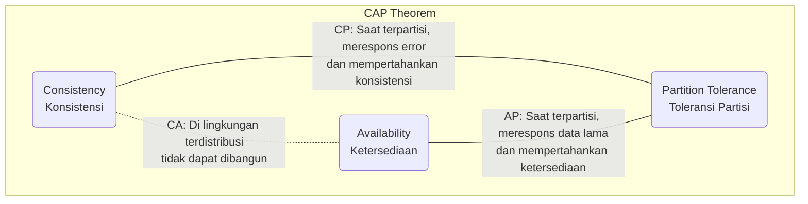
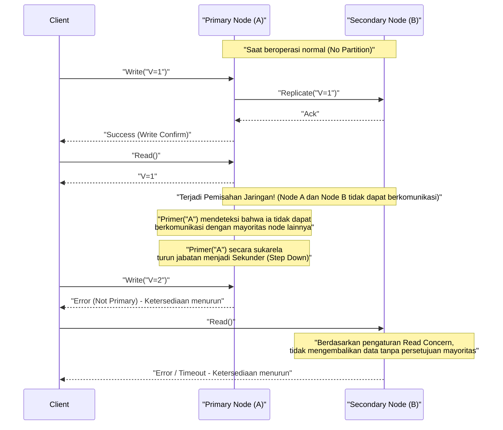
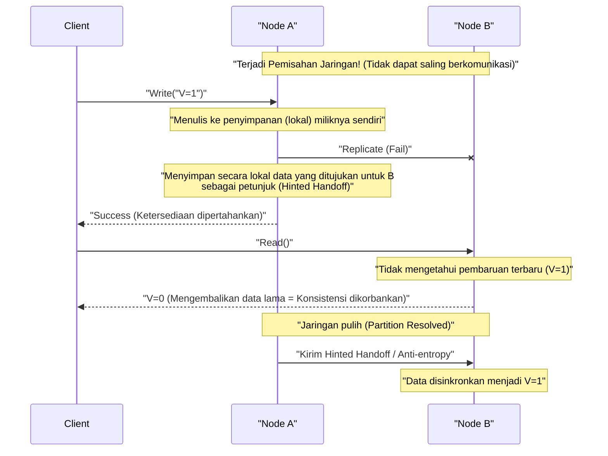

# Teorema CAP dan Sistem Terdistribusi (Pertukaran antara Konsistensi, Ketersediaan, dan Toleransi Partisi)

Dalam layanan web dan aplikasi perusahaan modern, **Sistem Terdistribusi** (Distributed Systems) telah menjadi elemen yang sangat penting. Untuk menangani lalu lintas dan data yang sangat besar yang tidak dapat diproses oleh satu server saja, atau untuk mencegah penghentian layanan akibat kerusakan server, beberapa node (server) dihubungkan untuk beroperasi sebagai satu sistem.

Namun, ada aturan absolut yang tidak bisa dihindari saat merancang sistem terdistribusi. Itu adalah **Teorema CAP** (CAP Theorem). Artikel ini akan membahas Teorema CAP yang menjadi dasar dalam desain sistem terdistribusi secara sangat rinci dan komprehensif, mulai dari definisinya, latar belakang matematika dan logikanya, pendekatan masing-masing produk basis data, hingga kompromi di dunia nyata yaitu **Teorema PACELC**.

## 1. Sejarah dan Latar Belakang Teorema CAP

Teorema CAP diusulkan pada tahun 2000 di konferensi ACM PODC (Principles of Distributed Computing) oleh ilmuwan komputer dari University of California, Berkeley, Eric Brewer. Awalnya ini dipresentasikan sebagai "Dugaan (Conjecture)" berdasarkan aturan praktis, tetapi pada tahun 2002 dibuktikan secara matematis oleh Seth Gilbert dan Nancy Lynch dari Massachusetts Institute of Technology (MIT), dan secara resmi ditetapkan sebagai "Teorema (Theorem)".

Latar belakang Brewer mengusulkan teorema ini adalah penyebaran internet yang eksplosif sejak akhir 1990-an. Para arsitek pada masa itu mencoba mempertahankan **sifat [ACID](https://kenji.blog/id/p/rdbms-transaction-acid-isolation-level-lock/)** (Atomicity, Consistency, Isolation, Durability) yang dimiliki oleh basis data relasional ([RDBMS](https://kenji.blog/id/p/rdbms-transaction-acid-isolation-level-lock/)) konvensional yang berjalan pada node tunggal, langsung ke dalam lingkungan terdistribusi. Namun, terbukti bahwa hampir mustahil untuk menskalakan sistem sambil sepenuhnya mempertahankan sifat ACID di lingkungan di mana node didistribusikan secara geografis dan penundaan serta kegagalan jaringan terjadi setiap hari.

Teorema CAP secara teoritis mendukung realitas bahwa "tidak mungkin membuat semuanya sempurna" dalam sistem terdistribusi, dan menjadi pedoman penting yang memaksa perancang sistem untuk melakukan **pertukaran** (trade-off, mengorbankan sesuatu untuk mendapatkan sesuatu yang lain).

## 2. Definisi Ketat dari 3 Elemen CAP

Teorema CAP menyatakan, "Dalam sistem terdistribusi, paling banyak hanya dua dari tiga jaminan berikut yang dapat dipenuhi secara bersamaan."

*   **C (Consistency: Konsistensi)**
*   **A (Availability: Ketersediaan)**
*   **P (Partition Tolerance: Toleransi Partisi)**

Mari kita periksa definisi ketat dari ketiga sifat ini dalam konteks sistem terdistribusi.

### 2.1. C: Consistency (Konsistensi)

**Konsistensi** dalam Teorema CAP mengacu pada sifat bahwa "semua klien akan selalu dapat membaca data terbaru yang sama, atau menerima kesalahan". Secara akademis ini adalah konsep yang dekat dengan **Linearizability**.

Dalam sistem terdistribusi, data direplikasi ke beberapa node untuk meningkatkan ketersediaan dan kinerja. Dalam sistem di mana konsistensi dijamin, jika klien mana pun mencoba membaca data dari node mana pun tepat setelah penulisan pembaruan data selesai di suatu node, hasil pembaruan terbaru itu pasti akan dikembalikan, atau jika data terbaru tidak dapat dikembalikan (misalnya karena sinkronisasi belum selesai), kesalahan akan dikembalikan.

Artinya, seluruh sistem dituntut untuk berperilaku seolah-olah itu adalah "satu node yang hanya menyimpan data terbaru". Klien membaca **Data Usang (Stale Data)** tidak akan pernah ditoleransi.

### 2.2. A: Availability (Ketersediaan)

**Ketersediaan** dalam Teorema CAP adalah sifat bahwa "setiap node yang beroperasi dan tidak mengalami kegagalan akan selalu memberikan respons yang normal (respons non-kesalahan) dalam waktu yang wajar".

Dalam sistem di mana ketersediaan dijamin, bahkan jika ada kegagalan pada sebagian sistem (node atau jalur jaringan tertentu), selama klien dapat mengakses node sehat yang bertahan, sistem akan selalu mengembalikan data (meskipun tidak ada jaminan bahwa itu adalah yang terbaru). Sistem tidak diizinkan untuk mengembalikan kesalahan dengan alasan "tidak dapat merespons karena inkonsistensi internal" atau membuat klien menunggu batas waktu tanpa batas atas permintaan yang sah dari klien. Sistem dituntut untuk selalu mengembalikan "suatu jawaban".

### 2.3. P: Partition Tolerance (Toleransi Partisi)

**Toleransi Partisi** dalam Teorema CAP adalah sifat bahwa "bahkan jika komunikasi jaringan antar node terputus, dan sistem terbagi (terpartisi) menjadi beberapa grup jaringan yang tidak dapat berkomunikasi satu sama lain, sistem secara keseluruhan (di dalam masing-masing jaringan yang terpartisi) akan terus beroperasi".

Dalam lingkungan jaringan dunia nyata, tidak dapat dihindari bahwa komunikasi antar node menjadi tertunda atau hilang sama sekali akibat paket yang hilang, kerusakan router, pemutusan kabel fisik, atau kelebihan beban sementara. Sebagai sistem terdistribusi, pemisahan jaringan harus diasumsikan sebagai **fenomena yang dapat terjadi sehari-hari, bukan pengecualian**. Oleh karena itu, sistem terdistribusi yang mengabaikan P (Toleransi Partisi) dan berasumsi bahwa "jaringan tidak akan pernah terputus" tidak mungkin ada dalam kenyataan.

## 3. Mengapa Tidak Bisa Memenuhi Ketiganya Sekaligus? (Bukti dan Logika)

Apa yang diklaim oleh Teorema CAP adalah bahwa secara logis mustahil untuk memenuhi C, A, dan P secara bersamaan. Kami akan menjelaskan esensi dari pembuktian Gilbert dan Lynch dengan model logis yang mudah dipahami.

Bayangkan sistem terdistribusi sederhana berdasarkan model jaringan asinkron seperti berikut.
*   Sistem terdiri dari 2 node data: **Node 1** dan **Node 2**.
*   Sebagai keadaan awal, nilai dari suatu variabel adalah `V = 0`. Kedua node menyimpan nilai ini secara sinkron.

Sekarang, mari kita asumsikan bahwa **pemisahan jaringan (Partition)** terjadi di sini. Jalur komunikasi yang menghubungkan Node 1 dan Node 2 sepenuhnya terputus, sehingga mereka tidak dapat saling mengirim dan menerima pesan (ini adalah situasi untuk menguji Toleransi Partisi P).

Saat pemisahan jaringan ini terjadi, seorang klien mengirimkan permintaan pembaruan nilai `V = 1` ke **Node 1**. Node 1 menerima permintaan tersebut dan memperbarui datanya sendiri `V` menjadi `1`. Namun, karena jaringan terputus, Node 1 tidak dapat mengirimkan pesan replikasi ke Node 2 yang menyatakan bahwa "V telah diperbarui menjadi 1".

Segera setelah itu, klien lain mengirimkan permintaan baca `Read(V)` ke **Node 2**.

Pada saat ini, tindakan apa yang harus diambil oleh sistem (Node 2)? Perancang sistem harus memilih satu dari dua opsi berikut.

### Opsi 1: Sistem CP (Memprioritaskan konsistensi dan mengorbankan ketersediaan)

Node 2 tidak punya cara untuk mengetahui apakah data yang dimilikinya, `V = 0`, adalah yang terbaru di seluruh sistem (karena tidak dapat berkomunikasi untuk bertanya ke Node 1). Jika ia dengan mudah mengembalikan `0` di sini, ia akan mengembalikan nilai yang lebih lama dari nilai terbaru `V = 1` yang ditulis oleh klien lain sesaat sebelumnya, dan **Konsistensi (C)** sistem akan hancur.

Untuk mempertahankan konsistensi secara ketat, Node 2 harus memutuskan bahwa "tidak dapat merespons karena tidak ada kepastian bahwa datanya adalah yang terbaru", dan ia hanya bisa **mengembalikan kesalahan** kepada klien atau **memblokir (waktu habis)** respons sampai jaringan pulih.
Pada saat kesalahan dikembalikan, sistem gagal memberikan respons yang normal, sehingga **Ketersediaan (A)** hilang.

### Opsi 2: Sistem AP (Memprioritaskan ketersediaan dan mengorbankan konsistensi)

Node 2 tidak boleh mengembalikan kesalahan kepada klien dan harus selalu mengembalikan respons normal apa pun (untuk mempertahankan Ketersediaan A). Data yang dapat dikembalikan oleh Node 2 saat ini hanyalah nilai lama `V = 0` yang dimilikinya.

Jika Node 2 mengembalikan `0`, respons normal dikembalikan kepada klien, dan **Ketersediaan (A)** dipertahankan. Namun, karena ia mengembalikan nilai lama yang bertentangan dengan nilai terbaru `V = 1` yang sudah ditulis ke Node 1, **Konsistensi (C)** sistem hilang.

---

Dengan cara ini, di bawah kendala fisik pemisahan jaringan (P), terlihat sebagai kebutuhan logis bahwa sistem **harus mengorbankan salah satu dari Konsistensi (C) atau Ketersediaan (A)**. Inilah inti dari Teorema CAP.



Istilah "sistem CA (sistem yang mencapai konsistensi dan ketersediaan, dan tidak memiliki toleransi partisi)" sering digunakan, tetapi ini mengacu pada [RDBMS](https://kenji.blog/id/p/rdbms-transaction-acid-isolation-level-lock/) konvensional yang berjalan pada node tunggal. Karena tidak ada koordinasi antar node melalui jaringan, konsep pemisahan jaringan tidak terjadi sejak awal. Oleh karena itu, **dalam sistem terdistribusi sejati, opsi CA tidak ada, dan secara praktis itu adalah pilihan biner antara CP atau AP**.

## 4. Contoh Nyata dan Perilaku Rinci dari Sistem CP dan Sistem AP

Tergantung pada karakteristik mana dari Teorema CAP yang diprioritaskan sistem, arsitektur produk basis data dan perilakunya selama pemisahan jaringan akan sangat berbeda. Di sini, kita akan membahas lebih dalam tentang produk representatif dari sistem CP dan sistem AP, beserta perilaku spesifiknya menggunakan diagram urutan.

### 4.1. Sistem CP (Consistency and Partition Tolerance)

Sistem CP adalah arsitektur yang **secara absolut memprioritaskan konsistensi** ketika terjadi pemisahan jaringan, dan **menghentikan (mengorbankan) sebagian atau seluruh ketersediaan** sistem untuk menghindari risiko inkonsistensi data (seperti fenomena split-brain).

**Penyimpanan Data Representatif:**
*   HBase
*   [MongoDB](https://kenji.blog/id/p/nosql-database-selection-kvs-document-graph-wide-column/)
*   [Redis](https://kenji.blog/id/p/nosql-database-selection-kvs-document-graph-wide-column/) Cluster (tergantung konfigurasi)
*   Etcd, Zookeeper (secara ketat, sistem menggunakan algoritma konsensus terdistribusi)
*   Google Cloud Spanner (seperti yang akan dibahas nanti, pada dasarnya adalah CP)

Ini dipilih untuk kasus penggunaan di mana membaca data usang dan membuat keputusan yang salah tidak dapat ditoleransi (yang secara langsung mengarah pada kerugian finansial atau kesalahan logika yang fatal), seperti manajemen saldo rekening bank, manajemen inventaris situs e-commerce, dan sistem pembayaran.

**Perilaku sistem CP saat pemisahan jaringan (Contoh MongoDB Replica Set):**

MongoDB membangun kumpulan replika yang terdiri dari satu **Node Primer (Primary)** dan beberapa **Node Sekunder (Secondary)**. Secara default, semua penulisan dan pembacaan dilakukan ke node primer untuk mempertahankan konsistensi.



Misalkan terjadi pemisahan jaringan, dan kluster yang terdiri dari 5 node terbagi menjadi grup "2 node (termasuk primer saat ini)" dan "3 node". Pada saat ini, grup yang terdiri dari 2 node tempat primer saat ini berada telah kehilangan mayoritas (Majority).
Sebagai sistem CP, [MongoDB](https://kenji.blog/id/p/nosql-database-selection-kvs-document-graph-wide-column/) akan secara otomatis menurunkan jabatan (Step Down) node primer yang tertinggal di grup minoritas menjadi node sekunder untuk mencegah inkonsistensi data. Kemudian, algoritma pemilihan pemimpin baru (seperti Raft) berjalan di dalam grup 3 node yang memiliki mayoritas, dan primer baru dipilih.
Selama beberapa detik hingga puluhan detik ketika pemilihan pemimpin ini sedang berlangsung, atau untuk grup minoritas di mana pemisahan tidak teratasi, penulisan (dan bacaan, tergantung pada pengaturan) ke sistem akan menjadi error, dan **ketersediaan menurun**. Namun, ini mencegah keadaan di mana dua primer ada pada saat yang sama dan menerima penulisan yang terpisah, sehingga **konsistensi dijaga dengan kuat**.

### 4.2. Sistem AP (Availability and Partition Tolerance)

Sistem AP adalah arsitektur yang **memprioritaskan ketersediaan di atas segalanya** bahkan ketika terjadi pemisahan jaringan, dan selalu terus menyediakan akses (baca/tulis) ke sistem. Sebagai imbalannya, status di mana data tidak disinkronkan antar node untuk sementara (membaca data lama atau konflik pembaruan) dapat terjadi, dan **konsistensi dikorbankan**.

**Penyimpanan Data Representatif:**
*   Apache [Cassandra](https://kenji.blog/id/p/nosql-database-selection-kvs-document-graph-wide-column/)
*   Amazon DynamoDB
*   Riak
*   Couchbase

Ini dipilih untuk kasus penggunaan di mana "fakta bahwa layar ditampilkan dengan cepat (sistem tidak berhenti) meskipun datanya bukan yang terbaru" sangat penting secara bisnis, seperti tampilan garis waktu SNS, pengumpulan log perilaku pengguna, dan ulasan produk serta fungsi rekomendasi di situs belanja.

**Perilaku sistem AP saat pemisahan jaringan (Contoh Cassandra):**

Cassandra mengadopsi **arsitektur tanpa master (Leaderless)** yang tidak memiliki pemimpin (master) tertentu. Semua node yang tersusun dalam cincin menerima permintaan baca dan tulis secara setara.



Misalkan terjadi pemisahan jaringan dan Node A serta Node B tidak dapat berkomunikasi. Jika klien melakukan penulisan ke Node A dalam keadaan ini, Node A (tergantung pada tingkat konsistensi) hanya menulis data ke disk lokalnya sendiri dan segera mengembalikan "penulisan berhasil" kepada klien (ketersediaan tinggi). Replikasi ke Node B gagal, tetapi Node A mengingat fakta itu untuk sementara (Hinted Handoff).

Segera setelah itu, jika klien lain membaca data dari Node B, Node B akan dengan santai mengembalikan data lama yang dimilikinya karena belum menerima pembaruan terbaru yang dilakukan di Node A. Inilah **keadaan di mana konsistensi dikorbankan**.

Namun, ketika jaringan pulih, Node A mengirimkan data pembaruan yang diingatnya ke Node B, dan data disinkronkan di latar belakang. Ini disebut **Konsistensi Eventual (Eventual Consistency)**.

## 5. Eksplorasi Lebih Dalam mengenai Konsistensi Eventual (Eventual Consistency)

Bahkan jika "konsistensi dikorbankan" dalam sistem AP, bukan berarti data akan dibiarkan berantakan selamanya. Konsistensi Eventual adalah jaminan bahwa "jika tidak ada pembaruan baru pada sistem selama periode waktu tertentu, **pada akhirnya (Eventually)** nilai semua replika akan cocok, menyatu menjadi keadaan di mana konsistensi dipertahankan".

Dalam sistem terdistribusi yang mengasumsikan konsistensi eventual (sistem dengan **sifat BASE**: Basically Available, Soft state, Eventual consistency), pengembang harus merancang aplikasi dengan mempertimbangkan "kemungkinan membaca data lama" dan "konflik data akan terjadi jika pembaruan berbeda dilakukan secara bersamaan di beberapa node".

### 5.1. Strategi Penyelesaian Konflik Data

Jika pembaruan pada kunci yang sama terjadi secara bersamaan di node yang berbeda selama pemisahan jaringan atau akibat penundaan jaringan, sistem atau aplikasi harus memutuskan pembaruan mana yang dianggap benar, atau bagaimana cara menggabungkannya.

1.  **LWW (Last Write Wins: Penulisan Terakhir Menang):**
    Stempel waktu dilampirkan ke setiap permintaan pembaruan oleh klien atau di sisi node. Jika terjadi konflik, **pembaruan dengan stempel waktu terbaru dianggap benar, dan pembaruan lama dibuang (ditimpa)**. Sering digunakan sebagai default di [Cassandra](https://kenji.blog/id/p/nosql-database-selection-kvs-document-graph-wide-column/) dan lainnya.
    *Kelebihan*: Konflik dapat diselesaikan secara otomatis di sisi sistem, dan implementasinya sederhana.
    *Kekurangan*: Ada risiko bahwa data yang tidak diinginkan akan ditimpa karena perbedaan jam (Clock Skew) antar klien, dan seseorang harus menoleransi bahwa salah satu pembaruan akan sepenuhnya hilang (lost).

2.  **Jam Vektor (Vector Clocks):**
    Menyimpan riwayat pembaruan (informasi versi) di setiap node dalam format daftar, dan secara ketat melacak hubungan sebab-akibat (Causality) dari pembaruan. Ketika mendeteksi konflik yang tidak dapat diselesaikan secara otomatis oleh sistem (pembaruan dilakukan pada saat yang sama persis tanpa hubungan sebab-akibat), sistem tidak akan menimpa data sembarangan, melainkan **menyimpan beberapa versi yang berkonflik (Siblings) apa adanya**. Kemudian, ketika klien membaca data tersebut berikutnya, sistem mengembalikan semua versi tersebut, dan **menyerahkan penyelesaian (penggabungan) konflik pada logika aplikasi (atau pengguna manusia)**. Ini adalah metode kuat yang diadopsi di Amazon Dynamo, dll.
    *Kelebihan*: Dapat mencegah hilangnya data.
    *Kekurangan*: Implementasi di sisi aplikasi menjadi rumit.

3.  **CRDT (Conflict-free Replicated Data Type):**
    Dengan memberikan struktur data itu sendiri karakteristik matematis (komutativitas, asosiativitas, idempotensi), ini adalah **tipe data khusus yang dirancang untuk selalu menyatu ke status yang sama pada akhirnya**, terlepas dari penundaan jaringan atau perubahan urutan pesan.
    Misalnya, ini digunakan dalam penghitung terdistribusi, himpunan hanya-tambah (Grow-only Set), algoritma pengeditan kolaboratif teks, dll. Didukung oleh Riak dan modul [Redis](https://kenji.blog/id/p/nosql-database-selection-kvs-document-graph-wide-column/) Enterprise, dll.

### 5.2. Contoh Kontrol di Sisi Aplikasi (Penyelesaian Konflik ala Jam Vektor)

Dalam sistem AP, berikut adalah kode semu (bergaya Python) untuk mendeteksi dan menyelesaikan konflik data dengan tepat di sisi aplikasi. Ini menggunakan penambahan item ke keranjang belanja sebagai contoh.

```python
import time

def update_shopping_cart(user_id, new_item, database):
    """
    Fungsi untuk menambahkan item ke keranjang belanja.
    Mengasumsikan DB dengan konsistensi eventual, melakukan kunci optimis dan penyelesaian konflik.
    """
    max_retries = 3
    
    for attempt in range(max_retries):
        try:
            # 1. Ambil data keranjang saat ini dan versi (jam vektor, dll.) dari basis data
            result = database.read(user_id)
            cart_data_list = result.data  # Daftar yang mungkin berisi beberapa versi berkonflik (Siblings)
            version_context = result.context # Informasi versi yang diperlukan saat memperbarui
            
            # 2. Logika penyelesaian saat beberapa versi berkonflik dikembalikan (saat Terjadi Konflik)
            resolved_cart = resolve_conflict(cart_data_list)
            
            # 3. Tambahkan item baru ke data keranjang yang telah diselesaikan
            if new_item not in resolved_cart:
                resolved_cart.append(new_item)
            
            # 4. Tulis ke basis data bersama dengan konteks versi (Optimistic Locking)
            # Di sisi DB, akan diverifikasi apakah context yang diberikan cocok dengan context terbaru DB
            success = database.write(user_id, resolved_cart, version_context)
            
            if success:
                print("Berhasil memperbarui keranjang.")
                return True
            else:
                # Gagal menulis karena ketidakcocokan versi (klien lain telah memperbarui lebih dulu)
                print(f"Penulisan gagal karena konflik versi. Mencoba lagi... (Percobaan {attempt + 1})")
                continue # Ulangi dari membaca ulang di putaran berikutnya
                
        except NetworkException:
            # Jika terjadi kesalahan jaringan, coba lagi
            print(f"Kesalahan jaringan. Mencoba lagi... (Percobaan {attempt + 1})")
            time.sleep(1 * (attempt + 1)) # Exponential backoff
            
    raise Exception("Gagal memperbarui keranjang meskipun telah mencoba beberapa kali.")

def resolve_conflict(conflicting_carts):
    """
    Logika penyelesaian konflik.
    Dalam contoh ini, kita menggabungkan isi semua keranjang (mengambil gabungan) untuk mencegah hilangnya item.
    Tergantung pada persyaratan bisnis, dapat diubah menjadi logika seperti "memprioritaskan stempel waktu terbaru".
    """
    merged_cart = set()
    for cart in conflicting_carts:
        for item in cart:
            merged_cart.add(item)
    return list(merged_cart)
```
Dengan cara ini, sebagai kompensasi dari memilih sistem AP untuk mendapatkan ketersediaan tinggi, pengembang menanggung tanggung jawab untuk mengimplementasikan "proses percobaan ulang (retry)", "penguncian optimis (Optimistic Locking)", dan "penyelesaian konflik berdasarkan logika bisnis (Merge)" dengan benar di dalam kode aplikasi.

## 6. Dari CAP ke PACELC: Pertukaran di Waktu Normal

Teorema CAP mendefinisikan semacam kondisi ekstrem, "bagaimana sistem berperilaku pada **waktu abnormal** ketika terjadi pemisahan jaringan". Namun, dalam operasi sistem di dunia nyata, pemutusan jaringan total (meskipun merupakan risiko yang harus diasumsikan) tidak terjadi sepanjang waktu.

Oleh karena itu, pada tahun 2010, Daniel Abadi dari Universitas Yale (pada saat itu) mengusulkan **Teorema PACELC**. Ini adalah perluasan dari Teorema CAP, dan merupakan model yang lebih praktis yang menggabungkan "bukan hanya saat jaringan terputus, tetapi juga **pertukaran pada waktu normal (saat jaringan berfungsi normal)**".

**PACELC** adalah akronim dari yang berikut ini.

*   Saat **P**artition terjadi (saat jaringan terpartisi),
*   Pilih salah satu antara **A**vailability (Ketersediaan) atau **C**onsistency (Konsistensi) (ini sama dengan Teorema CAP).
*   **E**lse (Sebaliknya, pada waktu normal lainnya saat jaringan normal),
*   Pilih salah satu antara **L**atency (Latensi/Kecepatan respons) atau **C**onsistency (Konsistensi).

Pada waktu normal, jika Anda mencoba mempertahankan **Konsistensi (C)** data secara ketat, untuk permintaan tulis ke suatu node, Anda harus menunggu hingga replikasi (sinkronisasi) ke beberapa node lain selesai sebelum mengembalikan respons selesai kepada klien. "Waktu untuk menunggu bolak-balik komunikasi jaringan" ini menjadi *overhead*, dan akibatnya **Latensi (L)** sistem memburuk (menjadi lambat).

Sebaliknya, jika Anda mencoba meminimalkan **Latensi (L)** sistem hingga ekstrem (secepat mungkin), desainnya akan mengembalikan respons selesai pada saat permintaan tulis dari klien diterima oleh node lokal, dan replikasi ke node lain dilakukan secara asinkron di latar belakang. Dalam kasus ini, respons akan sangat cepat, tetapi selama beberapa milidetik hingga beberapa detik sampai replikasi selesai, keadaan di mana data tidak cocok antar node akan terjadi, dan **Konsistensi (C)** akan terganggu.

Jika kita mengklasifikasikan basis data terdistribusi modern dengan Teorema PACELC, maka terbagi menjadi 4 pola berikut.

1.  **PC/EC (Konsistensi diprioritaskan saat terpartisi, Konsistensi juga diprioritaskan saat normal):**
    Contoh: VoltDB, CockroachDB. Menjamin konsistensi kuat ([ACID](https://kenji.blog/id/p/rdbms-transaction-acid-isolation-level-lock/)) dalam situasi apa pun. Sebagai imbalannya, komunikasi sinkron antar node diwajibkan bahkan pada waktu normal, sehingga rentan terhadap latensi dan kinerjanya menurun di lingkungan dengan penundaan jaringan yang besar (seperti multi-region).
2.  **PC/EL (Konsistensi diprioritaskan saat terpartisi, Latensi diprioritaskan saat normal):**
    Contoh: [MongoDB](https://kenji.blog/id/p/nosql-database-selection-kvs-document-graph-wide-column/) (pengaturan default), replikasi asinkron MySQL. Mencegah kerusakan data (split-brain) dengan menghentikan sistem selama situasi abnormal seperti pemisahan jaringan, tetapi memprioritaskan kinerja (kecepatan baca/tulis) pada waktu normal dan menoleransi pembacaan data lama secara sementara karena penundaan replikasi.
3.  **PA/EL (Ketersediaan diprioritaskan saat terpartisi, Latensi juga diprioritaskan saat normal):**
    Contoh: [Cassandra](https://kenji.blog/id/p/nosql-database-selection-kvs-document-graph-wide-column/), Amazon DynamoDB, Riak. Tidak pernah menghentikan sistem pada waktu kapan pun, dan membidik kecepatan respons maksimal. Ini adalah arsitektur yang sepenuhnya menerima konsistensi eventual, serta dikhususkan untuk *scale-out* dan ketersediaan tinggi.
4.  **PA/EC (Ketersediaan diprioritaskan saat terpartisi, Konsistensi diprioritaskan saat normal):**
    Desain yang tidak konsisten di mana sistem terus berjalan dengan data yang tidak konsisten saat situasi abnormal, tetapi sengaja mengorbankan latensi untuk menjamin konsistensi saat normal, sehingga hampir tidak ada pendekatan ini yang digunakan sebagai basis data praktis.

## 7. Penyetelan Konsistensi di Basis Data Modern (Tunable Consistency)

Dari penjelasan sejauh ini, Anda mungkin mendapat kesan bahwa "setiap produk basis data sudah ditetapkan sebagai CP atau AP". Namun, banyak dari basis data [NoSQL](https://kenji.blog/id/p/nosql-database-selection-kvs-document-graph-wide-column/) modern yang canggih (seperti Cassandra, DynamoDB, Cosmos DB) menyediakan fitur di mana pengembang dapat **mengonfigurasi (menyetel) "tingkat konsistensi" secara fleksibel per kueri atau per sesi**, atau yang dikenal sebagai **Tunable Consistency**.

### 7.1. Kontrol menggunakan Quorum (Kuorum)

Mengambil Cassandra dan lainnya sebagai contoh, konsistensi data dikendalikan oleh keseimbangan variabel-variabel berikut.

*   **N:** Jumlah total node replika tempat data disalin (Replication Factor)
*   **W:** Jumlah node yang secara sinkron ditunggu respons Ack (konfirmasi)-nya saat menulis (Write Consistency Level)
*   **R:** Jumlah node yang di-kueri untuk mengambil suara mayoritas saat membaca (Read Consistency Level)

Di sini, jika diatur untuk memenuhi rumus matematika berikut, pasti akan ada setidaknya satu node (W) yang memiliki data tulisan terbaru di dalam grup node (R) yang dibaca, sehingga **Konsistensi Kuat (Strong Consistency)** dapat dijamin.

`W + R > N`

**Variasi Contoh Konfigurasi:**

*   **Fokus Konsistensi Kuat (Quorum Read/Write):** `W = Quorum`, `R = Quorum`
    (Contoh: Konfigurasi 3 node berarti N=3, W=2, R=2. Baik penulisan maupun pembacaan menunggu respons dari mayoritas node. Data terbaru selalu terjamin, tetapi latensinya sedang.)
*   **Fokus Latensi Penulisan (Gaya AP / Konsistensi Eventual):** `W = 1`, `R = All`
    (Selesai begitu berhasil ditulis ke 1 node, sehingga penulisan sangat cepat. Namun, saat membaca, ia harus bertanya kepada semua mesin untuk mencari stempel waktu terbaru, sehingga pembacaan menjadi lambat.)
*   **Fokus Latensi Pembacaan (Gaya AP / Konsistensi Eventual):** `W = All`, `R = 1`
    (Penulisan lambat karena menunggu penyelesaian di semua mesin. Namun, karena dijamin selalu yang terbaru dari node mana pun data dibaca, pembacaan hanya perlu bertanya kepada 1 mesin, sehingga sangat cepat.)
*   **Ketersediaan Ultimate dan Fokus Latensi (PA/EL):** `W = 1`, `R = 1`
    (Penulisan dan pembacaan hanya diselesaikan dengan 1 node terdekat. Paling cepat dan kemungkinan *down* paling kecil, tetapi kemungkinan membaca data lama adalah yang tertinggi.)

Dengan cara ini, daripada menetapkan keseluruhan arsitektur sistem secara permanen, pengembang secara dinamis menyesuaikan nilai W dan R ini sesuai dengan persyaratan bisnis. Mereka dapat secara manual menggeser penggeser *trade-off* CAP/PACELC berdasarkan sifat data yang ditangani di dalam kluster basis data yang sama, seperti "Data tagihan pengguna mutlak memerlukan konsistensi yang kuat (W=Quorum, R=Quorum)" atau "Log akses situs web bisa hilang sedikit asalkan fokus pada kecepatan penulisan (W=1)".

### 7.2. Apakah Google Cloud Spanner Mematahkan Teorema CAP?

Baru-baru ini, kadang-kadang dikatakan bahwa "Google Cloud Spanner adalah basis data yang menjamin konsistensi yang kuat (External Consistency) dalam skala global sekaligus memiliki ketersediaan yang tinggi, dan telah mengatasi Teorema CAP".

Namun, seperti yang dinyatakan oleh pengembang Spanner, Eric Brewer, dalam makalahnya, **Spanner tidak mematahkan Teorema CAP. Secara ketat ia diklasifikasikan sebagai "Sistem CP".**

Spanner dianggap revolusioner karena menggunakan infrastruktur bantuan perangkat keras bernama API **TrueTime**, yang menggabungkan GPS dan jam atom, untuk menjaga ketat "perbedaan waktu (Clock Uncertainty)" seluruh sistem terdistribusi dalam kisaran beberapa milidetik. Hal ini memungkinkan urutan transaksi ditentukan secara akurat bahkan di antara node yang tersebar secara global.

Karena Spanner beroperasi di jaringan privat Google yang sangat tangguh dan redundan, itu hanya mengurangi probabilitas "terjadinya pemisahan jaringan (P) di dunia nyata yang mengharuskan ketersediaan (A) dikorbankan" hingga mendekati nol (mencapai *availability* lima sembilan atau lebih). Jika jaringan fisik global terputus dalam skala besar, Spanner dirancang untuk menghentikan ketersediaan (yaitu, mengembalikan kesalahan) untuk menjaga konsistensi.

## 8. Praktik Terbaik dan Kesimpulan dalam Desain Sistem Terdistribusi

Teorema CAP dan Teorema PACELC adalah hukum yang menyajikan realitas fisik dan logis yang keras bahwa "tidak ada peluru perak ajaib yang sempurna dalam segala hal" ketika merancang dan memilih sistem terdistribusi.

*   Pemisahan jaringan (P) tidak dapat dihindari dalam jaringan dunia nyata.
*   Saat pemisahan terjadi, Anda harus memilih antara mempertahankan konsistensi (C) dan menghentikan sistem, atau mempertahankan ketersediaan (A) dan menoleransi ketidakkonsistenan data.
*   Seperti yang ditunjukkan oleh Teorema PACELC, bahkan pada waktu normal, ada pertukaran di mana peningkatan konsistensi (C) mengorbankan latensi (L), dan penurunan latensi mengorbankan konsistensi.

Arsitek dan insinyur perangkat lunak tidak boleh memilih basis data hanya karena "lagi tren" atau "skor benchmark-nya tinggi". Yang terpenting adalah meneliti dengan saksama, **"Dalam sistem yang kita bangun, pada saat terjadi kegagalan, apakah skenario terburuknya adalah data menjadi tidak konsisten, atau layanan benar-benar berhenti dan pengguna tidak dapat melakukan apa pun?"**

Untuk transaksi keuangan, tidak diragukan lagi Anda harus memilih sistem CP (atau [RDBMS](https://kenji.blog/id/p/rdbms-transaction-acid-isolation-level-lock/)) untuk memastikan konsistensi yang kuat. Di sisi lain, untuk layanan SNS global, Anda sebaiknya memilih sistem AP, mengejar ketersediaan tinggi dan latensi rendah selama 24 jam sehari 365 hari setahun, bahkan jika itu berarti menerima konsistensi eventual.

Dan dalam banyak kasus, Anda tidak bisa hanya bergantung pada fungsi infrastruktur atau produk basis data. **"Kemampuan desain yang fail-safe"**, yang dengan cerdik menutupi kekurangan infrastruktur dan inkonsistensi data melalui pola implementasi di sisi aplikasi (proses *retry*, penjaminan idempotensi, transaksi kompensasi (seperti pola Saga), logika penyelesaian konflik) dengan asumsi bahwa basis data berperilaku sebagai sistem AP, adalah kunci terbesar untuk membangun sistem terdistribusi modern yang tangguh.
