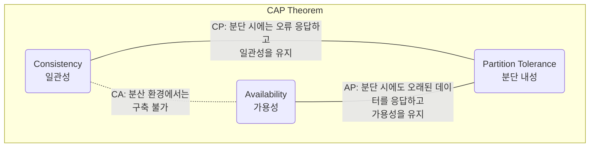
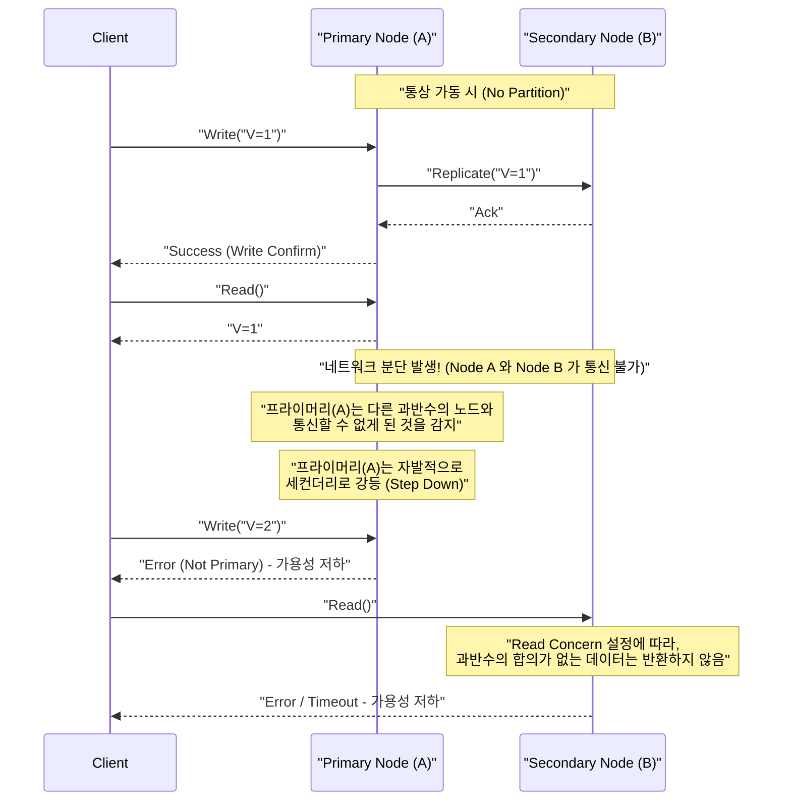
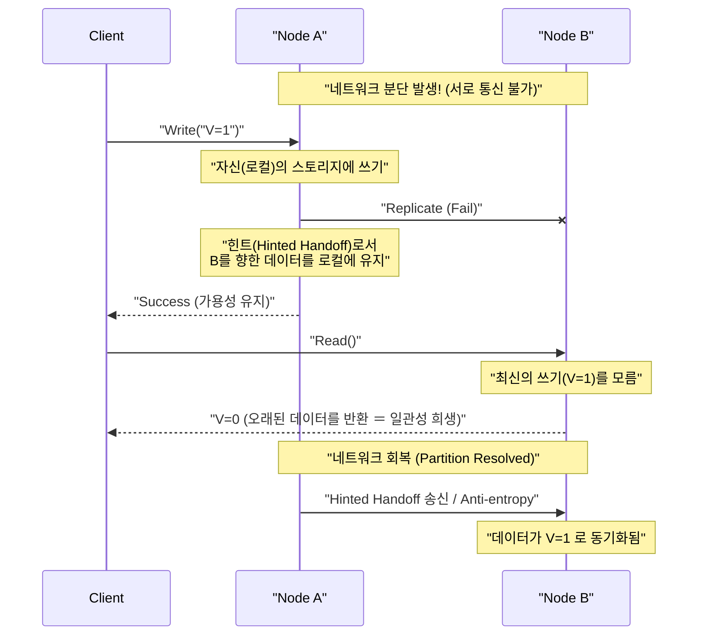

# CAP 정리와 분산 시스템 (일관성, 가용성, 분단 내성의 트레이드오프)

현대의 Web 서비스나 엔터프라이즈 애플리케이션에 있어서, **분산 시스템** (Distributed Systems) 은 불가결한 요소가 되었습니다. 단일 서버로는 처리할 수 없는 방대한 트래픽이나 데이터를 처리하기 위해, 혹은 서버의 고장으로 인한 서비스 정지를 막기 위해, 여러 노드(서버)를 연계시켜 하나의 시스템으로 가동시킵니다.

그러나 분산 시스템을 설계할 때 피할 수 없는 절대적인 법칙이 존재합니다. 그것이 **CAP 정리** (CAP Theorem) 입니다. 본 문서에서는 분산 시스템 설계의 근간을 이루는 CAP 정리에 대해, 그 정의부터 수학적·논리적 배경, 각 데이터베이스 제품의 접근 방식, 그리고 현실 세계에서의 타협점인 **PACELC 정리** 까지 매우 상세하고 포괄적으로 해설합니다.

## 1. CAP 정리의 역사와 배경

CAP 정리는 2000년에 개최된 ACM PODC (Principles of Distributed Computing) 컨퍼런스에서 캘리포니아 대학 버클리 캠퍼스의 컴퓨터 과학자인 에릭 브루어 (Eric Brewer) 에 의해 제창되었습니다. 당초에는 경험칙에 기반한 '예상 (Conjecture)'으로 발표되었으나, 2002년에 매사추세츠 공과대학 (MIT) 의 세스 길버트 (Seth Gilbert) 와 낸시 린치 (Nancy Lynch) 에 의해 수학적으로 증명되어 공식적인 '정리 (Theorem)'로 확립되었습니다.

브루어가 이 정리를 제창한 배경에는 1990년대 후반부터 시작된 인터넷의 폭발적인 보급이 있습니다. 당시의 아키텍트들은 기존의 단일 노드에서 가동되는 관계형 데이터베이스 ([RDBMS](https://kenji.blog/ko/p/rdbms-transaction-acid-isolation-level-lock/)) 가 가진 **[ACID](https://kenji.blog/ko/p/rdbms-transaction-acid-isolation-level-lock/) 특성** (원자성, 일관성, 고립성, 지속성) 을 분산 환경에서도 그대로 유지하려고 시도했습니다. 그러나 노드가 지리적으로 분산되고, 네트워크 지연이나 장애가 일상적으로 발생하는 환경에서는 ACID 특성을 완전히 유지하면서 시스템을 스케일링시키는 것이 거의 불가능하다는 것이 밝혀진 것입니다.

CAP 정리는 분산 시스템에서 '모든 것을 완벽하게 할 수는 없다'는 현실을 이론적으로 뒷받침하며, 시스템 설계자에게 **트레이드오프** (무언가를 얻기 위해 무언가를 희생하는 것) 를 강요하는 중요한 지침이 되었습니다.

## 2. CAP의 3가지 요소의 엄밀한 정의

CAP 정리는 "분산 시스템은 다음 3가지 보장 중 동시에 충족할 수 있는 것은 최대 2개까지이다"라고 주장합니다.

*   **C (Consistency: 일관성)**
*   **A (Availability: 가용성)**
*   **P (Partition Tolerance: 분단 내성)**

먼저 이 3가지 특성에 대해 분산 시스템의 맥락에서 엄밀한 정의를 확인해 봅시다.

### 2.1. C: Consistency (일관성)

CAP 정리에서의 **일관성** 이란, "모든 클라이언트가 항상 동일한 최신 데이터를 읽을 수 있거나, 혹은 오류를 반환받는다"는 특성을 가리킵니다. 학술적으로는 **선형화 가능성** (Linearizability) 에 가까운 개념입니다.

분산 시스템에서 데이터는 가용성이나 성능을 향상시키기 위해 여러 노드에 복제(레플리케이션)됩니다. 일관성이 보장되는 시스템에서는 어느 노드에 데이터의 갱신 쓰기가 완료된 직후에, 다른 임의의 클라이언트가 임의의 노드에서 데이터를 읽으려고 할 경우, 반드시 그 최신의 갱신 결과가 반환되거나, 혹은 (동기화가 제때 이루어지지 않는 등의 이유로 최신 데이터를 반환할 수 없는 경우) 오류가 반환됩니다.

즉, 시스템 전체가 마치 '단일 최신 데이터만을 보유하는 1개의 노드'인 것처럼 동작할 것이 요구됩니다. 클라이언트가 **오래된 데이터 (Stale Data)** 를 읽어버리는 것은 결코 허용되지 않습니다.

### 2.2. A: Availability (가용성)

CAP 정리에서의 **가용성** 이란, "장애가 발생하지 않고 가동 중인 모든 노드가 타당한 시간 내에 반드시 정상적인 응답(비오류 응답)을 반환한다"는 특성입니다.

가용성이 보장되는 시스템에서는 시스템의 일부(특정 노드나 네트워크 회선)에 장애가 발생하더라도, 클라이언트가 살아남은 건전한 노드에 접근할 수 있다면, 시스템은 반드시 데이터(그것이 최신이라는 보장은 없더라도)를 반환합니다. 클라이언트의 정당한 요청에 대해 시스템이 '내부의 불일치로 인해 응답할 수 없다'며 오류를 반환하거나 무한히 타임아웃을 기다리게 하는 것은 허용되지 않습니다. 항상 '어떠한 답'을 반환할 것이 요구됩니다.

### 2.3. P: Partition Tolerance (분단 내성)

CAP 정리에서의 **분단 내성** 이란, "노드 간의 네트워크 통신이 차단되어 시스템이 통신 불가능한 여러 네트워크 그룹(파티션)으로 분단되어 버린 경우에도, 시스템 전체로는 (각각의 분단된 네트워크 내에서) 계속 동작한다"는 특성입니다.

현실의 네트워크 환경에서는 패킷 손실, 라우터 고장, 케이블의 물리적인 절단, 혹은 일시적인 과부하 등으로 인해 노드 간의 통신이 지연되거나 완전히 소실되는 것은 피할 수 없습니다. 분산 시스템인 이상, 네트워크 분단은 **예외가 아니라 일상적으로 일어날 수 있는 현상** 으로 전제해야 합니다. 따라서 P(분단 내성)를 포기하고 "네트워크는 절대 끊어지지 않는다"고 가정하는 분산 시스템은 현실에는 존재할 수 없게 됩니다.

## 3. 왜 3가지를 모두 동시에 충족할 수 없는가? (증명과 논리)

CAP 정리가 주장하는 것은 C, A, P의 3가지를 동시에 충족하는 것은 논리적으로 불가능하다는 것입니다. 길버트와 린치의 증명 에센스를 이해하기 쉬운 논리 모델로 설명합니다.

다음과 같은 비동기 네트워크 모델에 기반한 단순한 분산 시스템을 상상해 보십시오.
*   시스템은 **Node 1** 과 **Node 2** 라는 2개의 데이터 노드로 구성되어 있습니다.
*   초기 상태로서 어떤 변수의 값은 `V = 0` 입니다. 두 노드가 이 값을 동기화하여 유지하고 있습니다.

자, 여기서 **네트워크 분단 (Partition)** 이 발생했다고 가정합니다. Node 1 과 Node 2 를 연결하는 통신 경로가 완전히 절단되어, 서로 메시지를 송수신할 수 없게 되었습니다 (분단 내성 P 를 테스트하는 상황입니다).

이 네트워크 분단이 발생하고 있는 와중에, 어느 클라이언트가 **Node 1** 에 대해 값의 갱신 요청 `V = 1` 을 송신합니다. Node 1 은 요청을 받고 자신의 데이터 `V` 를 `1` 로 갱신합니다. 그러나 네트워크가 절단되어 있기 때문에, Node 1 은 Node 2 에 대해 "V를 1로 갱신했다"는 레플리케이션 메시지를 보낼 수 없습니다.

그 직후에 다른 클라이언트가 **Node 2** 에 대해 읽기 요청 `Read(V)` 를 송신합니다.

이때 시스템(Node 2)은 어떤 행동을 취해야 할까요? 시스템 설계자는 다음의 2가지 선택지 중 하나를 선택해야 합니다.

### 선택지 1: CP 시스템 (일관성을 우선하고 가용성을 희생한다)

Node 2 는 자신이 보유하고 있는 데이터 `V = 0` 이 시스템 전체에서 최신인지 여부를 알 방법이 없습니다 (Node 1 에 문의하려고 해도 통신할 수 없기 때문). 만약 여기서 안일하게 `0` 을 반환해 버리면, 다른 클라이언트가 직전에 쓴 최신 값 `V = 1` 보다 오래된 값을 반환하게 되어 시스템의 **일관성 (C)** 이 파괴됩니다.

일관성을 엄격하게 지키기 위해서는 Node 2 는 "자신의 데이터가 최신이라는 확신이 없기 때문에 응답할 수 없다"고 판단하고, 클라이언트에게 **오류를 반환** 하거나 네트워크가 회복될 때까지 응답을 **블록(타임아웃)** 시키는 수밖에 없습니다.
오류를 반환한 시점에서 시스템은 정상적인 응답을 반환하지 못한 것이므로 **가용성 (A)** 은 상실됩니다.

### 선택지 2: AP 시스템 (가용성을 우선하고 일관성을 희생한다)

Node 2 는 클라이언트에게 오류를 반환하지 않고 반드시 어떤 정상적인 응답을 반환해야 합니다 (가용성 A 를 지키기 위해). Node 2 가 현재 상태에서 반환할 수 있는 데이터는 자신이 보유하고 있는 오래된 값 `V = 0` 뿐입니다.

Node 2 가 `0` 을 반환하면 클라이언트에게는 정상적인 응답이 반환되어 **가용성 (A)** 은 유지됩니다. 그러나 Node 1 에 이미 쓰인 최신 값 `V = 1` 과는 모순되는 오래된 값을 반환하고 있기 때문에 시스템의 **일관성 (C)** 은 상실됩니다.

---

이처럼 네트워크 분단 (P) 이라는 물리적인 제약이 발생한 상황에서는, 시스템은 논리적 필연으로서 **일관성 (C) 과 가용성 (A) 중 어느 한쪽을 희생해야만 한다** 는 것을 알 수 있습니다. 이것이 CAP 정리의 핵심입니다.



종종 "CA 시스템(일관성과 가용성을 양립하며 분단 내성을 가지지 않는 시스템)"이라는 말이 사용되지만, 이는 단일 노드에서 가동되는 기존의 [RDBMS](https://kenji.blog/ko/p/rdbms-transaction-acid-isolation-level-lock/) 등을 가리킵니다. 네트워크를 통한 노드 간의 연계가 존재하지 않기 때문에, 애초에 네트워크 분단이라는 개념이 발생하지 않습니다. 따라서 **진정한 분산 시스템에서 CA 라는 선택지는 존재하지 않으며, 실질적으로는 CP 나 AP 의 양자택일** 이 됩니다.

## 4. CP 시스템과 AP 시스템의 실제 사례와 상세한 동작

시스템이 CAP 정리의 어느 특성을 우선하느냐에 따라 데이터베이스 제품의 아키텍처나 네트워크 분단 시의 동작은 완전히 다릅니다. 여기에서는 CP 시스템과 AP 시스템의 대표적인 제품과 그 구체적인 동작을 시퀀스 다이어그램을 섞어 깊이 파고듭니다.

### 4.1. CP 시스템 (Consistency and Partition Tolerance)

CP 시스템은 네트워크 분단이 발생했을 경우에 **일관성을 절대적으로 우선** 하며, 데이터가 불일치하게 될 위험(스플릿 브레인 현상 등)을 피하기 위해 시스템의 **가용성을 부분적으로, 혹은 완전히 정지(희생)** 시키는 아키텍처입니다.

**대표적인 데이터 스토어:**
*   HBase
*   [MongoDB](https://kenji.blog/ko/p/nosql-database-selection-kvs-document-graph-wide-column/)
*   [Redis](https://kenji.blog/ko/p/nosql-database-selection-kvs-document-graph-wide-column/) Cluster (설정에 따라 다름)
*   Etcd, Zookeeper (엄밀하게는 분산 합의 알고리즘을 사용한 시스템)
*   Google Cloud Spanner (후술하겠지만 본질적으로는 CP입니다)

은행의 계좌 잔액 관리, 이커머스 사이트의 재고 관리, 결제 시스템 등 오래된 데이터를 읽어서 잘못된 판단을 하는 것이 허용되지 않는(금전적인 손실이나 치명적인 논리 오류로 직결되는) 유스케이스에서 선택됩니다.

**CP 시스템의 네트워크 분단 시 동작 (MongoDB의 레플리카 세트 예):**

MongoDB는 1개의 **프라이머리 노드 (Primary)** 와 여러 개의 **세컨더리 노드 (Secondary)** 로 구성된 레플리카 세트를 구축합니다. 기본적으로 모든 쓰기와 읽기는 프라이머리 노드에 대해 이루어지며 일관성을 유지합니다.



네트워크 분단이 발생하여, 가령 5대 구성의 클러스터가 "2대(현재의 프라이머리 포함)"와 "3대"의 그룹으로 분단되었다고 가정합시다. 이때 현재의 프라이머리가 존재하는 2대의 그룹은 과반수(Majority)를 잃은 상태입니다.
CP 시스템인 [MongoDB](https://kenji.blog/ko/p/nosql-database-selection-kvs-document-graph-wide-column/)는 데이터의 불일치를 막기 위해 소수파 그룹에 남겨진 프라이머리 노드를 자동으로 세컨더리 노드로 강등 (Step Down) 시킵니다. 그리고 과반수를 가진 3대의 그룹 안에서 새로운 리더 선출 알고리즘 (Raft 등) 이 실행되어 새로운 프라이머리가 선출됩니다.
이 리더 선출이 이루어지는 수 초에서 수십 초 동안, 혹은 분단이 해결되지 않은 소수파 그룹에 대해서는 시스템에 대한 쓰기(설정에 따라 읽기도)는 오류가 되어 **가용성이 저하** 됩니다. 그러나 이를 통해 동시에 2개의 프라이머리가 존재하여 별개의 쓰기를 접수해 버리는 상태를 막아 **일관성이 강력하게 유지** 되는 것입니다.

### 4.2. AP 시스템 (Availability and Partition Tolerance)

AP 시스템은 네트워크 분단이 발생한 경우에도 **가용성을 최우선** 으로 하여 항상 시스템에 대한 접근(읽기/쓰기)을 계속 제공하는 아키텍처입니다. 그 대가로 일시적으로 노드 간에 데이터가 동기화되지 않은 상태(오래된 데이터의 읽기나 갱신의 경합)가 발생하여 **일관성이 희생** 됩니다.

**대표적인 데이터 스토어:**
*   Apache [Cassandra](https://kenji.blog/ko/p/nosql-database-selection-kvs-document-graph-wide-column/)
*   Amazon DynamoDB
*   Riak
*   Couchbase

SNS의 타임라인 표시, 사용자의 행동 로그 수집, 쇼핑 사이트의 상품 리뷰나 추천 기능 등 "최신 데이터가 아니어도 좋으니 어쨌든 화면이 빠르게 표시되는(시스템이 정지하지 않는) 것"이 비즈니스 상 극히 중요한 유스케이스에서 선택됩니다.

**AP 시스템의 네트워크 분단 시 동작 (Cassandra의 예):**

Cassandra는 특정 리더(마스터)를 가지지 않는 **마스터리스 (Leaderless) 아키텍처** 를 채택하고 있습니다. 링 형태로 배치된 모든 노드가 대등하게 읽기/쓰기 요청을 처리합니다.



네트워크 분단이 발생하여 Node A 와 Node B 가 통신할 수 없게 되었다고 가정합시다. 이 상태에서 클라이언트가 Node A 에 대해 쓰기를 수행하면, Node A 는 (정합성 레벨 설정에 따라 다르지만) 자신의 로컬 디스크에만 데이터를 쓰고 즉시 클라이언트에게 "쓰기 성공"을 반환합니다 (높은 가용성). Node B 로의 레플리케이션은 실패하지만 Node A 는 그 사실을 일시적으로 기억해 둡니다 (Hinted Handoff).

이 직후에 다른 클라이언트가 Node B 에서 데이터를 읽으면 Node B 는 Node A 에서 수행된 최신의 갱신을 아직 받지 못했기 때문에 자신이 가진 오래된 데이터를 아무렇지 않게 반환합니다. 이것이 **일관성이 희생되고 있는 상태** 입니다.

그러나 네트워크가 회복되면 Node A 는 기억해 둔 갱신 데이터를 Node B 에 송신하고 백그라운드에서 데이터가 동기화됩니다. 이것을 **결과적 정합성 (Eventual Consistency)** 이라고 부릅니다.

## 5. 결과적 정합성 (Eventual Consistency) 의 심층 탐구

AP 시스템에서 '일관성이 희생된다'고 해서 데이터가 영원히 제각각인 채로 방치되는 것은 아닙니다. 결과적 정합성이란 "시스템에 대한 새로운 갱신이 일정 기간 이루어지지 않으면 **최종적으로는 (Eventually)** 모든 레플리카의 값이 일치하여 일관성이 유지된 상태로 수렴한다"는 보장입니다.

결과적 정합성을 전제로 하는 분산 시스템 ( **BASE 특성** : Basically Available, Soft state, Eventual consistency 을 가지는 시스템) 에서는 개발자는 '오래된 데이터를 읽을 가능성이 있다는 것'이나 '여러 노드에서 동시에 별개의 갱신이 이루어진 경우 데이터에 경합 (Conflict) 이 발생한다는 것'을 고려한 애플리케이션 설계를 수행해야 합니다.

### 5.1. 데이터 경합 (Conflict) 의 해결 전략

네트워크 분단 중이나 네트워크 지연에 의해 별개의 노드에서 동일한 키에 대한 갱신이 동시에 발생한 경우, 어느 갱신을 정답으로 할지, 혹은 어떻게 병합할지를 시스템 또는 애플리케이션이 결정해야 합니다.

1.  **LWW (Last Write Wins: 최종 쓰기자 우선):**
    각 갱신 요청에 대해 클라이언트 또는 노드 측에서 타임스탬프를 부여합니다. 경합이 발생한 경우는 단순히 **타임스탬프가 가장 최신인 갱신을 정답으로 하고 오래된 갱신을 파기(덮어쓰기)** 합니다. [Cassandra](https://kenji.blog/ko/p/nosql-database-selection-kvs-document-graph-wide-column/) 등에서 기본값으로 자주 사용됩니다.
    *장점*: 시스템 측에서 자동으로 경합을 해결할 수 있어 구현이 단순합니다.
    *단점*: 클라이언트 간의 시계 오차 (Clock Skew) 로 인해 의도치 않은 데이터가 덮어써질 위험이 있으며, 한쪽의 갱신이 완전히 유실되는(사라지는) 것을 허용해야 합니다.

2.  **벡터 클락 (Vector Clocks):**
    각 노드에서의 갱신 이력(버전 정보)을 리스트 형식으로 유지하고, 갱신의 인과관계 (Causality) 를 엄밀하게 추적합니다. 시스템 측에서 자동 해결할 수 없는 경합(완전히 동시에 인과관계가 없는 상태에서 이루어진 갱신)을 감지한 경우, 시스템은 데이터를 마음대로 덮어쓰지 않고 **여러 개의 경합하는 버전 (Siblings) 을 그대로 저장** 합니다. 그리고 다음에 클라이언트가 데이터를 읽었을 때 그 여러 버전을 모두 반환하여 **애플리케이션 측의 로직(혹은 인간 사용자)에 경합 해결(병합)을 위임합니다**. Amazon Dynamo 등에서 채택된 강력한 기법입니다.
    *장점*: 데이터 유실을 방지할 수 있습니다.
    *단점*: 애플리케이션 측의 구현이 복잡해집니다.

3.  **CRDT (Conflict-free Replicated Data Type):**
    데이터 구조 자체에 수학적인 특성(교환 법칙, 결합 법칙, 멱등성)을 부여함으로써 네트워크 지연이나 메시지 순서가 뒤바뀌더라도 **최종적으로 반드시 동일한 상태로 수렴하도록 설계된 특수한 데이터 타입** 입니다.
    예를 들어 분산 카운터, 추가 전용 집합 (Grow-only Set), 텍스트의 협업 편집 알고리즘 등에서 활용됩니다. Riak이나 [Redis](https://kenji.blog/ko/p/nosql-database-selection-kvs-document-graph-wide-column/) Enterprise의 모듈 등에서 지원되고 있습니다.

### 5.2. 애플리케이션 측에서의 제어 예시 (벡터 클락 방식의 경합 해결)

AP 시스템에서 애플리케이션 측에서 데이터 경합을 감지하고 적절히 해결하기 위한 의사 코드 (Python풍) 를 보여줍니다. 이것은 쇼핑 카트의 아이템 추가를 예로 들고 있습니다.

```python
import time

def update_shopping_cart(user_id, new_item, database):
    """
    쇼핑 카트에 아이템을 추가하는 함수.
    결과적 정합성을 가지는 DB를 가정하고, 낙관적 잠금과 경합 해결을 수행한다.
    """
    max_retries = 3
    
    for attempt in range(max_retries):
        try:
            # 1. 데이터베이스에서 현재의 카트 데이터와 버전(벡터 클락 등)을 가져옴
            result = database.read(user_id)
            cart_data_list = result.data  # 여러 경합 버전(Siblings)이 반환될 수 있는 리스트
            version_context = result.context # 갱신 시에 필요한 버전 정보
            
            # 2. 여러 경합하는 버전이 반환된 경우(Conflict 발생 시)의 해결 로직
            resolved_cart = resolve_conflict(cart_data_list)
            
            # 3. 해결된 카트 데이터에 새로운 아이템을 추가
            if new_item not in resolved_cart:
                resolved_cart.append(new_item)
            
            # 4. 버전 컨텍스트를 첨부하여 데이터베이스에 쓰기 (Optimistic Locking)
            # DB 측에서는 제공된 context가 DB 측의 최신 context와 일치하는지 검증한다
            success = database.write(user_id, resolved_cart, version_context)
            
            if success:
                print("카트 갱신에 성공했습니다.")
                return True
            else:
                # 버전 불일치로 쓰기 실패 (다른 클라이언트가 먼저 갱신함)
                print(f"버전 경합으로 인한 쓰기 실패. 재시도합니다... (Attempt {attempt + 1})")
                continue # 다음 루프에서 다시 읽기부터 다시 시도한다
                
        except NetworkException:
            # 네트워크 오류 시 재시도
            print(f"네트워크 오류. 재시도합니다... (Attempt {attempt + 1})")
            time.sleep(1 * (attempt + 1)) # 지수 백오프
            
    raise Exception("여러 번의 재시도에도 불구하고 카트 갱신에 실패했습니다.")

def resolve_conflict(conflicting_carts):
    """
    경합 해결 로직.
    이 예에서는 모든 카트의 내용을 병합(합집합을 구함)하여 아이템 유실을 방지한다.
    비즈니스 요구사항에 따라 '최신의 타임스탬프를 가진 것을 우선한다' 등의 로직으로 변경한다.
    """
    merged_cart = set()
    for cart in conflicting_carts:
        for item in cart:
            merged_cart.add(item)
    return list(merged_cart)
```
이처럼 AP 시스템을 선택하여 고가용성을 얻는 대가로, 개발자는 애플리케이션 코드 내에서 '재시도 처리', '낙관적 잠금 (Optimistic Locking)', '비즈니스 로직에 기반한 경합 해결 (Merge)'을 적절히 구현할 책임을 지게 됩니다.

## 6. CAP에서 PACELC로: 평상시의 트레이드오프

CAP 정리는 "네트워크 분단이 발생한 **이상 시** 에 시스템이 어떻게 행동할 것인가"라는 일종의 극한 상태의 이야기를 정의하고 있습니다. 그러나 현실의 시스템 운영에서 네트워크의 완전한 분단은 (상정해야 할 위험이긴 하지만) 항상 일어나고 있는 것은 아닙니다.

그래서 2010년에 예일 대학교(당시)의 대니얼 아바디 (Daniel Abadi) 에 의해 제창된 것이 **PACELC 정리** 입니다. 이것은 CAP 정리를 확장하여 "네트워크 분단 시뿐만 아니라, **평상시(네트워크가 정상적으로 기능하고 있을 때)의 트레이드오프** "도 포함시킨 보다 실용적인 모델입니다.

**PACELC** 란 다음의 머리글자를 딴 것입니다.

*   **P**artition 발생 시 (네트워크 분단 시) 에는,
*   **A**vailability (가용성) 나 **C**onsistency (일관성) 중 하나를 선택한다 (이곳은 CAP 정리와 동일).
*   **E**lse (그 외의 평상시, 네트워크가 정상일 때) 에는,
*   **L**atency (레이턴시/응답 속도) 나 **C**onsistency (일관성) 중 하나를 선택한다.

평상시에 데이터의 **일관성 (C)** 을 엄격하게 유지하려고 하면 노드에 대한 쓰기 요청에 대해 다른 여러 노드로의 레플리케이션(동기화)이 완료되는 것을 기다린 후 클라이언트에게 완료 응답을 반환해야 합니다. 이 '네트워크 통신의 왕복을 기다리는 시간'이 오버헤드가 되어 결과적으로 시스템의 **레이턴시 (L)** 는 악화(느려짐)됩니다.

반대로 시스템의 **레이턴시 (L)** 를 극한까지 낮추려고(빠르게 하려고) 하면, 클라이언트로부터의 쓰기 요청을 로컬 노드에서 접수한 순간에 완료 응답을 반환하고 다른 노드로의 레플리케이션은 백그라운드에서 비동기적으로 수행하는 설계가 됩니다. 이 경우 응답은 극히 빨라지지만 레플리케이션이 완료될 때까지의 수 밀리초~수 초 동안 노드 간에 데이터가 일치하지 않는 상태가 발생하여 **일관성 (C)** 이 손상됩니다.

현대의 분산 데이터베이스를 PACELC 정리로 분류하면 다음의 4가지 패턴이 됩니다.

1.  **PC/EC (분단 시에는 일관성 우선, 평상시에도 일관성 우선):**
    예: VoltDB, CockroachDB. 어떠한 상황에서도 강력한 일관성 ([ACID](https://kenji.blog/ko/p/rdbms-transaction-acid-isolation-level-lock/)) 을 보장합니다. 그 대가로 평상시에도 노드 간의 동기 통신이 필수가 되기 때문에 레이턴시의 영향을 받기 쉬워, 네트워크 지연이 큰 환경(멀티 리전 등)에서는 성능이 저하됩니다.
2.  **PC/EL (분단 시에는 일관성 우선, 평상시에는 레이턴시 우선):**
    예: [MongoDB](https://kenji.blog/ko/p/nosql-database-selection-kvs-document-graph-wide-column/) (기본 설정), MySQL의 비동기 레플리케이션. 분단 시 등의 이상 사태에는 시스템을 멈춰서라도 데이터 손상(스플릿 브레인)을 막지만, 평상시에는 성능(읽기/쓰기 속도)을 중시하여 레플리케이션 지연으로 인한 일시적인 오래된 데이터의 읽기를 허용합니다.
3.  **PA/EL (분단 시에는 가용성 우선, 평상시에도 레이턴시 우선):**
    예: [Cassandra](https://kenji.blog/ko/p/nosql-database-selection-kvs-document-graph-wide-column/), Amazon DynamoDB, Riak. 어떤 때라도 시스템을 정지시키지 않고 응답 속도도 가장 빠른 것을 목표로 합니다. 결과적 정합성을 완전히 수용하는, 스케일 아웃과 고가용성에 특화된 아키텍처입니다.
4.  **PA/EC (분단 시에는 가용성 우선, 평상시에는 일관성 우선):**
    이상 시에는 데이터가 불일치하게 되더라도 시스템을 계속 가동하면서, 평상시에만 굳이 레이턴시를 희생하여 일관성을 담보한다는 일관성 없는 설계가 되기 때문에, 실용적인 데이터베이스로서 이 접근 방식을 취하는 것은 거의 없습니다.

## 7. 모던 데이터베이스에서의 일관성 튜닝 (Tunable Consistency)

지금까지의 해설로 '데이터베이스 제품마다 CP인지 AP인지가 고정되어 있다'는 인상을 받았을지도 모르지만, 현대의 세련된 [NoSQL](https://kenji.blog/ko/p/nosql-database-selection-kvs-document-graph-wide-column/) 데이터베이스(Cassandra, DynamoDB, Cosmos DB 등)의 대부분은 **'일관성 레벨'을 쿼리 단위나 세션 단위로 개발자가 유연하게 설정(튜닝)할 수 있는** 기능, 즉 **Tunable Consistency** 를 제공하고 있습니다.

### 7.1. Quorum (정족수) 을 사용한 컨트롤

Cassandra 등을 예로 들면 데이터의 일관성은 다음 변수들의 균형에 의해 제어됩니다.

*   **N:** 데이터가 복제되는 레플리카 노드의 총 수 (Replication Factor)
*   **W:** 쓰기 시에 동기적으로 쓰기 완료의 Ack(확인 응답)를 기다리는 노드의 수 (Write Consistency Level)
*   **R:** 읽기 시에 데이터를 조회하여 다수결을 정하는 노드의 수 (Read Consistency Level)

여기서 다음 수식을 충족하도록 설정하면, 읽기 대상 노드 군 (R) 안에는 반드시 최신의 쓰기 데이터를 가진 노드 (W) 가 적어도 1개는 포함되게 되어 **강력한 일관성 (Strong Consistency)** 을 보장할 수 있습니다.

`W + R > N`

**설정 예시의 변형:**

*   **강력한 일관성 중시 (Quorum Read/Write):** `W = Quorum`, `R = Quorum`
    (예: 3노드 구성이라면 N=3, W=2, R=2. 쓰기도 읽기도 과반수 노드의 응답을 기다린다. 항상 최신 데이터가 보장되지만 레이턴시는 중간 정도이다.)
*   **쓰기 레이턴시 중시 (AP적·결과적 정합성):** `W = 1`, `R = All`
    (1대의 노드에 쓴 순간에 완료로 처리하기 때문에 쓰기는 매우 빠르다. 그러나 읽을 때는 모든 대수에 문의하여 최신의 타임스탬프를 찾아야 하기 때문에 읽기가 느리다.)
*   **읽기 레이턴시 중시 (AP적·결과적 정합성):** `W = All`, `R = 1`
    (모든 대수에 대한 쓰기 완료를 기다리기 때문에 쓰기는 느리다. 그러나 어느 노드에서 읽어도 반드시 최신임이 보장되기 때문에 읽기 시에는 1대에만 문의하면 되어 매우 빨라진다.)
*   **궁극의 가용성과 레이턴시 중시 (PA/EL):** `W = 1`, `R = 1`
    (쓰기도 읽기도 가장 가까운 1대의 노드에서만 완결시킨다. 가장 빠르고 가장 다운되기 어렵지만, 오래된 데이터를 읽을 확률은 가장 높아진다.)

이처럼 개발자는 시스템 전체의 아키텍처를 고정하는 것이 아니라 비즈니스 요구사항에 맞춰 이 W 와 R 의 값을 동적으로 조정합니다. "사용자의 과금 데이터는 무조건 강력한 일관성 (W=Quorum, R=Quorum)", "웹사이트의 접속 로그는 다소 유실되어도 좋으니 쓰기 속도 중시 (W=1)" 와 같이, 동일한 데이터베이스 클러스터 내에서 다루는 데이터의 성질에 따라 **CAP/PACELC의 트레이드오프 슬라이더를 스스로 조작** 할 수 있는 것입니다.

### 7.2. Google Cloud Spanner 는 CAP 정리를 깼는가?

최근 "Google Cloud Spanner 는 높은 가용성을 가지면서도 글로벌 규모에서 강력한 일관성 (External Consistency) 을 보장하는 데이터베이스로, CAP 정리를 극복했다"고 말해지는 경우가 있습니다.

그러나 Spanner의 개발자인 에릭 브루어 자신이 논문에서 언급했듯이 **Spanner는 CAP 정리를 깬 것이 아닙니다. 엄밀하게는 'CP 시스템'으로 분류됩니다.**

Spanner가 획기적인 것은 GPS와 원자시계를 조합한 **TrueTime API** 라는 하드웨어 지원 인프라스트럭처를 사용하여 분산 시스템 전체의 '시간 오차 (Clock Uncertainty)'를 수 밀리초 범위 내로 엄밀하게 억제한 점입니다. 이로써 글로벌하게 분산된 노드 간에도 트랜잭션의 순서를 정확하게 결정할 수 있습니다.

Spanner는 Google의 극히 견고하고 이중화된 프라이빗 네트워크 위에서 가동되고 있기 때문에, 현실 세계에서 "네트워크 분단 (P) 이 발생하여 가용성 (A) 을 희생해야만 하는 사태"가 일어날 확률을 한없이 0에 가깝게 만들고 있는 (파이브 나인 이상의 가용성을 실현하고 있는) 것뿐입니다. 만약 만에 하나 지구 규모의 대규모 물리적 네트워크 절단이 발생한다면 Spanner는 일관성을 지키기 위해 가용성을 정지시키는 (즉 오류를 반환하는) 방향으로 설계되어 있습니다.

## 8. 분산 시스템 설계에서의 베스트 프랙티스와 요약

CAP 정리 및 PACELC 정리는 분산 시스템을 설계하고 선정할 때 "모든 면에서 완벽한 마법의 은탄환은 존재하지 않는다"는 엄격한 물리적·논리적 현실을 들이미는 법칙입니다.

*   네트워크 분단 (P) 은 현실의 네트워크에서 불가피하다.
*   분단 발생 시에는 일관성 (C) 을 지켜서 시스템을 정지시키거나, 가용성 (A) 을 지켜서 데이터의 불일치를 허용할지 선택해야만 단다.
*   PACELC 정리가 나타내듯이, 평상시라 하더라도 일관성 (C) 을 높이려고 하면 레이턴시 (L) 가 희생되고, 레이턴시를 낮추려고 하면 일관성이 희생되는 트레이드오프가 존재한다.

아키텍트나 소프트웨어 엔지니어는 단순히 "유행하고 있으니까", "벤치마크 점수가 높으니까"라는 이유로 데이터베이스를 선정해서는 안 됩니다. 가장 중요한 것은 **"자신들이 구축하는 시스템에서 장애 발생 시 최악의 시나리오는 데이터가 불일치하게 되는 것인가, 아니면 서비스가 완전히 정지하여 사용자가 아무것도 할 수 없게 되는 것인가"** 를 깊이 음미하는 것입니다.

금융 트랜잭션이라면 틀림없이 CP 시스템(혹은 [RDBMS](https://kenji.blog/ko/p/rdbms-transaction-acid-isolation-level-lock/))을 선택하여 강력한 일관성을 담보해야 합니다. 반면 글로벌한 SNS 서비스라면 AP 시스템을 선택하고 결과적 정합성을 수용해서라도 24시간 365일 고가용성과 낮은 레이턴시를 추구해야 할 것입니다.

그리고 많은 경우 인프라스트럭처나 데이터베이스 제품의 기능에만 전적으로 의존할 수는 없습니다. 데이터베이스가 AP 시스템으로 동작한다는 것을 전제로 한 다음, 애플리케이션 측의 구현 패턴(재시도 처리, 멱등성의 담보, 보상 트랜잭션 (Saga 패턴 등), 경합 해결 로직)을 통해 인프라의 단점이나 데이터의 불일치를 능숙하게 커버하는 **"페일 세이프한 설계력"** 이야말로 현대의 견고한 분산 시스템을 구축하기 위한 최대의 열쇠가 되는 것입니다.
