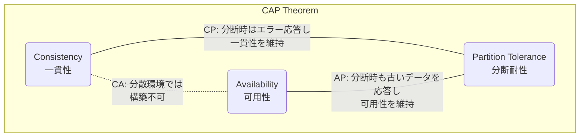
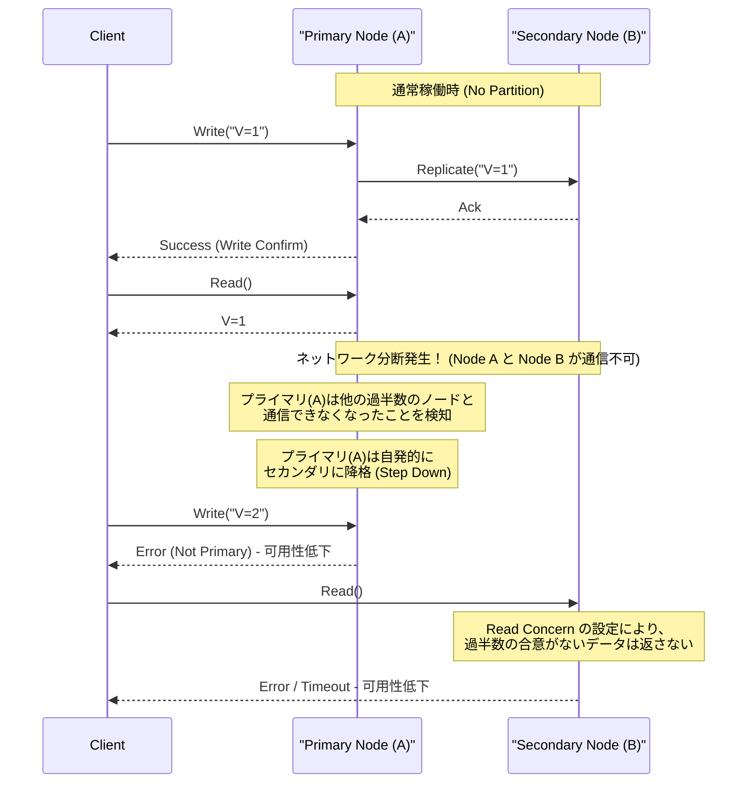
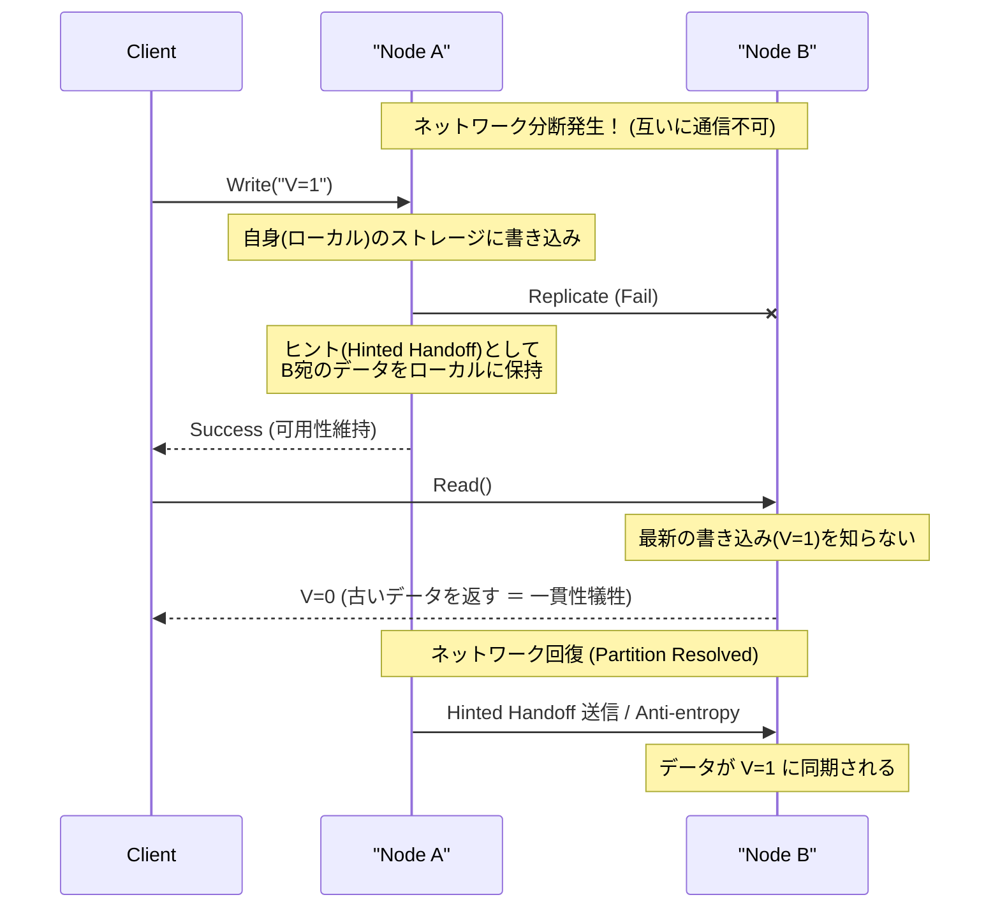

# CAP定理と分散システム（一貫性、可用性、分断耐性のトレードオフ）

現代のWebサービスやエンタープライズアプリケーションにおいて、 **分散システム** (Distributed Systems) は不可欠な要素となっています。単一のサーバーでは処理しきれない膨大なトラフィックやデータを捌くため、あるいはサーバーの故障によるサービス停止を防ぐために、複数のノード（サーバー）を連携させて1つのシステムとして稼働させます。

しかし、分散システムを設計する上で避けて通れない絶対的な法則が存在します。それが **CAP定理** (CAP Theorem) です。本記事では、分散システム設計における根幹をなすCAP定理について、その定義から数学的・論理的な背景、各データベース製品のアプローチ、そして現実世界での妥協点である **PACELC定理** まで、非常に詳細かつ網羅的に解説します。

## 1. CAP定理の歴史と背景

CAP定理は、2000年に開催されたACM PODC (Principles of Distributed Computing) カンファレンスにおいて、カリフォルニア大学バークレー校の計算機科学者であるエリック・ブリュワー (Eric Brewer) によって提唱されました。当初は経験則に基づく「予想 (Conjecture)」として発表されましたが、2002年にマサチューセッツ工科大学 (MIT) のセス・ギルバート (Seth Gilbert) とナンシー・リンチ (Nancy Lynch) によって数学的に証明され、正式に「定理 (Theorem)」として確立しました。

ブリュワーがこの定理を提唱した背景には、1990年代後半からのインターネットの爆発的な普及があります。当時のアーキテクトたちは、従来の単一ノードで稼働するリレーショナルデータベース ([RDBMS](https://kenji.blog/p/rdbms-transaction-acid-isolation-level-lock/)) が持つ **[ACID](https://kenji.blog/p/rdbms-transaction-acid-isolation-level-lock/)特性** （原子性、一貫性、独立性、耐久性）を、分散環境においてもそのまま維持しようと試みていました。しかし、ノードが地理的に分散し、ネットワークの遅延や障害が日常的に発生する環境では、ACID特性を完全に維持しながらシステムをスケーリングさせることは不可能に近いことが判明してきたのです。

CAP定理は、分散システムにおいて「すべてを完璧にすることはできない」という現実を理論的に裏付け、システム設計者に対して **トレードオフ** （何かを得るために何かを犠牲にすること）を強いる重要な指針となりました。

## 2. CAPの3つの要素の厳密な定義

CAP定理は、「分散システムは、以下の3つの保証のうち、同時に満たすことができるのは最大でも2つまでである」と主張しています。

*   **C (Consistency: 一貫性)**
*   **A (Availability: 可用性)**
*   **P (Partition Tolerance: 分断耐性)**

まずはこれら3つの特性について、分散システムの文脈における厳密な定義を確認していきましょう。

### 2.1. C: Consistency (一貫性)

CAP定理における **一貫性** とは、「すべてのクライアントが、常に同じ最新のデータを読み取ることができる、あるいはエラーを受け取る」という特性を指します。学術的には **線形化可能性** (Linearizability) に近い概念です。

分散システムにおいて、データは可用性やパフォーマンスを向上させるために複数のノードに複製（レプリケーション）されます。一貫性が保証されているシステムでは、あるノードに対してデータの更新書き込みが完了した直後に、別の任意のクライアントが任意のノードからデータを読み取ろうとした場合、必ずその最新の更新結果が返されるか、あるいは（同期が間に合っていないなどの理由で最新データを返せない場合は）エラーが返されます。

つまり、システム全体があたかも「単一の最新データのみを保持する1つのノード」であるかのように振る舞うことが求められます。クライアントが **古いデータ (Stale Data)** を読み取ってしまうことは決して許容されません。

### 2.2. A: Availability (可用性)

CAP定理における **可用性** とは、「障害が発生していない稼働中のすべてのノードが、妥当な時間内に必ず正常な応答（非エラー応答）を返す」という特性です。

可用性が保証されているシステムでは、システムの一部（特定のノードやネットワーク回線）に障害が発生していても、クライアントが生き残っている健全なノードにアクセスできれば、システムは必ずデータ（それが最新である保証はないとしても）を返します。クライアントからの正当なリクエストに対して、システムが「内部の不整合により応答できない」としてエラーを返したり、無限にタイムアウトを待たせたりすることは許容されません。常に「何らかの答え」を返すことが求められます。

### 2.3. P: Partition Tolerance (分断耐性)

CAP定理における **分断耐性** とは、「ノード間のネットワーク通信が遮断され、システムが通信不可能な複数のネットワークグループ（パーティション）に分断されてしまった場合でも、システム全体としては（それぞれの分断されたネットワーク内で）動作し続ける」という特性です。

現実のネットワーク環境においては、パケットロス、ルーターの故障、ケーブルの物理的な切断、あるいは一時的な過負荷などによって、ノード間の通信が遅延したり完全に失われたりすることは避けられません。分散システムである以上、ネットワークの分断は **例外ではなく日常的に起こり得る現象** として前提としなければなりません。したがって、P（分断耐性）を放棄して「ネットワークは絶対に切れない」と仮定する分散システムは、現実には存在し得ないことになります。

## 3. なぜ3つすべてを同時に満たせないのか？（証明と論理）

CAP定理が主張するのは、C、A、Pの3つを同時に満たすことは論理的に不可能であるということです。ギルバートとリンチによる証明のエッセンスを、分かりやすい論理モデルで解説します。

次のような、非同期ネットワークモデルに基づくシンプルな分散システムを想像してください。
*   システムは **Node 1** と **Node 2** の2つのデータノードで構成されています。
*   初期状態として、ある変数の値は `V = 0` です。両方のノードがこの値を同期して保持しています。

さて、ここで **ネットワーク分断 (Partition)** が発生したと仮定します。Node 1 と Node 2 を結ぶ通信経路が完全に切断され、互いにメッセージを送受信できなくなりました（分断耐性 P をテストする状況です）。

このネットワーク分断が発生している最中に、あるクライアントが **Node 1** に対して値の更新リクエスト `V = 1` を送信します。Node 1 はリクエストを受け取り、自身の持つデータ `V` を `1` に更新します。しかし、ネットワークが切断されているため、Node 1 は Node 2 に対して「Vを1に更新した」というレプリケーションメッセージを送ることができません。

その直後に、別のクライアントが **Node 2** に対して読み取りリクエスト `Read(V)` を送信します。

このとき、システム（Node 2）はどのような行動をとるべきでしょうか？ システム設計者は、次の2つの選択肢のいずれかを選ばなければなりません。

### 選択肢1: CPシステム（一貫性を優先し、可用性を犠牲にする）

Node 2 は、自身が保持しているデータ `V = 0` がシステム全体において最新であるかどうかを知る術がありません（Node 1 に問い合わせようにも通信できないため）。もしここで安易に `0` を返してしまうと、別のクライアントが直前に書き込んだ最新の値 `V = 1` よりも古い値を返すことになり、システムの **一貫性 (C)** が破壊されます。

一貫性を厳格に守るためには、Node 2 は「自身のデータが最新である確証がないため、応答できない」と判断し、クライアントに対して **エラーを返す** か、ネットワークが回復するまで応答を **ブ[ロック](https://kenji.blog/p/rdbms-transaction-acid-isolation-level-lock/)（タイムアウト）** させるしかありません。
エラーを返した時点で、システムは正常な応答を返せていないため、 **可用性 (A)** は失われます。

### 選択肢2: APシステム（可用性を優先し、一貫性を犠牲にする）

Node 2 は、クライアントにエラーを返さず、必ず何らかの正常な応答を返す必要があります（可用性 A を守るため）。Node 2 が現状で返せるデータは、自身が保持している古い値 `V = 0` しかありません。

Node 2 が `0` を返せば、クライアントには正常なレスポンスが返り、 **可用性 (A)** は保たれます。しかし、Node 1 にすでに書き込まれている最新の値 `V = 1` とは矛盾する古い値を返しているため、システムの **一貫性 (C)** は失われます。

---

このように、ネットワーク分断 (P) という物理的な制約が発生した状況下では、システムは論理的必然として **一貫性 (C) と可用性 (A) のどちらか一方を犠牲にしなければならない** ことが分かります。これがCAP定理の核心です。



しばしば「CAシステム（一貫性と可用性を両立し、分断耐性を持たないシステム）」という言葉が使われますが、これは単一ノードで稼働する旧来の[RDBMS](https://kenji.blog/p/rdbms-transaction-acid-isolation-level-lock/)などを指します。ネットワークを通じたノード間の連携が存在しないため、そもそもネットワーク分断という概念が発生しません。したがって、 **真の分散システムにおいて CA という選択肢は存在せず、実質的には CP か AP の二者択一** となります。

## 4. CPシステムとAPシステムの実例と詳細な挙動

システムがCAP定理のどちらの特性を優先するかによって、データベース製品のアーキテクチャやネットワーク分断時の振る舞いは全く異なります。ここでは、CPシステムとAPシステムの代表的な製品と、その具体的な挙動をシーケンス図を交えて深掘りします。

### 4.1. CPシステム (Consistency and Partition Tolerance)

CPシステムは、ネットワーク分断が発生した場合に **一貫性を絶対的に優先** し、データが不整合になるリスク（スプリットブレイン現象など）を避けるために、システムの **可用性を部分的に、あるいは完全に停止（犠牲）** させるアーキテクチャです。

**代表的なデータストア:**
*   HBase
*   [MongoDB](https://kenji.blog/p/nosql-database-selection-kvs-document-graph-wide-column/)
*   [Redis](https://kenji.blog/p/nosql-database-selection-kvs-document-graph-wide-column/) Cluster (設定による)
*   Etcd, Zookeeper (厳密には分散コンセンサスアルゴリズムを用いたシステム)
*   Google Cloud Spanner (後述しますが、本質的にはCPです)

銀行の口座残高管理、ECサイトの在庫管理、決済システムなど、古いデータを読み取って誤った判断をすることが許されない（金銭的な損失や致命的な論理エラーに直結する）ユースケースで選択されます。

**CPシステムのネットワーク分断時の挙動（MongoDBのReplica Setの例）:**

MongoDBは、1つの **プライマリノード (Primary)** と複数の **セカンダリノード (Secondary)** からなるレプリカセットを構築します。デフォルトでは、すべての書き込みと読み取りはプライマリノードに対して行われ、一貫性を保ちます。



ネットワーク分断が発生し、仮に5台構成のクラスタが「2台（現在のプライマリ含む）」と「3台」のグループに分断されたとします。このとき、現在のプライマリが存在する2台のグループは過半数（Majority）を失っています。
CPシステムである[MongoDB](https://kenji.blog/p/nosql-database-selection-kvs-document-graph-wide-column/)は、データの不整合を防ぐため、少数派グループに取り残されたプライマリノードを自動的にセカンダリノードに降格 (Step Down) させます。そして、過半数を持つ3台のグループの中で新たなリーダー選出アルゴリズム (Raftなど) が走り、新しいプライマリが選ばれます。
このリーダー選出が行われている数秒から数十秒の間、あるいは分断が解決しない少数派グループに対しては、システムへの書き込み（設定によっては読み取りも）はエラーとなり、 **可用性が低下** します。しかし、これにより同時に2つのプライマリが存在して別々の書き込みを受け付けてしまう状態を防ぎ、 **一貫性が強力に保たれる** のです。

### 4.2. APシステム (Availability and Partition Tolerance)

APシステムは、ネットワーク分断が発生した場合でも **可用性を最優先** し、常にシステムへのアクセス（読み書き）を提供し続けるアーキテクチャです。その代償として、一時的にノード間でデータが同期されていない状態（古いデータの読み取りや、更新の競合）が発生し、 **一貫性が犠牲** になります。

**代表的なデータストア:**
*   Apache [Cassandra](https://kenji.blog/p/nosql-database-selection-kvs-document-graph-wide-column/)
*   Amazon DynamoDB
*   Riak
*   Couchbase

SNSのタイムライン表示、ユーザーの行動ログ収集、ショッピングサイトの商品レビューやおすすめ機能など、「最新データでなくても良いから、とにかく画面が素早く表示される（システムが停止しない）こと」がビジネス上極めて重要なユースケースで選択されます。

**APシステムのネットワーク分断時の挙動（Cassandraの例）:**

Cassandraは、特定のリーダー（マスター）を持たない **マスターレス (Leaderless) アーキテクチャ** を採用しています。リング状に配置されたすべてのノードが対等に読み書きのリクエストを受け付けます。



ネットワーク分断が発生し、Node A と Node B が通信できなくなったとします。この状態でクライアントが Node A に対して書き込みを行うと、Node A は（整合性レベルの設定にもよりますが）自身のローカルディスクにのみデータを書き込み、すぐにクライアントへ「書き込み成功」を返します（高い可用性）。Node B へのレプリケーションは失敗しますが、Node A はその事実を一時的に記憶しておきます (Hinted Handoff)。

この直後に、別のクライアントが Node B からデータを読み取ると、Node B は Node A で行われた最新の更新をまだ受け取っていないため、自身が持つ古いデータを平然と返します。これが **一貫性が犠牲になっている状態** です。

しかし、ネットワークが回復すると、Node A は記憶しておいた更新データを Node B に送信し、バックグラウンドでデータが同期されます。これを **結果的整合性 (Eventual Consistency)** と呼びます。

## 5. 結果的整合性 (Eventual Consistency) の深掘り

APシステムにおいて「一貫性が犠牲になる」と言っても、データが未来永劫バラバラのまま放置されるわけではありません。結果的整合性とは、「システムに対する新たな更新が一定期間行われなければ、**最終的には (Eventually)** すべてのレプリカの値が一致し、一貫性が保たれた状態に収束する」という保証です。

結果的整合性を前提とする分散システム（ **BASE特性** : Basically Available, Soft state, Eventual consistency を持つシステム）では、開発者は「古いデータを読み取る可能性があること」や「複数のノードで同時に別々の更新が行われた場合、データに競合 (Conflict) が発生すること」を考慮したアプリケーション設計を行う必要があります。

### 5.1. データ競合 (Conflict) の解決戦略

ネットワーク分断中や、ネットワークの遅延によって、別々のノードで同じキーに対する更新が同時に発生した場合、どちらの更新を正とするか、あるいはどのようにマージするかをシステムまたはアプリケーションが決定しなければなりません。

1.  **LWW (Last Write Wins: 最終書き込み者優先):**
    各更新リクエストに対して、クライアントまたはノード側でタイムスタンプを付与します。競合が発生した場合は、単純に **タイムスタンプが最も新しい更新を正とし、古い更新を破棄（上書き）** します。[Cassandra](https://kenji.blog/p/nosql-database-selection-kvs-document-graph-wide-column/)などでデフォルトとしてよく使われます。
    *メリット*: システム側で自動的に競合を解決でき、実装がシンプル。
    *デメリット*: クライアント間の時計のズレ (Clock Skew) によって意図しないデータが上書きされるリスクがあり、一方の更新が完全にロストする（失われる）ことを許容しなければなりません。

2.  **ベクターク[ロック](https://kenji.blog/p/rdbms-transaction-acid-isolation-level-lock/) (Vector Clocks):**
    各ノードでの更新履歴（バージョン情報）をリスト形式で保持し、更新の因果関係 (Causality) を厳密に追跡します。システム側で自動解決できない競合（全く同時に、因果関係のない状態で行われた更新）を検知した場合、システムはデータを勝手に上書きせず、 **複数の競合するバージョン (Siblings) をそのまま保存** します。そして、次にクライアントがデータを読み取った際に、それら複数のバージョンをすべて返し、 **アプリケーション側のロジック（あるいは人間のユーザー）に競合の解決（マージ）を委ねます**。Amazon Dynamoなどで採用された強力な手法です。
    *メリット*: データのロストを防ぐことができる。
    *デメリット*: アプリケーション側の実装が複雑になる。

3.  **CRDT (Conflict-free Replicated Data Type):**
    データ構造自体に数学的な特性（可換性、結合性、冪等性）を持たせることで、ネットワーク遅延やメッセージ順序の入れ替わりがあっても、 **最終的に必ず同じ状態に収束するように設計された特殊なデータ型** です。
    例えば、分散カウンター、追記専用の集合 (Grow-only Set)、テキストの協調編集アルゴリズムなどで活用されます。Riakや[Redis](https://kenji.blog/p/nosql-database-selection-kvs-document-graph-wide-column/) Enterpriseのモジュールなどでサポートされています。

### 5.2. アプリケーション側での制御例（ベクタークロック的な競合解決）

APシステムにおいて、アプリケーション側でデータの競合を検知し、適切に解決するための擬似コード (Python風) を示します。これはショッピングカートのアイテム追加を例としています。

```python
import time

def update_shopping_cart(user_id, new_item, database):
    """
    ショッピングカートにアイテムを追加する関数。
    結果的整合性を持つDBを想定し、楽観的ロックと競合解決を行う。
    """
    max_retries = 3
    
    for attempt in range(max_retries):
        try:
            # 1. データベースから現在のカートデータとバージョン(ベクタークロック等)を取得
            result = database.read(user_id)
            cart_data_list = result.data  # 複数の競合バージョン(Siblings)が返る可能性があるリスト
            version_context = result.context # 更新時に必要なバージョン情報
            
            # 2. 複数の競合するバージョンが返ってきた場合(Conflict発生時)の解決ロジック
            resolved_cart = resolve_conflict(cart_data_list)
            
            # 3. 解決されたカートデータに新しいアイテムを追加
            if new_item not in resolved_cart:
                resolved_cart.append(new_item)
            
            # 4. バージョンコンテキストを添えてデータベースに書き込み (Optimistic Locking)
            # DB側では、提供されたcontextがDB側の最新contextと一致するか検証する
            success = database.write(user_id, resolved_cart, version_context)
            
            if success:
                print("カートの更新に成功しました。")
                return True
            else:
                # バージョン不一致で書き込み失敗(他のクライアントが先に更新した)
                print(f"バージョン競合による書き込み失敗。リトライします... (Attempt {attempt + 1})")
                continue # 次のループで再読み込みからやり直す
                
        except NetworkException:
            # ネットワークエラー時はリトライ
            print(f"ネットワークエラー。リトライします... (Attempt {attempt + 1})")
            time.sleep(1 * (attempt + 1)) # エクスポネンシャルバックオフ
            
    raise Exception("複数回のリトライにも関わらず、カートの更新に失敗しました。")

def resolve_conflict(conflicting_carts):
    """
    競合解決ロジック。
    この例では、すべてのカートの中身をマージ(和集合をとる)して、アイテムのロストを防ぐ。
    ビジネス要件によっては「最新のタイムスタンプを持つものを優先する」などのロジックに変更する。
    """
    merged_cart = set()
    for cart in conflicting_carts:
        for item in cart:
            merged_cart.add(item)
    return list(merged_cart)
```
このように、APシステムを選択して高可用性を得る対価として、開発者はアプリケーションコード内で「リトライ処理」「楽観的[ロック](https://kenji.blog/p/rdbms-transaction-acid-isolation-level-lock/) (Optimistic Locking)」「ビジネスロジックに基づいた競合解決 (Merge)」を適切に実装する責任を負います。

## 6. CAPからPACELCへ：平常時のトレードオフ

CAP定理は「ネットワーク分断が発生した **異常時** にシステムがどう振る舞うか」という、ある種の極限状態の話を定義しています。しかし、現実のシステムの運用において、ネットワークの完全な分断は（想定すべきリスクではあるものの）四六時中起きているわけではありません。

そこで、2010年にイェール大学（当時）のダニエル・アバディ (Daniel Abadi) によって提唱されたのが **PACELC定理** です。これはCAP定理を拡張し、「ネットワーク分断時だけでなく、 **平常時（ネットワークが正常に機能している時）のトレードオフ** 」も組み込んだ、より実用的なモデルです。

**PACELC** とは以下の頭文字をとったものです。

*   **P**artition 発生時 (ネットワーク分断時) は、
*   **A**vailability (可用性) か **C**onsistency (一貫性) のどちらかを選ぶ (ここはCAP定理と同じ)。
*   **E**lse (それ以外の平常時、ネットワークが正常な時) は、
*   **L**atency (レイテンシ/応答速度) か **C**onsistency (一貫性) のどちらかを選ぶ。

平常時において、データの **一貫性 (C)** を厳格に保とうとすれば、ノードへの書き込み要求に対して、他の複数のノードへのレプリケーション（同期）が完了するのを待ってからクライアントに完了応答を返す必要があります。この「ネットワーク通信の往復を待つ時間」がオーバーヘッドとなり、結果としてシステムの **レイテンシ (L)** は悪化（遅く）します。

逆に、システムの **レイテンシ (L)** を極限まで低く（速く）しようとすれば、クライアントからの書き込み要求をローカルノードで受け付けた瞬間に完了応答を返し、他のノードへのレプリケーションはバックグラウンドで非同期に行う設計になります。この場合、応答は極めて速くなりますが、レプリケーションが完了するまでの数ミリ秒〜数秒の間、ノード間でデータが一致しない状態が発生し、 **一貫性 (C)** が損なわれます。

現代の分散データベースをPACELC定理で分類すると、以下の4パターンになります。

1.  **PC/EC (分断時は一貫性優先、平常時も一貫性優先):**
    例: VoltDB, CockroachDB。いかなる状況でも強力な一貫性 ([ACID](https://kenji.blog/p/rdbms-transaction-acid-isolation-level-lock/)) を保証します。その代償として、平常時でもノード間の同期通信が必須となるためレイテンシの影響を受けやすく、ネットワーク遅延が大きい環境（マルチリージョンなど）ではパフォーマンスが低下します。
2.  **PC/EL (分断時は一貫性優先、平常時はレイテンシ優先):**
    例: [MongoDB](https://kenji.blog/p/nosql-database-selection-kvs-document-graph-wide-column/) (デフォルト設定), MySQLの非同期レプリケーション。分断時などの異常事態にはシステムを止めてでもデータ破損（スプリットブレイン）を防ぎますが、平常時はパフォーマンス（読み書きの速さ）を重視し、レプリケーション遅延による一時的な古いデータの読み取りを許容します。
3.  **PA/EL (分断時は可用性優先、平常時もレイテンシ優先):**
    例: [Cassandra](https://kenji.blog/p/nosql-database-selection-kvs-document-graph-wide-column/), Amazon DynamoDB, Riak。いかなる時もシステムを停止させず、応答速度も最速を目指します。結果的整合性を完全に受け入れる、スケールアウトと高可用性に特化したアーキテクチャです。
4.  **PA/EC (分断時は可用性優先、平常時は一貫性優先):**
    異常時にはデータを不整合にしてでもシステムを動かし続けるのに、平常時だけわざわざレイテンシを犠牲にして一貫性を担保するという一貫性のない設計となるため、実用的なデータベースとしてこのアプローチをとるものはほとんどありません。

## 7. モダンデータベースにおける一貫性のチューニング (Tunable Consistency)

ここまでの解説で「データベース製品ごとにCPかAPかが固定されている」ような印象を持たれたかもしれませんが、現代の洗練された[NoSQL](https://kenji.blog/p/nosql-database-selection-kvs-document-graph-wide-column/)データベース（Cassandra, DynamoDB, Cosmos DBなど）の多くは、 **「一貫性レベル」をクエリ単位やセッション単位で開発者が柔軟に設定（チューニング）できる** 機能、すなわち **Tunable Consistency** を提供しています。

### 7.1. Quorum (定足数) を用いたコントロール

Cassandraなどを例にとると、データの一貫性は以下の変数のバランスによって制御されます。

*   **N:** データが複製されるレプリカノードの総数 (Replication Factor)
*   **W:** 書き込み時に、同期的に書き込み完了のAck（確認応答）を待つノードの数 (Write Consistency Level)
*   **R:** 読み取り時に、データを照会して多数決をとるノードの数 (Read Consistency Level)

ここで、以下の数式を満たすように設定すれば、読み取り対象のノード群 (R) の中には、必ず最新の書き込みデータを持つノード (W) が少なくとも1つ含まれることになり、 **強い一貫性 (Strong Consistency)** を保証することができます。

`W + R > N`

**設定例のバリエーション:**

*   **強い一貫性重視 (Quorum Read/Write):** `W = Quorum`, `R = Quorum`
    (例: 3ノード構成なら N=3, W=2, R=2。書き込みも読み取りも過半数のノードの応答を待つ。常に最新のデータが保証されるが、レイテンシは中程度。)
*   **書き込みレイテンシ重視 (AP的・結果的整合性):** `W = 1`, `R = All`
    (1台のノードに書き込めた瞬間に完了とするため書き込みは爆速。しかし、読み取る時は全台に問い合わせて最新のタイムスタンプを探す必要があるため読み取りが遅い。)
*   **読み取りレイテンシ重視 (AP的・結果的整合性):** `W = All`, `R = 1`
    (全台への書き込み完了を待つため書き込みは遅い。しかし、どのノードから読んでも必ず最新であることが保証されるため、読み取り時は1台への問い合わせで済み、爆速になる。)
*   **究極の可用性とレイテンシ重視 (PA/EL):** `W = 1`, `R = 1`
    (書き込みも読み取りも最も近くの1台のノードだけで完結させる。最も速く、最もダウンしにくいが、古いデータを読み取る確率は最も高くなる。)

このように、開発者はシステム全体のアーキテクチャを固定するのではなく、ビジネス要件に合わせてこの W と R の値を動的に調整します。「ユーザーの課金データは絶対に強い一貫性 (W=Quorum, R=Quorum)」「Webサイトのアクセスログは多少ロストしてもいいから書き込み速度重視 (W=1)」といった具合に、同一のデータベースクラスタ内で、扱うデータの性質に応じて **CAP/PACELCのトレードオフのスライダーを自ら操作する** ことができるのです。

### 7.2. Google Cloud Spanner はCAP定理を破ったのか？

近年、「Google Cloud Spanner は高い可用性を持ちながら、グローバル規模で強力な一貫性 (External Consistency) を保証するデータベースであり、CAP定理を克服した」と言われることがあります。

しかし、Spannerの開発者であるエリック・ブリュワー自身が論文で述べているように、 **SpannerはCAP定理を破っているわけではありません。厳密には「CPシステム」に分類されます。**

Spannerが画期的なのは、GPSと原子時計を組み合わせた **TrueTime API** というハードウェア支援インフラストラクチャを用いて、分散システム全体の「時間のズレ (Clock Uncertainty)」を数ミリ秒の範囲内に厳密に収めた点です。これにより、グローバルに分散したノード間でも、[トランザクション](https://kenji.blog/p/rdbms-transaction-acid-isolation-level-lock/)の順序を正確に決定することができます。

Spannerは、Googleの極めて堅牢で冗長化されたプライベートネットワーク上で稼働しているため、現実世界において「ネットワーク分断 (P) が発生して可用性 (A) を犠牲にしなければならない事態」が起こる確率を、限りなくゼロに近づけている（ファイブナイン以上の可用性を実現している）だけなのです。もし仮に地球規模の大規模な物理的ネットワーク切断が発生すれば、Spannerは一貫性を守るために可用性を停止させる（つまりエラーを返す）ように設計されています。

## 8. 分散システム設計におけるベストプラクティスとまとめ

CAP定理およびPACELC定理は、分散システムを設計・選定する上で「すべてにおいて完璧な魔法の銀の弾丸は存在しない」という厳しい物理的・論理的な現実を突きつける法則です。

*   ネットワーク分断 (P) は現実のネットワークにおいて不可避である。
*   分断発生時は、一貫性 (C) を守ってシステムを停止させるか、可用性 (A) を守ってデータの不整合を許容するかを選択しなければならない。
*   PACELC定理が示すように、平常時であっても、一貫性 (C) を高めようとすればレイテンシ (L) が犠牲になり、レイテンシを下げようとすれば一貫性が犠牲になるトレードオフが存在する。

アーキテクトやソフトウェアエンジニアは、単に「流行っているから」「ベンチマークスコアが高いから」という理由でデータベースを選定してはなりません。最も重要なのは、 **「自分たちの構築するシステムにおいて、障害発生時に最悪なシナリオは、データが不整合になることか、それともサービスが完全に停止してユーザーが何もできなくなることか」** を深く吟味することです。

金融トランザクションであれば、間違いなくCPシステム（あるいは[RDBMS](https://kenji.blog/p/rdbms-transaction-acid-isolation-level-lock/)）を選択し、強い一貫性を担保すべきです。一方、グローバルなSNSサービスであれば、APシステムを選択し、結果的整合性を受け入れてでも24時間365日の高可用性と低レイテンシを追求すべきでしょう。

そして多くの場合、インフラストラクチャやデータベース製品の機能だけに頼り切ることはできません。データベースがAPシステムとして挙動することを前提とした上で、アプリケーション側の実装パターン（リトライ処理、冪等性の担保、補償トランザクション (Sagaパターンなど)、競合解決ロジック）によって、インフラの欠点やデータの不整合をうまくカバーする **「フェイルセーフな設計力」** こそが、現代の堅牢な分散システムを構築するための最大の鍵となるのです。
