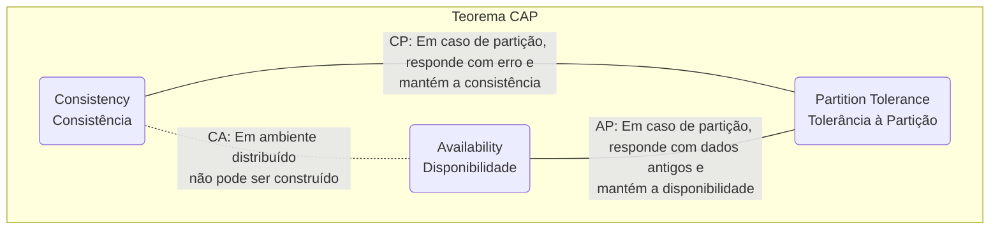
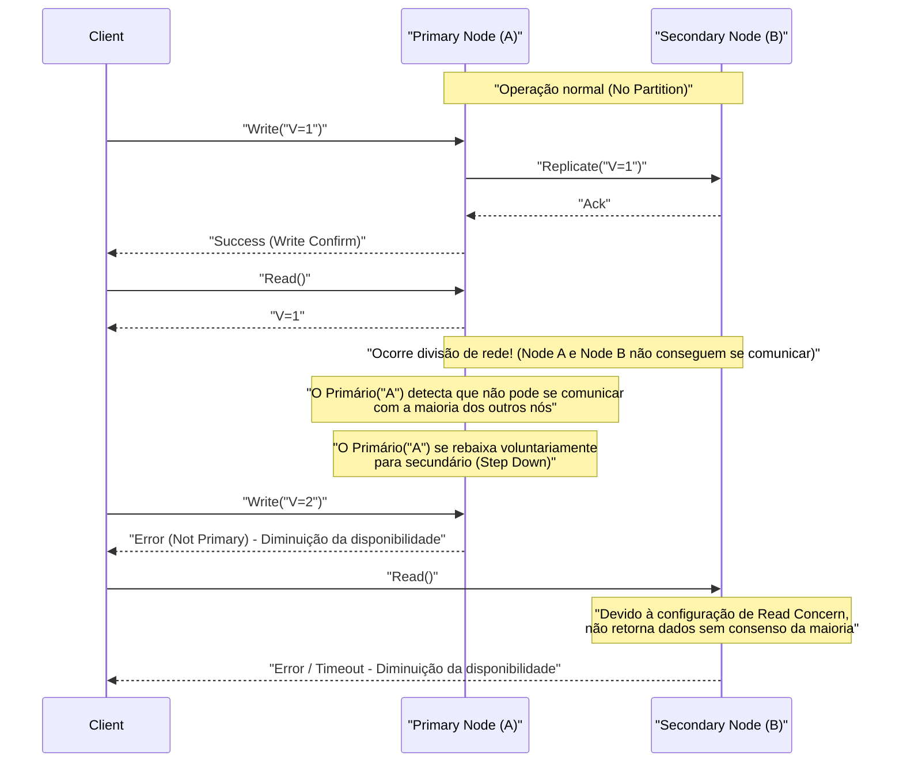
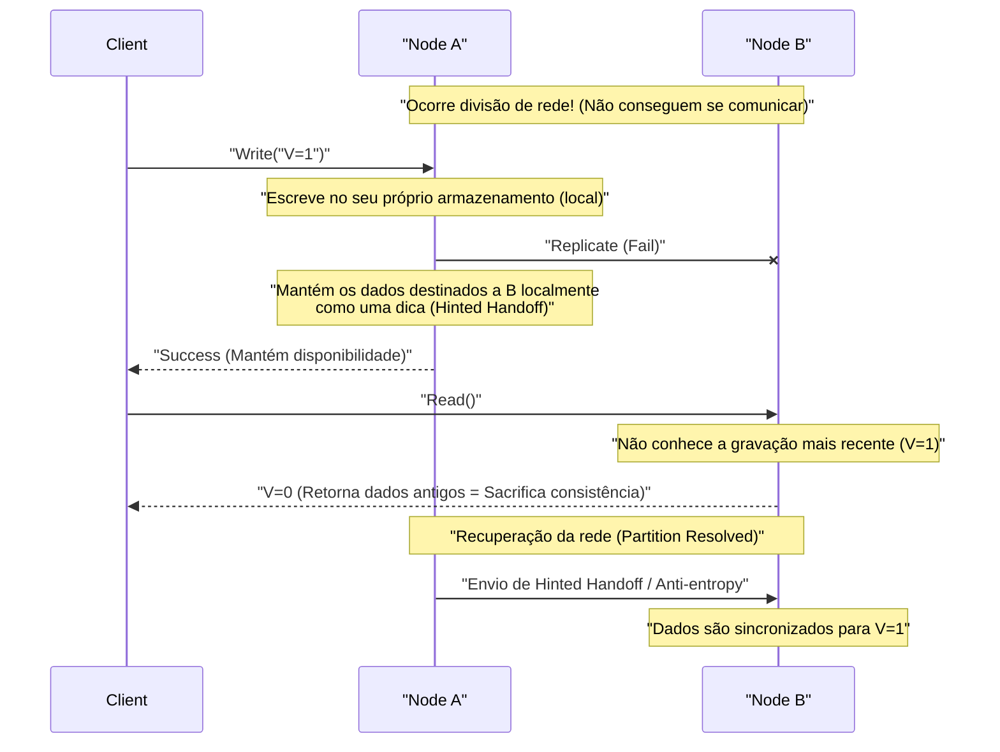

# Teorema CAP e Sistemas Distribuídos (Trade-off de Consistência, Disponibilidade e Tolerância à Partição)

Em serviços web e aplicativos corporativos modernos, os **sistemas distribuídos** (Distributed Systems) tornaram-se elementos essenciais. Para lidar com um tráfego enorme ou com dados que não podem ser processados por um único servidor, ou para evitar a interrupção do serviço devido a falha do servidor, vários nós (servidores) são coordenados para operar como um único sistema.

No entanto, há uma lei absoluta inevitável ao projetar sistemas distribuídos. É o **Teorema CAP** (CAP Theorem). Este artigo fornece uma explicação muito detalhada e abrangente do Teorema CAP, que forma a base do projeto de sistemas distribuídos, a partir de sua definição, fundamentação matemática e lógica, as abordagens de cada produto de banco de dados e o **Teorema PACELC** , que é o compromisso no mundo real.

## 1. História e Contexto do Teorema CAP

O Teorema CAP foi proposto no ano 2000 na conferência ACM PODC (Principles of Distributed Computing) pelo cientista da computação da Universidade da Califórnia, Berkeley, Eric Brewer. Inicialmente, foi apresentado como uma "Conjectura (Conjecture)" baseada em empirismo, mas em 2002, foi provado matematicamente por Seth Gilbert e Nancy Lynch do Instituto de Tecnologia de Massachusetts (MIT), e oficialmente estabelecido como um "Teorema (Theorem)".

O contexto no qual Brewer propôs este teorema foi a propagação explosiva da internet desde o final dos anos 1990. Os arquitetos da época tentaram manter as **propriedades [ACID](https://kenji.blog/pt/p/rdbms-transaction-acid-isolation-level-lock/)** (Atomicidade, Consistência, Isolamento, Durabilidade) possuídas pelos bancos de dados relacionais tradicionais operando em um único nó ([RDBMS](https://kenji.blog/pt/p/rdbms-transaction-acid-isolation-level-lock/)) num ambiente distribuído. No entanto, tornou-se claro que em um ambiente onde os nós estão geograficamente dispersos e ocorrem diariamente atrasos de rede e falhas, é quase impossível dimensionar o sistema mantendo completamente as propriedades ACID.

O Teorema CAP forneceu um suporte teórico para a realidade de que "não se pode tornar tudo perfeito" num sistema distribuído, e se tornou uma diretriz importante forçando os projetistas de sistemas a realizar **trade-offs** (sacrificar algo para obter algo).

## 2. Definições Rigorosas dos 3 Elementos do CAP

O Teorema CAP afirma que "num sistema distribuído, no máximo duas das seguintes três garantias podem ser satisfeitas simultaneamente".

*   **C (Consistency: Consistência)**
*   **A (Availability: Disponibilidade)**
*   **P (Partition Tolerance: Tolerância à Partição)**

Primeiro, vamos verificar as definições rigorosas dessas três propriedades no contexto dos sistemas distribuídos.

### 2.1. C: Consistency (Consistência)

**Consistência** no Teorema CAP refere-se à propriedade em que "todos os clientes podem ler sempre os mesmos dados mais recentes ou receber um erro". Academicamente, é um conceito próximo à **Linearizabilidade** (Linearizability).

Num sistema distribuído, os dados são replicados para vários nós para melhorar a disponibilidade e o desempenho. Num sistema com garantia de consistência, se algum cliente tentar ler dados de qualquer nó imediatamente após uma gravação de atualização num nó ser concluída, o resultado de atualização mais recente é sempre retornado ou (se os dados mais recentes não puderem ser retornados, por exemplo, porque a sincronização não ocorreu) um erro é retornado.

Ou seja, exige-se que todo o sistema se comporte como se fosse um "único nó que contém apenas os dados mais recentes". Os clientes nunca podem ler **dados antigos (Stale Data)**.

### 2.2. A: Availability (Disponibilidade)

A **Disponibilidade** no Teorema CAP é a propriedade de que "todos os nós em operação, não defeituosos, sempre retornam uma resposta válida (resposta sem erro) dentro de um tempo razoável".

Num sistema com garantia de disponibilidade, mesmo se uma falha ocorrer em parte do sistema (nós específicos ou links de rede), desde que o cliente possa acessar os nós saudáveis sobreviventes, o sistema retornará dados (mesmo que não seja garantido que sejam os mais recentes). Para solicitações válidas de clientes, o sistema não tem permissão para retornar um erro informando "incapaz de responder devido à inconsistência interna" ou esperar um timeout infinito. Exige-se sempre retornar "alguma resposta".

### 2.3. P: Partition Tolerance (Tolerância à Partição)

A **Tolerância à Partição** no Teorema CAP é a propriedade de que "o sistema como um todo continua a operar (dentro de cada rede particionada) mesmo se a comunicação de rede entre os nós for cortada e o sistema for dividido em vários grupos de rede (partições) que não podem se comunicar".

No ambiente de rede real, a comunicação entre nós atrasa inevitavelmente ou se perde completamente devido a perda de pacotes, falhas no roteador, corte físico de cabos ou sobrecarga temporária. Por se tratar de um sistema distribuído, o particionamento da rede deve ser assumido como um **fenômeno que pode ocorrer diariamente, em vez de uma exceção**. Portanto, um sistema distribuído que abandone o P (Tolerância à Partição) e assuma que "a rede nunca irá cair" não pode existir na realidade.

## 3. Por Que Não Pode Satisfazer os 3 Simultaneamente? (Prova e Lógica)

O Teorema CAP argumenta que é logicamente impossível satisfazer C, A e P simultaneamente. Explicaremos a essência da prova de Gilbert e Lynch com um modelo lógico fácil de entender.

Imagine um sistema distribuído simples baseado num modelo de rede assíncrona, como o seguinte:
*   O sistema consiste em dois nós de dados: **Node 1** e **Node 2** .
*   No estado inicial, o valor de certa variável é `V = 0` . Ambos os nós mantêm este valor sincronizado.

Agora, suponha que ocorra uma **divisão de rede (Partition)**. O caminho de comunicação entre o Node 1 e o Node 2 é completamente cortado e eles não podem enviar ou receber mensagens um do outro (uma situação para testar a tolerância à partição P).

Durante esta divisão de rede, um cliente envia uma solicitação de atualização `V = 1` para o **Node 1** . O Node 1 recebe a solicitação e atualiza seus dados `V` para `1`. No entanto, como a rede está desconectada, o Node 1 não pode enviar uma mensagem de replicação "Atualizou V para 1" para o Node 2.

Imediatamente após isso, outro cliente envia uma solicitação de leitura `Read(V)` para o **Node 2** .

Neste momento, que atitude o sistema (Node 2) deve tomar? O projetista do sistema deve escolher uma das duas opções a seguir.

### Opção 1: Sistema CP (Priorizar a Consistência e Sacrificar a Disponibilidade)

O Node 2 não tem como saber se os dados `V = 0` que ele contém são os mais recentes no sistema como um todo (pois não pode se comunicar para perguntar ao Node 1). Se simplesmente retornar `0` aqui, ele retornará um valor mais antigo que o último valor gravado `V = 1` pelo outro cliente um pouco antes, quebrando a **Consistência (C)** do sistema.

Para manter a consistência estritamente, o Node 2 determina que "não pode responder porque não tem certeza de que seus dados estão atualizados" e deve **retornar um erro** ao cliente ou **bloquear (timeout)** a resposta até a rede recuperar.
No momento em que o erro é retornado, a **Disponibilidade (A)** é perdida, pois o sistema não conseguiu retornar uma resposta normal.

### Opção 2: Sistema AP (Priorizar a Disponibilidade e Sacrificar a Consistência)

O Node 2 não deve retornar um erro ao cliente, deve sempre retornar alguma resposta normal (para proteger a disponibilidade A). O único dado que o Node 2 pode retornar nesta situação é o valor antigo `V = 0` que possui.

Se o Node 2 retornar `0` , uma resposta normal é dada ao cliente e a **Disponibilidade (A)** é mantida. No entanto, a **Consistência (C)** do sistema é perdida porque retorna um valor antigo que contradiz o último valor `V = 1` já gravado no Node 1.

---

Como tal, num contexto em que ocorre o constrangimento físico de divisão de rede (P), verifica-se que o sistema deve, como necessidade lógica, **sacrificar a Consistência (C) ou a Disponibilidade (A)** . Este é o núcleo do Teorema CAP.



O termo "Sistema CA (sistema que atinge consistência e disponibilidade, mas não tem tolerância a partição)" é frequentemente usado, mas refere-se aos [RDBMS](https://kenji.blog/pt/p/rdbms-transaction-acid-isolation-level-lock/) tradicionais operando num único nó. Como não há colaboração entre nós através de uma rede, o conceito de divisão de rede nem mesmo surge em primeiro lugar. Portanto, **num sistema distribuído real, a opção CA não existe e, na prática, é uma escolha entre CP ou AP**.

## 4. Exemplos Reais e Comportamento Detalhado de Sistemas CP e AP

Dependendo de qual característica do teorema CAP o sistema prioriza, a arquitetura do produto de banco de dados e seu comportamento num particionamento de rede variam muito. Aqui, aprofundaremos os produtos representativos de sistemas CP e AP e seus comportamentos específicos, usando diagramas de sequência.

### 4.1. Sistema CP (Consistency and Partition Tolerance)

Um sistema CP é uma arquitetura que dá **prioridade absoluta à consistência** em caso de divisão da rede e **suspende (sacrifica) parcial ou completamente a disponibilidade** do sistema para evitar o risco de inconsistência de dados (como o fenômeno "split-brain").

**Bancos de dados representativos:**
*   HBase
*   [MongoDB](https://kenji.blog/pt/p/nosql-database-selection-kvs-document-graph-wide-column/)
*   [Redis](https://kenji.blog/pt/p/nosql-database-selection-kvs-document-graph-wide-column/) Cluster (dependendo da configuração)
*   Etcd, Zookeeper (estritamente sistemas usando algoritmo de consenso distribuído)
*   Google Cloud Spanner (conforme descrito abaixo, essencialmente é um CP)

É escolhido para casos de uso em que não é aceitável tomar decisões incorretas lendo dados antigos (o que leva a perda financeira ou erros lógicos fatais), como o gerenciamento de saldos bancários, gerenciamento de estoque de sites de comércio eletrônico e sistemas de pagamento.

**Comportamento do sistema CP na divisão de rede (exemplo do MongoDB Replica Set):**

O MongoDB constrói um conjunto de réplicas que consiste num **nó primário (Primary)** e vários **nós secundários (Secondary)**. Por padrão, todas as gravações e leituras são direcionadas ao nó primário para manter a consistência.



Suponha que ocorra uma partição de rede e um cluster de 5 nós seja particionado num grupo de "2 nós (incluindo o primário atual)" e num de "3 nós". Nesse momento, o grupo de 2 nós onde existe o primário atual perdeu a maioria (Majority).
Para evitar inconsistência de dados, o [MongoDB](https://kenji.blog/pt/p/nosql-database-selection-kvs-document-graph-wide-column/), sendo um sistema CP, rebaixa (Step Down) automaticamente o nó primário deixado no grupo minoritário para nó secundário. Então, um novo algoritmo de eleição de líder (como o Raft) é executado entre o grupo de 3 nós com maioria e um novo primário é escolhido.
Durante os vários a dezenas de segundos em que a eleição deste líder está a ocorrer, ou para um grupo minoritário onde a partição não é resolvida, as gravações no sistema (e as leituras, dependendo da configuração) resultarão em um erro, reduzindo a **disponibilidade**. Contudo, isso evita que existam dois primários que aceitam gravações diferentes ao mesmo tempo, mantendo uma **consistência** robusta.

### 4.2. Sistema AP (Availability and Partition Tolerance)

Um sistema AP é uma arquitetura que coloca a **disponibilidade como prioridade máxima** mesmo em caso de divisão de rede, e sempre continua a fornecer acesso (leitura/gravação) ao sistema. O custo é que, temporariamente, ocorre uma situação em que os dados não estão sincronizados entre os nós (leitura de dados antigos ou conflitos de atualização), **sacrificando a consistência** .

**Bancos de dados representativos:**
*   Apache [Cassandra](https://kenji.blog/pt/p/nosql-database-selection-kvs-document-graph-wide-column/)
*   Amazon DynamoDB
*   Riak
*   Couchbase

Escolhido em casos de uso em que "basta a tela ser exibida o mais rápido possível (sem travamentos), mesmo que não sejam os dados mais recentes", algo fundamental para os negócios, como exibição da linha do tempo no SNS, coleta de logs de comportamento do usuário ou avaliações e recomendações de produtos num site de compras.

**Comportamento do sistema AP na divisão de rede (exemplo do Cassandra):**

O Cassandra usa uma **arquitetura Leaderless (sem mestre)** sem líder específico (Master). Todos os nós dispostos em um anel aceitam as requisições de leitura e gravação igualmente.



Suponha que ocorra uma divisão de rede e que o Node A e o Node B não consigam comunicar. Com as coisas neste estado, se o cliente fizer uma gravação no Node A, o Node A apenas gravará os dados em seu disco local (dependendo de sua configuração do nível de consistência) e retornará imediatamente "Write Successful" ao cliente (alta disponibilidade). A replicação para o Node B falha, mas o Node A lembra temporariamente este fato (Hinted Handoff).

Imediatamente após, quando outro cliente ler os dados do Node B, o Node B retornará placidamente os dados antigos que tem, uma vez que ainda não recebeu a atualização mais recente que teve lugar no Node A. Esse é o **estado de consistência sacrificada**.

No entanto, quando a rede é recuperada, o Node A envia os dados de atualização que reteve para o Node B e os dados são sincronizados em segundo plano. Isso é chamado de **Consistência Eventual (Eventual Consistency)**.

## 5. Mergulho Profundo na Consistência Eventual (Eventual Consistency)

Num sistema AP, "a consistência é sacrificada", mas isso não significa que os dados sejam deixados fragmentados para a eternidade. Consistência eventual é a garantia de que "se não houver novas atualizações no sistema por um determinado período de tempo, **eventualmente (Eventually)** os valores de todas as réplicas irão convergir para o mesmo e o estado da consistência será mantido".

Em sistemas distribuídos baseados na consistência eventual (sistemas com características **BASE**: Basically Available, Soft state, Eventual consistency), os desenvolvedores devem projetar os aplicativos levando em consideração "a possibilidade de leitura de dados antigos" e "a ocorrência de conflito (Conflict) nos dados caso várias atualizações ocorram em vários nós ao mesmo tempo".

### 5.1. Estratégias de Resolução de Conflito de Dados (Conflict)

Durante uma divisão da rede, ou quando os atrasos da rede fazem com que atualizações para a mesma chave ocorram em nós diferentes ao mesmo tempo, o sistema ou o aplicativo deve decidir qual atualização aceitar como verdadeira ou como mesclá-las.

1.  **LWW (Last Write Wins: Última Gravação Vence):**
    Uma estampa de tempo (timestamp) é anexada a cada pedido de atualização do lado do cliente ou do nó. Em caso de conflito, a **atualização com a estampa de tempo mais recente é simplesmente aceita como verdadeira, substituindo (e descartando) as mais antigas**. Frequentemente usado como padrão no [Cassandra](https://kenji.blog/pt/p/nosql-database-selection-kvs-document-graph-wide-column/) e noutros.
    *Vantagens*: Resolve conflitos automaticamente do lado do sistema, a implementação é simples.
    *Desvantagens*: Risco de substituição indesejada de dados devido à diferença de relógio (Clock Skew) entre os clientes e você deve tolerar que uma atualização seja totalmente perdida (descartada).

2.  **Relógios Vetoriais (Vector Clocks):**
    O histórico de atualizações (informação de versão) para cada nó é armazenado num formato de lista e o relacionamento causal (Causality) da atualização é rigorosamente verificado. Quando o sistema detecta um conflito que não pode ser resolvido automaticamente (atualizações completamente síncronas sem relacionamento causal), o sistema não substitui os dados arbitrariamente, mas **mantém em vez disso as várias versões conflitantes (Siblings) exatamente como estão**. Em seguida, da próxima vez que um cliente ler os dados, todas essas versões conflitantes são retornadas e a **lógica do aplicativo (ou um usuário humano) fica encarregue da resolução do conflito (Merge)**. Este é um método poderoso, adotado pelo Amazon Dynamo e outros.
    *Vantagens*: Pode evitar a perda de dados.
    *Desvantagens*: A implementação por parte da aplicação é complexa.

3.  **CRDT (Conflict-free Replicated Data Type):**
    Conferindo propriedades matemáticas (comutatividade, associatividade, idempotência) à própria estrutura de dados, este é **um tipo de dados especial desenhado para convergir sempre eventualmente para o mesmo estado** mesmo que haja atrasos na rede ou desordem nas mensagens.
    Usado, por exemplo, em contadores distribuídos, conjuntos somente de anexação (Grow-only Set), algoritmos de edição colaborativa de texto, etc. Suportado no Riak, módulos [Redis](https://kenji.blog/pt/p/nosql-database-selection-kvs-document-graph-wide-column/) Enterprise, etc.

### 5.2. Exemplo de Controle pela Aplicação (Resolução de Conflitos tipo Relógios Vetoriais)

Apresentamos a seguir um pseudocódigo (estilo Python) para detectar conflitos de dados em sistemas AP e para a sua resolução na aplicação. Usa-se a adição de itens no carrinho de compras como exemplo.

```python
import time

def update_shopping_cart(user_id, new_item, database):
    """
    Função para adicionar um item ao carrinho de compras.
    No pressuposto de um BD com consistência eventual, executa bloqueio otimista e resolução de conflitos.
    """
    max_retries = 3
    
    for attempt in range(max_retries):
        try:
            # 1. Obter os dados atuais do carrinho e a versão (como Relógios Vetoriais) do banco de dados
            result = database.read(user_id)
            cart_data_list = result.data  # Uma lista de várias versões conflitantes (Siblings) pode ser retornada
            version_context = result.context # Informação da versão necessária no momento da atualização
            
            # 2. Lógica de resolução de conflitos quando várias versões conflitantes são retornadas
            resolved_cart = resolve_conflict(cart_data_list)
            
            # 3. Adicionar o novo item aos dados do carrinho resolvido
            if new_item not in resolved_cart:
                resolved_cart.append(new_item)
            
            # 4. Escrever no banco de dados com o contexto da versão (Optimistic Locking)
            # O lado do BD verifica se o contexto fornecido corresponde ao contexto mais recente no lado do BD
            success = database.write(user_id, resolved_cart, version_context)
            
            if success:
                print("Carrinho atualizado com sucesso.")
                return True
            else:
                # Falha ao escrever devido a conflito de versão (outro cliente atualizou primeiro)
                print(f"Falha de gravação por conflito de versão. Tentando de novo... (Attempt {attempt + 1})")
                continue # Iniciar novamente a partir da releitura no próximo loop
                
        except NetworkException:
            # Tentar de novo em caso de erro de rede
            print(f"Erro de rede. Tentando de novo... (Attempt {attempt + 1})")
            time.sleep(1 * (attempt + 1)) # Backoff exponencial
            
    raise Exception("Falha ao atualizar o carrinho, apesar das várias tentativas.")

def resolve_conflict(conflicting_carts):
    """
    Lógica de resolução de conflitos.
    Neste exemplo, os conteúdos de todos os carrinhos são mesclados (obtendo a união) para evitar a perda de itens.
    Dependendo dos requisitos de negócio, isso poderia ser alterado para lógicas como "dar prioridade àquele com a estampa de tempo mais recente".
    """
    merged_cart = set()
    for cart in conflicting_carts:
        for item in cart:
            merged_cart.add(item)
    return list(merged_cart)
```
Como tal, pela vantagem da alta disponibilidade alcançada pela escolha de um sistema AP, o desenvolvedor arca com a responsabilidade de implementar adequadamente a "Tentativa de processamento", "Bloqueio otimista (Optimistic Locking)" e "Resolução de conflitos baseada na lógica de negócios (Merge)" no código da aplicação.

## 6. De CAP a PACELC: Trade-off em Tempos Normais

O Teorema CAP define como um sistema deve se comportar numa situação "extrema" quando "ocorre uma divisão de rede (Partition)". No entanto, ao operar um sistema de fato, nem sempre o particionamento completo da rede ocorre a cada momento (ainda que seja um risco a esperar).

Por isso, o **Teorema PACELC** foi proposto em 2010 por Daniel Abadi na Universidade de Yale (na época). Este é um modelo mais prático que amplia o Teorema CAP para incluir **"trade-offs sob condições normais (quando a rede funciona bem)", não apenas num momento de divisão da rede**.

O **PACELC** constitui-se das iniciais a seguir:

*   Se houver um caso de **P**artition (em caso de divisão de rede),
*   Ele escolhe entre a **A**vailability (Disponibilidade) ou **C**onsistency (Consistência) (Igual ao teorema CAP).
*   Se não for o caso, **E**lse (no caso de momentos normais quando não for isso),
*   Ele escolhe entre a **L**atency (Latência) ou **C**onsistency (Consistência).

Em tempos normais, tentar manter a **Consistência (C)** dos dados estritamente exige que se aguarde a conclusão da replicação (sincronização) aos vários outros nós para os pedidos de escrita antes de se retornar uma confirmação final ao cliente. O "tempo gasto à espera da comunicação na rede" se converte em overhead (sobrecarga) e o tempo de **Latência (L)** do sistema degrada (torna-se mais lento).

Ao contrário disso, se tenta reduzir a **Latência (L)** do sistema à sua velocidade máxima (rápida), assim que um pedido de gravação for recebido de um cliente no nó local, a resposta de sucesso será retornada de imediato. Isso gera um cenário em que a replicação para outros nós se desenrola de modo assíncrono em segundo plano. Nesse caso, a resposta é bastante rápida, mas ocorre a incongruência de dados durante um espaço de alguns milissegundos a segundos enquanto se finda o processo da replicação, perdendo-se assim a **Consistência (C)**.

Se categorizarmos as bases de dados distribuídas atuais através do Teorema PACELC, veremos 4 configurações:

1.  **PC/EC (Prioridade à consistência em caso de divisão, bem como em tempos normais):**
    Ex.: VoltDB, CockroachDB. Garante uma forte consistência ([ACID](https://kenji.blog/pt/p/rdbms-transaction-acid-isolation-level-lock/)) sob qualquer situação. No entanto, por causa disso, em qualquer momento (até tempos normais), as transmissões de sincronização entre os nós se mostram requeridas e têm forte interferência sobre a latência; logo, os desempenhos podem cair num cenário onde ocorrem grandes retardos da rede, tais como as regiões múltiplas (multi-region).
2.  **PC/EL (Prioridade à consistência num momento de divisão e à latência no momento normal):**
    Ex.: [MongoDB](https://kenji.blog/pt/p/nosql-database-selection-kvs-document-graph-wide-column/) (por padrão), Replicação Assíncrona no MySQL. Perante anomalias, como durante partições, previnem os dados corrompidos (split-brain) mesmo que ao custo de desligar o sistema, todavia, quando tudo está regular (tempos normais), focam muito mais as velocidades (escritas/leituras) permitindo a entrega, mesmo que tardia (dados antigos lidos na hora).
3.  **PA/EL (Prioridade à disponibilidade no caso de divisão, de igual modo à latência perante horas normais):**
    Ex.: [Cassandra](https://kenji.blog/pt/p/nosql-database-selection-kvs-document-graph-wide-column/), Amazon DynamoDB, Riak. Arquiteturas com vista a um grande scale out/alta resiliência perante interrupções e com a promessa para não derrubarem o sistema ao tempo que miram a velocidade com latência no mínimo. Adotam a abordagem onde a consistência de forma totalitária tem lugar eventual (consistência eventual).
4.  **PA/EC (Prioridade da disponibilidade num instante de divisão; e prioridade da consistência aos tempos normais):**
    Quase nenhum sistema de banco de dados no mundo real implementaria essa categoria, uma vez que seria uma arquitetura desregulada (de concepção que visa funcionar sempre perante tempos incomuns às custas de manter as incongruências ativas enquanto penaliza a latência perante os estados normais, unicamente para forçar coerências nesses momentos tranquilos).

## 7. Afinação das Consistências (Tunable Consistency) perante a Época Moderna de Bancos de Dados

O material discutido talvez crie a noção que "todos os componentes se dividem seletivamente nos ramos inflexíveis: ou CP, ou AP", porém a esmagadora parte das estruturas de dados [NoSQL](https://kenji.blog/pt/p/nosql-database-selection-kvs-document-graph-wide-column/) sofisticadas atuais (Cassandra, DynamoDB, Cosmos DB, entre outras), oferecem uma **função de "nível em consistência (Tunable Consistency)" ajustável (parametrizada) e adaptada quer por inquéritos das sessões, como por cada requisição singular**.

### 7.1. O Controle Empregando a Fórmula de Quorum

Para o Cassandra, a coerência das remessas mantém uma métrica de equilíbrio face as seguintes bases descritivas:

*   **N:** A quantia total do acervo para onde os arquivos irão (Replication Factor)
*   **W:** Em caso de escrever, reflete a quantidade nos números do total de nós (Write Consistency Level) em termos de receção à notificação completa e síncrona
*   **R:** Caso queira ler algo, é quantitativo no qual são as consultas aos votos maioritários exigidos (Read Consistency Level)

Ao fixar esse grupo respeitando as exigências presentes num cômputo que virá a seguir, a classe escolhida perante a leitura (R) albergará irrefutavelmente o grupo contendo as anotações do sistema no nódulo referente a nova re-avaliação/gravação da informação nova (W); deste meio, se cria assim **Consistência Forte (Strong Consistency)** assegurada.

`W + R > N`

**Modelos das Modificações/Aplicações Ajustadas:**

*   **Elevado Enfoque rumo a Rigorosa Coerência (Quorum Read/Write):** `W = Quorum`, `R = Quorum`
    (Por exemplo, N=3, W=2 e R=2 a partir de cenários constituídos a três nodos. Requer a validação/resolução mútua de metade e da subsequente parte nas operações da leitura ou escrita. Oferece a resposta que detém o elemento das novidades, entretanto, apresenta-se com latências moderadas.)
*   **Velocidade Direcionada ao Tempo na Hora em que Decorre Uma Modificação/Redigir (Abordagens AP para a Consistência Eventual):** `W = 1`, `R = All`
    (Possibilita uma incrível fluidez para os registros devido à terminação na ação após a simples inclusão singular na porta inicial. Para rever essas novidades será exigida a leitura profunda pelo conjunto dos servidores totais - devido à necessidade para aferir com exatidão a estampa de tempo, então, o decorrer de resgate leva tempos prolongados.)
*   **Abordagem que Privilegia Leitura Veloz e Exata do Tempo (Abordagem tipo AP para a Consistência Eventual):** `W = All`, `R = 1`
    (Tem as esperas com as escritas demoradas por estarem em repouso até ao término na total submissão nas plataformas de armazenamento - por contraste, o pedido singular torna-se tão incrivelmente breve no futuro dado que de onde vier a chamada é garantia firme à exatidão presente, garantindo a sua imensa rapidez ao ler.)
*   **Tolerância Extrema Relativamente as Preocupações da Perda com Latência Minuciosa (PA/EL):** `W = 1`, `R = 1`
    (Emprega-se a limitação circunscrita até ao mais próximo recetor no que é tangível com as transações na ação inicial. Resultando na vertente da mais notória celeridade ou de onde menos existem as faltas de funções - não obstante, gera margens altamente grandes na captura/encontro dos registos em falta de sincronização.)

Perante isto, o que está na arquitetura global por parte do construtor de modo algum acaba estático - perante estas formulações das obrigações (onde impera as restrições da organização de capital/negócios) são moldados, dinamicamente, valores atribuídos nos conjuntos base de W ou R. Por outras palavras "Para assuntos ligados às faturas monetárias se torna indissociável que impere Consistência Forte (W=Quorum, R=Quorum)" – pelo inverso – "É preferível um enfoque à rapidez para as gravações das métricas de interações com os perfis do Website devido as quebras destas tolerarem pequenos limites do extravio (W=1)". Graças aos domínios nestes atributos de natureza similar incluídos neste único leque com a constelação destes aglomerados de serviços interligados com base nestas finalidades aos volumes recebidos/inseridos, o utilizador manuseia, isoladamente, os **deslizadores referentes no equilíbrio e de acordo no trade-off na fórmula CAP/PACELC**.

### 7.2. Teria a Entidade Google Cloud Spanner Arruinado os Fundamentos Envoltos no Teorema CAP?

Nas discussões mais habituais tem havido opiniões apontando como "a estrutura que dita o Google Cloud Spanner apresenta índices altíssimos referentes à prontidão ao disponibilizar acessibilidades acompanhado ao suporte total na Consistência Exterior/Generalista Global (External Consistency) por intermédio das operações transfronteiriças contornando assim a regra contida com base nos veredictos de CAP".

Pela contraposição a estas vozes e no entanto com referências feitas às declarações em artigos das teses pertencentes com autoridade às observações realizadas - neste sentido, na essência pela pena de Eric Brewer (o autor): **"O Spanner nunca ignorou (não rompeu) em sua premissa e/ou quebrou nada relativo na sua regra contida perante a premissa de que o mesmo seja um CP"**

No que reside em relação às coisas surpreendentes ao projeto (no Spanner) está um serviço base material do suporte estrutural referenciado nas configurações na **TrueTime API** – mescla-se pelo meio relógios de dimensão/suporte que incluem uma cronologia atómica com rastreio de natureza GPS de onde limita-se "incertezas provenientes no âmbito relativas às medições cronológicas (Clock Uncertainty)", mantendo a restrição dentro desta globalizada arquitetura abaixo na classe equivalente ao teto contido à tolerância do simples milissegundo de diferença. Perante a adoção de um recurso exato sobre dimensões internacionais na gestão de fluxos desta escala espalhados ao redor da Terra é admissível estipular sem as discrepâncias às etapas sucessoras destas ações (Transações).

Este programa pertencente à Google trabalha no plano reservado duma formidável armadura isolada à prova para que ocorra acidentes no ambiente real onde resvalam a probabilidade e ao mesmo com restrições perto na escala ao redor para que se limite e chegue à quase total supressão nula num caso relativo à hipótese associada à "divisão (P) das linhas implicando e abdicando-se em nome na perda das disponibilidades (A)" (atingiu-se resiliências até cinco algarismos compostos unicamente com 9 perante as pontuações e métricas sobre a acessibilidade sem impedimentos). Pela tese em sentido conjetural perante a suposição hipotética da desativação global - as falhas em níveis generalistas e abrangências globais (desligamento extremo), este continuaria a proteger o núcleo estrutural em benefício perante a coesão/consistência originando consequentemente à desativação dos serviços na sua forma contínua acessível por retornos nos alertas contendo indicativos ao insucesso/erro (a premissa inerente em ser um CP mantém-se ilesa ao rigor inicial).

## 8. Perspetivas das Melhores Práticas às Escolhas Decisivas das Regras Em Sistemas Descentralizados

À elaboração na escolha por plataformas nestas distribuições que abrangem a escala descentralizada as regras no Teorema CAP ou Teorema PACELC impõem-se qual a dura constatação em que, física perante logicamente, "em todas as suas propriedades, nunca vai existir nenhuma magia perfeita à la bala-de-prata".

*   A desconexão ou falhas originando fraturas na comunicação entre si (P) figuram como processos inevvestíveis que integram ao modelo das vivências das operações de ligações do mundo palpável (vida real).
*   Se essa cisão vier a ocorrer, as hipóteses resumem-se numa de duas possibilidades excludentes: Ou defenderemos o sistema por parte que implica um grau estrito na proteção da Consistência de informações (C) encerrando assim o serviço - ou preservar a utilidade aos níveis de Disponibilidades (A) suportando pela falha/fratura dados imprecisamente ajustados num instante presente temporalmente afetado.
*   Conforme indicações incluídas aos desígnios na lei PACELC, mesmo com momentos na plena normalidade (sem caos ou ruturas), manter-se um acréscimo rígido na subida das propriedades da consistência (C) geram perdas que sacrificarão os limites temporais de rapidez das solicitações: ao passo, as intenções a aligeirarem no plano da latência, levarão indiscutivelmente as abdicações por níveis destas coesões informativas (trade-offs implícitos sempre ativados).

Arquiteto ou analista nestas engenharias dedicadas perante software e afins são estritamente condicionados perante a evitar abordagens ligeiras escolhendo à base das razões das modas presentes pelo encanto comercial atual de onde repousam justificativas meramente balizadas em pontuações de altas métricas comparativas (referência no benchmark). Muito prioritariamente ao essencial nas elaborações: impera uma inspeção atenta naquilo no qual dita um plano em que "No limite catastrófico a uma possível peripécia perante a eventual adversidade a decorrer nos aparelhos, na infraestrutura concebida, será admissível preferir **termos corrompido algo ou se abdicam, paralisando em estado puro todas as operativas cortando pela limitação generalizada nos nossos utentes (usuários)?**".

No caso que envereda pela ordem puramente financeira, indiscutivelmente a base das bases para uma eleição num formato CP (da mesma espécie num sistema tradicional [RDBMS](https://kenji.blog/pt/p/rdbms-transaction-acid-isolation-level-lock/)) trará e conservará garantias seguras para que as forças nas coerências (Strong) operem incólumes. E, aos que preferem abordagens nas áreas do mercado nas plataformas generalizadas, num modelo de SNS (Social Network) nos quadros de expansão intercontinentais e mundiais que optam assumindo nas vertentes estruturais por modelos à margem das categorias ligadas na arquitetura AP e conformando-se às dinâmicas ao lado dessa eventual coerência/consistência de acordo na base da adoção no âmbito dos preceitos focados em manter ao máximo as disposições às resistências ligadas as imediações para respostas curtas, com um funcionamento incessante focado sem cortes ininterrupto aos níveis das 24 horas por inteiro que percorrem no decurso ao limite pleno abrangente aos 365 dias/ano.

A vasta escala e na grande fatia generalizada na dependência restritamente em funções alusivas das especificidades por produtos exclusivos, sem conjunções adicionadas da organização por fora (os processos no que envolve na forma a conceber pelas construções de soluções elaboradas nas programações/códigos em si), jamais terão sustentabilidades exclusivas para se agarrarem ao mesmo. É por aceitar pressupostos subjacentes no âmbito da adoção por estas engrenagens no sistema numa resposta pelo arquétipo AP em onde, nas margens conjunturais no projeto das aplicações sob as formas perante aos padrões de criação nos retornos programados ("estilo a adotar em repetição sistemática", garantias voltadas "ao foco de idempotências garantidas (evitando multiplicações por repetição num retorno)", no modelo nos acertos de eventuais reposições baseada na adoção transacional na modalidade das recuperações (Padrão Saga), incluindo os raciocínios resolutivos lógicos nos conflitos/soluções): com estes escudos e ferramentas nos disfarces na supressão nas carências nestes esquemas operacionais no controlo das incongruências com aptidão numa excelência pautando na resiliência do modelo a que chamamos por uma  **"Aptidão em estruturar de modo que opere sem catástrofe nas imperfeições na falha segura (Fail-safe)"** traduz uma das diretivas com chaves primordiais centrais face nos desígnios para gerar distribuições fiáveis nas era contemporânea dos atuais serviços globais e distribuídos atuais.
