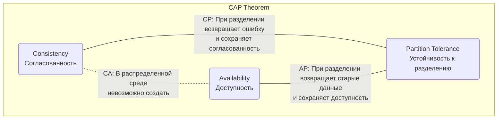
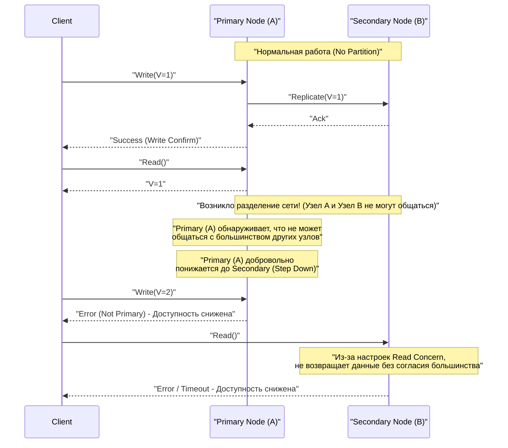
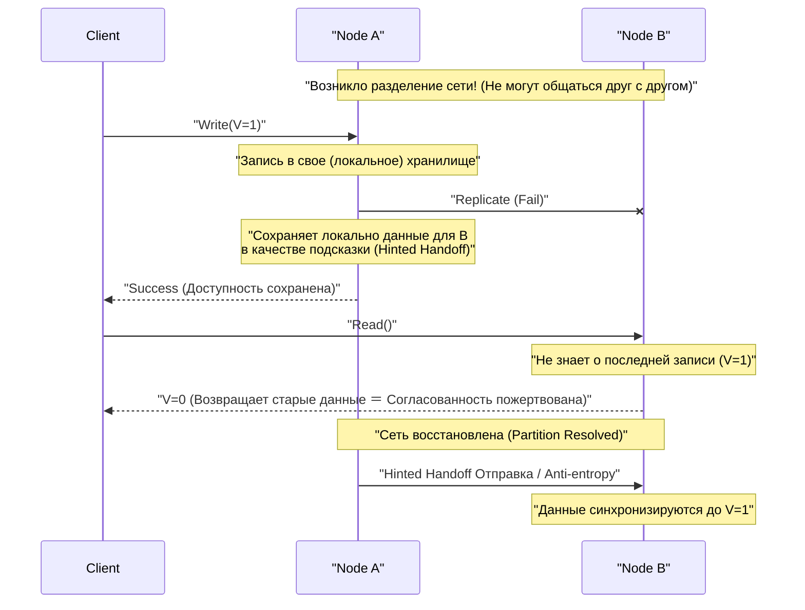

# CAP-теорема и распределенные системы (компромисс между согласованностью, доступностью и устойчивостью к разделению)

В современных веб-сервисах и корпоративных приложениях **распределенные системы** (Distributed Systems) стали неотъемлемым элементом. Чтобы справляться с огромным трафиком и объемами данных, которые не под силу одному серверу, или для предотвращения остановки сервиса из-за сбоя сервера, несколько узлов (серверов) объединяются для работы как единая система.

Однако при проектировании распределенных систем существует абсолютный закон, который невозможно обойти. Это **CAP-теорема** (CAP Theorem). В этой статье мы подробно и всесторонне рассмотрим CAP-теорему, являющуюся основой проектирования распределенных систем, начиная с ее определения, математических и логических основ, подходов различных баз данных, и заканчивая теоремой **PACELC**, которая представляет собой компромисс в реальном мире.

## 1. История и предпосылки CAP-теоремы

CAP-теорема была предложена в 2000 году на конференции ACM PODC (Principles of Distributed Computing) Эриком Брюером (Eric Brewer), ученым в области компьютерных наук из Калифорнийского университета в Беркли. Изначально она была представлена как «гипотеза» (Conjecture), основанная на эмпирических правилах, но в 2002 году Сет Гилберт (Seth Gilbert) и Нэнси Линч (Nancy Lynch) из Массачусетского технологического института (MIT) математически доказали ее, и она официально стала «теоремой» (Theorem).

Предпосылкой для выдвижения этой теоремы Брюером стал взрывной рост интернета с конца 1990-х годов. В то время архитекторы пытались сохранить свойства **[ACID](https://kenji.blog/ru/p/rdbms-transaction-acid-isolation-level-lock/)** (атомарность, согласованность, изолированность, долговечность), присущие традиционным реляционным базам данных ([RDBMS](https://kenji.blog/ru/p/rdbms-transaction-acid-isolation-level-lock/)), работающим на одном узле, и в распределенной среде. Однако в среде, где узлы географически распределены, а сетевые задержки и сбои происходят ежедневно, выяснилось, что масштабирование системы при полном сохранении свойств ACID практически невозможно.

CAP-теорема теоретически подтвердила реальность того, что в распределенных системах «невозможно сделать все идеально», и стала важным ориентиром, вынуждающим проектировщиков систем идти на **компромиссы** (жертвовать чем-то, чтобы получить что-то другое).

## 2. Строгое определение трех элементов CAP

CAP-теорема утверждает, что «распределенная система может одновременно обеспечивать не более двух из следующих трех гарантий».

*   **C (Consistency: Согласованность)**
*   **A (Availability: Доступность)**
*   **P (Partition Tolerance: Устойчивость к разделению)**

Давайте сначала рассмотрим строгие определения этих трех свойств в контексте распределенных систем.

### 2.1. C: Consistency (Согласованность)

**Согласованность** в CAP-теореме означает свойство, при котором «все клиенты всегда видят одни и те же актуальные данные или получают ошибку». В академических кругах это понятие близко к **линеаризуемости** (Linearizability).

В распределенной системе данные реплицируются (дублируются) на несколько узлов для повышения доступности и производительности. В системе, где гарантируется согласованность, если сразу после завершения записи обновления данных на одном узле любой другой клиент попытается прочитать данные с любого узла, он обязательно получит последний результат обновления, либо получит ошибку (если, например, синхронизация не успела завершиться и актуальные данные не могут быть возвращены).

Другими словами, система должна вести себя так, как если бы она была «одним узлом, хранящим только единственные актуальные данные». Ситуация, когда клиент считывает **устаревшие данные (Stale Data)**, абсолютно недопустима.

### 2.2. A: Availability (Доступность)

**Доступность** в CAP-теореме — это свойство, при котором «каждый работающий узел, на котором не произошло сбоя, обязательно возвращает успешный ответ (не ошибку) в течение разумного времени».

В системе, гарантирующей доступность, даже если в части системы (на определенном узле или линии связи) произошел сбой, если клиент может получить доступ к живому, исправному узлу, система обязательно вернет данные (даже если нет гарантии, что они самые свежие). Не допускается, чтобы система возвращала ошибку клиенту на правомерный запрос со словами «не могу ответить из-за внутренней несогласованности» или заставляла его бесконечно ждать по тайм-ауту. Требуется всегда возвращать «какой-либо ответ».

### 2.3. P: Partition Tolerance (Устойчивость к разделению)

**Устойчивость к разделению** в CAP-теореме означает свойство, при котором «даже если сетевое соединение между узлами прерывается, и система разделяется на несколько сетевых групп (партиций), которые не могут взаимодействовать друг с другом, система в целом (внутри каждой разделенной сети) продолжает работать».

В реальных сетевых средах потери пакетов, сбои маршрутизаторов, физические повреждения кабелей или временные перегрузки неизбежно приводят к задержкам или полной потере связи между узлами. Поскольку система является распределенной, разделение сети следует рассматривать не как исключение, а как **ежедневно происходящее явление**. Следовательно, распределенная система, которая отказывается от P (устойчивости к разделению) и предполагает, что «сеть никогда не разорвется», в реальности существовать не может.

## 3. Почему невозможно удовлетворить все три условия одновременно? (Доказательство и логика)

CAP-теорема утверждает, что логически невозможно одновременно удовлетворить C, A и P. Мы объясним суть доказательства Гилберта и Линч на простой логической модели.

Представьте себе простую распределенную систему, основанную на асинхронной сетевой модели:
*   Система состоит из двух узлов данных: **Node 1** и **Node 2**.
*   В исходном состоянии значение некоторой переменной `V = 0`. Оба узла синхронизированно хранят это значение.

Теперь предположим, что произошло **разделение сети (Partition)**. Канал связи между Node 1 и Node 2 полностью разорван, и они не могут отправлять или получать сообщения друг от друга (это ситуация для проверки устойчивости к разделению P).

Во время этого разделения сети один клиент отправляет запрос на обновление значения `V = 1` на **Node 1**. Node 1 принимает запрос и обновляет свои данные `V` до `1`. Однако из-за разрыва сети Node 1 не может отправить сообщение о репликации «V обновлено до 1» на Node 2.

Сразу после этого другой клиент отправляет запрос на чтение `Read(V)` на **Node 2**.

Как должна повести себя система (Node 2) в этот момент? Проектировщик системы должен выбрать один из двух вариантов.

### Вариант 1: CP-система (Приоритет согласованности в ущерб доступности)

Node 2 не может знать, являются ли его данные `V = 0` актуальными для всей системы (поскольку он не может связаться с Node 1). Если он просто вернет `0`, он вернет старое значение вместо последнего значения `V = 1`, записанного другим клиентом прямо перед этим, что нарушит **согласованность (C)** системы.

Чтобы строго соблюсти согласованность, Node 2 должен решить, что «он не может ответить, так как нет уверенности в актуальности его данных», и вернуть **ошибку** клиенту или **заблокировать (тайм-аут)** ответ до восстановления сети.
В момент возврата ошибки система не смогла вернуть нормальный ответ, поэтому **доступность (A)** теряется.

### Вариант 2: AP-система (Приоритет доступности в ущерб согласованности)

Node 2 не должен возвращать клиенту ошибку, а должен обязательно вернуть какой-то нормальный ответ (для сохранения доступности A). Единственные данные, которые Node 2 может вернуть в текущей ситуации, это старое значение `V = 0`, которое он хранит.

Если Node 2 вернет `0`, клиент получит нормальный ответ, и **доступность (A)** будет сохранена. Однако, поскольку возвращается старое значение, противоречащее актуальному значению `V = 1`, уже записанному на Node 1, **согласованность (C)** системы теряется.

---

Таким образом, в ситуации, когда возникает физическое ограничение в виде разделения сети (P), система по логической необходимости должна пожертвовать либо **согласованностью (C), либо доступностью (A)**. В этом и заключается суть CAP-теоремы.



Часто используется термин «CA-система (система, сочетающая согласованность и доступность, не имеющая устойчивости к разделению)», но он относится к традиционным [RDBMS](https://kenji.blog/ru/p/rdbms-transaction-acid-isolation-level-lock/), работающим на одном узле. Поскольку нет взаимодействия между узлами через сеть, концепция разделения сети не возникает в принципе. Следовательно, **в истинно распределенных системах варианта CA не существует, и фактически это выбор между CP и AP**.

## 4. Примеры CP и AP систем и подробное их поведение

В зависимости от того, какому свойству CAP-теоремы система отдает приоритет, архитектура баз данных и их поведение при разделении сети совершенно различны. Здесь мы подробно рассмотрим типичные CP и AP системы, а также их конкретное поведение с использованием диаграмм последовательности.

### 4.1. CP-система (Consistency and Partition Tolerance)

CP-система — это архитектура, которая при возникновении разделения сети отдает **абсолютный приоритет согласованности** и частично или полностью останавливает (жертвует) **доступность** системы, чтобы избежать риска несогласованности данных (например, явления split-brain).

**Типичные хранилища данных:**
*   HBase
*   [MongoDB](https://kenji.blog/ru/p/nosql-database-selection-kvs-document-graph-wide-column/)
*   [Redis](https://kenji.blog/ru/p/nosql-database-selection-kvs-document-graph-wide-column/) Cluster (в зависимости от настроек)
*   Etcd, Zookeeper (строго говоря, системы, использующие алгоритмы распределенного консенсуса)
*   Google Cloud Spanner (по сути является CP, как будет описано ниже)

Они выбираются для таких случаев использования, как управление балансом банковских счетов, управление запасами на сайтах электронной коммерции, платежные системы и т. д., где считывание старых данных и принятие неверных решений недопустимо (что напрямую ведет к финансовым потерям или фатальным логическим ошибкам).

**Поведение CP-системы при разделении сети (на примере Replica Set в MongoDB):**

MongoDB строит набор реплик (Replica Set), состоящий из одного **первичного узла (Primary)** и нескольких **вторичных узлов (Secondary)**. По умолчанию все операции записи и чтения выполняются на первичном узле для сохранения согласованности.



Предположим, происходит разделение сети, и кластер из 5 узлов разделяется на группы из «2 узлов (включая текущий первичный)» и «3 узлов». В этот момент группа из 2 узлов, в которой находится текущий первичный узел, теряет большинство (Majority).
[MongoDB](https://kenji.blog/ru/p/nosql-database-selection-kvs-document-graph-wide-column/), как CP-система, автоматически понижает первичный узел, оставшийся в меньшинстве, до вторичного узла (Step Down), чтобы предотвратить несогласованность данных. Затем в группе из 3 узлов, составляющей большинство, запускается алгоритм выбора нового лидера (например, Raft), и выбирается новый первичный узел.
В течение нескольких секунд или десятков секунд, пока идет этот выбор лидера, или для группы меньшинства, где разделение не разрешено, запись в систему (а в зависимости от настроек — и чтение) завершается ошибкой, и **доступность снижается**. Однако это предотвращает ситуацию, когда одновременно существуют два первичных узла и принимают разные записи, тем самым **строго сохраняя согласованность**.

### 4.2. AP-система (Availability and Partition Tolerance)

AP-система — это архитектура, которая даже в случае разделения сети отдает **наивысший приоритет доступности** и продолжает обеспечивать доступ (чтение и запись) к системе. Расплатой за это становится временная рассинхронизация данных между узлами (чтение старых данных или конфликты обновлений), и **согласованность приносится в жертву**.

**Типичные хранилища данных:**
*   Apache [Cassandra](https://kenji.blog/ru/p/nosql-database-selection-kvs-document-graph-wide-column/)
*   Amazon DynamoDB
*   Riak
*   Couchbase

Они выбираются для таких случаев использования, как отображение временных шкал в социальных сетях, сбор логов поведения пользователей, обзоры продуктов и функции рекомендаций на торговых сайтах, где критически важно для бизнеса, чтобы «экран отображался быстро (система не останавливалась), даже если данные не самые свежие».

**Поведение AP-системы при разделении сети (на примере Cassandra):**

Cassandra использует **архитектуру без лидера (Leaderless)**, в которой нет конкретного лидера (мастера). Все узлы, расположенные в виде кольца, принимают запросы на чтение и запись на равных правах.



Предположим, произошло разделение сети, и Node A и Node B не могут обмениваться данными. Если клиент выполняет запись на Node A в этом состоянии, Node A записывает данные только на свой локальный диск (в зависимости от настроек уровня согласованности) и сразу же возвращает клиенту сообщение «Запись успешна» (высокая доступность). Репликация на Node B не удается, но Node A временно запоминает этот факт (Hinted Handoff).

Сразу после этого, если другой клиент читает данные с Node B, Node B спокойно возвращает старые данные, которые у него есть, потому что он еще не получил последнее обновление, сделанное на Node A. Это **состояние, в котором согласованность принесена в жертву**.

Однако, когда сеть восстанавливается, Node A отправляет сохраненные данные обновления на Node B, и данные синхронизируются в фоновом режиме. Это называется **согласованностью в конечном счете (Eventual Consistency)**.

## 5. Подробно о согласованности в конечном счете (Eventual Consistency)

Сказать, что «согласованность принесена в жертву» в AP-системах, не означает, что данные останутся рассинхронизированными навсегда. Согласованность в конечном счете — это гарантия того, что «если в систему не будут вноситься новые обновления в течение определенного периода времени, **в конечном счете (Eventually)** значения на всех репликах совпадут, и состояние придет к согласованному».

В распределенных системах, предполагающих согласованность в конечном счете (системы, обладающие свойствами **BASE**: Basically Available, Soft state, Eventual consistency), разработчики должны проектировать приложения с учетом того, что «возможно чтение старых данных» и «если разные обновления происходят одновременно на нескольких узлах, возникнут конфликты (Conflict) данных».

### 5.1. Стратегии разрешения конфликтов данных (Conflict)

Когда на разных узлах одновременно происходят обновления одного и того же ключа во время разделения сети или из-за сетевой задержки, система или приложение должны решить, какое обновление считать правильным, или как их объединить.

1.  **LWW (Last Write Wins: Побеждает последняя запись):**
    Каждому запросу на обновление клиент или узел присваивает метку времени. В случае конфликта просто **обновление с самой новой меткой времени считается правильным, а старое обновление отбрасывается (перезаписывается)**. Часто используется по умолчанию в [Cassandra](https://kenji.blog/ru/p/nosql-database-selection-kvs-document-graph-wide-column/) и т.д.
    *Плюсы*: Система может автоматически разрешать конфликты, простая реализация.
    *Минусы*: Существует риск непреднамеренной перезаписи данных из-за рассинхронизации часов (Clock Skew) между клиентами, и необходимо смириться с тем, что одно из обновлений будет полностью потеряно.

2.  **Векторные часы (Vector Clocks):**
    История обновлений (информация о версии) на каждом узле сохраняется в виде списка, и строго отслеживается причинно-следственная связь (Causality) обновлений. При обнаружении конфликта, который система не может разрешить автоматически (обновления, сделанные абсолютно одновременно в независимых состояниях), система не перезаписывает данные самовольно, а **сохраняет несколько конфликтующих версий (Siblings) как есть**. Затем, когда клиент в следующий раз считывает данные, возвращаются все эти несколько версий, и **логика на стороне приложения (или человек) берет на себя разрешение (слияние) конфликта**. Это мощный метод, используемый в Amazon Dynamo и других.
    *Плюсы*: Можно предотвратить потерю данных.
    *Минусы*: Реализация на стороне приложения усложняется.

3.  **CRDT (Conflict-free Replicated Data Type - Типы данных, реплицируемые без конфликтов):**
    Это **специальные типы данных, спроектированные таким образом, чтобы всегда в конечном итоге сходиться к одному и тому же состоянию**, даже при сетевых задержках или изменении порядка сообщений, за счет придания самой структуре данных математических свойств (коммутативность, ассоциативность, идемпотентность).
    Например, они используются для распределенных счетчиков, множеств только для добавления (Grow-only Set), алгоритмов совместного редактирования текста и т.д. Поддерживаются в Riak, модулях [Redis](https://kenji.blog/ru/p/nosql-database-selection-kvs-document-graph-wide-column/) Enterprise и др.

### 5.2. Пример управления на стороне приложения (разрешение конфликтов в стиле векторных часов)

Ниже приведен псевдокод (в стиле Python) для обнаружения и правильного разрешения конфликтов данных на стороне приложения в AP-системе. В качестве примера используется добавление товара в корзину покупок.

```python
import time

def update_shopping_cart(user_id, new_item, database):
    """
    Функция для добавления товара в корзину покупок.
    Предполагается БД с согласованностью в конечном счете; 
    выполняется оптимистичная блокировка и разрешение конфликтов.
    """
    max_retries = 3
    
    for attempt in range(max_retries):
        try:
            # 1. Получение текущих данных корзины и версии (векторные часы и т.д.) из базы данных
            result = database.read(user_id)
            cart_data_list = result.data  # Список, который может содержать несколько конфликтующих версий (Siblings)
            version_context = result.context # Информация о версии, необходимая при обновлении
            
            # 2. Логика разрешения конфликта, если возвращается несколько конфликтующих версий (при возникновении Conflict)
            resolved_cart = resolve_conflict(cart_data_list)
            
            # 3. Добавление нового товара в разрешенные данные корзины
            if new_item not in resolved_cart:
                resolved_cart.append(new_item)
            
            # 4. Запись в базу данных с прикрепленным контекстом версии (Optimistic Locking)
            # На стороне БД проверяется, совпадает ли предоставленный context с последним context на стороне БД
            success = database.write(user_id, resolved_cart, version_context)
            
            if success:
                print("Корзина успешно обновлена.")
                return True
            else:
                # Ошибка записи из-за несовпадения версий (другой клиент обновил данные раньше)
                print(f"Ошибка записи из-за конфликта версий. Повторная попытка... (Attempt {attempt + 1})")
                continue # Повтор с повторного чтения в следующем цикле
                
        except NetworkException:
            # Повторная попытка при сетевой ошибке
            print(f"Сетевая ошибка. Повторная попытка... (Attempt {attempt + 1})")
            time.sleep(1 * (attempt + 1)) # Экспоненциальная задержка
            
    raise Exception("Не удалось обновить корзину, несмотря на несколько попыток.")

def resolve_conflict(conflicting_carts):
    """
    Логика разрешения конфликтов.
    В этом примере мы объединяем содержимое всех корзин (берем объединение множеств),
    чтобы предотвратить потерю товаров.
    В зависимости от бизнес-требований логику можно изменить, например, на «приоритет имеет корзина с самой новой меткой времени».
    """
    merged_cart = set()
    for cart in conflicting_carts:
        for item in cart:
            merged_cart.add(item)
    return list(merged_cart)
```
Таким образом, расплачиваясь за выбор AP-системы для получения высокой доступности, разработчики берут на себя ответственность за правильную реализацию «обработки повторных попыток», «оптимистичной блокировки (Optimistic Locking)» и «разрешения конфликтов на основе бизнес-логики (Merge)» в коде приложения.

## 6. От CAP к PACELC: Компромиссы в нормальных условиях

CAP-теорема определяет экстремальную ситуацию: «как система ведет себя в **нештатных ситуациях**, когда происходит разделение сети». Однако в реальной эксплуатации систем полное разделение сети (хотя это и риск, который нужно учитывать) не происходит круглосуточно.

Поэтому в 2010 году Дэниел Абади (Daniel Abadi) из Йельского университета (на тот момент) предложил **теорему PACELC**. Это более практичная модель, которая расширяет CAP-теорему и включает **«компромиссы не только при разделении сети, но и в нормальных условиях (когда сеть работает нормально)»**.

**PACELC** — это аббревиатура от следующих слов:

*   В случае возникновения **P**artition (при разделении сети),
*   выбираем либо **A**vailability (Доступность), либо **C**onsistency (Согласованность) (здесь все как в CAP-теореме).
*   **E**lse (В остальных, нормальных ситуациях, когда сеть в порядке),
*   выбираем либо **L**atency (Задержку/Скорость ответа), либо **C**onsistency (Согласованность).

В нормальных условиях, если мы пытаемся строго поддерживать **согласованность (C)** данных, то на запрос записи узлу необходимо дождаться завершения репликации (синхронизации) на другие узлы, прежде чем вернуть клиенту ответ о завершении. Это «время ожидания двусторонней сетевой связи» становится накладными расходами, и в результате **задержка (L)** системы ухудшается (становится медленнее).

И наоборот, если мы пытаемся минимизировать **задержку (L)** системы (сделать ее максимально быстрой), архитектура будет такова, что ответ о завершении возвращается в момент получения запроса на запись на локальном узле, а репликация на другие узлы выполняется асинхронно в фоновом режиме. В этом случае ответ становится очень быстрым, но в течение нескольких миллисекунд до нескольких секунд, пока репликация не завершится, возникает состояние, при котором данные между узлами не совпадают, и **согласованность (C)** нарушается.

Если классифицировать современные распределенные базы данных по теореме PACELC, то мы получим следующие 4 шаблона:

1.  **PC/EC (Приоритет согласованности при разделении, приоритет согласованности в нормальных условиях):**
    Примеры: VoltDB, CockroachDB. Гарантируют строгую согласованность ([ACID](https://kenji.blog/ru/p/rdbms-transaction-acid-isolation-level-lock/)) в любой ситуации. За это приходится платить тем, что даже в нормальных условиях синхронная связь между узлами обязательна, поэтому они подвержены влиянию задержек, а в средах с высокими задержками сети (например, multi-region) производительность падает.
2.  **PC/EL (Приоритет согласованности при разделении, приоритет задержки в нормальных условиях):**
    Примеры: [MongoDB](https://kenji.blog/ru/p/nosql-database-selection-kvs-document-graph-wide-column/) (настройки по умолчанию), асинхронная репликация MySQL. Во время нештатных ситуаций, таких как разделение, они могут остановить систему, чтобы предотвратить повреждение данных (split-brain), но в нормальных условиях приоритет отдается производительности (скорости чтения и записи), и допускается временное чтение старых данных из-за задержки репликации.
3.  **PA/EL (Приоритет доступности при разделении, приоритет задержки в нормальных условиях):**
    Примеры: [Cassandra](https://kenji.blog/ru/p/nosql-database-selection-kvs-document-graph-wide-column/), Amazon DynamoDB, Riak. Никогда не останавливают систему и стремятся к максимальной скорости ответа. Это архитектура, специализирующаяся на горизонтальном масштабировании и высокой доступности, которая полностью принимает согласованность в конечном счете.
4.  **PA/EC (Приоритет доступности при разделении, приоритет согласованности в нормальных условиях):**
    Это непоследовательный дизайн, при котором система продолжает работать даже с несогласованными данными в нештатных ситуациях, но в нормальных условиях намеренно жертвует задержкой ради обеспечения согласованности, поэтому практически не существует практических баз данных, использующих такой подход.

## 7. Настройка согласованности в современных базах данных (Tunable Consistency)

Из предыдущих объяснений у вас могло сложиться впечатление, что «каждая база данных жестко зафиксирована как CP или AP». Однако многие современные продвинутые [NoSQL](https://kenji.blog/ru/p/nosql-database-selection-kvs-document-graph-wide-column/) базы данных (Cassandra, DynamoDB, Cosmos DB и др.) предоставляют функцию, с помощью которой разработчики могут **гибко настраивать (настраивать) «уровень согласованности» на уровне запроса или сеанса**, что называется **Tunable Consistency**.

### 7.1. Управление с использованием кворума (Quorum)

На примере Cassandra, согласованность данных контролируется балансом следующих переменных:

*   **N:** Общее количество узлов-реплик, на которые копируются данные (Replication Factor)
*   **W:** Количество узлов, от которых ожидается синхронное подтверждение (Ack) при записи (Write Consistency Level)
*   **R:** Количество узлов, к которым выполняется запрос для голосования при чтении (Read Consistency Level)

Если установить настройки так, чтобы выполнялось следующее уравнение, то среди узлов, с которых считываются данные (R), обязательно будет присутствовать как минимум один узел с последними записанными данными (W), что позволяет гарантировать **строгую согласованность (Strong Consistency)**.

`W + R > N`

**Варианты примеров настроек:**

*   **Приоритет строгой согласованности (Quorum Read/Write):** `W = Quorum`, `R = Quorum`
    (Пример: при конфигурации из 3 узлов N=3, W=2, R=2. И запись, и чтение ожидают ответа от большинства узлов. Всегда гарантируются актуальные данные, но задержка средняя.)
*   **Приоритет задержки записи (AP-подобный, согласованность в конечном счете):** `W = 1`, `R = All`
    (Запись завершается, как только удается записать на один узел, поэтому запись очень быстрая. Однако при чтении необходимо опрашивать все узлы для поиска самой новой метки времени, поэтому чтение медленное.)
*   **Приоритет задержки чтения (AP-подобный, согласованность в конечном счете):** `W = All`, `R = 1`
    (Запись медленная, так как ожидается завершение записи на всех узлах. Однако, поскольку гарантируется актуальность данных при чтении с любого узла, при чтении достаточно запроса к одному узлу, что делает его очень быстрым.)
*   **Приоритет максимальной доступности и задержки (PA/EL):** `W = 1`, `R = 1`
    (И запись, и чтение завершаются только на одном ближайшем узле. Это самый быстрый вариант и наименее подверженный простоям, но вероятность считывания старых данных наиболее высока.)

Таким образом, разработчики не фиксируют архитектуру всей системы, а динамически регулируют значения W и R в соответствии с бизнес-требованиями. В рамках одного кластера базы данных можно самостоятельно **управлять ползунком компромиссов CAP/PACELC** в зависимости от природы обрабатываемых данных: например, «платежные данные пользователей требуют абсолютно строгой согласованности (W=Quorum, R=Quorum)», а «логи доступа к веб-сайту могут немного теряться, поэтому приоритет отдается скорости записи (W=1)».

### 7.2. Нарушила ли Google Cloud Spanner CAP-теорему?

В последние годы иногда говорят, что «Google Cloud Spanner — это база данных, которая обладает высокой доступностью, но при этом гарантирует строгую согласованность (External Consistency) в глобальном масштабе, и она преодолела CAP-теорему».

Однако, как заявляет в своей статье сам разработчик Spanner Эрик Брюер, **Spanner не нарушает CAP-теорему. Строго говоря, она классифицируется как «CP-система».**

Инновационность Spanner заключается в том, что с помощью аппаратно-поддерживаемой инфраструктуры под названием **TrueTime API**, объединяющей GPS и атомные часы, она строго ограничивает «расхождение во времени (Clock Uncertainty)» во всей распределенной системе в пределах нескольких миллисекунд. Благодаря этому она может точно определять порядок транзакций даже между глобально распределенными узлами.

Spanner работает в чрезвычайно надежной и избыточной частной сети Google, поэтому она лишь сводит к минимуму (достигает доступности в пять девяток и более) вероятность того, что в реальном мире возникнет «ситуация, когда происходит разделение сети (P) и необходимо пожертвовать доступностью (A)». Если бы гипотетически произошло масштабное физическое отключение сети в глобальном масштабе, Spanner спроектирована так, чтобы остановить доступность (то есть возвращать ошибки) ради сохранения согласованности.

## 8. Лучшие практики проектирования распределенных систем и выводы

CAP-теорема и теорема PACELC — это законы, которые демонстрируют суровую физическую и логическую реальность: «при проектировании и выборе распределенных систем не существует волшебной серебряной пули, идеальной во всем».

*   Разделение сети (P) неизбежно в реальных сетях.
*   При возникновении разделения необходимо выбирать: сохранить согласованность (C) и остановить систему, или сохранить доступность (A) и допустить несогласованность данных.
*   Как показывает теорема PACELC, даже в нормальных условиях существует компромисс: если пытаться повысить согласованность (C), приносится в жертву задержка (L), а если пытаться снизить задержку, приносится в жертву согласованность.

Архитекторы и инженеры-программисты не должны выбирать базу данных просто потому, что она «популярна» или «имеет высокие показатели бенчмарков». Самое главное — глубоко обдумать: **«В системе, которую мы строим, какой худший сценарий при сбое: несогласованность данных или полная остановка сервиса, когда пользователи ничего не могут сделать?»**.

Для финансовых транзакций, несомненно, следует выбирать CP-систему (или [RDBMS](https://kenji.blog/ru/p/rdbms-transaction-acid-isolation-level-lock/)) для обеспечения строгой согласованности. С другой стороны, для глобальной социальной сети следует выбрать AP-систему и стремиться к высокой доступности 24/7 и низкой задержке, даже если придется смириться с согласованностью в конечном счете.

Во многих случаях невозможно полагаться исключительно на функции инфраструктуры или базы данных. Предполагая, что база данных ведет себя как AP-система, именно **«умение проектировать отказоустойчивые системы (Fail-safe)»**, которое эффективно скрывает недостатки инфраструктуры и несогласованность данных с помощью паттернов реализации на стороне приложения (повторные попытки, обеспечение идемпотентности, компенсирующие транзакции (например, паттерн Saga), логика разрешения конфликтов), является важнейшим ключом к созданию современных надежных распределенных систем.
