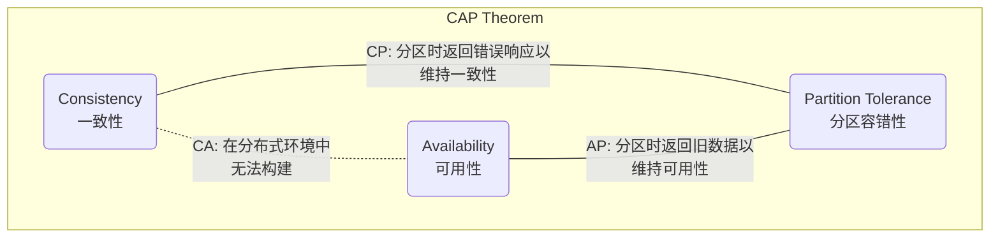
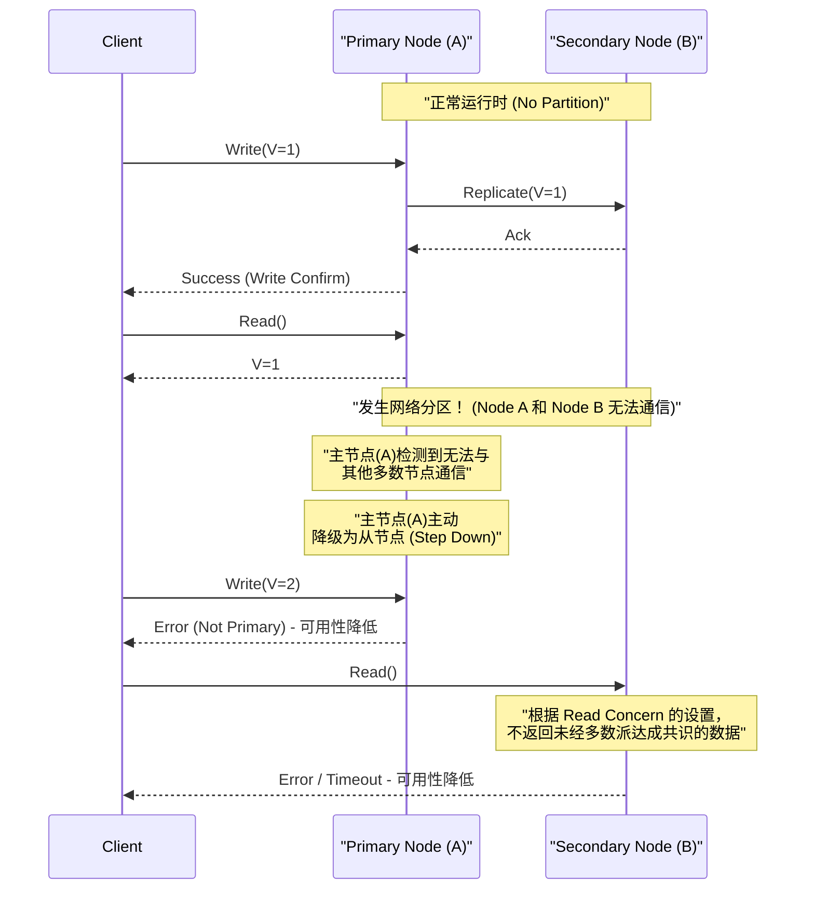
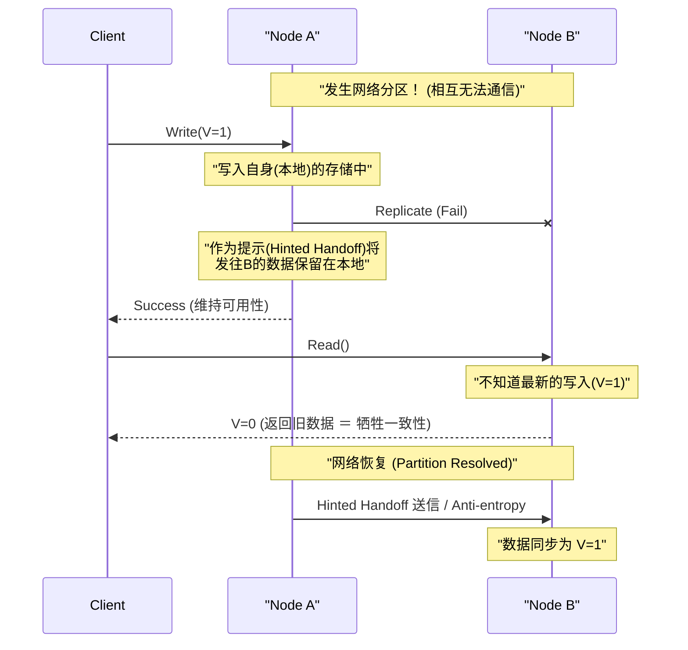

# CAP定理与分布式系统（一致性、可用性、分区容错性的权衡）

在现代Web服务和企业应用程序中， **分布式系统** (Distributed Systems) 已成为不可或缺的要素。为了处理单一服务器无法承受的海量流量和数据，或者为了防止因服务器故障导致的服务中断，我们需要将多个节点（服务器）连接起来作为一个统一的系统运行。

然而，在设计分布式系统时，存在一个无法回避的绝对法则，那就是 **CAP定理** (CAP Theorem) 。本文将非常详细且全面地讲解作为分布式系统设计基础的CAP定理，从其定义、数学和逻辑背景、各数据库产品的处理方式，到现实世界中的折中方案 **PACELC定理** 。

## 1. CAP定理的历史与背景

CAP定理是由加州大学伯克利分校的计算机科学家埃里克·布鲁尔 (Eric Brewer) 于2000年在ACM PODC (Principles of Distributed Computing) 会议上提出的。最初，它是作为基于经验法则的“猜想 (Conjecture)”发表的，但在2002年，麻省理工学院 (MIT) 的赛斯·吉尔伯特 (Seth Gilbert) 和南希·林奇 (Nancy Lynch) 对其进行了数学证明，从而正式确立为“定理 (Theorem)”。

布鲁尔提出该定理的背景是20世纪90年代后期互联网的爆炸性普及。当时的架构师们试图将传统单节点关系型数据库 ([RDBMS](https://kenji.blog/zh-cn/p/rdbms-transaction-acid-isolation-level-lock/)) 所具备的 **[ACID](https://kenji.blog/zh-cn/p/rdbms-transaction-acid-isolation-level-lock/)特性** （原子性、一致性、隔离性、持久性）原封不动地保持在分布式环境中。然而人们逐渐发现，在节点地理位置分散、网络延迟和故障频繁发生的环境中，要在完全保持ACID特性的同时对系统进行扩展几乎是不可能的。

CAP定理从理论上证实了在分布式系统中“不可能做到尽善尽美”这一现实，成为迫使系统设计者进行 **权衡** （为了获得某种利益而牺牲另一种利益）的重要指导原则。

## 2. CAP三个要素的严格定义

CAP定理主张，“分布式系统在以下三种保证中，最多只能同时满足其中两项”。

*   **C (Consistency: 一致性)**
*   **A (Availability: 可用性)**
*   **P (Partition Tolerance: 分区容错性)**

首先，让我们在分布式系统的语境下，确认这三个特性的严格定义。

### 2.1. C: Consistency (一致性)

CAP定理中的 **一致性** ，是指“所有客户端都能始终读取到相同的最新数据，或者收到错误”的特性。在学术上，这接近于 **线性一致性** (Linearizability) 的概念。

在分布式系统中，为了提高可用性和性能，数据会被复制（Replication）到多个节点。在保证了一致性的系统中，如果对某个节点的数据更新写入刚刚完成，任何其他客户端试图从任何节点读取数据时，系统必须返回最新的更新结果，或者（如果由于同步未完成等原因无法返回最新数据）返回错误。

也就是说，系统整体需要表现得如同“只保存单一最新数据的单个节点”。绝不允许客户端读取到 **旧数据 (Stale Data)** 。

### 2.2. A: Availability (可用性)

CAP定理中的 **可用性** ，是指“所有未发生故障且正常运行的节点，必须在合理的时间内返回正常的响应（非错误响应）”的特性。

在保证了可用性的系统中，即使系统的一部分（特定节点或网络线路）发生故障，只要客户端能够访问存活的健康节点，系统就一定会返回数据（即使不能保证它是最新的）。面对客户端的合法请求，系统不允许以“内部不一致导致无法响应”为由返回错误，也不允许让客户端无限期地等待超时。系统被要求必须始终返回“某种答案”。

### 2.3. P: Partition Tolerance (分区容错性)

CAP定理中的 **分区容错性** ，是指“即使节点间的网络通信中断，导致系统分裂成多个无法通信的网络组（分区），整个系统（在各自被分割的网络内）仍能继续运行”的特性。

在现实的网络环境中，由于丢包、路由器故障、物理电缆断开或临时过载等原因，节点间的通信延迟或完全丢失是不可避免的。既然是分布式系统，网络分区就必须被当作 **不是例外而是日常可能发生的现象** 作为前提。因此，放弃P（分区容错性）而假设“网络绝对不会断开”的分布式系统，在现实中是不可能存在的。

## 3. 为什么不能同时满足三个特性？（证明与逻辑）

CAP定理断言，逻辑上不可能同时满足C、A和P。我们将通过一个易懂的逻辑模型来讲解吉尔伯特和林奇证明的本质。

请想象一个基于异步网络模型的简单分布式系统，如下所示：
*   系统由 **Node 1** 和 **Node 2** 两个数据节点组成。
*   初始状态下，某变量的值为 `V = 0` 。两个节点同步保存着这个值。

现在，假设发生了 **网络分区 (Partition)** 。连接 Node 1 和 Node 2 的通信路径完全断开，它们无法相互发送和接收消息（这正是测试分区容错性 P 的情况）。

在网络分区发生期间，某个客户端向 **Node 1** 发送了更新值的请求 `V = 1` 。Node 1 接收请求并将自身持有的数据 `V` 更新为 `1` 。但是，由于网络已断开，Node 1 无法向 Node 2 发送“已将V更新为1”的复制消息。

紧接着，另一个客户端向 **Node 2** 发送读取请求 `Read(V)` 。

此时，系统（Node 2）应该采取什么行动？系统设计者必须在以下两个选项中选择一个。

### 选项1: CP系统（优先保证一致性，牺牲可用性）

Node 2 无法得知自身持有的数据 `V = 0` 在整个系统中是否为最新（因为无法通过通信向 Node 1 确认）。如果此时轻易地返回 `0` ，就会返回比另一个客户端刚刚写入的最新值 `V = 1` 更旧的值，从而破坏系统的 **一致性 (C)** 。

为了严格遵守一致性，Node 2 只能判断“由于不确定自身数据是否为最新，因此无法响应”，并向客户端 **返回错误** ，或者在网络恢复前 **阻塞（超时）** 响应。
在返回错误的那一刻，系统未能返回正常响应，因此 **可用性 (A)** 丧失。

### 选项2: AP系统（优先保证可用性，牺牲一致性）

Node 2 必须不向客户端返回错误，而是必须返回某种正常的响应（为了保护可用性 A）。Node 2 目前能返回的数据只有自身持有的旧值 `V = 0` 。

如果 Node 2 返回 `0` ，客户端就能获得正常的响应，从而保持了 **可用性 (A)** 。但是，由于返回的是与 Node 1 中已写入的最新值 `V = 1` 相矛盾的旧值，因此系统的 **一致性 (C)** 丧失。

---

通过这种方式可以看出，在发生了网络分区 (P) 这种物理限制的情况下，作为逻辑必然，系统 **必须在一致性 (C) 和可用性 (A) 之间牺牲其中之一** 。这就是CAP定理的核心。



人们经常使用“CA系统（兼顾一致性和可用性，但不具备分区容错性的系统）”这个词，但这指的是在单节点上运行的传统 [RDBMS](https://kenji.blog/zh-cn/p/rdbms-transaction-acid-isolation-level-lock/) 等。由于不存在通过网络进行的节点间协作，因此根本不会产生网络分区的概念。所以， **在真正的分布式系统中，不存在 CA 这个选项，实际上只能在 CP 或 AP 中二选一** 。

## 4. CP系统和AP系统的实例与详细行为

根据系统优先选择CAP定理中的哪一种特性，数据库产品的架构及其在网络分区时的行为将完全不同。在这里，我们将结合序列图，深入探讨CP系统和AP系统的代表性产品及其具体行为。

### 4.1. CP系统 (Consistency and Partition Tolerance)

CP系统是一种在发生网络分区时 **绝对优先考虑一致性** ，为了避免数据不一致的风险（例如脑裂现象等），而 **部分或完全停止（牺牲）系统的可用性** 的架构。

**代表性数据存储:**
*   HBase
*   [MongoDB](https://kenji.blog/zh-cn/p/nosql-database-selection-kvs-document-graph-wide-column/)
*   [Redis](https://kenji.blog/zh-cn/p/nosql-database-selection-kvs-document-graph-wide-column/) Cluster (根据配置)
*   Etcd, Zookeeper (严格来说是使用分布式共识算法的系统)
*   Google Cloud Spanner (后文会提到，但本质上它是CP)

在银行账户余额管理、电商网站库存管理、支付系统等业务场景中，读取旧数据做出错误判断是绝对不可接受的（这会直接导致金钱损失或致命的逻辑错误），因此会选择这种系统。

**CP系统在网络分区时的行为（以MongoDB的Replica Set为例）:**

MongoDB会构建一个由1个 **主节点 (Primary)** 和多个 **从节点 (Secondary)** 组成的副本集。默认情况下，所有的读写操作都在主节点上进行，以保持一致性。



假设发生了网络分区，一个5台节点的集群被分割成“2台（包含当前主节点）”和“3台”两个组。此时，当前主节点所在的2台节点的组失去了多数派（Majority）的地位。
作为CP系统的[MongoDB](https://kenji.blog/zh-cn/p/nosql-database-selection-kvs-document-graph-wide-column/)，为了防止数据不一致，会自动将留在少数派组中的主节点降级 (Step Down) 为从节点。然后，在拥有多数派的3台节点的组中，会运行新的领导者选举算法 (如Raft)，选出新的主节点。
在这个领导者选举进行的几秒到几十秒期间，或者对于分区未能解决的少数派组来说，系统的写入操作（根据配置，也可能包括读取操作）将返回错误， **可用性降低** 。然而，这可以防止同时出现两个主节点并各自接受写入的状态，从而 **强有力地保持了一致性** 。

### 4.2. AP系统 (Availability and Partition Tolerance)

AP系统是一种在发生网络分区时 **优先考虑可用性** ，始终持续提供系统访问（读写）的架构。其代价是，会暂时出现节点间数据未同步的状态（读取到旧数据或发生更新冲突），从而 **牺牲了一致性** 。

**代表性数据存储:**
*   Apache [Cassandra](https://kenji.blog/zh-cn/p/nosql-database-selection-kvs-document-graph-wide-column/)
*   Amazon DynamoDB
*   Riak
*   Couchbase

在SNS的时间线显示、用户行为日志收集、购物网站的商品评价和推荐功能等业务场景中，“即便不是最新数据也无妨，但无论如何页面必须快速显示（系统不能停止）”在商业上是极其重要的，因此会选择这种系统。

**AP系统在网络分区时的行为（以Cassandra为例）:**

Cassandra采用了没有特定领导者（Master）的 **无主 (Leaderless) 架构** 。以环状配置的所有节点都能平等地接收读写请求。



假设发生了网络分区，Node A 和 Node B 无法通信。在这种状态下，如果客户端向 Node A 写入数据，Node A 会（根据一致性级别的配置）仅将数据写入其本地磁盘，并立即向客户端返回“写入成功”（高可用性）。虽然向 Node B 的复制失败了，但 Node A 会暂时记住这一事实 (Hinted Handoff)。

紧接着，另一个客户端从 Node B 读取数据，由于 Node B 尚未接收到在 Node A 上进行的最新更新，因此它会若无其事地返回自己持有的旧数据。这就是 **一致性被牺牲的状态** 。

但是，当网络恢复时，Node A 会将记住的更新数据发送给 Node B，在后台同步数据。这被称为 **最终一致性 (Eventual Consistency)** 。

## 5. 深入探讨最终一致性 (Eventual Consistency)

在AP系统中，“牺牲一致性”并不意味着数据会永远处于不一致的状态。最终一致性是指“如果一段时间内没有对系统进行新的更新，那么 **最终 (Eventually)** 所有副本的值都将达到一致，收敛到保持一致性的状态”的保证。

在以最终一致性为前提的分布式系统（具备 **BASE特性**: Basically Available, Soft state, Eventual consistency 的系统）中，开发者在设计应用程序时必须考虑到“可能会读取到旧数据”以及“如果在多个节点上同时进行了不同的更新，数据将会发生冲突 (Conflict)”。

### 5.1. 数据冲突 (Conflict) 的解决策略

在网络分区期间，或者由于网络延迟，在不同的节点上同时发生对同一个键的更新时，系统或应用程序必须决定以哪个更新为准，或者如何进行合并。

1.  **LWW (Last Write Wins: 最后写入者优先):**
    对于每个更新请求，客户端或节点端都会附加一个时间戳。发生冲突时，简单地 **以时间戳最新的更新为准，丢弃（覆盖）旧的更新** 。在[Cassandra](https://kenji.blog/zh-cn/p/nosql-database-selection-kvs-document-graph-wide-column/)等数据库中常作为默认策略使用。
    *优点*: 系统端可以自动解决冲突，实现简单。
    *缺点*: 由于客户端之间的时钟偏差 (Clock Skew) ，可能会导致意外覆盖数据，并且必须容忍一方的更新完全丢失（Lost）。

2.  **向量时钟 (Vector Clocks):**
    以列表形式保留每个节点上的更新历史记录（版本信息），以严格追踪更新的因果关系 (Causality)。当系统检测到无法自动解决的冲突（在毫无因果关系的状态下完全同时进行的更新）时，系统不会擅自覆盖数据，而是 **将多个冲突的版本 (Siblings) 原样保存** 。然后，当下一次客户端读取数据时，将返回所有这些多个版本，并 **由应用程序端的逻辑（或人类用户）来解决（合并）冲突**。这是在Amazon Dynamo等系统中采用的强大技术。
    *优点*: 可以防止数据丢失。
    *缺点*: 应用程序端的实现会变得复杂。

3.  **CRDT (Conflict-free Replicated Data Type: 无冲突复制数据类型):**
    通过赋予数据结构本身的数学特性（交换律、结合律、幂等性），这是一种 **经过特殊设计，即使发生网络延迟或消息顺序颠倒，也一定能最终收敛到相同状态的数据类型** 。
    例如，它常用于分布式计数器、仅追加集合 (Grow-only Set)、文本协同编辑算法等。在Riak或[Redis](https://kenji.blog/zh-cn/p/nosql-database-selection-kvs-document-graph-wide-column/) Enterprise的模块中得到了支持。

### 5.2. 应用程序端的控制示例（类似向量时钟的冲突解决）

在AP系统中，以下展示了在应用程序端检测并适当解决数据冲突的伪代码 (Python风格)。这里以添加商品到购物车为例。

```python
import time

def update_shopping_cart(user_id, new_item, database):
    """
    向购物车添加商品的函数。
    假设使用的是具有最终一致性的数据库，进行乐观锁和冲突解决。
    """
    max_retries = 3
    
    for attempt in range(max_retries):
        try:
            # 1. 从数据库中获取当前的购物车数据和版本(如向量时钟等)
            result = database.read(user_id)
            cart_data_list = result.data  # 可能返回多个冲突版本(Siblings)的列表
            version_context = result.context # 更新时所需的版本信息
            
            # 2. 当返回多个冲突版本时(发生Conflict时)的解决逻辑
            resolved_cart = resolve_conflict(cart_data_list)
            
            # 3. 将新商品添加到已解决冲突的购物车数据中
            if new_item not in resolved_cart:
                resolved_cart.append(new_item)
            
            # 4. 附加上版本上下文并写入数据库 (Optimistic Locking)
            # DB端会验证提供的context是否与DB端最新的context一致
            success = database.write(user_id, resolved_cart, version_context)
            
            if success:
                print("购物车更新成功。")
                return True
            else:
                # 因版本不一致导致写入失败(其他客户端抢先更新了)
                print(f"因版本冲突写入失败。重试中... (Attempt {attempt + 1})")
                continue # 在下一次循环中从重新读取开始重试
                
        except NetworkException:
            # 发生网络错误时进行重试
            print(f"网络错误。重试中... (Attempt {attempt + 1})")
            time.sleep(1 * (attempt + 1)) # 指数退避策略
            
    raise Exception("经过多次重试，购物车更新仍然失败。")

def resolve_conflict(conflicting_carts):
    """
    冲突解决逻辑。
    在这个例子中，通过合并(取并集)所有购物车的内容来防止商品丢失。
    根据业务需求，可能会变更为"优先采用具有最新时间戳的商品"等逻辑。
    """
    merged_cart = set()
    for cart in conflicting_carts:
        for item in cart:
            merged_cart.add(item)
    return list(merged_cart)
```
如上所示，作为选择AP系统以获取高可用性的代价，开发者负责在应用程序代码中妥善实现“重试处理”、“乐观锁 (Optimistic Locking)”以及“基于业务逻辑的冲突解决 (Merge)”。

## 6. 从CAP到PACELC：正常情况下的权衡

CAP定理定义了“在发生网络分区的 **异常情况** 下系统将如何表现”这种某种极端状态下的情况。然而，在现实系统的运行中，网络完全分区（虽然是应该设想的风险）并不是每时每刻都在发生的。

因此，当时在耶鲁大学的丹尼尔·阿巴迪 (Daniel Abadi) 于2010年提出了 **PACELC定理** 。它是CAP定理的扩展，将“不仅仅是网络分区时，还包括 **正常情况（网络正常工作时）的权衡** ”也纳入其中，是一个更具实用性的模型。

**PACELC** 是以下首字母的缩写：

*   当发生 **P**artition (网络分区) 时，
*   在 **A**vailability (可用性) 和 **C**onsistency (一致性) 之间进行选择 (这部分与CAP定理相同)。
*   在 **E**lse (其他正常情况，网络正常时)，
*   在 **L**atency (延迟/响应速度) 和 **C**onsistency (一致性) 之间进行选择。

在正常情况下，如果试图严格保持数据的 **一致性 (C)** ，就必须在向节点发出写入请求后，等待其他多个节点的复制（同步）完成，然后再向客户端返回完成响应。这种“等待网络通信往返的时间”就成了额外开销，从而导致系统的 **延迟 (L)** 恶化（变慢）。

相反，如果试图将系统的 **延迟 (L)** 降低（加快）到极限，就会设计成在本地节点接收到客户端的写入请求的瞬间立即返回完成响应，而向其他节点的复制则在后台异步进行。在这种情况下，响应会非常快，但在复制完成之前的几毫秒到几秒之间，节点间会出现数据不一致的状态，从而损害了 **一致性 (C)** 。

如果用PACELC定理对现代分布式数据库进行分类，可分为以下4种模式：

1.  **PC/EC (分区时优先一致性，正常时也优先一致性):**
    例如：VoltDB, CockroachDB。在任何情况下都保证强一致性 ([ACID](https://kenji.blog/zh-cn/p/rdbms-transaction-acid-isolation-level-lock/))。其代价是，即使在正常情况下也必须进行节点间的同步通信，因此容易受到延迟的影响，在网络延迟较大的环境（如多区域）中性能会下降。
2.  **PC/EL (分区时优先一致性，正常时优先延迟):**
    例如：[MongoDB](https://kenji.blog/zh-cn/p/nosql-database-selection-kvs-document-graph-wide-column/) (默认设置), MySQL的异步复制。在分区等异常情况下，即使停止系统也要防止数据损坏（脑裂），但在正常情况下重视性能（读写速度），允许因复制延迟而导致暂时读取到旧数据。
3.  **PA/EL (分区时优先可用性，正常时也优先延迟):**
    例如：[Cassandra](https://kenji.blog/zh-cn/p/nosql-database-selection-kvs-document-graph-wide-column/), Amazon DynamoDB, Riak。在任何时候都不会停止系统，并追求最快的响应速度。这是完全接受最终一致性，专门用于横向扩展和高可用性的架构。
4.  **PA/EC (分区时优先可用性，正常时优先一致性):**
    由于这种设计在异常情况下宁可数据不一致也要保持系统运行，但在正常情况下却偏偏要牺牲延迟来保证一致性，设计上自相矛盾，因此作为实用的数据库，几乎没有采用这种方法的。

## 7. 现代数据库中一致性的调优 (Tunable Consistency)

通过到此为止的讲解，您可能会有“每个数据库产品固定是CP或AP”的印象，但现代许多成熟的[NoSQL](https://kenji.blog/zh-cn/p/nosql-database-selection-kvs-document-graph-wide-column/)数据库（如Cassandra, DynamoDB, Cosmos DB等）都提供了 **允许开发者在查询级别或会话级别灵活设置（调优）“一致性级别”** 的功能，即 **Tunable Consistency** 。

### 7.1. 使用 Quorum (法定人数) 进行控制

以Cassandra等为例，数据一致性是通过以下变量之间的平衡来控制的：

*   **N:** 复制数据的副本节点总数 (Replication Factor)
*   **W:** 写入时，同步等待写入完成的Ack（确认响应）的节点数 (Write Consistency Level)
*   **R:** 读取时，查询数据并进行多数表决的节点数 (Read Consistency Level)

在这里，只要设置为满足以下公式，被读取的节点群 (R) 中，就必定包含至少1个拥有最新写入数据的节点 (W)，从而能够保证 **强一致性 (Strong Consistency)** 。

`W + R > N`

**设置示例变体:**

*   **重视强一致性 (Quorum Read/Write):** `W = Quorum`, `R = Quorum`
    (例如：如果是3节点架构，则 N=3, W=2, R=2。写入和读取都等待过半数节点的响应。始终保证最新数据，但延迟中等。)
*   **重视写入延迟 (偏AP・最终一致性):** `W = 1`, `R = All`
    (只要写入1台节点就视为完成，因此写入极快。但是，读取时必须查询所有节点以寻找最新的时间戳，因此读取较慢。)
*   **重视读取延迟 (偏AP・最终一致性):** `W = All`, `R = 1`
    (因为要等待写入所有节点完成，所以写入较慢。但是，因为保证了无论从哪个节点读取必定是最新数据，所以读取时只需查询1台节点，速度极快。)
*   **追求极限可用性和延迟 (PA/EL):** `W = 1`, `R = 1`
    (写入和读取都只在最近的1台节点完成。最快且最不易宕机，但读取到旧数据的概率最高。)

这样一来，开发者不必固定系统整体的架构，而是可以根据业务需求动态调整这个 W 和 R 的值。比如“用户的计费数据绝对需要强一致性 (W=Quorum, R=Quorum)”、“Web网站的访问日志稍微丢失一点也没关系，写入速度优先 (W=1)”等，在同一个数据库集群内，可以根据处理数据的性质，由开发者自行操作 **CAP/PACELC 权衡的滑动条** 。

### 7.2. Google Cloud Spanner 打破了CAP定理吗？

近年来，有时会听到“Google Cloud Spanner 是一种在拥有高可用性的同时，还能在全球范围内保证强一致性 (External Consistency) 的数据库，它克服了CAP定理”这样的说法。

但是，正如Spanner的开发者埃里克·布鲁尔亲自在论文中所述， **Spanner并没有打破CAP定理。严格来说，它被归类为“CP系统”。**

Spanner的革命性在于，它利用了结合GPS和原子钟的 **TrueTime API** 这种硬件辅助基础设施，将整个分布式系统的“时间偏差 (Clock Uncertainty)”严格控制在几毫秒的范围内。这使得即使在全球分布的节点之间，也能准确确定事务的顺序。

因为Spanner运行在Google极其坚固且冗余的私有网络上，在现实世界中，“发生网络分区 (P) 从而必须牺牲可用性 (A) 的情况”发生的概率被无限接近于零（实现了5个9以上的可用性）。如果真的发生了地球规模的大型物理网络断开，Spanner的设计也是为了保护一致性而停止可用性（即返回错误）。

## 8. 分布式系统设计中的最佳实践与总结

CAP定理以及PACELC定理，是在设计和选择分布式系统时，让人不得不面对“没有任何东西在所有方面都是完美的万能银弹”这一严酷的物理和逻辑现实的法则。

*   网络分区 (P) 在现实的网络中是不可避免的。
*   发生分区时，必须在维持一致性 (C) 而停止系统，或维持可用性 (A) 而容忍数据不一致之间做出选择。
*   正如PACELC定理所表明的，即使在正常情况下，也存在试图提高一致性 (C) 就会牺牲延迟 (L) ，而试图降低延迟就会牺牲一致性的权衡。

架构师或软件工程师绝不能仅仅因为“流行”或“基准测试分数高”等理由来选择数据库。最重要的是要深入推敲： **“在我们构建的系统中，发生故障时最糟糕的场景，是数据不一致，还是服务完全停止导致用户什么也做不了？”**

如果是金融交易，毫无疑问应该选择CP系统（或[RDBMS](https://kenji.blog/zh-cn/p/rdbms-transaction-acid-isolation-level-lock/)）并保证强一致性。另一方面，如果是全球范围的SNS服务，则应该选择AP系统，即使接受最终一致性，也要追求全天候的高可用性和低延迟。

而且在多数情况下，不能完全依赖基础设施或数据库产品的功能。在数据库以AP系统运行的前提下，通过应用程序端的实现模式（重试处理、保证幂等性、补偿事务 (如Saga模式等)、冲突解决逻辑）来巧妙弥补基础设施的缺点和数据的不一致，这种 **“容错（Fail-Safe）设计能力”** 才是构建现代坚固分布式系统的最大关键。
