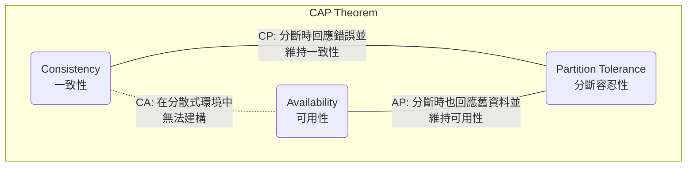
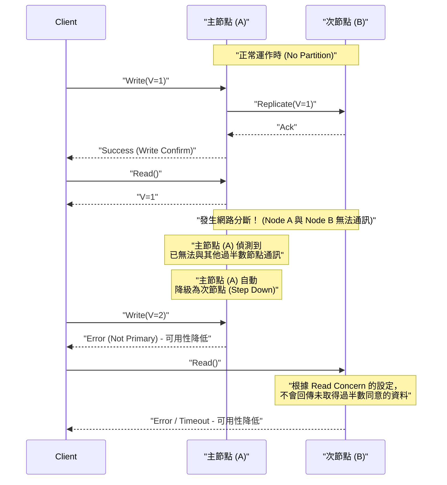
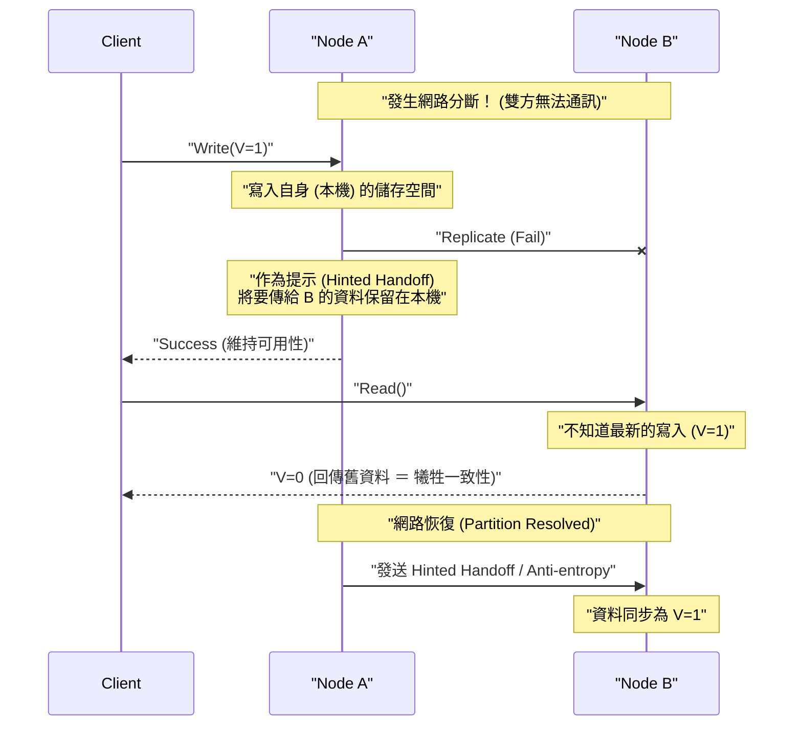

# CAP 定理與分散式系統（一致性、可用性、分斷容忍性的權衡）

在現代的 Web 服務與企業級應用程式中， **分散式系統** (Distributed Systems) 已成為不可或缺的元素。為了處理單一伺服器無法應付的龐大流量與資料，或是為了防止伺服器故障導致服務中斷，會讓多個節點（伺服器）協同運作，作為單一個系統來執行。

然而，在設計分散式系統時，存在著無法避開的絕對法則。這就是 **CAP 定理** (CAP Theorem)。本文將針對分散式系統設計基礎的 CAP 定理，從其定義、數學與邏輯背景、各個資料庫產品的策略，到現實世界中的妥協點 **PACELC 定理** ，進行非常詳細且全面的解說。

## 1. CAP 定理的歷史與背景

CAP 定理是由加州大學柏克萊分校的電腦科學家埃里克·布魯爾 (Eric Brewer) 於 2000 年舉辦的 ACM PODC (Principles of Distributed Computing) 研討會中所提出。最初是作為基於經驗法則的「猜想 (Conjecture)」發表，但在 2002 年由麻省理工學院 (MIT) 的賽斯·吉爾伯特 (Seth Gilbert) 與南西·林奇 (Nancy Lynch) 在數學上證明，並正式確立為「定理 (Theorem)」。

布魯爾提出這個定理的背景，是因為 1990 年代後半網際網路的爆發性普及。當時的架構師們試圖在分散式環境中，維持傳統在單一節點上運作的關聯式資料庫 ([RDBMS](https://kenji.blog/zh-tw/p/rdbms-transaction-acid-isolation-level-lock/)) 所具備的 **[ACID](https://kenji.blog/zh-tw/p/rdbms-transaction-acid-isolation-level-lock/) 特性** （原子性、一致性、隔離性、耐久性）。然而，在節點地理位置分散、網路延遲與故障成為日常的環境下，人們發現要在完全維持 ACID 特性的同時擴展系統，幾乎是不可能的。

CAP 定理在理論上證實了分散式系統中「無法讓所有事情都完美」的現實，成為迫使系統設計者進行 **權衡** （為了獲得某些東西而犧牲另一些東西）的重要指導原則。

## 2. CAP 的 3 個要素的嚴格定義

CAP 定理主張：「分散式系統在以下的 3 種保證中，同時最多只能滿足 2 種」。

*   **C (Consistency: 一致性)**
*   **A (Availability: 可用性)**
*   **P (Partition Tolerance: 分斷容忍性)**

首先，我們來確認這 3 個特性在分散式系統脈絡中的嚴格定義。

### 2.1. C: Consistency (一致性)

在 CAP 定理中， **一致性** 是指「所有的客戶端，總是能夠讀取到相同的最新資料，否則就會收到錯誤」的特性。在學術上這是一個接近 **線性化可能性** (Linearizability) 的概念。

在分散式系統中，為了提升可用性與效能，資料會被複製（Replication）到多個節點上。在保證一致性的系統中，當對某個節點的資料更新寫入完成後，若另一個客戶端試圖從任何節點讀取資料，系統必定會回傳該次最新的更新結果，或者（若因為尚未同步等原因無法回傳最新資料時）回傳錯誤。

換句話說，系統整體被要求表現得彷彿是「只持有一份最新資料的單一節點」。絕對不允許客戶端讀取到 **舊資料 (Stale Data)** 。

### 2.2. A: Availability (可用性)

在 CAP 定理中， **可用性** 是指「所有未發生故障且正在運作的節點，必定會在合理的時間內回傳正常的（非錯誤的）回應」的特性。

在保證可用性的系統中，即使系統的一部分（特定節點或網路線路）發生故障，只要客戶端能連線到仍然存活的健康節點，系統就必定會回傳資料（即便不保證是最新資料）。對於客戶端合法發送的請求，不允許系統以「內部不一致無法回應」為由回傳錯誤，或是讓客戶端無限期等待超時。系統被要求總是必須回傳「某種答案」。

### 2.3. P: Partition Tolerance (分斷容忍性)

在 CAP 定理中， **分斷容忍性** 是指「即使節點間的網路通訊中斷，導致系統被分割成多個無法通訊的網路群組（分區），系統整體而言（在各自被分割的網路內）仍能繼續運作」的特性。

在現實的網路環境中，因為封包遺失、路由器故障、實體纜線斷裂或是暫時性的負載過重等原因，節點間的通訊延遲或完全中斷是無法避免的。既然是分散式系統，就必須將網路分斷視為 **不是例外，而是日常可能發生的現象** 。因此，放棄 P（分斷容忍性）而假設「網路絕對不會斷線」的分散式系統，在現實中是不可能存在的。

## 3. 為什麼無法同時滿足 3 個要素？（證明與邏輯）

CAP 定理主張同時滿足 C、A、P 三者在邏輯上是不可能的。我們用容易理解的邏輯模型，來解說吉爾伯特與林奇所作證明的精髓。

請想像一個基於非同步網路模型、非常簡單的分散式系統：
*   系統由 **Node 1** 與 **Node 2** 這兩個資料節點所組成。
*   作為初始狀態，某個變數的值為 `V = 0`。兩個節點都同步持有這個值。

那麼，假設此時發生了 **網路分斷 (Partition)** 。連接 Node 1 與 Node 2 的通訊路徑完全斷開，雙方無法互傳訊息（這是在測試分斷容忍性 P 的情況）。

在這個網路分斷發生的期間，某個客戶端向 **Node 1** 發送了更新變數為 `V = 1` 的請求。Node 1 接收到請求後，將自身持有的資料 `V` 更新為 `1`。然而，因為網路已斷線，Node 1 無法向 Node 2 傳送「已將 V 更新為 1」的複製訊息。

緊接著，另一個客戶端向 **Node 2** 發送了讀取請求 `Read(V)`。

此時，系統（Node 2）應該採取什麼樣的行動呢？系統設計者必須從以下的兩個選項中擇一。

### 選項 1: CP 系統（優先考慮一致性，犧牲可用性）

Node 2 無法得知自身持有的資料 `V = 0` 是否為整個系統中的最新值（因為無法通訊，所以無法向 Node 1 詢問）。如果此時輕易地回傳 `0`，就會回傳比其他客戶端剛才寫入的最新值 `V = 1` 還舊的資料，進而破壞系統的 **一致性 (C)** 。

為了嚴格守護一致性，Node 2 只能判斷「無法確定自身資料是否為最新，因此無法回應」，並向客戶端 **回傳錯誤** ，或是 **阻斷（超時）** 回應直到網路恢復為止。
而在回傳錯誤的瞬間，因為系統無法回傳正常回應， **可用性 (A)** 就隨之喪失。

### 選項 2: AP 系統（優先考慮可用性，犧牲一致性）

Node 2 必須不對客戶端回傳錯誤，而是一定要給出某種正常的回應（為了守護可用性 A）。Node 2 目前能回傳的資料，就只有自身持有的舊數值 `V = 0`。

如果 Node 2 回傳 `0`，客戶端就能得到正常回應，維持了 **可用性 (A)** 。但是，這與 Node 1 已經寫入的最新值 `V = 1` 產生了矛盾，因為回傳了舊資料，系統的 **一致性 (C)** 也就喪失了。

---

像這樣，在網路分斷 (P) 這個物理限制發生的情況下，系統基於邏輯必然性， **必定要在一致性 (C) 與可用性 (A) 之間犧牲其中一項** 。這就是 CAP 定理的核心。



經常會有人使用「CA 系統（兼具一致性與可用性，不具備分斷容忍性的系統）」這樣的詞彙，但這通常是指在單一節點上運作的傳統 [RDBMS](https://kenji.blog/zh-tw/p/rdbms-transaction-acid-isolation-level-lock/) 等。因為不存在透過網路進行的節點間協作，所以一開始就不會有網路分斷的概念。因此， **在真正的分散式系統中，並不存在 CA 這個選項，實際上只有 CP 或 AP 二選一** 。

## 4. CP 系統與 AP 系統的實例與詳細行為

根據系統優先考慮 CAP 定理中的哪項特性，資料庫產品的架構與發生網路分斷時的行為會完全不同。在此我們將透過循序圖，深入探討 CP 系統與 AP 系統的代表性產品及其具體行為。

### 4.1. CP 系統 (Consistency and Partition Tolerance)

CP 系統在發生網路分斷時，會 **絕對優先考慮一致性** ，為了避免資料不一致的風險（如腦裂現象 Split-Brain 等），會選擇部分或是完全 **停止（犧牲）系統的可用性** 的架構。

**代表性的資料儲存系統：**
*   HBase
*   [MongoDB](https://kenji.blog/zh-tw/p/nosql-database-selection-kvs-document-graph-wide-column/)
*   [Redis](https://kenji.blog/zh-tw/p/nosql-database-selection-kvs-document-graph-wide-column/) Cluster (取決於設定)
*   Etcd, Zookeeper (嚴格來說是使用分散式共識演算法的系統)
*   Google Cloud Spanner (後文會提到，它本質上是 CP 系統)

在銀行帳戶餘額管理、電商網站庫存管理、支付系統等，不允許因為讀取到舊資料而做出錯誤判斷（會直接導致金錢損失或致命邏輯錯誤）的使用情境中，會選擇此類系統。

**CP 系統在網路分斷時的行為（以 MongoDB 的 Replica Set 為例）：**

MongoDB 會建構出一個由 1 個 **主節點 (Primary)** 與多個 **次節點 (Secondary)** 組成的副本集。預設情況下，所有的讀寫操作都會針對主節點進行，以保持一致性。



假設發生了網路分斷，將一個 5 台節點構成的叢集分割成了「2 台（包含目前的主節點）」與「3 台」兩個群組。此時，目前的主節點所在的 2 台群組已經失去了過半數（Majority）的地位。
作為 CP 系統的 [MongoDB](https://kenji.blog/zh-tw/p/nosql-database-selection-kvs-document-graph-wide-column/)，為了防止資料不一致，會將被留在少數派群組中的主節點自動降級 (Step Down) 為次節點。接著，在擁有多數派的 3 台群組中，會啟動新的領導者選舉演算法 (如 Raft 等)，並選出新的主節點。
在這個進行領導者選舉的數秒到數十秒之間，或是針對無法解決分斷的少數派群組，對系統的寫入（根據設定也可能包含讀取）將會變成錯誤， **可用性會降低** 。但是，這能防止同時存在 2 個主節點並接受各自寫入的狀態，從而 **強烈地保持了一致性** 。

### 4.2. AP 系統 (Availability and Partition Tolerance)

AP 系統在發生網路分斷時，即使如此也會 **將可用性放在第一位** ，是持續提供系統存取（讀寫）的架構。作為代價，會發生節點間資料暫時未同步的狀態（讀取到舊資料或發生更新衝突），使得 **一致性遭到犧牲** 。

**代表性的資料儲存系統：**
*   Apache [Cassandra](https://kenji.blog/zh-tw/p/nosql-database-selection-kvs-document-graph-wide-column/)
*   Amazon DynamoDB
*   Riak
*   Couchbase

在 SNS 的時間軸顯示、使用者行為日誌收集、購物網站的商品評價或推薦功能等，「不一定是最新資料也沒關係，總之最重要的是畫面能快速顯示（系統不中斷）」這種在商業上極為重要的使用情境中，會選擇此類系統。

**AP 系統在網路分斷時的行為（以 Cassandra 為例）：**

Cassandra 採用了不具備特定領導者（Master）的 **無主 (Leaderless) 架構** 。配置成環狀的所有節點，都能平等地接受讀寫請求。



假設發生了網路分斷，Node A 與 Node B 無法通訊。在這種狀態下，如果客戶端向 Node A 進行寫入，Node A（視一致性級別的設定而定）只會將資料寫入自身的本機磁碟，並立刻向客戶端回傳「寫入成功」（高可用性）。雖然往 Node B 的複製會失敗，但 Node A 會暫時記住這個事實 (Hinted Handoff)。

緊接著，當另一個客戶端從 Node B 讀取資料時，因為 Node B 尚未接收到在 Node A 所進行的最新更新，所以會泰然自若地回傳自身持有的舊資料。這就是 **一致性被犧牲的狀態** 。

不過，當網路恢復時，Node A 會將記住的更新資料發送給 Node B，並在背景將資料同步。這被稱為 **最終一致性 (Eventual Consistency)** 。

## 5. 深入探討最終一致性 (Eventual Consistency)

在 AP 系統中，雖然說「一致性被犧牲」，但並不代表資料會永遠維持四分五裂的狀態不管。最終一致性是指，「如果沒有對系統進行新的更新經過一段時間， **最終 (Eventually)** 所有副本的值將會一致，並收斂到保持一致性的狀態」的保證。

在以最終一致性為前提的分散式系統中（具備 **BASE 特性** : Basically Available, Soft state, Eventual consistency 的系統），開發者在設計應用程式時，必須考慮到「可能會讀取到舊資料」以及「多個節點同時發生不同更新時，資料會發生衝突 (Conflict)」的情況。

### 5.1. 資料衝突 (Conflict) 的解決策略

在網路分斷期間或因網路延遲，導致不同節點幾乎同時對相同的 Key 發生更新時，系統或應用程式必須決定要以哪一次的更新為準，或是該如何合併。

1.  **LWW (Last Write Wins: 最後寫入者勝出):**
    對於每個更新請求，由客戶端或節點端賦予時間戳記。如果發生衝突，就單純地 **以時間戳記最新的更新為準，並捨棄（覆寫）較舊的更新** 。這是 [Cassandra](https://kenji.blog/zh-tw/p/nosql-database-selection-kvs-document-graph-wide-column/) 等常用的預設方式。
    *優點*: 系統端能自動解決衝突，實作簡單。
    *缺點*: 會因為客戶端之間的時鐘誤差 (Clock Skew) 而有非預期的資料被覆寫風險，而且必須容忍其中一方的更新完全遺失（Lost）。

2.  **向量時鐘 (Vector Clocks):**
    以列表格式保留各個節點的更新歷史（版本資訊），嚴格追蹤更新的因果關係 (Causality)。當偵測到系統無法自動解決的衝突（完全同時、在沒有因果關係的狀態下進行的更新）時，系統不會擅自覆寫資料，而是 **原封不動地保存多個衝突的版本 (Siblings)** 。然後，在客戶端下次讀取資料時，將這些版本全部回傳，並 **將解決衝突（合併）的責任交給應用程式端的邏輯（或是人類使用者）** 。這是 Amazon Dynamo 等採用的一種強大手法。
    *優點*: 可以防止資料遺失。
    *缺點*: 應用程式端的實作會變得複雜。

3.  **CRDT (Conflict-free Replicated Data Type):**
    藉由讓資料結構本身具備數學特性（交換律、結合律、冪等性），即使發生網路延遲或訊息順序顛倒， **最終也必定會收斂成相同狀態的一種特殊設計的資料型態** 。
    例如，常用於分散式計數器、只能附加的集合 (Grow-only Set)、文字的協同編輯演算法等。在 Riak 或是 [Redis](https://kenji.blog/zh-tw/p/nosql-database-selection-kvs-document-graph-wide-column/) Enterprise 的模組中都有支援。

### 5.2. 應用程式端的控制範例（類似向量時鐘的衝突解決）

在 AP 系統中，應用程式端偵測資料衝突並妥善解決的虛擬程式碼 (類似 Python) 如下所示。這裡以購物車中新增商品為例。

```python
import time

def update_shopping_cart(user_id, new_item, database):
    """
    將商品加入購物車的函式。
    假設使用具備最終一致性的資料庫，並進行樂觀鎖與衝突解決。
    """
    max_retries = 3
    
    for attempt in range(max_retries):
        try:
            # 1. 從資料庫取得目前的購物車資料與版本 (例如向量時鐘等)
            result = database.read(user_id)
            cart_data_list = result.data  # 可能會回傳多個衝突版本 (Siblings) 的清單
            version_context = result.context # 更新時所需的版本資訊
            
            # 2. 回傳了多個衝突版本 (發生 Conflict 時) 的解決邏輯
            resolved_cart = resolve_conflict(cart_data_list)
            
            # 3. 將新商品加入解決後的購物車資料中
            if new_item not in resolved_cart:
                resolved_cart.append(new_item)
            
            # 4. 附上版本上下文 (Context) 並寫入資料庫 (樂觀鎖 Optimistic Locking)
            # 資料庫端會驗證所提供的 context 是否與資料庫端的最新 context 一致
            success = database.write(user_id, resolved_cart, version_context)
            
            if success:
                print("購物車更新成功。")
                return True
            else:
                # 因版本不一致導致寫入失敗 (其他客戶端已經先更新了)
                print(f"因版本衝突導致寫入失敗。正在重試... (Attempt {attempt + 1})")
                continue # 在下一次迴圈中從重新讀取開始重來
                
        except NetworkException:
            # 發生網路錯誤時重試
            print(f"網路錯誤。正在重試... (Attempt {attempt + 1})")
            time.sleep(1 * (attempt + 1)) # 指數退避 (Exponential Backoff)
            
    raise Exception("雖然重試了多次，但購物車依然更新失敗。")

def resolve_conflict(conflicting_carts):
    """
    衝突解決邏輯。
    在這個範例中，會將所有購物車的內容進行合併 (取聯集)，以防止商品遺失。
    依據商業需求，可以變更為「優先選擇最新時間戳記」等邏輯。
    """
    merged_cart = set()
    for cart in conflicting_carts:
        for item in cart:
            merged_cart.add(item)
    return list(merged_cart)
```
就像這樣，作為選擇 AP 系統獲得高可用性的代價，開發者負有在應用程式程式碼內妥善實作「重試處理」、「樂觀鎖 (Optimistic Locking)」以及「基於商業邏輯的衝突解決 (Merge)」的責任。

## 6. 從 CAP 到 PACELC：平時的權衡

CAP 定理定義的是「當網路分斷發生的 **異常時** ，系統將會如何表現」，這是一種極端狀況下的理論。然而，在現實系統的營運中，網路完全分斷（雖然是應該設想的風險）並不是時時刻刻都在發生。

因此，耶魯大學（當時）的丹尼爾·阿巴迪 (Daniel Abadi) 在 2010 年提出了 **PACELC 定理** 。這擴展了 CAP 定理，是一個不只考慮網路分斷時，還納入了「 **平時（網路運作正常時）的權衡** 」的更實用的模型。

**PACELC** 是以下字母的縮寫：

*   **P**artition 發生時 (發生網路分斷時) 要麼：
*   選擇 **A**vailability (可用性) 或 **C**onsistency (一致性) (這部分與 CAP 定理相同)。
*   **E**lse (其他平時狀況，網路正常時) 要麼：
*   選擇 **L**atency (延遲/回應速度) 或 **C**onsistency (一致性)。

在平時的狀況下，如果要嚴格保持資料的 **一致性 (C)** ，對於節點的寫入請求，就必須等待往其他多個節點的複製（同步）完成後，才能向客戶端回傳完成回應。這個「等待網路通訊往返的時間」將成為負擔，最終導致系統的 **延遲 (L)** 惡化（變慢）。

反過來說，如果要將系統的 **延遲 (L)** 降到極低（最快），設計上就會在本地節點接收到客戶端寫入請求的瞬間立刻回傳完成回應，而將往其他節點的複製放到背景非同步執行。在這種情況下，雖然回應極快，但在複製完成前的數毫秒到數秒間，會產生節點之間資料不一致的狀態，損害了 **一致性 (C)** 。

如果用 PACELC 定理將現代的分散式資料庫進行分類，會有以下 4 種模式：

1.  **PC/EC (分斷時優先考慮一致性，平時也優先考慮一致性):**
    例如: VoltDB, CockroachDB。在任何情況下都保證強一致性 ([ACID](https://kenji.blog/zh-tw/p/rdbms-transaction-acid-isolation-level-lock/))。作為代價，即使在平時也必須進行節點間的同步通訊，因此容易受延遲影響，在網路延遲較大（如多區域佈署等）的環境中效能會降低。
2.  **PC/EL (分斷時優先考慮一致性，平時優先考慮延遲):**
    例如: [MongoDB](https://kenji.blog/zh-tw/p/nosql-database-selection-kvs-document-graph-wide-column/) (預設設定), MySQL 的非同步複製。在分斷等異常狀況時，即使停機也要防止資料損壞（腦裂）；但在平時重視效能（讀寫速度），容許因為複製延遲而暫時讀取到舊資料。
3.  **PA/EL (分斷時優先考慮可用性，平時也優先考慮延遲):**
    例如: [Cassandra](https://kenji.blog/zh-tw/p/nosql-database-selection-kvs-document-graph-wide-column/), Amazon DynamoDB, Riak。在任何時候都不會停止系統，並追求最快的回應速度。完全接受最終一致性，是特化於橫向擴展與高可用性的架構。
4.  **PA/EC (分斷時優先考慮可用性，平時優先考慮一致性):**
    在異常時寧可讓資料不一致也要保持系統運作，但在平時卻特地犧牲延遲來確保一致性，這是自相矛盾的設計，因此幾乎沒有實用的資料庫會採取這種做法。

## 7. 現代資料庫中一致性的調校 (Tunable Consistency)

讀到這裡，可能有人會覺得「各個資料庫產品都被固定為 CP 或 AP」，但在現代許多成熟的 [NoSQL](https://kenji.blog/zh-tw/p/nosql-database-selection-kvs-document-graph-wide-column/) 資料庫中（例如 Cassandra, DynamoDB, Cosmos DB 等），多半會提供 **「讓開發者能夠以查詢或會話為單位，彈性設定（調校）一致性級別」** 的功能，也就是 **Tunable Consistency** 。

### 7.1. 使用 Quorum (法定人數) 的控制

以 Cassandra 為例，資料的一致性是透過以下變數之間的平衡來控制的。

*   **N:** 資料被複製的副本節點總數 (Replication Factor)
*   **W:** 寫入時，同步等待寫入完成的 Ack (確認回應) 的節點數 (Write Consistency Level)
*   **R:** 讀取時，進行查詢並取得多數決的節點數 (Read Consistency Level)

只要設定上滿足以下的數學式，讀取對象的節點群 (R) 當中，就必定會至少包含一個擁有最新寫入資料的節點 (W)，從而保證 **強一致性 (Strong Consistency)** 。

`W + R > N`

**設定範例的變化組合：**

*   **重視強一致性 (Quorum Read/Write):** `W = Quorum`, `R = Quorum`
    (例如: 若為 3 節點架構則 N=3, W=2, R=2。寫入與讀取都會等待過半數節點的回應。隨時保證拿到最新資料，但延遲中等。)
*   **重視寫入延遲 (偏 AP、最終一致性):** `W = 1`, `R = All`
    (只要寫入到 1 台節點的瞬間就算完成，因此寫入速度極快。但是讀取時必須向所有機器詢問以尋找最新的時間戳記，因此讀取很慢。)
*   **重視讀取延遲 (偏 AP、最終一致性):** `W = All`, `R = 1`
    (因為要等待全部機器寫入完成，所以寫入很慢。但是不管從哪台節點讀取都保證是最新資料，因此讀取時只需向 1 台機器詢問即可，速度極快。)
*   **重視極致可用性與延遲 (PA/EL):** `W = 1`, `R = 1`
    (寫入和讀取都只在距離最近的 1 台節點上完成。速度最快，也最不容易當機，但讀取到舊資料的機率最高。)

像這樣，開發者不必將整個系統的架構綁死，而是可以根據商業需求動態調整 W 與 R 的數值。例如「使用者的扣款資料絕對要強一致性 (W=Quorum, R=Quorum)」、「網站的存取日誌稍微遺失一點也沒關係，重視寫入速度 (W=1)」，也就是在同一個資料庫叢集內，根據處理資料的性質， **自行操作 CAP/PACELC 權衡的滑桿** 。

### 7.2. Google Cloud Spanner 打破了 CAP 定理嗎？

近年來，常有人說「Google Cloud Spanner 是一種兼具高可用性，同時又能在全球規模保證強一致性 (External Consistency) 的資料庫，它克服了 CAP 定理」。

然而，正如 Spanner 開發者埃里克·布魯爾自己在論文中所述， **Spanner 並沒有打破 CAP 定理。嚴格來說，它被分類為「CP 系統」。**

Spanner 劃時代的地方在於，它使用了結合 GPS 與原子鐘的 **TrueTime API** 這個硬體輔助基礎設施，將整個分散式系統的「時間誤差 (Clock Uncertainty)」嚴格控制在幾毫秒的範圍內。這樣一來，即使在分布全球的節點之間，也能準確決定交易的順序。

Spanner 因為是在 Google 極為堅固且具備冗餘架構的私有網路內運作，所以它只是將現實世界中「發生網路分斷 (P) 而必須犧牲可用性 (A) 的機率」降到無限接近於零（實現了五個九以上的可用性）而已。如果地球規模的大規模實體網路斷線真的發生了，Spanner 在設計上依然會為了保護一致性而停止可用性（也就是回傳錯誤）。

## 8. 分散式系統設計的最佳實踐與總結

CAP 定理與 PACELC 定理是在設計、選擇分散式系統時，向我們展示了「凡事沒有完美魔法銀彈」這樣嚴酷物理與邏輯現實的法則。

*   網路分斷 (P) 在現實網路中是不可避免的。
*   發生分斷時，必須選擇是要保護一致性 (C) 讓系統停止，還是保護可用性 (A) 容忍資料不一致。
*   誠如 PACELC 定理所指出的，即使在平時，要提高一致性 (C) 就會犧牲延遲 (L)，要降低延遲就會犧牲一致性，這樣的權衡永遠存在。

架構師與軟體工程師，絕不能單純因為「正在流行」、「基準測試分數高」等理由來選擇資料庫。最重要的是去深入評估： **「在我們所建構的系統中，當故障發生時，最糟糕的情況是資料不一致？還是服務完全停止讓使用者什麼都不能做？」** 

如果是金融交易，毫無疑問應該選擇 CP 系統（或是 [RDBMS](https://kenji.blog/zh-tw/p/rdbms-transaction-acid-isolation-level-lock/)），以擔保強一致性。另一方面，如果是全球性的 SNS 服務，則應該選擇 AP 系統，即使接受最終一致性也要追求 24 小時 365 天的高可用性與低延遲。

且在多數情況下，不能完全依賴基礎設施或資料庫產品的功能。在前提是資料庫作為 AP 系統運作之下，透過應用程式端的實作模式（重試處理、冪等性的擔保、補償交易 (例如 Saga 模式等)、衝突解決邏輯），去巧妙彌補基礎設施的缺點與資料不一致，這種 **「故障安全 (Fail-safe) 的設計能力」** ，才是建構出現代堅固分散式系統的最大關鍵。
