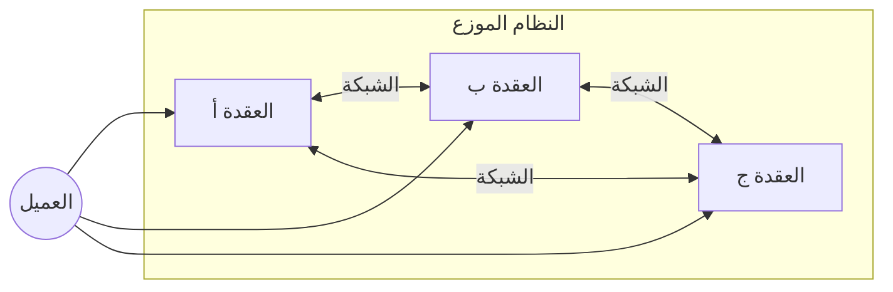
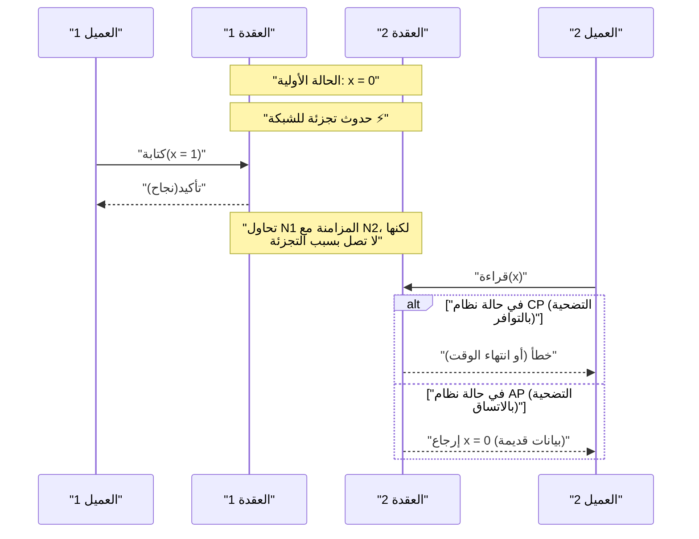
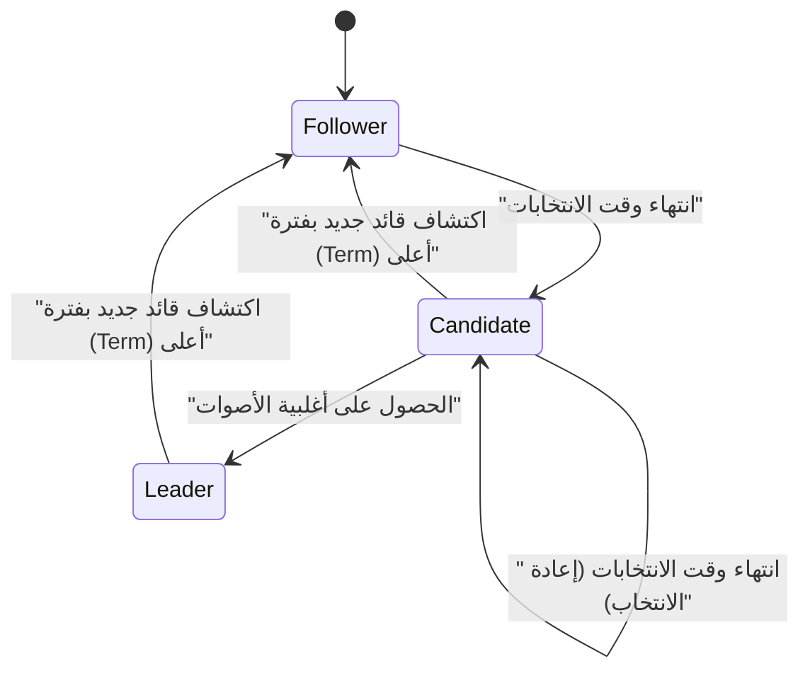

في بنية البرمجيات الحديثة، أصبح جعل الأنظمة موزعة متطلبًا لا يمكن تجنبه. مع انتشار الحوسبة السحابية، واعتماد بنية الخدمات المصغرة ([Microservices](https://kenji.blog/ar/p/microservices-architecture-bff-api-gateway/))، وزيادة الطلب على معالجة البيانات الضخمة، أصبح النهج السائد هو ربط العديد من الخوادم غير المكلفة (Scale-out) بدلاً من الاعتماد على خادم واحد قوي (Scale-up).

ومع ذلك، عند بناء وتشغيل الأنظمة الموزعة، يواجه المهندسون دائمًا خيارات صعبة. إنها المقايضة بين "اتساق البيانات" و "توافر النظام". **نظرية CAP** (CAP theorem) هي التي أثبتت هذه المعضلة الجوهرية رياضيًا وصاغتها.

في هذه المقالة، سنتعمق بشكل مفصل للغاية في أساسيات نظرية CAP وإثباتها، وكيف تتعامل قواعد البيانات الموزعة الحديثة مع هذه المعضلة، وصولاً إلى **نظرية PACELC** التي توسعت في نظرية CAP، وذلك من خلال المعادلات الرياضية، والرسوم البيانية، وأمثلة التنفيذ.

## 1. ما هو النظام الموزع؟

قبل التحدث عن نظرية CAP، دعونا نوضح أولاً ما هو **النظام الموزع** ([Distributed System](https://kenji.blog/ar/p/cap-theorem-distributed-systems-tradeoff/)).

النظام الموزع هو نظام يتكون من عدة أجهزة كمبيوتر (عقد) مستقلة متصلة ببعضها البعض عبر شبكة، وتتصرف كما لو كانت نظامًا واحدًا متسقًا من وجهة نظر المستخدم.



الأهداف الرئيسية للنظام الموزع هي كما يلي:

1. **قابلية التوسع** : عند زيادة حركة المرور أو حجم البيانات، يمكن تحسين قدرة المعالجة للنظام بأكمله عن طريق إضافة عقد.
2. **التوافر** : حتى إذا حدث فشل في بعض العقد، تستمر العقد الأخرى في المعالجة مما يجعل النظام بأكمله يستمر في تقديم الخدمة.
3. **الأداء** : بالنسبة للمستخدمين الموزعين جغرافيًا، تستجيب العقد القريبة فعليًا لتقليل زمن الانتقال.

ومع ذلك، نظرًا لأنه مبني على أساس غير مستقر مثل الشبكة، فإن النظام الموزع يرافقه دائمًا تحديات لا مفر منها مثل "تجزئة الشبكة" وتأخير/فقدان الرسائل.

## 2. العناصر الثلاثة لنظرية CAP

تم اقتراح نظرية CAP في عام 2000 من قبل إريك بروير (Eric Brewer)، وتم إثباتها بدقة في عام 2002 من قبل سيث جيلبرت (Seth Gilbert) ونانسي لينش (Nancy Lynch).

تؤكد النظرية أنه في النظام الموزع، من بين الخصائص الثلاث التالية، يمكن تلبية **اثنتين كحد أقصى** في نفس الوقت.

1. **C: [Consistency](https://kenji.blog/ar/p/cap-theorem-distributed-systems-tradeoff/)** (الاتساق)
2. **A: [Availability](https://kenji.blog/ar/p/cap-theorem-distributed-systems-tradeoff/)** (التوافر)
3. **P: [Partition Tolerance](https://kenji.blog/ar/p/cap-theorem-distributed-systems-tradeoff/)** (تحمل التجزئة)

دعونا نلقي نظرة على التعريف الدقيق لكل منها.

### 2.1. Consistency (الاتساق)

الاتساق هنا يشير إلى **قابلية التخطيط** (Linearizability) أو **الاتساق القوي** (Strong Consistency).

كأنه تعريف، "جميع العملاء يمكنهم دائمًا قراءة أحدث بيانات تمت كتابتها، أو تفشل عملية القراءة". بغض النظر عن العقدة التي يتم الوصول إليها في النظام الموزع، يجب أن تظهر أحدث البيانات كما لو كان يتم الوصول إلى عقدة واحدة.

من الناحية الرياضية، إذا اكتملت عملية الكتابة $ W(x=v) $ في الوقت $ t_1 $، فإن أي عملية قراءة $ R(x) $ تتم في الوقت $ t_2 $ ($ t_2 > t_1 $) يجب أن ترجع دائمًا $ v $ أو قيمة أحدث تمت كتابتها بعدها.

### 2.2. Availability (التوافر)

التوافر هو خاصية أن "جميع العقد التي لا تعاني من فشل تُرجع دائمًا استجابة صالحة لجميع الطلبات (القراءة والكتابة)".

حتى لو كان جزء من النظام معطلاً، يمكن للعميل الذي وصل إلى عقدة حية أن يتلقى دائمًا نتيجة (بيانات أو استجابة نجاح) بدلاً من خطأ. المهم هنا هو أن التوافر لا يضمن "أحدث البيانات".

### 2.3. Partition Tolerance (تحمل التجزئة)

تحمل التجزئة هو خاصية أن "النظام يستمر في العمل حتى إذا فُقدت أو تأخرت الاتصالات بين العقد بشكل تعسفي بسبب الشبكة".

بما أنه نظام موزع، فإن تجزئة الشبكة (Network Partition) هي حدث لا مفر منه. يمكن أن يؤدي انقطاع الكابلات، أو فشل المحولات، أو تأخير الشبكة الشديد إلى انقسام النظام إلى مجموعات متعددة غير قادرة على الاتصال.

## 3. الفهم البديهي لإثبات نظرية CAP

لماذا لا يمكن تلبية هذه الثلاثة في نفس الوقت؟ دعونا نثبت ذلك بتجربة فكرية بسيطة.

تخيل قاعدة بيانات موزعة تتكون من عقدتين، $ N_1 $ و $ N_2 $. القيمة الأولية للبيانات $ x $ هي $ 0 $.



1. **حدوث التجزئة** : انقطع الاتصال الشبكي بين $ N_1 $ و $ N_2 $ (حدث **P**).
2. **طلب الكتابة** : يقوم العميل بكتابة $ x = 1 $ إلى $ N_1 $.
3. **حدوث المعضلة** : مباشرة بعد ذلك، أرسل عميل آخر طلب قراءة لـ $ x $ إلى $ N_2 $.

هنا يضطر النظام إلى اتخاذ قرار.

*   **في حالة اختيار الاتساق (C)** : لا تعرف $ N_2 $ أحدث بيانات $ N_1 $. لذلك، لا يمكن لـ $ N_2 $ إرجاع البيانات القديمة ($ 0 $)، ويجب أن تُرجع خطأ للعميل أو تحظر الاستجابة. هذا يعني **فقدان التوافر (A)**. (نظام CP)
*   **في حالة اختيار التوافر (A)** : يجب أن تُرجع $ N_2 $ نوعًا من الاستجابة. لذلك، تُرجع البيانات القديمة التي تمتلكها ($ 0 $). نظرًا لأن هذه ليست أحدث البيانات ($ 1 $)، فهذا يعني **فقدان الاتساق (C)**. (نظام AP)

في الأنظمة الموزعة الحقيقية حيث يمكن أن تحدث تجزئة الشبكة (**P**)، يجب علينا دائمًا الاختيار إما **CP** أو **AP**. الخيار "CA" صالح فقط في ظل افتراض غير واقعي بأن "تجزئة الشبكة لا تحدث أبدًا" مثل الخادم الواحد.

## 4. نصاب (Quorum) وضبط الاتساق

في العديد من قواعد البيانات الموزعة (مثل: [Cassandra](https://kenji.blog/ar/p/nosql-database-selection-kvs-document-graph-wide-column/) و DynamoDB وغيرها)، بدلاً من تقييد النظام بأكمله بـ CP أو AP ثابت، يمكنك ضبط التوازن بين C و A من خلال تعديل المعلمات باستخدام **النصاب** (Quorum) لكل طلب.

لنفترض أن عدد النسخ المتماثلة هو $ N $.
عدد العقد المطلوبة للاستجابة لاعتبار الكتابة ناجحة هو $ W $.
عدد العقد التي يتم الاستعلام عنها عند القراءة هو $ R $.

يتم التعبير عن شرط ضمان الاتساق القوي بالمعادلة التالية:

$ W + R > N $

إذا تم استيفاء هذا الشرط، فسيكون هناك دائمًا تداخل (Overlap) بين مجموعة عقد القراءة ومجموعة عقد الكتابة، مما يسمح لك بقراءة البيانات من عقدة تحتوي على أحدث البيانات.

```python
class QuorumSystem:
    def __init__(self, n_replicas):
        self.N = n_replicas
        
    def check_consistency(self, w_nodes, r_nodes):
        """
        إذا تم تحقيق W + R > N، فإنه يضمن الاتساق القوي (Strong Consistency)
        """
        if w_nodes + r_nodes > self.N:
            return "Strong Consistency (W+R > N)"
        else:
            return "Eventual Consistency (W+R <= N)"

# مثال على إعداد في نظام به N=3
system = QuorumSystem(3)
print(system.check_consistency(W=2, R=2))  # 2 + 2 > 3 -> اتساق قوي
print(system.check_consistency(W=1, R=1))  # 1 + 1 <= 3 -> اتساق نهائي (سريع ولكنه قد يقرأ بيانات قديمة)
```

على سبيل المثال، عندما $ N = 3 $ :
*   إذا قمت بتعيين $ W=2, R=2 $، فسيتم ضمان الاتساق دائمًا. ومع ذلك، إذا تعطلت عقدتان، فستفشل كل من القراءة والكتابة (نمط CP).
*   إذا قمت بتعيين $ W=1, R=1 $، فسيكون سريعًا وذو توافر عالي، ولكن هناك احتمال لقراءة بيانات قديمة (نمط AP، الاتساق النهائي).

## 5. من نظرية CAP إلى نظرية PACELC

تحدد نظرية CAP فقط السلوك "أثناء تجزئة الشبكة (Partition)". ومع ذلك، حتى عندما يعمل النظام بشكل طبيعي (بدون تجزئة)، هناك مقايضات في تصميم النظام. ما يكمل هذا هو **نظرية PACELC** التي اقترحها دانيال أبادى (Daniel Abadi) من جامعة ييل في عام 2010.

يمكن قراءة PACELC على النحو التالي:

*   **If P (Partition)** : إذا حدثت تجزئة،
*   **A or C** : اختر التوافر (**A**vailability) أو الاتساق (**C**onsistency).
*   **E (Else)** : خلاف ذلك (في الحالة الطبيعية بدون تجزئة)،
*   **L or C** : اختر زمن الانتقال (**L**atency) أو الاتساق (**C**onsistency).

في النظام الموزع، إذا تمت كتابة البيانات بشكل متزامن إلى جميع العقد (اختيار C)، سيتدهور وقت الاستجابة (زمن الانتقال) بسبب عبء الاتصال (التضحية بـ L). على العكس من ذلك، إذا كتبت البيانات بشكل غير متزامن إلى بعض العقد فقط وأرجعت استجابة (اختيار L)، فستكون هناك فترة زمنية تكون فيها البيانات غير متطابقة مؤقتًا (التضحية بـ C).

### 5.1. تصنيف PACELC لقواعد البيانات النموذجية

*   **PC/EC** (HBase, [MongoDB](https://kenji.blog/ar/p/nosql-database-selection-kvs-document-graph-wide-column/), Zookeeper)
    *   أثناء التجزئة، يُعطى الأولوية للاتساق (PC). في الأوقات العادية أيضًا، يُعطى الأولوية للاتساق، ويُسمح بزمن انتقال أعلى (EC).
*   **PA/EL** ([Cassandra](https://kenji.blog/ar/p/nosql-database-selection-kvs-document-graph-wide-column/), Riak, DynamoDB)
    *   أثناء التجزئة، يُعطى الأولوية للتوافر (PA). في الأوقات العادية، يُعطى الأولوية لزمن انتقال منخفض، ويُقبل الاتساق النهائي (Eventual [Consistency](https://kenji.blog/ar/p/cap-theorem-distributed-systems-tradeoff/)) (EL).
*   **PA/EC** (MySQL Cluster وغيرها)
    *   يُعطى الأولوية للتوافر أثناء التجزئة، بينما يحاول الحفاظ على الاتساق في الأوقات العادية.

## 6. حل التعارض بواسطة ساعات المتجهات (Vector Clocks)

في أنظمة AP، عندما يتم تحديث البيانات بشكل منفصل في عقد متعددة أثناء تجزئة الشبكة، يحدث **تعارض (Conflict)** في البيانات عند حل التجزئة. كآلية لاكتشاف وحل هذا التعارض، يتم استخدام **ساعات المتجهات** على نطاق واسع.

ساعة المتجه هي مصفوفة من الساعات المنطقية حيث تحتفظ كل عقدة بعدد تحديثاتها.

يتم التعبير عن الحالة على النحو التالي:
$ V = [c_1, c_2, \dots, c_n] $
حيث $ c_i $ هو عداد التحديث في العقدة $ i $.

دعونا نبرمج خوارزمية بسيطة لاكتشاف تعارض ساعة المتجه باستخدام Python.

```python
class VectorClock:
    def __init__(self, node_ids):
        self.clock = {node_id: 0 for node_id in node_ids}
        
    def increment(self, node_id):
        self.clock[node_id] += 1
        
    def merge(self, other_clock):
        for k, v in other_clock.items():
            self.clock[k] = max(self.clock[k], v)

def compare_clocks(v1, v2):
    """
    إذا كان v1 هو سلف v2، أرجع -1
    إذا كان v2 هو سلف v1، أرجع 1
    إذا كانا متزامنين (تعارض)، أرجع 0
    """
    v1_is_smaller = False
    v2_is_smaller = False
    
    for k in v1.keys():
        if v1[k] < v2[k]:
            v1_is_smaller = True
        elif v1[k] > v2[k]:
            v2_is_smaller = True
            
    if v1_is_smaller and not v2_is_smaller:
        return -1 # v1 -> v2
    elif v2_is_smaller and not v1_is_smaller:
        return 1  # v2 -> v1
    else:
        return 0  # تعارض!

# محاكاة السيناريو
nodes = ['A', 'B']
v_init = VectorClock(nodes)

# التحديث في العقدة A
v_A = VectorClock(nodes)
v_A.clock = v_init.clock.copy()
v_A.increment('A')

# أثناء التجزئة: تحديث آخر في العقدة B
v_B = VectorClock(nodes)
v_B.clock = v_init.clock.copy()
v_B.increment('B')

# المقارنة
result = compare_clocks(v_A.clock, v_B.clock)
if result == 0:
    print(f"تم اكتشاف تعارض! v_A:{v_A.clock}, v_B:{v_B.clock}")
    print("تحتاج إلى تنفيذ منطق الدمج من جانب العميل، أو تطبيق LWW (أحدث كتابة تفوز).")
```

وبهذه الطريقة، من خلال استخدام ساعات المتجهات، يمكنك تحديد "أيهما الأحدث" أو "هل تم التحرير بالتوازي (تتعارض)" بشكل رياضي وموثوق. حققت أنظمة مثل Amazon Dynamo توافرًا عاليًا بناءً على هذه الآلية.

## 7. خوارزمية إجماع [Raft](https://kenji.blog/ar/p/byzantine-generals-problem-consensus/) وأنظمة CP

من ناحية أخرى، في أنظمة CP (مثل Zookeeper و etcd وغيرها)، من الضروري استخدام **خوارزمية إجماع ([Consensus Algorithm](https://kenji.blog/ar/p/byzantine-generals-problem-consensus/))** للحفاظ على الاتساق مع منع انقسام الدماغ (Split-brain) أثناء التجزئة. الأكثر استخدامًا في السنوات الأخيرة هو **Raft**.

تضمن Raft اتساقًا قويًا من خلال انتخاب **قائد (Leader)** وحيد في النظام، وتوجيه جميع عمليات الكتابة من خلال القائد. عند حدوث تجزئة للشبكة، فإن المجموعة التي يمكنها الاتصال بأغلبية (Quorum) العقد هي فقط التي يمكنها انتخاب قائد جديد، ويتوقف القائد في الجانب الذي فقد الأغلبية عن العمل. ونتيجة لذلك، في حين يتم الحفاظ على الاتساق، يتم فقد التوافر في مجموعة الأقلية (وهذا هو جوهر CP).



يعتمد أمان [Raft](https://kenji.blog/ar/p/byzantine-generals-problem-consensus/) على المبادئ التالية:

1. **سلامة الانتخابات (Election Safety)** : في فترة (Term) معينة، يتم انتخاب قائد واحد على الأكثر.
2. **إضافة القائد فقط (Leader Append-Only)** : لا يكتب القائد فوق إدخالات سجله أو يحذفها، بل يضيفها فقط.
3. **مطابقة السجل (Log Matching)** : إذا كان هناك سجلان يحتويان على إدخال بنفس الفهرس والفترة، فإن جميع الإدخالات السابقة متطابقة.

وهذا يقضي تمامًا على عدم اتساق البيانات في بيئة موزعة رياضيًا وخوارزميًا. يستخدم `etcd`، وهو مخزن البيانات الخلفي لـ [Kubernetes](https://kenji.blog/ar/p/kubernetes-k8s-architecture-pod-service-ingress/)، أيضًا [Raft](https://kenji.blog/ar/p/byzantine-generals-problem-consensus/) لتحقيق إدارة حالة صارمة للمجموعة.

## 8. الخدمات المصغرة والمعاملات ([Transaction](https://kenji.blog/ar/p/rdbms-transaction-acid-isolation-level-lock/)s)

لا تقتصر نظرية CAP على قواعد البيانات الفردية، بل لها تأثير عميق على **بنية الخدمات المصغرة ([Microservices](https://kenji.blog/ar/p/microservices-architecture-bff-api-gateway/) Architecture)** الحديثة.

في التطبيقات الأحادية (Monolithic)، كان من السهل الحفاظ على اتساق البيانات من خلال معاملات [ACID](https://kenji.blog/ar/p/rdbms-transaction-acid-isolation-level-lock/) باستخدام قاعدة بيانات علائقية واحدة. ولكن في الخدمات المصغرة، حيث يتم تقسيم الخدمات وقواعد البيانات حسب مجال العمل، تصبح هناك حاجة إلى معاملات موزعة (Distributed Transactions) تمتد عبر الخدمات.

هنا تُظهر نظرية CAP أنيابها. إذا كنت تبحث عن اتساق قوي (C) باستخدام المعاملات الموزعة (مثل الالتزام ثنائي الطور - 2PC)، وإذا تعطلت أي خدمة أو حدث تأخير في الاتصال، فسيتم حظر النظام بأكمله، وسينخفض التوافر (A) وزمن الانتقال (L) بشكل كبير.

لمعالجة هذه المشكلة، يُستخدم **نمط Saga (Saga Pattern)** على نطاق واسع في الخدمات المصغرة.

نمط Saga هو تقنية تقسم معاملة واحدة كبيرة إلى سلسلة من المعاملات المحلية، وتربطها باستخدام رسائل غير متزامنة (مثل [Kafka](https://kenji.blog/ar/p/event-driven-architecture-message-queue-kafka-rabbitmq/) أو [RabbitMQ](https://kenji.blog/ar/p/event-driven-architecture-message-queue-kafka-rabbitmq/)).

```mermaid
flowchart TD
    Order["خدمة الطلبات"] -->|"1. إنشاء طلب"| MessageBroker(("وسيط الرسائل"))
    MessageBroker -->|"2. إشعار الحدث"| Payment["خدمة الدفع"]
    Payment -->|"3. حدث اكتمال الدفع"| MessageBroker
    MessageBroker -->|"4. إشعار الحدث"| Inventory["خدمة المخزون"]
    
    Inventory -- "عند الفشل" -->|"معاملة تعويضية"| Compensate["حدث فشل تخصيص المخزون"]
    Compensate --> MessageBroker
    MessageBroker -->|"إلغاء"| Order
```

في نمط Saga، نتخلى عن الاتساق القوي ونقبل **الاتساق النهائي (Eventual [Consistency](https://kenji.blog/ar/p/cap-theorem-distributed-systems-tradeoff/))** (نهج AP). في حالة فشل المعالجة في المنتصف، بدلاً من التراجع (Rollback)، نقوم بإصدار **معاملة تعويضية (Compensating [Transaction](https://kenji.blog/ar/p/rdbms-transaction-acid-isolation-level-lock/))** لتنفيذ معالجة تعيد الحالة منطقيًا إلى ما كانت عليه. وبهذا، نحقق مستوى من الاتساق مقبولاً من الناحية التجارية مع الحفاظ على قابلية توسع وتوافر عاليين.

## الخلاصة

في هذا المقال، تعمقنا في نظرية CAP، المبدأ الأهم في الأنظمة الموزعة.

*   توضح **نظرية CAP** أنه من المستحيل تلبية الاتساق (Consistency)، والتوافر ([Availability](https://kenji.blog/ar/p/cap-theorem-distributed-systems-tradeoff/))، وتحمل التجزئة ([Partition Tolerance](https://kenji.blog/ar/p/cap-theorem-distributed-systems-tradeoff/)) الثلاثة معًا في نظام موزع، وفي العالم الحقيقي حيث لا مفر من التجزئة (P)، يصبح الخيار فعليًا إما **CP** أو **AP**.
*   وسعت **نظرية PACELC** هذا المفهوم، موضحةً أنه حتى أثناء التشغيل العادي بدون تجزئة، هناك مقايضة بين زمن الانتقال (L) والاتساق (C).
*   باستخدام **النصاب (Quorum)**، يمكنك ضبط التوازن بين الاتساق والتوافر ($ W+R>N $) بمرونة بناءً على المتطلبات.
*   في أنظمة AP، تُستخدم **ساعات المتجهات (Vector Clocks)** لحل التعارض، بينما في أنظمة CP تُستخدم خوارزميات إجماع مثل **[Raft](https://kenji.blog/ar/p/byzantine-generals-problem-consensus/)** لفرض ترتيب صارم.
*   هذه المفاهيم ليست ضرورية لقواعد البيانات فحسب، بل هي أيضًا معرفة أساسية لتصميم المعاملات الموزعة (مثل نمط Saga) في **بنية الخدمات المصغرة** الحديثة.

لا توجد "رصاصة سحرية" في تصميم الأنظمة. الفهم الصحيح لنظريتي CAP و PACELC، والقدرة على التحديد الدقيق لمتطلبات عملك - سواء كان "يجب حماية الاتساق بأي ثمن (مثل المدفوعات)" أو "يجب ألا يتوقف النظام أبدًا حتى لو كان ذلك يعني السماح بعدم اتساق مؤقت (مثل الجداول الزمنية لوسائل التواصل الاجتماعي)" - واختيار المقايضة المثلى، هو أعظم مهارة مطلوبة من مهندس معماري (Architect) متميز.
