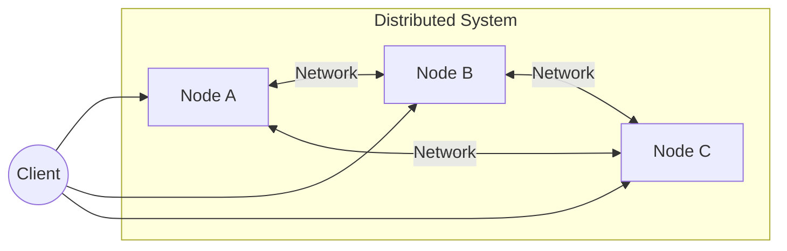
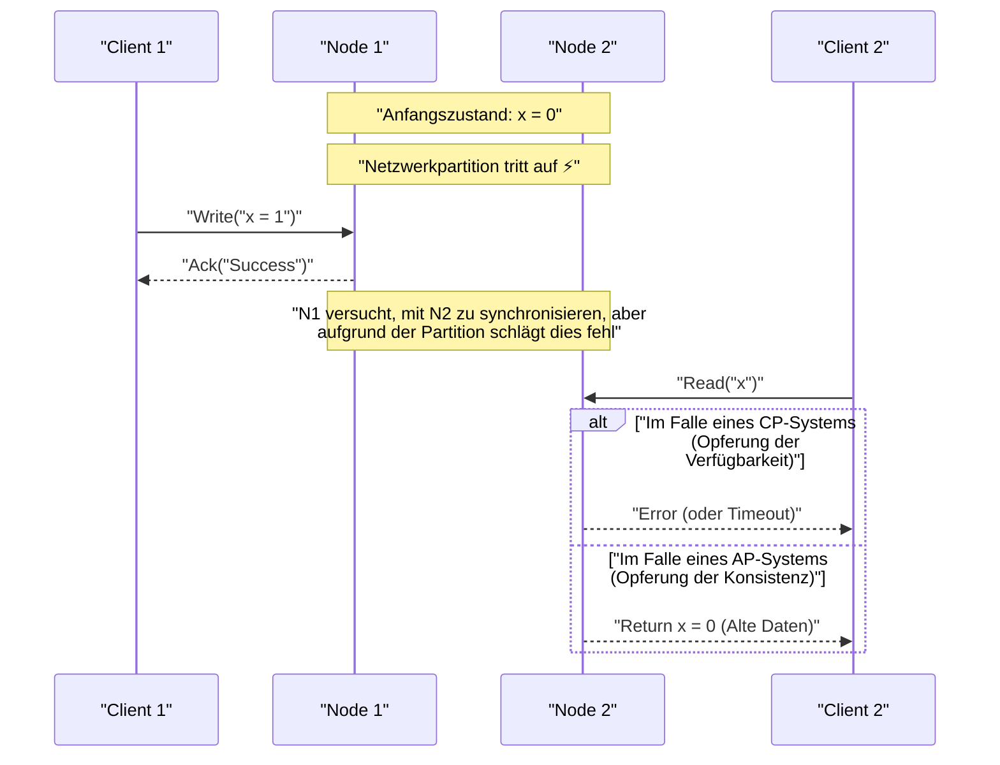
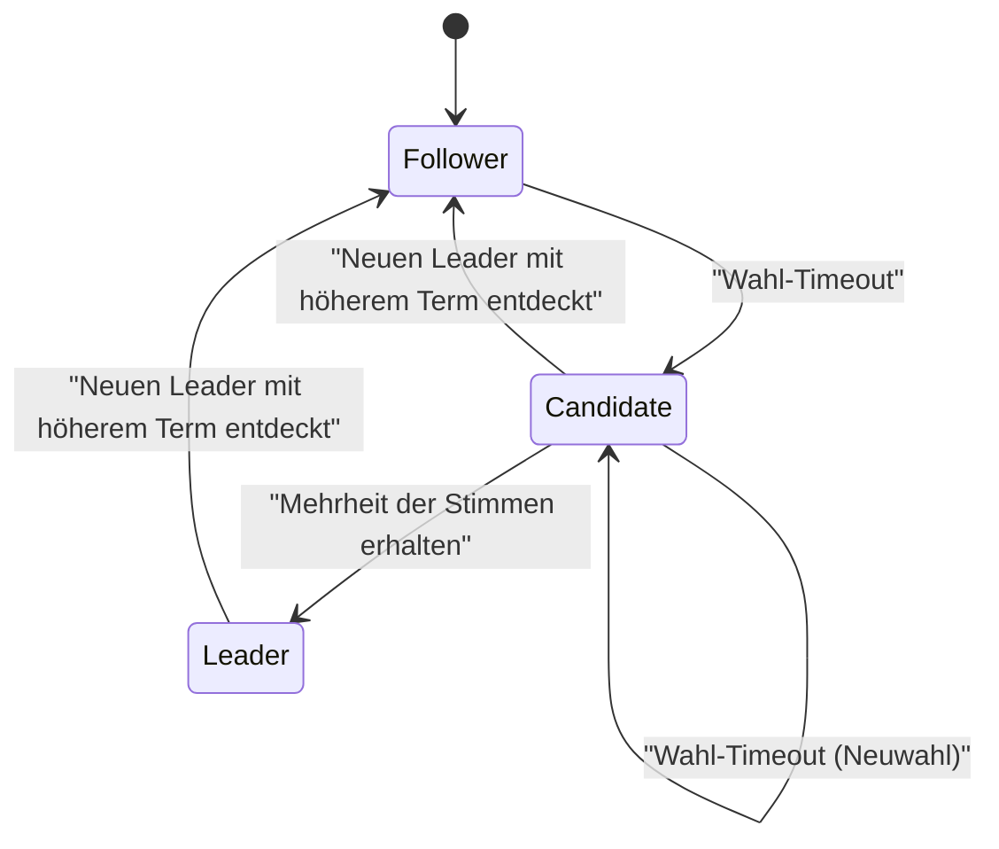

In der modernen Softwarearchitektur ist die Verteilung von Systemen zu einer unvermeidbaren Anforderung geworden. Mit der Verbreitung von Cloud Computing, der Einführung von [Microservices](https://kenji.blog/de/p/microservices-architecture-bff-api-gateway/)-Architekturen und dem steigenden Bedarf an Big-Data-Verarbeitung ist der Ansatz, auf viele kostengünstige Server (Scale-out) statt auf einen einzigen leistungsstarken Server (Scale-up) zu setzen, zum Mainstream geworden.

Beim Aufbau und Betrieb verteilter Systeme stehen Ingenieure jedoch stets vor einer schwierigen Entscheidung. Es ist der Kompromiss zwischen "Datenkonsistenz" und "Systemverfügbarkeit". Das **CAP-Theorem** (CAP theorem) hat dieses fundamentale Dilemma mathematisch bewiesen und formalisiert.

In diesem Artikel werden wir von den Grundlagen des CAP-Theorems über seinen Beweis bis hin zur Frage, wie moderne verteilte Datenbanken mit diesem Dilemma umgehen, und schließlich dem **PACELC-Theorem**, einer Erweiterung des CAP-Theorems, mit Hilfe von mathematischen Formeln, Diagrammen und Implementierungsbeispielen äußerst detailliert in die Tiefe gehen.

## 1. Was ist ein verteiltes System?

Bevor wir über das CAP-Theorem sprechen, sollten wir zunächst klären, was genau ein **verteiltes System** ([Distributed System](https://kenji.blog/de/p/cap-theorem-distributed-systems-tradeoff/)) ist.

Ein verteiltes System ist ein System, in dem mehrere unabhängige, über ein Netzwerk miteinander verbundene Computer (Knoten) für den Benutzer so agieren, als handele es sich um ein einzelnes, konsistentes System.



Die Hauptziele eines verteilten Systems sind wie folgt:

1.  **Skalierbarkeit**: Die Fähigkeit, die Gesamtverarbeitungskapazität des Systems durch Hinzufügen von Knoten zu erhöhen, wenn Datenverkehr oder Datenmenge steigen.
2.  **Verfügbarkeit**: Selbst wenn ein Fehler bei einigen Knoten auftritt, wird der Dienst des Gesamtsystems aufrechterhalten, indem andere Knoten die Verarbeitung fortsetzen.
3.  **Leistung**: Die Latenz wird reduziert, indem auf geografisch verteilte Benutzer durch physisch naheliegende Knoten geantwortet wird.

Da verteilte Systeme jedoch auf der instabilen Grundlage eines Netzwerks aufgebaut sind, gehen sie unvermeidlich mit Herausforderungen wie "Netzwerkpartitionen" sowie "Nachrichtenverzögerung und -verlust" einher.

## 2. Die 3 Elemente des CAP-Theorems

Das CAP-Theorem wurde im Jahr 2000 von Eric Brewer vorgeschlagen und im Jahr 2002 von Seth Gilbert und Nancy Lynch streng bewiesen.

Das Theorem besagt, dass ein verteiltes System von den folgenden drei Eigenschaften gleichzeitig **maximal zwei** erfüllen kann.

1.  **C: [Consistency](https://kenji.blog/de/p/cap-theorem-distributed-systems-tradeoff/)** (Konsistenz)
2.  **A: [Availability](https://kenji.blog/de/p/cap-theorem-distributed-systems-tradeoff/)** (Verfügbarkeit)
3.  **P: [Partition Tolerance](https://kenji.blog/de/p/cap-theorem-distributed-systems-tradeoff/)** (Ausfalltoleranz / Partitionstoleranz)

Lassen Sie uns die genauen Definitionen für jede von ihnen betrachten.

### 2.1. Consistency (Konsistenz)

Konsistenz bezieht sich hier auf **Linearkonsistenz** (Linearizability) oder **starke Konsistenz** (Strong Consistency).

Die Definition lautet: "Ein [Zustand](https://kenji.blog/de/p/state-management-history-redux-context-recoil-zustand/), in dem alle Clients immer die neuesten geschriebenen Daten lesen können oder das Lesen fehlschlägt." Unabhängig davon, auf welchen Knoten im verteilten System zugegriffen wird, müssen stets die neuesten Daten sichtbar sein, so als würde auf einen einzelnen Knoten zugegriffen.

Mathematisch ausgedrückt: Wenn eine Schreiboperation $ W(x=v) $ zum Zeitpunkt $ t_1 $ abgeschlossen wird, muss jede Leseoperation $ R(x) $, die zum Zeitpunkt $ t_2 $ ($ t_2 > t_1 $) durchgeführt wird, immer den Wert $ v $ oder einen neueren Wert, der danach geschrieben wurde, zurückgeben.

### 2.2. [Availability](https://kenji.blog/de/p/cap-theorem-distributed-systems-tradeoff/) (Verfügbarkeit)

Verfügbarkeit ist die Eigenschaft, dass "alle nicht fehlerhaften Knoten immer eine gültige Antwort auf alle Anfragen (Lesen, Schreiben) zurückgeben".

Selbst wenn ein Teil des Systems ausgefallen ist, kann ein Client, der einen aktiven Knoten erreicht, sicher sein, ein Ergebnis (Daten oder Erfolgsmeldung) statt eines Fehlers zu erhalten. Es ist wichtig anzumerken, dass Verfügbarkeit keine "aktuellen Daten" garantiert.

### 2.3. [Partition Tolerance](https://kenji.blog/de/p/cap-theorem-distributed-systems-tradeoff/) (Ausfalltoleranz / Partitionstoleranz)

Partitionstoleranz ist die Eigenschaft, dass "das System weiterhin funktioniert, auch wenn die Kommunikation zwischen Knoten durch das Netzwerk willkürlich unterbrochen oder verzögert wird".

Da es sich um ein verteiltes System handelt, sind Netzwerkpartitionen (Network Partition) unvermeidbare Ereignisse. Eine Kabeltrennung, ein Switch-Ausfall oder extreme Netzwerkverzögerungen können dazu führen, dass das System in mehrere Gruppen aufgeteilt wird, die nicht miteinander kommunizieren können.

## 3. Ein intuitives Verständnis des Beweises des CAP-Theorems

Warum ist es unmöglich, diese drei gleichzeitig zu erfüllen? Lassen Sie uns dies mit einem einfachen Gedankenexperiment beweisen.

Stellen Sie sich eine verteilte Datenbank vor, die aus zwei Knoten, $ N_1 $ und $ N_2 $, besteht. Der Anfangswert von Datum $ x $ ist $ 0 $.



1.  **Auftreten einer Partition**: Das Netzwerk zwischen $ N_1 $ und $ N_2 $ wurde getrennt ( **P** tritt auf).
2.  **Schreibanfrage**: Ein Client schreibt $ x = 1 $ an $ N_1 $.
3.  **Entstehung des Dilemmas**: Unmittelbar danach sendet ein anderer Client eine Leseanfrage für $ x $ an $ N_2 $.

An dieser Stelle muss das System eine Entscheidung treffen.

*   **Wenn Konsistenz (C) gewählt wird**: $ N_2 $ kennt die aktuellen Daten von $ N_1 $ nicht. Daher darf $ N_2 $ nicht die alten Daten ($ 0 $) zurückgeben und muss dem Client einen Fehler melden oder die Antwort blockieren. Dies ist ein **Verlust der Verfügbarkeit (A)**. (CP-System)
*   **Wenn Verfügbarkeit (A) gewählt wird**: $ N_2 $ muss irgendeine Antwort zurückgeben. Daher gibt es die alten Daten ($ 0 $), die es besitzt, zurück. Da dies nicht die neuesten Daten ($ 1 $) sind, ist dies ein **Verlust der Konsistenz (C)**. (AP-System)

In einem realen verteilten System, in dem Netzwerkpartitionen ( **P** ) auftreten können, müssen wir uns immer zwischen **CP** oder **AP** entscheiden. Die Option "CA" ist nur unter der unrealistischen Prämisse gültig, dass "Netzwerkpartitionen niemals auftreten", wie z. B. bei einem einzelnen Server.

## 4. Quorum und die Anpassung der Konsistenz

Viele verteilte Datenbanken (z. B. [Cassandra](https://kenji.blog/de/p/nosql-database-selection-kvs-document-graph-wide-column/), DynamoDB usw.) binden das gesamte System nicht an ein festes CP oder AP, sondern ermöglichen es, das Gleichgewicht zwischen C und A durch Parameteranpassung mittels **Quorum** für jede Anfrage zu steuern.

Sei $ N $ die Anzahl der Replikate.
Sei $ W $ die Anzahl der Knoten, die antworten müssen, damit ein Schreibvorgang als erfolgreich gilt.
Sei $ R $ die Anzahl der Knoten, die bei einem Lesevorgang abgefragt werden.

Die Bedingung zur Gewährleistung starker Konsistenz wird durch die folgende Formel ausgedrückt:

$ W + R > N $

Wenn diese Bedingung erfüllt ist, gibt es immer eine Überlappung (Overlap) zwischen der Menge der Leseknoten und der Menge der Schreibknoten, so dass Daten von einem Knoten mit den neuesten Daten gelesen werden können.

```python
class QuorumSystem:
    def __init__(self, n_replicas):
        self.N = n_replicas
        
    def check_consistency(self, w_nodes, r_nodes):
        """
        Wenn W + R > N erfüllt ist, wird starke Konsistenz (Strong Consistency) garantiert
        """
        if w_nodes + r_nodes > self.N:
            return "Strong Consistency (W+R > N)"
        else:
            return "Eventual Consistency (W+R <= N)"

# Konfigurationsbeispiel in einem System mit N=3
system = QuorumSystem(3)
print(system.check_consistency(W=2, R=2))  # 2 + 2 > 3 -> Strong Consistency
print(system.check_consistency(W=1, R=1))  # 1 + 1 <= 3 -> Eventual Consistency (Schnell, aber es besteht die Möglichkeit, alte Daten zu lesen)
```

Zum Beispiel, wenn $ N = 3 $:
*   Wenn $ W=2, R=2 $ eingestellt ist, ist die Konsistenz immer garantiert. Wenn jedoch zwei Knoten ausfallen, schlagen sowohl Lesen als auch Schreiben fehl (CP-artig).
*   Wenn $ W=1, R=1 $ eingestellt ist, ist es schnell und hochverfügbar, aber es besteht die Möglichkeit, alte Daten zu lesen (AP-artig, Eventual [Consistency](https://kenji.blog/de/p/cap-theorem-distributed-systems-tradeoff/)).

## 5. Vom CAP- zum PACELC-Theorem

Das CAP-Theorem definiert nur das Verhalten bei einer "Netzwerkpartition (Partition)". Allerdings existieren auch bei Systementwürfen für den normalen Betriebszustand (ohne Partition) Kompromisse. Dies wurde 2010 von Daniel Abadi an der Yale University durch das **PACELC-Theorem** ergänzt.

PACELC lässt sich wie folgt lesen:

*   **If P (Partition)**: Wenn eine Partition auftritt,
*   **A or C**: Wähle entweder Verfügbarkeit ( **A** vailability) oder Konsistenz ( **C** onsistency).
*   **E (Else)**: Andernfalls (im Normalzustand ohne Partition),
*   **L or C**: Wähle entweder Latenz ( **L** atency) oder Konsistenz ( **C** onsistency).

Wenn in einem verteilten System Daten synchron auf alle Knoten geschrieben werden (Wahl von C), verschlechtert sich die Antwortzeit (Latenz) durch den Kommunikations-Overhead (L wird geopfert). Wenn hingegen asynchron nur auf einige Knoten geschrieben wird und eine Antwort gesendet wird (Wahl von L), entsteht ein Zeitfenster, in dem Daten vorübergehend inkonsistent sind (C wird geopfert).

### 5.1. PACELC-Klassifizierung typischer Datenbanken

*   **PC/EC** (HBase, [MongoDB](https://kenji.blog/de/p/nosql-database-selection-kvs-document-graph-wide-column/), Zookeeper)
    *   Priorisiert Konsistenz bei Partitionen (PC). Priorisiert auch im Normalfall Konsistenz und toleriert Latenz (EC).
*   **PA/EL** ([Cassandra](https://kenji.blog/de/p/nosql-database-selection-kvs-document-graph-wide-column/), Riak, DynamoDB)
    *   Priorisiert Verfügbarkeit bei Partitionen (PA). Priorisiert im Normalfall niedrige Latenz und akzeptiert [Eventual Consistency](https://kenji.blog/de/p/cap-theorem-distributed-systems-tradeoff/) (EL).
*   **PA/EC** (MySQL Cluster usw.)
    *   Priorisiert Verfügbarkeit bei Partitionen und versucht gleichzeitig, im Normalfall Konsistenz zu wahren.

## 6. Konfliktauflösung mit Vektoruhren (Vector Clocks)

Wenn in einem AP-System Daten auf mehreren Knoten während einer Netzwerkpartition unabhängig aktualisiert werden, kommt es zu **Konflikten (Conflict)** bei den Daten, sobald die Partition behoben ist. Als Mechanismus zur Erkennung und Lösung dieser Konflikte sind **Vektoruhren** (Vector Clocks) weit verbreitet.

Eine Vektoruhr ist ein Array logischer Uhren, bei dem jeder Knoten seine eigene Anzahl von Aktualisierungen hält.

Der [Zustand](https://kenji.blog/de/p/state-management-history-redux-context-recoil-zustand/) wird wie folgt ausgedrückt:
$ V = [c_1, c_2, \dots, c_n] $
Wobei $ c_i $ der Aktualisierungszähler beim Knoten $ i $ ist.

Lassen Sie uns einen einfachen Konflikterkennungsalgorithmus für Vektoruhren in Python implementieren.

```python
class VectorClock:
    def __init__(self, node_ids):
        self.clock = {node_id: 0 for node_id in node_ids}
        
    def increment(self, node_id):
        self.clock[node_id] += 1
        
    def merge(self, other_clock):
        for k, v in other_clock.items():
            self.clock[k] = max(self.clock[k], v)

def compare_clocks(v1, v2):
    """
    Gibt -1 zurück, wenn v1 ein Vorfahr von v2 ist
    Gibt 1 zurück, wenn v2 ein Vorfahr von v1 ist
    Gibt 0 zurück, wenn sie gleichzeitig (im Konflikt) sind
    """
    v1_is_smaller = False
    v2_is_smaller = False
    
    for k in v1.keys():
        if v1[k] < v2[k]:
            v1_is_smaller = True
        elif v1[k] > v2[k]:
            v2_is_smaller = True
            
    if v1_is_smaller and not v2_is_smaller:
        return -1 # v1 -> v2
    elif v2_is_smaller and not v1_is_smaller:
        return 1  # v2 -> v1
    else:
        return 0  # Conflict!

# Simulation eines Szenarios
nodes = ['A', 'B']
v_init = VectorClock(nodes)

# Aktualisierung auf Knoten A
v_A = VectorClock(nodes)
v_A.clock = v_init.clock.copy()
v_A.increment('A')

# Während der Partition: Eine weitere Aktualisierung auf Knoten B
v_B = VectorClock(nodes)
v_B.clock = v_init.clock.copy()
v_B.increment('B')

# Vergleich
result = compare_clocks(v_A.clock, v_B.clock)
if result == 0:
    print(f"Konflikt erkannt! v_A:{v_A.clock}, v_B:{v_B.clock}")
    print("Es ist notwendig, die Merge-Logik clientseitig auszuführen oder LWW (Last Write Wins) anzuwenden.")
```

Durch die Verwendung von Vektoruhren kann man auf diese Weise mathematisch und zuverlässig bestimmen, "welches neuer ist" oder "ob parallel bearbeitet wurde (in Konflikt steht)". Amazon Dynamo und andere realisieren auf Basis dieses Mechanismus hochverfügbare Systeme.

## 7. Der [Raft](https://kenji.blog/de/p/byzantine-generals-problem-consensus/)-Konsensalgorithmus und CP-Systeme

Andererseits ist in CP-Systemen (wie Zookeeper, etcd usw.) ein **Konsensalgorithmus** unerlässlich, um bei Partitionen Split-Brain-Situationen zu verhindern und gleichzeitig die Konsistenz zu wahren. Der in den letzten Jahren am weitesten verbreitete ist **Raft**.

Raft wählt einen einzigen **Leader** (Anführer) im System und leitet alle Schreiboperationen über diesen Leader, wodurch eine starke Konsistenz garantiert wird. Wenn eine Netzwerkpartition auftritt, kann nur die Gruppe, die mit der Mehrheit (Quorum) der Knoten kommunizieren kann, einen neuen Leader wählen. Der Leader auf der Seite, die die Mehrheit verloren hat, stellt seinen Betrieb ein. Dadurch wird die Konsistenz bewahrt, aber die Minderheitsgruppe verliert ihre Verfügbarkeit (dies ist das wahre Wesen von CP).



Die Sicherheit von [Raft](https://kenji.blog/de/p/byzantine-generals-problem-consensus/) beruht auf den folgenden Prinzipien:

1.  **Election Safety**: In einer bestimmten Amtszeit (Term) kann höchstens ein Leader gewählt werden.
2.  **Leader Append-Only**: Der Leader überschreibt oder löscht die Einträge in seinem eigenen Protokoll nicht, sondern fügt nur neue hinzu.
3.  **Log Matching**: Wenn zwei Protokolle Einträge mit demselben Index und demselben Term enthalten, sind alle vorherigen Einträge identisch.

Dies eliminiert mathematisch und algorithmisch Dateninkonsistenzen in einer verteilten Umgebung vollständig. Der Backend-Datenspeicher von [Kubernetes](https://kenji.blog/de/p/kubernetes-k8s-architecture-pod-service-ingress/), `etcd`, verwendet ebenfalls Raft, um eine strikte [Zustand](https://kenji.blog/de/p/state-management-history-redux-context-recoil-zustand/)sverwaltung des Clusters zu realisieren.

## 8. [Microservices](https://kenji.blog/de/p/microservices-architecture-bff-api-gateway/) und Transaktionen

Das CAP-Theorem beschränkt sich nicht nur auf einzelne Datenbanken, sondern hat auch tiefgreifende Auswirkungen auf die moderne **Microservices-Architektur**.

In einer monolithischen Anwendung konnte die Datenkonsistenz leicht durch [ACID](https://kenji.blog/de/p/rdbms-transaction-acid-isolation-level-lock/)-Transaktionen mit einer einzigen relationalen Datenbank gewahrt werden. Bei Microservices, wo Dienste und Datenbanken nach Geschäftsdomänen getrennt sind, sind jedoch serviceübergreifende verteilte Transaktionen erforderlich.

Hier zeigt das CAP-Theorem seine Zähne. Wenn eine starke Konsistenz (C) unter Verwendung einer verteilten Transaktion (z. B. Zwei-Phasen-Commit - 2PC) gefordert wird und ein Dienst ausfällt oder eine Kommunikationsverzögerung auftritt, wird das gesamte System blockiert, was zu einer drastischen Verringerung von Verfügbarkeit (A) und Erhöhung der Latenz (L).

Um dieses Problem zu lösen, wird das **Saga-Muster** häufig in Microservices eingesetzt.

Das Saga-Muster ist eine Technik, die eine große Transaktion in eine Folge lokaler Transaktionen aufteilt und diese mittels asynchronem Messaging (wie [Kafka](https://kenji.blog/de/p/event-driven-architecture-message-queue-kafka-rabbitmq/) oder [RabbitMQ](https://kenji.blog/de/p/event-driven-architecture-message-queue-kafka-rabbitmq/)) koordiniert.

```mermaid
flowchart TD
    Order["Bestelldienst"] -->|"1. Bestellung erstellen"| MessageBroker(("Message Broker"))
    MessageBroker -->|"2. Ereignisbenachrichtigung"| Payment["Zahlungsdienst"]
    Payment -->|"3. Zahlungsabschlussereignis"| MessageBroker
    MessageBroker -->|"4. Ereignisbenachrichtigung"| Inventory["Bestandsdienst"]
    
    Inventory -- "Bei Fehler" -->|"Kompensationstransaktion"| Compensate["Bestandsreservierungs-Fehlerereignis"]
    Compensate --> MessageBroker
    MessageBroker -->|"Stornieren"| Order
```

Beim Saga-Muster wird die starke Konsistenz aufgegeben und die **Eventual [Consistency](https://kenji.blog/de/p/cap-theorem-distributed-systems-tradeoff/)** akzeptiert (AP-Ansatz). Wenn die Verarbeitung mittendrin fehlschlägt, wird anstelle eines Rollbacks eine **Kompensationstransaktion (Compensating Transaction)** ausgegeben, um eine Logik zur logischen Wiederherstellung des vorherigen [Zustand](https://kenji.blog/de/p/state-management-history-redux-context-recoil-zustand/)s zu implementieren. Dadurch wird eine geschäftlich akzeptable Konsistenz erreicht, während eine hohe Skalierbarkeit und Verfügbarkeit beibehalten werden.

## Zusammenfassung

In diesem Artikel haben wir uns intensiv mit dem CAP-Theorem befasst, dem wichtigsten Prinzip in verteilten Systemen.

*   Das **CAP-Theorem** besagt, dass es unmöglich ist, [Consistency](https://kenji.blog/de/p/cap-theorem-distributed-systems-tradeoff/) (Konsistenz), Availability (Verfügbarkeit) und [Partition Tolerance](https://kenji.blog/de/p/cap-theorem-distributed-systems-tradeoff/) (Ausfalltoleranz / Partitionstoleranz) gleichzeitig in einem verteilten System zu erfüllen, und dass dies in der realen Welt, in der Partitionen (P) unvermeidbar sind, im Grunde auf eine Wahl zwischen **CP** und **AP** hinausläuft.
*   Das **PACELC-Theorem** erweitert dies und zeigt, dass auch im Normalbetrieb ohne Partitionen ein Kompromiss zwischen Latenz (L) und Konsistenz (C) besteht.
*   Durch die Verwendung von **Quorum** kann das Gleichgewicht zwischen Konsistenz und Verfügbarkeit ($ W+R>N $) je nach Bedarf flexibel angepasst werden.
*   In AP-Systemen werden **Vektoruhren** (Vector Clocks) zur Konfliktlösung verwendet, während in CP-Systemen Konsensalgorithmen wie **[Raft](https://kenji.blog/de/p/byzantine-generals-problem-consensus/)** für die strikte Ordnung eingesetzt werden.
*   Diese Konzepte sind nicht nur grundlegendes Wissen für Datenbanken, sondern auch unerlässlich für das Design verteilter Transaktionen (wie das Saga-Muster) in modernen **[Microservices](https://kenji.blog/de/p/microservices-architecture-bff-api-gateway/)-Architekturen**.

Beim Systemdesign gibt es keine "Silver Bullet". Das CAP-Theorem und das PACELC-Theorem richtig zu verstehen, angemessen zu beurteilen, ob die Geschäftsanforderungen vorschreiben, dass "die Konsistenz um jeden Preis gewahrt bleiben muss (wie bei Zahlungen)" oder "das System niemals gestoppt werden darf, auch wenn vorübergehende Inkonsistenzen toleriert werden (wie bei einer SNS-Timeline)", und den optimalen Kompromiss zu wählen - das ist wohl die größte Fähigkeit, die von einem hervorragenden Architekten verlangt wird.
