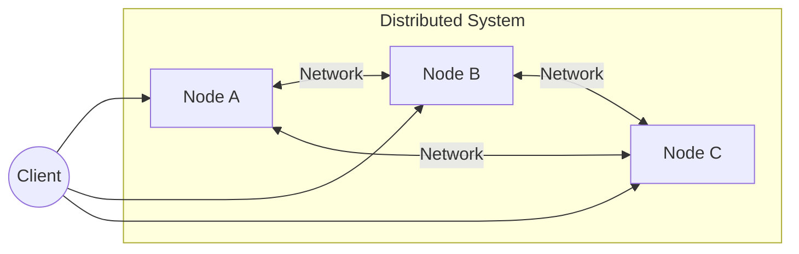
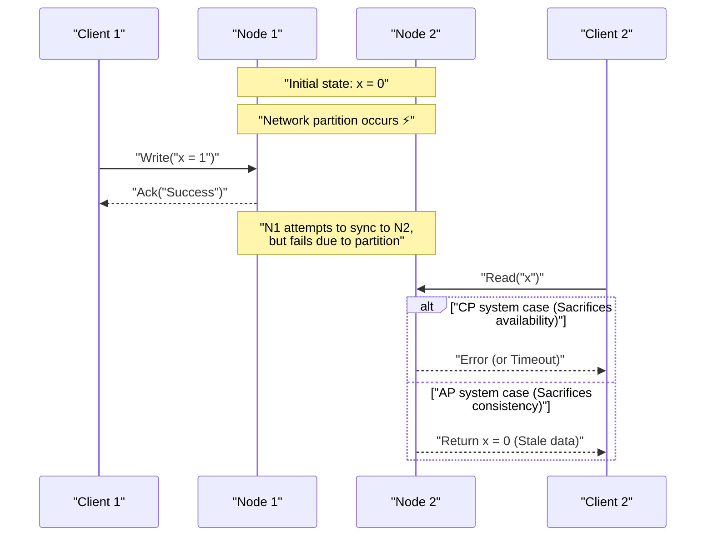
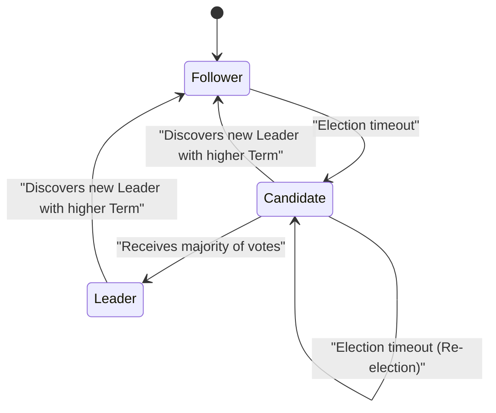

In modern software architecture, decentralizing a system has become an unavoidable requirement. With the spread of cloud computing, the adoption of microservice architectures, and the increasing demand for big data processing, the mainstream approach has shifted from relying on a single powerful server (scale-up) to coordinating many inexpensive servers (scale-out).

However, in building and operating distributed systems, engineers are constantly forced to make a difficult choice. It is the tradeoff between "data consistency" and "system availability". The **CAP theorem** mathematically proved and formulated this essential dilemma.

In this article, we will deeply explore the basics of the CAP theorem, its proof, how modern distributed databases confront this dilemma, and the **PACELC theorem**, which extends the CAP theorem, using mathematical formulas, diagrams, and implementation examples.

## 1. What is a [Distributed System](https://kenji.blog/en/p/cap-theorem-distributed-systems-tradeoff/)?

Before discussing the CAP theorem, let's clarify what a **Distributed System** is.

A distributed system is a system in which multiple independent computers (nodes) interconnected by a network behave as a single cohesive system to the user.



The main objectives of a distributed system are as follows:

1. **Scalability** : Improving the overall processing capacity of the system by adding nodes when traffic or data volume increases.
2. **[Availability](https://kenji.blog/en/p/cap-theorem-distributed-systems-tradeoff/)** : Continuing to provide services as an overall system by having other nodes continue processing even if some nodes fail.
3. **Performance** : Reducing latency for geographically distributed users by having physically closer nodes respond.

However, since it is built on the unstable foundation of a network, a distributed system inevitably involves challenges such as "network partitions" and "message delays/losses".

## 2. The Three Elements of the [CAP Theorem](https://kenji.blog/en/p/cap-theorem-distributed-systems-tradeoff/)

The CAP theorem was proposed by Eric Brewer in 2000 and strictly proven by Seth Gilbert and Nancy Lynch in 2002.

The theorem asserts that in a distributed system, it is possible to simultaneously satisfy at most **two** of the following three properties:

1. **C: [Consistency](https://kenji.blog/en/p/cap-theorem-distributed-systems-tradeoff/)** 
2. **A: Availability** 
3. **P: [Partition Tolerance](https://kenji.blog/en/p/cap-theorem-distributed-systems-tradeoff/)** 

Let's look at the strict definition of each.

### 2.1. Consistency

Consistency here refers to **Linearizability** or **Strong Consistency**.

It is defined as a state where "all clients can always read the most recently written data, or the read fails." No matter which node in the distributed system is accessed, the latest data must be visible, just as if a single node were being accessed.

Expressed mathematically, if a write operation $ W(x=v) $ completes at time $ t_1 $, any read operation $ R(x) $ performed at time $ t_2 $ ( $ t_2 > t_1 $ ) must always return $ v $ or a newer value written subsequently.

### 2.2. Availability

Availability is the property that "all non-failing nodes always return a valid response to all requests (reads, writes)."

Even if part of the system is down, a client that reaches a live node can always receive a result (data or a success response) instead of an error. The important point here is that availability does not guarantee the "latest data".

### 2.3. Partition Tolerance

Partition tolerance is the property that "the system continues to operate even if communication between nodes is arbitrarily lost or delayed by the network."

Since it is a distributed system, network partitions are inevitable events. Cable disconnections, switch failures, or extreme network delays can partition the system into multiple groups unable to communicate.

## 3. Intuitive Understanding of the CAP Theorem's Proof

Why can't these three be satisfied simultaneously? Let's prove it with a simple thought experiment.

Imagine a distributed database consisting of two nodes, $ N_1 $ and $ N_2 $. The initial value of data $ x $ is $ 0 $.



1. **Occurrence of a partition** : The network between $ N_1 $ and $ N_2 $ is disconnected ( **P** occurs).
2. **Write request** : A client writes $ x = 1 $ to $ N_1 $.
3. **Occurrence of a dilemma** : Immediately after this, another client sends a read request for $ x $ to $ N_2 $.

Here the system is forced to make a decision.

* **When choosing [Consistency](https://kenji.blog/en/p/cap-theorem-distributed-systems-tradeoff/) (C)** : $ N_2 $ does not know the latest data of $ N_1 $. Therefore, $ N_2 $ cannot return stale data ( $ 0 $ ), and must either return an error to the client or block the response. This is a **loss of [Availability](https://kenji.blog/en/p/cap-theorem-distributed-systems-tradeoff/) (A)**. (CP System)
* **When choosing Availability (A)** : $ N_2 $ must return some kind of response. Therefore, it returns the stale data it holds ( $ 0 $ ). Since this is not the latest data ( $ 1 $ ), this is a **loss of Consistency (C)**. (AP System)

In real-world distributed systems where network partitions ( **P** ) can occur, we must always choose either **CP** or **AP**. The option "CA" is only viable under the unrealistic assumption that "network partitions never occur", such as on a single server.

## 4. Tuning Consistency with Quorum

In many distributed databases (e.g., [Cassandra](https://kenji.blog/en/p/nosql-database-selection-kvs-document-graph-wide-column/), DynamoDB), rather than binding the entire system to a fixed CP or AP, it is possible to adjust the balance of C and A per request through parameter tuning using **Quorum**.

Let $ N $ be the number of replicas.
Let $ W $ be the number of nodes that must respond for a write to be considered successful.
Let $ R $ be the number of nodes queried during a read.

The condition for guaranteeing strong consistency is expressed by the following formula:

$ W + R > N $

When this condition is met, there will always be an overlap between the set of read nodes and the set of write nodes, allowing data to be read from a node containing the latest data.

```python
class QuorumSystem:
    def __init__(self, n_replicas):
        self.N = n_replicas
        
    def check_consistency(self, w_nodes, r_nodes):
        """
        Guarantees Strong Consistency if W + R > N is satisfied
        """
        if w_nodes + r_nodes > self.N:
            return "Strong Consistency (W+R > N)"
        else:
            return "Eventual Consistency (W+R <= N)"

# Setup example for N=3 system
system = QuorumSystem(3)
print(system.check_consistency(W=2, R=2))  # 2 + 2 > 3 -> Strong Consistency
print(system.check_consistency(W=1, R=1))  # 1 + 1 <= 3 -> Eventual Consistency (Fast but may read stale data)
```

For example, when $ N = 3 $:
* Setting $ W=2, R=2 $ always guarantees consistency. However, if two nodes go down, both reads and writes will fail (CP-like).
* Setting $ W=1, R=1 $ results in high speed and availability, but may read stale data (AP-like, Eventual [Consistency](https://kenji.blog/en/p/cap-theorem-distributed-systems-tradeoff/)).

## 5. From CAP to the PACELC Theorem

The CAP theorem only defines behavior during a "network partition (Partition)". However, trade-offs in system design exist even when the system is running normally (without partitions). This was supplemented by the **PACELC theorem**, proposed by Daniel Abadi of Yale University in 2010.

PACELC can be read as follows:

* **If P (Partition)** : If a partition occurs,
* **A or C** : Choose between [Availability](https://kenji.blog/en/p/cap-theorem-distributed-systems-tradeoff/) ( **A** vailability) or Consistency ( **C** onsistency).
* **E (Else)** : Otherwise (during normal times when no partition occurs),
* **L or C** : Choose between Latency ( **L** atency) or Consistency ( **C** onsistency).

In a distributed system, synchronously writing data to all nodes (choosing C) degrades response time (latency) due to communication overhead (sacrificing L). Conversely, asynchronously writing to only a portion of the nodes and returning a response (choosing L) creates a time when data is temporarily inconsistent (sacrificing C).

### 5.1. PACELC Classification of Representative Databases

* **PC/EC** (HBase, [MongoDB](https://kenji.blog/en/p/nosql-database-selection-kvs-document-graph-wide-column/), Zookeeper)
    * Prioritizes consistency during partitions (PC). Also prioritizes consistency during normal times, accepting latency (EC).
* **PA/EL** ([Cassandra](https://kenji.blog/en/p/nosql-database-selection-kvs-document-graph-wide-column/), Riak, DynamoDB)
    * Prioritizes availability during partitions (PA). Prioritizes low latency during normal times, accepting [Eventual Consistency](https://kenji.blog/en/p/cap-theorem-distributed-systems-tradeoff/) (EL).
* **PA/EC** (MySQL Cluster, etc.)
    * Prioritizes availability during partitions while attempting to maintain consistency during normal times.

## 6. Conflict Resolution with Vector Clocks

In AP systems, if data is updated separately on multiple nodes during a network partition, a data **Conflict** occurs when the partition resolves. **Vector Clocks** are widely used as a mechanism to detect and resolve these conflicts.

A vector clock is an array of logical clocks where each node holds its own update count.

The state is represented as follows:
$ V = [c_1, c_2, \dots, c_n] $
where $ c_i $ is the update counter for node $ i $.

Let's implement a simple vector clock conflict detection algorithm in Python.

```python
class VectorClock:
    def __init__(self, node_ids):
        self.clock = {node_id: 0 for node_id in node_ids}
        
    def increment(self, node_id):
        self.clock[node_id] += 1
        
    def merge(self, other_clock):
        for k, v in other_clock.items():
            self.clock[k] = max(self.clock[k], v)

def compare_clocks(v1, v2):
    """
    Returns -1 if v1 is an ancestor of v2
    Returns 1 if v2 is an ancestor of v1
    Returns 0 if concurrent (conflict)
    """
    v1_is_smaller = False
    v2_is_smaller = False
    
    for k in v1.keys():
        if v1[k] < v2[k]:
            v1_is_smaller = True
        elif v1[k] > v2[k]:
            v2_is_smaller = True
            
    if v1_is_smaller and not v2_is_smaller:
        return -1 # v1 -> v2
    elif v2_is_smaller and not v1_is_smaller:
        return 1  # v2 -> v1
    else:
        return 0  # Conflict!

# Scenario simulation
nodes = ['A', 'B']
v_init = VectorClock(nodes)

# Update on Node A
v_A = VectorClock(nodes)
v_A.clock = v_init.clock.copy()
v_A.increment('A')

# During partition: Another update on Node B
v_B = VectorClock(nodes)
v_B.clock = v_init.clock.copy()
v_B.increment('B')

# Comparison
result = compare_clocks(v_A.clock, v_B.clock)
if result == 0:
    print(f"Conflict detected! v_A:{v_A.clock}, v_B:{v_B.clock}")
    print("Merge logic must be executed on the client side, or LWW (Last Write Wins) needs to be applied.")
```

Thus, by using vector clocks, it is possible to mathematically and reliably determine "which is newer" or "whether they were edited concurrently (conflicted)". Amazon Dynamo, for example, realized a highly available system based on this mechanism.

## 7. [Raft](https://kenji.blog/en/p/byzantine-generals-problem-consensus/) [Consensus Algorithm](https://kenji.blog/en/p/byzantine-generals-problem-consensus/) and CP Systems

On the other hand, in CP systems (like Zookeeper and etcd), a **consensus algorithm** is indispensable to maintain consistency while preventing split-brain during a partition. The most widely used in recent years is **Raft**.

Raft elects a single **Leader** in the system and guarantees strong consistency by routing all write operations through the leader. When a network partition occurs, only the group that can communicate with a majority (Quorum) of nodes can elect a new leader, and the leader on the side that loses the majority stops functioning. As a result, consistency is maintained at the cost of losing availability in the minority group (this is the essence of CP).



[Raft](https://kenji.blog/en/p/byzantine-generals-problem-consensus/)'s safety relies on the following principles:

1. **Election Safety** : At most one leader can be elected in a given Term.
2. **Leader Append-Only** : A leader never overwrites or deletes entries in its log; it only appends new entries.
3. **Log Matching** : If two logs contain an entry with the same index and Term, then all entries up through that given index are identical.

By doing so, data inconsistencies in a distributed environment are completely mathematically and algorithmically eliminated. `etcd`, the backend datastore for [Kubernetes](https://kenji.blog/en/p/kubernetes-k8s-architecture-pod-service-ingress/), also achieves strict state management of the cluster by adopting this [Raft](https://kenji.blog/en/p/byzantine-generals-problem-consensus/).

## 8. [Microservices](https://kenji.blog/en/p/microservices-architecture-bff-api-gateway/) and [Transaction](https://kenji.blog/en/p/rdbms-transaction-acid-isolation-level-lock/)s

The CAP theorem does not only apply to standalone databases; it also has a profound impact on modern **Microservice Architectures**.

In a monolithic application, it was easy to maintain data consistency using [ACID](https://kenji.blog/en/p/rdbms-transaction-acid-isolation-level-lock/) transactions with a single relational database. However, in microservices where services and databases are split by business domain, distributed transactions spanning services become necessary.

This is where the CAP theorem bears its fangs. If strong consistency (C) is sought using a distributed transaction (e.g., Two-Phase Commit - 2PC), if any service goes down or a communication delay occurs, the entire system is blocked, and availability (A) and latency (L) significantly decrease.

To address this issue, the **Saga Pattern** is widely adopted in microservices.

The Saga pattern is a method of dividing a large transaction into a series of local transactions, coordinating them using asynchronous messaging (like [Kafka](https://kenji.blog/en/p/event-driven-architecture-message-queue-kafka-rabbitmq/) or [RabbitMQ](https://kenji.blog/en/p/event-driven-architecture-message-queue-kafka-rabbitmq/)).

```mermaid
flowchart TD
    Order["Order Service"] -->|"1. Create Order"| MessageBroker(("Message Broker"))
    MessageBroker -->|"2. Event Notification"| Payment["Payment Service"]
    Payment -->|"3. Payment Complete Event"| MessageBroker
    MessageBroker -->|"4. Event Notification"| Inventory["Inventory Service"]
    
    Inventory -- "On Failure" -->|"Compensating Transaction"| Compensate["Inventory Allocation Failed Event"]
    Compensate --> MessageBroker
    MessageBroker -->|"Cancel"| Order
```

In the Saga pattern, strong consistency is abandoned, and **Eventual [Consistency](https://kenji.blog/en/p/cap-theorem-distributed-systems-tradeoff/)** is accepted (an AP-like approach). If processing fails midway, instead of a rollback, a **Compensating [Transaction](https://kenji.blog/en/p/rdbms-transaction-acid-isolation-level-lock/)** is issued to implement processing that logically reverts the state. This makes it possible to maintain high scalability and availability while achieving a level of consistency acceptable for business.

## Conclusion

In this article, we took an in-depth look at the CAP theorem, the most important principle in distributed systems.

* The **CAP theorem** shows that it is impossible to simultaneously satisfy all three of Consistency, [Availability](https://kenji.blog/en/p/cap-theorem-distributed-systems-tradeoff/), and [Partition Tolerance](https://kenji.blog/en/p/cap-theorem-distributed-systems-tradeoff/) in a distributed system, and in the real world where partitions (P) are inevitable, it effectively becomes a choice between **CP** and **AP**.
* The **PACELC theorem** extended this, showing that even during normal operation when no partitions occur, there is a tradeoff between latency (L) and consistency (C).
* By using **Quorum**, you can flexibly adjust the balance between consistency and availability ( $ W+R>N $ ) according to requirements.
* **Vector Clocks** are utilized for conflict resolution in AP systems, while consensus algorithms like **[Raft](https://kenji.blog/en/p/byzantine-generals-problem-consensus/)** are used for strict ordering in CP systems.
* These concepts are essential foundational knowledge not only for databases but also for designing distributed transactions (such as the Saga pattern) in modern **[Microservice](https://kenji.blog/en/p/microservices-architecture-bff-api-gateway/) Architectures**.

There is no "silver bullet" in system design. The greatest skill required of a top architect is to correctly understand the CAP theorem and the PACELC theorem, properly assess whether your business requirements mean "consistency must be protected at all costs (like payments)" or "the system must never be stopped even if temporary inconsistency is allowed (like an SNS timeline)", and choose the optimal tradeoffs.
