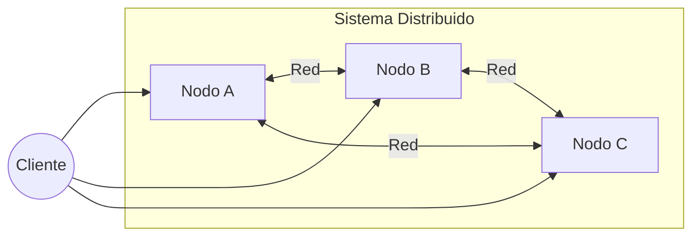
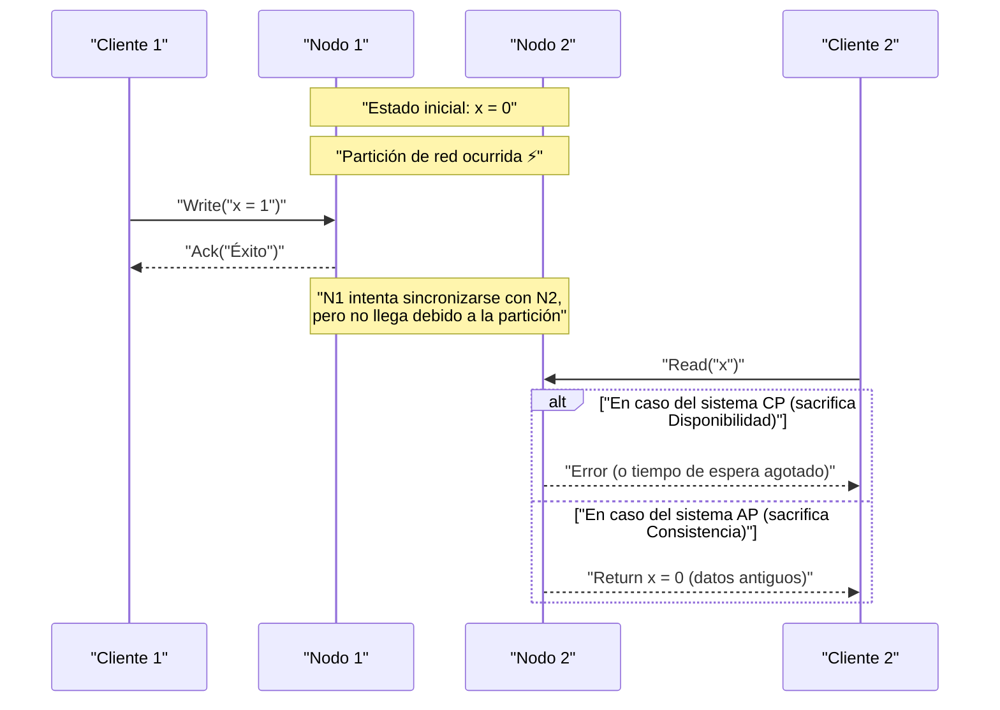
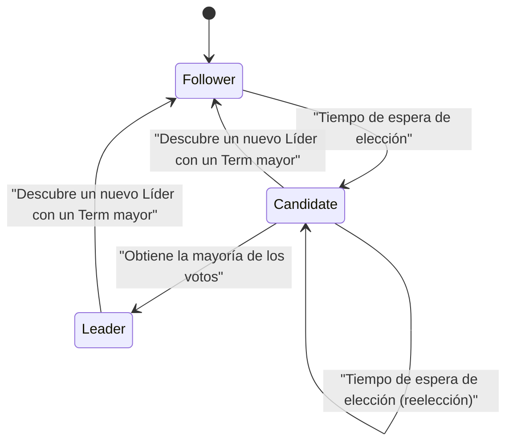

En la arquitectura de software moderna, la distribución de los sistemas se ha convertido en un requisito ineludible. Con la proliferación de la computación en la nube, la adopción de la arquitectura de microservicios y la creciente demanda de procesamiento de grandes volúmenes de datos, el enfoque principal ha pasado de depender de un único servidor potente (escalado vertical) a coordinar un gran número de servidores económicos (escalado horizontal).

Sin embargo, al construir y operar sistemas distribuidos, los ingenieros se enfrentan constantemente a una difícil elección. Se trata del equilibrio entre la "consistencia de los datos" y la "disponibilidad del sistema". Este dilema fundamental fue demostrado y formulado matemáticamente por el **Teorema CAP** (CAP theorem).

En este artículo, exploraremos con gran detalle desde los conceptos básicos del teorema CAP y su demostración, hasta cómo las bases de datos distribuidas modernas manejan este dilema, y el **Teorema PACELC** que extiende el teorema CAP. Todo esto acompañado de fórmulas, diagramas y ejemplos de implementación.

## 1. ¿Qué es un Sistema Distribuido?

Antes de hablar sobre el teorema CAP, aclaremos qué es exactamente un **Sistema Distribuido** ([Distributed System](https://kenji.blog/es/p/cap-theorem-distributed-systems-tradeoff/)).

Un sistema distribuido es aquel en el que múltiples computadoras independientes (nodos) interconectadas por una red actúan como un único sistema coherente desde el punto de vista del usuario.



Los principales objetivos de un sistema distribuido son los siguientes:

1.  **Escalabilidad**: Mejorar la capacidad de procesamiento del sistema en su conjunto añadiendo nodos cuando aumenta el tráfico o el volumen de datos.
2.  **Disponibilidad**: Continuar ofreciendo el servicio como sistema completo, incluso si algunos nodos fallan, gracias a que otros nodos continúan procesando.
3.  **Rendimiento**: Reducir la latencia minimizando la distancia física al nodo que responde a los usuarios distribuidos geográficamente.

Sin embargo, dado que se construyen sobre una base inestable como es la red, los sistemas distribuidos conllevan desafíos inevitables como las "particiones de red" y el "retraso o pérdida de mensajes".

## 2. Los 3 elementos del Teorema CAP

El teorema CAP fue propuesto por Eric Brewer en el año 2000, y fue estrictamente demostrado por Seth Gilbert y Nancy Lynch en 2002.

El teorema sostiene que, en un sistema distribuido, de las siguientes tres propiedades, solo se pueden satisfacer simultáneamente **un máximo de dos**.

1.  **C: [Consistency](https://kenji.blog/es/p/cap-theorem-distributed-systems-tradeoff/)** (Consistencia)
2.  **A: [Availability](https://kenji.blog/es/p/cap-theorem-distributed-systems-tradeoff/)** (Disponibilidad)
3.  **P: [Partition Tolerance](https://kenji.blog/es/p/cap-theorem-distributed-systems-tradeoff/)** (Tolerancia a particiones)

Veamos las definiciones estrictas de cada una de ellas.

### 2.1. Consistency (Consistencia)

La consistencia aquí se refiere a la **Linealizabilidad** (Linearizability) o **Consistencia fuerte** (Strong Consistency).

Por definición, es el estado en el que "todos los clientes siempre pueden leer los datos escritos más recientes, o la lectura falla". Sin importar a qué nodo del sistema distribuido se acceda, los datos más recientes deben ser visibles, como si se estuviera accediendo a un único nodo.

Expresado matemáticamente, si una operación de escritura $ W(x=v) $ se completa en el tiempo $ t_1 $, cualquier operación de lectura $ R(x) $ realizada en el tiempo $ t_2 $ (donde $ t_2 > t_1 $) debe devolver necesariamente $ v $ o un valor más reciente escrito posteriormente.

### 2.2. Availability (Disponibilidad)

La disponibilidad es la propiedad por la cual "todos los nodos que no han fallado devuelven siempre una respuesta válida para todas las solicitudes (lecturas, escrituras)".

Incluso si parte del sistema está caído, los clientes que logran alcanzar un nodo activo siempre recibirán un resultado (datos o respuesta de éxito) en lugar de un error. Lo importante aquí es que la disponibilidad no garantiza los "datos más recientes".

### 2.3. Partition Tolerance (Tolerancia a particiones)

La tolerancia a particiones es la propiedad por la cual "el sistema continúa funcionando incluso si la comunicación entre nodos se pierde o se retrasa arbitrariamente debido a la red".

Dado que es un sistema distribuido, la partición de la red (Network Partition) es un evento inevitable. El corte de un cable, un fallo en un conmutador (switch), o un retraso extremo en la red pueden causar que el sistema se divida en múltiples grupos que no pueden comunicarse entre sí.

## 3. Comprensión intuitiva de la demostración del Teorema CAP

¿Por qué no es posible satisfacer estas tres propiedades simultáneamente? Demostrémoslo con un sencillo experimento mental.

Imagina una base de datos distribuida compuesta por dos nodos, $ N_1 $ y $ N_2 $. El valor inicial del dato $ x $ es $ 0 $.



1.  **Ocurrencia de la partición**: La red entre $ N_1 $ y $ N_2 $ se ha desconectado (ocurre **P**).
2.  **Solicitud de escritura**: Un cliente escribe $ x = 1 $ en $ N_1 $.
3.  **Surgimiento del dilema**: Inmediatamente después, otro cliente envía una solicitud de lectura de $ x $ a $ N_2 $.

Aquí el sistema se ve obligado a tomar una decisión.

*   **Si elige Consistencia (C)**: $ N_2 $ no conoce los datos más recientes de $ N_1 $. Por lo tanto, $ N_2 $ no puede devolver los datos antiguos ($ 0 $), y debe devolver un error al cliente o bloquear la respuesta. Esto significa la **pérdida de Disponibilidad (A)**. (Sistema CP)
*   **Si elige Disponibilidad (A)**: $ N_2 $ debe devolver alguna respuesta. Por lo tanto, devuelve los datos antiguos ($ 0 $) que posee. Como estos no son los datos más recientes ($ 1 $), significa la **pérdida de Consistencia (C)**. (Sistema AP)

En los sistemas distribuidos reales donde pueden ocurrir particiones de red (**P**), siempre debemos elegir entre **CP** o **AP**. La opción "CA" solo es viable bajo la premisa irreal de que "nunca ocurrirá una partición de red", como en el caso de un servidor único.

## 4. Quorum y el ajuste de la Consistencia

En muchas bases de datos distribuidas (ej: [Cassandra](https://kenji.blog/es/p/nosql-database-selection-kvs-document-graph-wide-column/), DynamoDB, etc.), en lugar de limitar el sistema por completo a CP o AP fijo, se puede ajustar el equilibrio entre C y A mediante la configuración de parámetros usando **Quorum** (cuórum) para cada solicitud.

Sea $ N $ el número de réplicas.
Sea $ W $ el número de nodos que deben responder para considerar que una escritura ha tenido éxito.
Sea $ R $ el número de nodos consultados durante una lectura.

La condición para garantizar una consistencia fuerte se expresa con la siguiente fórmula:

$ W + R > N $

Si se cumple esta condición, siempre habrá una superposición (solapamiento) entre el conjunto de nodos de lectura y el conjunto de nodos de escritura, por lo que los datos se podrán leer desde un nodo que contenga los datos más recientes.

```python
class QuorumSystem:
    def __init__(self, n_replicas):
        self.N = n_replicas
        
    def check_consistency(self, w_nodes, r_nodes):
        """
        Si cumple W + R > N, garantiza Consistencia Fuerte (Strong Consistency)
        """
        if w_nodes + r_nodes > self.N:
            return "Strong Consistency (W+R > N)"
        else:
            return "Eventual Consistency (W+R <= N)"

# Ejemplo de configuración en un sistema con N=3
system = QuorumSystem(3)
print(system.check_consistency(W=2, R=2))  # 2 + 2 > 3 -> Strong Consistency
print(system.check_consistency(W=1, R=1))  # 1 + 1 <= 3 -> Eventual Consistency (Rápido pero puede leer datos antiguos)
```

Por ejemplo, cuando $ N = 3 $:
*   Si se configura $ W=2, R=2 $, siempre se garantiza la consistencia. Sin embargo, si dos nodos se caen, tanto la lectura como la escritura fallarán (enfoque CP).
*   Si se configura $ W=1, R=1 $, será rápido y tendrá alta disponibilidad, pero existe la posibilidad de leer datos antiguos (enfoque AP, consistencia eventual).

## 5. Del CAP al Teorema PACELC

El teorema CAP solo define el comportamiento "en caso de partición de red (Partition)". Sin embargo, incluso cuando el sistema funciona normalmente (sin particiones), existen compromisos (trade-offs) en el diseño del sistema. Esto fue complementado por el **Teorema PACELC**, propuesto por Daniel Abadi de la Universidad de Yale en 2010.

PACELC se puede interpretar de la siguiente manera:

*   **If P (Partition)**: Si ocurre una partición,
*   **A or C**: elegir entre Disponibilidad (**A**vailability) o Consistencia (**C**onsistency).
*   **E (Else)**: En caso contrario (estado normal sin partición),
*   **L or C**: elegir entre Latencia (**L**atency) o Consistencia (**C**onsistency).

En un sistema distribuido, si se escriben datos de forma sincrónica en todos los nodos (eligiendo C), la velocidad de respuesta (latencia) empeorará debido a la sobrecarga de comunicación (sacrificando L). Por el contrario, si se escribe de forma asíncrona solo en algunos nodos y se devuelve una respuesta (eligiendo L), habrá un tiempo durante el cual los datos serán temporalmente inconsistentes (sacrificando C).

### 5.1. Clasificación PACELC de bases de datos representativas

*   **PC/EC** (HBase, [MongoDB](https://kenji.blog/es/p/nosql-database-selection-kvs-document-graph-wide-column/), Zookeeper)
    *   Priorizan la consistencia durante las particiones (PC). También priorizan la consistencia en tiempos normales, tolerando la latencia (EC).
*   **PA/EL** ([Cassandra](https://kenji.blog/es/p/nosql-database-selection-kvs-document-graph-wide-column/), Riak, DynamoDB)
    *   Priorizan la disponibilidad durante las particiones (PA). Priorizan la baja latencia en tiempos normales, aceptando la consistencia eventual (Eventual [Consistency](https://kenji.blog/es/p/cap-theorem-distributed-systems-tradeoff/)) (EL).
*   **PA/EC** (MySQL Cluster, etc.)
    *   Priorizan la disponibilidad durante las particiones, pero intentan mantener la consistencia en tiempos normales.

## 6. Resolución de conflictos mediante Relojes Vectoriales (Vector Clocks)

En los sistemas AP, si los datos se actualizan por separado en varios nodos durante una partición de red, se producirá un **conflicto (Conflict)** de datos al resolverse la partición. Los **relojes vectoriales** se utilizan ampliamente como mecanismo para detectar y resolver estos conflictos.

Un reloj vectorial es un arreglo de relojes lógicos donde cada nodo mantiene su propio recuento de actualizaciones.

El estado se representa de la siguiente manera:
$ V = [c_1, c_2, \dots, c_n] $
Donde $ c_i $ es el contador de actualizaciones en el nodo $ i $.

Implementemos un algoritmo simple de detección de conflictos con reloj vectorial en Python.

```python
class VectorClock:
    def __init__(self, node_ids):
        self.clock = {node_id: 0 for node_id in node_ids}
        
    def increment(self, node_id):
        self.clock[node_id] += 1
        
    def merge(self, other_clock):
        for k, v in other_clock.items():
            self.clock[k] = max(self.clock[k], v)

def compare_clocks(v1, v2):
    """
    Si v1 es ancestro de v2, devuelve -1
    Si v2 es ancestro de v1, devuelve 1
    Si son concurrentes (conflicto), devuelve 0
    """
    v1_is_smaller = False
    v2_is_smaller = False
    
    for k in v1.keys():
        if v1[k] < v2[k]:
            v1_is_smaller = True
        elif v1[k] > v2[k]:
            v2_is_smaller = True
            
    if v1_is_smaller and not v2_is_smaller:
        return -1 # v1 -> v2
    elif v2_is_smaller and not v1_is_smaller:
        return 1  # v2 -> v1
    else:
        return 0  # ¡Conflicto!

# Simulación del escenario
nodes = ['A', 'B']
v_init = VectorClock(nodes)

# Actualización en el nodo A
v_A = VectorClock(nodes)
v_A.clock = v_init.clock.copy()
v_A.increment('A')

# Durante la partición: otra actualización en el nodo B
v_B = VectorClock(nodes)
v_B.clock = v_init.clock.copy()
v_B.increment('B')

# Comparación
result = compare_clocks(v_A.clock, v_B.clock)
if result == 0:
    print(f"¡Se ha detectado un conflicto! v_A:{v_A.clock}, v_B:{v_B.clock}")
    print("Es necesario ejecutar lógica de fusión (merge) del lado del cliente, o aplicar LWW (Last Write Wins).")
```

De esta manera, utilizando relojes vectoriales, se puede determinar matemáticamente y con certeza "cuál es más reciente" o "si se editaron de forma concurrente (en conflicto)". Amazon Dynamo, entre otros, ha logrado sistemas de alta disponibilidad basándose en este mecanismo.

## 7. Algoritmo de consenso [Raft](https://kenji.blog/es/p/byzantine-generals-problem-consensus/) y sistemas CP

Por otro lado, en los sistemas CP (como Zookeeper o etcd), para prevenir el problema de cerebro dividido (Split-brain) durante una partición y mantener la consistencia, un **algoritmo de consenso** es indispensable. En los últimos años, el más utilizado es **Raft**.

Raft elige a un único **Líder (Leader)** en el sistema, y todas las operaciones de escritura se realizan a través del líder, garantizando así una fuerte consistencia. Si ocurre una partición de red, solo el grupo que puede comunicarse con la mayoría (Quorum) de los nodos podrá elegir un nuevo líder, mientras que el líder del bando minoritario dejará de funcionar. Gracias a esto, a costa de perder la disponibilidad en el grupo minoritario, se protege la consistencia (esta es la esencia de CP).



La seguridad de [Raft](https://kenji.blog/es/p/byzantine-generals-problem-consensus/) depende de los siguientes principios:

1.  **Election Safety**: En un mandato (Term) específico, solo se elige a un máximo de un líder.
2.  **Leader Append-Only**: El líder no sobrescribe ni elimina entradas de su propio registro (log), solo añade (append).
3.  **Log Matching**: Si dos registros contienen una entrada con el mismo índice y Term, todas las entradas anteriores a ella son idénticas.

Gracias a esto, se eliminan completa y algorítmicamente las inconsistencias de datos en entornos distribuidos. `etcd`, el almacén de datos (data store) de backend de [Kubernetes](https://kenji.blog/es/p/kubernetes-k8s-architecture-pod-service-ingress/), también utiliza [Raft](https://kenji.blog/es/p/byzantine-generals-problem-consensus/) para lograr una gestión estricta del estado del clúster.

## 8. Microservicios y Transacciones

El teorema CAP no se limita a bases de datos individuales, sino que también tiene un profundo impacto en la **arquitectura de microservicios** moderna.

En aplicaciones monolíticas, era fácil mantener la consistencia de los datos mediante transacciones [ACID](https://kenji.blog/es/p/rdbms-transaction-acid-isolation-level-lock/) usando una única base de datos relacional. Sin embargo, en los microservicios, donde los servicios y las bases de datos están divididos por dominio de negocio, se requieren transacciones distribuidas que abarquen múltiples servicios.

Aquí es donde el teorema CAP muestra sus colmillos. Si se busca una consistencia fuerte (C) mediante transacciones distribuidas (ej: confirmación en dos fases - 2PC), y algún servicio se cae o hay un retraso en la comunicación, todo el sistema se bloqueará, disminuyendo drásticamente la disponibilidad (A) y la latencia (L).

Para hacer frente a este problema, el **Patrón Saga** (Saga pattern) es ampliamente adoptado en microservicios.

El patrón Saga es una técnica que divide una transacción grande en una serie de transacciones locales secuenciales, coordinándolas mediante mensajería asíncrona (como [Kafka](https://kenji.blog/es/p/event-driven-architecture-message-queue-kafka-rabbitmq/) o [RabbitMQ](https://kenji.blog/es/p/event-driven-architecture-message-queue-kafka-rabbitmq/)).

```mermaid
flowchart TD
    Order["Servicio de pedidos"] -->|"1. Crear pedido"| MessageBroker(("Message Broker"))
    MessageBroker -->|"2. Notificación de evento"| Payment["Servicio de pago"]
    Payment -->|"3. Evento de pago completado"| MessageBroker
    MessageBroker -->|"4. Notificación de evento"| Inventory["Servicio de inventario"]
    
    Inventory -- "En caso de fallo" -->|"Transacción de compensación"| Compensate["Evento de fallo de reserva de inventario"]
    Compensate --> MessageBroker
    MessageBroker -->|"Cancelar"| Order
```

En el patrón Saga, se renuncia a la consistencia fuerte y se acepta la **consistencia eventual (Eventual [Consistency](https://kenji.blog/es/p/cap-theorem-distributed-systems-tradeoff/))** (enfoque AP). Si el proceso falla a mitad de camino, en lugar de un rollback (reversión), se emite una **transacción de compensación (Compensating [Transaction](https://kenji.blog/es/p/rdbms-transaction-acid-isolation-level-lock/))**, implementando una lógica para revertir el estado lógicamente. De este modo, se logra un nivel de consistencia aceptable para el negocio, manteniendo al mismo tiempo una alta escalabilidad y disponibilidad.

## Conclusión

En este artículo, hemos profundizado en el teorema CAP, el principio más importante de los sistemas distribuidos.

*   El **Teorema CAP** demuestra que es imposible satisfacer simultáneamente Consistencia (Consistency), Disponibilidad ([Availability](https://kenji.blog/es/p/cap-theorem-distributed-systems-tradeoff/)) y Tolerancia a particiones ([Partition Tolerance](https://kenji.blog/es/p/cap-theorem-distributed-systems-tradeoff/)) en un sistema distribuido. En el mundo real, donde las particiones (P) son inevitables, en la práctica se debe elegir entre **CP** o **AP**.
*   El **Teorema PACELC** extiende esto y muestra que, incluso en funcionamiento normal sin particiones, existe un compromiso (trade-off) entre Latencia (L) y Consistencia (C).
*   Mediante el uso de **Quorum (cuórum)**, se puede ajustar flexiblemente el equilibrio entre consistencia y disponibilidad ($ W+R>N $) según los requerimientos.
*   En los sistemas AP, se utilizan **relojes vectoriales** para resolver conflictos, mientras que en los sistemas CP se aprovechan algoritmos de consenso como **[Raft](https://kenji.blog/es/p/byzantine-generals-problem-consensus/)** para un ordenamiento estricto.
*   Estos conceptos son conocimientos fundamentales indispensables no solo para bases de datos, sino también para el diseño de transacciones distribuidas (como el patrón Saga) en la moderna **arquitectura de microservicios**.

No existe una "bala de plata" (solución mágica) en el diseño de sistemas. Comprender correctamente los teoremas CAP y PACELC, evaluar adecuadamente si los requisitos de tu negocio demandan "proteger la consistencia a toda costa (ej: pagos)" o "nunca detener el sistema, incluso si se toleran inconsistencias temporales (ej: línea de tiempo de redes sociales)", y elegir el compromiso óptimo, es quizás la habilidad más importante que se exige de un arquitecto sobresaliente.
