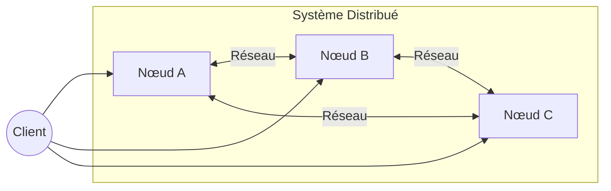
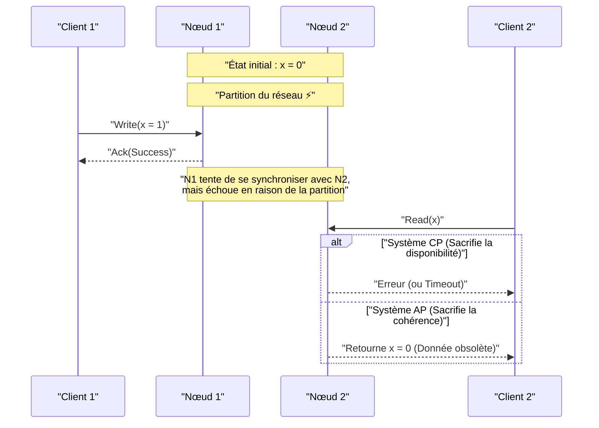
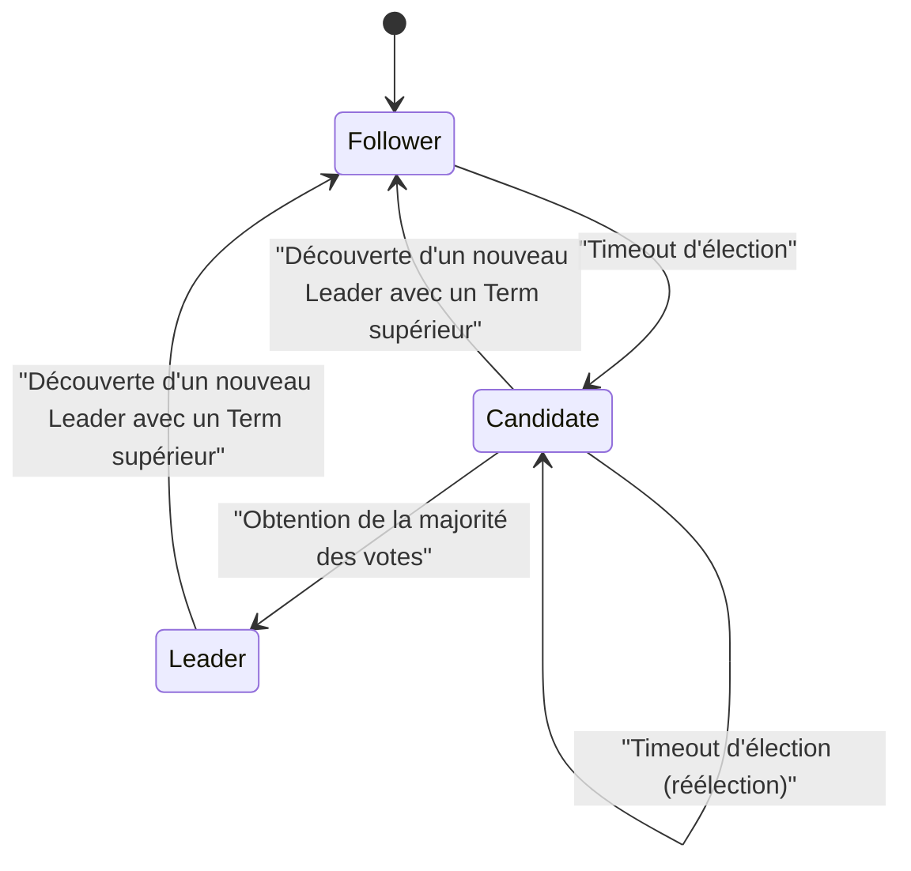

Dans l'architecture logicielle moderne, rendre les systèmes distribués est devenu une exigence incontournable. Avec la prolifération du cloud computing, l'adoption d'architectures en microservices et la demande croissante de traitement de données massives, l'approche dominante consiste désormais à faire collaborer de nombreux serveurs bon marché (scale-out) plutôt que de dépendre d'un seul serveur puissant (scale-up).

Cependant, lors de la conception et de l'exploitation de systèmes distribués, les ingénieurs sont constamment confrontés à des choix difficiles. Il s'agit du compromis entre la "cohérence des données" et la "disponibilité du système". Ce dilemme inhérent a été prouvé et formulé mathématiquement sous le nom de **théorème CAP** (CAP theorem).

Dans cet article, nous explorerons en profondeur les bases du théorème CAP, sa preuve, la manière dont les bases de données distribuées modernes font face à ce dilemme, et l'extension du théorème CAP appelée **théorème PACELC**, avec des formules mathématiques, des diagrammes et des exemples d'implémentation très détaillés.

## 1. Qu'est-ce qu'un système distribué ?

Avant de parler du théorème CAP, clarifions ce qu'est un **système distribué** (Distributed System).

Un système distribué est un système dans lequel plusieurs ordinateurs (nœuds) indépendants et interconnectés par un réseau se comportent, du point de vue de l'utilisateur, comme un système unique et cohérent.



Les principaux objectifs d'un système distribué sont les suivants :

1.  **Évolutivité (Scalability)** : Améliorer la capacité de traitement globale du système en ajoutant des nœuds lorsque le trafic ou le volume de données augmente.
2.  **Disponibilité (Availability)** : Même si certains nœuds tombent en panne, les autres nœuds continuent le traitement, permettant au système global de continuer à fournir le service.
3.  **Performances (Performance)** : Réduire la latence en permettant au nœud physiquement le plus proche de répondre aux utilisateurs géographiquement dispersés.

Cependant, étant construit sur la fondation instable qu'est le réseau, un système distribué s'accompagne de défis inévitables tels que les "partitions réseau" et la "latence ou perte de messages".

## 2. Les 3 éléments du théorème CAP

Le théorème CAP a été proposé par Eric Brewer en 2000 et rigoureusement prouvé par Seth Gilbert et Nancy Lynch en 2002.

Le théorème stipule que dans un système distribué, parmi les trois propriétés suivantes, il est possible d'en satisfaire **au maximum deux** simultanément.

1.  **C: Consistency** (Cohérence)
2.  **A: Availability** (Disponibilité)
3.  **P: Partition Tolerance** (Tolérance au partitionnement)

Examinons la définition rigoureuse de chacune d'elles.

### 2.1. Consistency (Cohérence)

Ici, la cohérence fait référence à la **linéarisabilité** (Linearizability) ou **forte cohérence** (Strong Consistency).

Par définition, c'est l'état où "tous les clients peuvent toujours lire les dernières données écrites, ou la lecture échoue". Quel que soit le nœud accédé dans le système distribué, les données les plus récentes doivent être visibles, comme si l'on accédait à un seul nœud.

Exprimé mathématiquement, si une opération d'écriture $ W(x=v) $ se termine à l'instant $ t_1 $, toute opération de lecture $ R(x) $ effectuée à l'instant $ t_2 $ ( $ t_2 > t_1 $ ) doit obligatoirement renvoyer $ v $ ou une nouvelle valeur écrite ultérieurement.

### 2.2. Availability (Disponibilité)

La disponibilité est la propriété selon laquelle "tous les nœuds qui ne sont pas en panne renvoient toujours une réponse valide à toutes les requêtes (lecture, écriture)".

Même si une partie du système est en panne, un client qui atteint un nœud vivant recevra toujours un résultat (des données ou une réponse de succès) et non une erreur. Ce qui est important ici, c'est que la disponibilité ne garantit pas "les données les plus récentes".

### 2.3. Partition Tolerance (Tolérance au partitionnement)

La tolérance au partitionnement est la propriété selon laquelle "le système continue de fonctionner même si la communication entre les nœuds est arbitrairement perdue ou retardée par le réseau".

Puisqu'il s'agit d'un système distribué, le partitionnement du réseau (Network Partition) est un événement inévitable. Une coupure de câble, une panne de commutateur ou une latence réseau extrême peuvent diviser le système en plusieurs groupes incapables de communiquer entre eux.

## 3. Compréhension intuitive de la preuve du théorème CAP

Pourquoi est-il impossible de satisfaire ces trois propriétés en même temps ? Prouvons-le par une simple expérience de pensée.

Imaginez une base de données distribuée composée de deux nœuds, $ N_1 $ et $ N_2 $. La valeur initiale de la donnée $ x $ est $ 0 $.



1.  **Apparition de la partition** : Le réseau entre $ N_1 $ et $ N_2 $ est coupé ( **P** se produit).
2.  **Requête d'écriture** : Un client écrit $ x = 1 $ sur $ N_1 $.
3.  **Apparition du dilemme** : Immédiatement après, un autre client envoie une requête de lecture de $ x $ à $ N_2 $.

Ici, le système est contraint de prendre une décision.

*   **Si la cohérence (C) est choisie** : $ N_2 $ ne connaît pas les dernières données de $ N_1 $. Par conséquent, $ N_2 $ ne peut pas renvoyer de données obsolètes ( $ 0 $ ) et doit renvoyer une erreur au client ou bloquer la réponse. C'est une **perte de disponibilité (A)**. (Système CP)
*   **Si la disponibilité (A) est choisie** : $ N_2 $ doit renvoyer une forme de réponse. Par conséquent, il renvoie l'ancienne donnée ( $ 0 $ ) qu'il possède. Comme ce ne sont pas les dernières données ( $ 1 $ ), c'est une **perte de cohérence (C)**. (Système AP)

Dans les systèmes distribués du monde réel où le partitionnement du réseau ( **P** ) peut se produire, nous devons nécessairement choisir entre **CP** ou **AP**. L'option "CA" n'est valable que sous l'hypothèse irréaliste où "le partitionnement du réseau ne se produit jamais", comme avec un serveur unique.

## 4. Quorum et ajustement de la cohérence

Dans de nombreuses bases de données distribuées (ex. Cassandra, DynamoDB, etc.), au lieu de lier l'ensemble du système à un modèle CP ou AP fixe, il est possible d'ajuster l'équilibre entre C et A par requête en ajustant les paramètres via un **Quorum**.

Soit $ N $ le nombre de réplicas.
Soit $ W $ le nombre de nœuds dont une réponse est requise pour qu'une écriture soit considérée comme réussie.
Soit $ R $ le nombre de nœuds interrogés lors d'une lecture.

La condition pour garantir une forte cohérence est exprimée par la formule suivante :

$ W + R > N $

Si cette condition est remplie, il y aura toujours un chevauchement entre l'ensemble des nœuds de lecture et l'ensemble des nœuds d'écriture, ce qui permet de lire les données à partir d'un nœud contenant les données les plus récentes.

```python
class QuorumSystem:
    def __init__(self, n_replicas):
        self.N = n_replicas
        
    def check_consistency(self, w_nodes, r_nodes):
        """
        Garantit une forte cohérence (Strong Consistency) si W + R > N
        """
        if w_nodes + r_nodes > self.N:
            return "Strong Consistency (W+R > N)"
        else:
            return "Eventual Consistency (W+R <= N)"

# Exemple de configuration pour un système avec N=3
system = QuorumSystem(3)
print(system.check_consistency(W=2, R=2))  # 2 + 2 > 3 -> Strong Consistency
print(system.check_consistency(W=1, R=1))  # 1 + 1 <= 3 -> Eventual Consistency (Rapide mais risque de lire des données obsolètes)
```

Par exemple, lorsque $ N = 3 $ :
*   Si configuré avec $ W=2, R=2 $, la cohérence est toujours garantie. Cependant, si deux nœuds tombent en panne, la lecture et l'écriture échoueront toutes les deux (tendance CP).
*   Si configuré avec $ W=1, R=1 $, le système est rapide et hautement disponible, mais il est possible de lire des données obsolètes (tendance AP, cohérence éventuelle).

## 5. Du théorème CAP au théorème PACELC

Le théorème CAP ne définit que le comportement "lors d'une partition réseau (Partition)". Cependant, même lorsque le système fonctionne normalement (sans partition), il existe des compromis dans la conception du système. Le **théorème PACELC**, proposé par Daniel Abadi de l'Université de Yale en 2010, complète cela.

Le PACELC se lit comme suit :

*   **If P (Partition)** : Si une partition se produit,
*   **A or C** : Choisir entre la disponibilité ( **A** vailability) ou la cohérence ( **C** onsistency).
*   **E (Else)** : Sinon (en temps normal sans partition),
*   **L or C** : Choisir entre la latence ( **L** atency) ou la cohérence ( **C** onsistency).

Dans un système distribué, si vous écrivez des données de manière synchrone sur tous les nœuds (choix C), la vitesse de réponse (latence) se dégradera en raison des frais généraux de communication (sacrifice de L). Inversement, si vous écrivez de manière asynchrone uniquement sur certains nœuds et renvoyez une réponse (choix L), il y aura une période pendant laquelle les données seront temporairement incohérentes (sacrifice de C).

### 5.1. Classification PACELC des bases de données représentatives

*   **PC/EC** (HBase, MongoDB, Zookeeper)
    *   Priorise la cohérence lors d'une partition (PC). Priorise également la cohérence en temps normal, tolérant la latence (EC).
*   **PA/EL** (Cassandra, Riak, DynamoDB)
    *   Priorise la disponibilité lors d'une partition (PA). Priorise une faible latence en temps normal et accepte la cohérence éventuelle (Eventual Consistency) (EL).
*   **PA/EC** (MySQL Cluster, etc.)
    *   Priorise la disponibilité lors d'une partition tout en essayant de maintenir la cohérence en temps normal.

## 6. Résolution des conflits par horloges vectorielles (Vector Clocks)

Dans un système AP, si les données sont mises à jour séparément sur plusieurs nœuds pendant une partition réseau, un **conflit (Conflict)** de données se produira lors de la résolution de la partition. L' **horloge vectorielle** est largement utilisée comme mécanisme pour détecter et résoudre ces conflits.

Une horloge vectorielle est un tableau d'horloges logiques où chaque nœud conserve son propre nombre de mises à jour.

L'état est exprimé comme suit :
$ V = [c_1, c_2, \dots, c_n] $
Où $ c_i $ est le compteur de mises à jour sur le nœud $ i $.

Implémentons un algorithme simple de détection de conflit d'horloge vectorielle en Python.

```python
class VectorClock:
    def __init__(self, node_ids):
        self.clock = {node_id: 0 for node_id in node_ids}
        
    def increment(self, node_id):
        self.clock[node_id] += 1
        
    def merge(self, other_clock):
        for k, v in other_clock.items():
            self.clock[k] = max(self.clock[k], v)

def compare_clocks(v1, v2):
    """
    Retourne -1 si v1 est un ancêtre de v2
    Retourne 1 si v2 est un ancêtre de v1
    Retourne 0 s'ils sont simultanés (conflit)
    """
    v1_is_smaller = False
    v2_is_smaller = False
    
    for k in v1.keys():
        if v1[k] < v2[k]:
            v1_is_smaller = True
        elif v1[k] > v2[k]:
            v2_is_smaller = True
            
    if v1_is_smaller and not v2_is_smaller:
        return -1 # v1 -> v2
    elif v2_is_smaller and not v1_is_smaller:
        return 1  # v2 -> v1
    else:
        return 0  # Conflit !

# Simulation du scénario
nodes = ['A', 'B']
v_init = VectorClock(nodes)

# Mise à jour sur le nœud A
v_A = VectorClock(nodes)
v_A.clock = v_init.clock.copy()
v_A.increment('A')

# Pendant la partition : une autre mise à jour sur le nœud B
v_B = VectorClock(nodes)
v_B.clock = v_init.clock.copy()
v_B.increment('B')

# Comparaison
result = compare_clocks(v_A.clock, v_B.clock)
if result == 0:
    print(f"Conflit détecté ! v_A:{v_A.clock}, v_B:{v_B.clock}")
    print("Il est nécessaire d'exécuter une logique de fusion côté client ou d'appliquer la règle LWW (Last Write Wins).")
```

De cette façon, l'utilisation d'horloges vectorielles permet de déterminer mathématiquement et de manière fiable "lequel est le plus récent" ou "s'ils ont été édités en parallèle (en conflit)". Amazon Dynamo, par exemple, a réalisé un système hautement disponible basé sur ce mécanisme.

## 7. Algorithme de consensus [Raft](https://kenji.blog/fr/p/byzantine-generals-problem-consensus/) et systèmes CP

D'autre part, dans les systèmes CP (comme Zookeeper et etcd), un **algorithme de consensus** est essentiel pour maintenir la cohérence tout en empêchant le split-brain lors d'une partition. **Raft** est le plus largement utilisé ces dernières années.

Raft élit un unique **Leader** dans le système et garantit une forte cohérence en effectuant toutes les opérations d'écriture via le Leader. Si une partition réseau se produit, seul le groupe capable de communiquer avec la majorité (Quorum) des nœuds peut élire un nouveau Leader, et le Leader du côté qui a perdu la majorité cesse de fonctionner. Cela préserve la cohérence, mais la disponibilité est perdue pour le groupe minoritaire (c'est l'essence même du modèle CP).



La sécurité de [Raft](https://kenji.blog/fr/p/byzantine-generals-problem-consensus/) repose sur les principes suivants :

1.  **Election Safety** : Un seul Leader au maximum peut être élu pour un mandat (Term) donné.
2.  **Leader Append-Only** : Un Leader n'écrase ni ne supprime jamais d'entrées dans son journal, il ne fait qu'en ajouter.
3.  **Log Matching** : Si deux journaux contiennent une entrée avec le même index et le même Term, toutes les entrées précédentes sont identiques.

Cela élimine complètement de manière mathématique et algorithmique les incohérences de données dans un environnement distribué. `etcd`, le magasin de données backend de Kubernetes, adopte également [Raft](https://kenji.blog/fr/p/byzantine-generals-problem-consensus/) pour réaliser une gestion d'état stricte du cluster.

## 8. Microservices et transactions

Le théorème CAP ne se limite pas aux bases de données individuelles, il a également une influence profonde sur l' **architecture en microservices** moderne.

Dans une application monolithique, il était facile de maintenir la cohérence des données grâce aux transactions ACID utilisant une seule base de données relationnelle. Cependant, dans les microservices où les services et les bases de données sont divisés par domaine métier, des transactions distribuées couvrant plusieurs services sont nécessaires.

C'est là que le théorème CAP montre les dents. Si vous exigez une forte cohérence (C) en utilisant des transactions distribuées (ex. validation en deux phases - 2PC), si un service tombe en panne ou si une latence réseau se produit, l'ensemble du système sera bloqué, réduisant considérablement la disponibilité (A) et la latence (L).

Pour résoudre ce problème, le **modèle Saga** est largement adopté dans les microservices.

Le modèle Saga est une technique qui divise une grande transaction en une série de transactions locales, les coordonnant à l'aide d'une messagerie asynchrone (comme Kafka ou RabbitMQ).

```mermaid
flowchart TD
    Order["Service de Commande"] -->|"1. Création de commande"| MessageBroker(("Message Broker"))
    MessageBroker -->|"2. Notification d'événement"| Payment["Service de Paiement"]
    Payment -->|"3. Événement de paiement réussi"| MessageBroker
    MessageBroker -->|"4. Notification d'événement"| Inventory["Service d'Inventaire"]
    
    Inventory -- "En cas d'échec" -->|"Transaction de compensation"| Compensate["Événement d'échec de réservation de stock"]
    Compensate --> MessageBroker
    MessageBroker -->|"Annulation"| Order
```

Dans le modèle Saga, on abandonne la forte cohérence et on accepte la **cohérence éventuelle (Eventual Consistency)** (approche de type AP). Si le traitement échoue en cours de route, au lieu d'un rollback, une **transaction de compensation (Compensating Transaction)** est émise pour implémenter la logique d'annulation de l'état. Cela permet d'atteindre un niveau de cohérence acceptable d'un point de vue métier, tout en maintenant une évolutivité et une disponibilité élevées.

## Résumé

Dans cet article, nous avons approfondi le théorème CAP, qui est le principe le plus important dans les systèmes distribués.

*   Le **théorème CAP** démontre qu'il est impossible de satisfaire simultanément Consistency (Cohérence), Availability (Disponibilité) et Partition Tolerance (Tolérance au partitionnement) dans un système distribué. Dans le monde réel où les partitions (P) sont inévitables, il s'agit en fait de choisir entre **CP** ou **AP**.
*   Le **théorème PACELC** étend cela pour montrer que même en fonctionnement normal sans partition, il y a un compromis entre la latence (L) et la cohérence (C).
*   En utilisant un **Quorum**, il est possible d'ajuster de manière flexible l'équilibre entre cohérence et disponibilité ( $ W+R>N $ ) en fonction des exigences.
*   Dans les systèmes AP, les **horloges vectorielles** sont utilisées pour résoudre les conflits, tandis que dans les systèmes CP, des algorithmes de consensus comme **[Raft](https://kenji.blog/fr/p/byzantine-generals-problem-consensus/)** sont utilisés pour un séquençage strict.
*   Ces concepts constituent des connaissances fondamentales indispensables non seulement pour les bases de données, mais aussi pour la conception de transactions distribuées (comme le modèle Saga) dans l' **architecture en microservices** moderne.

Il n'y a pas de "balle d'argent" dans la conception de systèmes. Comprendre correctement les théorèmes CAP et PACELC, évaluer correctement si vos exigences métier exigent de "maintenir la cohérence à tout prix (comme pour les paiements)" ou de "ne jamais arrêter le système même si des incohérences temporaires se produisent (comme pour la timeline d'un réseau social)", et faire les compromis optimaux est sans doute la compétence la plus importante requise d'un excellent architecte.
