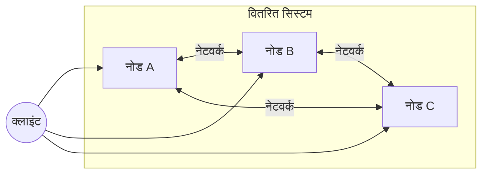
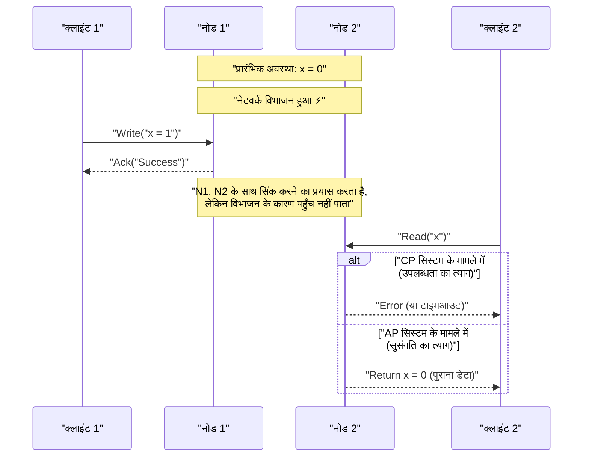
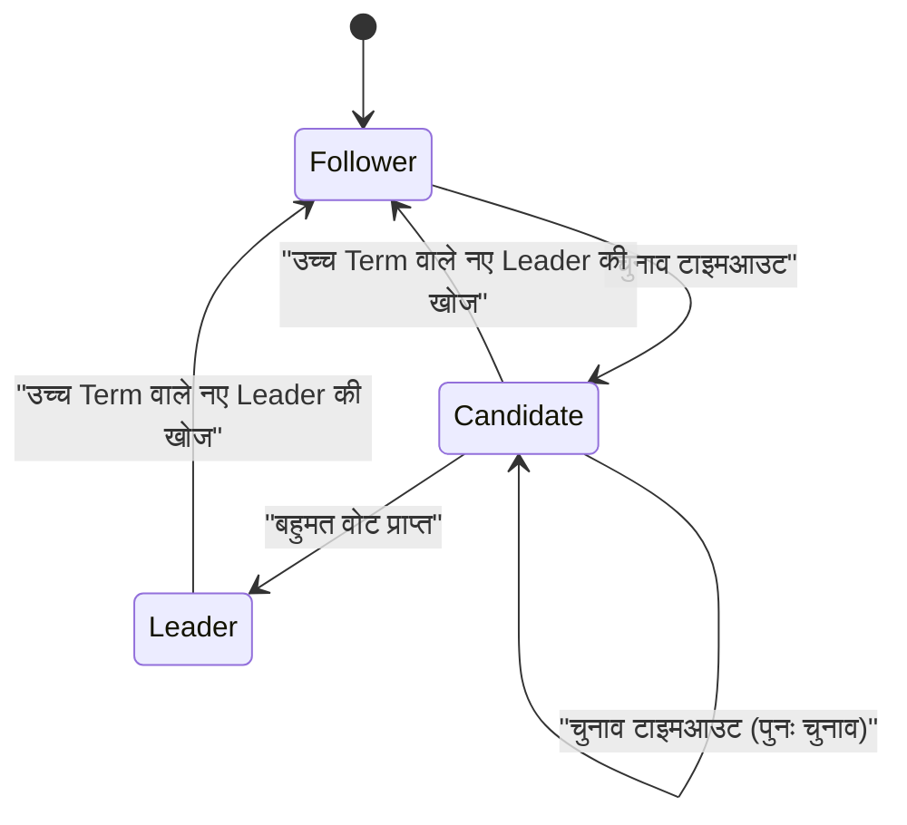

आधुनिक सॉफ्टवेयर आर्किटेक्चर में, सिस्टम को वितरित (distributed) बनाना अब एक अपरिहार्य आवश्यकता बन गया है। क्लाउड कंप्यूटिंग के प्रसार, माइक्रोसर्विसेज आर्किटेक्चर को अपनाने और बिग डेटा प्रोसेसिंग की बढ़ती मांग के कारण, एकल शक्तिशाली सर्वर (स्केल अप) पर निर्भर रहने के बजाय बड़ी संख्या में सस्ते सर्वरों को एक साथ जोड़ने (स्केल आउट) का दृष्टिकोण मुख्यधारा बन गया है।

हालाँकि, वितरित सिस्टम (distributed systems) के निर्माण और संचालन में, इंजीनियरों को हमेशा एक कठिन विकल्प का सामना करना पड़ता है। यह "डेटा की निरंतरता ([Consistency](https://kenji.blog/hi/p/cap-theorem-distributed-systems-tradeoff/))" और "सिस्टम की उपलब्धता ([Availability](https://kenji.blog/hi/p/cap-theorem-distributed-systems-tradeoff/))" के बीच का ट्रेड-ऑफ है। इस अंतर्निहित दुविधा को गणितीय रूप से साबित करने और तैयार करने वाले को **CAP प्रमेय** (CAP theorem) कहा जाता है।

इस लेख में, हम CAP प्रमेय की मूल बातों से लेकर इसके प्रमाण तक, आधुनिक वितरित डेटाबेस इस दुविधा से कैसे निपटते हैं, और इसके विस्तारित रूप **PACELC प्रमेय** को गणितीय सूत्रों, आरेखों और कार्यान्वयन उदाहरणों के साथ बहुत विस्तार से समझेंगे।

## 1. वितरित सिस्टम क्या है?

CAP प्रमेय पर चर्चा करने से पहले, आइए स्पष्ट करें कि **वितरित सिस्टम** ([Distributed System](https://kenji.blog/hi/p/cap-theorem-distributed-systems-tradeoff/)) वास्तव में क्या है।

एक वितरित सिस्टम कई स्वतंत्र कंप्यूटरों (नोड्स) का एक नेटवर्क है जो आपस में जुड़े हुए हैं और उपयोगकर्ता को एकल, सुसंगत सिस्टम की तरह व्यवहार करते हुए दिखाई देते हैं।



वितरित प्रणालियों के मुख्य उद्देश्य निम्नलिखित हैं:

1.  **स्केलेबिलिटी (Scalability)** : जब ट्रैफ़िक या डेटा की मात्रा बढ़ती है, तो नोड्स जोड़कर संपूर्ण सिस्टम की प्रसंस्करण क्षमता में सुधार करना।
2.  **उपलब्धता ([Availability](https://kenji.blog/hi/p/cap-theorem-distributed-systems-tradeoff/))** : भले ही कुछ नोड्स विफल हो जाएं, अन्य नोड्स प्रसंस्करण जारी रखते हैं, यह सुनिश्चित करते हुए कि सिस्टम समग्र रूप से सेवा प्रदान करना जारी रखे।
3.  **प्रदर्शन (Performance)** : भौगोलिक रूप से वितरित उपयोगकर्ताओं के लिए, भौतिक रूप से निकटतम नोड द्वारा प्रतिक्रिया देकर विलंबता (latency) को कम करना।

हालाँकि, चूंकि यह नेटवर्क जैसी अस्थिर नींव पर बनाया गया है, वितरित प्रणालियाँ अपरिहार्य चुनौतियों के साथ आती हैं जैसे कि "नेटवर्क विभाजन (network partition)" और "संदेश में देरी या हानि"।

## 2. CAP प्रमेय के 3 तत्व

CAP प्रमेय 2000 में एरिक ब्रूवर (Eric Brewer) द्वारा प्रस्तावित किया गया था, और 2002 में सेठ गिल्बर्ट (Seth Gilbert) और नैन्सी लिंच (Nancy Lynch) द्वारा कठोरता से सिद्ध किया गया था।

प्रमेय का दावा है कि एक वितरित प्रणाली में, निम्नलिखित तीन गुणों में से **अधिकतम दो** को एक ही समय में संतुष्ट किया जा सकता है:

1.  **C: [Consistency](https://kenji.blog/hi/p/cap-theorem-distributed-systems-tradeoff/)** (निरंतरता/सुसंगति)
2.  **A: Availability** (उपलब्धता)
3.  **P: [Partition Tolerance](https://kenji.blog/hi/p/cap-theorem-distributed-systems-tradeoff/)** (विभाजन सहनशीलता)

आइए उनमें से प्रत्येक की सख्त परिभाषाओं पर नज़र डालें।

### 2.1. Consistency (निरंतरता/सुसंगति)

यहाँ सुसंगति का तात्पर्य **रेखीयकरण** (Linearizability) या **मजबूत सुसंगति** (Strong Consistency) से है।

परिभाषा के अनुसार, यह एक ऐसी स्थिति है जहाँ "सभी क्लाइंट हमेशा नवीनतम लिखित डेटा पढ़ सकते हैं, या पढ़ना विफल हो जाएगा।" वितरित सिस्टम में किसी भी नोड तक पहुँचने पर, नवीनतम डेटा इस तरह दिखाई देना चाहिए जैसे कि एकल नोड तक पहुँचा जा रहा हो।

गणितीय रूप से व्यक्त, यदि कोई लेखन कार्य $ W(x=v) $ समय $ t_1 $ पर पूरा होता है, तो समय $ t_2 $ ( $ t_2 > t_1 $ ) पर किया गया कोई भी पठन कार्य $ R(x) $ हमेशा $ v $ या उसके बाद लिखा गया एक नया मान लौटाना चाहिए।

### 2.2. Availability (उपलब्धता)

उपलब्धता वह विशेषता है जहाँ "बिना विफलता वाले सभी नोड सभी अनुरोधों (पढ़ने, लिखने) के लिए हमेशा एक वैध प्रतिक्रिया लौटाते हैं।"

भले ही सिस्टम का कोई हिस्सा डाउन हो, क्लाइंट जो जीवित नोड तक पहुँच सकता है, वह हमेशा एक त्रुटि के बजाय परिणाम (डेटा या सफलता प्रतिक्रिया) प्राप्त करेगा। यहाँ महत्वपूर्ण बात यह है कि उपलब्धता "नवीनतम डेटा" की गारंटी नहीं देती है।

### 2.3. Partition Tolerance (विभाजन सहनशीलता)

विभाजन सहनशीलता वह गुण है जहाँ "नेटवर्क के कारण नोड्स के बीच संचार मनमाने ढंग से खो जाने या विलंबित होने पर भी सिस्टम काम करना जारी रखता है।"

चूंकि यह एक वितरित प्रणाली है, नेटवर्क विभाजन (Network Partition) एक अपरिहार्य घटना है। केबल कटने, स्विच फेल होने, या अत्यधिक नेटवर्क देरी के कारण सिस्टम के कई ऐसे समूहों में विभाजित होने की संभावना होती है जो एक-दूसरे से संवाद नहीं कर सकते।

## 3. CAP प्रमेय के प्रमाण की सहज समझ

हम एक ही समय में इन तीनों को संतुष्ट क्यों नहीं कर सकते? आइए एक साधारण विचार प्रयोग से इसे सिद्ध करें।

कल्पना करें कि एक वितरित डेटाबेस में दो नोड $ N_1 $ और $ N_2 $ हैं। डेटा $ x $ का प्रारंभिक मान $ 0 $ है।



1.  **विभाजन की घटना** : $ N_1 $ और $ N_2 $ के बीच का नेटवर्क कट गया है ( **P** हुआ है)।
2.  **लिखने का अनुरोध** : क्लाइंट $ N_1 $ पर $ x = 1 $ लिखता है।
3.  **दुविधा की घटना** : इसके तुरंत बाद, एक अन्य क्लाइंट ने $ N_2 $ को $ x $ पढ़ने का अनुरोध भेजा।

यहाँ सिस्टम को निर्णय लेने के लिए मजबूर होना पड़ता है।

*   **यदि सुसंगति (C) चुनी जाती है** : $ N_2 $ को $ N_1 $ के नवीनतम डेटा के बारे में नहीं पता है। इसलिए, $ N_2 $ पुराना डेटा ( $ 0 $ ) नहीं लौटा सकता, और उसे क्लाइंट को एक त्रुटि लौटानी चाहिए या प्रतिक्रिया को ब्लॉक करना चाहिए। यह **उपलब्धता (A) की हानि** है। (CP सिस्टम)
*   **यदि उपलब्धता (A) चुनी जाती है** : $ N_2 $ को कोई न कोई प्रतिक्रिया लौटानी ही चाहिए। इसलिए, यह अपने पास मौजूद पुराना डेटा ( $ 0 $ ) लौटाता है। चूंकि यह नवीनतम डेटा ( $ 1 $ ) नहीं है, यह **सुसंगति (C) की हानि** है। (AP सिस्टम)

वास्तविक दुनिया के वितरित प्रणालियों में जहाँ नेटवर्क विभाजन ( **P** ) हो सकता है, हमें हमेशा **CP** या **AP** के बीच चयन करना चाहिए। "CA" का विकल्प केवल "नेटवर्क विभाजन कभी नहीं होगा" जैसी अवास्तविक धारणा के तहत संभव है, जैसे कि एकल सर्वर।

## 4. Quorum (कोरम) और सुसंगति की ट्यूनिंग

कई वितरित डेटाबेस (जैसे: [Cassandra](https://kenji.blog/hi/p/nosql-database-selection-kvs-document-graph-wide-column/), DynamoDB आदि) पूरे सिस्टम को निश्चित CP या AP से बांधने के बजाय, प्रत्येक अनुरोध के लिए **Quorum** (कोरम) का उपयोग करके मापदंडों को समायोजित करके C और A के बीच संतुलन बनाने की अनुमति देते हैं।

मान लीजिए कि प्रतिकृतियों (replicas) की संख्या $ N $ है।
सफल लेखन के लिए जिन नोड्स से प्रतिक्रिया की आवश्यकता है उनकी संख्या $ W $ है।
पठन के दौरान पूछताछ किए गए नोड्स की संख्या $ R $ है।

मजबूत सुसंगति (strong consistency) की गारंटी देने की शर्त निम्नलिखित सूत्र द्वारा व्यक्त की गई है:

$ W + R > N $

जब यह शर्त पूरी हो जाती है, तो पढ़ने वाले नोड्स के सेट और लिखने वाले नोड्स के सेट के बीच हमेशा एक ओवरलैप होता है, जिससे आप नवीनतम डेटा वाले नोड से डेटा पढ़ सकते हैं।

```python
class QuorumSystem:
    def __init__(self, n_replicas):
        self.N = n_replicas
        
    def check_consistency(self, w_nodes, r_nodes):
        """
        यदि W + R > N को पूरा करता है, तो मजबूत सुसंगति (Strong Consistency) की गारंटी है
        """
        if w_nodes + r_nodes > self.N:
            return "Strong Consistency (W+R > N)"
        else:
            return "Eventual Consistency (W+R <= N)"

# N=3 वाले सिस्टम में कॉन्फ़िगरेशन उदाहरण
system = QuorumSystem(3)
print(system.check_consistency(W=2, R=2))  # 2 + 2 > 3 -> Strong Consistency
print(system.check_consistency(W=1, R=1))  # 1 + 1 <= 3 -> Eventual Consistency (तेज़ लेकिन पुराना डेटा पढ़ने की संभावना)
```

उदाहरण के लिए, जब $ N = 3 $ :
*   $ W=2, R=2 $ सेट करने पर हमेशा सुसंगति की गारंटी मिलती है। लेकिन अगर दो नोड डाउन हो जाते हैं, तो पढ़ना और लिखना दोनों विफल हो जाएंगे (CP प्रकार)।
*   $ W=1, R=1 $ सेट करने पर यह तेज़ और अत्यधिक उपलब्ध हो जाता है, लेकिन आप पुराना डेटा पढ़ सकते हैं (AP प्रकार, Eventual [Consistency](https://kenji.blog/hi/p/cap-theorem-distributed-systems-tradeoff/))।

## 5. CAP से PACELC प्रमेय तक

CAP प्रमेय केवल "नेटवर्क विभाजन के दौरान (Partition)" व्यवहार को परिभाषित करता है। हालाँकि, जब सिस्टम सामान्य रूप से काम कर रहा होता है (कोई विभाजन नहीं), तब भी सिस्टम डिज़ाइन में ट्रेड-ऑफ़ मौजूद होते हैं। इसे 2010 में येल विश्वविद्यालय के डैनियल अबाडी (Daniel Abadi) द्वारा प्रस्तावित **PACELC प्रमेय** द्वारा पूरक किया गया था।

PACELC को इस प्रकार पढ़ा जा सकता है:

*   **If P (Partition)** : यदि विभाजन होता है,
*   **A or C** : उपलब्धता ( **A** vailability) या सुसंगति ( **C** onsistency) चुनें।
*   **E (Else)** : अन्यथा (सामान्य स्थिति में जब कोई विभाजन नहीं होता),
*   **L or C** : विलंबता ( **L** atency) या सुसंगति ( **C** onsistency) चुनें।

वितरित प्रणाली में, यदि सभी नोड्स में डेटा समकालिक रूप से (synchronously) लिखा जाता है (C चुनना), तो संचार ओवरहेड के कारण प्रतिक्रिया गति (latency) खराब हो जाती है (L का त्याग)। इसके विपरीत, यदि आप केवल कुछ नोड्स में अतुल्यकालिक रूप से (asynchronously) लिखते हैं और प्रतिक्रिया देते हैं (L चुनना), तो ऐसा समय आएगा जब डेटा अस्थायी रूप से असंगत होगा (C का त्याग)।

### 5.1. विशिष्ट डेटाबेस का PACELC वर्गीकरण

*   **PC/EC** (HBase, [MongoDB](https://kenji.blog/hi/p/nosql-database-selection-kvs-document-graph-wide-column/), Zookeeper)
    *   विभाजन के दौरान सुसंगति को प्राथमिकता (PC)। सामान्य समय में भी सुसंगति को प्राथमिकता, विलंबता स्वीकार्य (EC)।
*   **PA/EL** ([Cassandra](https://kenji.blog/hi/p/nosql-database-selection-kvs-document-graph-wide-column/), Riak, DynamoDB)
    *   विभाजन के दौरान उपलब्धता को प्राथमिकता (PA)। सामान्य समय में कम विलंबता को प्राथमिकता, और [Eventual Consistency](https://kenji.blog/hi/p/cap-theorem-distributed-systems-tradeoff/) (अंतिम सुसंगति) स्वीकार्य (EL)।
*   **PA/EC** (MySQL Cluster आदि)
    *   विभाजन के दौरान उपलब्धता को प्राथमिकता, जबकि सामान्य समय में सुसंगति बनाए रखने की कोशिश।

## 6. वेक्टर घड़ियों (Vector Clocks) द्वारा संघर्ष समाधान

AP सिस्टम में, यदि नेटवर्क विभाजन के दौरान डेटा को अलग-अलग नोड्स में अलग से अपडेट किया जाता है, तो विभाजन हल होने पर डेटा **संघर्ष (Conflict)** होगा। **वेक्टर घड़ी (Vector Clock)** का व्यापक रूप से इस संघर्ष का पता लगाने और हल करने के लिए एक तंत्र के रूप में उपयोग किया जाता है।

वेक्टर घड़ी तार्किक घड़ियों (logical clocks) की एक सरणी है जहाँ प्रत्येक नोड अपनी स्वयं की अद्यतन (update) गिनती रखता है।

अवस्था को निम्नानुसार व्यक्त किया जाता है:
$ V = [c_1, c_2, \dots, c_n] $
यहाँ $ c_i $ नोड $ i $ पर अपडेट काउंटर है।

आइए Python में एक सरल वेक्टर क्लॉक संघर्ष पहचान एल्गोरिदम लागू करें।

```python
class VectorClock:
    def __init__(self, node_ids):
        self.clock = {node_id: 0 for node_id in node_ids}
        
    def increment(self, node_id):
        self.clock[node_id] += 1
        
    def merge(self, other_clock):
        for k, v in other_clock.items():
            self.clock[k] = max(self.clock[k], v)

def compare_clocks(v1, v2):
    """
    यदि v1, v2 का पूर्वज है तो -1 लौटाएँ
    यदि v2, v1 का पूर्वज है तो 1 लौटाएँ
    यदि समवर्ती (संघर्ष) हो तो 0 लौटाएँ
    """
    v1_is_smaller = False
    v2_is_smaller = False
    
    for k in v1.keys():
        if v1[k] < v2[k]:
            v1_is_smaller = True
        elif v1[k] > v2[k]:
            v2_is_smaller = True
            
    if v1_is_smaller and not v2_is_smaller:
        return -1 # v1 -> v2
    elif v2_is_smaller and not v1_is_smaller:
        return 1  # v2 -> v1
    else:
        return 0  # Conflict! (संघर्ष!)

# परिदृश्य सिमुलेशन (Scenario Simulation)
nodes = ['A', 'B']
v_init = VectorClock(nodes)

# नोड A पर अपडेट करें
v_A = VectorClock(nodes)
v_A.clock = v_init.clock.copy()
v_A.increment('A')

# विभाजन के दौरान: नोड B पर एक और अपडेट
v_B = VectorClock(nodes)
v_B.clock = v_init.clock.copy()
v_B.increment('B')

# तुलना
result = compare_clocks(v_A.clock, v_B.clock)
if result == 0:
    print(f"संघर्ष का पता चला! v_A:{v_A.clock}, v_B:{v_B.clock}")
    print("क्लाइंट साइड पर मर्ज लॉजिक निष्पादित करने या LWW (Last Write Wins) लागू करने की आवश्यकता है।")
```

इस तरह, वेक्टर घड़ियों का उपयोग करके, कोई भी गणितीय और मज़बूती से यह निर्धारित कर सकता है कि "कौन सा नया है" या "क्या उन्हें समवर्ती रूप से संपादित किया गया (टकराव है)"। Amazon Dynamo और अन्य ने इस तंत्र के आधार पर उच्च उपलब्धता वाले सिस्टम का एहसास किया है।

## 7. [Raft](https://kenji.blog/hi/p/byzantine-generals-problem-consensus/) सर्वसम्मति एल्गोरिदम और CP सिस्टम

दूसरी ओर, CP सिस्टम (जैसे Zookeeper और etcd) में, विभाजन के दौरान स्प्लिट-ब्रेन (Split-brain) को रोकते हुए सुसंगति बनाए रखने के लिए एक **सर्वसम्मति एल्गोरिदम ([Consensus Algorithm](https://kenji.blog/hi/p/byzantine-generals-problem-consensus/))** अपरिहार्य है। हाल के वर्षों में सबसे व्यापक रूप से इस्तेमाल किया जाने वाला **Raft** है।

Raft सिस्टम में केवल एक **लीडर (Leader)** चुनकर और लीडर के माध्यम से सभी लेखन कार्यों को रूट करके मजबूत सुसंगति की गारंटी देता है। नेटवर्क विभाजन की स्थिति में, केवल वह समूह जो अधिकांश (Quorum) नोड्स के साथ संचार कर सकता है, एक नया लीडर चुन सकता है, और जिस लीडर ने बहुमत खो दिया है वह काम करना बंद कर देगा। यह सुसंगति को सुरक्षित रखता है, लेकिन अल्पसंख्यक समूह में उपलब्धता को खो देता है (यही CP का सार है)।



[Raft](https://kenji.blog/hi/p/byzantine-generals-problem-consensus/) की सुरक्षा निम्नलिखित सिद्धांतों पर निर्भर करती है:

1.  **Election Safety (चुनाव सुरक्षा)** : किसी दिए गए कार्यकाल (Term) में अधिकतम एक ही लीडर चुना जा सकता है।
2.  **Leader Append-Only (लीडर केवल जोड़ें)** : लीडर अपने लॉग में प्रविष्टियों को ओवरराइट या डिलीट नहीं करता है, केवल उन्हें जोड़ता है।
3.  **Log Matching (लॉग मिलान)** : यदि दो लॉग में समान इंडेक्स और Term के साथ एक प्रविष्टि है, तो उस बिंदु से पहले की सभी प्रविष्टियां समान हैं।

यह वितरित वातावरण में डेटा असंगति को गणितीय और एल्गोरिथम रूप से पूरी तरह से समाप्त कर देता है। `etcd`, जो [Kubernetes](https://kenji.blog/hi/p/kubernetes-k8s-architecture-pod-service-ingress/) का बैकएंड डेटास्टोर है, क्लस्टर के सख्त स्थिति प्रबंधन को प्राप्त करने के लिए भी इस [Raft](https://kenji.blog/hi/p/byzantine-generals-problem-consensus/) को अपनाता है।

## 8. माइक्रोसर्विसेज और ट्रांजैक्शन

CAP प्रमेय केवल स्टैंडअलोन डेटाबेस तक सीमित नहीं है, इसका आधुनिक **माइक्रोसर्विसेज आर्किटेक्चर** पर भी गहरा प्रभाव है।

मोनोलिथिक अनुप्रयोगों (Monolithic applications) में, एकल रिलेशनल डेटाबेस का उपयोग करके [ACID](https://kenji.blog/hi/p/rdbms-transaction-acid-isolation-level-lock/) ट्रांजैक्शन के साथ डेटा सुसंगति बनाए रखना आसान था। हालाँकि, माइक्रोसर्विसेज में, जहाँ प्रत्येक व्यावसायिक डोमेन के लिए सेवाओं और डेटाबेस को विभाजित किया जाता है, सेवाओं में फैले वितरित लेनदेन (distributed transactions) की आवश्यकता होती है।

यहीं पर CAP प्रमेय अपने दाँत दिखाता है। यदि आप वितरित लेनदेन (उदा. टू-फेज कमिट - 2PC) का उपयोग करके मजबूत सुसंगति (C) चाहते हैं, तो कोई भी सेवा डाउन होने या संचार में देरी होने पर संपूर्ण सिस्टम ब्लॉक हो जाएगा, जिससे उपलब्धता (A) और विलंबता (L) काफी कम हो जाएगी।

इस समस्या के समाधान के लिए माइक्रोसर्विसेज में **Saga पैटर्न (Saga Pattern)** को व्यापक रूप से अपनाया जाता है।

Saga पैटर्न एक बड़ी ट्रांजैक्शन को स्थानीय ट्रांजैक्शन की श्रृंखला में विभाजित करने और उन्हें अतुल्यकालिक मैसेजिंग (जैसे [Kafka](https://kenji.blog/hi/p/event-driven-architecture-message-queue-kafka-rabbitmq/) या [RabbitMQ](https://kenji.blog/hi/p/event-driven-architecture-message-queue-kafka-rabbitmq/)) का उपयोग करके लिंक करने की एक विधि है।

```mermaid
flowchart TD
    Order["ऑर्डर सेवा"] -->|"1. ऑर्डर बनाएं"| MessageBroker(("Message Broker"))
    MessageBroker -->|"2. ईवेंट अधिसूचना"| Payment["भुगतान सेवा"]
    Payment -->|"3. भुगतान पूरा होने का ईवेंट"| MessageBroker
    MessageBroker -->|"4. ईवेंट अधिसूचना"| Inventory["इन्वेंटरी सेवा"]
    
    Inventory -- "विफलता पर" -->|"क्षतिपूर्ति ट्रांजैक्शन"| Compensate["इन्वेंटरी आवंटन विफलता ईवेंट"]
    Compensate --> MessageBroker
    MessageBroker -->|"रद्द करें"| Order
```

Saga पैटर्न में, मजबूत सुसंगति को छोड़ दिया जाता है और **Eventual [Consistency](https://kenji.blog/hi/p/cap-theorem-distributed-systems-tradeoff/) (अंतिम सुसंगति)** को स्वीकार किया जाता है (AP दृष्टिकोण)। यदि बीच में कोई प्रक्रिया विफल हो जाती है, तो हम रोलबैक के बजाय एक **क्षतिपूर्ति ट्रांजैक्शन (Compensating [Transaction](https://kenji.blog/hi/p/rdbms-transaction-acid-isolation-level-lock/))** जारी करते हैं, जो तार्किक रूप से स्थिति को वापस लाने के लिए लॉजिक लागू करता है। यह उच्च स्केलेबिलिटी और उपलब्धता को बनाए रखते हुए व्यवसाय के लिए स्वीकार्य सुसंगति का स्तर प्राप्त करता है।

## निष्कर्ष

इस लेख में, हमने वितरित प्रणालियों में सबसे महत्वपूर्ण सिद्धांत, CAP प्रमेय में गहराई से गोता लगाया।

*   **CAP प्रमेय** दर्शाता है कि किसी वितरित प्रणाली के लिए Consistency (सुसंगति), [Availability](https://kenji.blog/hi/p/cap-theorem-distributed-systems-tradeoff/) (उपलब्धता) और [Partition Tolerance](https://kenji.blog/hi/p/cap-theorem-distributed-systems-tradeoff/) (विभाजन सहनशीलता) तीनों को एक ही समय में संतुष्ट करना असंभव है, और वास्तविकता में जहाँ विभाजन (P) अपरिहार्य है, यह प्रभावी रूप से **CP** या **AP** का विकल्प है।
*   **PACELC प्रमेय** इसे विस्तारित करता है, यह दर्शाता है कि सामान्य संचालन (विभाजन के बिना) के दौरान भी विलंबता (L) और सुसंगति (C) के बीच ट्रेड-ऑफ़ हैं।
*   **Quorum (कोरम)** का उपयोग करके, आप आवश्यकताओं के आधार पर सुसंगति और उपलब्धता ( $ W+R>N $ ) के संतुलन को लचीले ढंग से समायोजित कर सकते हैं।
*   AP सिस्टम संघर्ष समाधान के लिए **वेक्टर घड़ियों** का उपयोग करते हैं, जबकि CP सिस्टम सख्त ऑर्डरिंग के लिए **[Raft](https://kenji.blog/hi/p/byzantine-generals-problem-consensus/)** जैसे सर्वसम्मति एल्गोरिदम का उपयोग करते हैं।
*   ये अवधारणाएं न केवल डेटाबेस के लिए बल्कि आधुनिक **माइक्रोसर्विसेज आर्किटेक्चर** (जैसे Saga पैटर्न) में वितरित लेनदेन (distributed transactions) के डिजाइन के लिए भी आवश्यक बुनियादी ज्ञान हैं।

सिस्टम डिजाइन में कोई "सिल्वर बुलेट (Silver Bullet)" नहीं है। CAP प्रमेय और PACELC प्रमेय को सही ढंग से समझना, यह पहचानना कि क्या आपके व्यवसाय की आवश्यकताएं "सुसंगति की हर कीमत पर रक्षा करें (जैसे भुगतान)" या "अस्थायी विसंगति की कीमत पर भी सिस्टम को कभी न रोकें (जैसे SNS टाइमलाइन)" हैं, और इष्टतम ट्रेड-ऑफ़ चुनना एक उत्कृष्ट आर्किटेक्ट के लिए आवश्यक सबसे बड़ा कौशल है।
