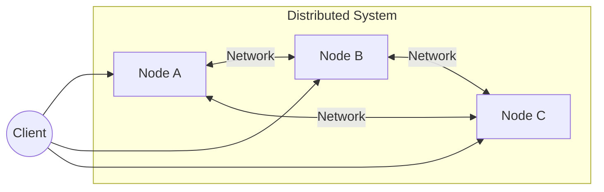
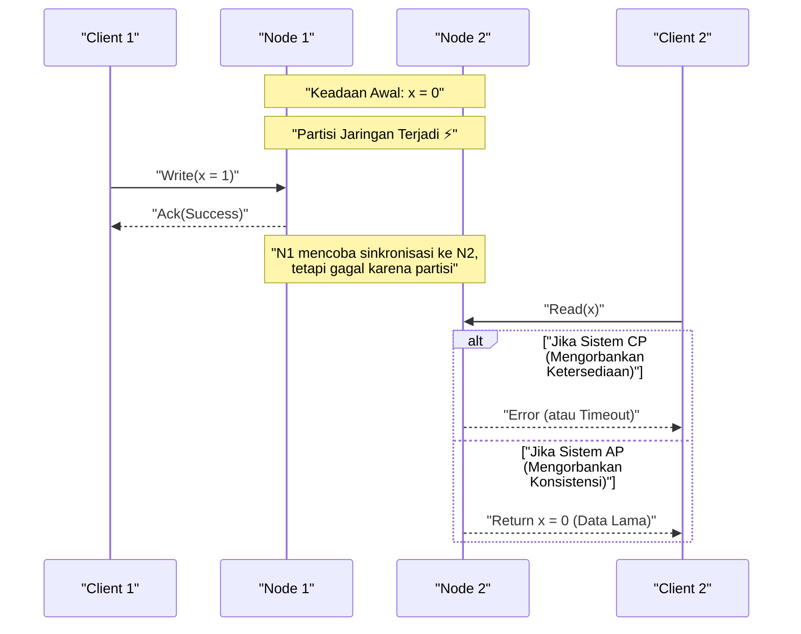
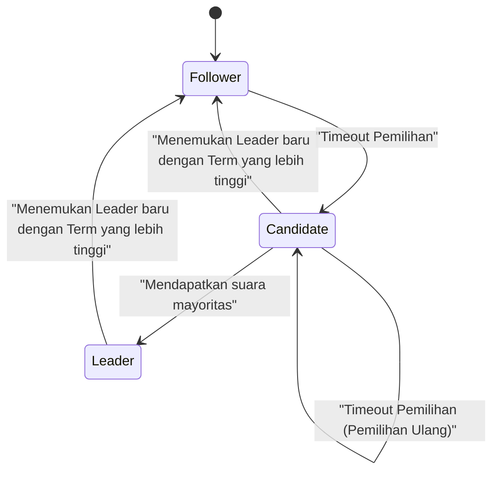

Dalam arsitektur perangkat lunak modern, mendistribusikan sistem telah menjadi persyaratan yang tidak bisa dihindari. Dengan memasyarakatnya komputasi awan (cloud computing), adopsi arsitektur layanan mikro (microservices), dan peningkatan permintaan pemrosesan data besar (big data), pendekatan mengandalkan satu server yang kuat (scale-up) tidak lagi menjadi arus utama, melainkan digantikan oleh kolaborasi banyak server murah (scale-out).

Namun, dalam membangun dan mengoperasikan sistem terdistribusi, para insinyur selalu dihadapkan pada pilihan yang berat. Itu adalah pertukaran (trade-off) antara **Konsistensi Data (Data [Consistency](https://kenji.blog/id/p/cap-theorem-distributed-systems-tradeoff/))** dan **Ketersediaan Sistem (System [Availability](https://kenji.blog/id/p/cap-theorem-distributed-systems-tradeoff/))** . Dilema esensial ini dibuktikan secara matematis dan dirumuskan dalam **Teorema CAP** (CAP theorem).

Dalam artikel ini, kita akan membahas secara mendalam mulai dari dasar teorema CAP, pembuktiannya, bagaimana database terdistribusi modern menghadapi dilema ini, hingga **Teorema PACELC** yang merupakan perluasan dari teorema CAP, lengkap dengan rumus, ilustrasi, dan contoh implementasi.

## 1. Apa itu Sistem Terdistribusi?

Sebelum membahas teorema CAP, mari kita perjelas apa yang dimaksud dengan **Sistem Terdistribusi** ([Distributed System](https://kenji.blog/id/p/cap-theorem-distributed-systems-tradeoff/)).

Sistem terdistribusi adalah sekumpulan komputer independen (node) yang saling terhubung melalui jaringan, yang bagi pengguna terlihat bertindak sebagai satu sistem yang koheren dan utuh.



Tujuan utama dari sistem terdistribusi adalah sebagai berikut:

1.  **Skalabilitas (Scalability)** : Meningkatkan kapasitas pemrosesan sistem secara keseluruhan dengan menambahkan node saat lalu lintas atau volume data meningkat.
2.  **Ketersediaan ([Availability](https://kenji.blog/id/p/cap-theorem-distributed-systems-tradeoff/))** : Jika beberapa node mengalami kegagalan, node lain tetap melanjutkan pemrosesan sehingga layanan secara keseluruhan tetap berjalan.
3.  **Kinerja (Performance)** : Untuk pengguna yang tersebar secara geografis, node yang secara fisik lebih dekat akan memberikan respons sehingga mengurangi latensi.

Namun, karena dibangun di atas fondasi jaringan yang tidak stabil, sistem terdistribusi selalu menghadapi tantangan yang tak terhindarkan seperti "partisi jaringan" atau "penundaan dan kehilangan pesan".

## 2. 3 Elemen Teorema CAP

Teorema CAP diusulkan oleh Eric Brewer pada tahun 2000, dan dibuktikan secara ketat oleh Seth Gilbert dan Nancy Lynch pada tahun 2002.

Teorema ini menyatakan bahwa dalam sebuah sistem terdistribusi, dari 3 karakteristik berikut, hanya dapat dipenuhi **maksimal 2** secara bersamaan.

1.  **C: [Consistency](https://kenji.blog/id/p/cap-theorem-distributed-systems-tradeoff/)** (Konsistensi)
2.  **A: Availability** (Ketersediaan)
3.  **P: [Partition Tolerance](https://kenji.blog/id/p/cap-theorem-distributed-systems-tradeoff/)** (Toleransi Partisi)

Mari kita lihat definisi ketat masing-masing.

### 2.1. Consistency (Konsistensi)

Konsistensi di sini mengacu pada **Linearizability** (Kelinearitasan) atau **Strong Consistency** (Konsistensi Kuat).

Definisinya adalah, "semua klien akan selalu membaca data tulisan terbaru, atau pembacaan tersebut gagal". Ke node mana pun dalam sistem terdistribusi Anda mengakses, Anda harus melihat data terbaru, seolah-olah Anda mengakses satu node tunggal.

Secara matematis, jika operasi penulisan $ W(x=v) $ selesai pada waktu $ t_1 $, maka setiap operasi pembacaan $ R(x) $ yang dilakukan pada waktu $ t_2 $ ($ t_2 > t_1 $) harus mengembalikan nilai $ v $ atau nilai baru yang ditulis setelahnya.

### 2.2. Availability (Ketersediaan)

Ketersediaan adalah karakteristik di mana "semua node yang tidak mengalami kegagalan pasti mengembalikan respons yang valid untuk setiap permintaan (baca, tulis)".

Meskipun sebagian sistem sedang down (mati), klien yang dapat mencapai node yang masih hidup dijamin akan menerima hasil (data atau respons berhasil), dan bukan sebuah error. Yang penting di sini adalah ketersediaan tidak menjamin dikembalikannya "data terbaru".

### 2.3. Partition Tolerance (Toleransi Partisi)

Toleransi partisi adalah karakteristik di mana "sistem tetap beroperasi meskipun komunikasi antar node dalam jaringan hilang atau tertunda secara acak".

Sebagai sebuah sistem terdistribusi, partisi jaringan (Network Partition) adalah kejadian yang tak terhindarkan. Kabel putus, kegagalan sakelar (switch), atau penundaan jaringan yang ekstrem dapat menyebabkan sistem terbagi (terpartisi) menjadi beberapa grup yang tidak dapat berkomunikasi satu sama lain.

## 3. Pemahaman Intuitif tentang Bukti Teorema CAP

Mengapa kita tidak dapat memenuhi ketiga hal tersebut secara bersamaan? Mari kita buktikan dengan eksperimen pemikiran yang sederhana.

Bayangkan sebuah database terdistribusi yang terdiri dari 2 node: $ N_1 $ dan $ N_2 $. Nilai awal dari data $ x $ adalah $ 0 $.



1.  **Terjadinya Partisi**: Jaringan antara $ N_1 $ dan $ N_2 $ terputus ( **P** terjadi).
2.  **Permintaan Penulisan (Write)**: Seorang klien melakukan penulisan $ x = 1 $ ke $ N_1 $.
3.  **Timbulnya Dilema**: Segera setelah ini, klien lain mengirimkan permintaan membaca (read) $ x $ ke $ N_2 $.

Di sini sistem dipaksa untuk mengambil keputusan.

*   **Jika Memilih Konsistensi (C)** : $ N_2 $ tidak mengetahui data terbaru dari $ N_1 $. Oleh karena itu, $ N_2 $ tidak boleh mengembalikan data lama ($ 0 $), dan harus mengembalikan error kepada klien atau memblokir respons. Ini berarti **Hilangnya Ketersediaan (A)** . (Sistem CP)
*   **Jika Memilih Ketersediaan (A)** : $ N_2 $ harus mengembalikan respons apa pun. Oleh karena itu, ia mengembalikan data lama yang dimilikinya ($ 0 $). Karena ini bukan data terbaru ($ 1 $), ini berarti **Hilangnya Konsistensi (C)** . (Sistem AP)

Dalam sistem terdistribusi di dunia nyata di mana partisi jaringan ( **P** ) sangat mungkin terjadi, kita selalu harus memilih antara **CP** atau **AP**. Pilihan "CA" hanya masuk akal di bawah premis tidak realistis bahwa "partisi jaringan tidak pernah terjadi", seperti pada server tunggal.

## 4. Quorum dan Penyesuaian Konsistensi

Dalam banyak database terdistribusi (contoh: [Cassandra](https://kenji.blog/id/p/nosql-database-selection-kvs-document-graph-wide-column/), DynamoDB, dll.), sistem secara keseluruhan tidak terikat kaku pada CP atau AP, melainkan menyeimbangkan C dan A menggunakan parameter yang disebut **Quorum** untuk setiap permintaan.

Misalkan jumlah replika adalah $ N $.
Misalkan jumlah node yang perlu merespons agar penulisan dianggap berhasil adalah $ W $.
Misalkan jumlah node yang dihubungi saat membaca adalah $ R $.

Kondisi untuk menjamin konsistensi kuat diekspresikan dengan rumus berikut:

$ W + R > N $

Jika kondisi ini terpenuhi, pasti akan ada tumpang tindih (overlap) antara himpunan node baca dan himpunan node tulis, sehingga data dapat dibaca dari node yang menyimpan data terbaru.

```python
class QuorumSystem:
    def __init__(self, n_replicas):
        self.N = n_replicas
        
    def check_consistency(self, w_nodes, r_nodes):
        """
        Jika W + R > N terpenuhi, menjamin Konsistensi Kuat (Strong Consistency)
        """
        if w_nodes + r_nodes > self.N:
            return "Strong Consistency (W+R > N)"
        else:
            return "Eventual Consistency (W+R <= N)"

# Contoh konfigurasi dalam sistem dengan N=3
system = QuorumSystem(3)
print(system.check_consistency(W=2, R=2))  # 2 + 2 > 3 -> Strong Consistency
print(system.check_consistency(W=1, R=1))  # 1 + 1 <= 3 -> Eventual Consistency (Cepat tapi berisiko membaca data lama)
```

Misalnya, ketika $ N = 3 $:
*   Jika diatur ke $ W=2, R=2 $, konsistensi selalu dijamin. Namun, jika 2 node mati, proses membaca dan menulis akan gagal (cenderung CP).
*   Jika diatur ke $ W=1, R=1 $, sistem menjadi sangat cepat dan memiliki ketersediaan tinggi, tetapi Anda mungkin membaca data lama (cenderung AP, eventual consistency).

## 5. Dari Teorema CAP ke Teorema PACELC

Teorema CAP hanya mendefinisikan perilaku "saat terjadi partisi jaringan (Partition)". Namun, pertukaran (trade-off) dalam desain sistem tetap ada bahkan ketika sistem beroperasi normal (tanpa partisi). Hal ini disempurnakan oleh Daniel Abadi dari Universitas Yale pada tahun 2010 melalui **Teorema PACELC**.

PACELC dapat dibaca sebagai berikut:

*   **If P (Partition)** : Jika partisi terjadi,
*   **A or C** : Pilih Ketersediaan ( **A** vailability) atau Konsistensi ( **C** onsistency).
*   **E (Else)** : Jika sebaliknya (keadaan normal tanpa partisi),
*   **L or C** : Pilih Latensi ( **L** atency) atau Konsistensi ( **C** onsistency).

Dalam sistem terdistribusi, jika data ditulis secara sinkron ke semua node (memilih C), kecepatan respons (latensi) akan memburuk karena overhead komunikasi (mengorbankan L). Sebaliknya, jika data ditulis hanya ke beberapa node secara asinkron lalu mengembalikan respons (memilih L), akan ada waktu di mana data untuk sementara tidak konsisten (mengorbankan C).

### 5.1. Klasifikasi PACELC dari Database Populer

*   **PC/EC** (HBase, [MongoDB](https://kenji.blog/id/p/nosql-database-selection-kvs-document-graph-wide-column/), Zookeeper)
    *   Memprioritaskan konsistensi saat partisi (PC). Juga memprioritaskan konsistensi saat keadaan normal dan mentolerir latensi (EC).
*   **PA/EL** ([Cassandra](https://kenji.blog/id/p/nosql-database-selection-kvs-document-graph-wide-column/), Riak, DynamoDB)
    *   Memprioritaskan ketersediaan saat partisi (PA). Memprioritaskan latensi rendah saat normal, dan menerima konsistensi pada akhirnya/eventual consistency (EL).
*   **PA/EC** (MySQL Cluster, dll.)
    *   Memprioritaskan ketersediaan saat partisi, tetapi mencoba mempertahankan konsistensi saat normal.

## 6. Penyelesaian Konflik dengan Jam Vektor (Vector Clocks)

Dalam sistem AP, jika data diperbarui secara terpisah pada beberapa node selama partisi jaringan, **Konflik (Conflict)** data akan terjadi ketika partisi diselesaikan. **Jam Vektor (Vector Clocks)** banyak digunakan sebagai mekanisme untuk mendeteksi dan menyelesaikan konflik ini.

Jam Vektor adalah array jam logis di mana setiap node menyimpan jumlah pembaruannya sendiri.

Keadaannya dinyatakan sebagai berikut:
$ V = [c_1, c_2, \dots, c_n] $
Di mana $ c_i $ adalah penghitung pembaruan (update counter) pada node $ i $.

Mari implementasikan algoritma deteksi konflik jam vektor sederhana dalam Python.

```python
class VectorClock:
    def __init__(self, node_ids):
        self.clock = {node_id: 0 for node_id in node_ids}
        
    def increment(self, node_id):
        self.clock[node_id] += 1
        
    def merge(self, other_clock):
        for k, v in other_clock.items():
            self.clock[k] = max(self.clock[k], v)

def compare_clocks(v1, v2):
    """
    Mengembalikan -1 jika v1 adalah leluhur dari v2
    Mengembalikan 1 jika v2 adalah leluhur dari v1
    Mengembalikan 0 jika berjalan secara bersamaan/paralel (konflik)
    """
    v1_is_smaller = False
    v2_is_smaller = False
    
    for k in v1.keys():
        if v1[k] < v2[k]:
            v1_is_smaller = True
        elif v1[k] > v2[k]:
            v2_is_smaller = True
            
    if v1_is_smaller and not v2_is_smaller:
        return -1 # v1 -> v2
    elif v2_is_smaller and not v1_is_smaller:
        return 1  # v2 -> v1
    else:
        return 0  # Conflict!

# Simulasi skenario
nodes = ['A', 'B']
v_init = VectorClock(nodes)

# Pembaruan pada node A
v_A = VectorClock(nodes)
v_A.clock = v_init.clock.copy()
v_A.increment('A')

# Selama partisi: Pembaruan lain pada node B
v_B = VectorClock(nodes)
v_B.clock = v_init.clock.copy()
v_B.increment('B')

# Perbandingan
result = compare_clocks(v_A.clock, v_B.clock)
if result == 0:
    print(f"Konflik terdeteksi! v_A:{v_A.clock}, v_B:{v_B.clock}")
    print("Diperlukan untuk menjalankan logika penggabungan (merge) di sisi klien atau menerapkan LWW (Last Write Wins).")
```

Dengan menggunakan jam vektor dengan cara ini, Anda dapat menentukan secara matematis dan andal "mana yang lebih baru" atau "apakah data diedit secara bersamaan (berkonflik)". Amazon Dynamo dan sistem lainnya menyadari sistem dengan ketersediaan tinggi (high availability) berdasarkan mekanisme ini.

## 7. Algoritma Konsensus [Raft](https://kenji.blog/id/p/byzantine-generals-problem-consensus/) dan Sistem CP

Di sisi lain, dalam sistem CP (seperti Zookeeper atau etcd), **Algoritma Konsensus ([Consensus Algorithm](https://kenji.blog/id/p/byzantine-generals-problem-consensus/))** sangat penting untuk menjaga konsistensi sekaligus mencegah "Split-brain" selama partisi. Algoritma yang paling banyak digunakan dalam beberapa tahun terakhir adalah **Raft**.

Raft memastikan konsistensi kuat dengan memilih satu-satunya **Pemimpin (Leader)** dalam sistem dan merutekan semua operasi penulisan melaluinya. Jika terjadi partisi jaringan, hanya kelompok yang dapat berkomunikasi dengan mayoritas (Quorum) node yang dapat memilih pemimpin baru, sementara pemimpin di pihak yang kehilangan mayoritas akan berhenti berfungsi. Dengan cara ini, konsistensi dipertahankan, namun dengan biaya hilangnya ketersediaan pada kelompok minoritas (inilah esensi dari CP).



Keamanan [Raft](https://kenji.blog/id/p/byzantine-generals-problem-consensus/) bergantung pada prinsip-prinsip berikut:

1.  **Election Safety (Keamanan Pemilihan)** : Maksimal hanya ada satu pemimpin yang dapat dipilih dalam periode (Term) tertentu.
2.  **Leader Append-Only (Pemimpin Hanya Menambahkan)** : Pemimpin tidak pernah menimpa atau menghapus entri di log-nya sendiri; pemimpin hanya dapat menambahkan entri baru.
3.  **Log Matching (Pencocokan Log)** : Jika dua log berisi entri dengan indeks dan Term yang sama, maka semua entri sebelumnya identik.

Hal ini secara matematis dan algoritmik sepenuhnya menghilangkan inkonsistensi data di lingkungan terdistribusi. `etcd`, datastore backend dari [Kubernetes](https://kenji.blog/id/p/kubernetes-k8s-architecture-pod-service-ingress/), juga menggunakan [Raft](https://kenji.blog/id/p/byzantine-generals-problem-consensus/) untuk mencapai manajemen status (state management) klaster yang ketat.

## 8. Layanan Mikro ([Microservices](https://kenji.blog/id/p/microservices-architecture-bff-api-gateway/)) dan Transaksi

Teorema CAP tidak hanya terbatas pada database tunggal, tetapi juga memiliki dampak yang mendalam pada **Arsitektur Microservices (Layanan Mikro)** modern.

Dalam aplikasi monolitik, konsistensi data dapat dengan mudah dipertahankan melalui transaksi [ACID](https://kenji.blog/id/p/rdbms-transaction-acid-isolation-level-lock/) menggunakan database relasional tunggal. Namun, dengan layanan mikro di mana layanan dan database dibagi berdasarkan domain bisnis, transaksi terdistribusi yang mencakup berbagai layanan menjadi sebuah keharusan.

Di sinilah teorema CAP menunjukkan taringnya. Jika Anda menuntut konsistensi kuat (C) menggunakan transaksi terdistribusi (contoh: Two-Phase Commit - 2PC), sistem keseluruhan akan terblokir jika salah satu layanan down atau jika ada latensi komunikasi, sehingga secara drastis menurunkan ketersediaan (A) dan latensi (L).

Untuk mengatasi masalah ini, **Pola Saga (Saga Pattern)** diadopsi secara luas di dunia layanan mikro.

Pola Saga adalah teknik yang membagi satu transaksi besar menjadi serangkaian transaksi lokal yang berkelanjutan, dan mengoordinasikannya menggunakan antrean pesan (messaging) asinkron (seperti [Kafka](https://kenji.blog/id/p/event-driven-architecture-message-queue-kafka-rabbitmq/) atau [RabbitMQ](https://kenji.blog/id/p/event-driven-architecture-message-queue-kafka-rabbitmq/)).

```mermaid
flowchart TD
    Order["Layanan Pesanan"] -->|"1. Buat Pesanan"| MessageBroker(("Message Broker"))
    MessageBroker -->|"2. Notifikasi Event"| Payment["Layanan Pembayaran"]
    Payment -->|"3. Event Pembayaran Selesai"| MessageBroker
    MessageBroker -->|"4. Notifikasi Event"| Inventory["Layanan Inventaris"]
    
    Inventory -- "Jika Gagal" -->|"Transaksi Kompensasi"| Compensate["Event Alokasi Inventaris Gagal"]
    Compensate --> MessageBroker
    MessageBroker -->|"Batal"| Order
```

Dalam Pola Saga, konsistensi kuat ditinggalkan demi **Konsistensi pada Akhirnya (Eventual [Consistency](https://kenji.blog/id/p/cap-theorem-distributed-systems-tradeoff/))** (Pendekatan AP). Jika proses gagal di tengah jalan, alih-alih melakukan rollback biasa, kita mengeluarkan **Transaksi Kompensasi (Compensating [Transaction](https://kenji.blog/id/p/rdbms-transaction-acid-isolation-level-lock/))** untuk mengimplementasikan proses logis yang mengembalikan status sebelumnya. Hal ini memungkinkan pencapaian tingkat konsistensi yang dapat ditolerir secara bisnis, sambil mempertahankan skalabilitas dan ketersediaan yang tinggi.

## Ringkasan

Dalam artikel ini, kita telah menggali jauh ke dalam Teorema CAP, prinsip paling penting dalam sistem terdistribusi.

*   **Teorema CAP** menunjukkan bahwa tidak mungkin untuk secara bersamaan memenuhi ketiga syarat: Konsistensi (Consistency), Ketersediaan ([Availability](https://kenji.blog/id/p/cap-theorem-distributed-systems-tradeoff/)), dan Toleransi Partisi ([Partition Tolerance](https://kenji.blog/id/p/cap-theorem-distributed-systems-tradeoff/)) dalam sebuah sistem terdistribusi. Di dunia nyata di mana partisi (P) tak terhindarkan, ini secara de facto menjadi pilihan antara **CP** atau **AP**.
*   **Teorema PACELC** memperluas hal ini, menunjukkan bahwa bahkan selama operasi normal tanpa partisi, terdapat pertukaran (trade-off) antara latensi (L) dan konsistensi (C).
*   Dengan menggunakan **Quorum**, Anda dapat secara fleksibel menyesuaikan keseimbangan ( $ W+R>N $ ) antara konsistensi dan ketersediaan sesuai dengan kebutuhan Anda.
*   Dalam sistem AP, **Jam Vektor (Vector Clocks)** digunakan untuk resolusi konflik, sedangkan dalam sistem CP, algoritma konsensus seperti **[Raft](https://kenji.blog/id/p/byzantine-generals-problem-consensus/)** dimanfaatkan untuk pengurutan log yang ketat.
*   Konsep-konsep ini merupakan pengetahuan dasar yang sangat penting tidak hanya untuk database, tetapi juga untuk desain transaksi terdistribusi (seperti Pola Saga) dalam **Arsitektur [Microservices](https://kenji.blog/id/p/microservices-architecture-bff-api-gateway/)** modern.

Tidak ada "peluru perak" dalam desain sistem. Memahami Teorema CAP dan Teorema PACELC secara benar, menilai dengan tepat apakah kebutuhan bisnis mengharuskan Anda "melindungi konsistensi bagaimanapun caranya (seperti pada sistem pembayaran)" atau "sistem pantang mati meskipun menoleransi inkonsistensi sementara (seperti timeline media sosial)", dan membuat keputusan trade-off yang optimal—inilah keterampilan terbesar yang dituntut dari seorang arsitek yang hebat.
