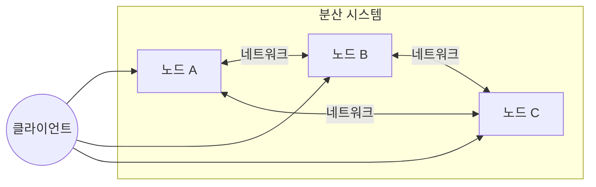
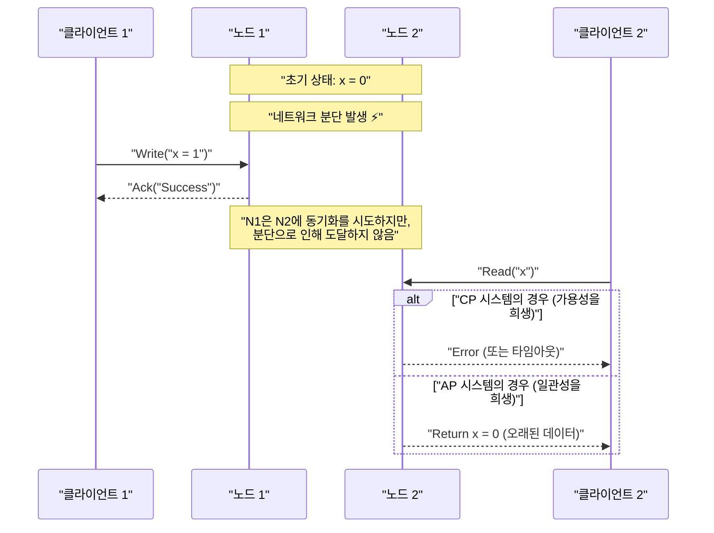
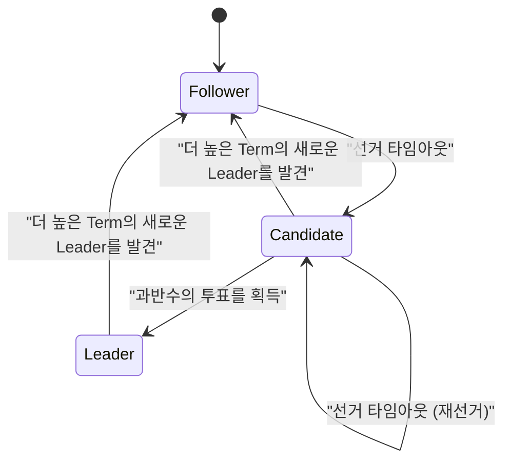
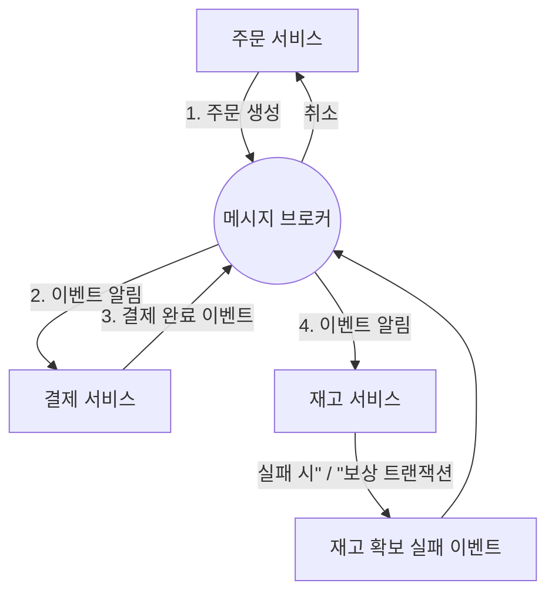

현대의 소프트웨어 아키텍처에 있어서, 시스템을 분산화시키는 것은 이제 피할 수 없는 요건이 되었습니다. 클라우드 컴퓨팅의 보급, 마이크로서비스 아키텍처의 도입, 그리고 빅데이터 처리 수요 증가로 인해, 단일의 강력한 서버(스케일 업)에 의존하는 것이 아니라 다수의 저렴한 서버를 연동시키는(스케일 아웃) 접근 방식이 주류가 되었습니다.

그러나 분산 시스템을 구축하고 운영하는 데 있어서, 엔지니어는 항상 무거운 선택을 강요받습니다. 그것은 '데이터의 일관성'과 '시스템의 가용성'의 트레이드오프입니다. 이 본질적인 딜레마를 수학적으로 증명하고 공식화한 것이 **CAP 정리** (CAP theorem)입니다.

본 기사에서는 CAP 정리의 기초부터 그 증명, 나아가 현대의 분산 데이터베이스가 이 딜레마에 어떻게 대처하고 있는지, 그리고 CAP 정리를 확장한 **PACELC 정리** 에 이르기까지, 수식, 도해 및 구현 예시를 섞어 매우 상세하게 깊이 파헤쳐 보겠습니다.

## 1. 분산 시스템이란 무엇인가?

CAP 정리에 대해 이야기하기 전에, 우선 **분산 시스템** ([Distributed System](https://kenji.blog/ko/p/cap-theorem-distributed-systems-tradeoff/))이란 무엇인지를 명확히 해둡시다.

분산 시스템이란, 네트워크로 상호 연결된 여러 독립적인 컴퓨터(노드)가 사용자에게는 단일의 일관된 시스템인 것처럼 동작하는 시스템을 말합니다.



분산 시스템의 주요 목적은 다음과 같습니다.

1.  **확장성** : 트래픽이나 데이터량이 증가했을 때, 노드를 추가함으로써 시스템 전체의 처리 능력을 향상시킨다.
2.  **가용성** : 일부 노드에 장애가 발생해도, 다른 노드가 처리를 계속함으로써 시스템 전체적으로는 서비스를 계속 제공한다.
3.  **성능** : 지리적으로 분산된 사용자에 대해, 물리적으로 가까운 노드가 응답함으로써 레이턴시를 줄인다.

그러나 네트워크라는 불안정한 기반 위에 구축되는 이상, 분산 시스템에는 '네트워크 분단'이나 '메시지 지연 및 손실'과 같은 피할 수 없는 과제가 수반됩니다.

## 2. CAP 정리의 3가지 요소

CAP 정리는 2000년에 에릭 브루어(Eric Brewer)에 의해 제창되었고, 2002년에 세스 길버트(Seth Gilbert)와 낸시 린치(Nancy Lynch)에 의해 엄밀하게 증명되었습니다.

정리는 분산 시스템에서 다음의 3가지 특성 중, 동시에 만족시킬 수 있는 것은 **최대 2개** 까지라고 주장하고 있습니다.

1.  **C: [Consistency](https://kenji.blog/ko/p/cap-theorem-distributed-systems-tradeoff/)** (일관성)
2.  **A: [Availability](https://kenji.blog/ko/p/cap-theorem-distributed-systems-tradeoff/)** (가용성)
3.  **P: [Partition Tolerance](https://kenji.blog/ko/p/cap-theorem-distributed-systems-tradeoff/)** (분단 내성)

각각에 대해 엄밀한 정의를 살펴보겠습니다.

### 2.1. Consistency (일관성)

여기서의 일관성이란, **선형화 가능성** (Linearizability) 또는 **강한 일관성** (Strong Consistency)을 가리킵니다.

정의로는 "모든 클라이언트가 항상 최신 쓰기 데이터를 읽을 수 있거나, 읽기가 실패하는" 상태입니다. 분산 시스템 내의 어느 노드에 액세스하더라도, 마치 단일 노드에 액세스하는 것처럼 최신의 데이터가 보여야 합니다.

수학적으로 표현하면, 쓰기 작업 $ W(x=v) $ 가 시간 $ t_1 $ 에 완료된 경우, 시간 $ t_2 $ ( $ t_2 > t_1 $ )에 이루어지는 임의의 읽기 작업 $ R(x) $ 는 반드시 $ v $ 또는 그 이후에 쓰여진 새로운 값을 반환해야 합니다.

### 2.2. Availability (가용성)

가용성이란 "장애가 발생하지 않은 모든 노드는 모든 요청(읽기, 쓰기)에 대해 반드시 타당한 응답을 반환한다"는 특성입니다.

시스템의 일부가 다운되어 있어도, 살아있는 노드에 도달할 수 있었던 클라이언트는 에러가 아니라 반드시 결과(데이터나 성공 응답)를 받을 수 있습니다. 여기서 중요한 것은, 가용성이 '최신 데이터'를 보장하는 것은 아니라는 점입니다.

### 2.3. Partition Tolerance (분단 내성)

분단 내성이란 "네트워크에 의해 노드 간의 통신이 임의로 손실되거나 지연되더라도, 시스템으로서 계속 가동한다"는 특성입니다.

분산 시스템인 이상, 네트워크 분단(Network Partition)은 피할 수 없는 현상입니다. 케이블 단선, 스위치 장애 또는 극단적인 네트워크 지연으로 인해 시스템이 통신 불가능한 여러 그룹으로 분단될 가능성이 있습니다.

## 3. CAP 정리 증명의 직관적 이해

왜 이들 3가지를 동시에 만족시킬 수 없는 것일까요. 간단한 사고 실험으로 증명해 봅시다.

노드 $ N_1 $ 과 $ N_2 $ 두 개로 이루어진 분산 데이터베이스를 상상해 보십시오. 데이터 $ x $ 의 초기값은 $ 0 $ 입니다.



1.  **분단의 발생** : $ N_1 $ 과 $ N_2 $ 사이의 네트워크가 끊어졌습니다( **P** 가 발생).
2.  **쓰기 요청** : 클라이언트가 $ N_1 $ 에 대해 $ x = 1 $ 의 쓰기를 수행합니다.
3.  **딜레마의 발생** : 이 직후, 다른 클라이언트가 $ N_2 $ 에 $ x $ 의 읽기 요청을 보냈습니다.

여기서 시스템은 결단을 강요받습니다.

*   **일관성(C)을 선택할 경우** : $ N_2 $ 는 $ N_1 $ 의 최신 데이터를 모릅니다. 따라서 $ N_2 $ 는 오래된 데이터( $ 0 $ )를 반환할 수는 없으며, 클라이언트에게 에러를 반환하거나 응답을 차단해야 합니다. 이는 **가용성(A)의 상실** 입니다. (CP 시스템)
*   **가용성(A)을 선택할 경우** : $ N_2 $ 는 어떠한 응답을 반환해야 합니다. 따라서 자신이 가지고 있는 오래된 데이터( $ 0 $ )를 반환합니다. 이는 최신 데이터( $ 1 $ )가 아니기 때문에, **일관성(C)의 상실** 입니다. (AP 시스템)

네트워크 분단( **P** )이 일어날 수 있는 현실의 분산 시스템에서, 우리는 반드시 **CP** 나 **AP** 중 하나를 선택해야만 합니다. 'CA'라는 선택지는 단일 서버 등 '네트워크 분단이 결코 일어나지 않는다'는 비현실적인 전제하에서만 성립합니다.

## 4. Quorum(쿼럼)과 일관성 튜닝

많은 분산 데이터베이스(예: [Cassandra](https://kenji.blog/ko/p/nosql-database-selection-kvs-document-graph-wide-column/), DynamoDB 등)에서는 시스템 전체를 고정된 CP나 AP에 묶어두는 것이 아니라, 요청마다 **Quorum** (쿼럼, 정족수)을 이용한 파라미터 조정을 통해 C와 A의 균형을 조절할 수 있게 되어 있습니다.

레플리카 수를 $ N $ 이라고 합시다.
쓰기가 성공했다고 간주하기 위해 응답이 필요한 노드 수를 $ W $ 라고 합시다.
읽기 시에 쿼리하는 노드 수를 $ R $ 이라고 합시다.

강한 일관성을 보장하기 위한 조건은 다음의 수식으로 표현됩니다.

$ W + R > N $

이 조건이 만족될 경우, 읽기 노드의 집합과 쓰기 노드의 집합에 반드시 중복(오버랩)이 발생하므로 최신 데이터를 포함하는 노드로부터 데이터를 읽을 수 있습니다.

```python
class QuorumSystem:
    def __init__(self, n_replicas):
        self.N = n_replicas
        
    def check_consistency(self, w_nodes, r_nodes):
        """
        W + R > N 을 만족하면 강한 일관성(Strong Consistency)을 보장한다
        """
        if w_nodes + r_nodes > self.N:
            return "Strong Consistency (W+R > N)"
        else:
            return "Eventual Consistency (W+R <= N)"

# N=3 인 시스템에서의 설정 예
system = QuorumSystem(3)
print(system.check_consistency(W=2, R=2))  # 2 + 2 > 3 -> Strong Consistency
print(system.check_consistency(W=1, R=1))  # 1 + 1 <= 3 -> Eventual Consistency (빠르지만 오래된 데이터를 읽을 가능성)
```

예를 들어 $ N = 3 $ 일 때:
*   $ W=2, R=2 $ 로 설정하면 항상 일관성이 보장됩니다. 그러나 노드가 2개 다운되면 읽기와 쓰기 모두 실패합니다(CP적).
*   $ W=1, R=1 $ 로 설정하면 빠르고 가용성이 높아지지만, 오래된 데이터를 읽을 가능성이 있습니다(AP적, 결과적 일관성).

## 5. CAP에서 PACELC 정리로

CAP 정리는 '네트워크 분단 시(Partition)'의 동작만을 정의하고 있습니다. 그러나 시스템이 정상적으로 가동하고 있는(분단이 없는) 상태에서도 시스템 설계에는 트레이드오프가 존재합니다. 이를 보완한 것이, 예일 대학교의 다니엘 아바디(Daniel Abadi)가 2010년에 제창한 **PACELC 정리** 입니다.

PACELC는 다음과 같이 읽을 수 있습니다.

*   **If P (Partition)** : 분단이 발생한 경우,
*   **A or C** : 가용성( **A** vailability)이나 일관성( **C** onsistency) 중 하나를 선택한다.
*   **E (Else)** : 그 외(분단이 발생하지 않은 정상 시)의 경우,
*   **L or C** : 레이턴시( **L** atency)나 일관성( **C** onsistency) 중 하나를 선택한다.

분산 시스템에서 모든 노드에 동기적으로 데이터를 쓰면(C를 선택), 통신 오버헤드로 인해 응답 속도(레이턴시)는 악화됩니다(L을 희생). 반대로 비동기적으로 일부 노드에만 쓰고 응답을 반환하면(L을 선택), 데이터가 일시적으로 불일치하는 시간이 발생합니다(C를 희생).

### 5.1. 대표적인 데이터베이스의 PACELC 분류

*   **PC/EC** (HBase, [MongoDB](https://kenji.blog/ko/p/nosql-database-selection-kvs-document-graph-wide-column/), Zookeeper)
    *   분단 시에는 일관성을 우선(PC). 정상 시에도 일관성을 우선하고, 레이턴시를 허용한다(EC).
*   **PA/EL** ([Cassandra](https://kenji.blog/ko/p/nosql-database-selection-kvs-document-graph-wide-column/), Riak, DynamoDB)
    *   분단 시에는 가용성을 우선(PA). 정상 시에는 낮은 레이턴시를 우선하고, 결과적 일관성(Eventual [Consistency](https://kenji.blog/ko/p/cap-theorem-distributed-systems-tradeoff/))을 받아들인다(EL).
*   **PA/EC** (MySQL Cluster 등)
    *   분단 시에는 가용성을 우선하면서도, 정상 시에는 일관성을 유지하려고 한다.

## 6. 벡터 클락(Vector Clocks)에 의한 충돌 해결

AP 시스템에서 네트워크 분단 중에 여러 노드에서 개별적으로 데이터가 업데이트되면, 분단 해소 시에 데이터의 **충돌** (Conflict)이 발생합니다. 이 충돌을 감지하고 해결하기 위한 메커니즘으로 **벡터 클락** 이 널리 사용되고 있습니다.

벡터 클락은 각 노드가 자신의 업데이트 횟수를 유지하는 논리 시계의 배열입니다.

상태는 다음과 같이 표현됩니다.
$ V = [c_1, c_2, \dots, c_n] $
여기서 $ c_i $ 는 노드 $ i $ 의 업데이트 카운터입니다.

Python으로 간단한 벡터 클락의 충돌 감지 알고리즘을 구현해 보겠습니다.

```python
class VectorClock:
    def __init__(self, node_ids):
        self.clock = {node_id: 0 for node_id in node_ids}
        
    def increment(self, node_id):
        self.clock[node_id] += 1
        
    def merge(self, other_clock):
        for k, v in other_clock.items():
            self.clock[k] = max(self.clock[k], v)

def compare_clocks(v1, v2):
    """
    v1이 v2의 조상이면 -1
    v2가 v1의 조상이면 1
    동시 병행(충돌)이면 0 을 반환한다
    """
    v1_is_smaller = False
    v2_is_smaller = False
    
    for k in v1.keys():
        if v1[k] < v2[k]:
            v1_is_smaller = True
        elif v1[k] > v2[k]:
            v2_is_smaller = True
            
    if v1_is_smaller and not v2_is_smaller:
        return -1 # v1 -> v2
    elif v2_is_smaller and not v1_is_smaller:
        return 1  # v2 -> v1
    else:
        return 0  # Conflict!

# 시나리오 시뮬레이션
nodes = ['A', 'B']
v_init = VectorClock(nodes)

# 노드 A에서 업데이트
v_A = VectorClock(nodes)
v_A.clock = v_init.clock.copy()
v_A.increment('A')

# 분단 중: 노드 B에서 별도의 업데이트
v_B = VectorClock(nodes)
v_B.clock = v_init.clock.copy()
v_B.increment('B')

# 비교
result = compare_clocks(v_A.clock, v_B.clock)
if result == 0:
    print(f"충돌을 감지했습니다! v_A:{v_A.clock}, v_B:{v_B.clock}")
    print("클라이언트 측에서 병합 로직을 실행하거나, LWW(Last Write Wins)를 적용해야 합니다.")
```

이와 같이 벡터 클락을 사용함으로써 "어느 쪽이 새로운가" 혹은 "병행하여 편집되었는가(충돌하고 있는가)"를 수학적이고 확실하게 판정할 수 있습니다. Amazon Dynamo 등은 이 메커니즘을 기반으로 고가용성 시스템을 실현했습니다.

## 7. [Raft](https://kenji.blog/ko/p/byzantine-generals-problem-consensus/) 합의 알고리즘과 CP 시스템

한편, CP 시스템(Zookeeper나 etcd 등)에서는 분단 시 스플릿 브레인(Split-brain)을 방지하면서 일관성을 유지하기 위해 **합의 알고리즘** 이 불가결합니다. 최근 가장 널리 사용되고 있는 것이 **Raft** 입니다.

Raft는 시스템 내에 유일한 **리더** (Leader)를 선출하고, 모든 쓰기 작업을 리더를 경유하여 수행함으로써 강력한 일관성을 보장합니다. 네트워크 분단이 발생한 경우, 과반수(Quorum)의 노드와 통신할 수 있는 그룹만이 새로운 리더를 선출할 수 있으며, 과반수를 잃은 쪽의 리더는 기능이 정지됩니다. 이로 인해 일관성이 지켜지는 대신 소수파 그룹에서는 가용성이 상실됩니다(이것이 CP의 진수입니다).



[Raft](https://kenji.blog/ko/p/byzantine-generals-problem-consensus/)의 안전성은 다음의 원칙에 의존하고 있습니다.

1.  **Election Safety** : 특정 임기(Term)에 있어서 최대 1명의 리더만이 선출된다.
2.  **Leader Append-Only** : 리더는 자신의 로그 엔트리를 덮어쓰거나 삭제하지 않으며, 추가만을 수행한다.
3.  **Log Matching** : 두 로그가 같은 인덱스와 Term을 가진 엔트리를 포함하고 있는 경우, 그 이전의 엔트리는 모두 동일하다.

이를 통해 분산 환경에서의 데이터 불일치를 수학적·알고리즘적으로 완전히 배제하고 있습니다. [Kubernetes](https://kenji.blog/ko/p/kubernetes-k8s-architecture-pod-service-ingress/)의 백엔드 데이터스토어인 `etcd`도 이 [Raft](https://kenji.blog/ko/p/byzantine-generals-problem-consensus/)를 채택함으로써 클러스터의 엄밀한 상태 관리를 실현하고 있습니다.

## 8. 마이크로서비스와 트랜잭션

CAP 정리는 데이터베이스 단일의 이야기에 그치지 않고, 현대의 **마이크로서비스 아키텍처** 에도 깊은 영향을 미치고 있습니다.

모놀리식 애플리케이션에서는 단일 관계형 데이터베이스를 사용한 [ACID](https://kenji.blog/ko/p/rdbms-transaction-acid-isolation-level-lock/) 트랜잭션에 의해 데이터의 일관성을 쉽게 유지할 수 있었습니다. 그러나 비즈니스 도메인별로 서비스와 데이터베이스가 분할된 마이크로서비스에서는 서비스를 넘나드는 분산 트랜잭션이 필요하게 됩니다.

여기서 CAP 정리가 이빨을 드러냅니다. 분산 트랜잭션(예: 2단계 커밋 - 2PC)을 사용하여 강한 일관성(C)을 요구하면, 어느 하나의 서비스가 다운되거나 통신 지연이 발생한 경우에 시스템 전체가 블록되어 가용성(A)과 레이턴시(L)가 현저히 저하됩니다.

이 문제에 대처하기 위해 마이크로서비스에서는 **Saga 패턴** 이 널리 채택되고 있습니다.

Saga 패턴은 거대한 1개의 트랜잭션을 로컬 트랜잭션의 연속으로 분할하고, 비동기 메시징([Kafka](https://kenji.blog/ko/p/event-driven-architecture-message-queue-kafka-rabbitmq/)나 [RabbitMQ](https://kenji.blog/ko/p/event-driven-architecture-message-queue-kafka-rabbitmq/) 등)을 사용하여 연동시키는 기법입니다.



Saga 패턴에서는 강한 일관성을 포기하고, **결과적 일관성** (Eventual [Consistency](https://kenji.blog/ko/p/cap-theorem-distributed-systems-tradeoff/))을 받아들입니다(AP적 접근). 도중에 처리가 실패한 경우에는 롤백 대신 **보상 트랜잭션** (Compensating [Transaction](https://kenji.blog/ko/p/rdbms-transaction-acid-isolation-level-lock/))을 발행하여 논리적으로 상태를 원래대로 되돌리는 처리를 구현합니다. 이를 통해 높은 확장성과 가용성을 유지하면서도 비즈니스상 허용할 수 있는 수준의 일관성을 실현하고 있는 것입니다.

## 정리

본 기사에서는 분산 시스템에서 가장 중요한 원칙인 CAP 정리에 대해 깊이 파헤쳐 보았습니다.

*   **CAP 정리** 는 분산 시스템에서 Consistency(일관성), [Availability](https://kenji.blog/ko/p/cap-theorem-distributed-systems-tradeoff/)(가용성), [Partition Tolerance](https://kenji.blog/ko/p/cap-theorem-distributed-systems-tradeoff/)(분단 내성)의 3가지를 동시에 만족시키는 것은 불가능하며, 분단(P)이 불가피한 현실 세계에서는 사실상 **CP** 거나 **AP** 의 선택이 됨을 보여줍니다.
*   **PACELC 정리** 는 이를 확장하여 분단이 발생하지 않은 정상 가동 시에도 레이턴시(L)와 일관성(C) 사이에 트레이드오프가 존재함을 보여주었습니다.
*   **Quorum** (정족수)을 사용함으로써 요구사항에 따라 유연하게 일관성과 가용성의 균형( $ W+R>N $ )을 조절할 수 있습니다.
*   AP 시스템에서는 충돌 해결을 위해 **벡터 클락** 이, CP 시스템에서는 엄밀한 순서 지정을 위해 **[Raft](https://kenji.blog/ko/p/byzantine-generals-problem-consensus/)** 와 같은 합의 알고리즘이 활용되고 있습니다.
*   이러한 개념은 데이터베이스뿐만 아니라 현대의 **마이크로서비스 아키텍처** 에 있어서 분산 트랜잭션 설계(Saga 패턴 등)에도 불가결한 기초 지식입니다.

시스템 설계에 '은탄환'은 존재하지 않습니다. CAP 정리와 PACELC 정리를 올바르게 이해하고, 자사의 비즈니스 요건이 '무슨 일이 있어도 일관성을 지켜야 하는(결제 등)' 것인지, '일시적인 불일치를 허용하더라도 절대 시스템을 멈추지 않는(SNS 타임라인 등)' 것인지를 적절히 파악하여, 최적의 트레이드오프를 선택하는 것이야말로 훌륭한 아키텍트에게 요구되는 가장 큰 스킬이라고 할 수 있을 것입니다.
