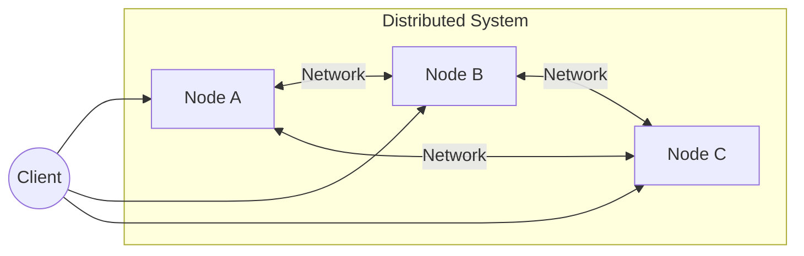
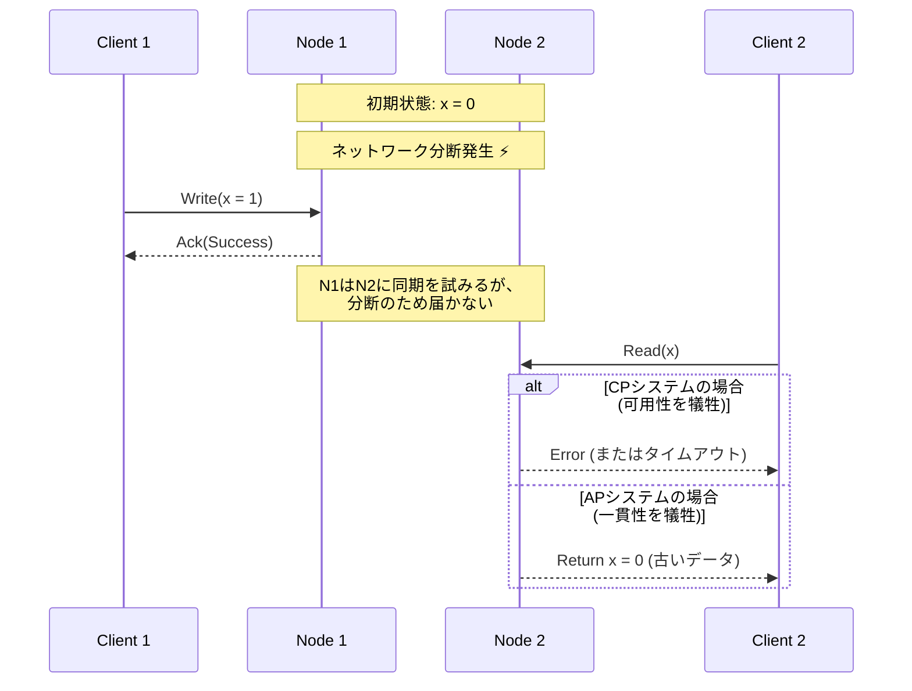
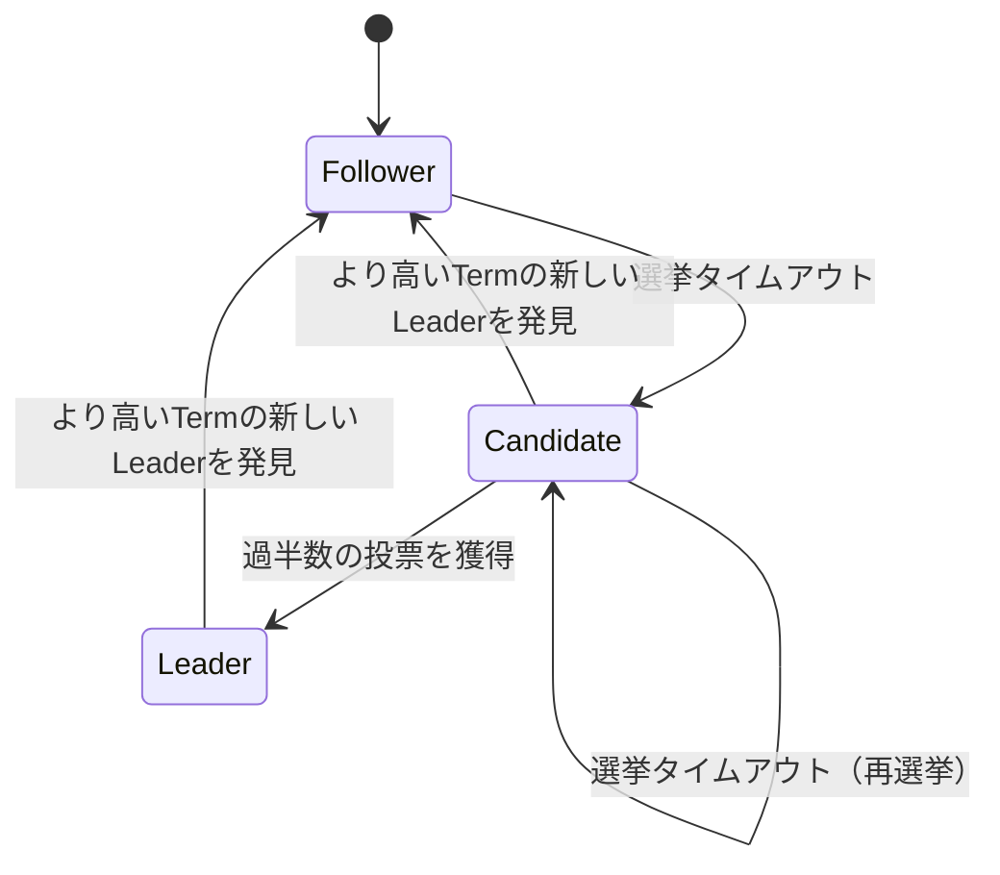

現代のソフトウェアアーキテクチャにおいて、システムを分散化させることはもはや避けて通れない要件となっています。クラウドコンピューティングの普及、[マイクロサービス](https://kenji.blog/p/microservices-architecture-bff-api-gateway/)アーキテクチャの採用、そしてビッグデータ処理の需要増加により、単一の強力なサーバー（スケールアップ）に依存するのではなく、多数の安価なサーバーを連携させる（スケールアウト）アプローチが主流となりました。

しかし、[分散システム](https://kenji.blog/p/cap-theorem-distributed-systems-tradeoff/)を構築・運用する上で、エンジニアは常に重い選択を迫られます。それは「データの一貫性」と「システムの可用性」のトレードオフです。この本質的なジレンマを数学的に証明し、定式化したのが **[CAP定理](https://kenji.blog/p/cap-theorem-distributed-systems-tradeoff/)** （CAP theorem）です。

本記事では、CAP定理の基礎からその証明、さらに現代の分散データベースがこのジレンマとどう向き合っているのか、そしてCAP定理を拡張した **PACELC定理** に至るまでを、数式、図解、および実装例を交えて極めて詳細に深掘りしていきます。

## 1. 分散システムとは何か？

CAP定理について語る前に、そもそも **分散システム** （[Distributed System](https://kenji.blog/p/cap-theorem-distributed-systems-tradeoff/)）とは何かを明確にしておきましょう。

分散システムとは、ネットワークで相互接続された複数の独立したコンピュータ（ノード）が、ユーザーからは単一の一貫したシステムであるかのように振る舞うシステムのことです。



[分散システム](https://kenji.blog/p/cap-theorem-distributed-systems-tradeoff/)の主な目的は以下の通りです。

1.  **スケーラビリティ** : トラフィックやデータ量が増加した際、ノードを追加することでシステム全体の処理能力を向上させる。
2.  **可用性** : 一部のノードに障害が発生しても、他のノードが処理を継続することでシステム全体としてはサービスを提供し続ける。
3.  **パフォーマンス** : 地理的に分散したユーザーに対し、物理的に近いノードが応答することでレイテンシを低減する。

しかし、ネットワークという不安定な基盤の上に構築される以上、分散システムには「ネットワーク分断」や「メッセージの遅延・欠損」といった避けられない課題が伴います。

## 2. [CAP定理](https://kenji.blog/p/cap-theorem-distributed-systems-tradeoff/)の3つの要素

CAP定理は、2000年にエリック・ブリュワー（Eric Brewer）によって提唱され、2002年にセス・ギルバート（Seth Gilbert）とナンシー・リンチ（Nancy Lynch）によって厳密に証明されました。

定理は、分散システムにおいて次の3つの特性のうち、同時に満たすことができるのは **最大で2つ** までである、と主張しています。

1.  **C: [Consistency](https://kenji.blog/p/cap-theorem-distributed-systems-tradeoff/)** （一貫性）
2.  **A: [Availability](https://kenji.blog/p/cap-theorem-distributed-systems-tradeoff/)** （可用性）
3.  **P: [Partition Tolerance](https://kenji.blog/p/cap-theorem-distributed-systems-tradeoff/)** （分断耐性）

それぞれについて、厳密な定義を見ていきましょう。

### 2.1. Consistency（一貫性）

ここでの一貫性とは、 **線形化可能性** （Linearizability）または **強い一貫性** （Strong Consistency）を指します。

定義としては、「すべてのクライアントが、常に最新の書き込みデータを読み取ることができる、あるいは読み取りが失敗する」という状態です。分散システム内のどのノードにアクセスしても、まるで単一のノードにアクセスしているかのように、最新のデータが見えなければなりません。

数学的に表現すると、書き込み操作 $ W(x=v) $ が時刻 $ t_1 $ に完了した場合、時刻 $ t_2 $ （ $ t_2 > t_1 $ ）に行われる任意の読み取り操作 $ R(x) $ は、必ず $ v $ またはそれ以降に書き込まれた新しい値を返さなければなりません。

### 2.2. Availability（可用性）

可用性とは、「障害を起こしていないすべてのノードは、すべてのリクエスト（読み取り、書き込み）に対して必ず妥当な応答を返す」という特性です。

システムの一部がダウンしていても、生き生きているノードに到達できたクライアントは、エラーではなく必ず結果（データや成功応答）を受け取ることができます。ここで重要なのは、可用性は「最新のデータ」を保証するものではないということです。

### 2.3. Partition Tolerance（分断耐性）

分断耐性とは、「ネットワークによってノード間の通信が任意に失われたり、遅延したりしても、システムとして稼働し続ける」という特性です。

分散システムである以上、ネットワークの分断（Network Partition）は避けられない事象です。ケーブルの切断、スイッチの障害、あるいは極端なネットワーク遅延によって、システムが通信不可能な複数のグループに分断される可能性があります。

## 3. CAP定理の証明の直感的な理解

なぜこれら3つを同時に満たすことができないのでしょうか。簡単な思考実験で証明してみましょう。

ノード $ N_1 $ と $ N_2 $ の2つからなる分散データベースを想像してください。データ $ x $ の初期値は $ 0 $ です。



1.  **分断の発生** : $ N_1 $ と $ N_2 $ の間のネットワークが切断されました（ **P** が発生）。
2.  **書き込みリクエスト** : クライアントが $ N_1 $ に対して $ x = 1 $ の書き込みを行います。
3.  **ジレンマの発生** : この直後、別のクライアントが $ N_2 $ に $ x $ の読み取りリクエストを送りました。

ここでシステムは決断を迫られます。

*   **一貫性（C）を選ぶ場合** : $ N_2 $ は $ N_1 $ の最新データを知りません。したがって、$ N_2 $ は古いデータ（ $ 0 $ ）を返すわけにはいかず、クライアントにエラーを返すか、応答をブ[ロック](https://kenji.blog/p/rdbms-transaction-acid-isolation-level-lock/)しなければなりません。これは **可用性（A）の喪失** です。（CPシステム）
*   **可用性（A）を選ぶ場合** : $ N_2 $ は何らかの応答を返さなければなりません。したがって、自分が持っている古いデータ（ $ 0 $ ）を返します。これは最新のデータ（ $ 1 $ ）ではないため、 **一貫性（C）の喪失** です。（APシステム）

ネットワーク分断（ **P** ）が起こり得る現実の[分散システム](https://kenji.blog/p/cap-theorem-distributed-systems-tradeoff/)において、我々は必ず **CP** か **AP** のどちらかを選択しなければならないのです。「CA」という選択肢は、単一サーバーなど「ネットワーク分断が決して起こらない」という非現実的な前提の下でのみ成立します。

## 4. Quorum（クオラム）と一貫性のチューニング

多くの分散データベース（例: [Cassandra](https://kenji.blog/p/nosql-database-selection-kvs-document-graph-wide-column/), DynamoDBなど）では、システム全体を固定のCPやAPに縛るのではなく、リクエストごとに **Quorum** （クオラム、定足数）を用いたパラメータ調整によって、CとAのバランスを調整できるようになっています。

レプリカ数を $ N $ とします。
書き込みが成功したと見なすために応答が必要なノード数を $ W $ とします。
読み取り時に問い合わせるノード数を $ R $ とします。

強い一貫性を保証するための条件は、以下の数式で表されます。

$$ W + R > N $$

この条件が満たされている場合、読み取りノードの集合と書き込みノードの集合に必ず重複（オーバーラップ）が生じるため、最新のデータを含むノードからデータを読み取ることができます。

```python
class QuorumSystem:
    def __init__(self, n_replicas):
        self.N = n_replicas
        
    def check_consistency(self, w_nodes, r_nodes):
        """
        W + R > N を満たせば強い一貫性(Strong Consistency)を保証する
        """
        if w_nodes + r_nodes > self.N:
            return "Strong Consistency (W+R > N)"
        else:
            return "Eventual Consistency (W+R <= N)"

# N=3 のシステムでの設定例
system = QuorumSystem(3)
print(system.check_consistency(W=2, R=2))  # 2 + 2 > 3 -> Strong Consistency
print(system.check_consistency(W=1, R=1))  # 1 + 1 <= 3 -> Eventual Consistency (高速だが古いデータを読む可能性)
```

例えば $ N = 3 $ のとき：
*   $ W=2, R=2 $ に設定すると、常に一貫性が保証されます。しかし、ノードが2つダウンすると読み書き両方が失敗します（CP的）。
*   $ W=1, R=1 $ に設定すると、高速かつ可用性が高くなりますが、古いデータを読み取る可能性があります（AP的、結果整合性）。

## 5. CAPからPACELC定理へ

[CAP定理](https://kenji.blog/p/cap-theorem-distributed-systems-tradeoff/)は「ネットワーク分断時（Partition）」の振る舞いしか定義していません。しかし、システムが正常に稼働している（分断がない）状態でも、システム設計にはトレードオフが存在します。これを補完したのが、イェール大学のダニエル・アバディ（Daniel Abadi）が2010年に提唱した **PACELC定理** です。

PACELCは次のように読めます。

*   **If P (Partition)** : 分断が発生した場合、
*   **A or C** : 可用性（ **A** vailability）か一貫性（ **C** onsistency）のどちらかを選ぶ。
*   **E (Else)** : それ以外（分断が発生していない正常時）の場合、
*   **L or C** : レイテンシ（ **L** atency）か一貫性（ **C** onsistency）のどちらかを選ぶ。

[分散システム](https://kenji.blog/p/cap-theorem-distributed-systems-tradeoff/)において、すべてのノードに同期的にデータを書き込めば（Cを選択）、通信オーバーヘッドにより応答速度（レイテンシ）は悪化します（Lを犠牲）。逆に、非同期で一部のノードにだけ書き込んで応答を返せば（Lを選択）、データが一時的に不一致になる時間が発生します（Cを犠牲）。

### 5.1. 代表的なデータベースのPACELC分類

*   **PC/EC** (HBase, [MongoDB](https://kenji.blog/p/nosql-database-selection-kvs-document-graph-wide-column/), Zookeeper)
    *   分断時は一貫性を優先（PC）。正常時も一貫性を優先し、レイテンシを許容する（EC）。
*   **PA/EL** ([Cassandra](https://kenji.blog/p/nosql-database-selection-kvs-document-graph-wide-column/), Riak, DynamoDB)
    *   分断時は可用性を優先（PA）。正常時は低レイテンシを優先し、結果整合性（Eventual [Consistency](https://kenji.blog/p/cap-theorem-distributed-systems-tradeoff/)）を受け入れる（EL）。
*   **PA/EC** (MySQL Clusterなど)
    *   分断時は可用性を優先しつつ、正常時は一貫性を保とうとする。

## 6. ベクターク[ロック](https://kenji.blog/p/rdbms-transaction-acid-isolation-level-lock/)（Vector Clocks）による競合解決

APシステムにおいて、ネットワーク分断中に複数のノードで別々にデータが更新されると、分断解消時にデータの **競合（Conflict）** が発生します。この競合を検知し解決するためのメカニズムとして、 **ベクタークロック** が広く用いられています。

ベクタークロックは、各ノードが自身の更新回数を保持する論理時計の配列です。

状態は次のように表現されます。
$$ V = [c_1, c_2, \dots, c_n] $$
ここで $ c_i $ はノード $ i $ における更新カウンタです。

Pythonによる簡易的なベクタークロックの競合検知アルゴリズムを実装してみましょう。

```python
class VectorClock:
    def __init__(self, node_ids):
        self.clock = {node_id: 0 for node_id in node_ids}
        
    def increment(self, node_id):
        self.clock[node_id] += 1
        
    def merge(self, other_clock):
        for k, v in other_clock.items():
            self.clock[k] = max(self.clock[k], v)

def compare_clocks(v1, v2):
    """
    v1がv2の祖先であれば -1
    v2がv1の祖先であれば 1
    同時並行(競合)であれば 0 を返す
    """
    v1_is_smaller = False
    v2_is_smaller = False
    
    for k in v1.keys():
        if v1[k] < v2[k]:
            v1_is_smaller = True
        elif v1[k] > v2[k]:
            v2_is_smaller = True
            
    if v1_is_smaller and not v2_is_smaller:
        return -1 # v1 -> v2
    elif v2_is_smaller and not v1_is_smaller:
        return 1  # v2 -> v1
    else:
        return 0  # Conflict!

# シナリオのシミュレーション
nodes = ['A', 'B']
v_init = VectorClock(nodes)

# ノードAで更新
v_A = VectorClock(nodes)
v_A.clock = v_init.clock.copy()
v_A.increment('A')

# 分断中: ノードBで別の更新
v_B = VectorClock(nodes)
v_B.clock = v_init.clock.copy()
v_B.increment('B')

# 比較
result = compare_clocks(v_A.clock, v_B.clock)
if result == 0:
    print(f"競合を検知しました! v_A:{v_A.clock}, v_B:{v_B.clock}")
    print("クライアント側でマージロジックを実行するか、LWW(Last Write Wins)を適用する必要があります。")
```

このように、ベクターク[ロック](https://kenji.blog/p/rdbms-transaction-acid-isolation-level-lock/)を用いることで「どちらが新しいか」あるいは「並行して編集された（競合している）か」を数学的かつ確実に判定することができます。Amazon Dynamoなどは、この仕組みをベースに高可用なシステムを実現しました。

## 7. [Raft](https://kenji.blog/p/byzantine-generals-problem-consensus/)[コンセンサスアルゴリズム](https://kenji.blog/p/byzantine-generals-problem-consensus/)とCPシステム

一方、CPシステム（Zookeeperやetcdなど）では、分断時にスプリットブレイン（Split-brain）を防ぎつつ一貫性を保つため、 **コンセンサスアルゴリズム** が不可欠です。近年最も広く用いられているのが **Raft** です。

Raftは、システム内に唯一の **リーダー（Leader）** を選出し、すべての書き込み操作をリーダー経由で行うことで強力な一貫性を保証します。ネットワーク分断が発生した場合、過半数（Quorum）のノードと通信できるグループのみが新しいリーダーを選出でき、過半数を失った側のリーダーは機能停止します。これにより、一貫性が守られる代わりに、少数派グループでは可用性が失われます（これがCPの真髄です）。



[Raft](https://kenji.blog/p/byzantine-generals-problem-consensus/)の安全性は、以下の原則に依存しています。

1.  **Election Safety** : 特定の任期（Term）において、最大でも1つのリーダーしか選出されない。
2.  **Leader Append-Only** : リーダーは自身のログのエントリを上書き・削除せず、追加のみを行う。
3.  **Log Matching** : 2つのログが同じインデックスとTermを持つエントリを含んでいる場合、それ以前のエントリはすべて同一である。

これにより、分散環境におけるデータの不整合を数学的・アルゴリズム的に完全に排除しています。[Kubernetes](https://kenji.blog/p/kubernetes-k8s-architecture-pod-service-ingress/)のバックエンドデータストアである `etcd` も、このRaftを採用することで、クラスタの厳密な[状態管理](https://kenji.blog/p/state-management-history-future/)を実現しています。

## 8. [マイクロサービス](https://kenji.blog/p/microservices-architecture-bff-api-gateway/)と[トランザクション](https://kenji.blog/p/rdbms-transaction-acid-isolation-level-lock/)

[CAP定理](https://kenji.blog/p/cap-theorem-distributed-systems-tradeoff/)はデータベース単体の話にとどまらず、現代の **マイクロサービスアーキテクチャ** にも深い影響を与えています。

モノリシックアプリケーションでは、単一のリレーショナルデータベースを用いた[ACID](https://kenji.blog/p/rdbms-transaction-acid-isolation-level-lock/)トランザクションによってデータの一貫性を簡単に保つことができました。しかし、ビジネスドメインごとにサービスとデータベースが分割されたマイクロサービスでは、サービスをまたぐ分散トランザクションが必要になります。

ここでCAP定理が牙を剥きます。分散トランザクション（例: 2相コミット - 2PC）を使用して強い一貫性（C）を求めると、いずれかのサービスがダウンしたり通信遅延が発生したりした場合にシステム全体がブ[ロック](https://kenji.blog/p/rdbms-transaction-acid-isolation-level-lock/)され、可用性（A）とレイテンシ（L）が著しく低下します。

この問題に対処するため、マイクロサービスでは **Sagaパターン** が広く採用されています。

Sagaパターンは、大きな1つのトランザクションを、ローカルなトランザクションの連続に分割し、非同期メッセージング（[Kafka](https://kenji.blog/p/event-driven-architecture-message-queue-kafka-rabbitmq/)や[RabbitMQ](https://kenji.blog/p/event-driven-architecture-message-queue-kafka-rabbitmq/)など）を用いて連携させる手法です。

```mermaid
flowchart TD
    Order[注文サービス] -->|1. 注文作成| MessageBroker((Message Broker))
    MessageBroker -->|2. イベント通知| Payment[決済サービス]
    Payment -->|3. 決済完了イベント| MessageBroker
    MessageBroker -->|4. イベント通知| Inventory[在庫サービス]
    
    Inventory -- 失敗時 -->|補償トランザクション| Compensate[在庫引き当て失敗イベント]
    Compensate --> MessageBroker
    MessageBroker -->|キャンセル| Order
```

Sagaパターンでは、強い一貫性を放棄し、 **結果整合性（Eventual [Consistency](https://kenji.blog/p/cap-theorem-distributed-systems-tradeoff/)）** を受け入れます（AP的アプローチ）。途中で処理が失敗した場合は、ロールバックの代わりに **補償トランザクション（Compensating [Transaction](https://kenji.blog/p/rdbms-transaction-acid-isolation-level-lock/)）** を発行して、論理的に状態を元に戻す処理を実装します。これにより、高いスケーラビリティと可用性を維持しながら、ビジネス上許容できるレベルの一貫性を実現しているのです。

## まとめ

本記事では、[分散システム](https://kenji.blog/p/cap-theorem-distributed-systems-tradeoff/)における最重要原則である[CAP定理](https://kenji.blog/p/cap-theorem-distributed-systems-tradeoff/)について深く掘り下げました。

*   **CAP定理** は、分散システムにおいて Consistency（一貫性）、[Availability](https://kenji.blog/p/cap-theorem-distributed-systems-tradeoff/)（可用性）、[Partition Tolerance](https://kenji.blog/p/cap-theorem-distributed-systems-tradeoff/)（分断耐性）の3つを同時に満たすことは不可能であり、分断（P）が不可避な現実世界では、事実上 **CP** か **AP** の選択になることを示しています。
*   **PACELC定理** はこれを拡張し、分断が発生していない正常稼働時においても、レイテンシ（L）と一貫性（C）の間にトレードオフが存在することを示しました。
*   **Quorum（定足数）** を用いることで、要件に応じて柔軟に一貫性と可用性のバランス（ $ W+R>N $ ）を調整できます。
*   APシステムでは競合解決のために **ベクターク[ロック](https://kenji.blog/p/rdbms-transaction-acid-isolation-level-lock/)** が、CPシステムでは厳密な順序付けのために **Raft** のような[コンセンサスアルゴリズム](https://kenji.blog/p/byzantine-generals-problem-consensus/)が活用されています。
*   これらの概念は、データベースのみならず、現代の **[マイクロサービス](https://kenji.blog/p/microservices-architecture-bff-api-gateway/)アーキテクチャ** における分散[トランザクション](https://kenji.blog/p/rdbms-transaction-acid-isolation-level-lock/)設計（Sagaパターンなど）にも不可欠な基礎知識です。

システム設計に「銀の弾丸」は存在しません。[CAP定理](https://kenji.blog/p/cap-theorem-distributed-systems-tradeoff/)とPACELC定理を正しく理解し、自社のビジネス要件が「何が何でも一貫性を守るべき（決済など）」なのか、「一時的な不整合を許容してでも絶対にシステムを止めない（SNSのタイムラインなど）」のかを適切に見極め、最適なトレードオフを選択することこそが、優れたアーキテクトに求められる最大のスキルと言えるでしょう。
