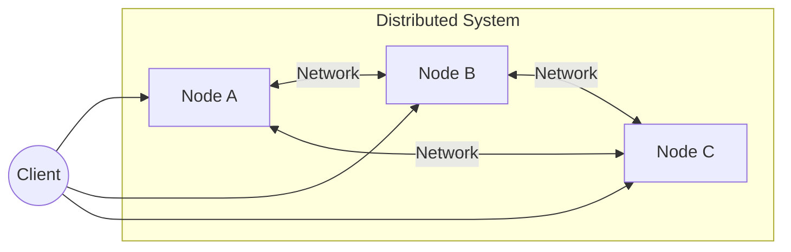
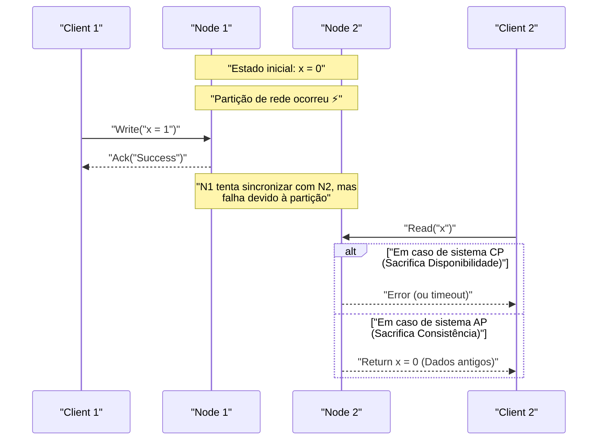
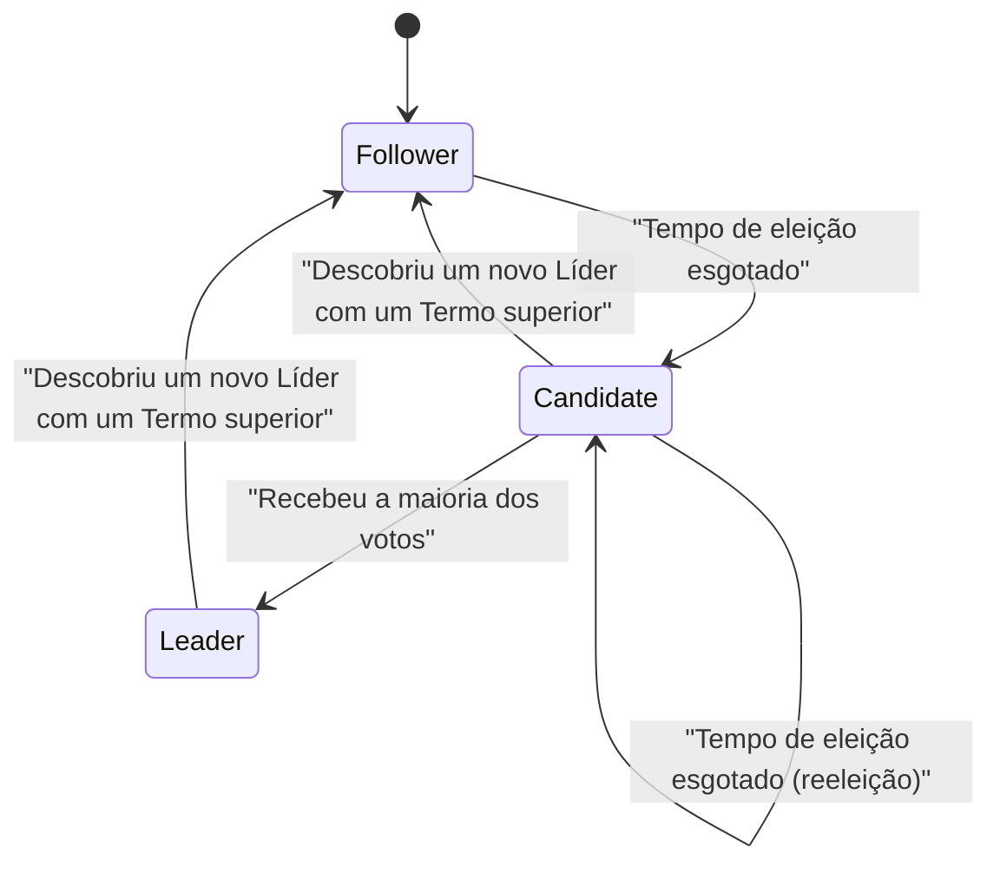

Na arquitetura de software moderna, descentralizar sistemas não é mais um requisito que pode ser evitado. Com a disseminação da computação em nuvem, a adoção de arquiteturas de microsserviços e o aumento da demanda por processamento de big data, a abordagem dominante mudou de depender de um único servidor poderoso (scale-up) para coordenar muitos servidores baratos (scale-out).

No entanto, ao construir e operar sistemas distribuídos, os engenheiros sempre enfrentam escolhas difíceis. É o trade-off entre "consistência de dados" e "disponibilidade do sistema". O **Teorema CAP** (CAP theorem) é o que provou e formulou matematicamente esse dilema essencial.

Neste artigo, aprofundaremos extremamente os fundamentos do teorema CAP, sua prova, como os bancos de dados distribuídos modernos lidam com esse dilema e, finalmente, o **Teorema PACELC**, que expande o teorema CAP, usando fórmulas matemáticas, diagramas e exemplos de implementação.

## 1. O que é um Sistema Distribuído?

Antes de falar sobre o teorema CAP, vamos esclarecer o que é um **Sistema Distribuído** ([Distributed System](https://kenji.blog/pt/p/cap-theorem-distributed-systems-tradeoff/)).

Um sistema distribuído é um sistema em que vários computadores independentes (nós) interconectados por uma rede se comportam como um sistema único e consistente para os usuários.



Os principais objetivos de um sistema distribuído são:

1. **Escalabilidade** : Ao aumentar o tráfego ou o volume de dados, adicionar nós melhora a capacidade de processamento de todo o sistema.
2. **Disponibilidade** : Mesmo que alguns nós falhem, outros nós continuam o processamento, para que o sistema como um todo continue a fornecer serviços.
3. **Desempenho** : Reduzir a latência fazendo com que nós fisicamente próximos respondam a usuários distribuídos geograficamente.

No entanto, por ser construído sobre uma base instável que é a rede, os sistemas distribuídos inevitavelmente enfrentam desafios como "partições de rede" e "atraso/perda de mensagens".

## 2. Os 3 Elementos do Teorema CAP

O teorema CAP foi proposto por Eric Brewer em 2000 e provado rigorosamente por Seth Gilbert e Nancy Lynch em 2002.

O teorema afirma que em um sistema distribuído, no máximo **dois** dos três atributos a seguir podem ser satisfeitos simultaneamente.

1. **C: [Consistency](https://kenji.blog/pt/p/cap-theorem-distributed-systems-tradeoff/)** (Consistência)
2. **A: [Availability](https://kenji.blog/pt/p/cap-theorem-distributed-systems-tradeoff/)** (Disponibilidade)
3. **P: [Partition Tolerance](https://kenji.blog/pt/p/cap-theorem-distributed-systems-tradeoff/)** (Tolerância a Partição)

Vamos ver a definição rigorosa de cada um.

### 2.1. Consistency (Consistência)

A consistência aqui se refere à **Linearizabilidade** (Linearizability) ou **Consistência Forte** (Strong Consistency).

Por definição, é um estado onde "todos os clientes sempre podem ler os dados gravados mais recentes, ou a leitura falhará". Acessar qualquer nó no sistema distribuído deve parecer como acessar um único nó, onde os dados mais recentes estão sempre visíveis.

Expresso matematicamente, se uma operação de gravação $ W(x=v) $ for concluída no tempo $ t_1 $, qualquer operação de leitura $ R(x) $ realizada no tempo $ t_2 $ ( $ t_2 > t_1 $ ) deve sempre retornar $ v $ ou um valor mais recente gravado depois.

### 2.2. Availability (Disponibilidade)

Disponibilidade é o atributo onde "todos os nós não falhos devem retornar uma resposta válida a todas as solicitações (leitura, gravação)".

Mesmo que parte do sistema esteja fora do ar, um cliente que alcance um nó ativo sempre poderá receber um resultado (dados ou resposta de sucesso) em vez de um erro. O importante aqui é que a disponibilidade não garante os "dados mais recentes".

### 2.3. Partition Tolerance (Tolerância a Partição)

A tolerância a partição é o atributo onde "o sistema continua a operar mesmo se a comunicação entre os nós for arbitrariamente perdida ou atrasada pela rede".

Por ser um sistema distribuído, as partições de rede (Network Partition) são inevitáveis. Devido a cabos cortados, falhas em switches ou latência de rede extrema, o sistema pode ser dividido em vários grupos que não conseguem se comunicar entre si.

## 3. Compreensão Intuitiva da Prova do Teorema CAP

Por que não podemos satisfazer os três simultaneamente? Vamos provar com um experimento mental simples.

Imagine um banco de dados distribuído que consiste em dois nós, $ N_1 $ e $ N_2 $. O valor inicial dos dados $ x $ é $ 0 $.



1. **Ocorrência de partição** : A rede entre $ N_1 $ e $ N_2 $ foi cortada (Ocorre **P**).
2. **Solicitação de gravação** : O cliente grava $ x = 1 $ em $ N_1 $.
3. **Ocorrência do dilema** : Imediatamente depois, outro cliente envia uma solicitação de leitura para $ x $ para $ N_2 $.

Aqui o sistema deve tomar uma decisão.

*   **Se escolher Consistência (C)** : $ N_2 $ não conhece os dados mais recentes de $ N_1 $. Portanto, $ N_2 $ não pode retornar os dados antigos ( $ 0 $ ) e deve retornar um erro ou bloquear a resposta ao cliente. Isso é a **perda de Disponibilidade (A)**. (Sistema CP)
*   **Se escolher Disponibilidade (A)** : $ N_2 $ deve retornar alguma resposta. Portanto, retorna os dados antigos que possui ( $ 0 $ ). Como não são os dados mais recentes ( $ 1 $ ), isso é a **perda de Consistência (C)**. (Sistema AP)

Em um sistema distribuído real onde partições de rede ( **P** ) podem ocorrer, devemos sempre escolher entre **CP** ou **AP**. A opção "CA" só é válida sob uma premissa irreal de que "partições de rede nunca ocorrerão", como em um único servidor.

## 4. Quorum e Ajuste de Consistência

Em muitos bancos de dados distribuídos (por exemplo, [Cassandra](https://kenji.blog/pt/p/nosql-database-selection-kvs-document-graph-wide-column/), DynamoDB, etc.), o sistema como um todo não é estritamente CP ou AP, mas permite o ajuste do equilíbrio entre C e A configurando parâmetros usando **Quorum** para cada solicitação.

Seja $ N $ o número de réplicas.
Seja $ W $ o número de nós que precisam responder para que uma gravação seja considerada bem-sucedida.
Seja $ R $ o número de nós consultados durante uma leitura.

A condição para garantir uma consistência forte é expressa pela seguinte fórmula:

$ W + R > N $

Se esta condição for atendida, o conjunto de nós de leitura e o conjunto de nós de gravação sempre se sobreporão, o que permite ler os dados de um nó contendo os dados mais recentes.

```python
class QuorumSystem:
    def __init__(self, n_replicas):
        self.N = n_replicas
        
    def check_consistency(self, w_nodes, r_nodes):
        """
        Garante consistência forte (Strong Consistency) se W + R > N for satisfeito
        """
        if w_nodes + r_nodes > self.N:
            return "Strong Consistency (W+R > N)"
        else:
            return "Eventual Consistency (W+R <= N)"

# Exemplo de configuração em um sistema onde N=3
system = QuorumSystem(3)
print(system.check_consistency(W=2, R=2))  # 2 + 2 > 3 -> Strong Consistency
print(system.check_consistency(W=1, R=1))  # 1 + 1 <= 3 -> Eventual Consistency (Rápido, mas pode ler dados antigos)
```

Por exemplo, quando $ N = 3 $:
*   Se definido como $ W=2, R=2 $, a consistência é sempre garantida. No entanto, se dois nós caírem, tanto a leitura quanto a gravação falharão (Estilo CP).
*   Se definido como $ W=1, R=1 $, o sistema se torna rápido e altamente disponível, mas pode ler dados antigos (Estilo AP, consistência eventual).

## 5. Do Teorema CAP ao PACELC

O teorema CAP apenas define o comportamento "durante partições de rede (Partition)". No entanto, mesmo quando o sistema está operando normalmente (sem partições), existem trade-offs no design do sistema. Isso é complementado pelo **Teorema PACELC**, proposto por Daniel Abadi da Universidade de Yale em 2010.

PACELC é lido da seguinte maneira:

*   **If P (Partition)** : Se ocorrer uma partição,
*   **A or C** : Escolha entre Disponibilidade ( **A** vailability) ou Consistência ( **C** onsistency).
*   **E (Else)** : Caso contrário (em operação normal sem partição),
*   **L or C** : Escolha entre Latência ( **L** atency) ou Consistência ( **C** onsistency).

Em sistemas distribuídos, se os dados forem gravados de forma síncrona em todos os nós (escolhendo C), a velocidade de resposta (latência) piora devido à sobrecarga de comunicação (sacrificando L). Inversamente, se a gravação ocorrer apenas em alguns nós de forma assíncrona para retornar a resposta mais rápido (escolhendo L), haverá um período em que os dados ficarão temporariamente inconsistentes (sacrificando C).

### 5.1. Classificação PACELC de Bancos de Dados Típicos

*   **PC/EC** (HBase, [MongoDB](https://kenji.blog/pt/p/nosql-database-selection-kvs-document-graph-wide-column/), Zookeeper)
    *   Prioriza consistência durante partições (PC). Mesmo em operação normal, prioriza a consistência, permitindo latência (EC).
*   **PA/EL** ([Cassandra](https://kenji.blog/pt/p/nosql-database-selection-kvs-document-graph-wide-column/), Riak, DynamoDB)
    *   Prioriza a disponibilidade durante partições (PA). Em operação normal, prioriza baixa latência, aceitando a Consistência Eventual (Eventual [Consistency](https://kenji.blog/pt/p/cap-theorem-distributed-systems-tradeoff/)) (EL).
*   **PA/EC** (MySQL Cluster, etc.)
    *   Prioriza a disponibilidade durante partições, mas tenta manter a consistência durante a operação normal.

## 6. Resolução de Conflitos com Relógios Vetoriais (Vector Clocks)

Em sistemas AP, se os dados forem atualizados separadamente em vários nós durante uma partição de rede, ocorrerá um **Conflito (Conflict)** de dados quando a partição for resolvida. Como um mecanismo para detectar e resolver tais conflitos, os **Relógios Vetoriais (Vector Clocks)** são amplamente utilizados.

Um relógio vetorial é um array de relógios lógicos em que cada nó mantém seu próprio número de atualizações.

O estado é expresso da seguinte forma:
$ V = [c_1, c_2, \dots, c_n] $
Onde $ c_i $ é o contador de atualizações no nó $ i $.

Vamos implementar um algoritmo simples de detecção de conflitos com relógio vetorial em Python.

```python
class VectorClock:
    def __init__(self, node_ids):
        self.clock = {node_id: 0 for node_id in node_ids}
        
    def increment(self, node_id):
        self.clock[node_id] += 1
        
    def merge(self, other_clock):
        for k, v in other_clock.items():
            self.clock[k] = max(self.clock[k], v)

def compare_clocks(v1, v2):
    """
    Retorna -1 se v1 for ancestral de v2
    Retorna 1 se v2 for ancestral de v1
    Retorna 0 se houver simultaneidade (conflito)
    """
    v1_is_smaller = False
    v2_is_smaller = False
    
    for k in v1.keys():
        if v1[k] < v2[k]:
            v1_is_smaller = True
        elif v1[k] > v2[k]:
            v2_is_smaller = True
            
    if v1_is_smaller and not v2_is_smaller:
        return -1 # v1 -> v2
    elif v2_is_smaller and not v1_is_smaller:
        return 1  # v2 -> v1
    else:
        return 0  # Conflict!

# Simulação de cenário
nodes = ['A', 'B']
v_init = VectorClock(nodes)

# Atualização no Nó A
v_A = VectorClock(nodes)
v_A.clock = v_init.clock.copy()
v_A.increment('A')

# Durante a partição: Outra atualização no Nó B
v_B = VectorClock(nodes)
v_B.clock = v_init.clock.copy()
v_B.increment('B')

# Comparação
result = compare_clocks(v_A.clock, v_B.clock)
if result == 0:
    print(f"Conflito detectado! v_A:{v_A.clock}, v_B:{v_B.clock}")
    print("Você deve executar a lógica de mesclagem no lado do cliente ou aplicar LWW (Last Write Wins).")
```

Desta forma, usando relógios vetoriais, é possível determinar de forma matemática e confiável "qual é o mais recente" ou se "foram editados em paralelo (em conflito)". O Amazon Dynamo, entre outros, alcançou alta disponibilidade com base nesse mecanismo.

## 7. Algoritmo de Consenso [Raft](https://kenji.blog/pt/p/byzantine-generals-problem-consensus/) e Sistemas CP

Por outro lado, em sistemas CP (como Zookeeper e etcd), os **algoritmos de consenso** são essenciais para manter a consistência enquanto evitam o problema de "split-brain" durante uma partição. O algoritmo mais amplamente utilizado recentemente é o **Raft**.

O Raft elege um único **Líder (Leader)** no sistema e garante forte consistência processando todas as operações de gravação através deste líder. Se ocorrer uma partição de rede, apenas o grupo que conseguir se comunicar com a maioria dos nós (Quorum) pode eleger um novo líder, enquanto o líder do grupo minoritário para de funcionar. Isso mantém a consistência à custa de perder a disponibilidade no grupo minoritário (esta é a essência do CP).



A segurança do [Raft](https://kenji.blog/pt/p/byzantine-generals-problem-consensus/) depende dos seguintes princípios:

1. **Election Safety** : No máximo um líder pode ser eleito em um determinado mandato (Term).
2. **Leader Append-Only** : O líder apenas anexa entradas ao seu próprio log, nunca as sobrescreve ou exclui.
3. **Log Matching** : Se dois logs contêm uma entrada com o mesmo índice e mandato, todas as entradas anteriores são idênticas.

Ao fazer isso, a inconsistência de dados em ambientes distribuídos é completamente e matematicamente evitada de forma algorítmica. O `etcd`, o armazenamento de dados de back-end do [Kubernetes](https://kenji.blog/pt/p/kubernetes-k8s-architecture-pod-service-ingress/), também alcança um gerenciamento de estado rigoroso do cluster usando o [Raft](https://kenji.blog/pt/p/byzantine-generals-problem-consensus/).

## 8. Microsserviços e Transações

O teorema CAP não se limita a um único banco de dados, mas também tem um impacto profundo nas **arquiteturas de microsserviços** modernas.

Em aplicações monolíticas, era fácil manter a consistência dos dados com transações [ACID](https://kenji.blog/pt/p/rdbms-transaction-acid-isolation-level-lock/) em um único banco de dados relacional. Porém, em microsserviços onde serviços e bancos de dados são divididos por domínio de negócios, as transações distribuídas que cruzam serviços se tornam necessárias.

É aqui que o teorema CAP mostra suas presas. Ao buscar forte consistência (C) usando transações distribuídas (por exemplo, commit de duas fases - 2PC), se algum serviço falhar ou houver atrasos na rede, todo o sistema será bloqueado, diminuindo drasticamente a disponibilidade (A) e aumentando a latência (L).

Para contornar esse problema, o **Padrão Saga** é amplamente adotado em microsserviços.

O Padrão Saga é um método em que uma grande transação é dividida em uma sequência de transações locais, interconectadas através de mensagens assíncronas (como [Kafka](https://kenji.blog/pt/p/event-driven-architecture-message-queue-kafka-rabbitmq/) ou [RabbitMQ](https://kenji.blog/pt/p/event-driven-architecture-message-queue-kafka-rabbitmq/)).

```mermaid
flowchart TD
    Order["Serviço de Pedidos"] -->|"1. Criar pedido"| MessageBroker(("Message Broker"))
    MessageBroker -->|"2. Notificar evento"| Payment["Serviço de Pagamento"]
    Payment -->|"3. Evento de pagamento concluído"| MessageBroker
    MessageBroker -->|"4. Notificar evento"| Inventory["Serviço de Estoque"]
    
    Inventory -- "Em caso de falha" -->|"Transação de compensação"| Compensate["Evento de falha na alocação de estoque"]
    Compensate --> MessageBroker
    MessageBroker -->|"Cancelar"| Order
```

No Padrão Saga, a consistência forte é abandonada em favor da **Consistência Eventual (Eventual [Consistency](https://kenji.blog/pt/p/cap-theorem-distributed-systems-tradeoff/))** (Abordagem AP). Caso um processo falhe no meio, em vez de reverter (rollback), uma **Transação de Compensação (Compensating [Transaction](https://kenji.blog/pt/p/rdbms-transaction-acid-isolation-level-lock/))** é emitida para implementar o processo que restaura o estado logicamente ao que era antes. Assim, atinge-se um nível aceitável de consistência para o negócio enquanto se mantém alta escalabilidade e disponibilidade.

## Conclusão

Neste artigo, aprofundamos o teorema CAP, o princípio mais vital em sistemas distribuídos.

*   O **Teorema CAP** indica que em sistemas distribuídos é impossível satisfazer simultaneamente Consistência (Consistency), Disponibilidade ([Availability](https://kenji.blog/pt/p/cap-theorem-distributed-systems-tradeoff/)) e Tolerância a Partição ([Partition Tolerance](https://kenji.blog/pt/p/cap-theorem-distributed-systems-tradeoff/)). No mundo real onde partições (P) são inevitáveis, na prática a escolha se torna entre **CP** ou **AP**.
*   O **Teorema PACELC** expande isso ao mostrar que, mesmo durante a operação normal sem partições, há um trade-off entre Latência (L) e Consistência (C).
*   Ao usar o **Quorum (Maioria)**, o equilíbrio entre consistência e disponibilidade ( $ W+R>N $ ) pode ser ajustado de forma flexível de acordo com os requisitos.
*   Em sistemas AP, **Relógios Vetoriais** são usados para resolução de conflitos, enquanto que em sistemas CP, algoritmos de consenso como **[Raft](https://kenji.blog/pt/p/byzantine-generals-problem-consensus/)** são utilizados para um ordenamento rigoroso.
*   Estes conceitos não são apenas para bancos de dados, mas também conhecimentos básicos indispensáveis para o projeto de transações distribuídas (como o Padrão Saga) nas **arquiteturas de microsserviços** de hoje.

Não há "bala de prata" no design de sistemas. Compreender adequadamente os teoremas CAP e PACELC, e avaliar corretamente se as exigências do seu negócio exigem que "a consistência seja preservada a todo custo (como pagamentos)" ou se "o sistema nunca deve parar, mesmo que haja inconsistência temporária (como timelines de redes sociais)" - e depois escolher o trade-off ótimo - é possivelmente a habilidade máxima exigida de um grande arquiteto.
