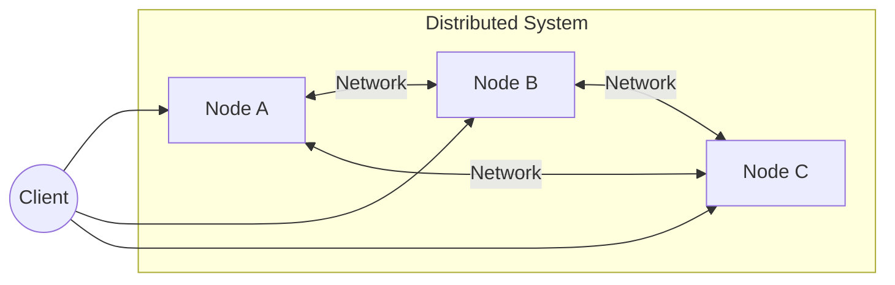
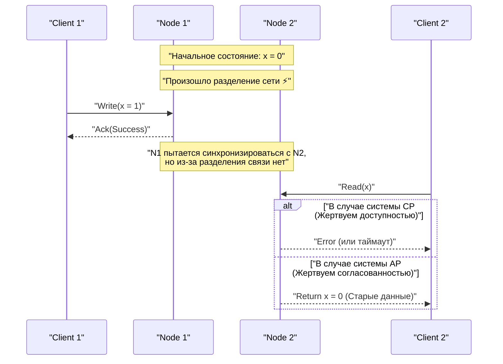
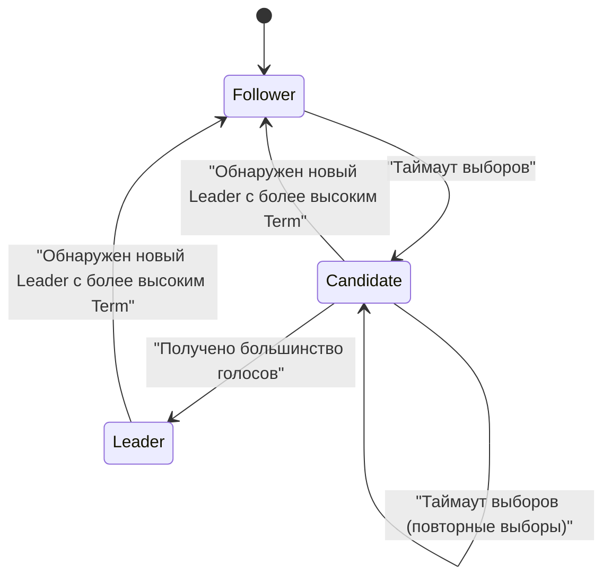

В современной архитектуре программного обеспечения распределение систем стало уже неизбежным требованием. С распространением облачных вычислений, внедрением микросервисной архитектуры и ростом спроса на обработку больших данных доминирующим стал подход, при котором вместо опоры на один мощный сервер (scale-up) используется множество недорогих серверов (scale-out).

Однако при создании и эксплуатации распределенных систем инженерам постоянно приходится делать трудный выбор. Это компромисс между "согласованностью данных" и "доступностью системы". Эта фундаментальная дилемма была математически доказана и формализована в **теореме CAP** (CAP theorem).

В этой статье мы подробно рассмотрим теорему CAP, начиная с ее основ и доказательства, того, как современные распределенные базы данных справляются с этой дилеммой, и заканчивая **теоремой PACELC**, которая расширяет теорему CAP. Мы сопроводим все это формулами, диаграммами и примерами реализации.

## 1. Что такое распределенная система?

Прежде чем говорить о теореме CAP, давайте проясним, что вообще такое **распределенная система** ([Distributed System](https://kenji.blog/ru/p/cap-theorem-distributed-systems-tradeoff/)).

Распределенная система — это система, в которой несколько независимых компьютеров (узлов), соединенных сетью, ведут себя для пользователя так, как если бы это была единая согласованная система.



Основные цели распределенных систем следующие:

1.  **Масштабируемость** : Повышение вычислительной мощности всей системы за счет добавления узлов при увеличении трафика или объема данных.
2.  **Доступность** : Даже если некоторые узлы выходят из строя, другие узлы продолжают работу, позволяя системе в целом продолжать предоставлять услуги.
3.  **Производительность** : Снижение задержки за счет того, что физически близкие узлы отвечают географически распределенным пользователям.

Однако, поскольку распределенные системы строятся на нестабильной основе сети, они неизбежно сталкиваются с такими проблемами, как "разделение сети" и "задержка или потеря сообщений".

## 2. Три элемента теоремы CAP

Теорема CAP была предложена Эриком Брюером (Eric Brewer) в 2000 году и строго доказана Сетом Гилбертом (Seth Gilbert) и Нэнси Линч (Nancy Lynch) в 2002 году.

Теорема утверждает, что в распределенной системе можно одновременно обеспечить **не более двух** из следующих трех свойств:

1.  **C: [Consistency](https://kenji.blog/ru/p/cap-theorem-distributed-systems-tradeoff/)** (Согласованность)
2.  **A: [Availability](https://kenji.blog/ru/p/cap-theorem-distributed-systems-tradeoff/)** (Доступность)
3.  **P: [Partition Tolerance](https://kenji.blog/ru/p/cap-theorem-distributed-systems-tradeoff/)** (Устойчивость к разделению)

Давайте рассмотрим строгое определение каждого из них.

### 2.1. Consistency (Согласованность)

Здесь под согласованностью понимается **линеаризуемость** (Linearizability) или **строгая согласованность** (Strong Consistency).

По определению, это состояние, при котором "все клиенты всегда видят новейшие записанные данные, либо чтение завершается ошибкой". Независимо от того, к какому узлу в распределенной системе осуществляется доступ, новейшие данные должны быть видны так, как если бы доступ осуществлялся к одному узлу.

Математически это означает, что если операция записи $ W(x=v) $ завершается в момент времени $ t_1 $, любая операция чтения $ R(x) $, выполняемая в момент времени $ t_2 $ (где $ t_2 > t_1 $), должна обязательно возвращать значение $ v $ или более новое значение, записанное позже.

### 2.2. Availability (Доступность)

Доступность — это свойство, при котором "все не отказавшие узлы обязательно возвращают валидный ответ на все запросы (чтение, запись)".

Даже если часть системы отключена, клиенты, которые смогли подключиться к активным узлам, всегда получат результат (данные или ответ об успешном выполнении), а не ошибку. Важно отметить, что доступность не гарантирует предоставление "новейших данных".

### 2.3. Partition Tolerance (Устойчивость к разделению)

Устойчивость к разделению — это свойство, при котором "система продолжает функционировать, даже если связь между узлами по сети произвольно теряется или задерживается".

Поскольку система является распределенной, разделение сети (Network Partition) — это неизбежное явление. Обрыв кабеля, сбой коммутатора или экстремальная сетевая задержка могут привести к разделению системы на несколько групп, которые не могут общаться друг с другом.

## 3. Интуитивное понимание доказательства теоремы CAP

Почему невозможно обеспечить все три свойства одновременно? Давайте докажем это с помощью простого мысленного эксперимента.

Представьте распределенную базу данных, состоящую из двух узлов $ N_1 $ и $ N_2 $. Начальное значение данных $ x $ равно $ 0 $.



1.  **Возникновение разделения** : Сеть между $ N_1 $ и $ N_2 $ была отключена (возникло **P**).
2.  **Запрос на запись** : Клиент отправляет запрос на запись $ x = 1 $ узлу $ N_1 $.
3.  **Возникновение дилеммы** : Сразу после этого другой клиент отправляет запрос на чтение $ x $ узлу $ N_2 $.

В этот момент система вынуждена принять решение.

*   **Если выбрана согласованность (C)** : $ N_2 $ не знает новейших данных узла $ N_1 $. Поэтому $ N_2 $ не может вернуть старые данные ($ 0 $) и должен вернуть клиенту ошибку или заблокировать ответ. Это означает **потерю доступности (A)**. (CP-система)
*   **Если выбрана доступность (A)** : $ N_2 $ должен вернуть какой-либо ответ. Следовательно, он возвращает старые данные ($ 0 $), которые у него есть. Поскольку это не самые новые данные ($ 1 $), это означает **потерю согласованности (C)**. (AP-система)

В реальных распределенных системах, где возможно разделение сети ( **P** ), мы всегда должны выбирать либо **CP**, либо **AP**. Вариант "CA" возможен только при нереалистичном предположении, что "разделение сети никогда не произойдет", например, в случае одного сервера.

## 4. Quorum (Кворум) и настройка согласованности

Во многих распределенных базах данных (например, [Cassandra](https://kenji.blog/ru/p/nosql-database-selection-kvs-document-graph-wide-column/), DynamoDB и др.) система не привязывается жестко к CP или AP, а позволяет балансировать между C и A с помощью настройки параметров, используя **Quorum** (кворум, необходимое большинство) для каждого запроса.

Пусть $ N $ — количество реплик.
Пусть $ W $ — количество узлов, ответы от которых необходимы, чтобы считать запись успешной.
Пусть $ R $ — количество узлов, опрашиваемых при чтении.

Условие для обеспечения строгой согласованности выражается следующей формулой:

$ W + R > N $

Если это условие выполняется, обязательно происходит перекрытие между множеством узлов чтения и узлов записи, что позволяет читать данные с узла, содержащего новейшие данные.

```python
class QuorumSystem:
    def __init__(self, n_replicas):
        self.N = n_replicas
        
    def check_consistency(self, w_nodes, r_nodes):
        """
        Если W + R > N, гарантируется строгая согласованность (Strong Consistency)
        """
        if w_nodes + r_nodes > self.N:
            return "Strong Consistency (W+R > N)"
        else:
            return "Eventual Consistency (W+R <= N)"

# Пример настройки для системы с N=3
system = QuorumSystem(3)
print(system.check_consistency(W=2, R=2))  # 2 + 2 > 3 -> Strong Consistency
print(system.check_consistency(W=1, R=1))  # 1 + 1 <= 3 -> Eventual Consistency (Быстро, но можно прочитать старые данные)
```

Например, при $ N = 3 $ :
*   Установка $ W=2, R=2 $ всегда гарантирует согласованность. Однако, если два узла выходят из строя, и чтение, и запись завершатся неудачно (в стиле CP).
*   Установка $ W=1, R=1 $ делает систему быстрой и высокодоступной, но есть вероятность прочитать старые данные (в стиле AP, в конечном итоге согласованность — Eventual [Consistency](https://kenji.blog/ru/p/cap-theorem-distributed-systems-tradeoff/)).

## 5. От теоремы CAP к теореме PACELC

Теорема CAP определяет поведение только во время "разделения сети (Partition)". Однако компромиссы при проектировании системы существуют и тогда, когда система работает нормально (без разделений). Это было дополнено теоремой **PACELC**, предложенной Дэниелом Абади (Daniel Abadi) из Йельского университета в 2010 году.

PACELC расшифровывается так:

*   **If P (Partition)** : В случае разделения сети,
*   **A or C** : Выбираем между доступностью ( **A**vailability ) и согласованностью ( **C**onsistency ).
*   **E (Else)** : В противном случае (в нормальном состоянии без разделения),
*   **L or C** : Выбираем между задержкой ( **L**atency ) и согласованностью ( **C**onsistency ).

В распределенной системе, если мы записываем данные синхронно на все узлы (выбирая C), скорость ответа (задержка) ухудшается из-за накладных расходов на связь (жертвуя L). Наоборот, если мы возвращаем ответ после асинхронной записи только на некоторые узлы (выбирая L), возникает период времени, когда данные временно не согласованы (жертвуя C).

### 5.1. Классификация типичных баз данных по PACELC

*   **PC/EC** (HBase, [MongoDB](https://kenji.blog/ru/p/nosql-database-selection-kvs-document-graph-wide-column/), Zookeeper)
    *   При разделении приоритет отдается согласованности (PC). В нормальных условиях также приоритет отдается согласованности, допуская задержки (EC).
*   **PA/EL** ([Cassandra](https://kenji.blog/ru/p/nosql-database-selection-kvs-document-graph-wide-column/), Riak, DynamoDB)
    *   При разделении приоритет отдается доступности (PA). В нормальных условиях приоритет отдается низкой задержке, и принимается согласованность в конечном счете ([Eventual Consistency](https://kenji.blog/ru/p/cap-theorem-distributed-systems-tradeoff/)) (EL).
*   **PA/EC** (MySQL Cluster и т.д.)
    *   При разделении приоритет отдается доступности, в то время как в нормальных условиях система пытается сохранить согласованность.

## 6. Разрешение конфликтов с помощью векторных часов (Vector Clocks)

В системах AP, если данные обновляются отдельно на нескольких узлах во время разделения сети, возникает **конфликт (Conflict)** данных, когда разделение устраняется. В качестве механизма обнаружения и разрешения таких конфликтов широко используются **векторные часы (Vector Clocks)**.

Векторные часы — это массив логических часов, в которых каждый узел хранит количество собственных обновлений.

Состояние выражается следующим образом:
$ V = [c_1, c_2, \dots, c_n] $
Где $ c_i $ — счетчик обновлений на узле $ i $.

Давайте реализуем простой алгоритм обнаружения конфликтов векторных часов на Python.

```python
class VectorClock:
    def __init__(self, node_ids):
        self.clock = {node_id: 0 for node_id in node_ids}
        
    def increment(self, node_id):
        self.clock[node_id] += 1
        
    def merge(self, other_clock):
        for k, v in other_clock.items():
            self.clock[k] = max(self.clock[k], v)

def compare_clocks(v1, v2):
    """
    Если v1 является предком v2, возвращает -1
    Если v2 является предком v1, возвращает 1
    Если происходят параллельно (конфликт), возвращает 0
    """
    v1_is_smaller = False
    v2_is_smaller = False
    
    for k in v1.keys():
        if v1[k] < v2[k]:
            v1_is_smaller = True
        elif v1[k] > v2[k]:
            v2_is_smaller = True
            
    if v1_is_smaller and not v2_is_smaller:
        return -1 # v1 -> v2
    elif v2_is_smaller and not v1_is_smaller:
        return 1  # v2 -> v1
    else:
        return 0  # Conflict!

# Моделирование сценария
nodes = ['A', 'B']
v_init = VectorClock(nodes)

# Обновление на узле A
v_A = VectorClock(nodes)
v_A.clock = v_init.clock.copy()
v_A.increment('A')

# Во время разделения: другое обновление на узле B
v_B = VectorClock(nodes)
v_B.clock = v_init.clock.copy()
v_B.increment('B')

# Сравнение
result = compare_clocks(v_A.clock, v_B.clock)
if result == 0:
    print(f"Обнаружен конфликт! v_A:{v_A.clock}, v_B:{v_B.clock}")
    print("Необходимо выполнить логику слияния на стороне клиента или применить LWW (Last Write Wins).")
```

Таким образом, используя векторные часы, мы можем математически и надежно определить, "какая версия новее" или "были ли данные отредактированы параллельно (находятся в конфликте)". Amazon Dynamo и другие используют этот механизм как основу для создания высокодоступных систем.

## 7. Алгоритм консенсуса [Raft](https://kenji.blog/ru/p/byzantine-generals-problem-consensus/) и CP-системы

С другой стороны, в CP-системах (таких как Zookeeper или etcd) **алгоритмы консенсуса** необходимы для предотвращения расщепления мозга (Split-brain) и сохранения согласованности в случае разделения сети. Одним из наиболее широко используемых алгоритмов в последние годы является **Raft**.

Raft выбирает в системе единственного **Лидера (Leader)** и гарантирует строгую согласованность, направляя все операции записи через него. Если происходит разделение сети, только та группа, которая может связываться с большинством узлов (Кворумом), может выбрать нового лидера, в то время как лидер той части, которая потеряла большинство, перестает функционировать. Благодаря этому сохраняется согласованность, но за счет потери доступности в группе меньшинства (в этом и заключается суть CP).



Безопасность [Raft](https://kenji.blog/ru/p/byzantine-generals-problem-consensus/) основана на следующих принципах:

1.  **Election Safety (Безопасность выборов)** : В рамках одного конкретного срока (Term) может быть выбран только один лидер.
2.  **Leader Append-Only (Лидер только добавляет)** : Лидер никогда не перезаписывает и не удаляет записи в своем собственном журнале (логе), он только добавляет в него новые.
3.  **Log Matching (Соответствие журналов)** : Если два журнала содержат записи с одинаковым индексом и сроком (Term), то все предшествующие записи в них также идентичны.

Таким образом, несогласованность данных в распределенной среде полностью устраняется на математическом и алгоритмическом уровне. `etcd`, резервное хранилище данных для [Kubernetes](https://kenji.blog/ru/p/kubernetes-k8s-architecture-pod-service-ingress/), также использует [Raft](https://kenji.blog/ru/p/byzantine-generals-problem-consensus/) для строгого управления состоянием кластера.

## 8. Микросервисы и транзакции

Теорема CAP применима не только к отдельным базам данных, но и оказывает глубокое влияние на современную **микросервисную архитектуру**.

В монолитных приложениях было легко поддерживать согласованность данных с помощью транзакций [ACID](https://kenji.blog/ru/p/rdbms-transaction-acid-isolation-level-lock/) с использованием одной реляционной базы данных. Однако в микросервисах, где сервисы и базы данных разделены по бизнес-доменам, требуются распределенные транзакции, охватывающие несколько сервисов.

Вот тут и проявляет себя теорема CAP. Если мы требуем строгой согласованности (C) с помощью распределенных транзакций (например, двухфазного коммита — 2PC), то в случае сбоя любого из сервисов или задержки связи вся система блокируется, а доступность (A) и задержка (L) значительно ухудшаются.

Для решения этой проблемы в микросервисах широко используется **паттерн Saga (Saga Pattern)**.

Паттерн Saga — это метод разделения одной большой транзакции на серию локальных транзакций и их координации с использованием асинхронного обмена сообщениями (например, [Kafka](https://kenji.blog/ru/p/event-driven-architecture-message-queue-kafka-rabbitmq/) или [RabbitMQ](https://kenji.blog/ru/p/event-driven-architecture-message-queue-kafka-rabbitmq/)).

```mermaid
flowchart TD
    Order["Сервис заказов"] -->|"1. Создание заказа"| MessageBroker(("Message Broker"))
    MessageBroker -->|"2. Уведомление о событии"| Payment["Сервис платежей"]
    Payment -->|"3. Событие завершения платежа"| MessageBroker
    MessageBroker -->|"4. Уведомление о событии"| Inventory["Сервис запасов"]
    
    Inventory -- "При ошибке" -->|"Компенсирующая транзакция"| Compensate["Событие ошибки резервирования запасов"]
    Compensate --> MessageBroker
    MessageBroker -->|"Отмена"| Order
```

В паттерне Saga отказываются от строгой согласованности и принимают **согласованность в конечном счете (Eventual [Consistency](https://kenji.blog/ru/p/cap-theorem-distributed-systems-tradeoff/))** (подход в стиле AP). Если процесс прерывается посередине, вместо отката (rollback) выдается **компенсирующая транзакция (Compensating [Transaction](https://kenji.blog/ru/p/rdbms-transaction-acid-isolation-level-lock/))**, реализующая процесс логического возврата состояния назад. Это позволяет достичь бизнес-приемлемого уровня согласованности при сохранении высокой масштабируемости и доступности.

## Заключение

В этой статье мы подробно рассмотрели теорему CAP, важнейший принцип в распределенных системах.

*   **Теорема CAP** показывает, что невозможно одновременно удовлетворить три свойства в распределенной системе: Consistency (Согласованность), [Availability](https://kenji.blog/ru/p/cap-theorem-distributed-systems-tradeoff/) (Доступность) и [Partition Tolerance](https://kenji.blog/ru/p/cap-theorem-distributed-systems-tradeoff/) (Устойчивость к разделению), и что в реальном мире, где разделение (P) неизбежно, фактически остается выбор между **CP** или **AP**.
*   **Теорема PACELC** расширяет ее и показывает, что даже при нормальной работе без разделений существует компромисс между задержкой (L) и согласованностью (C).
*   Используя **Quorum (Кворум)**, можно гибко настраивать баланс между согласованностью и доступностью ( $ W+R>N $ ) в зависимости от требований.
*   В AP-системах для разрешения конфликтов используются **векторные часы**, а в CP-системах для строгого упорядочивания — алгоритмы консенсуса, такие как **[Raft](https://kenji.blog/ru/p/byzantine-generals-problem-consensus/)**.
*   Эти концепции являются важными базовыми знаниями не только для баз данных, но и для проектирования распределенных транзакций (например, паттерна Saga) в современной **микросервисной архитектуре**.

Системное проектирование не знает "серебряной пули". Правильное понимание теорем CAP и PACELC, оценка того, требуют ли бизнес-задачи "защиты согласованности любой ценой (например, платежи)" или "безостановочной работы системы, даже допуская временную несогласованность (например, лента в соцсетях)", и выбор оптимального компромисса — это, пожалуй, важнейший навык, требуемый от хорошего архитектора.
