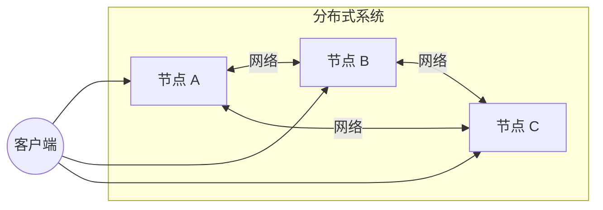
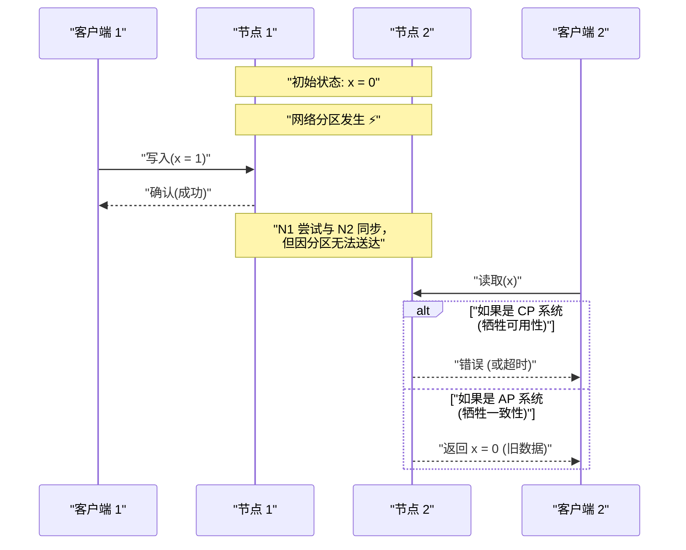
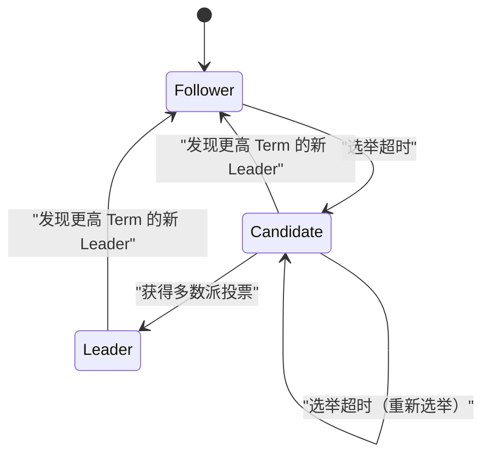

在现代软件架构中，系统的分布式化已成为不可避免的要求。随着云计算的普及、微服务架构的采用以及大数据处理需求的增加，依赖单一强大服务器（向上扩展）的方法已不再是主流，取而代之的是协调大量廉价服务器（向外扩展）的方法。

然而，在构建和运营分布式系统时，工程师们总是面临着艰难的选择。那就是“数据一致性”与“系统可用性”之间的权衡。在数学上证明并公式化这种本质困境的，正是 **[CAP定理](https://kenji.blog/zh-cn/p/cap-theorem-distributed-systems-tradeoff/)** （CAP theorem）。

本文将从CAP定理的基础及其证明讲起，进一步探讨现代分布式数据库如何应对这一困境，并延伸至CAP定理的扩展版本—— **PACELC定理** ，通过公式、图解以及实现示例，进行极其详细的深入剖析。

## 1. 什么是分布式系统？

在讨论CAP定理之前，让我们先明确什么是 **分布式系统** （[Distributed System](https://kenji.blog/zh-cn/p/cap-theorem-distributed-systems-tradeoff/)）。

分布式系统是指通过网络互连的多个独立计算机（节点），在用户看来就像是一个单一且一致的系统。



分布式系统的主要目标如下：

1.  **可扩展性** ：当流量或数据量增加时，通过添加节点来提升整个系统的处理能力。
2.  **可用性** ：即使部分节点发生故障，其他节点仍能继续处理请求，从而保证整个系统持续提供服务。
3.  **性能** ：对于地理上分散的用户，由物理距离较近的节点进行响应，从而降低延迟。

然而，由于分布式系统建立在不稳定的网络基础之上，因此不可避免地会伴随“网络分区”和“消息延迟或丢失”等问题。

## 2. [CAP定理](https://kenji.blog/zh-cn/p/cap-theorem-distributed-systems-tradeoff/)的3个要素

CAP定理于2000年由埃里克·布鲁尔（Eric Brewer）提出，并于2002年由塞斯·吉尔伯特（Seth Gilbert）和南希·林奇（Nancy Lynch）进行了严格的证明。

该定理主张，在分布式系统中的以下3个特性中，最多只能同时满足 **2个** 。

1.  **C: [Consistency](https://kenji.blog/zh-cn/p/cap-theorem-distributed-systems-tradeoff/)** （一致性）
2.  **A: [Availability](https://kenji.blog/zh-cn/p/cap-theorem-distributed-systems-tradeoff/)** （可用性）
3.  **P: [Partition Tolerance](https://kenji.blog/zh-cn/p/cap-theorem-distributed-systems-tradeoff/)** （分区容错性）

让我们来看看各自的严格定义。

### 2.1. Consistency（一致性）

这里的一致性是指 **线性一致性** （Linearizability）或 **强一致性** （Strong Consistency）。

其定义为“所有客户端始终可以读取到最新的写入数据，或者读取失败”的状态。无论访问分布式系统中的哪个节点，都必须能看到最新的数据，就如同访问单个节点一样。

用数学语言表达，如果写入操作 $ W(x=v) $ 在时刻 $ t_1 $ 完成，那么在时刻 $ t_2 $ （ $ t_2 > t_1 $ ）进行的任何读取操作 $ R(x) $ ，都必须返回 $ v $ 或在此之后写入的新值。

### 2.2. Availability（可用性）

可用性是指“所有未发生故障的节点，必须对所有请求（读取、写入）返回有效的响应”这一特性。

即使系统的一部分宕机，能够访问到存活节点的客户端也一定能收到结果（数据或成功响应），而不是错误。这里重要的一点是，可用性并不保证返回的是“最新数据”。

### 2.3. Partition Tolerance（分区容错性）

分区容错性是指“即使节点间的通信因网络问题被任意丢失或延迟，系统仍能继续运行”这一特性。

既然是分布式系统，网络分区（Network Partition）就是不可避免的事件。线缆断开、交换机故障或极端的网络延迟，都可能导致系统分裂成多个无法相互通信的组。

## 3. CAP定理证明的直观理解

为什么无法同时满足这三者呢？让我们通过一个简单的思想实验来证明。

想象一个由两个节点 $ N_1 $ 和 $ N_2 $ 组成的分布式数据库。数据 $ x $ 的初始值为 $ 0 $ 。



1.  **发生分区** ： $ N_1 $ 和 $ N_2 $ 之间的网络断开了（发生了 **P** ）。
2.  **写入请求** ：客户端向 $ N_1 $ 写入 $ x = 1 $ 。
3.  **产生困境** ：紧接着，另一个客户端向 $ N_2 $ 发送了读取 $ x $ 的请求。

此时，系统被迫做出决定。

*   **选择一致性（C）的情况** ： $ N_2 $ 不知道 $ N_1 $ 的最新数据。因此， $ N_2 $ 不能返回旧数据（ $ 0 $ ），必须向客户端返回错误或阻塞响应。这就 **丧失了可用性（A）** 。（CP系统）
*   **选择可用性（A）的情况** ： $ N_2 $ 必须返回某种响应。因此，它会返回自己拥有的旧数据（ $ 0 $ ）。因为这不是最新的数据（ $ 1 $ ），所以 **丧失了一致性（C）** 。（AP系统）

在可能发生网络分区（ **P** ）的现实分布式系统中，我们必须在 **CP** 和 **AP** 之间做出选择。“CA”这个选项，只有在“绝对不会发生网络分区”的单台服务器等不切实际的前提下才成立。

## 4. Quorum（法定人数）与一致性的微调

在许多分布式数据库（例如：[Cassandra](https://kenji.blog/zh-cn/p/nosql-database-selection-kvs-document-graph-wide-column/)、DynamoDB 等）中，并没有将整个系统固定为 CP 或 AP，而是通过对每个请求使用 **Quorum** （法定人数）的参数调整，来平衡 C 和 A。

假设副本数为 $ N $ 。
将写入被视为成功所需响应的节点数设为 $ W $ 。
将读取时查询的节点数设为 $ R $ 。

保证强一致性的条件由以下公式表示：

$ W + R > N $

当满足此条件时，读取节点集合与写入节点集合必定会产生重叠（交集），因此能够从包含最新数据的节点中读取数据。

```python
class QuorumSystem:
    def __init__(self, n_replicas):
        self.N = n_replicas
        
    def check_consistency(self, w_nodes, r_nodes):
        """
        如果满足 W + R > N，则保证强一致性(Strong Consistency)
        """
        if w_nodes + r_nodes > self.N:
            return "Strong Consistency (W+R > N)"
        else:
            return "Eventual Consistency (W+R <= N)"

# 在 N=3 的系统中的设置示例
system = QuorumSystem(3)
print(system.check_consistency(W=2, R=2))  # 2 + 2 > 3 -> Strong Consistency
print(system.check_consistency(W=1, R=1))  # 1 + 1 <= 3 -> Eventual Consistency (速度快但可能读取到旧数据)
```

例如，当 $ N = 3 $ 时：
*   如果设置为 $ W=2, R=2 $ ，则始终保证一致性。但是，如果 2 个节点宕机，读写都会失败（偏向 CP）。
*   如果设置为 $ W=1, R=1 $ ，则具有高速和高可用性，但可能会读取到旧数据（偏向 AP，最终一致性）。

## 5. 从 CAP 到 PACELC 定理

CAP 定理仅定义了“发生网络分区（Partition）时”的行为。但是，即使系统在正常运行（无分区）状态下，系统设计中也存在权衡。耶鲁大学的丹尼尔·阿巴迪（Daniel Abadi）在 2010 年提出的 **PACELC 定理** 弥补了这一点。

PACELC 可以这样解读：

*   **If P (Partition)** ：如果发生分区，
*   **A or C** ：在可用性（ **A** vailability）或一致性（ **C** onsistency）之间进行选择。
*   **E (Else)** ：否则（未发生分区的正常情况下），
*   **L or C** ：在延迟（ **L** atency）或一致性（ **C** onsistency）之间进行选择。

在分布式系统中，如果同步地将数据写入所有节点（选择 C），通信开销会导致响应速度（延迟）变差（牺牲 L）。相反，如果只异步写入部分节点就返回响应（选择 L），就会出现数据暂时不一致的时间窗口（牺牲 C）。

### 5.1. 典型数据库的 PACELC 分类

*   **PC/EC** (HBase, [MongoDB](https://kenji.blog/zh-cn/p/nosql-database-selection-kvs-document-graph-wide-column/), Zookeeper)
    *   分区时优先考虑一致性（PC）。正常时也优先考虑一致性，允许一定的延迟（EC）。
*   **PA/EL** ([Cassandra](https://kenji.blog/zh-cn/p/nosql-database-selection-kvs-document-graph-wide-column/), Riak, DynamoDB)
    *   分区时优先考虑可用性（PA）。正常时优先考虑低延迟，接受最终一致性（Eventual [Consistency](https://kenji.blog/zh-cn/p/cap-theorem-distributed-systems-tradeoff/)）（EL）。
*   **PA/EC** (MySQL Cluster 等)
    *   分区时优先考虑可用性，正常时尝试保持一致性。

## 6. 使用向量时钟（Vector Clocks）解决冲突

在 AP 系统中，如果在网络分区期间多个节点分别更新了数据，在分区恢复时就会发生数据 **冲突（Conflict）** 。作为检测并解决这种冲突的机制， **向量时钟** 被广泛使用。

向量时钟是一个逻辑时钟数组，每个节点在其中保存自己的更新次数。

状态表示如下：
$ V = [c_1, c_2, \dots, c_n] $
其中 $ c_i $ 是节点 $ i $ 的更新计数器。

让我们用 Python 实现一个简单的向量时钟冲突检测算法。

```python
class VectorClock:
    def __init__(self, node_ids):
        self.clock = {node_id: 0 for node_id in node_ids}
        
    def increment(self, node_id):
        self.clock[node_id] += 1
        
    def merge(self, other_clock):
        for k, v in other_clock.items():
            self.clock[k] = max(self.clock[k], v)

def compare_clocks(v1, v2):
    """
    如果 v1 是 v2 的祖先，则返回 -1
    如果 v2 是 v1 的祖先，则返回 1
    如果是并发(冲突)，则返回 0
    """
    v1_is_smaller = False
    v2_is_smaller = False
    
    for k in v1.keys():
        if v1[k] < v2[k]:
            v1_is_smaller = True
        elif v1[k] > v2[k]:
            v2_is_smaller = True
            
    if v1_is_smaller and not v2_is_smaller:
        return -1 # v1 -> v2
    elif v2_is_smaller and not v1_is_smaller:
        return 1  # v2 -> v1
    else:
        return 0  # 冲突！

# 场景模拟
nodes = ['A', 'B']
v_init = VectorClock(nodes)

# 在节点 A 更新
v_A = VectorClock(nodes)
v_A.clock = v_init.clock.copy()
v_A.increment('A')

# 分区中: 在节点 B 进行另一次更新
v_B = VectorClock(nodes)
v_B.clock = v_init.clock.copy()
v_B.increment('B')

# 比较
result = compare_clocks(v_A.clock, v_B.clock)
if result == 0:
    print(f"检测到冲突！ v_A:{v_A.clock}, v_B:{v_B.clock}")
    print("必须在客户端执行合并逻辑，或应用 LWW (Last Write Wins)。")
```

像这样，通过使用向量时钟，可以在数学上可靠地判断“哪个更新较新”或“是否被并发编辑（产生冲突）”。Amazon Dynamo 等系统就是基于这种机制实现了高可用性。

## 7. [Raft](https://kenji.blog/zh-cn/p/byzantine-generals-problem-consensus/) 共识算法与 CP 系统

另一方面，在 CP 系统（如 Zookeeper 和 etcd）中，为了防止分区时的脑裂（Split-brain）并保持一致性， **共识算法** 是必不可少的。近年来使用最广泛的是 **Raft** 。

Raft 在系统中选出唯一的 **领导者（Leader）** ，并通过领导者进行所有的写入操作，从而保证强一致性。发生网络分区时，只有能与多数派（Quorum）节点通信的组才能选出新的领导者，失去多数派支持的旧领导者将停止工作。这样一来，虽然保持了一致性，但少数派组将失去可用性（这正是 CP 的核心所在）。



[Raft](https://kenji.blog/zh-cn/p/byzantine-generals-problem-consensus/) 的安全性依赖于以下原则：

1.  **Election Safety** ：在一个特定的任期（Term）内，最多只能选出一个领导者。
2.  **Leader Append-Only** ：领导者绝不会覆盖或删除其日志条目，只进行追加。
3.  **Log Matching** ：如果两个日志包含具有相同索引和 Term 的条目，那么它们在此之前的所有条目都是相同的。

通过这些机制，Raft 在数学和算法上彻底消除了分布式环境中的数据不一致问题。[Kubernetes](https://kenji.blog/zh-cn/p/kubernetes-k8s-architecture-pod-service-ingress/) 的后端数据存储 `etcd` 也采用了 [Raft](https://kenji.blog/zh-cn/p/byzantine-generals-problem-consensus/)，以实现集群严格的状态管理。

## 8. 微服务与事务

CAP 定理不仅仅局限于单一的数据库，它对现代的 **微服务架构** 也产生了深远的影响。

在单体应用中，使用单一关系型数据库的 [ACID](https://kenji.blog/zh-cn/p/rdbms-transaction-acid-isolation-level-lock/) 事务很容易保持数据一致性。然而，在按业务领域划分服务和数据库的微服务中，需要跨服务的分布式事务。

这时，CAP 定理的威力便显现出来。如果使用分布式事务（如两阶段提交 - 2PC）来追求强一致性（C），那么当任何一个服务宕机或出现通信延迟时，整个系统都会被阻塞，导致可用性（A）和延迟（L）显著下降。

为了解决这个问题，微服务中广泛采用了 **Saga 模式** 。

Saga 模式将一个大事务分解为一系列本地事务，并使用异步消息传递（如 [Kafka](https://kenji.blog/zh-cn/p/event-driven-architecture-message-queue-kafka-rabbitmq/) 或 [RabbitMQ](https://kenji.blog/zh-cn/p/event-driven-architecture-message-queue-kafka-rabbitmq/)）进行协调。

```mermaid
flowchart TD
    Order["订单服务"] -->|"1. 创建订单"| MessageBroker(("Message Broker"))
    MessageBroker -->|"2. 事件通知"| Payment["支付服务"]
    Payment -->|"3. 支付完成事件"| MessageBroker
    MessageBroker -->|"4. 事件通知"| Inventory["库存服务"]
    
    Inventory -- "失败时" -->|"补偿事务"| Compensate["库存扣减失败事件"]
    Compensate --> MessageBroker
    MessageBroker -->|"取消"| Order
```

在 Saga 模式中，放弃了强一致性，接受了 **最终一致性（Eventual [Consistency](https://kenji.blog/zh-cn/p/cap-theorem-distributed-systems-tradeoff/)）** （一种 AP 方法）。如果中途处理失败，则不是进行回滚，而是发布 **补偿事务（Compensating [Transaction](https://kenji.blog/zh-cn/p/rdbms-transaction-acid-isolation-level-lock/)）** 来执行逻辑上还原状态的操作。通过这种方式，在维持高可扩展性和可用性的同时，实现了业务上可接受的程度的一致性。

## 总结

本文深入探讨了分布式系统中最重要原则——CAP 定理。

*   **CAP 定理** 表明，在分布式系统中，无法同时满足 Consistency（一致性）、[Availability](https://kenji.blog/zh-cn/p/cap-theorem-distributed-systems-tradeoff/)（可用性）和 [Partition Tolerance](https://kenji.blog/zh-cn/p/cap-theorem-distributed-systems-tradeoff/)（分区容错性）。在不可避免分区的现实世界中，实际上就是要在 **CP** 或 **AP** 之间做出选择。
*   **PACELC 定理** 对此进行了扩展，表明即使在未发生分区正常运行时，在延迟（L）和一致性（C）之间也存在权衡。
*   通过使用 **Quorum（法定人数）** ，可以根据需求灵活调整一致性和可用性的平衡（ $ W+R>N $ ）。
*   在 AP 系统中，利用 **向量时钟** 来解决冲突；而在 CP 系统中，则利用如 **[Raft](https://kenji.blog/zh-cn/p/byzantine-generals-problem-consensus/)** 这样的共识算法来进行严格的排序。
*   这些概念不仅适用于数据库，也是现代 **微服务架构** 中分布式事务设计（如 Saga 模式）不可或缺的基础知识。

系统设计中没有“银弹”。正确理解 CAP 定理和 PACELC 定理，准确判断自身业务需求是“无论如何都要保持一致性（如支付）”，还是“宁可接受暂时的不一致也绝对不能让系统停机（如社交媒体时间线）”，从而选择最佳的权衡方案，可以说是优秀架构师必须具备的最大技能。
