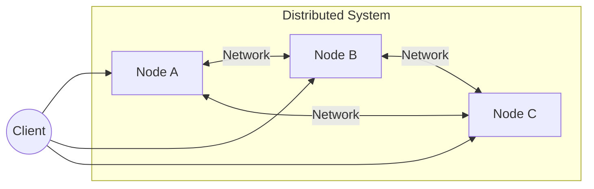
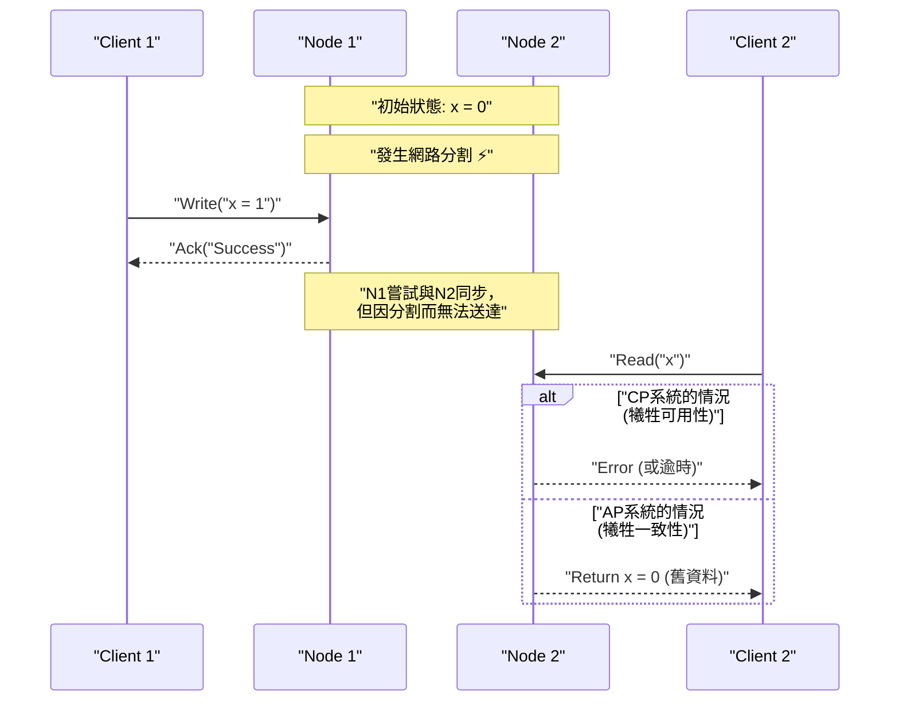
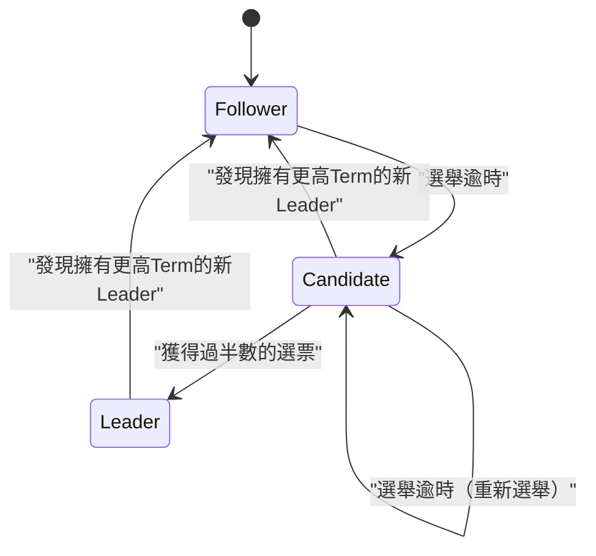
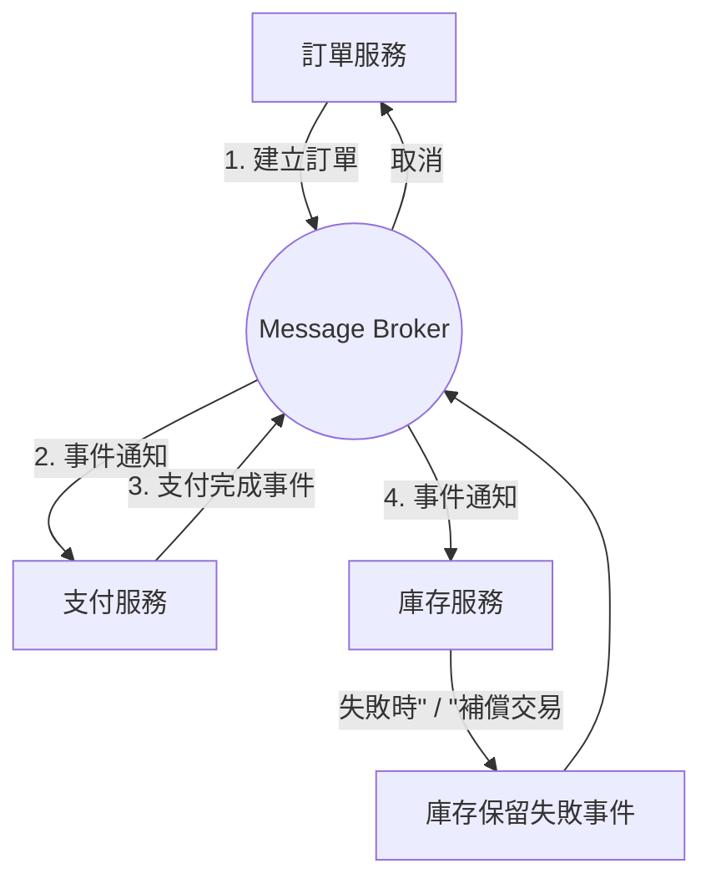

在現代軟體架構中，將系統分散化已經成為不可避免的需求。隨著雲端運算的普及、微服務架構的採用以及巨量資料處理需求的增加，依賴單一強大伺服器（垂直擴展，Scale-up）的作法已不再是主流，取而代之的是協調多台廉價伺服器（水平擴展，Scale-out）的方法。

然而，在建置與維運分散式系統時，工程師經常面臨沉重的選擇，那就是「資料一致性」與「系統可用性」之間的權衡。將這個本質性的困境以數學方式證明並公式化的，就是 **[CAP定理](https://kenji.blog/zh-tw/p/cap-theorem-distributed-systems-tradeoff/)** （CAP theorem）。

這篇文章將從CAP定理的基礎、證明，到現代分散式資料庫如何應對這個困境，甚至擴展到 **PACELC定理** ，透過數學公式、圖解以及實作範例，進行極為詳細的深入探討。

## 1. 什麼是分散式系統？

在討論CAP定理之前，讓我們先釐清什麼是 **分散式系統** （[Distributed System](https://kenji.blog/zh-tw/p/cap-theorem-distributed-systems-tradeoff/)）。

分散式系統是由透過網路互連的多個獨立電腦（節點）所組成，對使用者而言，它們的行為就像是一個單一且一致的系統。



分散式系統的主要目的如下：

1.  **擴展性** （Scalability）：當流量或資料量增加時，透過新增節點來提升整體系統的處理能力。
2.  **可用性** （[Availability](https://kenji.blog/zh-tw/p/cap-theorem-distributed-systems-tradeoff/)）：即使部分節點發生故障，其他節點仍能繼續處理，確保整個系統持續提供服務。
3.  **效能** （Performance）：對於地理位置分散的使用者，由物理上較近的節點進行回應以降低延遲。

然而，建立在不穩定的網路基礎之上，分散式系統不可避免地會伴隨「網路分割（Network Partition）」或「訊息延遲與遺失」等挑戰。

## 2. [CAP定理](https://kenji.blog/zh-tw/p/cap-theorem-distributed-systems-tradeoff/)的三個要素

CAP定理於2000年由Eric Brewer提出，並在2002年由Seth Gilbert與Nancy Lynch給予了嚴格的證明。

該定理主張，在分散式系統中，以下三個特性 **最多只能同時滿足兩個** 。

1.  **C: [Consistency](https://kenji.blog/zh-tw/p/cap-theorem-distributed-systems-tradeoff/)** （一致性）
2.  **A: Availability** （可用性）
3.  **P: [Partition Tolerance](https://kenji.blog/zh-tw/p/cap-theorem-distributed-systems-tradeoff/)** （分區容錯性）

讓我們來看看各自的嚴格定義。

### 2.1. Consistency（一致性）

這裡的一致性指的是 **線性一致性** （Linearizability）或 **強一致性** （Strong Consistency）。

定義為：「所有客戶端隨時都能讀取到最新的寫入資料，否則讀取將會失敗」。無論存取分散式系統中的哪一個節點，都必須像存取單一節點一樣，能夠看到最新的資料。

以數學方式表達，若寫入操作 $ W(x=v) $ 在時間 $ t_1 $ 完成，則在時間 $ t_2 $ （ $ t_2 > t_1 $ ）進行的任何讀取操作 $ R(x) $，都必須回傳 $ v $ 或之後寫入的更新值。

### 2.2. Availability（可用性）

可用性指的是「沒有發生故障的所有節點，對於所有的請求（讀取、寫入），都必定會回傳有效的回應」。

即使系統的一部分停止運作，能夠連線到存活節點的客戶端，一定會收到結果（資料或成功的回應），而不是錯誤。這裡的重點是，可用性並不保證回傳的是「最新資料」。

### 2.3. Partition Tolerance（分區容錯性）

分區容錯性指的是「即使節點之間的通訊因為網路問題而任意遺失或延遲，系統仍能繼續運作」。

身為分散式系統，網路分割（Network Partition）是無法避免的事件。可能因為纜線斷裂、交換器故障或是極端的網路延遲，導致系統被分割成多個無法通訊的群組。

## 3. CAP定理證明的直觀理解

為什麼無法同時滿足這三者呢？讓我們透過一個簡單的思想實驗來證明。

想像一個由節點 $ N_1 $ 與 $ N_2 $ 組成的分散式資料庫。資料 $ x $ 的初始值為 $ 0 $。



1.  **分割發生** ： $ N_1 $ 與 $ N_2 $ 之間的網路斷線了（發生了 **P** ）。
2.  **寫入請求** ：客戶端對 $ N_1 $ 進行了 $ x = 1 $ 的寫入。
3.  **陷入兩難** ：緊接著，另一個客戶端向 $ N_2 $ 發送了讀取 $ x $ 的請求。

這時系統必須做出抉擇。

*   **選擇一致性（C）的情況** ： $ N_2 $ 不知道 $ N_1 $ 的最新資料。因此， $ N_2 $ 不能回傳舊資料（ $ 0 $ ），必須回傳錯誤給客戶端，或是封鎖該回應。這就是 **可用性（A）的喪失** 。（CP系統）
*   **選擇可用性（A）的情況** ： $ N_2 $ 必須回傳某種回應。因此，它會回傳自己擁有的舊資料（ $ 0 $ ）。因為這不是最新資料（ $ 1 $ ），所以這是 **一致性（C）的喪失** 。（AP系統）

在可能發生網路分割（ **P** ）的現實分散式系統中，我們必定要在 **CP** 或 **AP** 之間做出選擇。「CA」這個選項只有在單一伺服器等「絕對不會發生網路分割」這種不切實際的前提下才成立。

## 4. Quorum（法定人數）與一致性調校

在許多分散式資料庫（例如：[Cassandra](https://kenji.blog/zh-tw/p/nosql-database-selection-kvs-document-graph-wide-column/)、DynamoDB等）中，並不會將整個系統綁定死在CP或AP上，而是允許透過針對每個請求使用 **Quorum** （法定人數）進行參數調整，來平衡C與A。

假設副本數為 $ N $。
假設要將寫入視為成功所需收到回應的節點數為 $ W $。
假設讀取時要查詢的節點數為 $ R $。

保證強一致性的條件可由以下公式表示：

$ W + R > N $

當滿足此條件時，讀取節點的集合與寫入節點的集合必定會產生重疊（Overlap），因此可以從包含最新資料的節點中讀取出資料。

```python
class QuorumSystem:
    def __init__(self, n_replicas):
        self.N = n_replicas
        
    def check_consistency(self, w_nodes, r_nodes):
        """
        若滿足 W + R > N，則保證強一致性 (Strong Consistency)
        """
        if w_nodes + r_nodes > self.N:
            return "Strong Consistency (W+R > N)"
        else:
            return "Eventual Consistency (W+R <= N)"

# N=3 系統的設定範例
system = QuorumSystem(3)
print(system.check_consistency(W=2, R=2))  # 2 + 2 > 3 -> Strong Consistency
print(system.check_consistency(W=1, R=1))  # 1 + 1 <= 3 -> Eventual Consistency (速度快但可能讀到舊資料)
```

例如在 $ N = 3 $ 時：
*   設定為 $ W=2, R=2 $ 時，可始終保證一致性。但若有兩個節點當機，讀寫都將會失敗（偏CP）。
*   設定為 $ W=1, R=1 $ 時，具備高速且高可用性，但有可能讀取到舊資料（偏AP，最終一致性）。

## 5. 從[CAP定理](https://kenji.blog/zh-tw/p/cap-theorem-distributed-systems-tradeoff/)到PACELC定理

CAP定理只定義了「網路分割發生時（Partition）」的行為。然而，即使系統正常運作（無分割）時，系統設計中仍存在著權衡。彌補了這一點的，是耶魯大學的Daniel Abadi於2010年提出的 **PACELC定理** 。

PACELC可以這樣解讀：

*   **If P (Partition)** ：如果發生了分割，
*   **A or C** ：在可用性（ **A** vailability）與一致性（ **C** onsistency）之間做選擇。
*   **E (Else)** ：其他情況下（未發生分割的正常狀態），
*   **L or C** ：在延遲（ **L** atency）與一致性（ **C** onsistency）之間做選擇。

在分散式系統中，如果同步將資料寫入所有節點（選擇C），通訊的額外負擔將導致回應速度（延遲）變差（犧牲L）。反之，如果只非同步地寫入部分節點並回傳回應（選擇L），則會產生資料短暫不一致的時間（犧牲C）。

### 5.1. 代表性資料庫的PACELC分類

*   **PC/EC** (HBase, [MongoDB](https://kenji.blog/zh-tw/p/nosql-database-selection-kvs-document-graph-wide-column/), Zookeeper)
    *   分割時優先考量一致性（PC）。正常時也優先考量一致性，並容忍較高的延遲（EC）。
*   **PA/EL** ([Cassandra](https://kenji.blog/zh-tw/p/nosql-database-selection-kvs-document-graph-wide-column/), Riak, DynamoDB)
    *   分割時優先考量可用性（PA）。正常時優先考量低延遲，並接受最終一致性（Eventual [Consistency](https://kenji.blog/zh-tw/p/cap-theorem-distributed-systems-tradeoff/)）（EL）。
*   **PA/EC** (MySQL Cluster等)
    *   分割時優先考量可用性，而在正常時嘗試維持一致性。

## 6. 透過向量時鐘（Vector Clocks）解決衝突

在AP系統中，當網路分割期間多個節點各自更新資料時，在分割解除後就會發生資料的 **衝突（Conflict）** 。作為偵測並解決這種衝突的機制， **向量時鐘** 被廣泛地使用。

向量時鐘是一個邏輯時鐘陣列，每個節點會記錄自己的更新次數。

狀態可以用以下方式表示：
$ V = [c_1, c_2, \dots, c_n] $
這裡的 $ c_i $ 是節點 $ i $ 的更新計數器。

讓我們用Python來實作一個簡單的向量時鐘衝突偵測演算法。

```python
class VectorClock:
    def __init__(self, node_ids):
        self.clock = {node_id: 0 for node_id in node_ids}
        
    def increment(self, node_id):
        self.clock[node_id] += 1
        
    def merge(self, other_clock):
        for k, v in other_clock.items():
            self.clock[k] = max(self.clock[k], v)

def compare_clocks(v1, v2):
    """
    若 v1 為 v2 的祖先，回傳 -1
    若 v2 為 v1 的祖先，回傳 1
    若是同時平行發生(衝突)，回傳 0
    """
    v1_is_smaller = False
    v2_is_smaller = False
    
    for k in v1.keys():
        if v1[k] < v2[k]:
            v1_is_smaller = True
        elif v1[k] > v2[k]:
            v2_is_smaller = True
            
    if v1_is_smaller and not v2_is_smaller:
        return -1 # v1 -> v2
    elif v2_is_smaller and not v1_is_smaller:
        return 1  # v2 -> v1
    else:
        return 0  # 衝突！

# 情境模擬
nodes = ['A', 'B']
v_init = VectorClock(nodes)

# 在節點A進行更新
v_A = VectorClock(nodes)
v_A.clock = v_init.clock.copy()
v_A.increment('A')

# 分割中：在節點B進行了另一筆更新
v_B = VectorClock(nodes)
v_B.clock = v_init.clock.copy()
v_B.increment('B')

# 比較
result = compare_clocks(v_A.clock, v_B.clock)
if result == 0:
    print(f"偵測到衝突！ v_A:{v_A.clock}, v_B:{v_B.clock}")
    print("必須在客戶端執行合併邏輯，或者套用 LWW(Last Write Wins)。")
```

透過這種方式，使用向量時鐘就能以數學且可靠的方式判定「哪一筆較新」或是「兩者是否平行編輯（發生衝突）」。Amazon Dynamo 等系統就是以這種機制為基礎，實現了高可用的系統。

## 7. [Raft](https://kenji.blog/zh-tw/p/byzantine-generals-problem-consensus/)共識演算法與CP系統

另一方面，在CP系統（如 Zookeeper 或 etcd）中，為了防止分割時發生腦裂（Split-brain）並同時保持一致性， **共識演算法** 是不可或缺的。近年來最常被使用的是 **Raft** 。

Raft 透過在系統中選出唯一的 **領導者（Leader）** ，並讓所有的寫入操作都經由領導者進行，藉此保證強一致性。當網路分割發生時，只有能夠與過半數（Quorum）節點通訊的群組可以選出新的領導者，而失去過半數支持的舊領導者將停止運作。如此一來，在保證了一致性的同時，少數派群組將會失去可用性（這正是CP的核心精神）。



[Raft](https://kenji.blog/zh-tw/p/byzantine-generals-problem-consensus/)的安全性仰賴以下原則：

1.  **選舉安全性（Election Safety）** ：在特定的任期（Term）內，最多只會選出一個領導者。
2.  **領導者僅附加（Leader Append-Only）** ：領導者不會覆寫或刪除自己日誌中的條目，只會進行附加。
3.  **日誌比對（Log Matching）** ：如果兩份日誌包含了擁有相同索引與 Term 的條目，則在該條目之前的所有條目都必然相同。

這樣一來，便從數學與演算法的層面完全排除了分散式環境中的資料不一致性。[Kubernetes](https://kenji.blog/zh-tw/p/kubernetes-k8s-architecture-pod-service-ingress/) 的後端資料儲存系統 `etcd` 也採用了 [Raft](https://kenji.blog/zh-tw/p/byzantine-generals-problem-consensus/)，實現了叢集的嚴密狀態管理。

## 8. 微服務與交易處理

[CAP定理](https://kenji.blog/zh-tw/p/cap-theorem-distributed-systems-tradeoff/)並不僅限於單一資料庫的討論，它對現代的 **微服務架構** 也有深遠的影響。

在單體式應用程式（Monolithic Application）中，可以透過單一關聯式資料庫的 [ACID](https://kenji.blog/zh-tw/p/rdbms-transaction-acid-isolation-level-lock/) 交易處理輕鬆保持資料的一致性。然而，在根據業務領域將服務與資料庫切割的微服務架構中，就必須面對跨服務的分散式交易處理。

這時CAP定理就會發揮作用。如果使用分散式交易處理（例如：二階段提交 - 2PC）來追求強一致性（C），當任何一個服務發生故障或產生通訊延遲時，整個系統就會被阻塞，導致可用性（A）與延遲（L）大幅降低。

為了解決這個問題，微服務中廣泛採用了 **Saga模式** 。

Saga模式是將一個大型交易分割為連續的區域性交易，並使用非同步訊息傳遞（如 [Kafka](https://kenji.blog/zh-tw/p/event-driven-architecture-message-queue-kafka-rabbitmq/) 或 [RabbitMQ](https://kenji.blog/zh-tw/p/event-driven-architecture-message-queue-kafka-rabbitmq/)）來進行協調的手法。



在Saga模式中，放棄了強一致性，並接受了 **最終一致性（Eventual [Consistency](https://kenji.blog/zh-tw/p/cap-theorem-distributed-systems-tradeoff/)）** （偏向AP的做法）。如果在途中處理失敗，它不會執行退回（Rollback），而是發出 **補償交易（Compensating [Transaction](https://kenji.blog/zh-tw/p/rdbms-transaction-acid-isolation-level-lock/)）** ，實作邏輯上將狀態恢復原狀的處理。如此一來，在維持高擴展性與可用性的同時，也能實現商業上可接受的一致性水準。

## 總結

本文中，我們深入探討了分散式系統中最重要原則的[CAP定理](https://kenji.blog/zh-tw/p/cap-theorem-distributed-systems-tradeoff/)。

*   **CAP定理** 說明了在分散式系統中，無法同時滿足 Consistency（一致性）、[Availability](https://kenji.blog/zh-tw/p/cap-theorem-distributed-systems-tradeoff/)（可用性）與 [Partition Tolerance](https://kenji.blog/zh-tw/p/cap-theorem-distributed-systems-tradeoff/)（分區容錯性）這三項，在分割（P）無可避免的現實世界中，實際上就是 **CP** 與 **AP** 之間的選擇。
*   **PACELC定理** 擴展了此概念，指出即使在未發生分割的正常運作期間，延遲（L）與一致性（C）之間也存在著權衡。
*   透過使用 **Quorum（法定人數）** ，可以根據需求彈性調整一致性與可用性的平衡（ $ W+R>N $ ）。
*   AP系統運用 **向量時鐘** 解決衝突，CP系統則運用如 **[Raft](https://kenji.blog/zh-tw/p/byzantine-generals-problem-consensus/)** 的共識演算法來進行嚴格的排序。
*   這些概念不僅適用於資料庫，也是現代 **微服務架構** 中設計分散式交易處理（如Saga模式）不可或缺的基礎知識。

系統設計中沒有「銀彈」。正確理解[CAP定理](https://kenji.blog/zh-tw/p/cap-theorem-distributed-systems-tradeoff/)與PACELC定理，適當釐清自家業務需求究竟是「無論如何都要守護一致性（如支付）」，還是「即使容忍短暫的不一致也絕對不能讓系統停止（如社群網站的時間軸）」，並選擇最佳的權衡，可以說是卓越的架構師所必備的最大技能。
