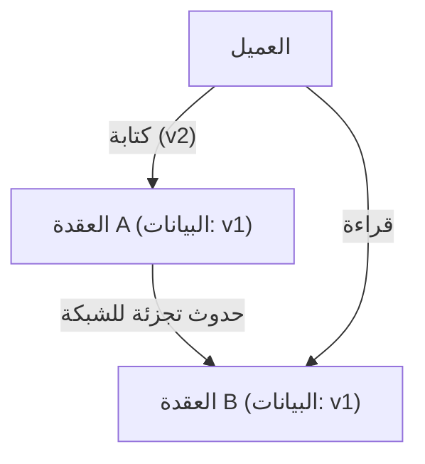
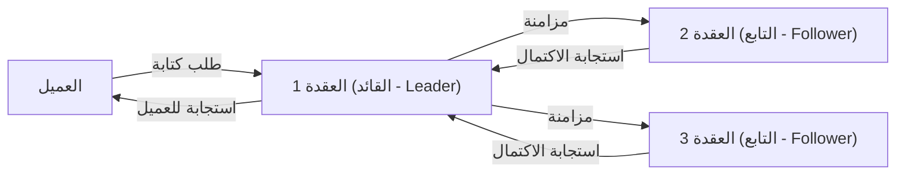

# مقدمة: الخيار النهائي في الأنظمة الموزعة

إن مجموعة الخدمات الضخمة التي تدعم الإنترنت في العصر الحديث لا تُبنى على خادم واحد، بل على عدد لا يُحصى من الخوادم (العقد - Nodes) الموزعة حول العالم. بدءًا من شركات التكنولوجيا العملاقة مثل Google، وAmazon، وFacebook، وصولاً إلى الشركات الناشئة سريعة النمو، أصبح تبني "أنظمة قواعد البيانات الموزعة" أمرًا لا مفر منه للتعامل مع الانفجار الهائل في البيانات.

ومع ذلك، فإن إدارة البيانات من خلال توزيعها عبر عقد متعددة يصاحبها تحديات معقدة لم تكن لتواجهنا في خادم فردي. يجد مهندسو النظم (Architects) الذين يحاولون تحسين أداء النظام وبناء أنظمة مقاومة للأعطال أنفسهم دائمًا مضطرين لاتخاذ قرارات حاسمة حول مقايضات (Trade-offs) صعبة بين ثلاثة عناصر: **"الاتساق (Consistency)"**، و**"التوافر (Availability)"**، و**"وقت الاستجابة (Latency)"**.

التنظيم المنهجي لهذه المعضلة الأساسية في تصميم الأنظمة الموزعة، سواء على المستوى الرياضي أو التجريبي، هو ما يُعرف بـ **"نظرية CAP"** التي اقترحها إريك بروير (Eric Brewer)، وما تلاها من توسيع وتكميل لتلائم التشغيل الفعلي عبر **"نظرية PACELC"**.

في هذا المقال، سنتعمق في هاتين النظريتين الهامتين اللتين لا غنى عن فهمهما لاستيعاب بنية أنظمة قواعد البيانات الموزعة، بدءًا من الأساسيات وحتى أمثلة التطبيق العملي.

---

# نظرية CAP: إثبات إريك بروير والرؤوس الثلاثة

في مؤتمر ACM PODC (مبادئ الحوسبة الموزعة) الذي عُقد في عام 2000، قدم إريك بروير، عالم الكمبيوتر في جامعة كاليفورنيا ببيركلي، قاعدة تجريبية في الحوسبة الموزعة. لاحقًا، أثبتها رياضيًا كل من سيث جيلبرت (Seth Gilbert) ونانسي لينش (Nancy Lynch) من معهد ماساتشوستس للتكنولوجيا (MIT)، لتُرسخ كـ "نظرية CAP".

تؤكد نظرية CAP أنه من بين الخصائص الثلاث التالية، **يمكن تحقيق صفتين فقط في نفس الوقت كحد أقصى**.

1. **الاتساق (Consistency: C)**
2. **التوافر (Availability: A)**
3. **التسامح مع التجزئة (Partition tolerance: P)**

أولاً، دعونا نحدد بدقة ما تعنيه كل خاصية من هذه الخصائص الثلاث.

## 1. الاتساق (Consistency)

"الاتساق" هنا يعني **"أن تتمكن جميع العقد من رؤية نفس البيانات في نفس الوقت"**.
بغض النظر عن العقدة التي يرسل إليها العميل (Client) طلب قراءة البيانات داخل النظام، يجب أن تعود دائمًا "بأحدث نتيجة للكتابة" أو ترجع "خطأ (لا توجد استجابة)". لا يُسمح بإرجاع بيانات قديمة (Stale Data).

## 2. التوافر (Availability)

"التوافر" يعني **"أن جميع العقد العاملة يجب أن ترجع استجابة دائمًا ضمن فترة زمنية معقولة"**.
حتى إذا حدث فشل في جزء من النظام، يجب على العقد المتبقية على قيد الحياة ألا تُرجع خطأ في مواجهة طلبات القراءة والكتابة من العميل، بل يجب أن تُرجع نوعًا من البيانات دائمًا (حتى وإن لم تكن الأحدث).

## 3. التسامح مع التجزئة (Partition tolerance)

"التسامح مع التجزئة" يعني **"حتى في حالة حدوث تجزئة للشبكة (تأخير أو فقدان للحزم) وانقطاع الاتصال بين العقد، يجب أن يستمر النظام بأكمله في العمل"**.
في الأنظمة الموزعة، يجب الافتراض أن "تجزئة الشبكة (Network Partition)"، حيث ينقطع الاتصال بين العقد بسبب قطع كابل الشبكة، أو فشل الموجه (Router)، أو التحميل الزائد المؤقت، هو أمر سيحدث حتمًا.

كما هو موضح في الشكل أعلاه، في حالة حدوث تجزئة للشبكة بين العقدة A والعقدة B، فإن أحدث البيانات (v2) المكتوبة على العقدة A لن تتم مزامنتها مع العقدة B. في هذه الحالة، إذا أرسل العميل طلب قراءة إلى العقدة B، كيف يجب أن يتصرف النظام؟

---

# لماذا لا يمكن تجنب تجزئة الشبكة (P)؟

من أكثر المفاهيم الخاطئة شيوعًا حول نظرية CAP هو الاعتقاد بأنه "يمكن بناء نظام CA يحقق كلًا من الاتساق (C) والتوافر (A)". في حين تنص النظرية على أنه "يمكنك اختيار اثنين من الثلاثة"، إلا أنه في **الأنظمة الموزعة في العالم الحقيقي، من المستحيل التخلي عن "التسامح مع التجزئة (P)".**

السبب في ذلك هو أن الشبكات بطبيعتها غير مستقرة، وانقطاع الاتصال بين العقد بسبب فقدان الحزم (Packet loss)، وإعادة تشغيل المحولات (Switches)، وفشل خطوط الاتصال بين مراكز البيانات أمر لا مفر منه من الناحية الاحتمالية. التخلي عن P يعني "بناء بيئة خادم فردي (بيئة غير موزعة) حيث لا تحدث فيها أعطال الشبكة مطلقًا"، وهو ما يتناقض مع الغرض الأساسي للأنظمة الموزعة.

لذلك، في تصميم قواعد البيانات الموزعة الواقعية، عندما تحدث تجزئة للشبكة (P)، فإننا نكون مضطرين للاختيار بين **تفضيل "الاتساق (C)" أو "التوافر (A)"** (أي نظام CP أو نظام AP).

---

# الاختيار عند حدوث التجزئة: نظام CP مقابل نظام AP

عند حدوث تجزئة للشبكة، يضطر النظام لاتخاذ سلوك إما CP أو AP.

## عند إعطاء الأولوية لـ CP (الاتساق + التسامح مع التجزئة)

هذه البنية تعطي الأولوية لـ "الاتساق" في حالة حدوث تجزئة.
نظرًا لأن العقدة B قد لا تمتلك أحدث البيانات (v2)، لتجنب خطر إرجاع بيانات قديمة، فإنها **تُرجع خطأ أو تحظر الاستجابة (مهلة - Timeout) حتى يتم استعادة الاتصال**.
من خلال هذا، يحافظ النظام ككل على مبدأ "عدم إرجاع بيانات قديمة مطلقًا (اتساق قوي)"، ولكن الثمن المدفوع هو فقدان "التوافر (A)".

**قواعد بيانات تمثيلية:**
- **HBase**: يعمل على نظام الملفات الموزع Hadoop (HDFS) ويوفر اتساقًا قويًا.
- **MongoDB**: في تكوين مجموعة النسخ المتماثلة (Replica set)، إذا تم عزل العقدة الأساسية عن الشبكة، يتم حظر عمليات الكتابة حتى يتم انتخاب عقدة أساسية جديدة، مما يضمن الاتساق.
- **ZooKeeper / etcd**: يُستخدم لإدارة الأقفال الموزعة والإعدادات، ويتوقف عن تقديم الخدمة إذا لم يتم الوصول إلى نصاب قانوني (Quorum) من الأغلبية.

## عند إعطاء الأولوية لـ AP (التوافر + التسامح مع التجزئة)

هذه البنية تعطي الأولوية لـ "التوافر" في حالة حدوث تجزئة.
حتى وإن كانت البيانات التي تمتلكها العقدة B **بيانات قديمة (v1)، فإنها ترجع استجابة دائمًا**. لا يحدث خطأ، ولكن ينشأ "عدم تناسق (Inconsistency)" حيث تختلف البيانات التي يراها المستخدم الذي يصل إلى العقدة A عن المستخدم الذي يصل إلى العقدة B (غالبًا ما يتم التصميم بحيث تتم المزامنة لاحقًا عند استعادة الاتصال، لتحقيق "الاتساق النهائي: Eventual Consistency").

**قواعد بيانات تمثيلية:**
- **Apache Cassandra**: تعتمد بنية خالية من العقدة الرئيسية (Masterless)، حيث تقبل أي عقدة عمليات القراءة والكتابة، مما يقلل من وقت التوقف عن العمل إلى الحد الأدنى.
- **Amazon DynamoDB**: يوفر بشكل افتراضي قراءة متسقة في النهاية (Eventual Consistency)، مما يحقق توافرًا عاليًا جدًا ووقت استجابة منخفضًا (تتوفر أيضًا خيارات الاتساق القوي).
- **Riak**: باعتباره مخزن قيم ومفاتيح موزع (KVS)، فقد تم تصميمه بالتركيز المطلق على تحقيق AP.

---

# حدود نظرية CAP وظهور نظرية PACELC

تعد نظرية CAP مؤشرًا رائعًا لفهم الأنظمة الموزعة، ولكن في الممارسة العملية، ظل هناك سؤال كبير واحد مطروحًا.

**"كيف يتصرف النظام في الأوقات 'العادية' التي لا توجد فيها تجزئة للشبكة؟"**

لا تشير نظرية CAP إلا إلى السلوك أثناء "حالات الفشل (تجزئة الشبكة)"، ولا تخبرنا بأي شيء عن أداء النظام في الأوقات العادية. ولذلك، اقترح دانييل أبادي (Daniel Abadi) من جامعة ماريلاند عام 2010 **"نظرية PACELC"**.

## بنية نظرية PACELC

نظرية PACELC هي امتداد لنظرية CAP، حيث تدمج المفاضلة بين "وقت الاستجابة (Latency)" و"الاتساق (Consistency)" في الأوقات العادية.

**PACELC = PAC + ELC**

- **If P (Partition):** إذا حدثت تجزئة للشبكة، فإن:
  - النظام سيعطي الأولوية إما لـ **A (التوافر - Availability)** أو **C (الاتساق - Consistency)** (نفس نظرية CAP).
- **Else (E):** خلاف ذلك، في الأوقات العادية التي يكون فيها الاتصال طبيعيًا:
  - النظام سيعطي الأولوية إما لـ **L (وقت الاستجابة - Latency)** أو **C (الاتساق - Consistency)**.

### المفاضلة بين وقت الاستجابة (L) والاتساق (C) في الأوقات العادية

عندما تعمل الشبكة بشكل طبيعي وتحدث عملية كتابة للبيانات، يجب على النظام اختيار أحد الخيارين التاليين:

1. **أولوية وقت الاستجابة (L)**:
   بمجرد كتابة البيانات في بعض العقد (أو عقدة واحدة)، يتم الرد فورًا على العميل بـ "اكتملت الكتابة". تتم مزامنة العقد المتبقية في الخلفية بشكل غير متزامن.
   - **المزايا**: سرعة الاستجابة (الكمون - Latency) سريعة جدًا.
   - **العيوب**: إذا قرأ عميل آخر من العقد الأخرى قبل اكتمال المزامنة، سيحصل على بيانات قديمة (يُفقد الاتساق مؤقتًا).

2. **أولوية الاتساق (C)**:
   يتم مزامنة البيانات عبر جميع العقد (أو أغلبها)، وينتظر العميل حتى يتم تأكيد "اكتمال الكتابة" من الجميع.
   - **المزايا**: يتم ضمان توفر أحدث البيانات دائمًا (اتساق قوي).
   - **العيوب**: تتباطأ سرعة الاستجابة (Latency) بسبب الحاجة إلى وقت للاتصال والانتظار بين العقد.

*(النسخ المتماثل المتزامن مع أولوية C. يزداد وقت الاستجابة لانتظار جميع عمليات المزامنة)*

## تصنيف قواعد البيانات بناءً على PACELC

باستخدام نظرية PACELC، يمكننا تصنيف قواعد البيانات بشكل أكثر دقة.

1. **PC/EC (C عند التجزئة، C في الأوقات العادية)**
   يتم إعطاء الأولوية القصوى للاتساق سواء في أوقات الفشل أو الأوقات العادية. يتم التضحية بوقت الاستجابة في الأوقات العادية.
   أمثلة: *VoltDB, Megastore, HBase*
2. **PC/EL (C عند التجزئة، L في الأوقات العادية)**
   يتم الحفاظ على الاتساق عند الفشل، ولكن في الأوقات العادية يتم التركيز على وقت الاستجابة من خلال النسخ المتماثل غير المتزامن وغيره.
   أمثلة: *MySQL Cluster, MongoDB (حسب الإعدادات)*
3. **PA/EC (A عند التجزئة، C في الأوقات العادية)**
   يتم إتاحة النظام عند الفشل، ولكن يتم ضمان الاتساق في الأوقات العادية. (※هذا تصنيف نظري، والتطبيقات الواقعية له قليلة)
4. **PA/EL (A عند التجزئة، L في الأوقات العادية)**
   يتم إعطاء الأولوية للتوافر عند الفشل، ويوضع وقت الاستجابة كأولوية قصوى في الأوقات العادية. يُقتصر الاتساق على "الاتساق النهائي".
   أمثلة: *Cassandra, DynamoDB, Riak*

---

# الخلاصة: لا يوجد نظام مثالي

ما تخبرنا به نظريتا CAP و PACELC هو حقيقة قاسية مفادها **"أنه لا توجد قاعدة بيانات موزعة مثالية في جميع الظروف"**.

في الأنظمة التي قد يتسبب فيها التناقض الطفيف في البيانات في مشاكل فادحة، مثل أنظمة الدفع المصرفية أو أنظمة إدارة المخزون، من الضروري اختيار نظام يميل نحو **CP (أي PC/EC)** حتى وإن تطلب ذلك التضحية ببعض وقت الاستجابة أو التوافر.
من ناحية أخرى، في الحالات التي لا يشكل فيها تقادم البيانات لبضع ثوانٍ تأثيرًا تجاريًا كبيرًا، مثل الخطوط الزمنية (Timelines) للشبكات الاجتماعية أو محركات التوصية لبث مقاطع الفيديو، حيث يكون المطلب الأساسي هو عدم توقف النظام أبدًا (التوافر) وسرعة الاستجابة (وقت الاستجابة)، فإن النظام الذي يميل نحو **AP (أي PA/EL)** هو الحل الأمثل.

ما يُطلب من مهندسي النظم هو الفهم العميق لهذه النظريات، وامتلاك القدرة على تحديد **"ما يجب إعطاؤه الأولوية، وما يجب التخلي عنه"** بدقة، وذلك بناءً على متطلبات الأعمال التي يقومون ببنائها.
في عالم الأنظمة الموزعة، فإن قبول الحلول الوسط (المقايضات) هو الخطوة الأولى نحو تصميم النظام الأكثر متانة.
