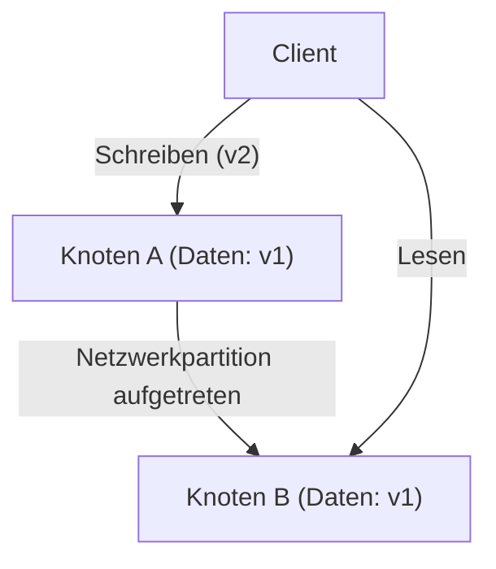
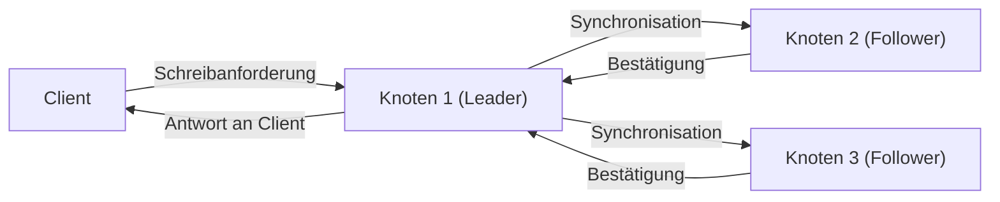

# Einleitung: Die ultimative Wahl bei verteilten Systemen

Die riesigen Dienste, die das moderne Internet stützen, werden nicht auf einem einzigen Server, sondern durch unzählige, weltweit verteilte Server (Knoten) aufgebaut. Von Tech-Giganten wie Google, Amazon und Facebook bis hin zu schnell wachsenden Start-ups ist die Einführung von „verteilten Datenbanksystemen“ unumgänglich geworden, um dem explosiven Anstieg von Daten gerecht zu werden.

Die verteilte Platzierung und Verwaltung von Daten auf mehreren Knoten bringt jedoch komplexe Herausforderungen mit sich, mit denen man bei einzelnen Servern nie konfrontiert war. Architekten, die versuchen, die Systemleistung zu steigern und fehlertolerante Systeme zu entwerfen, sind ständig gezwungen, harte Kompromissentscheidungen (Trade-offs) zwischen den Faktoren **„Konsistenz (Consistency)“**, **„Verfügbarkeit (Availability)“** und **„Latenz (Latency)“** zu treffen.

Die mathematische oder empirische Systematisierung dieses grundlegenden Dilemmas beim Design verteilter Systeme ist das **„CAP-Theorem“**, das von Eric Brewer vorgeschlagen wurde, und das **„PACELC-Theorem“**, welches es später ergänzt und für reale Betriebsszenarien erweitert hat.

In diesem Artikel werden wir diese beiden wichtigen Theoreme, die man nicht ignorieren kann, wenn man die Architektur von verteilten Datenbanksystemen verstehen möchte, von den Grundlagen bis hin zu praktischen Anwendungsbeispielen vertiefen.

---

# Das CAP-Theorem: Die Beweisführung von Eric Brewer und die drei Eckpunkte

Auf der Konferenz ACM PODC (Principles of Distributed Computing) im Jahr 2000 präsentierte der Informatiker Eric Brewer von der University of California, Berkeley, eine empirische Regel im Bereich des verteilten Rechnens. Das CAP-Theorem wurde später von Seth Gilbert und Nancy Lynch vom MIT mathematisch bewiesen und als „Theorem“ etabliert.

Das CAP-Theorem besagt, dass von den folgenden drei Eigenschaften **höchstens zwei gleichzeitig erfüllt werden können**.

1. **Konsistenz (Consistency: C)**
2. **Verfügbarkeit (Availability: A)**
3. **Ausfalltoleranz / Partitionstoleranz (Partition tolerance: P)**

Lassen Sie uns zunächst genau definieren, was diese drei Eigenschaften bedeuten.

## 1. Konsistenz (Consistency)

„Konsistenz“ bedeutet in diesem Kontext, **„dass alle Knoten gleichzeitig auf dieselben Daten zugreifen können“**.
Egal an welchen Knoten im System ein Client eine Leseanforderung stellt, er erhält entweder immer das „aktuellste Schreibergebnis“ oder einen „Fehler (keine Antwort)“. Die Rückgabe veralteter Daten (Stale Data) ist nicht zulässig.

## 2. Verfügbarkeit (Availability)

„Verfügbarkeit“ bedeutet, **„dass alle funktionierenden Knoten innerhalb einer angemessenen Zeit immer eine Antwort zurückgeben“**.
Auch wenn ein Teil des Systems ausfällt, müssen die überlebenden Knoten auf Lese- und Schreibanforderungen der Clients reagieren, ohne Fehler zurückzugeben, und immer irgendwelche Daten (selbst wenn sie nicht die aktuellsten sind) zurückgeben.

## 3. Partitionstoleranz (Partition tolerance)

„Partitionstoleranz“ bedeutet, **„dass das Gesamtsystem auch dann weiter funktioniert, wenn eine Netzwerkpartitionierung (Verzögerung oder Verlust von Paketen) auftritt und die Kommunikation zwischen den Knoten unterbrochen wird“**.
In verteilten Systemen muss davon ausgegangen werden, dass eine „Netzwerkpartitionierung (Network Partition)“, also die Unterbrechung der Kommunikation zwischen Knoten durch durchtrennte Netzwerkkabel, defekte Router oder vorübergehende Überlastung, mit Sicherheit auftreten kann.

Wie in der obigen Abbildung dargestellt, werden die in Knoten A geschriebenen neuesten Daten (v2) nicht mit Knoten B synchronisiert, wenn zwischen Knoten A und Knoten B eine Netzwerkpartitionierung auftritt. Wie sollte sich das System verhalten, wenn der Client in diesem Fall eine Leseanforderung an Knoten B sendet?

---

# Warum ist eine Netzwerkpartition (P) unvermeidlich?

Das häufigste Missverständnis in Bezug auf das CAP-Theorem ist der Glaube, man könne „ein CA-System bauen, das C und A erfüllt“. Obwohl das Theorem besagt, dass „zwei der drei ausgewählt werden können“, ist es **in realen verteilten Systemen unmöglich, die „Partitionstoleranz (P)“ aufzugeben.**

Der Grund dafür ist, dass Netzwerke von Natur aus instabil sind und Kommunikationsausfälle zwischen Knoten – wie Paketverluste, Switch-Neustarts oder Leitungsausfälle zwischen Rechenzentren – probabilistisch gesehen zwangsläufig auftreten werden. P aufzugeben ist gleichbedeutend mit „dem Aufbau einer Einzelserverumgebung (einer nicht-verteilten Umgebung), in der Netzwerkausfälle absolut nie auftreten“, was die Prämisse eines verteilten Systems untergraben würde.

Folglich ist man im realen verteilten Datenbankdesign gezwungen, sich zwischen zwei Optionen (CP oder AP) zu entscheiden: **Ob man „Konsistenz (C)“ oder „Verfügbarkeit (A)“ priorisiert**, wenn eine Netzwerkpartition (P) auftritt.

---

# Wahl beim Auftreten einer Partition: CP-System vs. AP-System

Wenn eine Netzwerkpartition auftritt, hat das System keine andere Wahl, als sich entweder als CP oder als AP zu verhalten.

## Wenn CP (Consistency + Partition tolerance) priorisiert wird

Eine Architektur, die bei Auftreten einer Partition die „Konsistenz“ in den Vordergrund stellt.
Da Knoten B möglicherweise nicht die neuesten Daten (v2) hat, wird er, um das Risiko der Rückgabe veralteter Daten zu vermeiden, **entweder einen Fehler zurückgeben oder die Antwort blockieren (Timeout), bis die Kommunikation wiederhergestellt ist**.
Dadurch wird zwar systemweit „niemals veraltete Daten zurückgegeben (starke Konsistenz)“ aufrechterhalten, aber auf Kosten der „Verfügbarkeit (A)“.

**Typische Datenbanken:**
- **HBase**: Läuft auf HDFS und bietet starke Konsistenz.
- **MongoDB**: In einer Replica-Set-Konfiguration werden Schreibvorgänge blockiert, bis ein neuer Primary gewählt ist, falls der Primary-Knoten vom Netzwerk isoliert wird, wodurch Konsistenz gewährleistet wird.
- **ZooKeeper / etcd**: Wird für verteilte Sperren und Konfigurationsmanagement verwendet und stoppt den Dienst, wenn keine Mehrheitszustimmung (Quorum) erreicht werden kann.

## Wenn AP (Availability + Partition tolerance) priorisiert wird

Eine Architektur, die bei Auftreten einer Partition die „Verfügbarkeit“ in den Vordergrund stellt.
Knoten B wird **immer eine Antwort zurückgeben, selbst wenn es die veralteten Daten (v1)** sind, die er besitzt. Es tritt zwar kein Fehler auf, aber es entsteht eine „Inkonsistenz (Inconsistency)“, bei der die Daten, die von einem Benutzer, der auf Knoten A zugreift, und einem Benutzer, der auf Knoten B zugreift, gesehen werden, unterschiedlich sind (Oft wird das System so entworfen, dass die Daten nach der Wiederherstellung der Kommunikation synchronisiert werden, um eine „Letztendliche Konsistenz: Eventual Consistency“ zu erreichen).

**Typische Datenbanken:**
- **Apache Cassandra**: Verwendet eine Masterless-Architektur, bei der jeder Knoten Lese- und Schreibvorgänge akzeptiert, um die Ausfallzeit zu minimieren.
- **Amazon DynamoDB**: Bietet standardmäßig Eventual Consistency beim Lesen und ermöglicht eine extrem hohe Verfügbarkeit und geringe Latenz (Optionen für starke Konsistenz sind ebenfalls verfügbar).
- **Riak**: Ein verteilter Key-Value-Store, der strikt nach dem AP-Prinzip konzipiert ist.

---

# Die Grenzen des CAP-Theorems und das Aufkommen des PACELC-Theorems

Das CAP-Theorem ist ein hervorragender Indikator zum Verständnis verteilter Systeme, in der Praxis blieb jedoch eine große Frage offen.

**„Wie verhält sich das System in ‚Normalzeiten‘, in denen keine Netzwerkpartitionierung auftritt?“**

Das CAP-Theorem bezieht sich nur auf das Verhalten während einer „Ausfallzeit (während einer Netzwerkpartition)“ und sagt nichts über die Systemleistung in Normalzeiten aus. Daher wurde 2010 das **„PACELC-Theorem“** von Daniel Abadi an der University of Maryland vorgeschlagen.

## Struktur des PACELC-Theorems

Das PACELC-Theorem erweitert das CAP-Theorem, indem es den Kompromiss zwischen „Latenz“ und „Konsistenz“ in Normalzeiten einbezieht.

**PACELC = PAC + ELC**

- **If P (Partition):** Wenn eine Netzwerkpartition auftritt,
  - wird entweder **A (Availability)** oder **C (Consistency)** priorisiert (wie beim CAP-Theorem).
- **Else (E):** Andernfalls, in Normalzeiten mit erfolgreicher Kommunikation,
  - wird entweder **L (Latency)** oder **C (Consistency)** priorisiert.

### Der Trade-off zwischen Latenz (L) und Konsistenz (C) in Normalzeiten

Wenn das Netzwerk normal funktioniert und ein Datenschreibvorgang stattfindet, muss sich das System für eine der beiden folgenden Möglichkeiten entscheiden:

1. **Latenz (L) priorisiert**:
   Sobald die Daten auf einige Knoten (oder einen Knoten) geschrieben wurden, wird dem Client sofort eine Bestätigung „Schreiben abgeschlossen“ zurückgegeben. Die Synchronisation mit den restlichen Knoten erfolgt asynchron im Hintergrund.
   - **Vorteile**: Die Reaktionszeit (Latenz) ist sehr schnell.
   - **Nachteile**: Wenn ein anderer Client von anderen Knoten liest, bevor die Synchronisation abgeschlossen ist, werden veraltete Daten zurückgegeben (Konsistenz ist vorübergehend beeinträchtigt).

2. **Konsistenz (C) priorisiert**:
   Die Daten werden mit allen Knoten (oder der Mehrheit der Knoten) synchronisiert, und der Client muss warten, bis von allen eine Bestätigung „Schreiben abgeschlossen“ eingeht.
   - **Vorteile**: Die neuesten Daten sind immer garantiert (starke Konsistenz).
   - **Nachteile**: Die Reaktionszeit (Latenz) wird langsamer, da Kommunikation zwischen den Knoten und Wartezeiten anfallen.

* (Synchrone Replikation mit C-Priorität. Die Latenz steigt an, da auf alle Synchronisationen gewartet wird)*

## Klassifizierung von Datenbanken anhand von PACELC

Mit dem PACELC-Theorem können Datenbanken präziser klassifiziert werden.

1. **PC/EC (Bei Partition C, andernfalls C)**
   Konsistenz hat sowohl im Fehlerfall als auch in Normalzeiten oberste Priorität. Die Latenz in Normalzeiten wird geopfert.
   Beispiele: *VoltDB, Megastore, HBase*
2. **PC/EL (Bei Partition C, andernfalls L)**
   Gewährleistet Konsistenz im Fehlerfall, priorisiert jedoch die Latenz in Normalzeiten, z.B. durch asynchrone Replikation.
   Beispiele: *MySQL Cluster, MongoDB (abhängig von der Konfiguration)*
3. **PA/EC (Bei Partition A, andernfalls C)**
   Macht das System im Fehlerfall verfügbar, garantiert jedoch Konsistenz in Normalzeiten. (*Theoretische Klassifizierung, wenige reale Implementierungen)*
4. **PA/EL (Bei Partition A, andernfalls L)**
   Verfügbarkeit wird im Fehlerfall priorisiert, und Latenz hat in Normalzeiten oberste Priorität. Konsistenz ist auf „Eventual Consistency“ beschränkt.
   Beispiele: *Cassandra, DynamoDB, Riak*

---

# Fazit: Ein perfektes System existiert nicht

Was uns das CAP-Theorem und das PACELC-Theorem lehren, ist die unbarmherzige Tatsache, **„dass unter keinen Umständen eine perfekte verteilte Datenbank existiert“**.

Wenn eine geringfügige Dateninkonsistenz fatale Probleme verursachen kann, wie bei Bankzahlungssystemen oder Bestandsverwaltungssystemen, ist es notwendig, ein System zu wählen, das in Richtung **CP (PC/EC)** tendiert, selbst wenn man dafür Latenz und Verfügbarkeit bis zu einem gewissen Grad opfern muss.
Andererseits ist ein System, das in Richtung **AP (PA/EL)** tendiert, die optimale Lösung, wenn es kaum geschäftliche Auswirkungen hat, wenn Daten einige Sekunden alt sind, und das System vor allem nicht ausfallen darf (Verfügbarkeit) sowie schnelle Antworten (Latenz) erfordert, wie bei SNS-Timelines oder Empfehlungsmaschinen für Video-Streaming.

Was von Systemarchitekten verlangt wird, ist nichts anderes als das Urteilsvermögen, diese Theoreme tief zu verstehen und genau zu erkennen, **„was priorisiert und was verworfen werden muss“** für die geschäftlichen Anforderungen, die sie aufbauen.
In der Welt der verteilten Systeme ist die Akzeptanz von Kompromissen (Trade-offs) der erste Schritt zum Entwurf des robustesten Systems.
