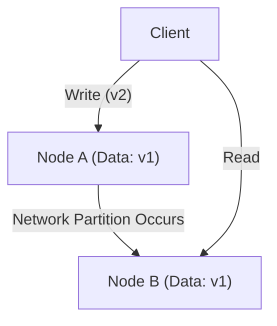
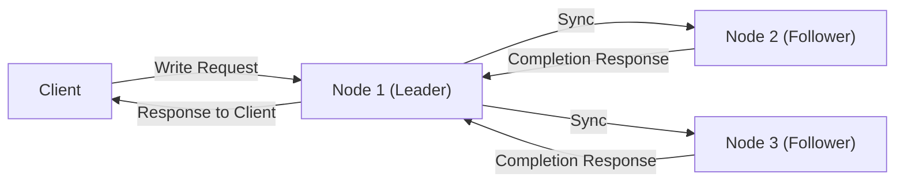

# Introduction: The Ultimate Choice in Distributed Systems

The massive services supporting the modern internet are not built on a single server, but on countless server groups (nodes) distributed worldwide. From giant tech companies like Google, Amazon, and Facebook to rapidly growing startups, the adoption of "distributed database systems" has become inevitable to cope with the explosive growth of data.

However, managing data by distributing it across multiple nodes comes with complex challenges that were never encountered with a single server. Architects aiming to improve system performance and build fault-tolerant systems are constantly forced to make tough trade-off decisions between three elements: **Consistency**, **Availability**, and **Latency**.

The fundamental dilemma in this distributed system design was systematized mathematically or empirically by Eric Brewer, who proposed the **"CAP Theorem"**, and later supplemented and extended it to fit real-world operations with the **"PACELC Theorem"**.

In this article, we will delve deeply into these two crucial theorems, from the basics to practical application examples, which are unavoidable when understanding the architecture of distributed database systems.

---

# The CAP Theorem: Eric Brewer's Proof and the Three Vertices

At the ACM PODC (Principles of Distributed Computing) conference held in 2000, Eric Brewer, a computer scientist at the University of California, Berkeley, presented a rule of thumb in distributed computing. It was later proven mathematically by Seth Gilbert and Nancy Lynch of MIT, establishing it as the CAP theorem.

The CAP theorem asserts that out of the following three properties, **a maximum of only two can be satisfied simultaneously**.

1. **Consistency (C)**
2. **Availability (A)**
3. **Partition tolerance (P)**

First, let us accurately define what these three properties mean.

## 1. Consistency

"Consistency" here refers to **"all nodes being able to reference the same data at the same time."**
No matter which node in the system a client sends a data read request to, it will always return the "latest write result" or result in an "error (no response)." Returning stale data is not permitted.

## 2. Availability

"Availability" means **"all operating nodes must guarantee a response within a reasonable time frame."**
Even if a failure occurs in part of the system, the surviving nodes must return some data (even if it is not the latest) in response to a client's read/write request without returning an error.

## 3. Partition tolerance

"Partition tolerance" means **"the system as a whole continues to operate even if a network partition (packet delay or loss) occurs and communication between nodes is severed."**
In a distributed system, it must be assumed that "network partitions," where communication between nodes is blocked due to disconnected network cables, router failures, or temporary overloads, can and will occur.

As shown in the diagram above, if a network partition occurs between Node A and Node B, the latest data (v2) written to Node A will not be synchronized to Node B. At this time, if a client makes a read request to Node B, how should the system behave?

---

# Why are Network Partitions (P) Unavoidable?

The most common misconception about the CAP theorem is the misunderstanding that "a CA system that satisfies C and A can be built." Although the theorem states that "you can choose two out of three," **in real-world distributed systems, abandoning "Partition tolerance (P)" is impossible.**

This is because networks are inherently unstable, and communication severances between nodes, such as packet loss, switch restarts, and line failures between data centers, will probabilistically always occur. Abandoning P is synonymous with "building a single-server environment (non-distributed environment) where network failures absolutely never happen," which overturns the very premise of a distributed system.

Therefore, in actual distributed database design, when a network partition (P) occurs, one is forced to make a binary choice (CP or AP) about **whether to prioritize "Consistency (C)" or "Availability (A)."**

---

# Choices During a Partition: CP Systems vs. AP Systems

When a network partition occurs, the system has no choice but to adopt either CP or AP behavior.

## When Prioritizing CP (Consistency + Partition tolerance)

This is an architecture that prioritizes "Consistency" when a partition occurs.
Since Node B might not have the latest data (v2), to avoid the risk of returning stale data, **it either returns an error or blocks the response (times out) until communication is restored**.
As a result, the system as a whole maintains that "stale data is absolutely never returned (strong consistency)," but at the cost of "Availability (A)."

**Representative Databases:**
- **HBase**: Runs on HDFS and provides strong consistency.
- **MongoDB**: In a replica set configuration, if the primary node is isolated from the network, writes are blocked until a new primary is elected, ensuring consistency.
- **ZooKeeper / etcd**: Used for distributed locks and configuration management; they halt service if a majority consensus (Quorum) cannot be obtained.

## When Prioritizing AP (Availability + Partition tolerance)

This is an architecture that prioritizes "Availability" when a partition occurs.
Node B will **always return a response, even if it is the stale data (v1) it currently holds**. It will not result in an error, but an "Inconsistency" occurs where the data seen by a user accessing Node A differs from the data seen by a user accessing Node B. (It is often designed so that they are synchronized when communication is restored, satisfying "Eventual Consistency").

**Representative Databases:**
- **Apache Cassandra**: Adopts a masterless architecture, accepting reads and writes at any node to minimize downtime.
- **Amazon DynamoDB**: Provides eventually consistent reads by default, achieving extremely high availability and low latency (a strong consistency option is also available).
- **Riak**: As a distributed KVS, it is thoroughly designed for AP.

---

# The Limits of the CAP Theorem and the Emergence of the PACELC Theorem

While the CAP theorem is an excellent metric for understanding distributed systems, one major question remained in practice.

**"How does the system behave during 'normal times' when no network partition has occurred?"**

The CAP theorem only mentions the behavior during "failures (network partitions)" and says nothing about system performance during normal operations. Thus, in 2010, Daniel Abadi of the University of Maryland proposed the **"PACELC Theorem"**.

## Structure of the PACELC Theorem

The PACELC theorem extends the CAP theorem by incorporating the trade-off between "Latency" and "Consistency" during normal times.

**PACELC = PAC + ELC**

- **If P (Partition):** When a network partition has occurred,
  - Prioritize either **A (Availability)** or **C (Consistency)** (Same as the CAP theorem).
- **Else (E):** Otherwise, during normal times when communication is normal,
  - Prioritize either **L (Latency)** or **C (Consistency)**.

### The Trade-off Between Latency (L) and Consistency (C) During Normal Times

When the network is functioning normally and a data write occurs, the system must choose one of the following:

1. **Latency (L) Priority**:
   As soon as data is written to some nodes (or just one node), "write complete" is immediately returned to the client. Synchronization to the remaining nodes is performed asynchronously in the background.
   - **Pros**: The response speed (latency) is extremely fast.
   - **Cons**: If another client reads from another node before synchronization is complete, stale data is returned (consistency is temporarily compromised).

2. **Consistency (C) Priority**:
   Data is synchronized to all nodes (or a majority of nodes), and the client is made to wait until confirmation of "write complete" is obtained from all of them.
   - **Pros**: The latest data is always guaranteed (strong consistency).
   - **Cons**: Response speed (latency) becomes slower due to communication and waiting times between nodes.

*(Sync replication with C priority. Latency increases because it waits for all synchronizations)*

## Database Classification by PACELC

Using the PACELC theorem, databases can be classified more accurately.

1. **PC/EC (C during Partition, C during normal times)**
   Consistency is the top priority both during failures and normal times. Latency during normal times is sacrificed.
   Examples: *VoltDB, Megastore, HBase*
2. **PC/EL (C during Partition, L during normal times)**
   Protects consistency during failures, but emphasizes latency during normal times by performing asynchronous replication, etc.
   Examples: *MySQL Cluster, MongoDB (depending on configuration)*
3. **PA/EC (A during Partition, C during normal times)**
   Makes the system available during failures, but guarantees consistency during normal times. (*This is a theoretical classification with few practical implementations*)
4. **PA/EL (A during Partition, L during normal times)**
   Prioritizes availability during failures and latency during normal times. Consistency is kept at "Eventual Consistency".
   Examples: *Cassandra, DynamoDB, Riak*

---

# Conclusion: The Perfect System Does Not Exist

What the CAP theorem and the PACELC theorem teach us is the cruel fact that **"a perfect distributed database that works perfectly under any circumstance does not exist."**

When even a slight data inconsistency can cause fatal problems, such as in bank settlement systems or inventory management systems, it is necessary to choose a system leaning towards **CP (PC/EC)**, even if it means sacrificing latency and availability to some extent.
On the other hand, for social media timelines or video streaming recommendation engines, where data being a few seconds old has little business impact, and where not going down (availability) and quick responses (latency) are demanded above all, a system leaning towards **AP (PA/EL)** is the optimal solution.

What is required of system architects is precisely the judgment to deeply understand these theorems and accurately discern **"what to prioritize and what to discard"** based on the business requirements they are building for.
In the world of distributed systems, accepting trade-offs is the very first step to designing the most robust systems.
