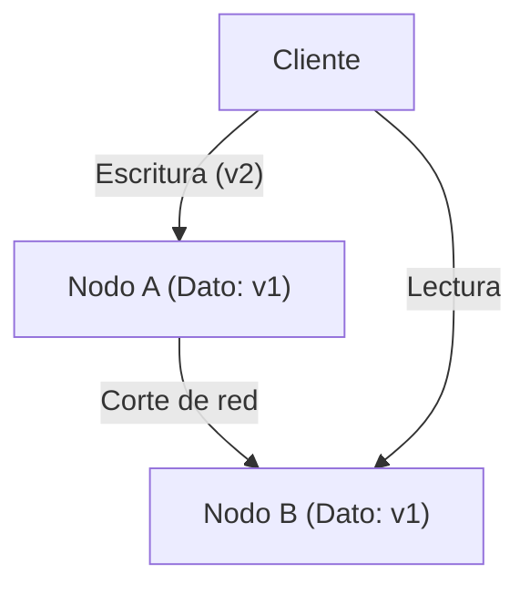
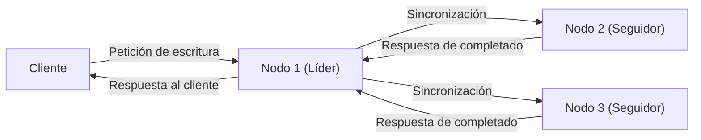

# Introducción: La elección definitiva en los sistemas distribuidos

Los gigantescos servicios que sustentan la Internet moderna no están construidos sobre un único servidor, sino sobre un innumerable grupo de servidores (nodos) distribuidos por todo el mundo. Desde gigantes tecnológicos como Google, Amazon y Facebook, hasta startups de rápido crecimiento, la adopción de "sistemas de bases de datos distribuidas" se ha vuelto inevitable para hacer frente al crecimiento explosivo de los datos.

Sin embargo, distribuir y gestionar datos en múltiples nodos conlleva desafíos complejos que no se enfrentaban en un entorno de servidor único. Los arquitectos que intentan mejorar el rendimiento del sistema y construir sistemas tolerantes a fallos se ven constantemente obligados a tomar decisiones difíciles de compromiso (trade-offs) entre tres elementos: **"Consistencia (Consistency)"**, **"Disponibilidad (Availability)"** y **"Latencia (Latency)"**.

El dilema fundamental en el diseño de estos sistemas distribuidos fue sistematizado matemática y empíricamente por Eric Brewer a través de lo que propuso como el **"Teorema CAP"**, y posteriormente complementado y ampliado para adaptarse a operaciones del mundo real con el **"Teorema PACELC"**.

En este artículo, profundizaremos en estos dos importantes teoremas, que son inevitables para comprender la arquitectura de los sistemas de bases de datos distribuidas, desde lo más básico hasta sus ejemplos de aplicación práctica.

---

# Teorema CAP: La prueba de Eric Brewer y los tres vértices

En el año 2000, durante la conferencia ACM PODC (Principles of Distributed Computing), el científico informático de la Universidad de California, Berkeley, Eric Brewer, presentó una regla empírica en el ámbito de la computación distribuida. Posteriormente fue demostrada matemáticamente por Seth Gilbert y Nancy Lynch del MIT, estableciéndose formalmente como el "Teorema" CAP.

El teorema CAP sostiene que de las tres propiedades siguientes, **es posible satisfacer de forma simultánea un máximo de dos**:

1. **Consistencia (Consistency: C)**
2. **Disponibilidad (Availability: A)**
3. **Tolerancia a particiones (Partition tolerance: P)**

En primer lugar, vamos a definir con precisión qué significan estas tres propiedades.

## 1. Consistencia (Consistency)

En este contexto, la "consistencia" significa que **"todos los nodos pueden acceder a los mismos datos al mismo tiempo"**.
Sin importar a qué nodo dentro del sistema un cliente envíe una solicitud de lectura de datos, siempre se devuelve el "último resultado de escritura" o bien se produce un estado de "error (sin respuesta)". No se tolera que se devuelvan datos antiguos (Stale Data).

## 2. Disponibilidad (Availability)

La "disponibilidad" significa que **"todos los nodos operativos siempre devuelven una respuesta dentro de un tiempo razonable"**.
Incluso si ocurre un fallo en una parte del sistema, los nodos supervivientes deben devolver obligatoriamente algún tipo de dato (incluso si no es el más reciente) a las solicitudes de lectura y escritura del cliente, sin devolver un error.

## 3. Tolerancia a particiones (Partition tolerance)

La "tolerancia a particiones" significa que **"el sistema en su conjunto debe continuar operando incluso si ocurre una partición en la red (retraso o pérdida de paquetes) y se corta la comunicación entre los nodos"**.
En un sistema distribuido, se debe asumir que las "particiones de red (Network Partition)", en las cuales la comunicación entre nodos se bloquea debido a cables de red cortados, fallos en los routers o sobrecargas temporales, pueden y van a ocurrir de forma inevitable.

Como se muestra en el diagrama anterior, si ocurre una partición de red entre el Nodo A y el Nodo B, los últimos datos (v2) escritos en el Nodo A no se sincronizarán con el Nodo B. En ese momento, si el cliente hace una solicitud de lectura al Nodo B, ¿cómo debería comportarse el sistema?

---

# ¿Por qué la partición de red (P) es inevitable?

El malentendido más común sobre el teorema CAP es la ilusión de que "se puede construir un sistema CA que satisfaga tanto C como A". Si bien el teorema indica que se pueden "elegir dos de las tres", **en un sistema distribuido del mundo real, es imposible abandonar la "Tolerancia a particiones (P)".**

Esto se debe a que una red es inherentemente inestable. Pérdidas de paquetes, reinicios de switches o fallos de línea entre centros de datos hacen que las interrupciones en la comunicación entre nodos ocurran estadísticamente de manera inevitable. Renunciar a P equivale a "construir un entorno de servidor único (entorno no distribuido) donde los fallos de red nunca ocurrirán en absoluto", lo cual contradice la propia premisa de un sistema distribuido.

Por lo tanto, en el diseño real de bases de datos distribuidas, cuando ocurre una partición de red (P), los arquitectos se ven obligados a elegir entre dos opciones (CP o AP): **priorizar la "Consistencia (C)" o priorizar la "Disponibilidad (A)"**.

---

# La elección ante una partición: Sistema CP vs Sistema AP

Cuando se produce una partición de red, el sistema no tiene más remedio que adoptar un comportamiento CP o un comportamiento AP.

## Cuando se prioriza CP (Consistency + Partition tolerance)

Esta es una arquitectura que prioriza la "consistencia" cuando ocurre una partición.
Debido a que el Nodo B podría no tener los últimos datos (v2), para evitar el riesgo de devolver datos antiguos, **devuelve un error o bloquea la respuesta (timeout) hasta que se recupere la comunicación**.
Con esto, el sistema en su conjunto mantiene su postura de "nunca devolver datos antiguos (consistencia fuerte)", pero a cambio, se ve comprometida la "disponibilidad (A)".

**Bases de datos representativas:**
- **HBase**: Funciona sobre HDFS y proporciona una consistencia fuerte.
- **MongoDB**: En una configuración de conjunto de réplicas, si el nodo primario queda aislado de la red, bloquea las escrituras hasta que se elige un nuevo primario, garantizando así la consistencia.
- **ZooKeeper / etcd**: Utilizados para bloqueos distribuidos (locks) y gestión de configuraciones; si no logran alcanzar el consenso de la mayoría (Quorum), detienen el servicio.

## Cuando se prioriza AP (Availability + Partition tolerance)

Esta es una arquitectura que prioriza la "disponibilidad" cuando ocurre una partición.
El Nodo B **siempre devuelve una respuesta, incluso si los datos que tiene son antiguos (v1)**. Aunque no resulta en un error, se produce una "inconsistencia (Inconsistency)" en la que el usuario que accede al Nodo A y el usuario que accede al Nodo B ven datos diferentes (a menudo se diseña para sincronizarse una vez que la comunicación se recupera, cumpliendo con la "consistencia eventual (Eventual Consistency)").

**Bases de datos representativas:**
- **Apache Cassandra**: Adopta una arquitectura sin maestro (masterless), donde cualquier nodo puede aceptar lecturas y escrituras, minimizando el tiempo de inactividad.
- **Amazon DynamoDB**: Por defecto proporciona lecturas de consistencia eventual, logrando una altísima disponibilidad y baja latencia (también existe una opción de consistencia fuerte).
- **Riak**: Diseñado como un KVS (almacén de clave-valor) distribuido que prioriza AP en su totalidad.

---

# Los límites del teorema CAP y la aparición del teorema PACELC

Aunque el teorema CAP es una excelente métrica para comprender los sistemas distribuidos, en la práctica quedaba una gran incógnita.

**"¿Cómo se comporta el sistema en 'tiempos normales', cuando no hay partición de red?"**

El teorema CAP solo habla del comportamiento durante "emergencias (particiones de red)" y no dice nada sobre el rendimiento del sistema en tiempos normales. Por ello, en 2010, Daniel Abadi de la Universidad de Maryland propuso el **"Teorema PACELC"**.

## Estructura del teorema PACELC

El teorema PACELC amplía el teorema CAP incorporando el trade-off entre "latencia" y "consistencia" durante los tiempos normales de operación.

**PACELC = PAC + ELC**

- **If P (Partition):** Si ocurre una partición de red,
  - Priorizar ya sea **A (Availability)** o **C (Consistency)** (Igual que el teorema CAP).
- **Else (E):** De lo contrario, en tiempos normales donde la comunicación es exitosa,
  - Priorizar ya sea **L (Latency)** o **C (Consistency)**.

### El compromiso entre Latencia (L) y Consistencia (C) en tiempos normales

Cuando la red funciona correctamente y se produce una escritura de datos, el sistema debe elegir una de las dos opciones siguientes:

1. **Prioridad a la latencia (L)**:
   Al momento en que los datos se escriben en algunos nodos (o en un único nodo), se devuelve inmediatamente al cliente la respuesta de "escritura completada". La sincronización con los nodos restantes se realiza de forma asíncrona en segundo plano.
   - **Ventaja**: La velocidad de respuesta (latencia) es sumamente rápida.
   - **Desventaja**: Si otro cliente lee desde un nodo diferente antes de que finalice la sincronización, obtendrá datos antiguos (la consistencia se ve temporalmente comprometida).

2. **Prioridad a la consistencia (C)**:
   Los datos se sincronizan con todos los nodos (o la mayoría de ellos), y se hace esperar al cliente hasta que se recibe confirmación de "escritura completada" de todos ellos.
   - **Ventaja**: Siempre se garantiza el dato más reciente (consistencia fuerte).
   - **Desventaja**: La velocidad de respuesta (latencia) es más lenta debido a que implica tiempo de espera y comunicación entre nodos.

*(Replicación síncrona priorizando C. La latencia aumenta porque espera toda la sincronización.)*

## Clasificación de bases de datos mediante PACELC

Al emplear el teorema PACELC, es posible clasificar las bases de datos de forma más precisa.

1. **PC/EC (C durante partición, C en tiempos normales)**
   La consistencia es la máxima prioridad tanto en fallos como en tiempos normales. La latencia en tiempos normales es sacrificada.
   Ejemplo: *VoltDB, Megastore, HBase*
2. **PC/EL (C durante partición, L en tiempos normales)**
   Se protege la consistencia durante fallos, pero en tiempos normales se da importancia a la latencia, realizando procesos como la replicación asíncrona.
   Ejemplo: *MySQL Cluster, MongoDB (dependiendo de la configuración)*
3. **PA/EC (A durante partición, C en tiempos normales)**
   Se mantiene disponible durante fallos, pero garantiza la consistencia en tiempos normales. (*Es una clasificación teórica y tiene pocas implementaciones reales.*)
4. **PA/EL (A durante partición, L en tiempos normales)**
   Prioriza la disponibilidad durante los fallos y prioriza enormemente la latencia en tiempos normales. La consistencia se limita a "consistencia eventual".
   Ejemplo: *Cassandra, DynamoDB, Riak*

---

# Conclusión: No existe el sistema perfecto

Lo que nos enseñan el teorema CAP y el teorema PACELC es la cruel realidad de que **"no existe una base de datos distribuida perfecta bajo todas las circunstancias"**.

Si una leve inconsistencia de datos puede causar problemas fatales, como en el sistema de liquidación de un banco o en un sistema de gestión de inventarios, es necesario elegir un sistema inclinado hacia **CP (PC/EC)**, incluso si esto significa sacrificar en cierta medida la latencia o la disponibilidad.
Por otro lado, si un retraso de unos pocos segundos en los datos tiene un impacto comercial mínimo y lo más exigido es evitar caídas del servicio (disponibilidad) con respuestas rápidas (latencia), como en las líneas de tiempo de redes sociales o en los motores de recomendación para la transmisión de videos, un sistema más inclinado hacia **AP (PA/EL)** será la solución óptima.

Lo que se les exige a los arquitectos de sistemas no es otra cosa que un buen juicio, fundamentado en una comprensión profunda de estos teoremas, para determinar con exactitud **"qué priorizar y qué descartar"** dentro de los requisitos de negocio que están construyendo.
En el mundo de los sistemas distribuidos, aceptar estas concesiones (trade-offs) es, en efecto, el primer paso para diseñar los sistemas más robustos.
