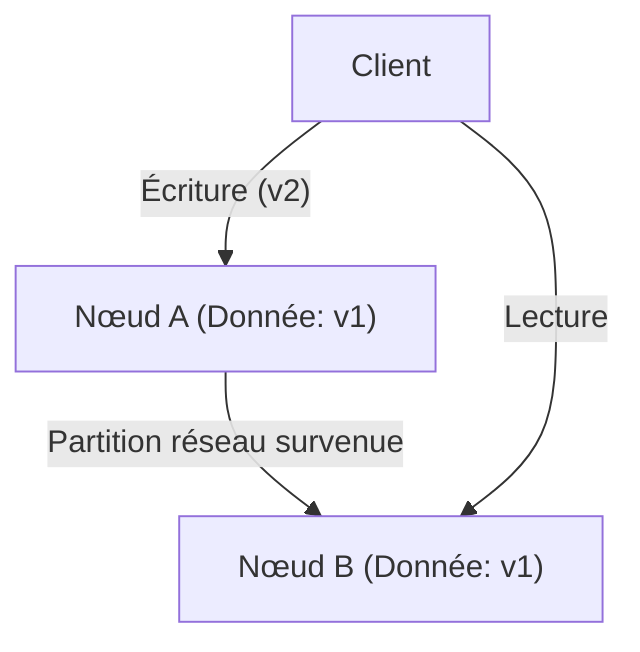
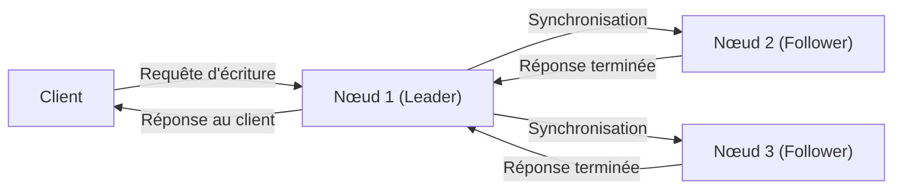

# Introduction : Le choix ultime dans les systèmes distribués

L'ensemble des services massifs qui soutiennent l'Internet moderne ne sont pas construits sur un seul serveur, mais sur une multitude de serveurs (nœuds) répartis dans le monde entier. Des géants de la technologie comme Google, Amazon et Facebook aux startups à croissance rapide, l'adoption de "systèmes de bases de données distribuées" est devenue inévitable pour faire face à l'augmentation explosive des données.

Cependant, la gestion des données en les répartissant sur plusieurs nœuds s'accompagne de défis complexes qui ne se posaient pas avec un serveur unique. Les architectes qui cherchent à améliorer les performances et à construire des systèmes tolérants aux pannes sont constamment contraints de prendre des décisions difficiles impliquant des compromis (trade-offs) entre la **"Cohérence (Consistency)"**, la **"Disponibilité (Availability)"** et la **"Latence (Latency)"**.

Ce dilemme fondamental dans la conception des systèmes distribués a été systématisé empiriquement ou mathématiquement par le **"théorème CAP"** proposé par Eric Brewer, et complété et étendu par le **"théorème PACELC"** pour s'adapter aux opérations réelles.

Dans cet article, nous allons explorer en profondeur ces deux théorèmes cruciaux, de leurs fondements à leurs applications pratiques, car ils sont incontournables pour comprendre l'architecture des systèmes de bases de données distribuées.

---

# Le théorème CAP : La preuve d'Eric Brewer et les trois sommets

Lors de la conférence ACM PODC (Principles of Distributed Computing) en l'an 2000, l'informaticien de l'Université de Californie à Berkeley, Eric Brewer, a présenté une règle empirique en informatique distribuée. Celle-ci a ensuite été mathématiquement prouvée par Seth Gilbert et Nancy Lynch du MIT, l'établissant ainsi comme le "théorème" CAP.

Le théorème CAP affirme que, parmi les trois propriétés suivantes, **au maximum deux peuvent être satisfaites simultanément**.

1. **Cohérence (Consistency : C)**
2. **Disponibilité (Availability : A)**
3. **Tolérance au partitionnement (Partition tolerance : P)**

Tout d'abord, définissons précisément ce que signifient ces trois propriétés.

## 1. Cohérence (Consistency)

Ici, la "cohérence" signifie que **"tous les nœuds voient la même donnée en même temps"**.
Peu importe le nœud du système auquel un client demande une lecture de données, il reçoit toujours le "résultat de l'écriture la plus récente" ou une "erreur (pas de réponse)". Il n'est pas permis de renvoyer des données obsolètes (Stale Data).

## 2. Disponibilité (Availability)

La "disponibilité" signifie que **"tous les nœuds en fonctionnement renvoient toujours une réponse dans un délai raisonnable"**.
Même si une partie du système est en panne, les nœuds survivants doivent toujours renvoyer une donnée (même si elle n'est pas la plus récente) en réponse aux requêtes de lecture et d'écriture des clients, sans renvoyer d'erreur.

## 3. Tolérance au partitionnement (Partition tolerance)

La "tolérance au partitionnement" signifie que **"le système dans son ensemble continue de fonctionner même en cas de partition du réseau (retards ou pertes de paquets) entraînant une perte de communication entre les nœuds"**.
Dans un système distribué, il faut toujours partir du principe qu'une "partition du réseau (Network Partition)" coupant la communication entre les nœuds peut se produire en raison de câbles réseau sectionnés, de pannes de routeurs ou de surcharges temporaires.

Comme le montre le schéma ci-dessus, si une partition réseau survient entre le Nœud A et le Nœud B, la donnée la plus récente écrite sur le Nœud A (v2) ne sera pas synchronisée avec le Nœud B. Dans ce cas, si le client envoie une requête de lecture au Nœud B, comment le système doit-il se comporter ?

---

# Pourquoi la partition réseau (P) est-elle inévitable ?

Le malentendu le plus courant concernant le théorème CAP est l'idée fausse selon laquelle "on peut construire un système CA qui satisfait C et A". Bien que le théorème affirme que "l'on peut choisir deux des trois", **dans les systèmes distribués du monde réel, il est impossible d'abandonner la "tolérance au partitionnement (P)".**

La raison en est que le réseau est intrinsèquement instable et que la perte de communication entre les nœuds, telle que la perte de paquets, le redémarrage des commutateurs ou les pannes de ligne entre les centres de données, se produira inévitablement de manière probabiliste. Abandonner P reviendrait à "construire un environnement de serveur unique (environnement non distribué) où les pannes de réseau ne se produisent absolument jamais", ce qui irait à l'encontre même de la prémisse d'un système distribué.

Par conséquent, dans la conception pratique des bases de données distribuées, lorsqu'une partition de réseau (P) se produit, on est contraint de faire un choix (CP ou AP) : **donner la priorité à la "Cohérence (C)" ou à la "Disponibilité (A)"**.

---

# Le choix lors d'une partition : Système CP vs Système AP

Lorsqu'une partition réseau se produit, le système est contraint d'adopter un comportement soit CP, soit AP.

## Privilégier CP (Consistency + Partition tolerance)

C'est une architecture qui donne la priorité à la "cohérence" lorsqu'une partition se produit.
Comme le Nœud B peut ne pas avoir les données les plus récentes (v2), pour éviter le risque de renvoyer d'anciennes données, **il renverra une erreur ou bloquera la réponse (timeout) jusqu'à ce que la communication soit rétablie**.
Ainsi, le système dans son ensemble maintient la règle absolue de "ne jamais renvoyer d'anciennes données (cohérence forte)", mais au prix de la "disponibilité (A)".

**Bases de données représentatives :**
- **HBase** : Fonctionne sur HDFS et offre une cohérence forte.
- **MongoDB** : Dans une configuration de réplicat (replica set), si le nœud principal (primary) est isolé du réseau, il bloque les écritures jusqu'à ce qu'un nouveau nœud principal soit élu, garantissant ainsi la cohérence.
- **ZooKeeper / etcd** : Utilisés pour les verrous distribués et la gestion des configurations, ils arrêtent le service s'ils ne peuvent pas obtenir l'accord de la majorité (Quorum).

## Privilégier AP (Availability + Partition tolerance)

C'est une architecture qui donne la priorité à la "disponibilité" lorsqu'une partition se produit.
Le Nœud B **renverra toujours une réponse, même s'il s'agit des anciennes données (v1) qu'il possède**. Il n'y aura pas d'erreur, mais une "incohérence (Inconsistency)" se produira, où l'utilisateur accédant au Nœud A et l'utilisateur accédant au Nœud B verront des données différentes (les systèmes sont souvent conçus pour se synchroniser lorsque la communication est rétablie, satisfaisant ainsi à la "cohérence à terme : Eventual Consistency").

**Bases de données représentatives :**
- **Apache Cassandra** : Adopte une architecture sans maître (masterless) et accepte les lectures/écritures sur n'importe quel nœud, minimisant ainsi les temps d'arrêt.
- **Amazon DynamoDB** : Offre par défaut des lectures avec cohérence à terme, permettant une très haute disponibilité et une faible latence (une option de cohérence forte existe également).
- **Riak** : Un KVS distribué, conçu en donnant une priorité absolue à AP.

---

# Les limites du théorème CAP et l'émergence du théorème PACELC

Bien que le théorème CAP soit un excellent indicateur pour comprendre les systèmes distribués, une question majeure restait en suspens dans la pratique.

**"Comment le système se comporte-t-il en temps 'normal', c'est-à-dire lorsqu'aucune partition réseau ne se produit ?"**

Le théorème CAP ne parle que du comportement lors de "défaillances (partition réseau)" et ne dit rien sur les performances du système en temps normal. C'est ainsi qu'en 2010, Daniel Abadi de l'Université du Maryland a proposé le **"théorème PACELC"**.

## La structure du théorème PACELC

Le théorème PACELC étend le théorème CAP et intègre le compromis entre "latence" et "cohérence" en temps normal.

**PACELC = PAC + ELC**

- **If P (Partition):** Si une partition réseau se produit,
  - Privilégier soit **A (Availability)**, soit **C (Consistency)** (comme le théorème CAP).
- **Else (E):** Sinon, en temps normal lorsque la communication fonctionne correctement,
  - Privilégier soit **L (Latency)**, soit **C (Consistency)**.

### Le compromis entre Latence (L) et Cohérence (C) en temps normal

Lorsque le réseau fonctionne correctement et qu'une écriture de données survient, le système doit choisir l'une des options suivantes.

1. **Priorité à la Latence (L)** :
   Dès que les données sont écrites sur une partie des nœuds (ou sur un seul nœud), le système renvoie immédiatement "écriture terminée" au client. La synchronisation avec les nœuds restants s'effectue de manière asynchrone en arrière-plan.
   - **Avantage** : La vitesse de réponse (latence) est très rapide.
   - **Inconvénient** : Si un autre client lit depuis un autre nœud avant que la synchronisation ne soit terminée, des données obsolètes seront renvoyées (la cohérence est temporairement compromise).

2. **Priorité à la Cohérence (C)** :
   Les données sont synchronisées sur tous les nœuds (ou une majorité), et le client est mis en attente jusqu'à ce que la confirmation de "l'écriture terminée" soit reçue de la part de tous.
   - **Avantage** : Les données les plus récentes sont toujours garanties (cohérence forte).
   - **Inconvénient** : La communication entre les nœuds et le temps d'attente augmentent le temps de réponse (latence).

* (Réplication synchrone privilégiant C. La latence augmente car il faut attendre toutes les synchronisations) *

## Classification des bases de données selon PACELC

L'utilisation du théorème PACELC permet une classification plus précise des bases de données.

1. **PC/EC (C lors de Partition, C aussi en temps normal)**
   La cohérence est la priorité absolue, tant en cas de panne qu'en temps normal. La latence en temps normal est sacrifiée.
   Exemples : *VoltDB, Megastore, HBase*
2. **PC/EL (C lors de Partition, L en temps normal)**
   Préserve la cohérence en cas de panne, mais privilégie la latence en temps normal en effectuant une réplication asynchrone, etc.
   Exemples : *MySQL Cluster, MongoDB (selon la configuration)*
3. **PA/EC (A lors de Partition, C en temps normal)**
   Le système est disponible en cas de panne, mais garantit la cohérence en temps normal. (※C'est une classification théorique, les implémentations pratiques sont rares)
4. **PA/EL (A lors de Partition, L en temps normal)**
   La disponibilité est prioritaire en cas de panne, et la latence est également la priorité absolue en temps normal. La cohérence se limite à une "cohérence à terme".
   Exemples : *Cassandra, DynamoDB, Riak*

---

# Conclusion : Le système parfait n'existe pas

Ce que nous enseignent les théorèmes CAP et PACELC, c'est la cruelle réalité qu'**"il n'existe aucune base de données distribuée parfaite en toutes circonstances"**.

Pour les systèmes où de légères incohérences de données causent des problèmes fatals, comme les systèmes de paiement bancaires ou la gestion des stocks, il est nécessaire de choisir des systèmes orientés **CP (PC/EC)**, même au prix d'un sacrifice sur la latence ou la disponibilité.
D'un autre côté, pour des fonctionnalités telles que la timeline d'un réseau social ou le moteur de recommandation d'une plateforme de streaming vidéo, où des données anciennes de quelques secondes ont peu d'impact commercial, et où il faut absolument éviter les interruptions (disponibilité) avec des réponses rapides (latence), un système orienté **AP (PA/EL)** sera la solution optimale.

Ce qui est exigé d'un architecte système, ce n'est rien d'autre que la capacité de comprendre profondément ces théorèmes et de déterminer avec précision **"ce qui doit être priorisé et ce qui doit être abandonné"** dans les exigences métier du système qu'il conçoit.
Dans le monde des systèmes distribués, accepter les compromis (trade-offs) est le premier pas pour concevoir le système le plus robuste.
