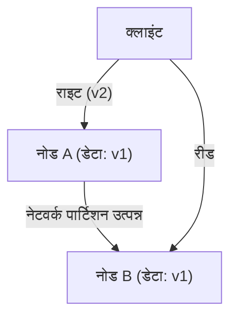
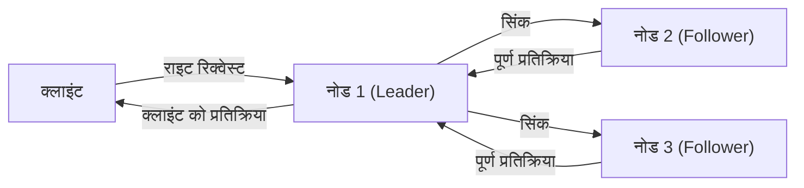

# प्रस्तावना: डिस्ट्रीब्यूटेड सिस्टम्स में अंतिम विकल्प

आधुनिक इंटरनेट को सपोर्ट करने वाली विशाल सेवाएँ किसी एक सर्वर पर नहीं, बल्कि दुनिया भर में फैले अनगिनत सर्वरों (नोड्स) के माध्यम से बनाई जाती हैं। Google, Amazon और Facebook जैसी बड़ी तकनीकी कंपनियों से लेकर तेज़ी से बढ़ते स्टार्टअप्स तक, डेटा में होने वाली भारी वृद्धि से निपटने के लिए "डिस्ट्रीब्यूटेड डेटाबेस सिस्टम (Distributed Database System)" का उपयोग करना अपरिहार्य हो गया है।

हालाँकि, कई नोड्स पर डेटा को डिस्ट्रीब्यूट करके मैनेज करने से कई जटिल चुनौतियाँ सामने आती हैं, जिनका सामना सिंगल सर्वर में कभी नहीं करना पड़ता था। सिस्टम के प्रदर्शन को बढ़ाने और फॉल्ट-टॉलरेंट (दोष-सहिष्णु) सिस्टम बनाने का प्रयास करने वाले आर्किटेक्ट्स को हमेशा **"कंसिस्टेंसी (Consistency)"**, **"अवेलेबिलिटी (Availability)"**, और **"लेटेंसी (Latency)"** जैसे महत्वपूर्ण तत्वों के बीच कठोर ट्रेड-ऑफ (समझौता) करने के निर्णय लेने पड़ते हैं।

डिस्ट्रीब्यूटेड सिस्टम डिज़ाइन में इस मूलभूत दुविधा को एरिक ब्रूअर (Eric Brewer) द्वारा प्रस्तावित **"CAP थ्योरम (CAP Theorem)"** के रूप में गणितीय और अनुभवजन्य रूप से व्यवस्थित किया गया था। बाद में इसे वास्तविक दुनिया के संचालन के अनुरूप **"PACELC थ्योरम (PACELC Theorem)"** द्वारा पूरक और विस्तारित किया गया।

इस लेख में, हम डिस्ट्रीब्यूटेड डेटाबेस सिस्टम के आर्किटेक्चर को समझने के लिए इन दो महत्वपूर्ण थ्योरम पर गहराई से विचार करेंगे, जिनमें बुनियादी बातों से लेकर व्यावहारिक अनुप्रयोगों तक सब कुछ शामिल होगा।

---

# CAP थ्योरम: एरिक ब्रूअर का प्रमाण और तीन बिंदु

वर्ष 2000 में आयोजित ACM PODC (Principles of Distributed Computing) सम्मेलन में, कैलिफोर्निया विश्वविद्यालय, बर्कले के कंप्यूटर वैज्ञानिक एरिक ब्रूअर ने डिस्ट्रीब्यूटेड कंप्यूटिंग में एक नियम प्रस्तुत किया। बाद में एमआईटी (MIT) के सेठ गिल्बर्ट (Seth Gilbert) और नैन्सी लिंच (Nancy Lynch) द्वारा इसे गणितीय रूप से सिद्ध किया गया और "थ्योरम (प्रमेय)" के रूप में स्थापित किया गया, जिसे आज हम CAP थ्योरम कहते हैं।

CAP थ्योरम यह दावा करता है कि निम्नलिखित 3 विशेषताओं में से, **एक ही समय में अधिकतम दो को ही संतुष्ट किया जा सकता है**।

1. **कंसिस्टेंसी (Consistency: C)**
2. **अवेलेबिलिटी (Availability: A)**
3. **पार्टिशन टॉलरेंस (Partition tolerance: P)**

सबसे पहले, आइए सटीक रूप से परिभाषित करें कि इन 3 विशेषताओं का क्या अर्थ है।

## 1. कंसिस्टेंसी (Consistency)

यहाँ "कंसिस्टेंसी" का अर्थ है कि **"सभी नोड्स एक ही समय में समान डेटा देख सकते हैं"**।
चाहे क्लाइंट सिस्टम में किसी भी नोड पर डेटा रीड रिक्वेस्ट भेजे, उसे हमेशा "नवीनतम राइट (write) परिणाम" वापस मिलना चाहिए, या फिर "एरर (कोई प्रतिक्रिया नहीं)" की स्थिति होनी चाहिए। पुराना डेटा (Stale Data) लौटाना स्वीकार्य नहीं है।

## 2. अवेलेबिलिटी (Availability)

"अवेलेबिलिटी" का मतलब है कि **"सिस्टम के सभी चालू नोड्स को हमेशा एक उचित समय के भीतर प्रतिक्रिया (response) देनी चाहिए"**।
भले ही सिस्टम के किसी हिस्से में कोई खराबी (failure) हो, जो नोड्स काम कर रहे हैं उन्हें क्लाइंट की रीड या राइट रिक्वेस्ट पर एरर नहीं लौटाना चाहिए, बल्कि हमेशा कुछ डेटा (भले ही वह नवीनतम न हो) वापस करना चाहिए।

## 3. पार्टिशन टॉलरेंस (Partition tolerance)

"पार्टिशन टॉलरेंस" का अर्थ है, **"भले ही नेटवर्क में पार्टिशन (पैकेट में देरी या नुकसान) हो जाए और नोड्स के बीच संचार (communication) टूट जाए, फिर भी पूरा सिस्टम समग्र रूप से काम करना जारी रखेगा"**।
डिस्ट्रीब्यूटेड सिस्टम्स में यह मान कर चलना आवश्यक है कि "नेटवर्क पार्टिशन (Network Partition)" (जैसे नेटवर्क केबल का कटना, राउटर की विफलता, या अस्थायी ओवरलोड के कारण नोड्स के बीच संचार का बंद होना) निश्चित रूप से हो सकता है।

जैसा कि ऊपर चित्र में दिखाया गया है, यदि नोड A और नोड B के बीच नेटवर्क पार्टिशन हो जाता है, तो नोड A पर लिखा गया नवीनतम डेटा (v2) नोड B के साथ सिंक्रोनाइज़ (synchronize) नहीं हो पाएगा। ऐसे में, यदि क्लाइंट नोड B को रीड रिक्वेस्ट भेजता है, तो सिस्टम को कैसा व्यवहार करना चाहिए?

---

# नेटवर्क पार्टिशन (P) से क्यों नहीं बचा जा सकता है?

CAP थ्योरम के बारे में सबसे आम गलतफहमी यह है कि "आप एक CA सिस्टम बना सकते हैं जो C और A दोनों को पूरा करता है।" हालांकि थ्योरम सैद्धांतिक रूप से कहता है कि "आप 3 में से 2 चुन सकते हैं", **वास्तविक दुनिया के डिस्ट्रीब्यूटेड सिस्टम में "पार्टिशन टॉलरेंस (P)" को छोड़ना असंभव है।**

ऐसा इसलिए है क्योंकि नेटवर्क स्वाभाविक रूप से अस्थिर होते हैं, और पैकेट लॉस, स्विच के रीस्टार्ट होने, और डेटा सेंटर के बीच लाइन में खराबी जैसी चीजों के कारण नोड्स के बीच संचार का टूटना सांख्यिकीय रूप से निश्चित है। P को छोड़ने का मतलब "एक सिंगल सर्वर वातावरण (गैर-डिस्ट्रीब्यूटेड वातावरण) का निर्माण करना है जहां नेटवर्क विफलताएं कभी नहीं होती हैं", जो कि डिस्ट्रीब्यूटेड सिस्टम के पूरे आधार को ही खारिज कर देता है।

इसलिए, वास्तविक डिस्ट्रीब्यूटेड डेटाबेस डिज़ाइन में, जब नेटवर्क पार्टिशन (P) होता है, तो हमें **"कंसिस्टेंसी (C)" और "अवेलेबिलिटी (A)"** के बीच किसी एक को प्राथमिकता देने का विकल्प (CP या AP) चुनना पड़ता है।

---

# पार्टिशन होने पर चुनाव: CP सिस्टम बनाम AP सिस्टम

जब कोई नेटवर्क पार्टिशन होता है, तो सिस्टम को CP या AP में से किसी एक तरह का व्यवहार करना ही पड़ता है।

## जब CP (Consistency + Partition tolerance) को प्राथमिकता दी जाती है

यह एक ऐसा आर्किटेक्चर है जो पार्टिशन होने पर "कंसिस्टेंसी" को प्राथमिकता देता है।
चूंकि नोड B के पास नवीनतम डेटा (v2) नहीं होने की संभावना होती है, पुराना डेटा लौटाने के जोखिम से बचने के लिए, यह **एक एरर (error) देता है, या जब तक संचार बहाल नहीं हो जाता तब तक प्रतिक्रिया को ब्लॉक (टाइमआउट) कर देता है**।
यह सुनिश्चित करता है कि पूरा सिस्टम "कभी भी पुराना डेटा नहीं लौटाता है (मजबूत कंसिस्टेंसी)", लेकिन इसकी कीमत "अवेलेबिलिटी (A)" के नुकसान के रूप में चुकानी पड़ती है।

**प्रमुख डेटाबेस:**
- **HBase**: HDFS पर काम करता है और मजबूत कंसिस्टेंसी (strong consistency) प्रदान करता है।
- **MongoDB**: रेप्लिका सेट कॉन्फ़िगरेशन में, यदि प्राइमरी नोड नेटवर्क से अलग हो जाता है, तो यह तब तक राइट्स को ब्लॉक कर देता है जब तक कि नया प्राइमरी नोड नहीं चुना जाता, जिससे कंसिस्टेंसी सुनिश्चित होती है।
- **ZooKeeper / etcd**: डिस्ट्रीब्यूटेड लॉक और कॉन्फ़िगरेशन प्रबंधन के लिए उपयोग किया जाता है, यदि बहुमत की सहमति (Quorum) प्राप्त नहीं होती है तो यह सेवा रोक देता है।

## जब AP (Availability + Partition tolerance) को प्राथमिकता दी जाती है

यह एक ऐसा आर्किटेक्चर है जो पार्टिशन होने पर "अवेलेबिलिटी" को प्राथमिकता देता है।
नोड B **हमेशा प्रतिक्रिया देता है, भले ही उसके पास पुराना डेटा (v1) हो**। यह कोई एरर नहीं देता, लेकिन एक "असंगति (Inconsistency)" उत्पन्न होती है, जहां नोड A को एक्सेस करने वाले उपयोगकर्ता और नोड B को एक्सेस करने वाले उपयोगकर्ता को अलग-अलग डेटा दिखाई देता है (आमतौर पर सिस्टम को इस तरह से डिज़ाइन किया जाता है कि संचार बहाल होने पर वे सिंक्रोनाइज़ हो जाते हैं, जिसे "इवेंचुअल कंसिस्टेंसी: Eventual Consistency" कहा जाता है)।

**प्रमुख डेटाबेस:**
- **Apache Cassandra**: एक मास्टरलेस आर्किटेक्चर अपनाता है जो डाउनटाइम को कम करने के लिए किसी भी नोड पर रीड और राइट स्वीकार करता है।
- **Amazon DynamoDB**: डिफ़ॉल्ट रूप से इवेंचुअल कंसिस्टेंसी रीड प्रदान करता है, जिससे बहुत उच्च अवेलेबिलिटी और कम लेटेंसी प्राप्त होती है (इसमें एक मजबूत कंसिस्टेंसी विकल्प भी मौजूद है)।
- **Riak**: डिस्ट्रीब्यूटेड KVS के रूप में, इसे पूरी तरह से AP के लिए डिज़ाइन किया गया है।

---

# CAP थ्योरम की सीमाएं और PACELC थ्योरम का आगमन

CAP थ्योरम डिस्ट्रीब्यूटेड सिस्टम्स को समझने के लिए एक बेहतरीन सूचक है, लेकिन व्यावहारिक रूप से एक बड़ा सवाल बना रहा:

**"जब कोई नेटवर्क पार्टिशन नहीं होता है, यानी 'सामान्य समय' में, सिस्टम कैसा व्यवहार करता है?"**

CAP थ्योरम केवल "विफलता (नेटवर्क पार्टिशन)" के दौरान के व्यवहार के बारे में बात करता है, और सामान्य समय में सिस्टम के प्रदर्शन के बारे में कुछ नहीं कहता। इसलिए, 2010 में, मैरीलैंड विश्वविद्यालय के डैनियल अबादी (Daniel Abadi) ने **"PACELC थ्योरम"** का प्रस्ताव रखा।

## PACELC थ्योरम की संरचना

PACELC थ्योरम CAP थ्योरम का ही विस्तार है, जो सामान्य समय के दौरान "लेटेंसी" और "कंसिस्टेंसी" के बीच के ट्रेड-ऑफ को शामिल करता है।

**PACELC = PAC + ELC**

- **If P (Partition):** यदि नेटवर्क पार्टिशन होता है, तो
  - या तो **A (Availability)** या **C (Consistency)** को प्राथमिकता दें (CAP थ्योरम के समान)।
- **Else (E):** अन्यथा, यदि सामान्य समय है और संचार सुचारू रूप से काम कर रहा है, तो
  - या तो **L (Latency)** या **C (Consistency)** को प्राथमिकता दें।

### सामान्य समय में लेटेंसी (L) और कंसिस्टेंसी (C) के बीच ट्रेड-ऑफ

जब नेटवर्क सामान्य रूप से काम कर रहा हो और डेटा लिखने (write) की प्रक्रिया होती है, तो सिस्टम को निम्नलिखित दो विकल्पों में से एक चुनना होता है:

1. **लेटेंसी (L) को प्राथमिकता**:
   जैसे ही डेटा कुछ नोड्स (या एक नोड) पर लिखा जाता है, यह क्लाइंट को तुरंत "राइट पूरा हुआ (write complete)" लौटा देता है। शेष नोड्स के लिए सिंक्रोनाइज़ेशन बैकग्राउंड में असिंक्रोनस (asynchronously) रूप से किया जाता है।
   - **लाभ**: प्रतिक्रिया गति (लेटेंसी) बहुत तेज़ होती है।
   - **नुकसान**: यदि सिंक्रोनाइज़ेशन पूरा होने से पहले कोई अन्य क्लाइंट किसी अन्य नोड को रीड करता है, तो पुराना डेटा वापस आ सकता है (कंसिस्टेंसी अस्थायी रूप से टूट जाती है)।

2. **कंसिस्टेंसी (C) को प्राथमिकता**:
   डेटा सभी नोड्स (या बहुमत नोड्स) पर सिंक्रोनाइज़ किया जाता है, और क्लाइंट को तब तक इंतजार कराया जाता है जब तक कि सभी नोड्स से "राइट पूरा हुआ" की पुष्टि नहीं हो जाती।
   - **लाभ**: हमेशा नवीनतम डेटा की गारंटी दी जाती है (मजबूत कंसिस्टेंसी)।
   - **नुकसान**: क्योंकि नोड्स के बीच संचार और प्रतीक्षा का समय शामिल होता है, इसलिए प्रतिक्रिया गति (लेटेंसी) धीमी हो जाती है।

*(C-प्राथमिकता वाला सिंक्रोनस रेप्लिकेशन। चूंकि यह सभी सिंक्रोनाइज़ेशन की प्रतीक्षा करता है, इसलिए लेटेंसी बढ़ जाती है)*

## PACELC के अनुसार डेटाबेस का वर्गीकरण

PACELC थ्योरम का उपयोग करके, डेटाबेस को अधिक सटीक रूप से वर्गीकृत किया जा सकता है।

1. **PC/EC (पार्टिशन के दौरान C, सामान्य समय में भी C)**
   विफलता और सामान्य दोनों समय में कंसिस्टेंसी सर्वोच्च प्राथमिकता है। सामान्य समय में लेटेंसी का त्याग किया जाता है।
   उदाहरण: *VoltDB, Megastore, HBase*
2. **PC/EL (पार्टिशन के दौरान C, सामान्य समय में L)**
   विफलता के दौरान कंसिस्टेंसी बनाए रखता है, लेकिन सामान्य समय में लेटेंसी पर ध्यान केंद्रित करते हुए असिंक्रोनस रेप्लिकेशन आदि करता है।
   उदाहरण: *MySQL Cluster, MongoDB (सेटिंग्स पर निर्भर)*
3. **PA/EC (पार्टिशन के दौरान A, सामान्य समय में C)**
   विफलता के दौरान उपलब्ध रहता है, लेकिन सामान्य समय में कंसिस्टेंसी की गारंटी देता है। (यह एक सैद्धांतिक वर्गीकरण है और इसके वास्तविक कार्यान्वयन कम हैं)
4. **PA/EL (पार्टिशन के दौरान A, सामान्य समय में L)**
   विफलता के दौरान अवेलेबिलिटी को प्राथमिकता देता है, और सामान्य समय में भी लेटेंसी को सर्वोच्च प्राथमिकता देता है। कंसिस्टेंसी "इवेंचुअल कंसिस्टेंसी" तक सीमित होती है।
   उदाहरण: *Cassandra, DynamoDB, Riak*

---

# निष्कर्ष: कोई भी परफेक्ट सिस्टम मौजूद नहीं है

CAP थ्योरम और PACELC थ्योरम हमें जो सिखाते हैं, वह यह क्रूर सच्चाई है कि **"किसी भी परिस्थिति में कोई भी परफेक्ट डिस्ट्रीब्यूटेड डेटाबेस मौजूद नहीं है।"**

उन प्रणालियों के लिए जहां थोड़ी सी भी डेटा असंगति घातक समस्या पैदा कर सकती है, जैसे कि बैंक पेमेंट सिस्टम या इन्वेंट्री मैनेजमेंट सिस्टम, आपको ऐसा सिस्टम चुनना चाहिए जो **CP (PC/EC)** की ओर झुका हो, भले ही इसके लिए आपको कुछ हद तक लेटेंसी और अवेलेबिलिटी का बलिदान देना पड़े।
दूसरी ओर, सोशल मीडिया की टाइमलाइन या वीडियो स्ट्रीमिंग के रेकमेंडेशन इंजन के मामले में, जहां डेटा के कुछ सेकंड पुराने होने से व्यवसाय पर कोई खास असर नहीं पड़ता, और मुख्य आवश्यकता सिस्टम का डाउन न होना (अवेलेबिलिटी) और तेज़ रिस्पॉन्स (लेटेंसी) है, वहां **AP (PA/EL)** की ओर झुका सिस्टम सबसे इष्टतम समाधान (optimal solution) होता है।

सिस्टम आर्किटेक्ट्स के लिए जो आवश्यक है वह यह है कि वे इन थ्योरम को गहराई से समझें और यह तय करने के लिए सटीक निर्णय लें कि वे जो व्यावसायिक आवश्यकताएं बना रहे हैं उनमें **"किसे प्राथमिकता देनी है और किसे छोड़ना है"**।
डिस्ट्रीब्यूटेड सिस्टम्स की दुनिया में, ट्रेड-ऑफ (समझौते) को स्वीकार करना ही सबसे मजबूत सिस्टम डिज़ाइन करने की दिशा में पहला कदम है।
