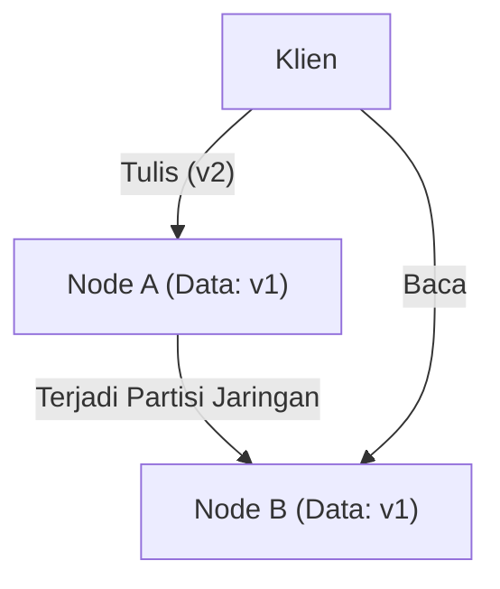
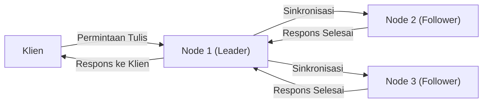

# Pengantar: Pilihan Utama dalam Sistem Terdistribusi

Layanan raksasa yang mendukung internet modern saat ini tidak dibangun di atas satu server tunggal, melainkan oleh sekumpulan besar server (node) yang didistribusikan di seluruh dunia. Dari perusahaan teknologi raksasa seperti Google, Amazon, dan Facebook, hingga startup yang berkembang pesat, penerapan "sistem basis data terdistribusi" menjadi hal yang tidak dapat dihindari untuk mengatasi peningkatan data yang eksplosif.

Namun, mendistribusikan dan mengelola data di beberapa node membawa tantangan kompleks yang belum pernah dihadapi pada server tunggal. Para arsitek yang berusaha meningkatkan kinerja sistem dan membangun sistem yang tahan terhadap kegagalan, selalu dihadapkan pada keputusan *trade-off* (kompromi) yang ketat di antara faktor-faktor **"Konsistensi" (Consistency)**, **"Ketersediaan" (Availability)**, dan **"Latensi" (Latency)**.

Dilema mendasar dalam desain sistem terdistribusi ini disistematisasikan secara matematis atau empiris ke dalam **"Teorema CAP"** yang dikemukakan oleh Eric Brewer, dan kemudian dilengkapi serta diperluas agar sesuai dengan operasi di dunia nyata menjadi **"Teorema PACELC"**.

Dalam artikel ini, kita akan menggali lebih dalam mulai dari dasar hingga contoh penerapan praktis mengenai dua teorema penting ini, yang tidak dapat dihindari ketika memahami arsitektur sistem basis data terdistribusi.

---

# Teorema CAP: Pembuktian Eric Brewer dan Tiga Puncak

Pada konferensi ACM PODC (Principles of Distributed Computing) tahun 2000, Eric Brewer, seorang ilmuwan komputer di Universitas California, Berkeley, mempresentasikan sebuah aturan empiris dalam komputasi terdistribusi. Aturan ini kemudian dibuktikan secara matematis oleh Seth Gilbert dan Nancy Lynch dari MIT, dan ditetapkan sebagai "Teorema", yang kini dikenal dengan Teorema CAP.

Teorema CAP menyatakan bahwa dari tiga karakteristik berikut, **sistem hanya dapat memenuhi maksimal dua karakteristik pada saat yang bersamaan**.

1. **Konsistensi (Consistency: C)**
2. **Ketersediaan (Availability: A)**
3. **Toleransi Partisi (Partition tolerance: P)**

Pertama-tama, mari kita definisikan secara akurat apa arti dari ketiga karakteristik ini.

## 1. Konsistensi (Consistency)

"Konsistensi" di sini mengacu pada **"semua node dapat merujuk ke data yang sama pada saat yang bersamaan"**.
Tidak peduli node mana di dalam sistem yang menerima permintaan pembacaan data dari klien, ia harus selalu mengembalikan "hasil penulisan terbaru" atau berakhir dengan "status kesalahan (tidak ada respons)". Mengembalikan data lama (Stale Data) tidak dapat diterima.

## 2. Ketersediaan (Availability)

"Ketersediaan" berarti **"semua node yang sedang berjalan pasti akan memberikan respons dalam jangka waktu yang wajar"**.
Bahkan jika sebagian sistem mengalami kegagalan, node yang bertahan tidak boleh mengembalikan kesalahan terhadap permintaan baca atau tulis dari klien; mereka harus mengembalikan suatu data (meskipun bukan yang terbaru).

## 3. Toleransi Partisi (Partition tolerance)

"Toleransi partisi" berarti **"meskipun terjadi partisi jaringan (keterlambatan atau hilangnya paket) yang memutuskan komunikasi antar node, keseluruhan sistem harus tetap dapat beroperasi"**.
Dalam sistem terdistribusi, kita harus mengasumsikan bahwa "partisi jaringan (Network Partition)"—terputusnya komunikasi antar node akibat kabel jaringan yang putus, kerusakan router, atau beban berlebih sementara—pasti dapat terjadi.

Seperti yang ditunjukkan pada diagram di atas, ketika partisi jaringan terjadi antara Node A dan Node B, data terbaru (v2) yang ditulis ke Node A tidak disinkronkan ke Node B. Dalam situasi ini, jika klien meminta membaca dari Node B, bagaimana sistem seharusnya berperilaku?

---

# Mengapa Partisi Jaringan (P) Tidak Dapat Dihindari?

Kesalahpahaman yang paling umum mengenai Teorema CAP adalah anggapan bahwa "kita dapat membangun sistem CA yang memenuhi C dan A". Meskipun menurut teori kita dapat "memilih dua dari tiga", **dalam sistem terdistribusi di dunia nyata, tidak mungkin untuk mengabaikan "Toleransi Partisi (P)".**

Alasannya adalah karena jaringan pada dasarnya tidak stabil; putusnya komunikasi antar node akibat *packet loss*, *restart switch*, atau gangguan saluran antar pusat data pasti akan terjadi secara probabilistik. Mengabaikan P berarti sama dengan "membangun lingkungan server tunggal (lingkungan non-terdistribusi) yang mutlak tidak akan mengalami kegagalan jaringan", yang bertentangan dengan premis dasar sistem terdistribusi.

Oleh karena itu, dalam desain basis data terdistribusi di dunia nyata, ketika terjadi partisi jaringan (P), kita dipaksa untuk memilih antara **"memprioritaskan Konsistensi (C)" atau "memprioritaskan Ketersediaan (A)"** sebagai dua pilihan (CP atau AP).

---

# Pilihan Saat Terjadi Partisi: Sistem CP vs Sistem AP

Ketika terjadi partisi jaringan, sistem harus memilih perilaku sebagai CP atau AP.

## Memprioritaskan CP (Consistency + Partition tolerance)

Ini adalah arsitektur yang memprioritaskan "konsistensi" ketika terjadi partisi.
Karena Node B mungkin tidak memiliki data terbaru (v2), untuk menghindari risiko mengembalikan data lama, **sistem akan mengembalikan kesalahan, atau memblokir respons (timeout) hingga komunikasi pulih kembali**.
Hal ini memastikan bahwa sistem secara keseluruhan "mutlak tidak akan mengembalikan data lama (konsistensi kuat)", namun akibatnya, "ketersediaan (A)" menjadi terganggu.

**Basis Data Representatif:**
- **HBase**: Berjalan di atas HDFS dan menyediakan konsistensi yang kuat.
- **MongoDB**: Dalam konfigurasi set replika, jika node primer terisolasi dari jaringan, penulisan akan diblokir hingga primer baru dipilih, untuk menjamin konsistensi.
- **ZooKeeper / etcd**: Digunakan untuk kunci terdistribusi (*distributed locks*) dan manajemen konfigurasi, layanan akan dihentikan jika konsensus mayoritas (Quorum) tidak tercapai.

## Memprioritaskan AP (Availability + Partition tolerance)

Ini adalah arsitektur yang memprioritaskan "ketersediaan" ketika terjadi partisi.
Bahkan jika Node B hanya memiliki **data lama (v1)**, ia akan selalu mengembalikan respons. Tidak akan terjadi kesalahan, tetapi akan muncul "inkonsistensi (Inconsistency)" di mana pengguna yang mengakses Node A dan pengguna yang mengakses Node B akan melihat data yang berbeda (biasanya sistem dirancang agar data disinkronkan saat komunikasi pulih, sehingga memenuhi "Konsistensi Akhir: Eventual Consistency").

**Basis Data Representatif:**
- **Apache Cassandra**: Mengadopsi arsitektur tanpa master (*masterless*), menerima operasi baca dan tulis pada node manapun untuk meminimalkan waktu henti (*downtime*).
- **Amazon DynamoDB**: Secara default menyediakan pembacaan dengan konsistensi akhir, serta mencapai ketersediaan sangat tinggi dan latensi rendah (tersedia juga opsi konsistensi kuat).
- **Riak**: Dirancang khusus sebagai KVS (Key-Value Store) terdistribusi dengan prinsip AP yang menyeluruh.

---

# Batasan Teorema CAP dan Munculnya Teorema PACELC

Teorema CAP adalah indikator yang sangat baik untuk memahami sistem terdistribusi, tetapi dalam praktiknya, ada satu pertanyaan besar yang tersisa.

**"Bagaimana sistem berperilaku pada 'waktu normal' saat tidak terjadi partisi jaringan?"**

Teorema CAP hanya membahas perilaku saat terjadi "kegagalan (partisi jaringan)", namun tidak menjelaskan apapun tentang kinerja sistem pada keadaan normal. Oleh karena itu, pada tahun 2010, Daniel Abadi dari University of Maryland mengusulkan **"Teorema PACELC"**.

## Struktur Teorema PACELC

Teorema PACELC merupakan perluasan dari Teorema CAP dengan memasukkan keseimbangan *trade-off* antara "latensi" dan "konsistensi" pada keadaan normal.

**PACELC = PAC + ELC**

- **If P (Partition):** Jika terjadi partisi jaringan,
  - Prioritaskan antara **A (Availability)** atau **C (Consistency)** (sama dengan Teorema CAP).
- **Else (E):** Sebaliknya, saat berkomunikasi secara normal,
  - Prioritaskan antara **L (Latency)** atau **C (Consistency)**.

### Trade-off antara Latensi (L) dan Konsistensi (C) Saat Normal

Saat jaringan berfungsi dengan baik dan terjadi penulisan data, sistem harus memilih salah satu dari berikut ini:

1. **Memprioritaskan Latensi (L)**:
   Segera setelah data ditulis ke sebagian node (atau 1 node), sistem akan langsung mengembalikan status "penulisan selesai" kepada klien. Sinkronisasi ke node yang tersisa dilakukan secara asinkron di latar belakang.
   - **Kelebihan**: Kecepatan respons (latensi) sangat cepat.
   - **Kekurangan**: Jika klien lain membaca dari node lain sebelum sinkronisasi selesai, maka data lama yang akan dikembalikan (konsistensi terganggu sementara).

2. **Memprioritaskan Konsistensi (C)**:
   Menyinkronkan data ke semua node (atau mayoritas node), dan membuat klien menunggu hingga konfirmasi "penulisan selesai" diperoleh dari semua node tersebut.
   - **Kelebihan**: Data terbaru selalu terjamin (konsistensi kuat).
   - **Kekurangan**: Kecepatan respons (latensi) melambat karena adanya waktu untuk komunikasi dan menunggu antar node.

*(Replikasi sinkron yang memprioritaskan C. Karena harus menunggu semua sinkronisasi selesai, latensinya meningkat)*

## Klasifikasi Basis Data Berdasarkan PACELC

Dengan menggunakan Teorema PACELC, kita dapat mengklasifikasikan basis data secara lebih akurat.

1. **PC/EC (Saat Partition memilih C, Saat Normal juga C)**
   Konsistensi diutamakan baik saat gagal maupun normal. Latensi saat keadaan normal dikorbankan.
   Contoh: *VoltDB, Megastore, HBase*
2. **PC/EL (Saat Partition memilih C, Saat Normal memilih L)**
   Mempertahankan konsistensi saat gagal, namun memprioritaskan latensi di keadaan normal dengan melakukan replikasi asinkron dan lain-lain.
   Contoh: *MySQL Cluster, MongoDB (tergantung konfigurasi)*
3. **PA/EC (Saat Partition memilih A, Saat Normal memilih C)**
   Memprioritaskan ketersediaan saat gagal, dan menjamin konsistensi saat normal. (*Klasifikasi teoritis, jarang ditemui implementasi nyatanya*)
4. **PA/EL (Saat Partition memilih A, Saat Normal memilih L)**
   Ketersediaan diutamakan saat gagal, dan latensi juga diutamakan saat normal. Konsistensi dibatasi hanya pada "Konsistensi Akhir (Eventual Consistency)".
   Contoh: *Cassandra, DynamoDB, Riak*

---

# Kesimpulan: Tidak Ada Sistem yang Sempurna

Apa yang diajarkan oleh Teorema CAP dan Teorema PACELC kepada kita adalah fakta pahit bahwa **"tidak ada basis data terdistribusi yang sempurna di bawah segala kondisi"**.

Dalam kasus seperti sistem pembayaran perbankan atau sistem manajemen inventaris, di mana ketidaksesuaian data sekecil apa pun dapat menyebabkan masalah fatal, sistem yang condong pada **CP (PC/EC)** harus dipilih meskipun harus mengorbankan sebagian ketersediaan dan latensi.
Di sisi lain, pada mesin rekomendasi distribusi video atau linimasa jejaring sosial (SNS), di mana data yang tertinggal beberapa detik tidak terlalu berdampak pada bisnis, melainkan dituntut kecepatan respons (latensi) dan yang penting sistem tidak mati (ketersediaan), maka sistem dengan orientasi **AP (PA/EL)** adalah solusi terbaik.

Apa yang dituntut dari seorang arsitek sistem adalah pemahaman mendalam tentang teorema-teorema ini serta kemampuan menilai secara akurat **"apa yang harus diprioritaskan dan apa yang harus dikorbankan"** sesuai dengan kebutuhan bisnis yang dibangun.
Dalam dunia sistem terdistribusi, menerima *trade-off* (kompromi) justru merupakan langkah pertama untuk merancang sistem yang paling tangguh.
