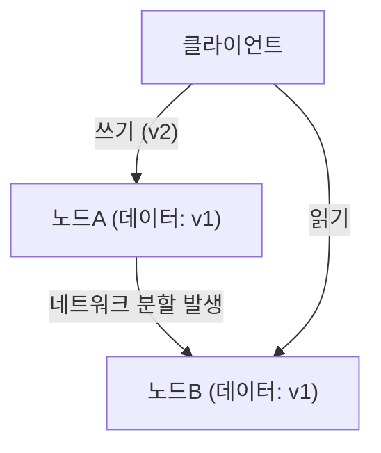
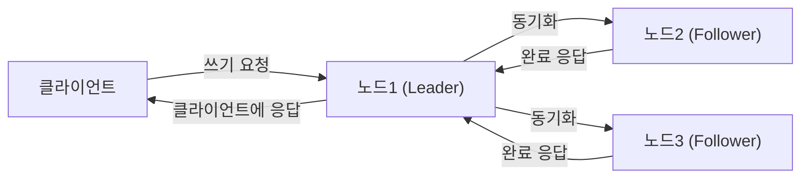

# 들어가며: 분산 시스템에서의 궁극적인 선택

현대 인터넷을 지탱하는 거대한 서비스들은 단일 서버가 아닌 전 세계에 분산된 무수한 서버들(노드)로 구축되어 있습니다. Google, Amazon, Facebook과 같은 거대 기술 기업부터 급성장하는 스타트업에 이르기까지, 폭발적으로 증가하는 데이터에 대응하기 위해서는 '분산 데이터베이스 시스템'의 도입이 불가피해졌습니다.

하지만 데이터를 여러 노드에 분산 배치하여 관리하는 데에는 단일 서버에서는 직면하지 않았던 복잡한 과제가 따릅니다. 시스템의 성능을 높이고 장애에 강한 시스템을 구축하려는 아키텍트들은 항상 **'일관성(Consistency)'**, **'가용성(Availability)'**, 그리고 **'지연 시간(Latency)'**이라는 요소 사이에서 가혹한 트레이드오프(타협점)의 결단을 요구받습니다.

이러한 분산 시스템 설계의 근본적인 딜레마를 수학적 혹은 경험적으로 체계화한 것이 에릭 브루어(Eric Brewer)가 제창한 **'CAP 정리'**이며, 이후 이를 현실의 운영에 맞게 보완하고 확장한 것이 **'PACELC 정리'**입니다.

본 기사에서는 분산 데이터베이스 시스템의 아키텍처를 이해하는 데 있어 피할 수 없는 이 두 가지 중요한 정리에 대해 기초부터 실천적인 적용 사례까지 깊이 파헤쳐 보겠습니다.

---

# CAP 정리: 에릭 브루어의 증명과 세 개의 꼭짓점

2000년에 개최된 ACM PODC(Principles of Distributed Computing) 컨퍼런스에서 캘리포니아 대학교 버클리의 컴퓨터 과학자 에릭 브루어는 분산 컴퓨팅의 한 경험 법칙을 발표했습니다. 이후 MIT의 세스 길버트(Seth Gilbert)와 낸시 린치(Nancy Lynch)에 의해 수학적으로 증명되어 '정리'로 확립된 것이 CAP 정리입니다.

CAP 정리는 아래의 3가지 특성 중 **동시에 만족할 수 있는 것은 최대 2개까지이다**라고 주장합니다.

1. **일관성 (Consistency: C)**
2. **가용성 (Availability: A)**
3. **분할 내성 (Partition tolerance: P)**

먼저, 이 세 가지 특성이 무엇을 의미하는지 정확하게 정의해 봅시다.

## 1. 일관성 (Consistency)

여기서 말하는 '일관성'이란 **'모든 노드가 동시에 같은 데이터를 참조할 수 있는 것'**을 가리킵니다.
클라이언트가 시스템 내의 어떤 노드에 대해 데이터 읽기 요청을 하더라도 항상 '최신의 쓰기 결과'가 반환되거나 혹은 '에러(응답 없음)'가 되는 상태입니다. 오래된 데이터(Stale Data)가 반환되는 것은 허용되지 않습니다.

## 2. 가용성 (Availability)

'가용성'이란 **'가동 중인 모든 노드가 타당한 시간 내에 반드시 응답을 반환하는 것'**입니다.
시스템의 일부에 장애가 발생하더라도 살아남은 노드는 클라이언트의 읽기/쓰기 요청에 대해 에러를 반환하지 않고 반드시 어떠한 데이터(그것이 최신이 아닐지라도)를 반환해야 합니다.

## 3. 분할 내성 (Partition tolerance)

'분할 내성'이란 **'네트워크의 분할(패킷의 지연이나 손실)이 발생하여 노드 간의 통신이 단절된 경우라도, 시스템 전체적으로는 계속 동작하는 것'**을 의미합니다.
분산 시스템에서는 네트워크 케이블의 절단, 라우터의 고장, 일시적인 과부하 등으로 인해 노드 간의 통신이 차단되는 '네트워크 분할(Network Partition)'이 반드시 발생할 수 있다고 가정해야 합니다.

위의 그림처럼 노드A와 노드B 사이에서 네트워크 분할이 발생한 경우, 노드A에 쓰인 최신 데이터(v2)는 노드B와 동기화되지 않습니다. 이때 클라이언트가 노드B에 읽기 요청을 했다면 시스템은 어떻게 동작해야 할까요?

---

# 왜 네트워크 분할 (P) 은 피할 수 없는가?

CAP 정리에 대한 오해 중 가장 많은 것이 'C와 A를 만족하는 CA 시스템을 구축할 수 있다'는 착각입니다. 정리상으로는 '3가지 중 2가지를 선택할 수 있다'고 되어 있지만, **현실의 분산 시스템에 있어서 '분할 내성 (P)'을 포기하는 것은 불가능합니다.**

왜냐하면 네트워크라는 것은 본질적으로 불안정하여 패킷 손실, 스위치 재부팅, 데이터 센터 간 회선 장애 등 노드 간 통신 단절은 확률적으로 반드시 발생하기 때문입니다. P를 포기한다는 것은 '네트워크 장애가 절대 일어나지 않는 단일 서버 환경(비분산 환경)을 구축한다'는 것과 동의어이며, 이는 분산 시스템의 전제를 뒤집는 것이 됩니다.

따라서 현실의 분산 데이터베이스 설계에서는 네트워크 분할(P)이 발생했을 때 **'일관성 (C)'과 '가용성 (A)' 중 어느 쪽을 우선할 것인가**라는 양자택일(CP 또는 AP)을 강요받게 됩니다.

---

# 분할 발생 시의 선택: CP 시스템 vs AP 시스템

네트워크 분할이 발생했을 때 시스템은 CP나 AP 중 하나의 동작을 취할 수밖에 없습니다.

## CP (Consistency + Partition tolerance)를 우선하는 경우

분할이 발생했을 때 '일관성'을 우선하는 아키텍처입니다.
노드B는 최신 데이터(v2)를 가지고 있지 않을 가능성이 있기 때문에 오래된 데이터를 반환할 위험을 피하기 위해 **에러를 반환하거나 통신이 회복될 때까지 응답을 차단(타임아웃)시킵니다.**
이로 인해 시스템 전체적으로 '오래된 데이터는 절대 반환하지 않는다(강한 일관성)'를 유지하지만, 그 대가로 '가용성(A)'이 손상됩니다.

**대표적인 데이터베이스:**
- **HBase**: HDFS상에서 구동되며 강한 일관성을 제공합니다.
- **MongoDB**: 레플리카 셋 구성에서 프라이머리 노드가 네트워크로부터 고립된 경우, 새로운 프라이머리가 선출될 때까지 쓰기를 차단하여 일관성을 담보합니다.
- **ZooKeeper / etcd**: 분산 잠금이나 설정 관리에 사용되며, 과반수의 합의(Quorum)를 얻을 수 없는 경우 서비스를 정지합니다.

## AP (Availability + Partition tolerance)를 우선하는 경우

분할이 발생했을 때 '가용성'을 우선하는 아키텍처입니다.
노드B는 자신이 가지고 있는 **오래된 데이터(v1)라고 하더라도 반드시 응답을 반환합니다.** 에러가 되지는 않지만, 노드A에 접근한 사용자와 노드B에 접근한 사용자 간에 보이는 데이터가 다르다는 '불일치(Inconsistency)'가 발생합니다(이후 통신이 회복되었을 때 동기화되어 '최종 일관성: Eventual Consistency'을 만족하도록 설계되는 경우가 많습니다).

**대표적인 데이터베이스:**
- **Apache Cassandra**: 마스터리스 아키텍처를 채택하여 어떤 노드에서든 읽기/쓰기를 허용하고 다운타임을 최소화합니다.
- **Amazon DynamoDB**: 기본적으로 최종 일관성 읽기를 제공하여 매우 높은 가용성과 낮은 지연 시간을 실현합니다(강한 일관성 옵션도 존재합니다).
- **Riak**: 분산 KVS로서 AP를 철저히 지키는 설계가 되어 있습니다.

---

# CAP 정리의 한계와 PACELC 정리의 등장

CAP 정리는 분산 시스템을 이해하기 위한 훌륭한 지표이지만, 실천에 있어서는 하나의 큰 의문이 남았습니다.

**"네트워크 분할이 발생하지 않은 '정상시'에는 시스템이 어떻게 동작하는가?"**

CAP 정리는 '장애 시(네트워크 분할 시)'의 동작에 대해서만 언급하고 있으며, 평상시의 시스템 성능에 대해서는 아무것도 말해주지 않습니다. 그래서 2010년 메릴랜드 대학교의 다니엘 아바디(Daniel Abadi)가 제창한 것이 **'PACELC 정리'**입니다.

## PACELC 정리의 구조

PACELC 정리는 CAP 정리를 확장하여, 정상 시의 '지연 시간'과 '일관성'의 트레이드오프를 포함한 것입니다.

**PACELC = PAC + ELC**

- **If P (Partition):** 네트워크 분할이 발생한 경우에는,
  - **A (Availability)** 또는 **C (Consistency)** 중 하나를 우선한다(CAP 정리와 동일).
- **Else (E):** 그렇지 않고 정상적으로 통신이 가능한 평상시에는,
  - **L (Latency)** 또는 **C (Consistency)** 중 하나를 우선한다.

### 정상 시의 지연 시간 (L) 과 일관성 (C) 의 트레이드오프

네트워크가 정상적으로 기능하고 있을 때 데이터 쓰기가 발생하면, 시스템은 다음 중 하나를 선택해야 합니다.

1. **지연 시간 (L) 우선**:
   데이터를 일부 노드(또는 1개의 노드)에 쓴 시점에 즉각 클라이언트에게 '쓰기 완료'를 반환한다. 나머지 노드로의 동기화는 백그라운드에서 비동기적으로 수행한다.
   - **장점**: 응답 속도(지연 시간)가 매우 빠르다.
   - **단점**: 동기화가 완료되기 전에 다른 클라이언트가 다른 노드를 읽으면 오래된 데이터가 반환된다(일관성이 일시적으로 손상된다).

2. **일관성 (C) 우선**:
   데이터를 모든 노드(또는 과반수의 노드)에 동기화하고, 모두에게서 '쓰기 완료' 확인을 받을 때까지 클라이언트를 대기시킨다.
   - **장점**: 항상 최신 데이터가 보장된다(강한 일관성).
   - **단점**: 노드 간 통신과 대기 시간이 발생하므로 응답 속도(지연 시간)가 느려진다.

*(C 우선 동기식 레플리케이션. 모든 동기화를 기다리므로 지연 시간이 증가한다)*

## PACELC에 의한 데이터베이스 분류

PACELC 정리를 사용하면 데이터베이스를 더 정확하게 분류할 수 있습니다.

1. **PC/EC (Partition 시에는 C, 평상시도 C)**
   장애 시나 평상시 모두 일관성을 최우선으로 한다. 평상시의 지연 시간은 희생된다.
   예: *VoltDB, Megastore, HBase*
2. **PC/EL (Partition 시에는 C, 평상시는 L)**
   장애 시에는 일관성을 지키지만, 평상시에는 지연 시간을 중시하여 비동기 레플리케이션 등을 수행한다.
   예: *MySQL Cluster, MongoDB (설정에 따라 다름)*
3. **PA/EC (Partition 시에는 A, 평상시는 C)**
   장애 시에는 이용 가능하게 하지만, 평상시에는 일관성을 보장한다. (※이론상의 분류이며 현실적인 구현은 적다)
4. **PA/EL (Partition 시에는 A, 평상시는 L)**
   장애 시 가용성을 우선하고, 평상시에도 지연 시간을 최우선으로 한다. 일관성은 '최종 일관성'에 머문다.
   예: *Cassandra, DynamoDB, Riak*

---

# 마무리: 완벽한 시스템은 존재하지 않는다

CAP 정리와 PACELC 정리가 우리에게 가르쳐 주는 것은 **"어떤 상황에서도 완벽한 분산 데이터베이스는 존재하지 않는다"**는 잔혹한 사실입니다.

은행의 결제 시스템이나 재고 관리 시스템처럼 사소한 데이터 불일치가 치명적인 문제를 일으키는 경우에는, 지연 시간이나 가용성을 어느 정도 희생하더라도 **CP(PC/EC)**에 가까운 시스템을 선택할 필요가 있습니다.
반면 SNS 타임라인이나 동영상 스트리밍의 추천 엔진처럼 데이터가 몇 초 정도 오래되어도 비즈니스상 영향이 적고, 어찌 됐든 다운되지 않는 것(가용성)과 빠른 응답(지연 시간)이 요구되는 경우에는 **AP(PA/EL)**에 가까운 시스템이 최적의 해답이 됩니다.

시스템 아키텍트에게 요구되는 것은 이러한 정리를 깊이 이해하고, 자신들이 구축하는 비즈니스 요건에서 **'무엇을 우선하고 무엇을 버려야 할지'**를 정확히 파악하는 판단력에 다름 아닙니다.
분산 시스템의 세계에서는 타협점(트레이드오프)을 받아들이는 것이야말로 가장 견고한 시스템을 설계하기 위한 첫걸음입니다.
