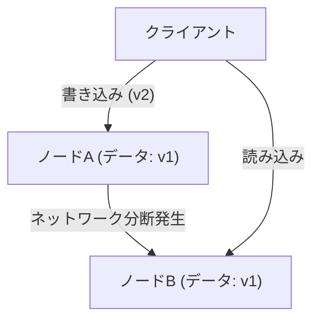
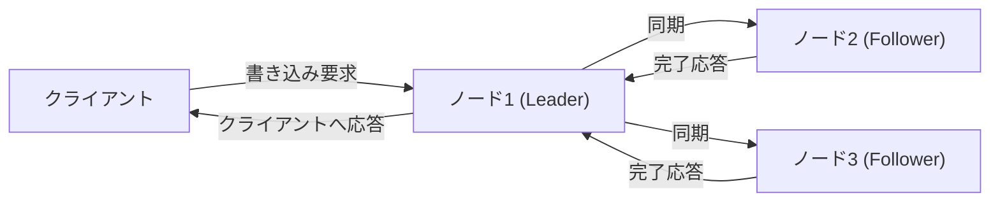

# はじめに：分散システムにおける究極の選択

現代のインターネットを支える巨大なサービス群は、単一のサーバーではなく、世界中に分散された無数のサーバー群（ノード）によって構築されています。Google、Amazon、Facebookといった巨大テクノロジー企業から、急成長するスタートアップに至るまで、データの爆発的な増加に対応するためには「分散データベースシステム」の導入が不可避となっています。

しかし、データを複数のノードに分散配置して管理することには、単一サーバーでは直面することのなかった複雑な課題が伴います。システムのパフォーマンスを上げ、障害に強いシステムを構築しようとするアーキテクトたちは、常に**「一貫性（Consistency）」**、**「可用性（Availability）」**、そして**「レイテンシ（Latency）」**という要素の間で、厳しいトレードオフ（妥協点）の決断を迫られます。

この分散システム設計における根本的なジレンマを数学的、あるいは経験的に体系化したものが、エリック・ブリュワー（Eric Brewer）によって提唱された**「CAP定理」**であり、後にそれを現実の運用に即して補完・拡張した**「PACELC定理」**です。

本記事では、分散データベースシステムのアーキテクチャを理解する上で避けては通れない、これら2つの重要な定理について、基礎から実践的な適用例までを深く掘り下げていきます。

---

# CAP定理：エリック・ブリュワーの証明と3つの頂点

2000年に開催されたACM PODC（Principles of Distributed Computing）カンファレンスにおいて、カリフォルニア大学バークレー校の計算機科学者であるエリック・ブリュワーは、分散コンピューティングにおけるある経験則を発表しました。後にMITのセス・ギルバート（Seth Gilbert）とナンシー・リンチ（Nancy Lynch）によって数学的に証明され、「定理」として確立したのがCAP定理です。

CAP定理は、以下の3つの特性のうち、**同時に満たすことができるのは最大でも2つまでである**、と主張しています。

1. **一貫性 (Consistency: C)**
2. **可用性 (Availability: A)**
3. **分断耐性 (Partition tolerance: P)**

まずは、これら3つの特性が何を意味しているのかを正確に定義しましょう。

## 1. 一貫性 (Consistency)

ここで言う「一貫性」とは、**「すべてのノードが同時に同じデータを参照できること」**を指します。
クライアントがシステム内のどのノードに対してデータの読み取り要求を行ったとしても、常に「最新の書き込み結果」が返ってくるか、あるいは「エラー（応答なし）」となる状態です。古いデータ（Stale Data）が返ってくることは許容されません。

## 2. 可用性 (Availability)

「可用性」とは、**「稼働しているすべてのノードが、妥当な時間内に必ず応答を返すこと」**です。
システムの一部に障害が発生していても、生き残っているノードはクライアントからの読み書き要求に対してエラーを返すことなく、必ず何らかのデータ（それが最新でなくても）を返さなければなりません。

## 3. 分断耐性 (Partition tolerance)

「分断耐性」とは、**「ネットワークの分断（パケットの遅延や喪失）が発生してノード間の通信が断絶した場合でも、システム全体としては動作し続けること」**を意味します。
分散システムでは、ネットワークケーブルの切断、ルーターの故障、一時的な過負荷などにより、ノード間の通信が遮断される「ネットワーク分断（Network Partition）」が必ず発生し得ると想定する必要があります。

上の図のように、ノードAとノードBの間でネットワーク分断が発生した場合、ノードAに書き込まれた最新のデータ（v2）はノードBに同期されません。このとき、クライアントがノードBに読み込み要求を行った場合、システムはどう振る舞うべきでしょうか？

---

# なぜネットワーク分断 (P) は避けられないのか？

CAP定理の誤解として最も多いのが、「CとAを満たすCAシステムを構築できる」という勘違いです。定理上は「3つのうち2つを選べる」とされていますが、**現実の分散システムにおいては「分断耐性 (P)」を放棄することは不可能です。**

なぜなら、ネットワークというものは本質的に不安定であり、パケットロス、スイッチの再起動、データセンター間の回線障害など、ノード間の通信断絶は確率的に必ず発生するからです。Pを放棄するということは、「ネットワーク障害が絶対に起きない単一のサーバー環境（非分散環境）を構築する」ことと同義であり、それは分散システムの前提を覆すことになります。

したがって、現実の分散データベース設計においては、ネットワーク分断（P）が発生した際に、**「一貫性 (C)」と「可用性 (A)」のどちらを優先するか**という2択（CP または AP）を迫られることになります。

---

# 分断発生時の選択：CPシステム vs APシステム

ネットワーク分断が発生したとき、システムはCPかAPのいずれかの挙動をとらざるを得ません。

## CP（Consistency + Partition tolerance）を優先する場合

分断が発生した場合に「一貫性」を優先するアーキテクチャです。
ノードBは最新のデータ（v2）を持っていない可能性があるため、古いデータを返すリスクを避けるために**エラーを返すか、通信が回復するまで応答をブロック（タイムアウト）させます**。
これにより、システム全体として「古いデータは絶対に返さない（強い一貫性）」を保ちますが、その代償として「可用性（A）」が損なわれます。

**代表的なデータベース：**
- **HBase**: HDFS上で稼働し、強い一貫性を提供します。
- **MongoDB**: レプリカセット構成において、プライマリノードがネットワークから孤立した場合、新しいプライマリが選出されるまで書き込みをブロックし、一貫性を担保します。
- **ZooKeeper / etcd**: 分散ロックや設定管理に使われ、過半数の合意（Quorum）が得られない場合はサービスを停止します。

## AP（Availability + Partition tolerance）を優先する場合

分断が発生した場合に「可用性」を優先するアーキテクチャです。
ノードBは、自分が持っている**古いデータ（v1）であったとしても、必ず応答を返します**。エラーにはなりませんが、ノードAにアクセスしたユーザーとノードBにアクセスしたユーザーとで、見えているデータが異なるという「不整合（Inconsistency）」が発生します（のちに通信が回復した際に同期され、「結果整合性：Eventual Consistency」を満たすように設計されることが多いです）。

**代表的なデータベース：**
- **Apache Cassandra**: マスターレス・アーキテクチャを採用し、どのノードでも読み書きを受け付け、ダウンタイムを最小限に抑えます。
- **Amazon DynamoDB**: デフォルトでは結果整合性の読み込みを提供し、極めて高い可用性と低レイテンシを実現します（強い一貫性オプションも存在します）。
- **Riak**: 分散KVSとして、APを徹底した設計がなされています。

---

# CAP定理の限界とPACELC定理の登場

CAP定理は分散システムを理解するための素晴らしい指標ですが、実践においては一つの大きな疑問が残りました。

**「ネットワーク分断が発生していない『正常時』には、システムはどう振る舞うのか？」**

CAP定理は「障害時（ネットワーク分断時）」の挙動についてのみ言及しており、平時のシステムパフォーマンスについては何も語っていません。そこで2010年、メリーランド大学のDaniel Abadiによって提唱されたのが**「PACELC定理」**です。

## PACELC定理の構造

PACELC定理は、CAP定理を拡張し、正常時における「レイテンシ」と「一貫性」のトレードオフを組み込んだものです。

**PACELC = PAC + ELC**

- **If P (Partition):** ネットワーク分断が発生している場合は、
  - **A (Availability)** または **C (Consistency)** のどちらかを優先する（CAP定理と同じ）。
- **Else (E):** そうでなく正常に通信できている平時は、
  - **L (Latency)** または **C (Consistency)** のどちらかを優先する。

### 正常時におけるレイテンシ (L) と一貫性 (C) のトレードオフ

ネットワークが正常に機能している場合、データの書き込みが発生した際、システムは以下のどちらかを選択しなければなりません。

1. **レイテンシ (L) 優先**:
   データを一部のノード（あるいは1つのノード）に書き込んだ時点で、即座にクライアントに「書き込み完了」を返す。残りのノードへの同期はバックグラウンドで非同期に行う。
   - **メリット**: 応答速度（レイテンシ）が非常に速い。
   - **デメリット**: 同期が完了する前に別のクライアントが他のノードを読み込むと、古いデータが返る（一貫性が一時的に損なわれる）。

2. **一貫性 (C) 優先**:
   データをすべてのノード（または過半数のノード）に同期し、すべてから「書き込み完了」の確認が取れるまでクライアントを待たせる。
   - **メリット**: 常に最新のデータが保証される（強い一貫性）。
   - **デメリット**: ノード間の通信と待機時間が発生するため、応答速度（レイテンシ）が遅くなる。

*（C優先の同期レプリケーション。すべての同期を待つためレイテンシが増大する）*

## PACELCによるデータベースの分類

PACELC定理を用いると、データベースをより正確に分類できます。

1. **PC/EC (Partition時はC、平時もC)**
   障害時も平時も一貫性を最優先。平時のレイテンシは犠牲になる。
   例: *VoltDB, Megastore, HBase*
2. **PC/EL (Partition時はC、平時はL)**
   障害時は一貫性を守るが、平時はレイテンシを重視して非同期レプリケーションなどを行う。
   例: *MySQL Cluster, MongoDB (設定による)*
3. **PA/EC (Partition時はA、平時はC)**
   障害時は利用可能にするが、平時は一貫性を保証する。（※理論上の分類であり、現実的な実装は少ない）
4. **PA/EL (Partition時はA、平時はL)**
   障害時は可用性を優先し、平時もレイテンシを最優先する。一貫性は「結果整合性」に留める。
   例: *Cassandra, DynamoDB, Riak*

---

# まとめ：完璧なシステムは存在しない

CAP定理とPACELC定理が我々に教えてくれるのは、**「どのような状況下でも完璧な分散データベースは存在しない」**という残酷な事実です。

銀行の決済システムや在庫管理システムのように、わずかなデータの不整合が致命的な問題を引き起こす場合は、レイテンシや可用性をある程度犠牲にしてでも**CP（PC/EC）**寄りのシステムを選択する必要があります。
一方で、SNSのタイムラインや動画配信のレコメンドエンジンのように、データが数秒古くてもビジネス上の影響が少なく、とにかくダウンしないこと（可用性）と素早いレスポンス（レイテンシ）が求められる場合は、**AP（PA/EL）**寄りのシステムが最適解となります。

システムアーキテクトに求められるのは、これらの定理を深く理解し、自分たちが構築するビジネス要件において**「何を優先し、何を捨てるべきか」**を正確に見極める判断力に他なりません。
分散システムの世界では、妥協点（トレードオフ）を受け入れることこそが、最も堅牢なシステムを設計するための第一歩なのです。
