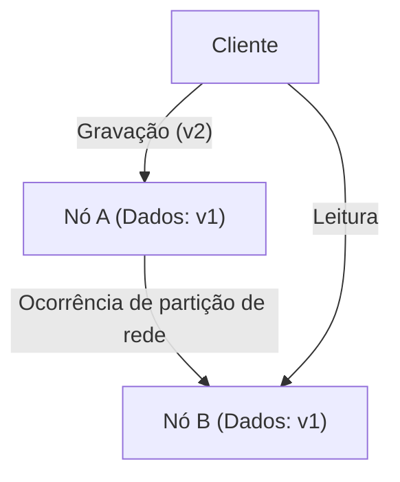
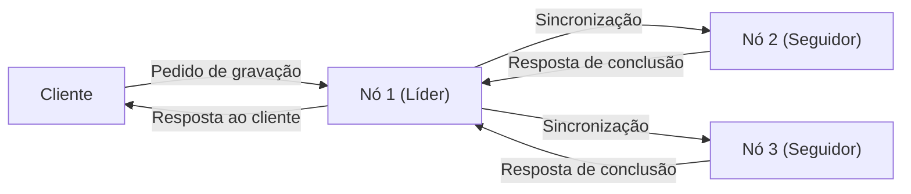

# Introdução: A Escolha Definitiva em Sistemas Distribuídos

Os gigantescos serviços que sustentam a internet moderna não são construídos em um único servidor, mas sim por incontáveis grupos de servidores (nós) distribuídos ao redor do mundo. Desde grandes empresas de tecnologia, como Google, Amazon e Facebook, até startups em rápido crescimento, a adoção de 'sistemas de banco de dados distribuídos' tornou-se inevitável para lidar com o aumento explosivo de dados.

No entanto, gerenciar dados distribuídos em vários nós traz desafios complexos que nunca foram enfrentados com um único servidor. Os arquitetos que tentam melhorar o desempenho e construir sistemas tolerantes a falhas são constantemente forçados a tomar decisões difíceis de trade-off (compromisso) entre **'Consistência' (Consistency)**, **'Disponibilidade' (Availability)** e **'Latência' (Latency)**.

A sistematização matemática ou empírica desse dilema fundamental no design de sistemas distribuídos é o **'Teorema CAP'**, proposto por Eric Brewer, e posteriormente complementado e expandido para se adequar a operações reais através do **'Teorema PACELC'**.

Neste artigo, aprofundaremos esses dois teoremas essenciais, dos fundamentos aos exemplos de aplicação prática, cruciais para entender a arquitetura de sistemas de bancos de dados distribuídos.

---

# Teorema CAP: A Prova de Eric Brewer e os Três Vértices

Em 2000, na conferência ACM PODC (Principles of Distributed Computing), o cientista da computação da UC Berkeley, Eric Brewer, apresentou uma regra prática sobre computação distribuída. Mais tarde, isso foi matematicamente provado por Seth Gilbert e Nancy Lynch, do MIT, estabelecendo-se como um 'teorema' conhecido como o Teorema CAP.

O Teorema CAP afirma que, dentre as seguintes três propriedades, **apenas um máximo de duas podem ser satisfeitas simultaneamente**.

1. **Consistência (Consistency: C)**
2. **Disponibilidade (Availability: A)**
3. **Tolerância a Partições (Partition tolerance: P)**

Primeiro, vamos definir exatamente o que essas três propriedades significam.

## 1. Consistência (Consistency)

A 'Consistência' aqui se refere ao fato de que **'todos os nós podem referenciar os mesmos dados ao mesmo tempo'**.
Não importa qual nó no sistema um cliente solicite para leitura de dados, ele sempre retornará o 'resultado de gravação mais recente' ou resultará em um 'erro (sem resposta)'. O retorno de dados desatualizados (Stale Data) não é permitido.

## 2. Disponibilidade (Availability)

'Disponibilidade' significa que **'todos os nós operacionais sempre devem retornar uma resposta em um tempo razoável'**.
Mesmo que uma falha ocorra em uma parte do sistema, os nós sobreviventes devem obrigatoriamente retornar algum tipo de dado (mesmo que não seja o mais recente) em resposta às solicitações de leitura e gravação dos clientes, sem retornar erros.

## 3. Tolerância a Partições (Partition tolerance)

A 'Tolerância a Partições' significa que **'mesmo que ocorra uma partição de rede (atraso ou perda de pacotes) e a comunicação entre os nós seja interrompida, o sistema como um todo continuará a funcionar'**.
Em sistemas distribuídos, é preciso assumir que 'partições de rede' (Network Partition), onde a comunicação entre os nós é cortada devido a falhas em cabos de rede, quebra de roteadores ou sobrecargas temporárias, certamente podem ocorrer.

Como na figura acima, se ocorrer uma partição de rede entre o Nó A e o Nó B, os dados mais recentes gravados no Nó A (v2) não serão sincronizados com o Nó B. Neste momento, se um cliente fizer um pedido de leitura para o Nó B, como o sistema deve se comportar?

---

# Por Que a Partição de Rede (P) é Inevitável?

O mal-entendido mais comum sobre o Teorema CAP é o equívoco de que 'podemos construir um sistema CA que satisfaça C e A'. O teorema diz que você pode 'escolher dois dos três', mas **em sistemas distribuídos do mundo real, é impossível abandonar a 'Tolerância a Partições (P)'.**

Isso ocorre porque as redes são inerentemente instáveis, e quebras de comunicação entre os nós—devido a perda de pacotes, reinicialização de switches, falhas de link entre data centers—ocorrerão inevitavelmente de forma probabilística. Abandonar a P é sinônimo de 'construir um ambiente de servidor único (não distribuído) onde falhas de rede nunca ocorrerão', o que subverte toda a premissa dos sistemas distribuídos.

Portanto, no design de banco de dados distribuído no mundo real, quando ocorre uma partição de rede (P), você é forçado a escolher entre **'priorizar a Consistência (C)' ou 'priorizar a Disponibilidade (A)'** (ou seja, CP ou AP).

---

# Escolhas Durante uma Partição: Sistemas CP vs Sistemas AP

Quando ocorre uma partição de rede, o sistema não tem escolha a não ser agir como CP ou AP.

## Quando Priorizar CP (Consistency + Partition tolerance)

Esta é uma arquitetura que prioriza a 'consistência' quando ocorre uma partição.
Como o Nó B pode não ter os dados mais recentes (v2), para evitar o risco de retornar dados antigos, **ele retorna um erro ou bloqueia a resposta (timeout) até que a comunicação seja restabelecida**.
Como resultado, o sistema como um todo mantém a regra de que 'dados antigos nunca são retornados' (forte consistência), mas com o custo de perder a 'disponibilidade (A)'.

**Bancos de dados representativos:**
- **HBase**: É executado sobre HDFS e fornece forte consistência.
- **MongoDB**: Em uma configuração Replica Set, se o nó primário ficar isolado da rede, as gravações são bloqueadas até que um novo primário seja eleito, garantindo a consistência.
- **ZooKeeper / etcd**: Usados para gerenciamento de configuração e locks distribuídos; se o consenso da maioria (Quorum) não for alcançado, o serviço é interrompido.

## Quando Priorizar AP (Availability + Partition tolerance)

Esta é uma arquitetura que prioriza a 'disponibilidade' quando ocorre uma partição.
O Nó B **sempre retorna uma resposta, mesmo que os dados que possui sejam os antigos (v1)**. Não há erro, mas isso cria uma 'inconsistência' (Inconsistency) onde o usuário acessando o Nó A e o usuário acessando o Nó B veem dados diferentes (frequentemente, sistemas são projetados para sincronizar quando a comunicação for restabelecida, satisfazendo a 'Consistência Eventual' / Eventual Consistency).

**Bancos de dados representativos:**
- **Apache Cassandra**: Adota uma arquitetura sem mestre, aceitando leituras e gravações em qualquer nó, minimizando o tempo de inatividade.
- **Amazon DynamoDB**: Fornece leituras eventualmente consistentes por padrão, alcançando altíssima disponibilidade e baixa latência (opções de forte consistência também existem).
- **Riak**: Como um KVS distribuído, adere estritamente ao design AP.

---

# Limitações do Teorema CAP e o Surgimento do Teorema PACELC

Embora o Teorema CAP seja um excelente indicador para entender sistemas distribuídos, na prática, permanecia uma grande questão:

**'Como o sistema se comporta em tempos "normais", quando nenhuma partição de rede ocorreu?'**

O Teorema CAP fala apenas do comportamento durante 'falhas' (partições de rede) e não diz nada sobre o desempenho do sistema em tempos normais. Portanto, em 2010, Daniel Abadi, da Universidade de Maryland, propôs o **'Teorema PACELC'**.

## Estrutura do Teorema PACELC

O Teorema PACELC expande o Teorema CAP incorporando o trade-off entre 'latência' e 'consistência' durante operações normais.

**PACELC = PAC + ELC**

- **If P (Partition):** Se uma partição de rede estiver ocorrendo,
  - Priorize ou **A (Availability)** ou **C (Consistency)** (mesmo que o Teorema CAP).
- **Else (E):** Caso contrário, em tempos normais onde a comunicação está funcionando corretamente,
  - Priorize ou **L (Latency)** ou **C (Consistency)**.

### Trade-off entre Latência (L) e Consistência (C) em Tempos Normais

Quando a rede está funcionando normalmente e ocorre uma gravação de dados, o sistema deve escolher entre:

1. **Prioridade de Latência (L)**:
   Quando os dados são gravados em alguns nós (ou um único nó), o sistema retorna imediatamente um status de 'gravação concluída' para o cliente. A sincronização com os nós restantes é feita de forma assíncrona em segundo plano.
   - **Prós**: A velocidade de resposta (latência) é muito rápida.
   - **Contras**: Se outro cliente ler de um nó diferente antes que a sincronização seja concluída, dados antigos serão retornados (a consistência é temporariamente comprometida).

2. **Prioridade de Consistência (C)**:
   Os dados são sincronizados para todos os nós (ou maioria dos nós), e o sistema faz o cliente esperar até receber confirmação de 'gravação concluída' de todos eles.
   - **Prós**: Dados mais recentes são sempre garantidos (forte consistência).
   - **Contras**: A velocidade de resposta (latência) torna-se mais lenta devido à comunicação entre os nós e o tempo de espera inerente.

*(Replicação síncrona com prioridade C. A latência aumenta por ter que esperar por todas as sincronizações)*

## Classificação de Bancos de Dados por PACELC

Usando o Teorema PACELC, podemos classificar bancos de dados com mais precisão.

1. **PC/EC (C sob Partição, C sob tempos normais)**
   A consistência é a maior prioridade durante falhas e operações normais. A latência em tempos normais é sacrificada.
   Exemplos: *VoltDB, Megastore, HBase*
2. **PC/EL (C sob Partição, L sob tempos normais)**
   Mantém a consistência durante falhas, mas prioriza a latência e faz replicação assíncrona em tempos normais.
   Exemplos: *MySQL Cluster, MongoDB (dependendo da configuração)*
3. **PA/EC (A sob Partição, C sob tempos normais)**
   Disponível durante falhas, mas garante consistência em tempos normais. (*Uma classificação teórica, com poucas implementações reais*)
4. **PA/EL (A sob Partição, L sob tempos normais)**
   Prioriza a disponibilidade em caso de falha e também prioriza fortemente a latência em tempos normais. A consistência é deixada como 'consistência eventual'.
   Exemplos: *Cassandra, DynamoDB, Riak*

---

# Conclusão: Não Existe um Sistema Perfeito

O que o Teorema CAP e o Teorema PACELC nos ensinam é a dura verdade de que **'não existe um banco de dados distribuído perfeito em todas as situações'**.

Para casos onde até mesmo pequenas inconsistências de dados causam problemas fatais, como em sistemas de pagamento de bancos ou sistemas de gestão de inventário, é necessário escolher um sistema que se incline mais para **CP (PC/EC)**, mesmo que haja sacrifícios em latência ou disponibilidade.
Por outro lado, onde dados com poucos segundos de atraso têm impacto de negócios mínimo, e as maiores prioridades são o sistema não cair (disponibilidade) e resposta rápida (latência), como linhas do tempo de redes sociais e motores de recomendação de vídeo, um sistema com forte apelo para **AP (PA/EL)** é a solução ideal.

O que se exige de arquitetos de sistema é um profundo entendimento desses teoremas e a capacidade de julgamento para identificar com precisão **'o que priorizar e o que abandonar'** nos requisitos de negócios do sistema que estão construindo.
No mundo dos sistemas distribuídos, aceitar trade-offs (compromissos) é, sem dúvida, o primeiro passo no design do sistema mais robusto.
