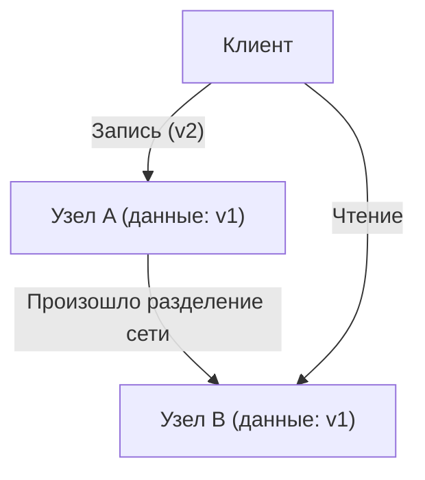
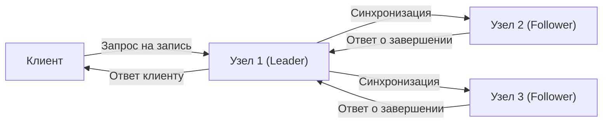

# Введение: Ультимативный выбор в распределенных системах

Огромные сервисы, на которых держится современный интернет, строятся не на одном сервере, а на бесчисленном множестве серверов (узлов), распределенных по всему миру. От технологических гигантов, таких как Google, Amazon и Facebook, до быстрорастущих стартапов — внедрение «распределенных баз данных» стало неизбежным для того, чтобы справляться со взрывным ростом объемов данных.

Однако распределенное хранение и управление данными на нескольких узлах сопряжено со сложными проблемами, с которыми не сталкивались при работе с одиночными серверами. Архитекторы, стремящиеся повысить производительность и создать отказоустойчивые системы, постоянно вынуждены принимать трудные решения о компромиссах между **«Согласованностью (Consistency)»**, **«Доступностью (Availability)»** и **«Задержкой (Latency)»**.

Эта фундаментальная дилемма в проектировании распределенных систем была систематизирована математически и эмпирически в **«Теореме CAP»**, предложенной Эриком Брюером (Eric Brewer), а затем дополнена и расширена для практического применения в **«Теореме PACELC»**.

В этой статье мы глубоко погрузимся в эти две важные теоремы, которые невозможно обойти стороной при изучении архитектуры распределенных баз данных, от основ до практических примеров применения.

---

# Теорема CAP: Доказательство Эрика Брюера и три вершины

В 2000 году на конференции ACM PODC (Principles of Distributed Computing) Эрик Брюер, ученый в области компьютерных наук из Калифорнийского университета в Беркли, представил эмпирическое правило распределенных вычислений. Позже оно было математически доказано Сетом Гилбертом (Seth Gilbert) и Нэнси Линч (Nancy Lynch) из Массачусетского технологического института и утвердилось как «теорема» — теорема CAP.

Теорема CAP утверждает, что из следующих трех свойств **одновременно могут выполняться максимум только два**:

1. **Согласованность (Consistency: C)**
2. **Доступность (Availability: A)**
3. **Устойчивость к разделению (Partition tolerance: P)**

Для начала давайте точно определим, что означают эти три свойства.

## 1. Согласованность (Consistency)

«Согласованность» в данном контексте означает, что **«все узлы одновременно могут обращаться к одним и тем же данным»**.
К какому бы узлу системы клиент ни обратился с запросом на чтение данных, он всегда должен получать либо «последний результат записи», либо «ошибку (отсутствие ответа)». Возврат устаревших данных (Stale Data) не допускается.

## 2. Доступность (Availability)

«Доступность» означает, что **«каждый работающий узел должен возвращать ответ в разумные сроки»**.
Даже если в части системы произошел сбой, выжившие узлы не должны возвращать ошибки на запросы клиента на чтение и запись, они обязательно должны вернуть какие-либо данные (даже если они не самые свежие).

## 3. Устойчивость к разделению (Partition tolerance)

«Устойчивость к разделению» означает, что **«система продолжает функционировать в целом, даже если связь между узлами нарушена из-за разделения сети (задержки или потери пакетов)»**.
В распределенной системе необходимо исходить из предположения, что «сетевое разделение (Network Partition)», при котором прерывается связь между узлами из-за обрыва сетевого кабеля, отказа маршрутизатора или временной перегрузки, обязательно произойдет.

Как показано на схеме выше, если между узлом A и узлом B происходит сетевое разделение, последние данные (v2), записанные на узле A, не синхронизируются с узлом B. Как в этом случае должна вести себя система, если клиент отправляет запрос на чтение к узлу B?

---

# Почему разделение сети (P) неизбежно?

Самым распространенным заблуждением о теореме CAP является убеждение, что «можно построить CA-систему, удовлетворяющую C и A». Хотя теорема гласит, что «можно выбрать два из трех», **в реальных распределенных системах отказаться от «Устойчивости к разделению (P)» невозможно.**

Это связано с тем, что сети по своей природе нестабильны, и нарушения связи между узлами, такие как потеря пакетов, перезагрузка коммутаторов и сбои на линиях между центрами обработки данных, вероятностно неизбежны. Отказ от P равносилен «созданию среды с одним сервером (нераспределенной среды), в которой сетевые сбои абсолютно невозможны», что противоречит самой предпосылке распределенных систем.

Следовательно, при проектировании реальных распределенных баз данных, когда происходит разделение сети (P), возникает необходимость сделать выбор из двух вариантов: **что приоритетнее — «Согласованность (C)» или «Доступность (A)»** (CP или AP).

---

# Выбор при возникновении разделения: Системы CP против систем AP

Когда происходит разделение сети, система вынуждена вести себя либо как CP, либо как AP.

## Если приоритет отдается CP (Consistency + Partition tolerance)

Это архитектура, в которой приоритет отдается «согласованности» в случае разделения.
Поскольку узел B может не иметь последних данных (v2), чтобы избежать риска возврата устаревших данных, он **возвращает ошибку или блокирует ответ (тайм-аут) до тех пор, пока связь не восстановится**.
В результате система в целом сохраняет принцип «никогда не возвращать устаревшие данные (строгая согласованность)», но ценой потери «доступности (A)».

**Типичные базы данных:**
- **HBase**: Работает поверх HDFS и обеспечивает строгую согласованность.
- **MongoDB**: В конфигурации с наборами реплик (Replica Set), если первичный узел изолирован от сети, запись блокируется до выбора нового первичного узла, обеспечивая согласованность.
- **ZooKeeper / etcd**: Используются для распределенных блокировок и управления конфигурацией, останавливают обслуживание, если не удается достичь кворума большинства.

## Если приоритет отдается AP (Availability + Partition tolerance)

Это архитектура, в которой приоритет отдается «доступности» в случае разделения.
Узел B **обязательно вернет ответ, даже если это старые данные (v1)**, которые у него есть. Ошибки не произойдет, но возникнет «несогласованность (Inconsistency)», когда пользователи, обращающиеся к узлу A, и пользователи, обращающиеся к узлу B, будут видеть разные данные (обычно системы проектируются так, чтобы при восстановлении связи данные синхронизировались, обеспечивая «согласованность в конечном счете: Eventual Consistency»).

**Типичные базы данных:**
- **Apache Cassandra**: Использует архитектуру без главного узла (masterless), принимая чтение и запись на любом узле и сводя к минимуму время простоя.
- **Amazon DynamoDB**: По умолчанию предоставляет чтение с согласованностью в конечном счете, обеспечивая чрезвычайно высокую доступность и низкую задержку (также доступна опция строгой согласованности).
- **Riak**: Как распределенное хранилище ключ-значение (KVS), оно спроектировано с полным упором на AP.

---

# Ограничения теоремы CAP и появление теоремы PACELC

Теорема CAP является отличным ориентиром для понимания распределенных систем, но на практике оставался один большой вопрос.

**«Как ведет себя система в 'нормальное время', когда нет разделения сети?»**

Теорема CAP говорит только о поведении в «случае сбоя (разделения сети)» и ничего не говорит о производительности системы в обычное время. Поэтому в 2010 году Дэниел Абади (Daniel Abadi) из Мэрилендского университета предложил **«Теорему PACELC»**.

## Структура теоремы PACELC

Теорема PACELC расширяет теорему CAP, включая компромисс между «задержкой» и «согласованностью» в нормальных условиях.

**PACELC = PAC + ELC**

- **If P (Partition):** Если происходит разделение сети,
  - Приоритет отдается либо **A (Availability)**, либо **C (Consistency)** (как в теореме CAP).
- **Else (E):** Иначе, в нормальное время при успешной связи,
  - Приоритет отдается либо **L (Latency)**, либо **C (Consistency)**.

### Компромисс между задержкой (L) и согласованностью (C) в нормальное время

Когда сеть функционирует нормально, при записи данных система должна выбрать одно из следующего:

1. **Приоритет задержки (L)**:
   Как только данные записываются на некоторые узлы (или один узел), клиенту немедленно возвращается ответ «запись завершена». Синхронизация с остальными узлами выполняется в фоновом режиме асинхронно.
   - **Преимущества**: Очень высокая скорость ответа (задержка).
   - **Недостатки**: Если другой клиент прочитает данные с других узлов до завершения синхронизации, будут возвращены устаревшие данные (согласованность временно нарушается).

2. **Приоритет согласованности (C)**:
   Данные синхронизируются на все узлы (или большинство узлов), и клиент ожидает, пока от всех не будет получено подтверждение «запись завершена».
   - **Преимущества**: Всегда гарантируются самые актуальные данные (строгая согласованность).
   - **Недостатки**: Скорость ответа (задержка) снижается из-за необходимости связи между узлами и времени ожидания.

*(Синхронная репликация с приоритетом C. Задержка увеличивается из-за ожидания полной синхронизации)*

## Классификация баз данных по PACELC

Использование теоремы PACELC позволяет более точно классифицировать базы данных.

1. **PC/EC (При Partition - C, в нормальное время - C)**
   Согласованность имеет высший приоритет как во время сбоя, так и в обычное время. Задержка в обычное время приносится в жертву.
   Примеры: *VoltDB, Megastore, HBase*
2. **PC/EL (При Partition - C, в нормальное время - L)**
   Во время сбоя сохраняется согласованность, но в обычное время приоритет отдается задержке с использованием асинхронной репликации и т.д.
   Примеры: *MySQL Cluster, MongoDB (в зависимости от настроек)*
3. **PA/EC (При Partition - A, в нормальное время - C)**
   Доступна во время сбоя, но гарантирует согласованность в обычное время. (*Это скорее теоретическая классификация, на практике таких реализаций мало*)
4. **PA/EL (При Partition - A, в нормальное время - L)**
   Доступность имеет приоритет при сбое, а задержка - наивысший приоритет в обычное время. Согласованность ограничивается «согласованностью в конечном счете».
   Примеры: *Cassandra, DynamoDB, Riak*

---

# Заключение: Идеальной системы не существует

Теоремы CAP и PACELC учат нас жестокой правде: **«Идеальной распределенной базы данных для любой ситуации не существует»**.

В тех случаях, когда даже малейшая несогласованность данных может привести к фатальным последствиям, как, например, в банковских платежных системах или системах управления запасами, необходимо выбирать систему с уклоном в **CP (PC/EC)**, даже если придется в некоторой степени пожертвовать задержкой или доступностью.
С другой стороны, в случаях, когда отставание данных на несколько секунд мало влияет на бизнес, и главное — чтобы система не падала (доступность) и быстро отвечала (задержка), как в лентах социальных сетей или механизмах рекомендаций для потокового видео, оптимальным решением будет система с уклоном в **AP (PA/EL)**.

От системного архитектора требуется глубоко понимать эти теоремы и обладать рассудительностью, чтобы точно определять, **«чему отдать приоритет и от чего отказаться»** в соответствии с бизнес-требованиями создаваемой системы.
В мире распределенных систем принятие компромиссов — это первый шаг к проектированию самой надежной системы.
