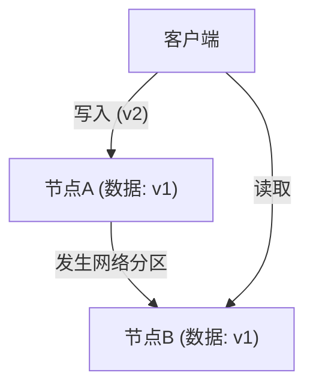
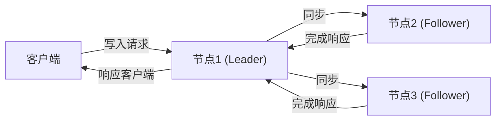

# 前言：分布式系统中的终极选择

支撑现代互联网的庞大服务群，并非构建在单一服务器上，而是由分布在世界各地的无数服务器集群（节点）构建而成的。从Google、Amazon、Facebook等大型科技企业，到快速增长的初创公司，为了应对数据的爆炸性增长，引入“分布式数据库系统”已成为必然。

然而，将数据分布在多个节点上进行管理，会伴随着单一服务器所未曾面临的复杂挑战。试图提高系统性能、构建高容错系统的架构师们，始终面临着在**“一致性（Consistency）”**、**“可用性（Availability）”**以及**“延迟（Latency）”**这些因素之间做出艰难的权衡（妥协）的抉择。

将这种分布式系统设计中的根本困境进行数学上或经验上的系统化总结，就是由埃里克·布鲁尔（Eric Brewer）提出的**“CAP定理”**，以及后来结合实际运维对其进行补充和扩展的**“PACELC定理”**。

本文将在深入探讨分布式数据库系统架构时不可回避的这两个重要定理，从基础概念到实际应用案例进行深度剖析。

---

# CAP定理：埃里克·布鲁尔的证明与三个顶点

在2000年举办的ACM PODC（分布式计算原理）会议上，加州大学伯克利分校的计算机科学家埃里克·布鲁尔发表了一条关于分布式计算的经验法则。后来，麻省理工学院的赛斯·吉尔伯特（Seth Gilbert）和南希·林奇（Nancy Lynch）对其进行了数学证明，确立为“定理”，即CAP定理。

CAP定理主张，在以下三个特性中，**最多只能同时满足其中的两个**。

1. **一致性 (Consistency: C)**
2. **可用性 (Availability: A)**
3. **分区容错性 (Partition tolerance: P)**

首先，让我们准确定义这三个特性所代表的含义。

## 1. 一致性 (Consistency)

这里所说的“一致性”，是指**“所有节点在同一时间能够访问到相同的数据”**。
无论客户端向系统内的哪个节点发出数据读取请求，都会始终返回“最新的写入结果”，或者返回“错误（无响应）”状态。不允许返回旧数据（Stale Data）。

## 2. 可用性 (Availability)

“可用性”是指**“所有正常运行的节点，必须在合理的时间内返回响应”**。
即使系统的一部分发生故障，存活的节点也必须对客户端的读写请求返回某种数据（即使不是最新的），而不能返回错误。

## 3. 分区容错性 (Partition tolerance)

“分区容错性”意味着**“即使发生网络分区（数据包延迟或丢失）导致节点间的通信中断，系统作为一个整体仍能继续运行”**。
在分布式系统中，必须假设由于网络电缆断开、路由器故障、临时过载等原因，导致节点间通信中断的“网络分区（Network Partition）”是必然会发生的。

如上图所示，当节点A和节点B之间发生网络分区时，写入节点A的最新数据（v2）将无法同步到节点B。此时，如果客户端向节点B发出读取请求，系统应该如何表现？

---

# 为什么网络分区 (P) 是不可避免的？

关于CAP定理最常见的误解是“可以构建一个同时满足C和A的CA系统”。虽然定理上说“可以从三个中选择两个”，但**在现实的分布式系统中，“放弃分区容错性 (P)”是不可能的。**

这是因为网络本质上是不稳定的，数据包丢失、交换机重启、数据中心之间的线路故障等导致节点间通信中断的情况在概率上是必定会发生的。放弃P意味着“构建一个绝对不会发生网络故障的单一服务器环境（非分布式环境）”，这就颠覆了分布式系统的前提。

因此，在实际的分布式数据库设计中，当发生网络分区（P）时，架构师必须在**“优先考虑一致性 (C)”还是“优先考虑可用性 (A)”**之间做出二选一（CP 或 AP）的抉择。

---

# 发生分区时的选择：CP系统 vs AP系统

当网络分区发生时，系统别无选择，只能采取CP或AP其中之一的行为。

## 优先考虑CP（Consistency + Partition tolerance）的情况

这是在发生分区时优先考虑“一致性”的架构。
由于节点B可能没有最新数据（v2），为了避免返回旧数据的风险，它会**返回错误，或者阻塞响应（超时）直到通信恢复**。
这样一来，系统整体保持了“绝对不返回旧数据（强一致性）”，但代价是牺牲了“可用性（A）”。

**代表性数据库：**
- **HBase**: 运行在HDFS上，提供强一致性。
- **MongoDB**: 在副本集配置中，当主节点与网络隔离时，在选举出新的主节点之前会阻塞写入，以保证一致性。
- **ZooKeeper / etcd**: 用于分布式锁或配置管理，当无法获得过半数同意（Quorum）时，将停止服务。

## 优先考虑AP（Availability + Partition tolerance）的情况

这是在发生分区时优先考虑“可用性”的架构。
节点B即使拥有的是**旧数据（v1），也一定会返回响应**。虽然不会发生错误，但访问节点A的用户和访问节点B的用户会看到不同的数据，从而产生“不一致（Inconsistency）”（通常设计为在通信恢复时进行同步，以满足“最终一致性：Eventual Consistency”）。

**代表性数据库：**
- **Apache Cassandra**: 采用无主（Masterless）架构，任何节点都可以接受读写，将停机时间降至最低。
- **Amazon DynamoDB**: 默认提供最终一致性的读取，实现极高的可用性和低延迟（也存在强一致性选项）。
- **Riak**: 作为分布式KVS，彻底贯彻了AP设计。

---

# CAP定理的局限性与PACELC定理的出现

虽然CAP定理是理解分布式系统的一个极佳指标，但在实践中却留下了一个巨大的疑问。

**“在没有发生网络分区的『正常情况下』，系统是如何表现的？”**

CAP定理只谈到了“故障时（网络分区时）”的行为，对于平时的系统性能却只字未提。因此在2010年，马里兰大学的Daniel Abadi提出了**“PACELC定理”**。

## PACELC定理的结构

PACELC定理扩展了CAP定理，将正常情况下的“延迟”和“一致性”的权衡纳入其中。

**PACELC = PAC + ELC**

- **If P (Partition):** 如果发生网络分区，
  - 优先选择 **A (Availability)** 或 **C (Consistency)**（与CAP定理相同）。
- **Else (E):** 否则，在通信正常的平时，
  - 优先选择 **L (Latency)** 或 **C (Consistency)**。

### 正常情况下延迟 (L) 与一致性 (C) 的权衡

当网络正常运行时，当发生数据写入时，系统必须选择以下其中之一。

1. **优先考虑延迟 (L)**:
   在数据写入部分节点（或1个节点）时，立即向客户端返回“写入完成”。剩余节点的同步在后台异步进行。
   - **优点**: 响应速度（延迟）非常快。
   - **缺点**: 如果在同步完成之前另一个客户端读取其他节点，将返回旧数据（一致性暂时受损）。

2. **优先考虑一致性 (C)**:
   将数据同步到所有节点（或过半数节点），并让客户端等待，直到确认所有节点都已“写入完成”。
   - **优点**: 始终保证最新的数据（强一致性）。
   - **缺点**: 由于节点间通信和等待时间的产生，响应速度（延迟）会变慢。

*（优先C的同步复制。因为要等待所有同步完成，延迟会增加）*

## 基于PACELC的数据库分类

使用PACELC定理，可以更准确地对数据库进行分类。

1. **PC/EC (Partition时为C，平时也为C)**
   无论是故障时还是平时，一致性都放在首位。牺牲了平时的延迟。
   示例: *VoltDB, Megastore, HBase*
2. **PC/EL (Partition时为C，平时为L)**
   故障时保证一致性，但平时更看重延迟，进行异步复制等。
   示例: *MySQL Cluster, MongoDB (取决于配置)*
3. **PA/EC (Partition时为A，平时为C)**
   故障时保证可用性，但平时保证一致性。（※这是理论上的分类，现实中的实现很少）
4. **PA/EL (Partition时为A，平时为L)**
   故障时优先可用性，平时也优先延迟。一致性仅保持在“最终一致性”层面。
   示例: *Cassandra, DynamoDB, Riak*

---

# 总结：完美的系统不存在

CAP定理和PACELC定理告诉我们一个残酷的事实：**“在任何情况下，都不存在完美的分布式数据库。”**

如果是像银行的支付系统或库存管理系统这样，轻微的数据不一致就会导致致命问题的情况，就必须牺牲一定的延迟或可用性，选择偏向**CP（PC/EC）**的系统。
另一方面，如果是像社交网络的时间线或视频流媒体的推荐引擎这样，数据稍微旧几秒也不会对业务产生太大影响，且主要要求系统不能宕机（可用性）和快速响应（延迟）的情况，偏向**AP（PA/EL）**的系统则是最佳解决方案。

系统架构师所需要具备的，正是深刻理解这些定理，并在自己所构建的业务需求中，准确判断**“应该优先什么，舍弃什么”**的能力。
在分布式系统的世界里，接受妥协（权衡）才是设计最稳健系统的第一步。
