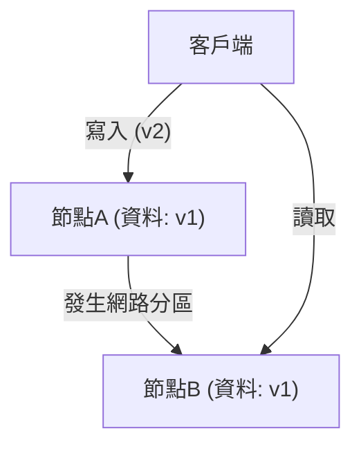
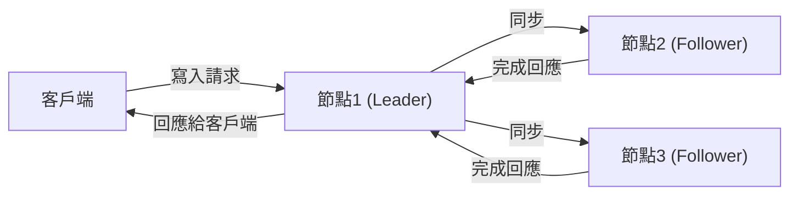

# 前言：分散式系統中的終極抉擇

支撐現代網際網路的龐大服務群，並非由單一伺服器組成，而是由散佈於世界各地的無數伺服器群（節點）所建構。從 Google、Amazon、Facebook 等大型科技企業，到快速成長的新創公司，為了因應數據的爆發性增長，「分散式資料庫系統」的引入已成為必然。

然而，將資料分散配置於多個節點進行管理，會伴隨著在單一伺服器上從未遇過的複雜挑戰。致力於提升系統效能並建立高容錯系統的架構師們，總是面臨在**「一致性（Consistency）」**、**「可用性（Availability）」**與**「延遲（Latency）」**這些要素之間做出艱難的取捨（折衷）。

將這種分散式系統設計中根本性的困境進行數學或經驗上系統化整理的，是由艾瑞克·布魯爾（Eric Brewer）所提出的**「CAP 定理」**，以及後來根據實際運作情況進行補充與擴展的**「PACELC 定理」**。

本文將深入探討在理解分散式資料庫系統架構時不可避免的這兩個重要定理，從基礎到實務應用進行深入剖析。

---

# CAP 定理：艾瑞克·布魯爾的證明與三個頂點

在 2000 年舉辦的 ACM PODC（分散式計算原理）研討會上，加州大學柏克萊分校的計算機科學家艾瑞克·布魯爾發表了分散式計算中的一項經驗法則。隨後，由麻省理工學院（MIT）的賽斯·吉爾伯特（Seth Gilbert）與南希·林奇（Nancy Lynch）進行數學證明，確立為「定理」的便是 CAP 定理。

CAP 定理主張，在以下三個特性中，**最多只能同時滿足其中兩個**：

1. **一致性 (Consistency: C)**
2. **可用性 (Availability: A)**
3. **分區容錯性 (Partition tolerance: P)**

首先，讓我們準確定義這三個特性的含義。

## 1. 一致性 (Consistency)

這裡所說的「一致性」，是指**「所有節點在同一時間都能讀取到相同的資料」**。
無論客戶端對系統內的哪個節點發出讀取資料的請求，總是會回傳「最新的寫入結果」，或者呈現「錯誤（無回應）」的狀態。不允許回傳過時的資料（Stale Data）。

## 2. 可用性 (Availability)

「可用性」是指**「所有正在運作的節點，必須在合理的時間內給予回應」**。
即使系統的某部分發生故障，存活下來的節點面對客戶端的讀寫請求，不能回傳錯誤，而是必須回傳某些資料（即使不是最新的）。

## 3. 分區容錯性 (Partition tolerance)

「分區容錯性」是指**「即使發生網路分區（封包延遲或遺失），導致節點間的通訊中斷，整個系統仍能持續運作」**。
在分散式系統中，必須假設因網路線斷裂、路由器故障、暫時性的過載等原因，導致節點間通訊受阻的「網路分區（Network Partition）」是必然會發生的。

如上圖所示，當節點 A 與節點 B 之間發生網路分區時，寫入至節點 A 的最新資料（v2）將無法同步到節點 B。此時，若客戶端向節點 B 發出讀取請求，系統應該作何反應？

---

# 為什麼網路分區 (P) 是無法避免的？

對 CAP 定理最常見的誤解，就是認為「可以建構出滿足 C 與 A 的 CA 系統」。雖然定理表面上表示「可以從三者中選擇兩個」，但**在現實的分散式系統中，放棄「分區容錯性 (P)」是不可能的。**

原因在於網路本質上是不穩定的，封包遺失、交換機重啟、資料中心之間的線路故障等，節點間通訊中斷在機率上是必然會發生的。放棄 P，就等於「建構一個絕對不會發生網路故障的單一伺服器環境（非分散式環境）」，這將推翻分散式系統的根本前提。

因此，在現實的分散式資料庫設計中，當網路分區 (P) 發生時，必然面臨**「優先考慮一致性 (C) 還是可用性 (A)」**的二選一困境（CP 或 AP）。

---

# 發生分區時的選擇：CP 系統 vs AP 系統

當網路分區發生時，系統不得不採取 CP 或 AP 其中一種行為模式。

## 優先考量 CP（一致性 + 分區容錯性）的情況

這是在發生分區時，優先保障「一致性」的架構。
由於節點 B 可能未持有最新資料（v2），為了避免回傳過時資料的風險，**系統會回傳錯誤，或是在通訊恢復前阻擋回應（發生超時）**。
這樣雖然能維持整個系統「絕對不回傳舊資料（強一致性）」的狀態，但代價就是犧牲了「可用性 (A)」。

**具代表性的資料庫：**
- **HBase**: 運行於 HDFS 之上，提供強一致性。
- **MongoDB**: 在副本集（Replica Set）架構中，若主節點（Primary Node）與網路隔離，在選出新的主節點之前，會阻擋寫入操作以確保一致性。
- **ZooKeeper / etcd**: 用於分散式鎖及組態管理，當無法獲得過半數同意（Quorum）時，便會停止服務。

## 優先考量 AP（可用性 + 分區容錯性）的情況

這是在發生分區時，優先保障「可用性」的架構。
節點 B 即便持有的是**舊資料（v1），也必定會給予回應**。雖然不會引發錯誤，但訪問節點 A 的使用者與訪問節點 B 的使用者，所看到的資料將會不同，從而產生「不一致（Inconsistency）」現象（通常會設計成在後續通訊恢復時進行同步，以滿足「最終一致性：Eventual Consistency」）。

**具代表性的資料庫：**
- **Apache Cassandra**: 採用無主節點（Masterless）架構，任何節點都能接受讀寫操作，將停機時間降至最低。
- **Amazon DynamoDB**: 預設提供最終一致性的讀取，實現極高的可用性與低延遲（也存在強一致性選項）。
- **Riak**: 作為分散式鍵值儲存（KVS），採用了徹底貫徹 AP 的設計。

---

# CAP 定理的侷限性與 PACELC 定理的登場

雖然 CAP 定理是理解分散式系統的極佳指標，但在實務上卻留下了一個巨大的疑問。

**「在未發生網路分區的『正常狀態』下，系統會如何運作？」**

CAP 定理僅探討「發生故障（網路分區）時」的行為，對平時的系統效能卻隻字未提。因此，馬里蘭大學的丹尼爾·阿巴迪（Daniel Abadi）於 2010 年提出了**「PACELC 定理」**。

## PACELC 定理的結構

PACELC 定理擴充了 CAP 定理，將正常狀態下「延遲」與「一致性」的取捨納入其中。

**PACELC = PAC + ELC**

- **If P (Partition):** 若發生網路分區，
  - 優先考量 **A (Availability)** 或 **C (Consistency)**（與 CAP 定理相同）。
- **Else (E):** 否則，在能正常通訊的平時，
  - 優先考量 **L (Latency)** 或 **C (Consistency)**。

### 正常狀態下延遲 (L) 與一致性 (C) 的取捨

當網路正常運作且發生資料寫入時，系統必須選擇以下其中一種做法。

1. **優先考量延遲 (L)**:
   當資料寫入部分節點（或單一節點）時，立即向客戶端回傳「寫入完成」。對剩餘節點的同步，則在背景以非同步方式進行。
   - **優點**: 回應速度（延遲）極快。
   - **缺點**: 在同步完成前，若有其他客戶端讀取其他節點，將會回傳舊資料（短暫失去一致性）。

2. **優先考量一致性 (C)**:
   將資料同步至所有節點（或過半數節點），並讓客戶端等待，直到取得所有節點的「寫入完成」確認為止。
   - **優點**: 始終能保證取得最新資料（強一致性）。
   - **缺點**: 因產生節點間的通訊與等待時間，回應速度（延遲）會變慢。

*（優先考量 C 的同步複製。因需等待所有同步完成，導致延遲增加）*

## 依據 PACELC 對資料庫進行分類

運用 PACELC 定理，能更準確地對資料庫進行分類。

1. **PC/EC (Partition 時為 C，平時亦為 C)**
   不論在故障或平時，皆將一致性置於首位。平時會犧牲延遲效能。
   範例: *VoltDB, Megastore, HBase*
2. **PC/EL (Partition 時為 C，平時為 L)**
   故障時堅守一致性，但平時重視延遲，進行非同步複製等操作。
   範例: *MySQL Cluster, MongoDB (視設定而定)*
3. **PA/EC (Partition 時為 A，平時為 C)**
   故障時保持可用性，平時則確保一致性。（※為理論上的分類，現實中實作較少）
4. **PA/EL (Partition 時為 A，平時為 L)**
   故障時優先考量可用性，平時亦將延遲降至最低作為首要目標。一致性僅維持在「最終一致性」。
   範例: *Cassandra, DynamoDB, Riak*

---

# 總結：不存在完美的系統

CAP 定理與 PACELC 定理告訴我們的，是**「在任何情況下都不存在完美的分布式資料庫」**這個殘酷事實。

如果是像銀行結算系統或庫存管理系統那樣，些微的資料不一致都會引發致命問題的情況，即使要犧牲一定程度的延遲與可用性，也必須選擇偏向 **CP（PC/EC）** 的系統。
另一方面，若是像社群網路（SNS）的時間軸，或是影片串流的推薦引擎那樣，資料延遲幾秒對商業運作影響不大，且最需要系統不中斷（可用性）以及快速反應（延遲）的情況，偏向 **AP（PA/EL）** 的系統便會是最佳解答。

系統架構師所需要具備的，無非是深入理解這些定理，並在自身建構的業務需求中，精準判斷出**「該優先考量什麼，又該捨棄什麼」**的決策能力。
在分散式系統的世界中，接受妥協（折衷）正是設計出最穩健系統的第一步。
