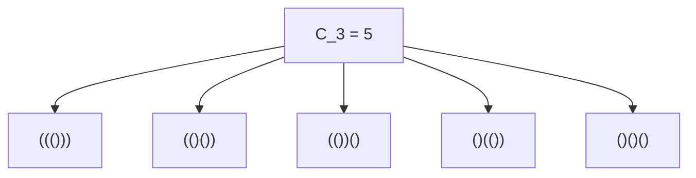
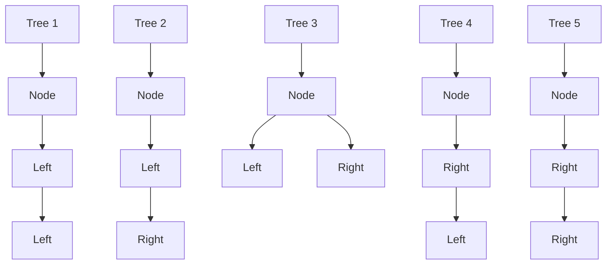
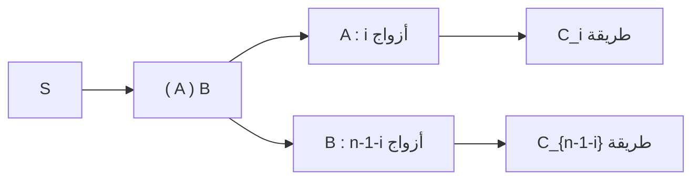

## 1. مقدمة: ما هي [أرقام كاتالان](https://kenji.blog/ar/p/catalan-numbers/)؟

في عالم الرياضيات وعلوم الكمبيوتر، غالبًا ما نرى ظاهرة جميلة حيث تشترك العديد من المشكلات التي تبدو مختلفة تمامًا في نفس البنية الأساسية. أحد الأمثلة البارزة هو **[أرقام كاتالان](https://kenji.blog/ar/p/catalan-numbers/)** (Catalan numbers).

سميت هذه السلسلة على اسم عالم الرياضيات البلجيكي أوجين تشارلز كاتالان، وتبدأ على النحو التالي:

$$ C_0 = 1, \quad C_1 = 1, \quad C_2 = 2, \quad C_3 = 5, \quad C_4 = 14, \quad C_5 = 42, \quad C_6 = 132, \quad C_7 = 429, \quad \dots $$

تظهر هذه السلسلة كحل لمجموعة متنوعة بشكل مذهل من المشاكل التوافقية. في هذه المقالة، سنقدم أربعة أمثلة شهيرة تتضمن [أرقام كاتالان](https://kenji.blog/ar/p/catalan-numbers/) (الأقواس الصحيحة، الأشجار الثنائية، تثليث المضلعات، ومسارات دايك). سنكشف عن البنية العودية التي تقف وراءها لنفهم لماذا تتوافق جميعها مع نفس السلسلة تمامًا. علاوة على ذلك، سوف نتعمق في الخوارزميات الحسابية باستخدام البرمجة الديناميكية ([DP](https://kenji.blog/ar/p/dynamic-programming-dp-introduction-knapsack-fibonacci/)) والاشتقاقات الرياضية عبر [الدوال المولدة](https://kenji.blog/ar/p/generating-functions/).

## 2. أربعة أمثلة ملموسة ل[أرقام كاتالان](https://kenji.blog/ar/p/catalan-numbers/)

### المثال 1: الأقواس الصحيحة (Valid Parentheses)

في البرمجة، يعد التأكد من مطابقة الأقواس بشكل صحيح أمرًا بالغ الأهمية. إن عدد "سلاسل الأقواس الصحيحة" التي يمكنك تكوينها باستخدام $n$ من أزواج الأقواس `()` هو بالضبط رقم كاتالان $C_n$.

سلسلة الأقواس الصحيحة هي السلسلة التي، عند قراءتها من اليسار إلى اليمين، لا يتجاوز فيها عدد الأقواس المغلقة `)` عدد الأقواس المفتوحة `(` في أي وقت.

دعونا نلقي نظرة على الحالة عندما $n = 3$. هناك 5 طرق صحيحة لترتيب 3 أزواج من الأقواس. هذا يتطابق تمامًا مع $C_3 = 5$.



### المثال 2: هياكل الأشجار الثنائية (Binary Trees)

بعد ذلك، فكر في الأشجار الثنائية، وهي بنية بيانات مألوفة جدًا. عدد الأشكال الممكنة لشجرة ثنائية تحتوي على $n$ من العقد الداخلية هو أيضًا رقم كاتالان $C_n$.

بالنسبة إلى $n = 3$، هناك 5 أشكال مختلفة للأشجار الثنائية. يتم تمييزها بناءً على ما إذا كانت العقد مرتبطة بالشجرة الفرعية اليسرى أو اليمنى.



### المثال 3: تثليث المضلعات (Polygon Triangulation)

تظهر [أرقام كاتالان](https://kenji.blog/ar/p/catalan-numbers/) أيضًا في الهندسة. إن عدد الطرق لتقسيم مضلع محدب مكون من $(n+2)$ ضلعًا إلى $n$ من المثلثات عن طريق رسم أقطار لا تتقاطع بين الرؤوس هو بالضبط $C_n$.

على سبيل المثال، عندما $n = 3$، فإننا نأخذ في الاعتبار طرق تثليث خماسي الأضلاع ($3+2=5$). توجد 5 طرق بالضبط لرسم الأقطار لتكوين 3 مثلثات. مرة أخرى، نرى الرقم $C_3 = 5$.

### المثال 4: مسارات دايك (Dyck Paths)

تظهر [أرقام كاتالان](https://kenji.blog/ar/p/catalan-numbers/) في مشاكل مسارات الشبكة أيضًا. في شبكة بحجم $n \times n$، ضع في اعتبارك أقصر المسارات من الزاوية اليسرى السفلية $(0, 0)$ إلى الزاوية اليمنى العليا $(n, n)$ بالتحرك فقط لليمين أو لأعلى بمقدار وحدة واحدة في كل مرة. إن عدد هذه المسارات التي لا تعبر الخط القطري $y = x$ أبدًا (مما يعني أنها تلبي دائمًا الشرط $y \le x$) هو $C_n$. تُسمى هذه **مسارات دايك**.

إذا أشرنا إلى الحركة لليمين بالرمز `R` والحركة لأعلى بالرمز `U`، فإن الشرط يتطلب أنه في أي بادئة (prefix) للمسار، يجب ألا يتجاوز عدد `U` عدد `R` أبدًا. هذا يعادل تمامًا العلاقة بين `(` و `)` في سلاسل الأقواس الصحيحة.

## 3. لماذا هم متماثلون؟ (البنية الأساسية)

لماذا تؤدي كل هذه المشكلات التي تبدو غير مرتبطة ببعضها إلى نفس سلسلة كاتالان؟ تكمن الإجابة في حقيقة أنها تشترك جميعها في **نفس البنية العودية الدقيقة**.

يتم تعريف رقم كاتالان $C_n$ من خلال علاقة التكرار التالية:

$$ C_0 = 1 $$
$$ C_{n} = \sum_{i=0}^{n-1} C_i C_{n-1-i} \quad (n \ge 1) $$

دعونا نفهم بشكل حدسي كيفية اشتقاق علاقة التكرار هذه باستخدام "الأقواس الصحيحة" كمثال.

ضع في اعتبارك سلسلة أقواس صحيحة عشوائية $S$ بطول $2n$. يجب أن تبدأ $S$ بقوس مفتوح `(`. ويجب أن يوجد قوس مغلق مطابق له `)` بالضبط في مكان ما في السلسلة.
بالتركيز على هذا الزوج المطابق المحدد، يمكن تحليل السلسلة $S$ بشكل فريد إلى الشكل التالي:

$$ S = ( A ) B $$

هنا، $A$ و $B$ هما في حد ذاتهما سلاسل أقواس صحيحة (يمكن أن تكون سلاسل فارغة).
افترض أن السلسلة الفرعية $A$، التي تقع بين القوس المفتوح `(` الأولي وقوسه المغلق `)` المطابق، تحتوي على $i$ من أزواج الأقواس $(0 \le i \le n-1)$.
نظرًا لأن السلسلة الكلية تحتوي على $n$ زوجًا، وتم استهلاك زوج واحد بواسطة الأقواس الخارجية `( )`، فإن السلسلة الفرعية المتبقية $B$ يجب أن تحتوي على $(n - 1 - i)$ زوجًا.

- عدد طرق تكوين $A$ هو $C_i$ طريقة
- عدد طرق تكوين $B$ هو $C_{n-1-i}$ طريقة

لذلك، بالنسبة لقيمة ثابتة لـ $i$، فإن عدد السلاسل الممكنة هو $C_i \times C_{n-1-i}$. وبما أن $i$ يمكن أن يأخذ أي قيمة من $0$ إلى $n-1$، فإن جمع كل هذه الاحتمالات يعطينا $C_n$. هذا هو معنى علاقة التكرار.



يعمل نفس التحليل الدقيق بالنسبة لـ "الأشجار الثنائية". إذا حددنا عقدة كجذر وخصصنا $i$ من العقد للشجرة الفرعية اليسرى، فيجب أن تأخذ الشجرة الفرعية اليمنى العقد المتبقية التي يبلغ عددها $n-1-i$. وهذا ينتج نفس علاقة التكرار المتطابقة.

## 4. الاشتقاق الرياضي للصيغة المغلقة

يمكن التعبير عن [أرقام كاتالان](https://kenji.blog/ar/p/catalan-numbers/) بصيغة رياضية مغلقة بسيطة جدًا (Closed-form formula) باستخدام الترميز التوافقي:

$$ C_n = \frac{1}{n+1} \binom{2n}{n} = \frac{(2n)!}{(n+1)!n!} $$

كيف يتم اشتقاق هذه الصيغة الأنيقة؟ دعونا نستكشف نهجين رئيسيين.

### 4.1. الإثبات بمبدأ الانعكاس (Reflection Principle)

يمكننا إثبات هذه الصيغة باستخدام مسارات دايك.
إجمالي عدد أقصر المسارات من $(0,0)$ إلى $(n,n)$ هو $\binom{2n}{n}$، لأنه من بين إجمالي $2n$ خطوة، يجب أن نختار $n$ خطوات للتحرك يمينًا.

من هذا، يجب أن نطرح المسارات التي تنتهك الشرط (أي تلك التي تعبر الخط $y = x$ وتلامس الخط $y = x + 1$).
لتكن $P$ هي النقطة الأولى التي يلامس فيها مسار مخالف الخط $y = x + 1$. نقوم بعكس جزء المسار من النقطة $P$ إلى نقطة النهاية $(n,n)$ عبر الخط $y = x + 1$.
تنعكس نقطة النهاية الأصلية $(n,n)$ إلى نقطة نهاية جديدة عند $(n-1, n+1)$.

بشكل ملحوظ، يوجد تطابق تام (تقابل) بين "المسارات غير الصالحة من $(0,0)$ إلى $(n,n)$" و "جميع المسارات من $(0,0)$ إلى $(n-1, n+1)$".
إجمالي عدد المسارات من $(0,0)$ إلى $(n-1, n+1)$ هو $\binom{2n}{n-1}$.

ولذلك فإن عدد المسارات الصالحة هو:

$$ C_n = \binom{2n}{n} - \binom{2n}{n-1} $$

يمكننا تبسيط ذلك جبرياً:

$$ C_n = \binom{2n}{n} - \frac{n}{n+1} \binom{2n}{n} = \left( 1 - \frac{n}{n+1} \right) \binom{2n}{n} = \frac{1}{n+1} \binom{2n}{n} $$

### 4.2. نهج [الدوال المولدة](https://kenji.blog/ar/p/generating-functions/) ([Generating Functions](https://kenji.blog/ar/p/generating-functions/))

لتكن الدالة المولدة ل[أرقام كاتالان](https://kenji.blog/ar/p/catalan-numbers/) هي $C(x) = \sum_{n=0}^\infty C_n x^n$.
باستخدام علاقة التكرار $C_{n} = \sum_{i=0}^{n-1} C_i C_{n-1-i}$، نجد أن الدالة المولدة تحقق المعادلة التالية:

$$ C(x) = 1 + x [C(x)]^2 $$

يمكن اعتبار هذا كمعادلة تربيعية بدلالة $C(x)$: $x [C(x)]^2 - C(x) + 1 = 0$. بتطبيق القانون العام للمعادلة التربيعية، نحصل على:

$$ C(x) = \frac{1 \pm \sqrt{1 - 4x}}{2x} $$

لتلبية الشرط $C(0) = 1$ عندما يقترب $x \to 0$، يجب أن نختار الإشارة السالبة.

$$ C(x) = \frac{1 - \sqrt{1 - 4x}}{2x} $$

عن طريق فك $\sqrt{1 - 4x} = (1 - 4x)^{1/2}$ باستخدام نظرية ذات الحدين المعممة (متسلسلة تايلور) ومقارنة المعاملات، نصل إلى $C_n = \frac{1}{n+1} \binom{2n}{n}$.

## 5. الخوارزميات الحسابية ل[أرقام كاتالان](https://kenji.blog/ar/p/catalan-numbers/)

عند حساب [أرقام كاتالان](https://kenji.blog/ar/p/catalan-numbers/) برمجيًا، توجد ثلاثة مناهج أساسية.

### 5.1. العودية البسيطة (Naive Recursion)

يتضمن هذا التنفيذ المباشر لعلاقة التكرار. ومع ذلك، نظرًا لأنه يعيد حساب نفس القيم بشكل متكرر، فإن التعقيد الزمني ينمو بشكل أسي، مما يجعله غير مناسب لقيم $n$ الكبيرة.

```python
def catalan_recursive(n):
    # حالة الأساس
    if n <= 1:
        return 1
    
    res = 0
    for i in range(n):
        res += catalan_recursive(i) * catalan_recursive(n - 1 - i)
    return res
```

### 5.2. البرمجة الديناميكية ([Dynamic Programming](https://kenji.blog/ar/p/dynamic-programming-dp-introduction-knapsack-fibonacci/))

من خلال الاستفادة من الحفظ الذكي (Memoization) أو البرمجة الديناميكية من أسفل إلى أعلى لتخزين النتائج المحسوبة في مصفوفة، يمكننا تقليل التعقيد الزمني إلى $O(n^2)$.

```python
def catalan_dp(n):
    # تهيئة جدول DP. C_0 = 1
    dp = [0] * (n + 1)
    dp[0] = 1
    
    # حساب مبني على علاقة التكرار
    for i in range(1, n + 1):
        for j in range(i):
            dp[i] += dp[j] * dp[i - 1 - j]
            
    return dp[n]

# اختبار
for i in range(7):
    print(f"C_{i} =", catalan_dp(i))
```

### 5.3. الصيغة المغلقة (Closed-Form Formula)

باستخدام الصيغة المغلقة، يمكننا حساب القيمة بتعقيد زمني $O(n)$ ببساطة عن طريق إجراء حسابات المضروب.

```python
import math

def catalan_formula(n):
    # C_n = (2n)! / ((n+1)! * n!)
    return math.comb(2 * n, n) // (n + 1)

# اختبار
for i in range(7):
    print(f"C_{i} =", catalan_formula(i))
```

## 6. الخاتمة

سلسلة [أرقام كاتالان](https://kenji.blog/ar/p/catalan-numbers/) $C_n$ هي سلسلة آسرة تظهر بشكل موحد في مجموعة كبيرة من المشكلات التي تبدو مختلفة، مثل سلاسل الأقواس الصحيحة، وأشكال الأشجار الثنائية، وتثليث المضلعات، ومسارات دايك. السبب في أن هذه المشكلات تسفر عن نفس العدد هو أنها جميعًا تجسد بنية عودية مشتركة: **"تقسيم الكل إلى مشكلتين فرعيتين ثم دمجهما"**.

عند دراسة الخوارزميات وهياكل البيانات، فإن فهم هذه الخلفيات الرياضية ينمي القدرة على رؤية جوهر المشكلة. كما أنه يمثل تمرينًا ممتازًا في البرمجة الديناميكية، لذا تأكد من تجربة كتابة الكود وتجربته بنفسك!
