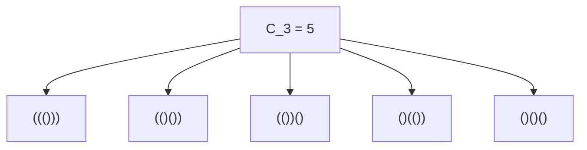
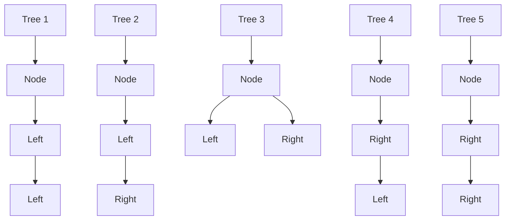
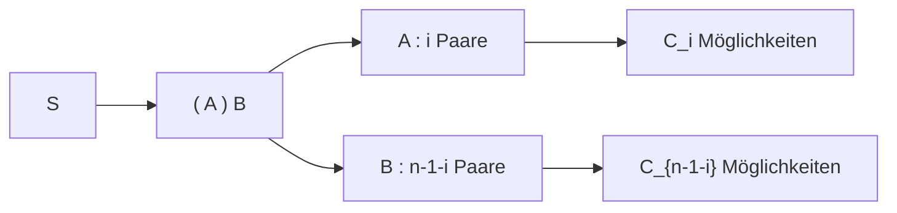

## 1. Einführung: Was sind [Catalan-Zahlen](https://kenji.blog/de/p/catalan-numbers/)?

In der Welt der Mathematik und Informatik beobachten wir oft ein wunderschönes Phänomen, bei dem mehrere scheinbar unterschiedliche Probleme in Wirklichkeit genau dieselbe zugrunde liegende Struktur teilen. Ein prominentes Beispiel dafür sind die **[Catalan-Zahlen](https://kenji.blog/de/p/catalan-numbers/)**.

Benannt nach dem belgischen Mathematiker Eugène Charles Catalan, beginnt die Catalan-Folge wie folgt:

$$ C_0 = 1, \quad C_1 = 1, \quad C_2 = 2, \quad C_3 = 5, \quad C_4 = 14, \quad C_5 = 42, \quad C_6 = 132, \quad C_7 = 429, \quad \dots $$

Diese Folge taucht als Lösung für eine erstaunlich vielfältige Reihe von kombinatorischen Problemen auf. In diesem Artikel werden wir vier berühmte Beispiele vorstellen, bei denen [Catalan-Zahlen](https://kenji.blog/de/p/catalan-numbers/) eine Rolle spielen (gültige Klammern, Binärbäume, Polygon-Triangulierung und Dyck-Pfade). Wir werden die rekursive Struktur dahinter entschlüsseln, um zu verstehen, warum sie alle exakt auf dieselbe Folge abgebildet werden. Darüber hinaus werden wir uns mit Berechnungsalgorithmen unter Verwendung der dynamischen Programmierung ([DP](https://kenji.blog/de/p/dynamic-programming-dp-introduction-knapsack-fibonacci/)) und mathematischen Herleitungen mittels erzeugender Funktionen befassen.

## 2. Vier konkrete Beispiele für [Catalan-Zahlen](https://kenji.blog/de/p/catalan-numbers/)

### Beispiel 1: Gültige Klammern

Beim Programmieren ist es entscheidend sicherzustellen, dass Klammern korrekt zugeordnet sind. Die Anzahl der "gültigen Klammerausdrücke", die man mit $n$ Klammerpaaren `()` bilden kann, entspricht genau der Catalan-Zahl $C_n$.

Ein gültiger Klammerausdruck ist ein solcher, bei dem – von links nach rechts gelesen – die Anzahl der schließenden Klammern `)` zu keinem Zeitpunkt die Anzahl der öffnenden Klammern `(` überschreitet.

Betrachten wir den Fall für $n = 3$. Es gibt 5 gültige Möglichkeiten, 3 Klammerpaare anzuordnen. Dies stimmt perfekt mit $C_3 = 5$ überein.



### Beispiel 2: Binärbaum-Strukturen

Als Nächstes betrachten wir Binärbäume, eine sehr vertraute Datenstruktur. Die Anzahl der möglichen Formen für einen Binärbaum mit $n$ internen Knoten ist ebenfalls die Catalan-Zahl $C_n$.

Für $n = 3$ gibt es 5 verschiedene Binärbaum-Formen. Sie unterscheiden sich dadurch, ob die Knoten an den linken oder rechten Teilbaum angehängt sind.



### Beispiel 3: Polygon-Triangulierung

[Catalan-Zahlen](https://kenji.blog/de/p/catalan-numbers/) tauchen auch in der Geometrie auf. Die Anzahl der Möglichkeiten, ein konvexes $(n+2)$-Eck durch das Ziehen sich nicht schneidender Diagonalen zwischen den Eckpunkten in $n$ Dreiecke zu unterteilen, beträgt genau $C_n$.

Wenn wir zum Beispiel $n = 3$ haben, betrachten wir die Möglichkeiten, ein Fünfeck ($3+2=5$) zu triangulieren. Es gibt exakt 5 Möglichkeiten, Diagonalen zu ziehen, um 3 Dreiecke zu bilden. Einmal mehr sehen wir die Zahl $C_3 = 5$.

### Beispiel 4: Dyck-Pfade

[Catalan-Zahlen](https://kenji.blog/de/p/catalan-numbers/) kommen auch bei Gitterpfad-Problemen vor. Betrachten Sie auf einem $n \times n$-Gitter die kürzesten Pfade von der unteren linken Ecke $(0, 0)$ zur oberen rechten Ecke $(n, n)$, bei denen man sich jeweils nur um eine Einheit nach rechts oder nach oben bewegen darf. Die Anzahl solcher Pfade, die niemals über die Diagonale $y = x$ hinausgehen (was bedeutet, dass sie immer $y \le x$ erfüllen), ist $C_n$. Diese werden **Dyck-Pfade** genannt.

Wenn wir eine Bewegung nach rechts als `R` und eine Bewegung nach oben als `U` bezeichnen, verlangt die Bedingung, dass in jedem Präfix des Pfades die Anzahl der `U` niemals die Anzahl der `R` übersteigt. Dies ist streng äquivalent zur Beziehung zwischen `(` und `)` in gültigen Klammerausdrücken.

## 3. Warum sind sie gleich? (Die zugrunde liegende Struktur)

Warum ergeben diese scheinbar unzusammenhängenden Probleme alle dieselbe Catalan-Folge? Die Antwort liegt in der Tatsache, dass sie alle **exakt dieselbe rekursive Struktur** teilen.

Die Catalan-Zahl $C_n$ ist durch die folgende Rekursionsgleichung definiert:

$$ C_0 = 1 $$
$$ C_{n} = \sum_{i=0}^{n-1} C_i C_{n-1-i} \quad (n \ge 1) $$

Lassen Sie uns intuitiv verstehen, wie diese Rekursionsgleichung hergeleitet wird, indem wir "gültige Klammern" als Beispiel verwenden.

Betrachten Sie einen beliebigen gültigen Klammerausdruck $S$ der Länge $2n$. $S$ muss mit einer öffnenden Klammer `(` beginnen. Irgendwo in der Zeichenfolge muss genau eine dazu passende schließende Klammer `)` existieren.
Wenn wir uns auf dieses spezifische zusammenpassende Paar konzentrieren, kann die Zeichenfolge $S$ eindeutig in die folgende Form zerlegt werden:

$$ S = ( A ) B $$

Hierbei sind $A$ und $B$ selbst gültige Klammerausdrücke (sie können leere Strings sein).
Angenommen, der Teilstring $A$, der sich zwischen der anfänglichen `(` und ihrer passenden `)` befindet, enthält $i$ Klammerpaare $(0 \le i \le n-1)$.
Da der gesamte String $n$ Paare hat und 1 Paar von den äußeren `( )` verbraucht wird, muss der verbleibende Teilstring $B$ $(n - 1 - i)$ Paare enthalten.

- Die Anzahl der Möglichkeiten, $A$ zu bilden, ist $C_i$
- Die Anzahl der Möglichkeiten, $B$ zu bilden, ist $C_{n-1-i}$

Daher ist für einen festen Wert von $i$ die Anzahl der möglichen Zeichenfolgen $C_i \times C_{n-1-i}$. Da $i$ jeden Wert von $0$ bis $n-1$ annehmen kann, ergibt die Summe all dieser Möglichkeiten $C_n$. Das ist die Bedeutung der Rekursionsgleichung.



Die exakt gleiche Zerlegung funktioniert auch für "Binärbäume". Wenn wir einen Knoten als Wurzel bestimmen und dem linken Teilbaum $i$ Knoten zuweisen, muss der rechte Teilbaum die restlichen $n-1-i$ Knoten aufnehmen. Dies führt zu derselben identischen Rekursionsgleichung.

## 4. Mathematische Herleitung der geschlossenen Formel

[Catalan-Zahlen](https://kenji.blog/de/p/catalan-numbers/) können durch eine sehr einfache **geschlossene Formel** (Closed-form formula) unter Verwendung kombinatorischer Notation ausgedrückt werden:

$$ C_n = \frac{1}{n+1} \binom{2n}{n} = \frac{(2n)!}{(n+1)!n!} $$

Wie wird diese elegante Formel hergeleitet? Lassen Sie uns zwei Hauptansätze untersuchen.

### 4.1. Beweis durch das Reflexionsprinzip

Wir können diese Formel mit Hilfe von Dyck-Pfaden beweisen.
Die Gesamtzahl der kürzesten Pfade von $(0,0)$ nach $(n,n)$ ist $\binom{2n}{n}$, weil wir aus insgesamt $2n$ Schritten $n$ Schritte auswählen müssen, um uns nach rechts zu bewegen.

Davon müssen wir die Pfade abziehen, die die Bedingung verletzen (d.h. solche, die die Gerade $y = x$ überqueren und die Gerade $y = x + 1$ berühren).
Sei $P$ der erste Punkt, an dem ein verletzender Pfad $y = x + 1$ berührt. Wir spiegeln den Teil des Pfades vom Punkt $P$ bis zum Endpunkt $(n,n)$ an der Geraden $y = x + 1$.
Der ursprüngliche Endpunkt $(n,n)$ wird auf einen neuen Endpunkt bei $(n-1, n+1)$ gespiegelt.

Bemerkenswerterweise gibt es eine perfekte Eins-zu-Eins-Entsprechung (Bijektion) zwischen "ungültigen Pfaden von $(0,0)$ nach $(n,n)$" und "ALLEN Pfaden von $(0,0)$ nach $(n-1, n+1)$".
Die Gesamtzahl der Pfade von $(0,0)$ nach $(n-1, n+1)$ ist $\binom{2n}{n-1}$.

Daher ist die Anzahl der gültigen Pfade:

$$ C_n = \binom{2n}{n} - \binom{2n}{n-1} $$

Wir können dies algebraisch vereinfachen:

$$ C_n = \binom{2n}{n} - \frac{n}{n+1} \binom{2n}{n} = \left( 1 - \frac{n}{n+1} \right) \binom{2n}{n} = \frac{1}{n+1} \binom{2n}{n} $$

### 4.2. Ansatz über erzeugende Funktionen

Sei die erzeugende Funktion für [Catalan-Zahlen](https://kenji.blog/de/p/catalan-numbers/) $C(x) = \sum_{n=0}^\infty C_n x^n$.
Unter Verwendung der Rekursionsgleichung $C_{n} = \sum_{i=0}^{n-1} C_i C_{n-1-i}$ stellen wir fest, dass die erzeugende Funktion die folgende Gleichung erfüllt:

$$ C(x) = 1 + x [C(x)]^2 $$

Dies kann als eine quadratische Gleichung in Bezug auf $C(x)$ betrachtet werden: $x [C(x)]^2 - C(x) + 1 = 0$. Durch Anwendung der Mitternachtsformel erhalten wir:

$$ C(x) = \frac{1 \pm \sqrt{1 - 4x}}{2x} $$

Um die Bedingung $C(0) = 1$ für $x \to 0$ zu erfüllen, müssen wir das negative Vorzeichen wählen.

$$ C(x) = \frac{1 - \sqrt{1 - 4x}}{2x} $$

Indem wir $\sqrt{1 - 4x} = (1 - 4x)^{1/2}$ unter Verwendung des verallgemeinerten binomischen Lehrsatzes (Taylorreihe) entwickeln und die Koeffizienten vergleichen, gelangen wir zu $C_n = \frac{1}{n+1} \binom{2n}{n}$.

## 5. Berechnungsalgorithmen für [Catalan-Zahlen](https://kenji.blog/de/p/catalan-numbers/)

Für die programmgesteuerte Berechnung von [Catalan-Zahlen](https://kenji.blog/de/p/catalan-numbers/) gibt es hauptsächlich drei Ansätze.

### 5.1. Einfache Rekursion (Naive Recursion)

Dies beinhaltet die direkte Implementierung der Rekursionsgleichung. Da hierbei jedoch dieselben Werte wiederholt berechnet werden, wächst die Zeitkomplexität exponentiell an, was diesen Ansatz für ein großes $n$ ungeeignet macht.

```python
def catalan_recursive(n):
    # Basisfall
    if n <= 1:
        return 1
    
    res = 0
    for i in range(n):
        res += catalan_recursive(i) * catalan_recursive(n - 1 - i)
    return res
```

### 5.2. Dynamische Programmierung

Durch die Nutzung von Memoisation (oder Bottom-up dynamischer Programmierung), um berechnete Ergebnisse in einem Array zu speichern, können wir die Zeitkomplexität auf $O(n^2)$ reduzieren.

```python
def catalan_dp(n):
    # DP-Tabelle initialisieren. C_0 = 1
    dp = [0] * (n + 1)
    dp[0] = 1
    
    # Berechnung basierend auf der Rekursionsgleichung
    for i in range(1, n + 1):
        for j in range(i):
            dp[i] += dp[j] * dp[i - 1 - j]
            
    return dp[n]

# Test
for i in range(7):
    print(f"C_{i} =", catalan_dp(i))
```

### 5.3. Geschlossene Formel

Mit der Formel können wir den Wert in $O(n)$ Zeitkomplexität berechnen, indem wir lediglich Fakultätsberechnungen durchführen.

```python
import math

def catalan_formula(n):
    # C_n = (2n)! / ((n+1)! * n!)
    return math.comb(2 * n, n) // (n + 1)

# Test
for i in range(7):
    print(f"C_{i} =", catalan_formula(i))
```

## 6. Fazit

Die [Catalan-Zahlen](https://kenji.blog/de/p/catalan-numbers/)folge $C_n$ ist eine fesselnde Zahlenfolge, die einheitlich in einer Vielzahl scheinbar unterschiedlicher Probleme auftaucht, wie z.B. bei gültigen Klammerausdrücken, Formen von Binärbäumen, Polygon-Triangulierungen und Dyck-Pfaden. Der Grund, warum diese Probleme zum selben Ergebnis führen, ist, dass sie alle eine gemeinsame rekursive Struktur verkörpern: **"Das Ganze in zwei Teilprobleme zerlegen und diese kombinieren"**.

Beim Studium von Algorithmen und Datenstrukturen fördert das Verständnis dieser mathematischen Hintergründe die Fähigkeit, das Wesen eines Problems zu durchschauen. Es dient auch als hervorragende Übung in dynamischer Programmierung. Probieren Sie also unbedingt aus, den Code selbst zu schreiben und damit zu experimentieren!
