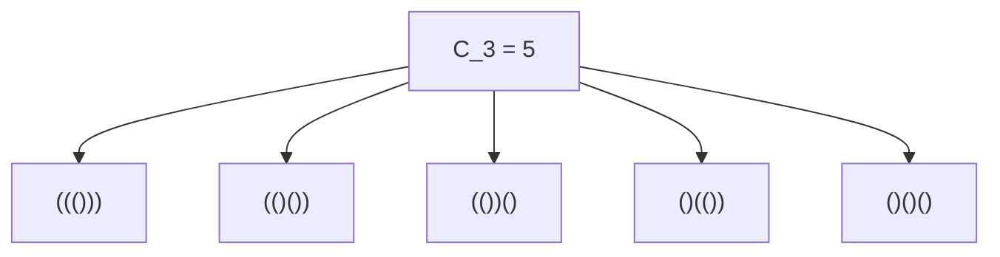
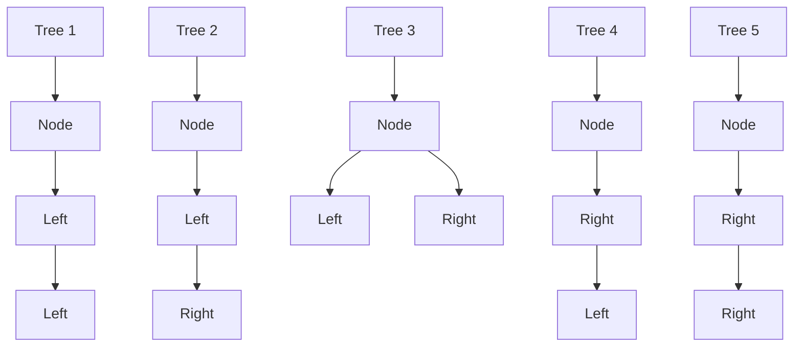
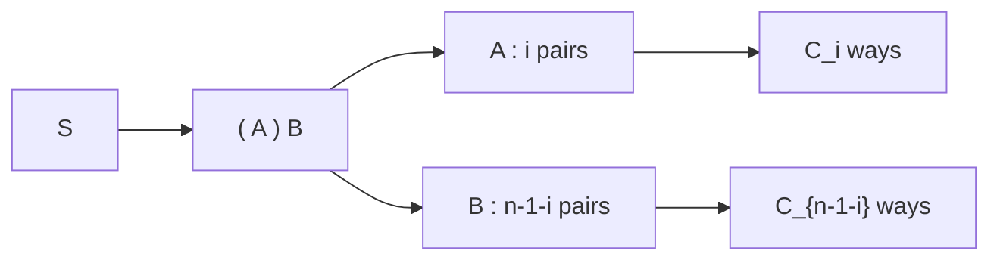

## 1. Introduction: What are [Catalan Numbers](https://kenji.blog/en/p/catalan-numbers/)?

In the worlds of mathematics and computer science, we often see a beautiful phenomenon where multiple seemingly distinct problems actually share the exact same underlying structure. One prominent example is the **Catalan numbers**.

Named after the Belgian mathematician Eugène Charles Catalan, the Catalan sequence begins as follows:

$$ C_0 = 1, \quad C_1 = 1, \quad C_2 = 2, \quad C_3 = 5, \quad C_4 = 14, \quad C_5 = 42, \quad C_6 = 132, \quad C_7 = 429, \quad \dots $$

This sequence appears as the solution to a surprisingly diverse array of combinatorial problems. In this article, we will introduce four famous examples involving Catalan numbers (valid parentheses, binary trees, polygon triangulation, and Dyck paths). We will unravel the recursive structure behind them to understand why they map to the exact same sequence. Furthermore, we will delve into computational algorithms using [Dynamic Programming](https://kenji.blog/en/p/dynamic-programming-dp-introduction-knapsack-fibonacci/) ([DP](https://kenji.blog/en/p/dynamic-programming-dp-introduction-knapsack-fibonacci/)) and mathematical derivations using generating functions.

## 2. Four Concrete Examples of [Catalan Numbers](https://kenji.blog/en/p/catalan-numbers/)

### Example 1: Valid Parentheses

In programming, ensuring that parentheses are correctly matched is crucial. The number of "valid parentheses strings" you can form using $n$ pairs of parentheses `()` is exactly the Catalan number $C_n$.

A valid parentheses string is one where, reading from left to right, the count of closing parentheses `)` never exceeds the count of opening parentheses `(` at any point.

Let's look at the case where $n = 3$. There are 5 valid ways to arrange 3 pairs of parentheses. This perfectly matches $C_3 = 5$.



### Example 2: Binary [Tree](https://kenji.blog/en/p/tree-graph-data-structures-search-dfs-bfs-dijkstra/) Structures

Next, consider binary trees, a familiar data structure. The number of possible shapes for a binary tree with $n$ internal nodes is also the Catalan number $C_n$.

For $n = 3$, there are 5 different binary tree shapes. They are distinguished by whether nodes are attached to the left or right subtrees.



### Example 3: Polygon Triangulation

Catalan numbers also appear in geometry. The number of ways to divide a convex $(n+2)$-sided polygon into $n$ triangles by drawing non-intersecting diagonals between vertices is exactly $C_n$.

For example, when $n = 3$, we consider ways to triangulate a pentagon ($3+2=5$). There are exactly 5 ways to draw diagonals to form 3 triangles. Once again, we see the number $C_3 = 5$.

### Example 4: Dyck Paths

Catalan numbers emerge in grid path problems as well. On an $n \times n$ grid, consider the shortest paths from the bottom-left $(0, 0)$ to the top-right $(n, n)$ moving only right or up by one unit at a time. The number of such paths that never cross above the diagonal $y = x$ (meaning they always satisfy $y \le x$) is $C_n$. These are called **Dyck paths**.

If we denote moving right as `R` and moving up as `U`, the condition requires that in any prefix of the path, the number of `U`s never exceeds the number of `R`s. This is strictly equivalent to the relationship between `(` and `)` in valid parentheses strings.

## 3. Why Are They the Same? (The Underlying Structure)

Why do these seemingly unrelated problems all yield the same Catalan sequence? The answer lies in the fact that they all share the **exact same recursive structure**.

The Catalan number $C_n$ is defined by the following recurrence relation:

$$ C_0 = 1 $$
$$ C_{n} = \sum_{i=0}^{n-1} C_i C_{n-1-i} \quad (n \ge 1) $$

Let's intuitively understand how this recurrence relation is derived by using "valid parentheses" as an example.

Consider an arbitrary valid parentheses string $S$ of length $2n$. $S$ must begin with an opening parenthesis `(`. There must exist exactly one matching closing parenthesis `)` somewhere in the string.
Focusing on this specific matching pair, the string $S$ can be uniquely decomposed into the following form:

$$ S = ( A ) B $$

Here, $A$ and $B$ are themselves valid parentheses strings (they can be empty).
Suppose the substring $A$, which lies between the initial `(` and its matching `)`, contains $i$ pairs of parentheses $(0 \le i \le n-1)$.
Since the total string has $n$ pairs, and 1 pair is consumed by the outer `( )`, the remaining substring $B$ must contain $(n - 1 - i)$ pairs.

- The number of ways to form $A$ is $C_i$
- The number of ways to form $B$ is $C_{n-1-i}$

Therefore, for a fixed value of $i$, the number of possible strings is $C_i \times C_{n-1-i}$. Since $i$ can take any value from $0$ to $n-1$, summing all these possibilities gives $C_n$. This is the meaning of the recurrence relation.



The exact same decomposition works for "Binary Trees". If we designate a node as the root and assign $i$ nodes to the left subtree, the right subtree must take the remaining $n-1-i$ nodes. This yields the identical recurrence relation.

## 4. Mathematical Derivation of the Closed-Form Formula

Catalan numbers can be expressed by a very simple **closed-form formula** using combinatorics notation:

$$ C_n = \frac{1}{n+1} \binom{2n}{n} = \frac{(2n)!}{(n+1)!n!} $$

How is this elegant formula derived? Let's explore two primary approaches.

### 4.1. Proof by Reflection Principle

We can prove this formula using Dyck paths.
The total number of shortest paths from $(0,0)$ to $(n,n)$ is $\binom{2n}{n}$, because out of $2n$ total steps, we must choose $n$ steps to move right.

From this, we must subtract the paths that violate the condition (i.e., those that cross the line $y = x$ and touch the line $y = x + 1$).
Let $P$ be the first point where a violating path touches $y = x + 1$. We reflect the portion of the path from point $P$ to the endpoint $(n,n)$ across the line $y = x + 1$.
The original endpoint $(n,n)$ reflects to a new endpoint at $(n-1, n+1)$.

Remarkably, there is a perfect one-to-one correspondence between "invalid paths from $(0,0)$ to $(n,n)$" and "ALL paths from $(0,0)$ to $(n-1, n+1)$".
The total number of paths from $(0,0)$ to $(n-1, n+1)$ is $\binom{2n}{n-1}$.

Therefore, the number of valid paths is:

$$ C_n = \binom{2n}{n} - \binom{2n}{n-1} $$

We can algebraically simplify this:

$$ C_n = \binom{2n}{n} - \frac{n}{n+1} \binom{2n}{n} = \left( 1 - \frac{n}{n+1} \right) \binom{2n}{n} = \frac{1}{n+1} \binom{2n}{n} $$

### 4.2. Approach via [Generating Functions](https://kenji.blog/en/p/generating-functions/)

Let the generating function for Catalan numbers be $C(x) = \sum_{n=0}^\infty C_n x^n$.
Using the recurrence relation $C_{n} = \sum_{i=0}^{n-1} C_i C_{n-1-i}$, we find that the generating function satisfies the following equation:

$$ C(x) = 1 + x [C(x)]^2 $$

This can be viewed as a quadratic equation in terms of $C(x)$: $x [C(x)]^2 - C(x) + 1 = 0$. By applying the quadratic formula, we obtain:

$$ C(x) = \frac{1 \pm \sqrt{1 - 4x}}{2x} $$

To satisfy the condition $C(0) = 1$ as $x \to 0$, we must select the negative sign.

$$ C(x) = \frac{1 - \sqrt{1 - 4x}}{2x} $$

By expanding $\sqrt{1 - 4x} = (1 - 4x)^{1/2}$ using the generalized binomial theorem (Taylor series) and comparing coefficients, we arrive at $C_n = \frac{1}{n+1} \binom{2n}{n}$.

## 5. Computational Algorithms for [Catalan Numbers](https://kenji.blog/en/p/catalan-numbers/)

When computing Catalan numbers programmatically, there are primarily three approaches.

### 5.1. Naive Recursion

This involves directly implementing the recurrence relation. However, because it recalculates the same values repeatedly, the time complexity grows exponentially, making it unsuitable for large $n$.

```python
def catalan_recursive(n):
    # Base case
    if n <= 1:
        return 1
    
    res = 0
    for i in range(n):
        res += catalan_recursive(i) * catalan_recursive(n - 1 - i)
    return res
```

### 5.2. [Dynamic Programming](https://kenji.blog/en/p/dynamic-programming-dp-introduction-knapsack-fibonacci/)

By utilizing memoization (or bottom-up dynamic programming) to store computed results in an array, we can reduce the time complexity to $O(n^2)$.

```python
def catalan_dp(n):
    # Initialize DP table. C_0 = 1
    dp = [0] * (n + 1)
    dp[0] = 1
    
    # Computation based on recurrence relation
    for i in range(1, n + 1):
        for j in range(i):
            dp[i] += dp[j] * dp[i - 1 - j]
            
    return dp[n]

# Test
for i in range(7):
    print(f"C_{i} =", catalan_dp(i))
```

### 5.3. Closed-Form Formula

Using the formula, we can compute the value in $O(n)$ time complexity just by performing factorial calculations.

```python
import math

def catalan_formula(n):
    # C_n = (2n)! / ((n+1)! * n!)
    return math.comb(2 * n, n) // (n + 1)

# Test
for i in range(7):
    print(f"C_{i} =", catalan_formula(i))
```

## 6. Conclusion

The Catalan number sequence $C_n$ is a captivating sequence that appears uniformly across a multitude of seemingly distinct problems, such as valid parentheses strings, binary tree shapes, polygon triangulation, and Dyck paths. The reason these problems yield the same count is that they all embody a common recursive structure: **"splitting the whole into two subproblems and combining them"**.

When studying algorithms and data structures, understanding these mathematical backgrounds cultivates the ability to see through to the essence of a problem. It also serves as an excellent exercise in dynamic programming, so be sure to try writing the code and experimenting with it yourself!
