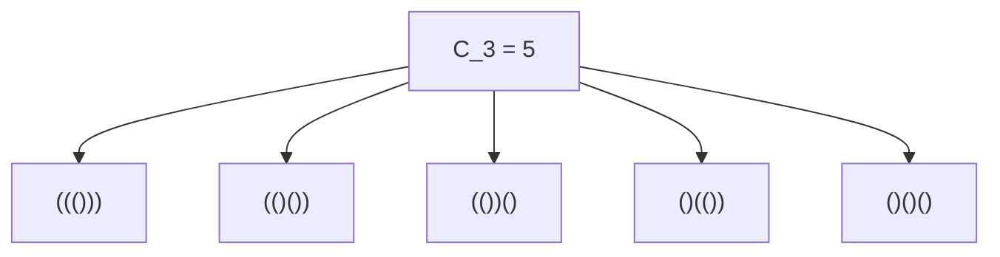
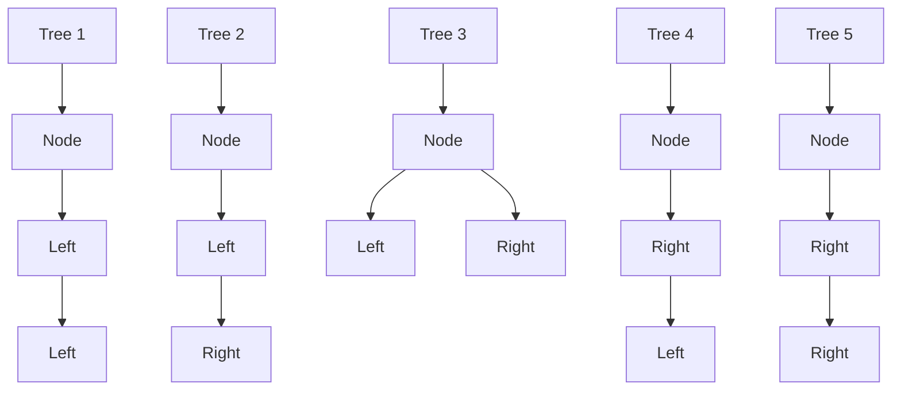
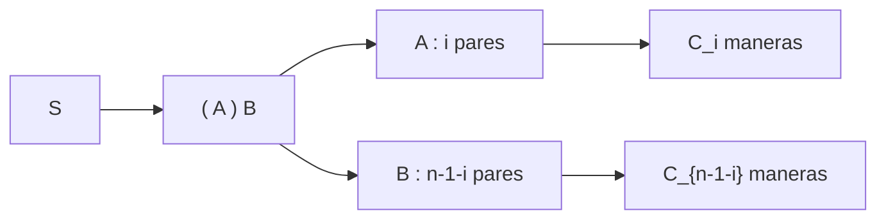

## 1. Introducción: ¿Qué son los números de Catalan?

En el mundo de las matemáticas y la informática, a menudo vemos un hermoso fenómeno en el que múltiples problemas aparentemente distintos comparten en realidad exactamente la misma estructura subyacente. Un ejemplo destacado son los **números de Catalan**.

Nombrada en honor al matemático belga Eugène Charles Catalan, la secuencia de Catalan comienza de la siguiente manera:

$$ C_0 = 1, \quad C_1 = 1, \quad C_2 = 2, \quad C_3 = 5, \quad C_4 = 14, \quad C_5 = 42, \quad C_6 = 132, \quad C_7 = 429, \quad \dots $$

Esta secuencia aparece como solución a una variedad sorprendentemente diversa de problemas combinatorios. En este artículo, presentaremos cuatro ejemplos famosos que involucran los números de Catalan (paréntesis válidos, árboles binarios, triangulación de polígonos y caminos de Dyck). Desentrañaremos la estructura recursiva detrás de ellos para entender por qué todos corresponden exactamente a la misma secuencia. Además, profundizaremos en algoritmos computacionales utilizando Programación Dinámica ([DP](https://kenji.blog/es/p/dynamic-programming-dp-introduction-knapsack-fibonacci/)) y derivaciones matemáticas mediante funciones generadoras.

## 2. Cuatro ejemplos concretos de los números de Catalan

### Ejemplo 1: Paréntesis Válidos

En programación, asegurarse de que los paréntesis estén emparejados correctamente es crucial. El número de "cadenas de paréntesis válidas" que se pueden formar usando $n$ pares de paréntesis `()` es exactamente el número de Catalan $C_n$.

Una cadena de paréntesis válida es aquella en la que, leyendo de izquierda a derecha, la cantidad de paréntesis de cierre `)` nunca excede la cantidad de paréntesis de apertura `(` en ningún momento.

Veamos el caso donde $n = 3$. Hay 5 formas válidas de organizar 3 pares de paréntesis. Esto coincide perfectamente con $C_3 = 5$.



### Ejemplo 2: Estructuras de Árboles Binarios

A continuación, consideremos los árboles binarios, una estructura de datos muy familiar. El número de formas posibles para un árbol binario con $n$ nodos internos también es el número de Catalan $C_n$.

Para $n = 3$, existen 5 formas diferentes de árboles binarios. Se distinguen según si los nodos están unidos al subárbol izquierdo o derecho.



### Ejemplo 3: Triangulación de Polígonos

Los números de Catalan también aparecen en geometría. El número de formas de dividir un polígono convexo de $(n+2)$ lados en $n$ triángulos dibujando diagonales que no se cruzan entre los vértices es exactamente $C_n$.

Por ejemplo, cuando $n = 3$, consideramos formas de triangular un pentágono ($3+2=5$). Hay exactamente 5 formas de dibujar diagonales para formar 3 triángulos. Una vez más, vemos el número $C_3 = 5$.

### Ejemplo 4: Caminos de Dyck

Los números de Catalan también surgen en problemas de trayectorias en cuadrículas. En una cuadrícula de $n \times n$, consideremos los caminos más cortos desde la esquina inferior izquierda $(0, 0)$ hasta la superior derecha $(n, n)$ moviéndonos solo hacia la derecha o hacia arriba una unidad a la vez. El número de tales caminos que nunca cruzan por encima de la diagonal $y = x$ (lo que significa que siempre satisfacen $y \le x$) es $C_n$. A estos se les llama **caminos de Dyck**.

Si denotamos moverse a la derecha como `R` y moverse hacia arriba como `U`, la condición requiere que en cualquier prefijo del camino, el número de `U` nunca exceda el número de `R`. Esto es estrictamente equivalente a la relación entre `(` y `)` en las cadenas de paréntesis válidas.

## 3. ¿Por qué son iguales? (La estructura subyacente)

¿Por qué estos problemas aparentemente no relacionados producen todos la misma secuencia de Catalan? La respuesta radica en el hecho de que todos comparten la **misma estructura recursiva exacta**.

El número de Catalan $C_n$ se define mediante la siguiente relación de recurrencia:

$$ C_0 = 1 $$
$$ C_{n} = \sum_{i=0}^{n-1} C_i C_{n-1-i} \quad (n \ge 1) $$

Entendamos intuitivamente cómo se deriva esta relación de recurrencia usando "paréntesis válidos" como ejemplo.

Consideremos una cadena de paréntesis válida arbitraria $S$ de longitud $2n$. $S$ debe comenzar con un paréntesis de apertura `(`. Debe existir exactamente un paréntesis de cierre coincidente `)` en alguna parte de la cadena.
Centrándonos en este par coincidente específico, la cadena $S$ puede descomponerse de forma única en la siguiente forma:

$$ S = ( A ) B $$

Aquí, $A$ y $B$ son a su vez cadenas de paréntesis válidas (pueden ser cadenas vacías).
Supongamos que la subcadena $A$, que se encuentra entre el `(` inicial y su `)` coincidente, contiene $i$ pares de paréntesis $(0 \le i \le n-1)$.
Dado que la cadena total tiene $n$ pares, y 1 par es consumido por los `( )` externos, la subcadena restante $B$ debe contener $(n - 1 - i)$ pares.

- El número de formas de formar $A$ es $C_i$
- El número de formas de formar $B$ es $C_{n-1-i}$

Por lo tanto, para un valor fijo de $i$, el número de cadenas posibles es $C_i \times C_{n-1-i}$. Puesto que $i$ puede tomar cualquier valor de $0$ a $n-1$, sumar todas estas posibilidades da $C_n$. Este es el significado de la relación de recurrencia.



La misma descomposición exacta funciona para "Árboles Binarios". Si designamos un nodo como raíz y asignamos $i$ nodos al subárbol izquierdo, el subárbol derecho debe tomar los $n-1-i$ nodos restantes. Esto produce la misma relación de recurrencia idéntica.

## 4. Derivación matemática de la fórmula cerrada

Los números de Catalan se pueden expresar mediante una **fórmula cerrada** (Closed-form formula) muy simple utilizando notación combinatoria:

$$ C_n = \frac{1}{n+1} \binom{2n}{n} = \frac{(2n)!}{(n+1)!n!} $$

¿Cómo se deriva esta elegante fórmula? Exploremos dos enfoques principales.

### 4.1. Prueba por el Principio de Reflexión

Podemos probar esta fórmula usando caminos de Dyck.
El número total de caminos más cortos de $(0,0)$ a $(n,n)$ es $\binom{2n}{n}$, porque de $2n$ pasos totales, debemos elegir $n$ pasos para movernos a la derecha.

A esto, debemos restarle los caminos que violan la condición (es decir, aquellos que cruzan la línea $y = x$ y tocan la línea $y = x + 1$).
Sea $P$ el primer punto donde un camino infractor toca $y = x + 1$. Reflejamos la porción del camino desde el punto $P$ hasta el punto final $(n,n)$ a través de la línea $y = x + 1$.
El punto final original $(n,n)$ se refleja a un nuevo punto final en $(n-1, n+1)$.

Sorprendentemente, existe una perfecta correspondencia uno a uno (biyección) entre "caminos inválidos de $(0,0)$ a $(n,n)$" y "TODOS los caminos de $(0,0)$ a $(n-1, n+1)$".
El número total de caminos de $(0,0)$ a $(n-1, n+1)$ es $\binom{2n}{n-1}$.

Por lo tanto, el número de caminos válidos es:

$$ C_n = \binom{2n}{n} - \binom{2n}{n-1} $$

Podemos simplificar esto algebraicamente:

$$ C_n = \binom{2n}{n} - \frac{n}{n+1} \binom{2n}{n} = \left( 1 - \frac{n}{n+1} \right) \binom{2n}{n} = \frac{1}{n+1} \binom{2n}{n} $$

### 4.2. Enfoque mediante Funciones Generadoras

Sea la función generadora para los números de Catalan $C(x) = \sum_{n=0}^\infty C_n x^n$.
Usando la relación de recurrencia $C_{n} = \sum_{i=0}^{n-1} C_i C_{n-1-i}$, encontramos que la función generadora satisface la siguiente ecuación:

$$ C(x) = 1 + x [C(x)]^2 $$

Esto puede verse como una ecuación cuadrática en términos de $C(x)$: $x [C(x)]^2 - C(x) + 1 = 0$. Aplicando la fórmula cuadrática, obtenemos:

$$ C(x) = \frac{1 \pm \sqrt{1 - 4x}}{2x} $$

Para satisfacer la condición $C(0) = 1$ cuando $x \to 0$, debemos seleccionar el signo negativo.

$$ C(x) = \frac{1 - \sqrt{1 - 4x}}{2x} $$

Al expandir $\sqrt{1 - 4x} = (1 - 4x)^{1/2}$ usando el teorema binomial generalizado (serie de Taylor) y comparando coeficientes, llegamos a $C_n = \frac{1}{n+1} \binom{2n}{n}$.

## 5. Algoritmos computacionales para los números de Catalan

Al calcular los números de Catalan mediante programación, hay principalmente tres enfoques.

### 5.1. Recursión Simple (Naive Recursion)

Esto implica implementar directamente la relación de recurrencia. Sin embargo, debido a que recalcula los mismos valores repetidamente, la complejidad temporal crece exponencialmente, haciéndolo inadecuado para un $n$ grande.

```python
def catalan_recursive(n):
    # Caso base
    if n <= 1:
        return 1
    
    res = 0
    for i in range(n):
        res += catalan_recursive(i) * catalan_recursive(n - 1 - i)
    return res
```

### 5.2. Programación Dinámica

Al utilizar la memoización (o programación dinámica de abajo hacia arriba) para almacenar resultados calculados en un arreglo, podemos reducir la complejidad temporal a $O(n^2)$.

```python
def catalan_dp(n):
    # Inicializar la tabla DP. C_0 = 1
    dp = [0] * (n + 1)
    dp[0] = 1
    
    # Cálculo basado en la relación de recurrencia
    for i in range(1, n + 1):
        for j in range(i):
            dp[i] += dp[j] * dp[i - 1 - j]
            
    return dp[n]

# Prueba
for i in range(7):
    print(f"C_{i} =", catalan_dp(i))
```

### 5.3. Fórmula Cerrada

Usando la fórmula, podemos calcular el valor con una complejidad temporal de $O(n)$ simplemente realizando cálculos factoriales.

```python
import math

def catalan_formula(n):
    # C_n = (2n)! / ((n+1)! * n!)
    return math.comb(2 * n, n) // (n + 1)

# Prueba
for i in range(7):
    print(f"C_{i} =", catalan_formula(i))
```

## 6. Conclusión

La secuencia de números de Catalan $C_n$ es una secuencia cautivadora que aparece uniformemente en una multitud de problemas aparentemente distintos, como secuencias de paréntesis válidas, formas de árboles binarios, triangulación de polígonos y caminos de Dyck. La razón por la que estos problemas producen el mismo conteo es que todos encarnan una estructura recursiva común: **"dividir el todo en dos subproblemas y combinarlos"**.

Al estudiar algoritmos y estructuras de datos, comprender estos antecedentes matemáticos cultiva la capacidad de ver la esencia de un problema. ¡También sirve como un excelente ejercicio de programación dinámica, así que asegúrate de intentar escribir el código y experimentar con él tú mismo!
