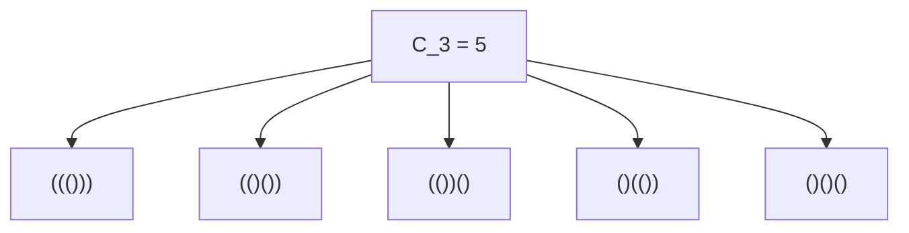
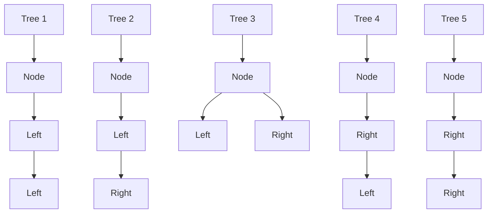
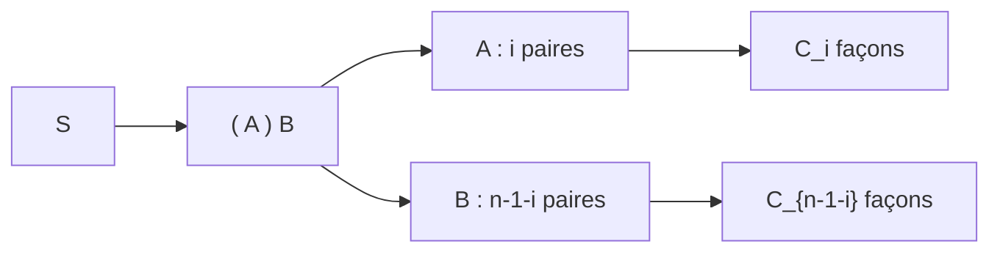

## 1. Introduction : Que sont les nombres de Catalan ?

Dans le monde des mathématiques et de l'informatique, nous observons souvent un phénomène magnifique où de multiples problèmes apparemment distincts partagent en réalité exactement la même structure sous-jacente. Un exemple frappant est celui des **nombres de Catalan**.

Nommée d'après le mathématicien belge Eugène Charles Catalan, la séquence de Catalan commence ainsi :

$$ C_0 = 1, \quad C_1 = 1, \quad C_2 = 2, \quad C_3 = 5, \quad C_4 = 14, \quad C_5 = 42, \quad C_6 = 132, \quad C_7 = 429, \quad \dots $$

Cette séquence apparaît comme la solution à une variété étonnamment diverse de problèmes combinatoires. Dans cet article, nous allons présenter quatre exemples célèbres impliquant les nombres de Catalan (parenthèses valides, arbres binaires, triangulation de polygones et chemins de Dyck). Nous démêlerons la structure récursive qui les sous-tend pour comprendre pourquoi ils correspondent tous exactement à la même séquence. De plus, nous approfondirons les algorithmes de calcul utilisant la programmation dynamique ([DP](https://kenji.blog/fr/p/dynamic-programming-dp-introduction-knapsack-fibonacci/)) et les dérivations mathématiques via les séries génératrices.

## 2. Quatre exemples concrets des nombres de Catalan

### Exemple 1 : Parenthèses Valides

En programmation, il est crucial de s'assurer que les parenthèses sont correctement appariées. Le nombre de "chaînes de parenthèses valides" que l'on peut former en utilisant $n$ paires de parenthèses `()` est exactement le nombre de Catalan $C_n$.

Une chaîne de parenthèses valide est une chaîne où, en lisant de gauche à droite, le nombre de parenthèses fermantes `)` ne dépasse jamais le nombre de parenthèses ouvrantes `(` à aucun moment.

Regardons le cas où $n = 3$. Il y a 5 façons valides d'arranger 3 paires de parenthèses. Cela correspond parfaitement à $C_3 = 5$.



### Exemple 2 : Structures d'Arbres Binaires

Ensuite, considérons les arbres binaires, une structure de données très familière. Le nombre de formes possibles pour un arbre binaire ayant $n$ nœuds internes est également le nombre de Catalan $C_n$.

Pour $n = 3$, il existe 5 formes différentes d'arbres binaires. Elles se distinguent selon que les nœuds sont attachés au sous-arbre gauche ou droit.



### Exemple 3 : Triangulation de Polygones

Les nombres de Catalan apparaissent également en géométrie. Le nombre de façons de diviser un polygone convexe à $(n+2)$ côtés en $n$ triangles en traçant des diagonales qui ne se croisent pas entre les sommets est exactement $C_n$.

Par exemple, lorsque $n = 3$, nous considérons les façons de trianguler un pentagone ($3+2=5$). Il y a exactement 5 façons de tracer des diagonales pour former 3 triangles. Une fois de plus, nous voyons le nombre $C_3 = 5$.

### Exemple 4 : Chemins de Dyck

Les nombres de Catalan émergent aussi dans les problèmes de chemins sur grille. Sur une grille de $n \times n$, considérez les chemins les plus courts du coin inférieur gauche $(0, 0)$ au coin supérieur droit $(n, n)$ en se déplaçant uniquement vers la droite ou vers le haut d'une unité à la fois. Le nombre de tels chemins qui ne franchissent jamais la diagonale $y = x$ (ce qui signifie qu'ils satisfont toujours $y \le x$) est $C_n$. Ce sont les **chemins de Dyck**.

Si nous notons le déplacement vers la droite par `R` et vers le haut par `U`, la condition exige que dans tout préfixe du chemin, le nombre de `U` ne dépasse jamais le nombre de `R`. Ceci est strictement équivalent à la relation entre `(` et `)` dans les chaînes de parenthèses valides.

## 3. Pourquoi sont-ils identiques ? (La structure sous-jacente)

Pourquoi ces problèmes apparemment sans rapport produisent-ils tous la même séquence de Catalan ? La réponse réside dans le fait qu'ils partagent tous la **même structure récursive exacte**.

Le nombre de Catalan $C_n$ est défini par la relation de récurrence suivante :

$$ C_0 = 1 $$
$$ C_{n} = \sum_{i=0}^{n-1} C_i C_{n-1-i} \quad (n \ge 1) $$

Comprenons intuitivement comment cette relation de récurrence est dérivée en utilisant les "parenthèses valides" comme exemple.

Considérez une chaîne de parenthèses valide arbitraire $S$ de longueur $2n$. $S$ doit commencer par une parenthèse ouvrante `(`. Il doit exister exactement une parenthèse fermante correspondante `)` quelque part dans la chaîne.
En se concentrant sur cette paire correspondante spécifique, la chaîne $S$ peut être décomposée de manière unique sous la forme suivante :

$$ S = ( A ) B $$

Ici, $A$ et $B$ sont elles-mêmes des chaînes de parenthèses valides (elles peuvent être des chaînes vides).
Supposons que la sous-chaîne $A$, qui se trouve entre le `(` initial et son `)` correspondant, contienne $i$ paires de parenthèses $(0 \le i \le n-1)$.
Puisque la chaîne totale a $n$ paires, et que 1 paire est consommée par les `( )` extérieurs, la sous-chaîne restante $B$ doit contenir $(n - 1 - i)$ paires.

- Le nombre de façons de former $A$ est $C_i$
- Le nombre de façons de former $B$ est $C_{n-1-i}$

Par conséquent, pour une valeur fixée de $i$, le nombre de chaînes possibles est $C_i \times C_{n-1-i}$. Puisque $i$ peut prendre n'importe quelle valeur de $0$ à $n-1$, la somme de toutes ces possibilités donne $C_n$. C'est le sens de la relation de récurrence.



La même décomposition exacte fonctionne pour les "Arbres Binaires". Si nous désignons un nœud comme racine et assignons $i$ nœuds au sous-arbre gauche, le sous-arbre droit doit prendre les $n-1-i$ nœuds restants. Cela produit la même relation de récurrence identique.

## 4. Dérivation mathématique de la formule fermée

Les nombres de Catalan peuvent être exprimés par une **formule fermée** (Closed-form formula) très simple en utilisant la notation combinatoire :

$$ C_n = \frac{1}{n+1} \binom{2n}{n} = \frac{(2n)!}{(n+1)!n!} $$

Comment cette élégante formule est-elle dérivée ? Explorons deux approches principales.

### 4.1. Preuve par le Principe de Réflexion

Nous pouvons prouver cette formule en utilisant les chemins de Dyck.
Le nombre total de chemins les plus courts de $(0,0)$ à $(n,n)$ est $\binom{2n}{n}$, car sur $2n$ pas totaux, nous devons choisir $n$ pas pour aller vers la droite.

De cela, nous devons soustraire les chemins qui violent la condition (c'est-à-dire ceux qui franchissent la ligne $y = x$ et touchent la ligne $y = x + 1$).
Soit $P$ le premier point où un chemin non valide touche $y = x + 1$. Nous réfléchissons la portion du chemin depuis le point $P$ jusqu'au point final $(n,n)$ par rapport à la ligne $y = x + 1$.
Le point final original $(n,n)$ se réfléchit vers un nouveau point final en $(n-1, n+1)$.

Remarquablement, il existe une correspondance biunivoque parfaite (bijection) entre les "chemins non valides de $(0,0)$ à $(n,n)$" et "TOUS les chemins de $(0,0)$ à $(n-1, n+1)$".
Le nombre total de chemins de $(0,0)$ à $(n-1, n+1)$ est $\binom{2n}{n-1}$.

Par conséquent, le nombre de chemins valides est :

$$ C_n = \binom{2n}{n} - \binom{2n}{n-1} $$

Nous pouvons simplifier cela algébriquement :

$$ C_n = \binom{2n}{n} - \frac{n}{n+1} \binom{2n}{n} = \left( 1 - \frac{n}{n+1} \right) \binom{2n}{n} = \frac{1}{n+1} \binom{2n}{n} $$

### 4.2. Approche par les Séries Génératrices

Soit la série génératrice des nombres de Catalan $C(x) = \sum_{n=0}^\infty C_n x^n$.
En utilisant la relation de récurrence $C_{n} = \sum_{i=0}^{n-1} C_i C_{n-1-i}$, nous trouvons que la série génératrice satisfait l'équation suivante :

$$ C(x) = 1 + x [C(x)]^2 $$

Cela peut être vu comme une équation quadratique en termes de $C(x)$ : $x [C(x)]^2 - C(x) + 1 = 0$. En appliquant la formule quadratique, nous obtenons :

$$ C(x) = \frac{1 \pm \sqrt{1 - 4x}}{2x} $$

Pour satisfaire la condition $C(0) = 1$ lorsque $x \to 0$, nous devons sélectionner le signe négatif.

$$ C(x) = \frac{1 - \sqrt{1 - 4x}}{2x} $$

En développant $\sqrt{1 - 4x} = (1 - 4x)^{1/2}$ en utilisant le théorème binomial généralisé (série de Taylor) et en comparant les coefficients, nous arrivons à $C_n = \frac{1}{n+1} \binom{2n}{n}$.

## 5. Algorithmes de calcul pour les nombres de Catalan

Lors du calcul des nombres de Catalan par programmation, il y a principalement trois approches.

### 5.1. Récursivité Simple (Naive Recursion)

Cela implique d'implémenter directement la relation de récurrence. Cependant, comme cela recalcule les mêmes valeurs de manière répétée, la complexité temporelle croît exponentiellement, ce qui le rend inadapté pour un grand $n$.

```python
def catalan_recursive(n):
    # Cas de base
    if n <= 1:
        return 1
    
    res = 0
    for i in range(n):
        res += catalan_recursive(i) * catalan_recursive(n - 1 - i)
    return res
```

### 5.2. Programmation Dynamique

En utilisant la mémoïsation (ou la programmation dynamique ascendante) pour stocker les résultats calculés dans un tableau, nous pouvons réduire la complexité temporelle à $O(n^2)$.

```python
def catalan_dp(n):
    # Initialiser le tableau DP. C_0 = 1
    dp = [0] * (n + 1)
    dp[0] = 1
    
    # Calcul basé sur la relation de récurrence
    for i in range(1, n + 1):
        for j in range(i):
            dp[i] += dp[j] * dp[i - 1 - j]
            
    return dp[n]

# Test
for i in range(7):
    print(f"C_{i} =", catalan_dp(i))
```

### 5.3. Formule Fermée

En utilisant la formule, nous pouvons calculer la valeur avec une complexité temporelle de $O(n)$ simplement en effectuant des calculs factoriels.

```python
import math

def catalan_formula(n):
    # C_n = (2n)! / ((n+1)! * n!)
    return math.comb(2 * n, n) // (n + 1)

# Test
for i in range(7):
    print(f"C_{i} =", catalan_formula(i))
```

## 6. Conclusion

La séquence des nombres de Catalan $C_n$ est une séquence captivante qui apparaît uniformément dans une multitude de problèmes apparemment distincts, tels que les chaînes de parenthèses valides, les formes d'arbres binaires, la triangulation de polygones et les chemins de Dyck. La raison pour laquelle ces problèmes produisent le même compte est qu'ils incarnent tous une structure récursive commune : **"diviser le tout en deux sous-problèmes et les combiner"**.

Lors de l'étude des algorithmes et des structures de données, la compréhension de ces contextes mathématiques cultive la capacité de voir à travers l'essence d'un problème. Cela constitue également un excellent exercice de programmation dynamique, alors assurez-vous d'essayer d'écrire le code et d'expérimenter vous-même !
