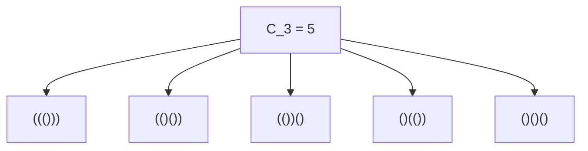
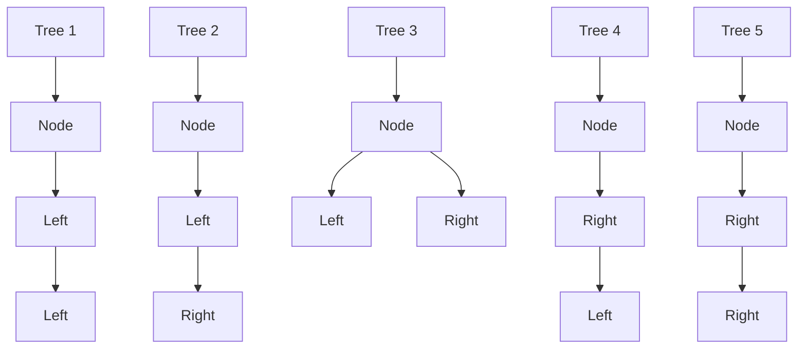
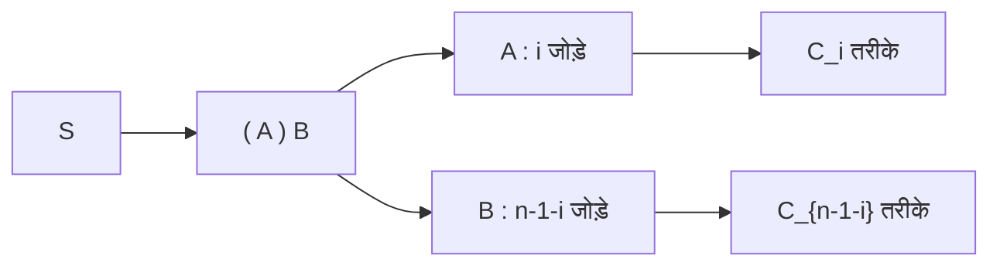

## 1. परिचय: [कैटलन संख्याएँ](https://kenji.blog/hi/p/catalan-numbers/) क्या हैं?

गणित और कंप्यूटर विज्ञान की दुनिया में, हम अक्सर एक सुंदर घटना देखते हैं जहाँ कई अलग-अलग दिखने वाली समस्याएँ वास्तव में एक ही अंतर्निहित संरचना साझा करती हैं। इसका एक प्रमुख उदाहरण **[कैटलन संख्याएँ](https://kenji.blog/hi/p/catalan-numbers/)** (Catalan numbers) हैं।

बेल्जियम के गणितज्ञ यूजीन चार्ल्स कैटलन के नाम पर, कैटलन अनुक्रम इस प्रकार शुरू होता है:

$$ C_0 = 1, \quad C_1 = 1, \quad C_2 = 2, \quad C_3 = 5, \quad C_4 = 14, \quad C_5 = 42, \quad C_6 = 132, \quad C_7 = 429, \quad \dots $$

यह अनुक्रम आश्चर्यजनक रूप से विविध संयोजनात्मक समस्याओं के समाधान के रूप में प्रकट होता है। इस लेख में, हम कैटलन संख्याओं से जुड़े चार प्रसिद्ध उदाहरण (वैध कोष्ठक, बाइनरी ट्री, बहुभुज त्रिकोणीकरण, और डाइक पथ) प्रस्तुत करेंगे। हम उनके पीछे की पुनरावर्ती (recursive) संरचना को सुलझाएंगे ताकि यह समझा जा सके कि वे सभी एक ही अनुक्रम से क्यों मेल खाते हैं। इसके अलावा, हम [डायनामिक प्रोग्रामिंग](/hi/p/dynamic-programming-dp-introduction-knapsack-fibonacci/) ([DP](https://kenji.blog/hi/p/dynamic-programming-dp-introduction-knapsack-fibonacci/)) का उपयोग करके कम्प्यूटेशनल एल्गोरिदम और जनरेटिंग फ़ंक्शंस के माध्यम से गणितीय व्युत्पत्ति (derivations) पर गहराई से विचार करेंगे।

## 2. कैटलन संख्याओं के चार ठोस उदाहरण

### उदाहरण 1: वैध कोष्ठक (Valid Parentheses)

प्रोग्रामिंग में, यह सुनिश्चित करना महत्वपूर्ण है कि कोष्ठक सही ढंग से मेल खाते हों। $n$ जोड़े कोष्ठक `()` का उपयोग करके आप जितने "वैध कोष्ठक तार (strings)" बना सकते हैं, उनकी संख्या ठीक कैटलन संख्या $C_n$ के बराबर होती है।

एक वैध कोष्ठक स्ट्रिंग वह है जहाँ, बाएँ से दाएँ पढ़ने पर, किसी भी समय बंद कोष्ठक `)` की गिनती खुले कोष्ठक `(` की गिनती से अधिक नहीं होती है।

आइए उस मामले को देखें जहाँ $n = 3$ है। 3 जोड़े कोष्ठक व्यवस्थित करने के 5 वैध तरीके हैं। यह $C_3 = 5$ से पूरी तरह मेल खाता है।



### उदाहरण 2: बाइनरी ट्री संरचनाएँ

इसके बाद, बाइनरी ट्री पर विचार करें, जो एक बहुत ही परिचित डेटा संरचना है। $n$ आंतरिक नोड्स वाले बाइनरी ट्री के संभावित आकारों की संख्या भी कैटलन संख्या $C_n$ है।

$n = 3$ के लिए, 5 अलग-अलग बाइनरी ट्री आकार होते हैं। उन्हें इस आधार पर अलग किया जाता है कि नोड्स बाएँ या दाएँ सबट्री से जुड़े हैं या नहीं।



### उदाहरण 3: बहुभुज त्रिकोणीकरण (Polygon Triangulation)

ज्यामिति में भी [कैटलन संख्याएँ](https://kenji.blog/hi/p/catalan-numbers/) प्रकट होती हैं। एक उत्तल $(n+2)$-पक्षीय बहुभुज को कोने के बीच गैर-प्रतिच्छेदी विकर्ण खींचकर $n$ त्रिभुजों में विभाजित करने के तरीकों की संख्या ठीक $C_n$ है।

उदाहरण के लिए, जब $n = 3$, हम एक पंचभुज ($3+2=5$) को त्रिकोणीकृत करने के तरीकों पर विचार करते हैं। 3 त्रिभुज बनाने के लिए विकर्ण खींचने के ठीक 5 तरीके हैं। एक बार फिर, हम संख्या $C_3 = 5$ देखते हैं।

### उदाहरण 4: डाइक पथ (Dyck Paths)

ग्रिड पथ समस्याओं में भी [कैटलन संख्याएँ](https://kenji.blog/hi/p/catalan-numbers/) उत्पन्न होती हैं। $n \times n$ ग्रिड पर, निचले बाएँ $(0, 0)$ से ऊपरी दाएँ $(n, n)$ तक के सबसे छोटे रास्तों पर विचार करें, जो एक बार में केवल दाएँ या ऊपर एक इकाई चलते हैं। ऐसे रास्तों की संख्या जो कभी भी विकर्ण $y = x$ को पार नहीं करते हैं (जिसका अर्थ है कि वे हमेशा $y \le x$ को संतुष्ट करते हैं) $C_n$ है। इन्हें **डाइक पथ** कहा जाता है।

यदि हम दाएँ जाने को `R` और ऊपर जाने को `U` के रूप में दर्शाते हैं, तो शर्त यह है कि पथ के किसी भी उपसर्ग (prefix) में, `U` की संख्या कभी भी `R` की संख्या से अधिक नहीं होनी चाहिए। यह वैध कोष्ठक स्ट्रिंग्स में `(` और `)` के बीच के संबंध के बिल्कुल समान है।

## 3. वे समान क्यों हैं? (अंतर्निहित संरचना)

ये प्रतीत होने वाली असंबद्ध समस्याएँ एक ही कैटलन अनुक्रम क्यों देती हैं? इसका उत्तर इस तथ्य में निहित है कि वे सभी **बिल्कुल एक ही पुनरावर्ती संरचना** साझा करते हैं।

कैटलन संख्या $C_n$ को निम्नलिखित पुनरावृत्ति संबंध द्वारा परिभाषित किया गया है:

$$ C_0 = 1 $$
$$ C_{n} = \sum_{i=0}^{n-1} C_i C_{n-1-i} \quad (n \ge 1) $$

आइए हम सहज रूप से समझें कि उदाहरण के रूप में "वैध कोष्ठकों" का उपयोग करके यह पुनरावृत्ति संबंध कैसे प्राप्त किया जाता है।

लंबाई $2n$ की एक मनमानी वैध कोष्ठक स्ट्रिंग $S$ पर विचार करें। $S$ की शुरुआत एक खुले कोष्ठक `(` से होनी चाहिए। स्ट्रिंग में कहीं न कहीं बिल्कुल एक मेल खाने वाला बंद कोष्ठक `)` मौजूद होना चाहिए।
इस विशिष्ट मिलान जोड़ी पर ध्यान केंद्रित करते हुए, स्ट्रिंग $S$ को विशिष्ट रूप से निम्नलिखित रूप में विघटित (decompose) किया जा सकता है:

$$ S = ( A ) B $$

यहाँ, $A$ और $B$ स्वयं वैध कोष्ठक स्ट्रिंग हैं (वे खाली स्ट्रिंग हो सकते हैं)।
मान लीजिए कि सबस्ट्रिंग $A$, जो प्रारंभिक `(` और उसके मिलान वाले `)` के बीच है, में $i$ जोड़े कोष्ठक $(0 \le i \le n-1)$ हैं।
चूँकि कुल स्ट्रिंग में $n$ जोड़े हैं, और 1 जोड़ा बाहरी `( )` द्वारा उपयोग किया जाता है, शेष सबस्ट्रिंग $B$ में $(n - 1 - i)$ जोड़े होने चाहिए।

- $A$ बनाने के तरीकों की संख्या $C_i$ है
- $B$ बनाने के तरीकों की संख्या $C_{n-1-i}$ है

इसलिए, $i$ के एक निश्चित मूल्य के लिए, संभावित स्ट्रिंग्स की संख्या $C_i \times C_{n-1-i}$ है। चूँकि $i$ का कोई भी मूल्य $0$ से $n-1$ तक हो सकता है, इन सभी संभावनाओं को जोड़ने पर $C_n$ मिलता है। यही पुनरावृत्ति संबंध का अर्थ है।



बिल्कुल वही अपघटन (decomposition) "बाइनरी ट्री" के लिए काम करता है। यदि हम एक नोड को रूट के रूप में निर्दिष्ट करते हैं और बाएँ सबट्री को $i$ नोड्स आवंटित करते हैं, तो दाएँ सबट्री को शेष $n-1-i$ नोड्स लेने चाहिए। यह समान पुनरावृत्ति संबंध उत्पन्न करता है।

## 4. बंद रूप सूत्र की गणितीय व्युत्पत्ति

कैटलन संख्याओं को संयोजन संकेतन (combinatorics notation) का उपयोग करके एक बहुत ही सरल **बंद रूप सूत्र** (Closed-form formula) द्वारा व्यक्त किया जा सकता है:

$$ C_n = \frac{1}{n+1} \binom{2n}{n} = \frac{(2n)!}{(n+1)!n!} $$

यह सुरुचिपूर्ण सूत्र कैसे प्राप्त किया जाता है? आइए दो प्राथमिक दृष्टिकोणों का अन्वेषण करें।

### 4.1. प्रतिबिंब सिद्धांत (Reflection Principle) द्वारा प्रमाण

हम डाइक पथों का उपयोग करके इस सूत्र को साबित कर सकते हैं।
$(0,0)$ से $(n,n)$ तक के सबसे छोटे रास्तों की कुल संख्या $\binom{2n}{n}$ है, क्योंकि कुल $2n$ चरणों में से, हमें दाएँ जाने के लिए $n$ चरण चुनने होंगे।

इसमें से, हमें उन रास्तों को घटाना होगा जो शर्त का उल्लंघन करते हैं (अर्थात, वे जो रेखा $y = x$ को पार करते हैं और रेखा $y = x + 1$ को छूते हैं)।
मान लीजिए कि $P$ वह पहला बिंदु है जहाँ उल्लंघन करने वाला पथ $y = x + 1$ को छूता है। हम बिंदु $P$ से अंतिम बिंदु $(n,n)$ तक पथ के हिस्से को रेखा $y = x + 1$ के पार प्रतिबिंबित करते हैं।
मूल अंतिम बिंदु $(n,n)$ एक नए अंतिम बिंदु $(n-1, n+1)$ पर प्रतिबिंबित होता है।

उल्लेखनीय रूप से, "$(0,0)$ से $(n,n)$ तक अमान्य पथ" और "$(0,0)$ से $(n-1, n+1)$ तक के सभी पथ" के बीच एक पूर्ण एक-से-एक पत्राचार (bijection) है।
$(0,0)$ से $(n-1, n+1)$ तक के रास्तों की कुल संख्या $\binom{2n}{n-1}$ है।

इसलिए, वैध रास्तों की संख्या है:

$$ C_n = \binom{2n}{n} - \binom{2n}{n-1} $$

हम इसे बीजगणितीय रूप से सरल बना सकते हैं:

$$ C_n = \binom{2n}{n} - \frac{n}{n+1} \binom{2n}{n} = \left( 1 - \frac{n}{n+1} \right) \binom{2n}{n} = \frac{1}{n+1} \binom{2n}{n} $$

### 4.2. जनरेटिंग फंक्शन ([Generating Functions](https://kenji.blog/hi/p/generating-functions/)) दृष्टिकोण

मान लीजिए कि कैटलन संख्याओं के लिए जनरेटिंग फ़ंक्शन $C(x) = \sum_{n=0}^\infty C_n x^n$ है।
पुनरावृत्ति संबंध $C_{n} = \sum_{i=0}^{n-1} C_i C_{n-1-i}$ का उपयोग करते हुए, हम पाते हैं कि जनरेटिंग फ़ंक्शन निम्नलिखित समीकरण को संतुष्ट करता है:

$$ C(x) = 1 + x [C(x)]^2 $$

इसे $C(x)$ के संदर्भ में एक द्विघात (quadratic) समीकरण के रूप में देखा जा सकता है: $x [C(x)]^2 - C(x) + 1 = 0$। द्विघात सूत्र लागू करने पर, हमें प्राप्त होता है:

$$ C(x) = \frac{1 \pm \sqrt{1 - 4x}}{2x} $$

$x \to 0$ होने पर $C(0) = 1$ की शर्त को पूरा करने के लिए, हमें ऋणात्मक चिह्न का चयन करना होगा।

$$ C(x) = \frac{1 - \sqrt{1 - 4x}}{2x} $$

सामान्यीकृत द्विपद प्रमेय (टेलर श्रृंखला) का उपयोग करके $\sqrt{1 - 4x} = (1 - 4x)^{1/2}$ का विस्तार करके और गुणांकों की तुलना करके, हम $C_n = \frac{1}{n+1} \binom{2n}{n}$ पर पहुँचते हैं।

## 5. कैटलन संख्याओं के लिए कम्प्यूटेशनल एल्गोरिदम

प्रोग्रामेटिक रूप से कैटलन संख्याओं की गणना करते समय, मुख्य रूप से तीन दृष्टिकोण होते हैं।

### 5.1. साधारण पुनरावृत्ति (Naive Recursion)

इसमें पुनरावृत्ति संबंध को सीधे लागू करना शामिल है। हालाँकि, क्योंकि यह एक ही मान की बार-बार पुनर्गणना करता है, समय जटिलता तेजी से बढ़ती है, जिससे यह बड़े $n$ के लिए अनुपयुक्त हो जाता है।

```python
def catalan_recursive(n):
    # बेस केस
    if n <= 1:
        return 1
    
    res = 0
    for i in range(n):
        res += catalan_recursive(i) * catalan_recursive(n - 1 - i)
    return res
```

### 5.2. डायनामिक प्रोग्रामिंग ([Dynamic Programming](https://kenji.blog/hi/p/dynamic-programming-dp-introduction-knapsack-fibonacci/))

कैलकुलेट किए गए परिणामों को ऐरे (array) में स्टोर करने के लिए मेमोइज़ेशन (या बॉटम-अप [डायनामिक प्रोग्रामिंग](/hi/p/dynamic-programming-dp-introduction-knapsack-fibonacci/)) का उपयोग करके, हम समय जटिलता को $O(n^2)$ तक कम कर सकते हैं।

```python
def catalan_dp(n):
    # DP टेबल को इनिशियलाइज़ करें। C_0 = 1
    dp = [0] * (n + 1)
    dp[0] = 1
    
    # पुनरावृत्ति संबंध के आधार पर गणना
    for i in range(1, n + 1):
        for j in range(i):
            dp[i] += dp[j] * dp[i - 1 - j]
            
    return dp[n]

# टेस्ट
for i in range(7):
    print(f"C_{i} =", catalan_dp(i))
```

### 5.3. बंद रूप सूत्र (Closed-Form Formula)

सूत्र का उपयोग करके, हम केवल फैक्टोरियल गणनाएँ करके $O(n)$ समय जटिलता में मान की गणना कर सकते हैं।

```python
import math

def catalan_formula(n):
    # C_n = (2n)! / ((n+1)! * n!)
    return math.comb(2 * n, n) // (n + 1)

# टेस्ट
for i in range(7):
    print(f"C_{i} =", catalan_formula(i))
```

## 6. निष्कर्ष

कैटलन संख्या अनुक्रम $C_n$ एक मनोरम अनुक्रम है जो कई अलग-अलग प्रतीत होने वाली समस्याओं में समान रूप से दिखाई देता है, जैसे कि वैध कोष्ठक तार, बाइनरी ट्री आकार, बहुभुज त्रिकोणीकरण और डाइक पथ। इन समस्याओं के समान गणना उत्पन्न करने का कारण यह है कि वे सभी एक सामान्य पुनरावर्ती संरचना को अपनाते हैं: **"पूरी समस्या को दो उप-समस्याओं (subproblems) में विभाजित करना और उन्हें जोड़ना"**।

एल्गोरिदम और डेटा संरचनाओं का अध्ययन करते समय, इन गणितीय पृष्ठभूमि को समझने से समस्या के सार को देखने की क्षमता विकसित होती है। यह [डायनामिक प्रोग्रामिंग](/hi/p/dynamic-programming-dp-introduction-knapsack-fibonacci/) में एक उत्कृष्ट अभ्यास के रूप में भी कार्य करता है, इसलिए स्वयं कोड लिखने और प्रयोग करने का प्रयास अवश्य करें!
