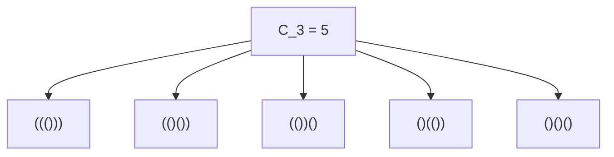
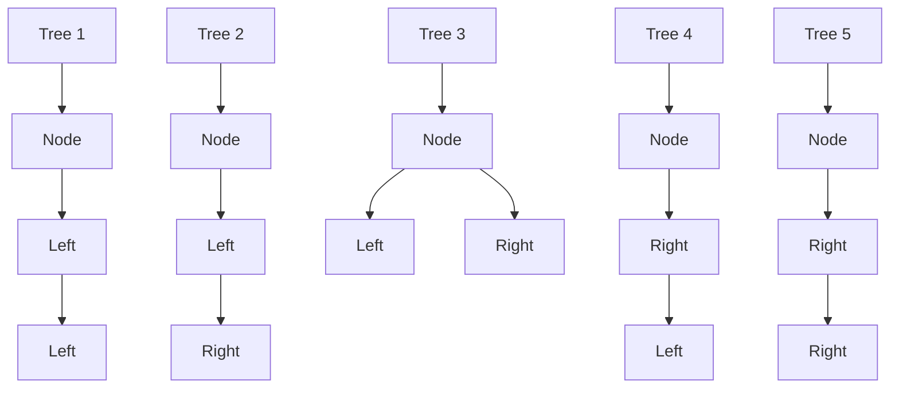
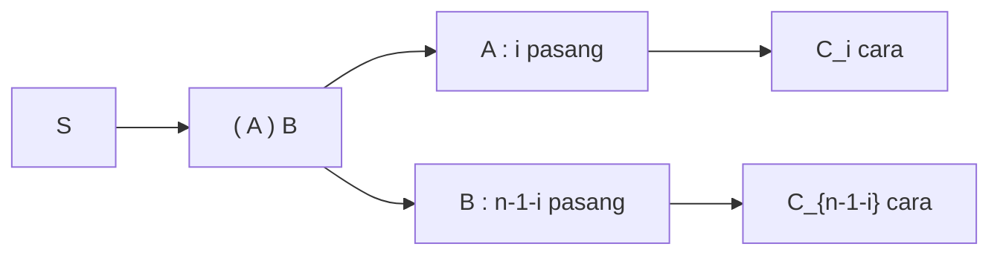

## 1. Pendahuluan: Apa itu [Bilangan Catalan](https://kenji.blog/id/p/catalan-numbers/)?

Dalam dunia matematika dan ilmu komputer, kita sering melihat fenomena indah di mana berbagai masalah yang tampaknya berbeda sebenarnya memiliki struktur dasar yang sama persis. Salah satu contoh menonjol adalah **bilangan Catalan**.

Dinamakan dari matematikawan Belgia Eugène Charles Catalan, deret Catalan dimulai sebagai berikut:

$$ C_0 = 1, \quad C_1 = 1, \quad C_2 = 2, \quad C_3 = 5, \quad C_4 = 14, \quad C_5 = 42, \quad C_6 = 132, \quad C_7 = 429, \quad \dots $$

Deret ini muncul sebagai solusi untuk berbagai macam masalah kombinatorika yang sangat beragam. Dalam artikel ini, kita akan memperkenalkan empat contoh terkenal yang melibatkan bilangan Catalan (urutan kurung yang valid, pohon biner, triangulasi poligon, dan lintasan Dyck). Kita akan menguraikan struktur rekursif di baliknya untuk memahami mengapa semuanya menghasilkan deret yang sama persis. Selain itu, kita akan mendalami algoritma komputasi menggunakan Pemrograman Dinamis ([DP](https://kenji.blog/id/p/dynamic-programming-dp-introduction-knapsack-fibonacci/)) dan derivasi matematika melalui fungsi pembangkit.

## 2. Empat Contoh Konkret [Bilangan Catalan](https://kenji.blog/id/p/catalan-numbers/)

### Contoh 1: Tanda Kurung yang Valid (Valid Parentheses)

Dalam pemrograman, memastikan bahwa tanda kurung dipasangkan dengan benar sangatlah penting. Jumlah "string tanda kurung yang valid" yang dapat Anda bentuk menggunakan $n$ pasang tanda kurung `()` tepat sama dengan bilangan Catalan $C_n$.

String tanda kurung yang valid adalah string di mana, jika dibaca dari kiri ke kanan, jumlah kurung tutup `)` tidak pernah melebihi jumlah kurung buka `(` pada titik mana pun.

Mari kita lihat kasus di mana $n = 3$. Ada 5 cara yang valid untuk menyusun 3 pasang tanda kurung. Ini sangat cocok dengan $C_3 = 5$.



### Contoh 2: Struktur Pohon Biner

Selanjutnya, pertimbangkan pohon biner, struktur data yang sangat familiar. Jumlah kemungkinan bentuk untuk pohon biner yang memiliki $n$ simpul (node) internal juga sama dengan bilangan Catalan $C_n$.

Untuk $n = 3$, terdapat 5 bentuk pohon biner yang berbeda. Bentuk-bentuk ini dibedakan berdasarkan apakah simpul terpasang pada subpohon kiri atau kanan.



### Contoh 3: Triangulasi Poligon

[Bilangan Catalan](https://kenji.blog/id/p/catalan-numbers/) juga muncul dalam geometri. Jumlah cara membagi poligon cembung dengan $(n+2)$ sisi menjadi $n$ segitiga dengan menggambar diagonal yang tidak saling berpotongan antar titik sudut tepat sama dengan $C_n$.

Misalnya, ketika $n = 3$, kita mempertimbangkan cara untuk mentriangulasi sebuah segilima ($3+2=5$). Terdapat tepat 5 cara menggambar diagonal untuk membentuk 3 segitiga. Sekali lagi, kita melihat angka $C_3 = 5$.

### Contoh 4: Lintasan Dyck (Dyck Paths)

[Bilangan Catalan](https://kenji.blog/id/p/catalan-numbers/) juga muncul dalam masalah lintasan kisi (grid). Pada grid berukuran $n \times n$, pertimbangkan lintasan terpendek dari sudut kiri bawah $(0, 0)$ ke sudut kanan atas $(n, n)$ yang hanya bergerak ke kanan atau ke atas satu unit pada satu waktu. Jumlah lintasan yang tidak pernah melintasi di atas diagonal $y = x$ (artinya mereka selalu memenuhi $y \le x$) adalah $C_n$. Ini disebut **lintasan Dyck**.

Jika kita melambangkan pergerakan ke kanan sebagai `R` dan pergerakan ke atas sebagai `U`, kondisinya mengharuskan dalam setiap awalan lintasan, jumlah `U` tidak pernah melebihi jumlah `R`. Ini secara ketat ekuivalen dengan hubungan antara `(` dan `)` dalam string kurung yang valid.

## 3. Mengapa Semuanya Sama? (Struktur yang Mendasarinya)

Mengapa semua masalah yang tampaknya tidak berhubungan ini menghasilkan deret Catalan yang sama? Jawabannya terletak pada fakta bahwa mereka semua berbagi **struktur rekursif yang persis sama**.

[Bilangan Catalan](https://kenji.blog/id/p/catalan-numbers/) $C_n$ didefinisikan oleh relasi perulangan berikut:

$$ C_0 = 1 $$
$$ C_{n} = \sum_{i=0}^{n-1} C_i C_{n-1-i} \quad (n \ge 1) $$

Mari kita pahami secara intuitif bagaimana relasi perulangan ini diturunkan dengan menggunakan "tanda kurung yang valid" sebagai contoh.

Pertimbangkan string kurung valid arbitrer $S$ dengan panjang $2n$. $S$ harus dimulai dengan kurung buka `(`. Pasti ada tepat satu kurung tutup pasangannya `)` di suatu tempat di dalam string.
Dengan berfokus pada pasangan khusus ini, string $S$ dapat dipecah secara unik ke dalam bentuk berikut:

$$ S = ( A ) B $$

Di sini, $A$ dan $B$ itu sendiri merupakan string tanda kurung yang valid (mereka bisa berupa string kosong).
Misalkan substring $A$, yang terletak antara `(` awal dan `)` pasangannya, mengandung $i$ pasang tanda kurung $(0 \le i \le n-1)$.
Karena total string memiliki $n$ pasang, dan 1 pasang telah digunakan oleh `( )` luar, substring $B$ yang tersisa harus mengandung $(n - 1 - i)$ pasang.

- Jumlah cara untuk membentuk $A$ adalah $C_i$
- Jumlah cara untuk membentuk $B$ adalah $C_{n-1-i}$

Oleh karena itu, untuk nilai $i$ yang tetap, jumlah kemungkinan string adalah $C_i \times C_{n-1-i}$. Karena $i$ dapat bernilai berapa saja dari $0$ hingga $n-1$, menjumlahkan semua kemungkinan ini menghasilkan $C_n$. Inilah arti dari relasi perulangan tersebut.



Dekomposisi persis sama juga berlaku untuk "Pohon Biner". Jika kita menunjuk suatu simpul sebagai akar dan mengalokasikan $i$ simpul ke subpohon kiri, maka subpohon kanan harus mengambil $n-1-i$ simpul sisanya. Ini menghasilkan relasi perulangan identik yang sama.

## 4. Penurunan Matematis dari Rumus Bentuk Tertutup

[Bilangan Catalan](https://kenji.blog/id/p/catalan-numbers/) dapat dinyatakan dengan **rumus bentuk tertutup** (Closed-form formula) yang sangat sederhana menggunakan notasi kombinatorika:

$$ C_n = \frac{1}{n+1} \binom{2n}{n} = \frac{(2n)!}{(n+1)!n!} $$

Bagaimana rumus yang elegan ini diturunkan? Mari kita jelajahi dua pendekatan utama.

### 4.1. Pembuktian dengan Prinsip Pemantulan (Reflection Principle)

Kita dapat membuktikan rumus ini menggunakan lintasan Dyck.
Total jumlah lintasan terpendek dari $(0,0)$ ke $(n,n)$ adalah $\binom{2n}{n}$, karena dari total $2n$ langkah, kita harus memilih $n$ langkah untuk bergerak ke kanan.

Dari jumlah tersebut, kita harus mengurangi lintasan yang melanggar kondisi (yaitu, mereka yang melintasi garis $y = x$ dan menyentuh garis $y = x + 1$).
Misalkan $P$ adalah titik pertama di mana lintasan pelanggar menyentuh $y = x + 1$. Kita memantulkan porsi lintasan dari titik $P$ ke titik akhir $(n,n)$ melintasi garis $y = x + 1$.
Titik akhir asli $(n,n)$ dipantulkan ke titik akhir baru di $(n-1, n+1)$.

Hebatnya, ada korespondensi satu-ke-satu yang sempurna (bijeksi) antara "lintasan tidak valid dari $(0,0)$ ke $(n,n)$" dan "SEMUA lintasan dari $(0,0)$ ke $(n-1, n+1)$".
Total lintasan dari $(0,0)$ ke $(n-1, n+1)$ adalah $\binom{2n}{n-1}$.

Oleh karena itu, jumlah lintasan yang valid adalah:

$$ C_n = \binom{2n}{n} - \binom{2n}{n-1} $$

Kita dapat menyederhanakannya secara aljabar:

$$ C_n = \binom{2n}{n} - \frac{n}{n+1} \binom{2n}{n} = \left( 1 - \frac{n}{n+1} \right) \binom{2n}{n} = \frac{1}{n+1} \binom{2n}{n} $$

### 4.2. Pendekatan melalui [Fungsi Pembangkit](https://kenji.blog/id/p/generating-functions/) ([Generating Functions](https://kenji.blog/id/p/generating-functions/))

Misalkan fungsi pembangkit untuk bilangan Catalan adalah $C(x) = \sum_{n=0}^\infty C_n x^n$.
Menggunakan relasi perulangan $C_{n} = \sum_{i=0}^{n-1} C_i C_{n-1-i}$, kita menemukan bahwa fungsi pembangkit memenuhi persamaan berikut:

$$ C(x) = 1 + x [C(x)]^2 $$

Ini dapat dilihat sebagai persamaan kuadrat dalam variabel $C(x)$: $x [C(x)]^2 - C(x) + 1 = 0$. Dengan menerapkan rumus kuadrat, kita mendapatkan:

$$ C(x) = \frac{1 \pm \sqrt{1 - 4x}}{2x} $$

Untuk memenuhi kondisi $C(0) = 1$ saat $x \to 0$, kita harus memilih tanda negatif.

$$ C(x) = \frac{1 - \sqrt{1 - 4x}}{2x} $$

Dengan mengekspansi $\sqrt{1 - 4x} = (1 - 4x)^{1/2}$ menggunakan teorema binomial umum (deret Taylor) dan membandingkan koefisiennya, kita sampai pada kesimpulan $C_n = \frac{1}{n+1} \binom{2n}{n}$.

## 5. Algoritma Komputasi untuk [Bilangan Catalan](https://kenji.blog/id/p/catalan-numbers/)

Saat menghitung bilangan Catalan secara terprogram, pada dasarnya ada tiga pendekatan.

### 5.1. Rekursi Sederhana (Naive Recursion)

Ini melibatkan implementasi langsung dari relasi perulangan. Namun, karena pendekatan ini menghitung nilai yang sama berulang-ulang, kompleksitas waktunya tumbuh secara eksponensial, sehingga tidak cocok untuk $n$ yang besar.

```python
def catalan_recursive(n):
    # Kasus dasar
    if n <= 1:
        return 1
    
    res = 0
    for i in range(n):
        res += catalan_recursive(i) * catalan_recursive(n - 1 - i)
    return res
```

### 5.2. Pemrograman Dinamis ([Dynamic Programming](https://kenji.blog/id/p/dynamic-programming-dp-introduction-knapsack-fibonacci/))

Dengan memanfaatkan memoisasi (atau pemrograman dinamis bottom-up) untuk menyimpan hasil yang telah dihitung dalam array, kita dapat mengurangi kompleksitas waktu menjadi $O(n^2)$.

```python
def catalan_dp(n):
    # Inisialisasi tabel DP. C_0 = 1
    dp = [0] * (n + 1)
    dp[0] = 1
    
    # Komputasi berdasarkan relasi perulangan
    for i in range(1, n + 1):
        for j in range(i):
            dp[i] += dp[j] * dp[i - 1 - j]
            
    return dp[n]

# Uji coba
for i in range(7):
    print(f"C_{i} =", catalan_dp(i))
```

### 5.3. Rumus Bentuk Tertutup (Closed-Form Formula)

Dengan menggunakan rumus, kita dapat menghitung nilai dengan kompleksitas waktu $O(n)$ hanya dengan melakukan perhitungan faktorial.

```python
import math

def catalan_formula(n):
    # C_n = (2n)! / ((n+1)! * n!)
    return math.comb(2 * n, n) // (n + 1)

# Uji coba
for i in range(7):
    print(f"C_{i} =", catalan_formula(i))
```

## 6. Kesimpulan

Deret bilangan Catalan $C_n$ adalah deret menawan yang muncul secara seragam di berbagai masalah yang tampaknya berbeda, seperti urutan kurung yang valid, bentuk pohon biner, triangulasi poligon, dan lintasan Dyck. Alasan mengapa masalah-masalah ini menghasilkan jumlah yang sama adalah karena semuanya mewujudkan struktur rekursif yang sama: **"membagi keseluruhan menjadi dua submasalah dan menggabungkannya"**.

Saat mempelajari algoritma dan struktur data, memahami latar belakang matematika ini memupuk kemampuan untuk melihat menembus esensi sebuah masalah. Ini juga berfungsi sebagai latihan yang sangat baik dalam pemrograman dinamis, jadi pastikan Anda mencoba menulis kode dan bereksperimen dengannya sendiri!
