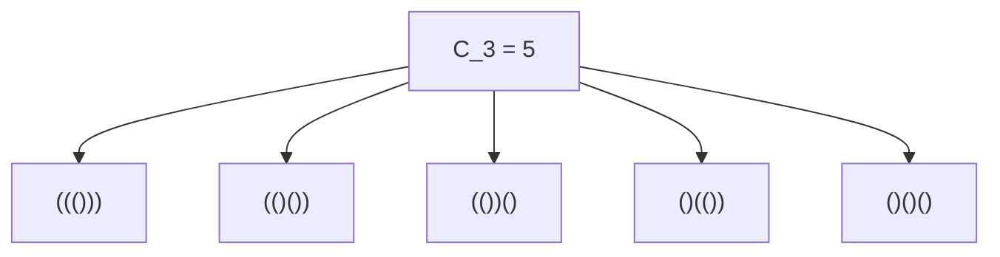
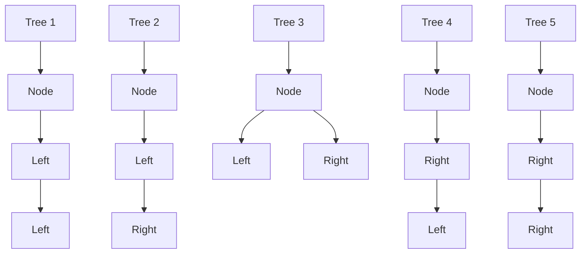
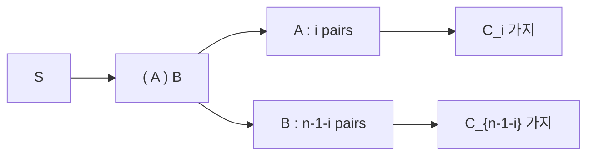

## 1. 들어가며: [카탈란 수](https://kenji.blog/p/catalan-numbers/)란?

수학이나 컴퓨터 과학의 세계에서는 언뜻 보기에 전혀 달라 보이는 여러 문제들이 사실 이면에서 완전히 동일한 구조를 가지고 있는 아름다운 현상을 종종 볼 수 있습니다. 그 대표적인 예 중 하나가 바로 **[카탈란 수](https://kenji.blog/p/catalan-numbers/)** (Catalan numbers)입니다.

[카탈란 수](https://kenji.blog/p/catalan-numbers/)는 벨기에의 수학자 외젠 샤를 카탈란의 이름을 따서 명명된 수열로, 다음과 같이 시작합니다.

$$ C_0 = 1, \quad C_1 = 1, \quad C_2 = 2, \quad C_3 = 5, \quad C_4 = 14, \quad C_5 = 42, \quad C_6 = 132, \quad C_7 = 429, \quad \dots $$

이 수열은 놀랍게도 매우 다양한 조합 문제의 해답으로 등장합니다. 본 글에서는 [카탈란 수](https://kenji.blog/p/catalan-numbers/)가 등장하는 유명한 4가지 예시(올바른 괄호 배열, 이진 트리, 다각형의 삼각 분할, 디크 경로)를 소개하고, 왜 이것들이 완전히 같은 수열이 되는지, 그 이면에 있는 재귀적인 구조를 파헤쳐 봅니다. 또한 동적 계획법(DP)을 사용한 계산 알고리즘과 생성 함수를 이용한 수학적 도출에 대해서도 자세히 설명합니다.

## 2. [카탈란 수](https://kenji.blog/p/catalan-numbers/)가 나타나는 4가지 구체적인 예

### 예시 1: 올바른 괄호 배열 (Valid Parentheses)

프로그래밍에서 괄호의 짝이 올바르게 맞는 것은 매우 중요합니다. $n$ 쌍의 괄호 `()` 를 사용하여 만들 수 있는 '올바른 괄호 배열'의 수는 [카탈란 수](https://kenji.blog/p/catalan-numbers/) $C_n$ 이 됩니다.

올바른 괄호 배열이란 왼쪽에서 오른쪽으로 문자를 읽을 때, 어느 시점에서도 닫는 괄호 `)` 의 수가 여는 괄호 `(` 의 수를 초과하지 않는 문자열을 말합니다.

$n = 3$ 인 경우를 생각해 봅시다. 3쌍의 괄호로 만들 수 있는 올바른 괄호 배열은 다음의 5가지입니다. 이는 $C_3 = 5$ 와 일치합니다.



### 예시 2: 이진 트리 구조 (Binary Trees)

다음으로 데이터 구조로 친숙한 이진 트리를 생각해 봅시다. $n$ 개의 내부 노드를 가지는 이진 트리의 모양의 수도 [카탈란 수](https://kenji.blog/p/catalan-numbers/) $C_n$ 이 됩니다.

$n = 3$ 인 경우, 3개의 노드를 가지는 이진 트리의 형태는 다음의 5가지가 존재합니다. 각각은 노드가 왼쪽 하위 트리와 오른쪽 하위 트리 중 어느 쪽에 연결되느냐에 따라 구별됩니다.



### 예시 3: 다각형의 삼각 분할 (Polygon Triangulation)

기하학의 세계에서도 [카탈란 수](https://kenji.blog/p/catalan-numbers/)는 등장합니다. 볼록 $(n+2)$ 각형을 꼭짓점끼리 연결하는 서로 교차하지 않는 대각선으로 $n$ 개의 삼각형으로 분할하는 방법의 수는 $C_n$ 가지입니다.

예를 들어 $n = 3$ 인 경우, 5각형($3+2=5$)을 3개의 삼각형으로 분할하는 방법을 생각해 봅니다. 대각선을 그어 삼각형을 만드는 방법은 정확히 5가지 존재합니다. 여기서도 $C_3 = 5$ 라는 숫자가 나타납니다.

### 예시 4: 디크 경로 (Dyck Paths)

그리드 상의 경로 문제에서도 [카탈란 수](https://kenji.blog/p/catalan-numbers/)가 나타납니다. $n \times n$ 그리드에서 왼쪽 아래 $(0, 0)$ 부터 오른쪽 위 $(n, n)$ 까지 오른쪽 또는 위쪽으로 1칸씩 이동하는 최단 경로 중, 대각선 $y = x$ 를 한 번도 넘지 않는(항상 $y \le x$ 를 만족하는) 경로의 수는 $C_n$ 이 됩니다. 이를 **디크 경로** (Dyck path)라고 부릅니다.

오른쪽으로의 이동을 `R`, 위쪽으로의 이동을 `U` 라고 하면, 어떤 접두사(prefix)에서도 `U` 의 수가 `R` 의 수를 초과하지 않는다는 조건이 됩니다. 이는 '올바른 괄호 배열'에서 `(` 와 `)` 의 관계와 완전히 동일합니다.

## 3. 왜 같은 수가 되는가? (이면에 있는 구조)

전혀 달라 보이는 이 문제들이 왜 모두 같은 [카탈란 수](https://kenji.blog/p/catalan-numbers/)가 되는 것일까요? 그것은 이 문제들이 **완전히 동일한 재귀적 구조** 를 가지고 있기 때문입니다.

[카탈란 수](https://kenji.blog/p/catalan-numbers/) $C_n$ 은 다음의 점화식으로 정의됩니다.

$$ C_0 = 1 $$
$$ C_{n} = \sum_{i=0}^{n-1} C_i C_{n-1-i} \quad (n \ge 1) $$

이 점화식이 어떻게 도출되는지 '올바른 괄호 배열'을 예로 직관적으로 이해해 봅시다.

임의의 길이 $2n$ 인 올바른 괄호 배열 $S$ 를 생각합니다. $S$ 는 반드시 하나의 여는 괄호 `(` 로 시작합니다. 이 첫 번째 `(` 에 대응하는 닫는 괄호 `)` 가 문자열 어딘가에 반드시 하나 존재합니다.
이 짝이 맞는 괄호에 주목하면, 문자열 $S$ 는 다음과 같은 형태로 유일하게 분해될 수 있습니다.

$$ S = ( A ) B $$

여기서 $A$ 와 $B$ 도 그 자체로 올바른 괄호 배열이 됩니다(빈 문자열이어도 상관없습니다).
첫 번째 `(` 와 그것에 대응하는 `)` 사이에 있는 부분 문자열 $A$ 가 $i$ 쌍의 괄호를 포함한다고 가정합시다 $(0 \le i \le n-1)$.
전체 문자열은 $n$ 쌍의 괄호를 가지고 있고, 바깥쪽의 `( )` 가 1쌍을 소모하므로, 나머지 부분 문자열 $B$ 는 $(n - 1 - i)$ 쌍의 괄호를 포함하게 됩니다.

- $A$ 를 구성하는 방법은 $C_i$ 가지
- $B$ 를 구성하는 방법은 $C_{n-1-i}$ 가지

따라서 어떤 고정된 $i$ 에 대해 가능한 문자열의 수는 $C_i \times C_{n-1-i}$ 가지가 됩니다. $i$ 는 $0$ 부터 $n-1$ 까지 여러 값을 가질 수 있으므로, 이것들을 모두 더한 것이 $C_n$ 이 됩니다. 이것이 점화식의 의미입니다.



완전히 똑같은 분해가 '이진 트리'에서도 가능합니다. 어떤 노드를 루트(root)로 지정했을 때, 왼쪽 하위 트리에 $i$ 개의 노드를 할당하면 오른쪽 하위 트리는 나머지 $n-1-i$ 개의 노드를 가져야 합니다. 이 역시 완전히 동일한 점화식을 도출합니다.

## 4. 닫힌 형태의 공식의 수학적 도출

[카탈란 수](https://kenji.blog/p/catalan-numbers/)는 조합론 기호를 사용하여 매우 간단한 **닫힌 형태의 공식** (Closed-form formula)으로 표현할 수 있습니다.

$$ C_n = \frac{1}{n+1} \binom{2n}{n} = \frac{(2n)!}{(n+1)!n!} $$

이 우아한 공식은 어떻게 도출될까요? 여기서는 두 가지 대표적인 접근법을 소개합니다.

### 4.1. 반사 원리 (Reflection Principle)를 이용한 증명

디크 경로를 이용하여 이 공식을 증명할 수 있습니다.
$(0,0)$ 에서 $(n,n)$ 으로 가는 최단 경로의 총 수는 총 $2n$ 번의 이동 중 $n$ 번의 오른쪽 이동을 선택하므로 $\binom{2n}{n}$ 가지입니다.

이 중에서 조건을 만족하지 않는(즉, 직선 $y = x$ 를 넘어 $y = x + 1$ 에 닿는) 경로의 수를 뺍니다.
조건을 만족하지 않는 경로가 처음으로 $y = x + 1$ 에 닿은 점을 $P$ 라고 합시다. 점 $P$ 부터 도착점 $(n,n)$ 까지의 경로를 직선 $y = x + 1$ 을 축으로 반사시킵니다.
그러면 원래의 도착점 $(n,n)$ 은 반사되어 새로운 도착점 $(n-1, n+1)$ 로 이동합니다.

놀랍게도, '$(0,0)$ 에서 $(n,n)$ 으로 가는 유효하지 않은 경로'와 '$(0,0)$ 에서 $(n-1, n+1)$ 로 가는 모든 경로' 사이에는 완벽한 일대일 대응(전단사)이 존재합니다.
$(0,0)$ 에서 $(n-1, n+1)$ 로 가는 경로의 총 수는 $\binom{2n}{n-1}$ 가지입니다.

따라서 올바른 경로의 수는 다음과 같습니다.

$$ C_n = \binom{2n}{n} - \binom{2n}{n-1} $$

이를 대수적으로 정리하면 다음과 같습니다.

$$ C_n = \binom{2n}{n} - \frac{n}{n+1} \binom{2n}{n} = \left( 1 - \frac{n}{n+1} \right) \binom{2n}{n} = \frac{1}{n+1} \binom{2n}{n} $$

### 4.2. 생성 함수 ([Generating Functions](https://kenji.blog/p/generating-functions/))를 이용한 접근

[카탈란 수](https://kenji.blog/p/catalan-numbers/)의 생성 함수를 $C(x) = \sum_{n=0}^\infty C_n x^n$ 이라고 합시다.
점화식 $C_{n} = \sum_{i=0}^{n-1} C_i C_{n-1-i}$ 를 이용하면 이 생성 함수가 다음 방정식을 만족함을 알 수 있습니다.

$$ C(x) = 1 + x [C(x)]^2 $$

이것은 $C(x)$ 에 대한 이차 방정식 $x [C(x)]^2 - C(x) + 1 = 0$ 으로 볼 수 있습니다. 근의 공식을 적용하면 다음을 얻습니다.

$$ C(x) = \frac{1 \pm \sqrt{1 - 4x}}{2x} $$

$x \to 0$ 일 때 $C(0) = 1$ 조건을 만족하려면 음의 부호를 선택해야 합니다.

$$ C(x) = \frac{1 - \sqrt{1 - 4x}}{2x} $$

여기서 일반화된 이항 정리(테일러 전개)를 사용하여 $\sqrt{1 - 4x} = (1 - 4x)^{1/2}$ 를 전개하고 계수를 비교하면 $C_n = \frac{1}{n+1} \binom{2n}{n}$ 이 도출됩니다.

## 5. [카탈란 수](https://kenji.blog/p/catalan-numbers/)의 계산 알고리즘

프로그래밍을 통해 [카탈란 수](https://kenji.blog/p/catalan-numbers/)를 계산할 때 주로 세 가지 접근 방식이 있습니다.

### 5.1. 단순 재귀 (Naive Recursion)

이는 점화식을 직접 구현하는 방법입니다. 하지만 동일한 값을 반복해서 계산하기 때문에 시간 복잡도가 기하급수적으로 증가하여 큰 $n$ 에는 적합하지 않습니다.

```python
def catalan_recursive(n):
    # 기본 경우
    if n <= 1:
        return 1
    
    res = 0
    for i in range(n):
        res += catalan_recursive(i) * catalan_recursive(n - 1 - i)
    return res
```

### 5.2. 동적 계획법 (Dynamic Programming)

메모이제이션(또는 상향식 동적 계획법)을 활용하여 계산 결과를 배열에 저장함으로써 시간 복잡도를 $O(n^2)$ 으로 줄일 수 있습니다.

```python
def catalan_dp(n):
    # DP 테이블 초기화. C_0 = 1
    dp = [0] * (n + 1)
    dp[0] = 1
    
    # 점화식에 기반한 계산
    for i in range(1, n + 1):
        for j in range(i):
            dp[i] += dp[j] * dp[i - 1 - j]
            
    return dp[n]

# 테스트
for i in range(7):
    print(f"C_{i} =", catalan_dp(i))
```

### 5.3. 닫힌 형태의 공식 (Closed-Form Formula)

이 공식을 사용하면 팩토리얼 계산만 수행하여 $O(n)$ 의 시간 복잡도로 결과를 도출할 수 있습니다.

```python
import math

def catalan_formula(n):
    # C_n = (2n)! / ((n+1)! * n!)
    return math.comb(2 * n, n) // (n + 1)

# 테스트
for i in range(7):
    print(f"C_{i} =", catalan_formula(i))
```

## 6. 요약

[카탈란 수](https://kenji.blog/p/catalan-numbers/)열 $C_n$ 은 올바른 괄호 배열, 이진 트리의 모양, 다각형의 삼각 분할, 디크 경로 등 언뜻 보기에 달라 보이는 수많은 문제에 공통적으로 나타나는 매혹적인 수열입니다. 이 문제들이 같은 수를 도출하는 이유는 모두가 **'전체를 두 개의 부분 문제로 분할하고 조합하는'** 공통의 재귀적 구조를 체현하고 있기 때문입니다.

알고리즘과 데이터 구조를 배울 때 이러한 수학적 배경을 이해하면 문제의 본질을 꿰뚫어 보는 능력이 길러집니다. 동적 계획법의 훌륭한 연습 문제이기도 하니, 꼭 직접 코드를 작성하여 실험해 보시기 바랍니다!
