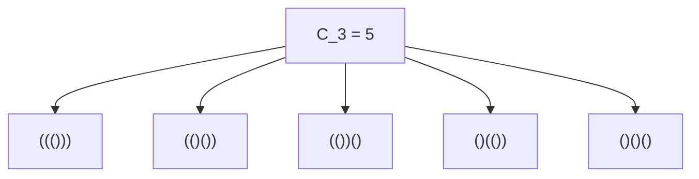
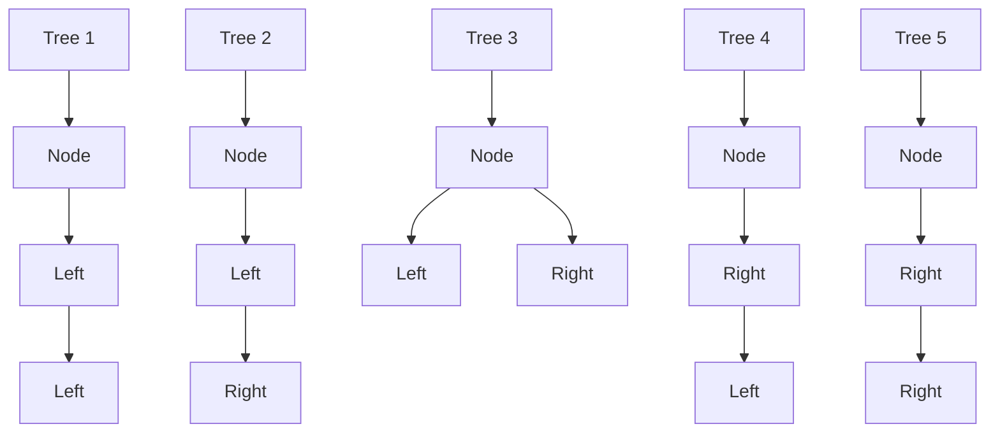
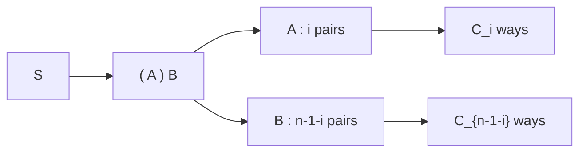

## 1. はじめに：[カタラン数](https://kenji.blog/p/catalan-numbers/)とは？

数学や計算機科学の世界には、一見すると全く異なるように見える複数の問題が、実は背後で全く同じ構造を持っているという美しい現象がしばしば見られます。その代表例の1つが **[カタラン数](https://kenji.blog/p/catalan-numbers/)** (Catalan numbers) です。

[カタラン数](https://kenji.blog/p/catalan-numbers/)は、ベルギーの数学者ウジェーヌ・シャルル・カタランにちなんで名付けられた数列で、以下のように始まります。

$$ C_0 = 1, \quad C_1 = 1, \quad C_2 = 2, \quad C_3 = 5, \quad C_4 = 14, \quad C_5 = 42, \quad C_6 = 132, \quad C_7 = 429, \quad \dots $$

この数列は、驚くほど多種多様な組み合わせ問題の解として登場します。本記事では、[カタラン数](https://kenji.blog/p/catalan-numbers/)が登場する有名な4つの例（正しい括弧列、二分木、多角形の三角形分割、ディック路）を紹介し、なぜこれらが全く同じ数列になるのか、その背後にある再帰的な構造を紐解いていきます。さらに、動的計画法 (DP) を使った計算アルゴリズムや、[母関数](https://kenji.blog/p/generating-functions/)を用いた数学的な導出についても詳しく解説します。

## 2. [カタラン数](https://kenji.blog/p/catalan-numbers/)が現れる4つの具体例

### 例1：正しい括弧列 (Valid Parentheses)

プログラミングにおいて、括弧の対応が正しく取れていることは非常に重要です。 $n$ 組の括弧 `()` を使って作れる「正しい括弧列」の数は、[カタラン数](https://kenji.blog/p/catalan-numbers/) $C_n$ になります。

正しい括弧列とは、左から右へ文字を読んだときに、どの時点でも閉じ括弧 `)` の数が開き括弧 `(` の数を上回らないような文字列のことです。

$n = 3$ の場合を考えてみましょう。3組の括弧から作れる正しい括弧列は以下の5通りです。これは $C_3 = 5$ に一致します。



### 例2：二分木の構造 (Binary Trees)

次に、データ構造としておなじみの二分木を考えます。 $n$ 個のノードを持つ二分木の形状の数も、[カタラン数](https://kenji.blog/p/catalan-numbers/) $C_n$ となります。

$n = 3$ の場合、3つのノードを持つ二分木の形状は以下の5通り存在します。それぞれが左部分木と右部分木のどちらにノードを持つかで区別されます。



### 例3：多角形の三角形分割 (Polygon Triangulation)

幾何学の世界でも[カタラン数](https://kenji.blog/p/catalan-numbers/)は登場します。 $(n+2)$ 角形を、頂点同士を結ぶ互いに交差しない対角線によって $n$ 個の三角形に分割する方法の数は $C_n$ 通りです。

例えば $n = 3$ の場合、5角形（ $3+2=5$ ）を3つの三角形に分割する方法を考えます。5角形の頂点を選んで対角線を引く方法は、ちょうど5通り存在します。ここでも $C_3 = 5$ という数字が現れます。

### 例4：ディック路 (Dyck Paths)

グリッド上の経路問題でも[カタラン数](https://kenji.blog/p/catalan-numbers/)が現れます。 $n \times n$ のグリッドにおいて、左下 $(0, 0)$ から右上 $(n, n)$ まで、右または上に1マスずつ進む最短経路のうち、対角線 $y = x$ を一度も越えない（ $y \le x$ を常に満たす）経路の数は $C_n$ になります。これを **ディック路** (Dyck path) と呼びます。

右への移動を `R` 、上への移動を `U` とすると、どのようなプレフィックスにおいても `U` の数が `R` の数を超えないという条件になります。これは「正しい括弧列」における `(` と `)` の関係と全く同じです。

## 3. なぜ同じ数になるのか？（背後にある構造）

全く異なるように見えるこれらの問題が、なぜすべて同じ[カタラン数](https://kenji.blog/p/catalan-numbers/)になるのでしょうか？それは、これらの問題が **全く同じ再帰的構造** を持っているからです。

[カタラン数](https://kenji.blog/p/catalan-numbers/) $C_n$ は、以下の漸化式によって定義されます。

$$ C_0 = 1 $$
$$ C_{n} = \sum_{i=0}^{n-1} C_i C_{n-1-i} \quad (n \ge 1) $$

この漸化式がどのようにして導かれるのか、「正しい括弧列」を例に直感的に理解してみましょう。

任意の長さ $2n$ の正しい括弧列 $S$ を考えます。 $S$ は必ず1つの開き括弧 `(` から始まります。この最初の `(` に対応する閉じ括弧 `)` が必ずどこかに存在します。
この対応する括弧のペアに注目すると、文字列 $S$ は次のような形に一意に分解できます。

$$ S = ( A ) B $$

ここで、 $A$ と $B$ もまた、それ自身が正しい括弧列になります（空文字列であっても構いません）。
最初の `(` とそれに対応する `)` の間にある部分文字列 $A$ が $i$ 組の括弧を含んでいるとします $(0 \le i \le n-1)$ 。
すると、括弧全体の数は $n$ 組であり、外側の `( )` で1組消費しているため、残りの部分 $B$ は $(n - 1 - i)$ 組の括弧を含むことになります。

- $A$ の選び方は $C_i$ 通り
- $B$ の選び方は $C_{n-1-i}$ 通り

したがって、ある $i$ に固定したときの括弧列の数は $C_i \times C_{n-1-i}$ 通りとなります。 $i$ は $0$ から $n-1$ まで様々な値を取り得るため、これらをすべて足し合わせたものが $C_n$ になります。これが漸化式の意味です。



全く同じ分解が「二分木」でも可能です。あるノードを根（ルート）としたとき、左部分木に $i$ 個のノードを割り当てると、右部分木には $n-1-i$ 個のノードが割り当てられます。これも全く同じ漸化式を導きます。

## 4. 閉じた式の数学的導出

[カタラン数](https://kenji.blog/p/catalan-numbers/)は組み合わせの記号を使って非常にシンプルな **閉じた式** (Closed-form formula) で表すことができます。

$$ C_n = \frac{1}{n+1} \binom{2n}{n} = \frac{(2n)!}{(n+1)!n!} $$

この美しい公式はどのように導かれるのでしょうか。ここでは2つの代表的なアプローチを紹介します。

### 4.1. 鏡像法 (Reflection Principle) による証明

ディック路を用いてこの式を証明します。
$(0,0)$ から $(n,n)$ への最短経路の総数は、 $2n$ 回の移動のうち $n$ 回右への移動を選ぶため $\binom{2n}{n}$ 通りです。

このうち、条件を満たさない（つまり直線 $y = x$ を越えて $y = x + 1$ に触れてしまう）経路の数を引き算します。
条件を満たさない経路が初めて $y = x + 1$ に触れた点を $P$ とします。点 $P$ から終点 $(n,n)$ までの経路を、直線 $y = x + 1$ を軸として鏡像反転させます。
すると、終点 $(n,n)$ は反転して $(n-1, n+1)$ に移動します。

驚くべきことに、「条件を満たさない $(0,0)$ から $(n,n)$ への経路」は、「 $(0,0)$ から $(n-1, n+1)$ への全ての経路」と完全に1対1対応します。
$(0,0)$ から $(n-1, n+1)$ への経路の総数は $\binom{2n}{n-1}$ 通りです。

したがって、正しい経路の数は以下のようになります。

$$ C_n = \binom{2n}{n} - \binom{2n}{n-1} $$

これを式変形します。

$$ C_n = \binom{2n}{n} - \frac{n}{n+1} \binom{2n}{n} = \left( 1 - \frac{n}{n+1} \right) \binom{2n}{n} = \frac{1}{n+1} \binom{2n}{n} $$

### 4.2. [母関数](https://kenji.blog/p/generating-functions/) ([Generating Functions](https://kenji.blog/p/generating-functions/)) によるアプローチ

[カタラン数](https://kenji.blog/p/catalan-numbers/)の[母関数](https://kenji.blog/p/generating-functions/)を $C(x) = \sum_{n=0}^\infty C_n x^n$ と定義します。
漸化式 $C_{n} = \sum_{i=0}^{n-1} C_i C_{n-1-i}$ を用いると、[母関数](https://kenji.blog/p/generating-functions/)は次の方程式を満たすことがわかります。

$$ C(x) = 1 + x [C(x)]^2 $$

これは $C(x)$ についての二次方程式 $x [C(x)]^2 - C(x) + 1 = 0$ とみなすことができます。解の公式を用いると以下のようになります。

$$ C(x) = \frac{1 \pm \sqrt{1 - 4x}}{2x} $$

$x \to 0$ の極限で $C(0) = 1$ となるように負の符号を選びます。

$$ C(x) = \frac{1 - \sqrt{1 - 4x}}{2x} $$

ここで、一般化二項定理を用いて $\sqrt{1 - 4x} = (1 - 4x)^{1/2}$ をテイラー展開し、係数を比較することで $C_n = \frac{1}{n+1} \binom{2n}{n}$ を導出することができます。

## 5. [カタラン数](https://kenji.blog/p/catalan-numbers/)の計算アルゴリズム

[カタラン数](https://kenji.blog/p/catalan-numbers/)をプログラムで計算する場合、主に3つのアプローチがあります。

### 5.1. 単純な再帰 (Naive Recursion)

漸化式をそのまま実装する方法です。しかし、同じ計算を何度も繰り返すため、[時間計算量](https://kenji.blog/p/time-space-complexity-big-o-notation-examples/)は指数関数的になり、大きな $n$ には適していません。

```python
def catalan_recursive(n):
    # ベースケース
    if n <= 1:
        return 1
    
    res = 0
    for i in range(n):
        res += catalan_recursive(i) * catalan_recursive(n - 1 - i)
    return res
```

### 5.2. [動的計画法](https://kenji.blog/p/dynamic-programming-dp-introduction-knapsack-fibonacci/) ([Dynamic Programming](https://kenji.blog/p/dynamic-programming-dp-introduction-knapsack-fibonacci/))

計算結果を配列に保存するメモ化（またはボトムアップの動的計画法）を用いることで、[時間計算量](https://kenji.blog/p/time-space-complexity-big-o-notation-examples/)を $O(n^2)$ に削減できます。

```python
def catalan_dp(n):
    # DPテーブルの初期化。C_0 = 1
    dp = [0] * (n + 1)
    dp[0] = 1
    
    # 漸化式に基づく計算
    for i in range(1, n + 1):
        for j in range(i):
            dp[i] += dp[j] * dp[i - 1 - j]
            
    return dp[n]

# テスト
for i in range(7):
    print(f"C_{i} =", catalan_dp(i))
```

### 5.3. 閉じた式 (Closed-form formula)

公式を使えば、階乗の計算を行うだけで $O(n)$ の[時間計算量](https://kenji.blog/p/time-space-complexity-big-o-notation-examples/)で求めることができます。

```python
import math

def catalan_formula(n):
    # C_n = (2n)! / ((n+1)! * n!)
    return math.comb(2 * n, n) // (n + 1)

# テスト
for i in range(7):
    print(f"C_{i} =", catalan_formula(i))
```

## 6. まとめ

[カタラン数](https://kenji.blog/p/catalan-numbers/) $C_n$ は、括弧の並べ方、二分木の形状、多角形の分割、ディック路など、一見異なる数多くの問題に共通して現れる魅惑的な数列です。これらの問題が同じ数になる理由は、すべてが **「全体を2つの部分問題に分割し、それらを組み合わせる」** という共通の再帰的構造を持っているからです。

アルゴリズムやデータ構造を学ぶ際、このような数学的背景を理解しておくことで、問題の本質を見抜く力が養われます。[動的計画法](https://kenji.blog/p/dynamic-programming-dp-introduction-knapsack-fibonacci/)の練習問題としても非常に優秀なので、ぜひ自分でもコードを書いて実験してみてください。
