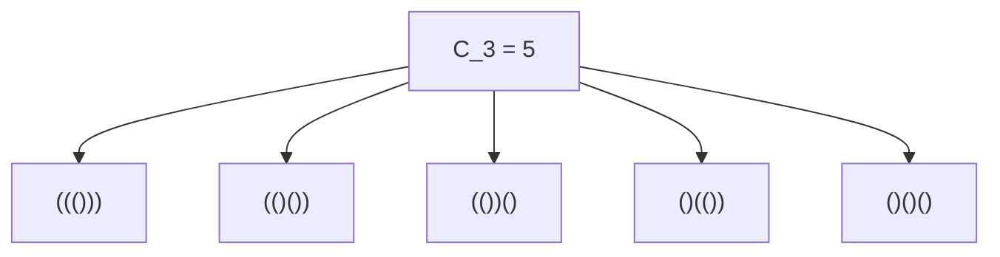
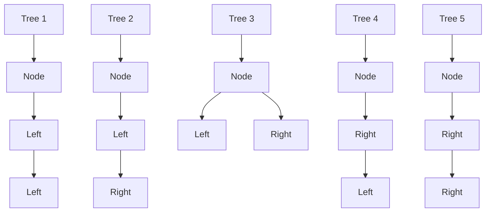
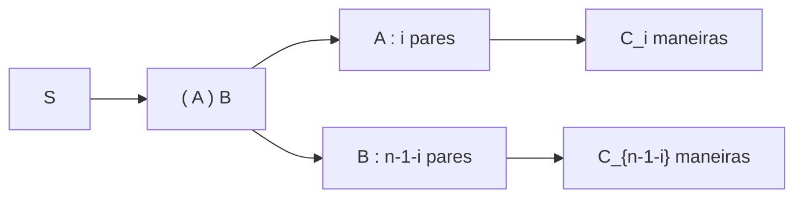

## 1. Introdução: O que são os [Números de Catalan](https://kenji.blog/pt/p/catalan-numbers/)?

No mundo da matemática e da ciência da computação, muitas vezes observamos um belo fenômeno onde múltiplos problemas aparentemente distintos compartilham, na verdade, exatamente a mesma estrutura subjacente. Um exemplo proeminente são os **números de Catalan**.

Nomeada em homenagem ao matemático belga Eugène Charles Catalan, a sequência de Catalan começa da seguinte forma:

$$ C_0 = 1, \quad C_1 = 1, \quad C_2 = 2, \quad C_3 = 5, \quad C_4 = 14, \quad C_5 = 42, \quad C_6 = 132, \quad C_7 = 429, \quad \dots $$

Esta sequência aparece como solução para uma variedade surpreendentemente diversificada de problemas combinatórios. Neste artigo, apresentaremos quatro exemplos famosos envolvendo os números de Catalan (parênteses válidos, árvores binárias, triangulação de polígonos e caminhos de Dyck). Desvendaremos a estrutura recursiva por trás deles para entender por que todos eles mapeiam exatamente para a mesma sequência. Além disso, nos aprofundaremos em algoritmos computacionais utilizando Programação Dinâmica (DP) e derivações matemáticas por meio de funções geradoras.

## 2. Quatro exemplos concretos dos números de Catalan

### Exemplo 1: Parênteses Válidos

Na programação, garantir que os parênteses correspondam corretamente é crucial. O número de "sequências de parênteses válidas" que você pode formar usando $n$ pares de parênteses `()` é exatamente o número de Catalan $C_n$.

Uma sequência de parênteses válida é aquela onde, lendo da esquerda para a direita, a contagem de parênteses de fechamento `)` nunca excede a contagem de parênteses de abertura `(` em nenhum momento.

Vejamos o caso em que $n = 3$. Existem 5 maneiras válidas de organizar 3 pares de parênteses. Isso corresponde perfeitamente a $C_3 = 5$.



### Exemplo 2: Estruturas de Árvores Binárias

Em seguida, considere as árvores binárias, uma estrutura de dados muito familiar. O número de formas possíveis para uma árvore binária com $n$ nós internos também é o número de Catalan $C_n$.

Para $n = 3$, existem 5 formas diferentes de árvores binárias. Elas se distinguem pela conexão dos nós à subárvore esquerda ou direita.



### Exemplo 3: Triangulação de Polígonos

Os números de Catalan também aparecem na geometria. O número de maneiras de dividir um polígono convexo de $(n+2)$ lados em $n$ triângulos desenhando diagonais que não se cruzam entre os vértices é exatamente $C_n$.

Por exemplo, quando $n = 3$, consideramos as maneiras de triangular um pentágono ($3+2=5$). Existem exatamente 5 maneiras de desenhar diagonais para formar 3 triângulos. Mais uma vez, vemos o número $C_3 = 5$.

### Exemplo 4: Caminhos de Dyck

Os números de Catalan também surgem em problemas de caminhos em grades. Em uma grade $n \times n$, considere os caminhos mais curtos do canto inferior esquerdo $(0, 0)$ ao superior direito $(n, n)$ movendo-se apenas para a direita ou para cima, uma unidade de cada vez. O número de tais caminhos que nunca cruzam acima da diagonal $y = x$ (o que significa que eles sempre satisfazem $y \le x$) é $C_n$. Estes são chamados de **caminhos de Dyck**.

Se denotarmos mover para a direita como `R` e mover para cima como `U`, a condição exige que em qualquer prefixo do caminho, o número de `U` nunca exceda o número de `R`. Isso é estritamente equivalente à relação entre `(` e `)` em sequências de parênteses válidas.

## 3. Por que são iguais? (A estrutura subjacente)

Por que esses problemas aparentemente não relacionados todos resultam na mesma sequência de Catalan? A resposta reside no fato de que todos eles compartilham **exatamente a mesma estrutura recursiva**.

O número de Catalan $C_n$ é definido pela seguinte relação de recorrência:

$$ C_0 = 1 $$
$$ C_{n} = \sum_{i=0}^{n-1} C_i C_{n-1-i} \quad (n \ge 1) $$

Vamos entender intuitivamente como essa relação de recorrência é derivada usando "parênteses válidos" como exemplo.

Considere uma sequência de parênteses válida arbitrária $S$ de comprimento $2n$. $S$ deve começar com um parêntese de abertura `(`. Deve existir exatamente um parêntese de fechamento correspondente `)` em algum lugar na sequência.
Focando neste par correspondente específico, a sequência $S$ pode ser unicamente decomposta na seguinte forma:

$$ S = ( A ) B $$

Aqui, $A$ e $B$ são eles mesmos sequências de parênteses válidas (eles podem ser strings vazias).
Suponha que a subsequência $A$, que se encontra entre o `(` inicial e o seu `)` correspondente, contenha $i$ pares de parênteses $(0 \le i \le n-1)$.
Como a sequência total tem $n$ pares, e 1 par é consumido pelo `( )` externo, a subsequência restante $B$ deve conter $(n - 1 - i)$ pares.

- O número de maneiras de formar $A$ é $C_i$
- O número de maneiras de formar $B$ é $C_{n-1-i}$

Portanto, para um valor fixo de $i$, o número de sequências possíveis é $C_i \times C_{n-1-i}$. Como $i$ pode tomar qualquer valor de $0$ a $n-1$, somar todas essas possibilidades dá $C_n$. Este é o significado da relação de recorrência.



A mesma decomposição exata funciona para "Árvores Binárias". Se designarmos um nó como raiz e atribuirmos $i$ nós à subárvore esquerda, a subárvore direita deve receber os $n-1-i$ nós restantes. Isso produz a mesma relação de recorrência idêntica.

## 4. Derivação matemática da fórmula fechada

Os números de Catalan podem ser expressos por uma **fórmula fechada** (Closed-form formula) muito simples usando notação combinatória:

$$ C_n = \frac{1}{n+1} \binom{2n}{n} = \frac{(2n)!}{(n+1)!n!} $$

Como esta elegante fórmula é derivada? Vamos explorar duas abordagens principais.

### 4.1. Prova pelo Princípio de Reflexão

Podemos provar esta fórmula usando caminhos de Dyck.
O número total de caminhos mais curtos de $(0,0)$ a $(n,n)$ é $\binom{2n}{n}$, porque de um total de $2n$ passos, devemos escolher $n$ passos para mover para a direita.

Disso, devemos subtrair os caminhos que violam a condição (ou seja, aqueles que cruzam a linha $y = x$ e tocam a linha $y = x + 1$).
Seja $P$ o primeiro ponto onde um caminho infrator toca $y = x + 1$. Refletimos a porção do caminho do ponto $P$ até o ponto final $(n,n)$ sobre a linha $y = x + 1$.
O ponto final original $(n,n)$ é refletido para um novo ponto final em $(n-1, n+1)$.

De forma notável, existe uma correspondência um-para-um perfeita (bijeção) entre "caminhos inválidos de $(0,0)$ a $(n,n)$" e "TODOS os caminhos de $(0,0)$ a $(n-1, n+1)$".
O número total de caminhos de $(0,0)$ a $(n-1, n+1)$ é $\binom{2n}{n-1}$.

Portanto, o número de caminhos válidos é:

$$ C_n = \binom{2n}{n} - \binom{2n}{n-1} $$

Podemos simplificar isso algebricamente:

$$ C_n = \binom{2n}{n} - \frac{n}{n+1} \binom{2n}{n} = \left( 1 - \frac{n}{n+1} \right) \binom{2n}{n} = \frac{1}{n+1} \binom{2n}{n} $$

### 4.2. Abordagem via Funções Geradoras

Seja a função geradora para os números de Catalan $C(x) = \sum_{n=0}^\infty C_n x^n$.
Usando a relação de recorrência $C_{n} = \sum_{i=0}^{n-1} C_i C_{n-1-i}$, descobrimos que a função geradora satisfaz a seguinte equação:

$$ C(x) = 1 + x [C(x)]^2 $$

Isso pode ser visto como uma equação quadrática em termos de $C(x)$: $x [C(x)]^2 - C(x) + 1 = 0$. Aplicando a fórmula quadrática, obtemos:

$$ C(x) = \frac{1 \pm \sqrt{1 - 4x}}{2x} $$

Para satisfazer a condição $C(0) = 1$ quando $x \to 0$, devemos selecionar o sinal negativo.

$$ C(x) = \frac{1 - \sqrt{1 - 4x}}{2x} $$

Expandindo $\sqrt{1 - 4x} = (1 - 4x)^{1/2}$ usando o teorema binomial generalizado (série de Taylor) e comparando os coeficientes, chegamos a $C_n = \frac{1}{n+1} \binom{2n}{n}$.

## 5. Algoritmos computacionais para os números de Catalan

Ao calcular números de Catalan de forma programática, existem principalmente três abordagens.

### 5.1. Recursão Simples (Naive Recursion)

Isso envolve a implementação direta da relação de recorrência. No entanto, como ele recalcula os mesmos valores repetidamente, a complexidade de tempo cresce exponencialmente, tornando-o inadequado para um $n$ grande.

```python
def catalan_recursive(n):
    # Caso base
    if n <= 1:
        return 1
    
    res = 0
    for i in range(n):
        res += catalan_recursive(i) * catalan_recursive(n - 1 - i)
    return res
```

### 5.2. Programação Dinâmica

Ao utilizar memoização (ou programação dinâmica bottom-up) para armazenar resultados calculados em um array, podemos reduzir a complexidade de tempo para $O(n^2)$.

```python
def catalan_dp(n):
    # Inicializar a tabela DP. C_0 = 1
    dp = [0] * (n + 1)
    dp[0] = 1
    
    # Cálculo baseado na relação de recorrência
    for i in range(1, n + 1):
        for j in range(i):
            dp[i] += dp[j] * dp[i - 1 - j]
            
    return dp[n]

# Teste
for i in range(7):
    print(f"C_{i} =", catalan_dp(i))
```

### 5.3. Fórmula Fechada

Usando a fórmula, podemos calcular o valor com complexidade de tempo $O(n)$ simplesmente realizando cálculos fatoriais.

```python
import math

def catalan_formula(n):
    # C_n = (2n)! / ((n+1)! * n!)
    return math.comb(2 * n, n) // (n + 1)

# Teste
for i in range(7):
    print(f"C_{i} =", catalan_formula(i))
```

## 6. Conclusão

A sequência de números de Catalan $C_n$ é uma sequência cativante que aparece uniformemente em uma infinidade de problemas aparentemente distintos, como sequências de parênteses válidas, formas de árvores binárias, triangulação de polígonos e caminhos de Dyck. A razão pela qual esses problemas produzem a mesma contagem é que todos eles incorporam uma estrutura recursiva comum: **"dividir o todo em dois subproblemas e combiná-los"**.

Ao estudar algoritmos e estruturas de dados, compreender esses fundamentos matemáticos cultiva a capacidade de enxergar a essência de um problema. Também serve como um excelente exercício em programação dinâmica, portanto, certifique-se de tentar escrever o código e experimentar por si mesmo!
