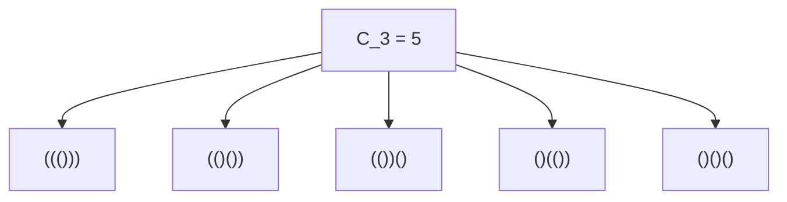
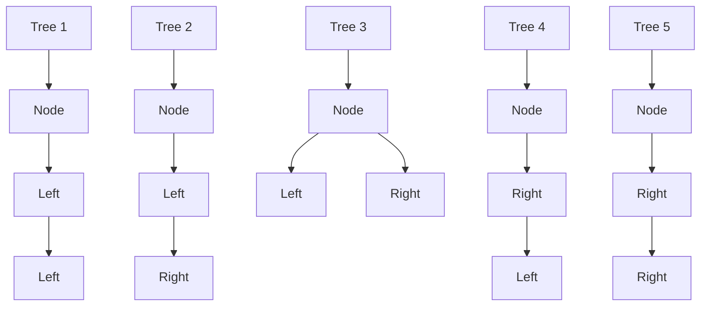
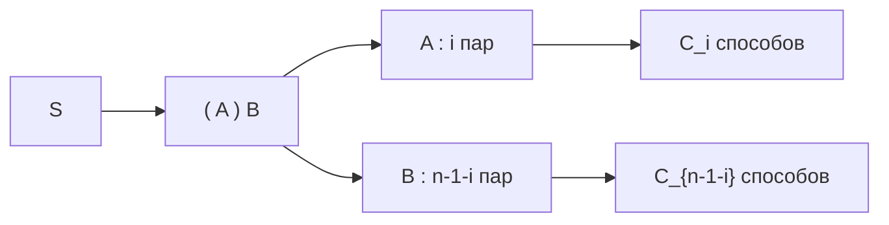

## 1. Введение: Что такое числа Каталана?

В мире математики и информатики мы часто наблюдаем красивое явление, когда несколько, казалось бы, совершенно разных задач на самом деле имеют абсолютно одинаковую внутреннюю структуру. Одним из ярких примеров являются **числа Каталана**.

Названная в честь бельгийского математика Эжена Шарля Каталана, эта последовательность начинается так:

$$ C_0 = 1, \quad C_1 = 1, \quad C_2 = 2, \quad C_3 = 5, \quad C_4 = 14, \quad C_5 = 42, \quad C_6 = 132, \quad C_7 = 429, \quad \dots $$

Эта последовательность возникает как решение удивительно разнообразных комбинаторных задач. В этой статье мы представим четыре известных примера, связанных с числами Каталана (правильные скобочные последовательности, бинарные деревья, триангуляция многоугольника и пути Дика). Мы разберем их рекурсивную структуру, чтобы понять, почему все они сводятся к одной и той же последовательности. Кроме того, мы рассмотрим алгоритмы их вычисления с использованием динамического программирования ([DP](https://kenji.blog/ru/p/dynamic-programming-dp-introduction-knapsack-fibonacci/)) и математический вывод через производящие функции.

## 2. Четыре конкретных примера чисел Каталана

### Пример 1: Правильные скобочные последовательности

В программировании крайне важно убедиться, что скобки расставлены корректно. Количество «правильных скобочных последовательностей», которые можно составить, используя $n$ пар скобок `()`, в точности равно числу Каталана $C_n$.

Правильная скобочная последовательность — это такая строка, в которой при чтении слева направо количество закрывающих скобок `)` ни в какой момент не превышает количество открывающих скобок `(`.

Давайте посмотрим на случай, когда $n = 3$. Существует 5 правильных способов расположить 3 пары скобок. Это идеально совпадает с $C_3 = 5$.



### Пример 2: Структуры бинарных деревьев

Теперь рассмотрим бинарные деревья — хорошо известную структуру данных. Количество возможных форм бинарного дерева, имеющего $n$ внутренних узлов, также равно числу Каталана $C_n$.

Для $n = 3$ существует 5 различных форм бинарных деревьев. Они различаются тем, прикреплены ли узлы к левому или правому поддереву.



### Пример 3: Триангуляция многоугольника

[Числа Каталана](https://kenji.blog/ru/p/catalan-numbers/) также встречаются в геометрии. Количество способов разбить выпуклый $(n+2)$-угольник на $n$ треугольников путем проведения непересекающихся диагоналей между вершинами в точности равно $C_n$.

Например, когда $n = 3$, мы рассматриваем способы триангуляции пятиугольника ($3+2=5$). Существует ровно 5 способов провести диагонали, чтобы образовать 3 треугольника. И снова мы видим число $C_3 = 5$.

### Пример 4: Пути Дика

[Числа Каталана](https://kenji.blog/ru/p/catalan-numbers/) также появляются в задачах о путях на сетке. На сетке размером $n \times n$ рассмотрим кратчайшие пути из левого нижнего угла $(0, 0)$ в правый верхний угол $(n, n)$, перемещаясь только вправо или вверх на одну единицу за шаг. Количество таких путей, которые никогда не пересекают диагональ $y = x$ (что означает, что они всегда удовлетворяют условию $y \le x$), равно $C_n$. Они называются **путями Дика**.

Если обозначить движение вправо как `R`, а вверх как `U`, то условие требует, чтобы в любом префиксе пути количество `U` никогда не превышало количество `R`. Это строго эквивалентно отношению между `(` и `)` в правильных скобочных последовательностях.

## 3. Почему они одинаковы? (Скрытая структура)

Почему все эти, казалось бы, не связанные между собой задачи приводят к одной и той же последовательности Каталана? Ответ кроется в том факте, что все они имеют **абсолютно одинаковую рекурсивную структуру**.

Число Каталана $C_n$ определяется следующим рекуррентным соотношением:

$$ C_0 = 1 $$
$$ C_{n} = \sum_{i=0}^{n-1} C_i C_{n-1-i} \quad (n \ge 1) $$

Давайте интуитивно поймем, как выводится это рекуррентное соотношение, на примере «правильных скобок».

Рассмотрим произвольную правильную скобочную последовательность $S$ длины $2n$. $S$ должна начинаться с открывающей скобки `(`. Где-то в строке должна существовать ровно одна парная ей закрывающая скобка `)`.
Сосредоточив внимание на этой конкретной паре, строку $S$ можно однозначно разбить на следующий вид:

$$ S = ( A ) B $$

Здесь $A$ и $B$ сами по себе являются правильными скобочными последовательностями (они могут быть и пустыми строками).
Предположим, что подстрока $A$, которая находится между начальной `(` и соответствующей ей `)`, содержит $i$ пар скобок $(0 \le i \le n-1)$.
Поскольку во всей строке $n$ пар, а 1 пара занята внешними `( )`, оставшаяся подстрока $B$ должна содержать $(n - 1 - i)$ пар.

- Количество способов сформировать $A$ равно $C_i$
- Количество способов сформировать $B$ равно $C_{n-1-i}$

Следовательно, для фиксированного значения $i$ количество возможных строк равно $C_i \times C_{n-1-i}$. Поскольку $i$ может принимать любое значение от $0$ до $n-1$, суммирование всех этих возможностей дает $C_n$. В этом и заключается смысл рекуррентного соотношения.



Точно такое же разбиение работает и для «Бинарных деревьев». Если мы назначим один узел корнем и выделим $i$ узлов левому поддереву, то правое поддерево должно забрать оставшиеся $n-1-i$ узлов. Это дает идентичное рекуррентное соотношение.

## 4. Математический вывод явной формулы

[Числа Каталана](https://kenji.blog/ru/p/catalan-numbers/) можно выразить очень простой **явной формулой** (Closed-form formula), используя комбинаторные обозначения:

$$ C_n = \frac{1}{n+1} \binom{2n}{n} = \frac{(2n)!}{(n+1)!n!} $$

Как выводится эта элегантная формула? Давайте рассмотрим два основных подхода.

### 4.1. Доказательство с помощью принципа отражения

Мы можем доказать эту формулу с помощью путей Дика.
Общее количество кратчайших путей от $(0,0)$ до $(n,n)$ равно $\binom{2n}{n}$, потому что из $2n$ шагов всего мы должны выбрать $n$ шагов для движения вправо.

Из этого мы должны вычесть пути, нарушающие условие (то есть те, которые пересекают прямую $y = x$ и касаются прямой $y = x + 1$).
Пусть $P$ — первая точка, в которой нарушающий условие путь касается $y = x + 1$. Мы отражаем часть пути от точки $P$ до конечной точки $(n,n)$ относительно прямой $y = x + 1$.
Первоначальная конечная точка $(n,n)$ отражается в новую конечную точку $(n-1, n+1)$.

Удивительно, но существует идеальное взаимно-однозначное соответствие (биекция) между «неправильными путями из $(0,0)$ в $(n,n)$» и «ВСЕМИ путями из $(0,0)$ в $(n-1, n+1)$».
Общее количество путей из $(0,0)$ в $(n-1, n+1)$ равно $\binom{2n}{n-1}$.

Следовательно, количество правильных путей равно:

$$ C_n = \binom{2n}{n} - \binom{2n}{n-1} $$

Мы можем алгебраически упростить это:

$$ C_n = \binom{2n}{n} - \frac{n}{n+1} \binom{2n}{n} = \left( 1 - \frac{n}{n+1} \right) \binom{2n}{n} = \frac{1}{n+1} \binom{2n}{n} $$

### 4.2. Подход через производящие функции

Пусть производящая функция для чисел Каталана $C(x) = \sum_{n=0}^\infty C_n x^n$.
Используя рекуррентное соотношение $C_{n} = \sum_{i=0}^{n-1} C_i C_{n-1-i}$, мы находим, что производящая функция удовлетворяет следующему уравнению:

$$ C(x) = 1 + x [C(x)]^2 $$

Это можно рассматривать как квадратное уравнение относительно $C(x)$: $x [C(x)]^2 - C(x) + 1 = 0$. Применяя формулу корней квадратного уравнения, получаем:

$$ C(x) = \frac{1 \pm \sqrt{1 - 4x}}{2x} $$

Чтобы удовлетворить условию $C(0) = 1$ при $x \to 0$, мы должны выбрать знак минус.

$$ C(x) = \frac{1 - \sqrt{1 - 4x}}{2x} $$

Разлагая $\sqrt{1 - 4x} = (1 - 4x)^{1/2}$ с использованием обобщенного бинома Ньютона (ряд Тейлора) и приравнивая коэффициенты, мы приходим к $C_n = \frac{1}{n+1} \binom{2n}{n}$.

## 5. Алгоритмы вычисления чисел Каталана

При программном вычислении чисел Каталана используются в основном три подхода.

### 5.1. Простая рекурсия (Naive Recursion)

Это предполагает прямую реализацию рекуррентного соотношения. Однако из-за того, что одни и те же значения вычисляются многократно, временная сложность растет экспоненциально, что делает этот метод непригодным для больших значений $n$.

```python
def catalan_recursive(n):
    # Базовый случай
    if n <= 1:
        return 1
    
    res = 0
    for i in range(n):
        res += catalan_recursive(i) * catalan_recursive(n - 1 - i)
    return res
```

### 5.2. Динамическое программирование

Используя мемоизацию (или динамическое программирование "снизу вверх") для сохранения вычисленных результатов в массив, мы можем уменьшить временную сложность до $O(n^2)$.

```python
def catalan_dp(n):
    # Инициализация DP-таблицы. C_0 = 1
    dp = [0] * (n + 1)
    dp[0] = 1
    
    # Вычисление на основе рекуррентного соотношения
    for i in range(1, n + 1):
        for j in range(i):
            dp[i] += dp[j] * dp[i - 1 - j]
            
    return dp[n]

# Тест
for i in range(7):
    print(f"C_{i} =", catalan_dp(i))
```

### 5.3. Явная формула

Используя формулу, мы можем вычислить значение с временной сложностью $O(n)$, просто выполняя вычисления факториалов.

```python
import math

def catalan_formula(n):
    # C_n = (2n)! / ((n+1)! * n!)
    return math.comb(2 * n, n) // (n + 1)

# Тест
for i in range(7):
    print(f"C_{i} =", catalan_formula(i))
```

## 6. Заключение

Последовательность чисел Каталана $C_n$ — это захватывающая последовательность, которая единообразно проявляется во множестве, казалось бы, разных задач, таких как правильные скобочные последовательности, формы бинарных деревьев, триангуляция многоугольников и пути Дика. Причина, по которой эти задачи дают одинаковое количество, заключается в том, что все они воплощают общую рекурсивную структуру: **«разбиение целого на две подзадачи и их объединение»**.

При изучении алгоритмов и структур данных понимание математической подоплеки развивает способность видеть суть проблемы. Это также служит отличным упражнением по динамическому программированию, поэтому обязательно попробуйте написать код и поэкспериментировать самостоятельно!
